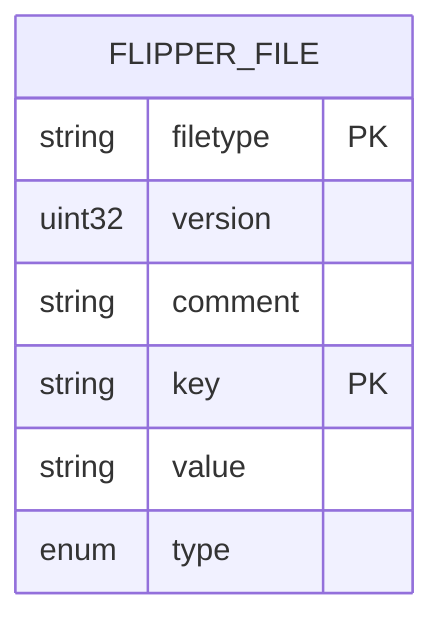
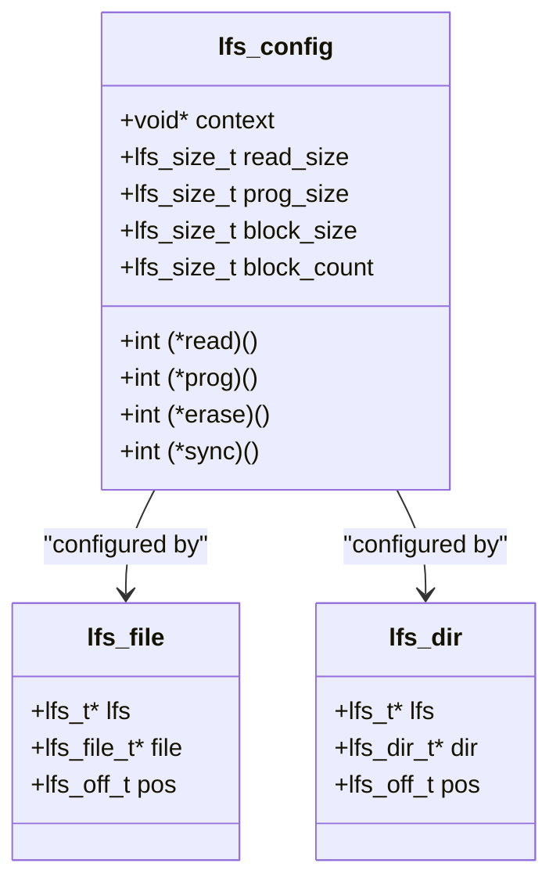
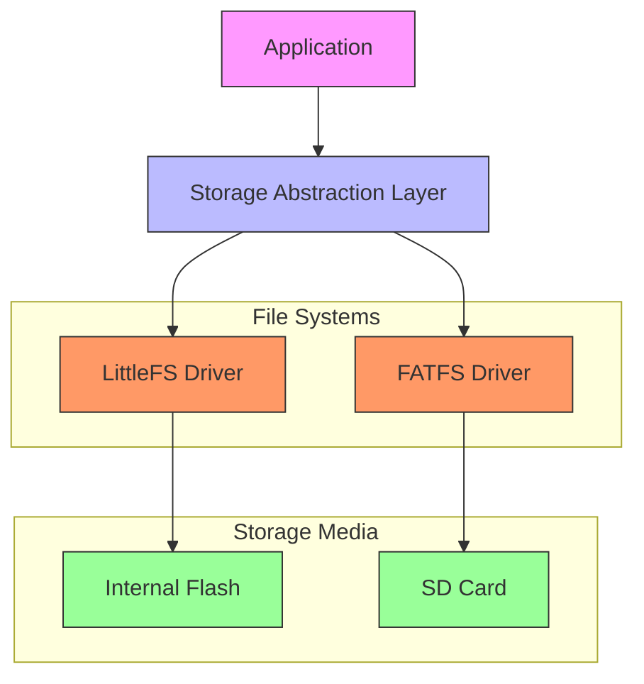

# Data Persistence

<cite>
**Referenced Files in This Document**   
- [flipper_format.h](file://lib/flipper_format/flipper_format.h)
- [flipper_format.c](file://lib/flipper_format/flipper_format.c)
- [flipper_format_stream.h](file://lib/flipper_format/flipper_format_stream.h)
- [lfs.h](file://lib/littlefs/lfs.h)
- [lfs.c](file://lib/littlefs/lfs.c)
- [ff.h](file://lib/fatfs/ff.h)
- [ff.c](file://lib/fatfs/ff.c)
</cite>

## Table of Contents
1. [Introduction](#introduction)
2. [Flipper Format Serialization System](#flipper-format-serialization-system)
3. [File System Implementations](#file-system-implementations)
4. [Storage Abstraction Layer](#storage-abstraction-layer)
5. [Data Access Patterns and Performance](#data-access-patterns-and-performance)
6. [Data Lifecycle Management](#data-lifecycle-management)

## Introduction
This document provides comprehensive documentation for the data persistence system in the Flipper Zero firmware. The system is designed to provide reliable, efficient, and structured data storage on embedded devices with limited resources. The architecture consists of three main components: the Flipper Format serialization system for structured data representation, LittleFS and FATFS file systems for storage management, and a storage abstraction layer that provides unified access to both internal and external storage. This documentation details the implementation, integration, and usage patterns of these components, providing developers with the information needed to effectively work with the data persistence system.

## Flipper Format Serialization System

The Flipper Format serialization system provides a simple yet effective key-value storage format for structured data in text files. It is designed to be human-readable while maintaining efficient parsing and writing capabilities on resource-constrained embedded devices.

### Key-Value Structure and Data Types

The Flipper Format uses a straightforward text-based structure where each line represents a key-value pair separated by ": ". Lines starting with "#" are treated as comments and ignored during parsing. The format supports several data types:

- **String**: Text values stored as UTF-8 encoded strings
- **Int32**: 32-bit signed integers
- **Uint32**: 32-bit unsigned integers  
- **Float**: Floating-point numbers
- **Hex**: Hexadecimal byte arrays

The format begins with a header containing mandatory "Filetype" and "Version" fields, which identify the file type and version for compatibility checking. This header is followed by optional comments and the actual data fields.



**Diagram sources**
- [flipper_format.h](file://lib/flipper_format/flipper_format.h#L20-L150)

### Stream Interface and Implementation

The Flipper Format system is built on a stream-based interface that abstracts the underlying storage mechanism. The core structure is the `FlipperFormat` type, which contains a pointer to a `Stream` object and a boolean flag for strict mode operation.

The implementation uses a layered architecture where the high-level `FlipperFormat` API delegates to lower-level stream operations. This design allows the same serialization logic to work with different stream types, including string streams (for in-memory operations) and file streams (for persistent storage).

```c
struct FlipperFormat {
    Stream* stream;
    bool strict_mode;
};
```

The system provides separate allocation functions for different use cases:
- `flipper_format_string_alloc()` for in-memory operations
- `flipper_format_file_alloc()` for direct file operations  
- `flipper_format_buffered_file_alloc()` for buffered file operations

**Section sources**
- [flipper_format.c](file://lib/flipper_format/flipper_format.c#L25-L50)
- [flipper_format.h](file://lib/flipper_format/flipper_format.h#L150-L200)

### Data Operations and Error Handling

The Flipper Format API provides comprehensive functions for reading and writing data with proper error handling. All operations return boolean values indicating success or failure, following the convention of the underlying firmware.

Writing operations follow a pattern of allocation, configuration, and cleanup:

```c
FlipperFormat* format = flipper_format_file_alloc(storage);
if(flipper_format_file_open_new(format, "/ext/config.fcf")) {
    flipper_format_write_header_cstr(format, "Flipper Configuration", 1);
    flipper_format_write_string_cstr(format, "Theme", "Dark");
    flipper_format_write_uint32(format, "Brightness", &value, 1);
}
flipper_format_free(format);
```

Reading operations similarly use a structured approach with error checking at each step:

```c
FlipperFormat* file = flipper_format_file_alloc(storage);
FuriString* theme = furi_string_alloc();
uint32_t brightness;
if(flipper_format_file_open_existing(file, "/ext/config.fcf")) {
    if(flipper_format_read_header(file, file_type, &version)) {
        flipper_format_read_string(file, "Theme", theme);
        flipper_format_read_uint32(file, "Brightness", &brightness, 1);
    }
}
furi_string_free(theme);
flipper_format_free(file);
```

The system includes functions for checking key existence, getting value counts, and seeking within files, providing a complete toolkit for data manipulation.

**Section sources**
- [flipper_format.h](file://lib/flipper_format/flipper_format.h#L200-L400)
- [flipper_format.c](file://lib/flipper_format/flipper_format.c#L200-L500)

## File System Implementations

The data persistence system supports two file systems: LittleFS for internal flash storage and FATFS for external SD cards. These file systems are chosen for their reliability, performance characteristics, and suitability for embedded applications.

### LittleFS Implementation

LittleFS is a lightweight, reliable file system designed specifically for microcontrollers and other resource-constrained systems. It features power-loss resilience, wear leveling, and low RAM usage, making it ideal for internal flash storage.

The LittleFS implementation is configured through the `lfs_config` structure, which defines the block device operations and sizing parameters:

```c
struct lfs_config {
    void *context;
    int (*read)(const struct lfs_config *c, lfs_block_t block, lfs_off_t off, void *buffer, lfs_size_t size);
    int (*prog)(const struct lfs_config *c, lfs_block_t block, lfs_off_t off, const void *buffer, lfs_size_t size);
    int (*erase)(const struct lfs_config *c, lfs_block_t block);
    int (*sync)(const struct lfs_config *c);
    lfs_size_t read_size;
    lfs_size_t prog_size;
    lfs_size_t block_size;
    lfs_size_t block_count;
    // ... additional configuration fields
};
```

Key features of the LittleFS implementation include:
- **Power-loss resilience**: Uses a log-structured design with metadata pairs to ensure consistency
- **Wear leveling**: Distributes writes across the flash to extend lifespan
- **Static RAM usage**: Requires only a fixed amount of RAM regardless of file system size
- **Fragmentation resistance**: Uses a greedy merge strategy to minimize fragmentation

The file system supports standard operations including file creation, reading, writing, and directory management, with error codes defined for various failure conditions.



**Diagram sources**
- [lfs.h](file://lib/littlefs/lfs.h#L200-L300)
- [lfs.c](file://lib/littlefs/lfs.c#L50-L100)

### FATFS Implementation

FATFS is a generic FAT file system module that provides compatibility with standard SD cards and other removable storage. It supports FAT12, FAT16, and FAT32 formats, ensuring broad compatibility with existing storage devices and computer systems.

The FATFS implementation is configured through compile-time options in `ffconf.h` and runtime configuration of the disk I/O layer. Key configuration options include:
- `_FS_READONLY`: Enable read-only operation
- `_FS_MINIMIZE`: Reduce API functions for smaller footprint
- `_USE_LFN`: Enable long file name support
- `_CODE_PAGE`: Set the character encoding

The file system object structure (`FATFS`) maintains state information including:
- File system type and drive number
- FAT parameters (number of FATs, cluster size)
- Cache management (disk access window)
- Free cluster tracking
- Current directory information

```c
typedef struct {
    BYTE fs_type;
    BYTE drv;
    BYTE n_fats;
    BYTE wflag;
    WORD id;
    WORD n_rootdir;
    WORD csize;
    DWORD last_clst;
    DWORD free_clst;
    DWORD cdir;
    DWORD n_fatent;
    DWORD fsize;
    DWORD volbase;
    DWORD fatbase;
    DWORD dirbase;
    DWORD database;
    DWORD winsect;
    BYTE win[_MAX_SS];
} FATFS;
```

FATFS provides a comprehensive API for file and directory operations, with error codes returned for various conditions such as disk full, file not found, and invalid parameters.

**Section sources**
- [ff.h](file://lib/fatfs/ff.h#L100-L300)
- [ff.c](file://lib/fatfs/ff.c#L50-L150)

## Storage Abstraction Layer

The storage abstraction layer provides a unified interface for accessing both internal (LittleFS) and external (FATFS) storage, hiding the differences between file systems and simplifying application development.

### Unified Storage Interface

The abstraction layer presents a consistent API for storage operations regardless of the underlying file system. This allows applications to work with files without knowing whether they are stored on internal flash or an SD card.

The core interface includes functions for:
- File operations (open, close, read, write, seek)
- Directory operations (create, remove, list)
- File system operations (mount, unmount, info)
- Path manipulation and validation

This abstraction enables features like the "Apps on SD Card" functionality, where applications can be loaded from either internal or external storage transparently.

### Integration with File Systems

The storage service integrates with both LittleFS and FATFS through a driver architecture. Each file system has a corresponding driver that implements the common storage interface.

For LittleFS, the integration involves:
- Mapping LittleFS error codes to the common error space
- Converting between LittleFS file handles and the abstraction layer's file descriptors
- Managing the lifecycle of the LittleFS file system object

For FATFS, the integration includes:
- Implementing the disk I/O functions required by FATFS
- Managing the FATFS file system object per drive
- Handling the differences in path syntax and limitations

The abstraction layer also handles mount point management, automatically mounting file systems when storage devices are detected and unmounting them when removed.



**Diagram sources**
- [lfs.h](file://lib/littlefs/lfs.h)
- [ff.h](file://lib/fatfs/ff.h)

**Section sources**
- [lfs.h](file://lib/littlefs/lfs.h#L50-L100)
- [ff.h](file://lib/fatfs/ff.h#L50-L100)

## Data Access Patterns and Performance

Understanding data access patterns and performance characteristics is crucial for developing efficient applications on the Flipper Zero platform.

### Common Data Access Patterns

Applications typically follow several common patterns when accessing persistent data:

**Configuration Files**: Small files read at startup and occasionally written when settings change. These benefit from the Flipper Format's human-readable structure and versioning.

**Application Data**: Files specific to individual applications, often using Flipper Format for structured data or binary formats for efficiency.

**System Settings**: Critical system information that requires reliable storage with power-loss protection, typically stored on the internal LittleFS file system.

**User Files**: Larger files created by users, such as infrared captures or sub-GHz recordings, often stored on SD cards using FATFS for compatibility.

### Caching Strategies

The storage system employs several caching strategies to improve performance:

**Read Caching**: Both LittleFS and FATFS implement read caching to reduce flash wear and improve access speed. LittleFS uses a block cache that stores recently accessed blocks, while FATFS uses a sector cache (the "win" buffer).

**Write Buffering**: The `flipper_format_buffered_file_alloc()` function provides write buffering, reducing the number of physical writes by batching operations.

**Metadata Caching**: Frequently accessed metadata, such as directory entries and file sizes, is cached to avoid repeated disk access.

### Performance Considerations

Several factors affect storage performance on the Flipper Zero:

**Flash Wear**: Internal flash has a limited number of write cycles. The system mitigates this through wear leveling (LittleFS) and by encouraging use of SD cards for frequently written data.

**Access Speed**: SD cards typically offer faster sequential access than internal flash, but with higher latency for random access.

**Memory Usage**: File system operations require RAM for buffers and metadata. LittleFS is designed for low memory usage, while FATFS with long file name support requires more RAM.

**Power Consumption**: Storage operations consume power, with SD card access typically using more power than internal flash operations.

Applications should consider these factors when designing their data persistence strategy, balancing performance, reliability, and resource usage.

**Section sources**
- [lfs.h](file://lib/littlefs/lfs.h#L150-L200)
- [ff.h](file://lib/fatfs/ff.h#L150-L200)
- [flipper_format.h](file://lib/flipper_format/flipper_format.h#L100-L150)

## Data Lifecycle Management

Effective data lifecycle management ensures data integrity, optimizes storage usage, and provides a good user experience.

### Data Retention Policies

The system implements different retention policies based on data type and location:

**Internal Storage**: Data on internal flash is considered critical and is protected against accidental deletion. System settings and firmware files follow strict retention policies.

**External Storage**: Data on SD cards follows more flexible policies, allowing users to manage storage space freely. Applications should handle the possibility of storage removal or corruption.

**Temporary Data**: Some applications create temporary files that are automatically cleaned up on reboot or when no longer needed.

### Error Recovery Mechanisms

The storage system includes several mechanisms for error recovery:

**Power-Loss Protection**: Both LittleFS and the Flipper Format system are designed to recover from unexpected power loss without corruption.

**File System Check**: The system can detect and repair certain types of file system corruption, particularly on FATFS volumes.

**Fallback Mechanisms**: Critical system data often has backup copies or default values that can be used if the primary data is corrupted.

**Graceful Degradation**: When storage errors occur, the system attempts to continue operation with reduced functionality rather than failing completely.

Applications should implement appropriate error handling, checking return values from storage operations and providing meaningful feedback to users when errors occur.

**Section sources**
- [lfs.h](file://lib/littlefs/lfs.h#L50-L100)
- [ff.h](file://lib/fatfs/ff.h#L50-L100)
- [flipper_format.h](file://lib/flipper_format/flipper_format.h#L50-L100)