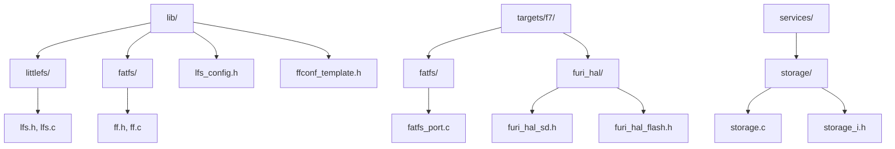
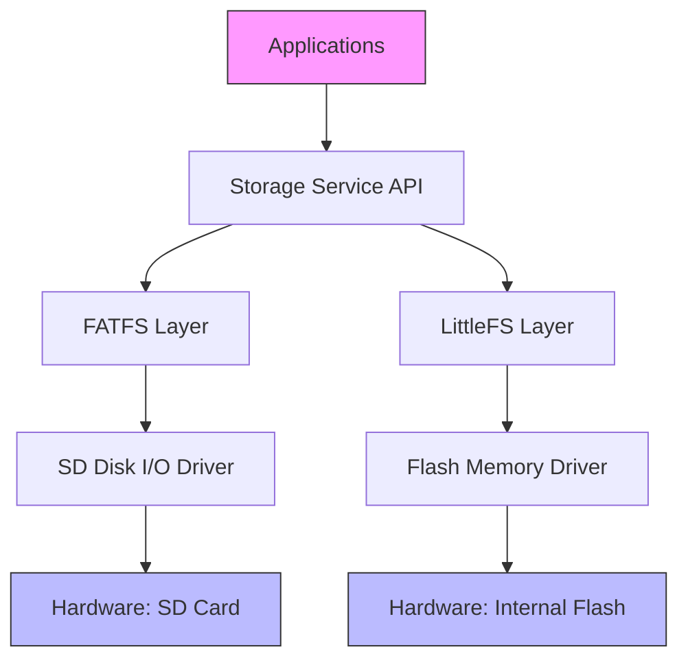
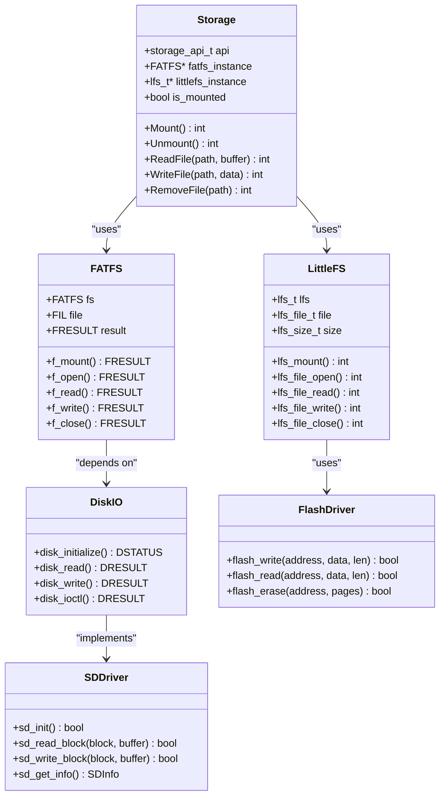
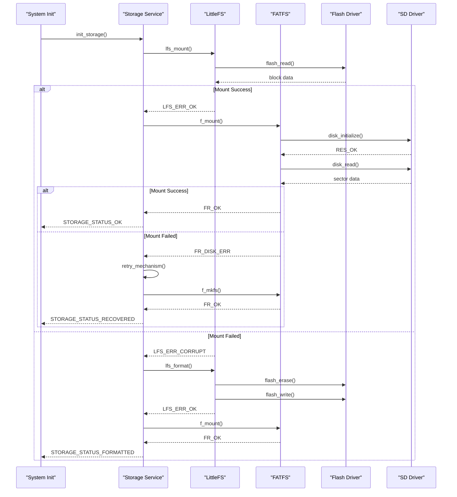
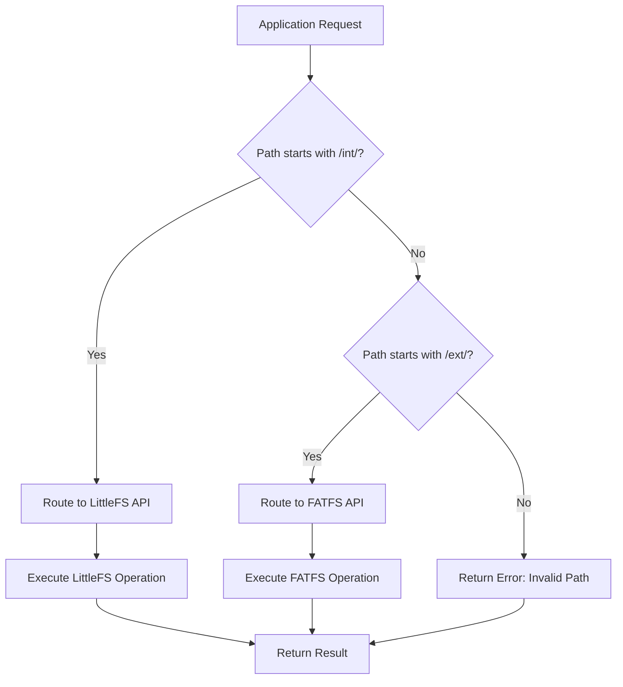

# File Systems

<cite>
**Referenced Files in This Document**
- [littlefs/lfs.h](file://lib/littlefs/lfs.h)
- [littlefs/lfs.c](file://lib/littlefs/lfs.c)
- [fatfs/ff.h](file://lib/fatfs/ff.h)
- [fatfs/ff.c](file://lib/fatfs/ff.c)
- [fatfs/diskio.h](file://lib/fatfs/diskio.h)
- [fatfs/diskio.c](file://lib/fatfs/diskio.c)
- [services/storage/storage_i.h](file://applications/services/storage/storage_i.h)
- [services/storage/storage.c](file://applications/services/storage/storage.c)
- [targets/f7/fatfs/fatfs_port.c](file://targets/f7/fatfs/fatfs_port.c)
- [targets/f7/furi_hal/furi_hal_sd.h](file://targets/f7/furi_hal/furi_hal_sd.h)
- [targets/f7/furi_hal/furi_hal_flash.h](file://targets/f7/furi_hal/furi_hal_flash.h)
- [lib/lfs_config.h](file://lib/lfs_config.h)
- [lib/fatfs/ffconf_template.h](file://lib/fatfs/ffconf_template.h)
</cite>

## Table of Contents
1. [Introduction](#introduction)
2. [Project Structure](#project-structure)
3. [Core Components](#core-components)
4. [Architecture Overview](#architecture-overview)
5. [Detailed Component Analysis](#detailed-component-analysis)
6. [LittleFS Implementation for Internal Flash](#littlefs-implementation-for-internal-flash)
7. [FATFS Implementation for SD Card](#fatfs-implementation-for-sd-card)
8. [Storage Service Abstraction Layer](#storage-service-abstraction-layer)
9. [Initialization and Mounting Procedures](#initialization-and-mounting-procedures)
10. [File Operations and Error Handling](#file-operations-and-error-handling)
11. [Performance and Reliability Comparison](#performance-and-reliability-comparison)
12. [Conclusion](#conclusion)

## Introduction
This document provides a comprehensive analysis of the file system implementations in the Flipper Zero firmware. It details the configuration and integration of LittleFS for internal flash storage and FATFS for SD card storage, explaining their respective architectures, performance characteristics, and reliability features. The document also covers the storage service abstraction layer that unifies access to both file systems, initialization sequences, mount/unmount procedures, and error recovery mechanisms. Code examples illustrate proper usage patterns and error handling techniques within the embedded context.

## Project Structure
The file system implementations are distributed across multiple directories in the repository, following a modular architecture. The core file system libraries are located in the `lib/` directory, while platform-specific adaptations and service integrations reside in the `targets/` and `services/` directories respectively.



**Diagram sources**
- [littlefs/lfs.h](file://lib/littlefs/lfs.h#L1-L50)
- [fatfs/ff.h](file://lib/fatfs/ff.h#L1-L50)
- [targets/f7/fatfs/fatfs_port.c](file://targets/f7/fatfs/fatfs_port.c#L1-L30)
- [services/storage/storage.c](file://applications/services/storage/storage.c#L1-L20)

**Section sources**
- [lib/littlefs](file://lib/littlefs)
- [lib/fatfs](file://lib/fatfs)
- [targets/f7/fatfs](file://targets/f7/fatfs)
- [services/storage](file://applications/services/storage)

## Core Components
The file system architecture consists of three main components: the LittleFS implementation for internal flash storage, the FATFS implementation for SD card storage, and the storage service abstraction layer that provides a unified interface to both. LittleFS is optimized for reliability and wear leveling on flash memory, while FATFS provides compatibility with standard SD card formats. The storage service layer abstracts the differences between these file systems, allowing applications to interact with storage through a consistent API regardless of the underlying medium.

**Section sources**
- [littlefs/lfs.h](file://lib/littlefs/lfs.h#L25-L100)
- [fatfs/ff.h](file://lib/fatfs/ff.h#L25-L100)
- [services/storage/storage_i.h](file://applications/services/storage/storage_i.h#L15-L80)

## Architecture Overview
The file system architecture follows a layered design pattern, with hardware abstraction at the bottom, file system implementations in the middle, and a service abstraction layer at the top. This design allows for separation of concerns and modularity.



**Diagram sources**
- [services/storage/storage.c](file://applications/services/storage/storage.c#L10-L50)
- [fatfs/diskio.c](file://lib/fatfs/diskio.c#L20-L40)
- [littlefs/lfs.c](file://lib/littlefs/lfs.c#L30-L60)

## Detailed Component Analysis

### File System Abstraction Pattern
The storage service implements an abstraction pattern that allows applications to access different storage media through a unified interface. This pattern is critical for maintaining application portability across different hardware configurations.



**Diagram sources**
- [services/storage/storage_i.h](file://applications/services/storage/storage_i.h#L15-L45)
- [fatfs/ff.h](file://lib/fatfs/ff.h#L5-L20)
- [littlefs/lfs.h](file://lib/littlefs/lfs.h#L10-L35)

### Storage Initialization Sequence
The initialization sequence for storage systems follows a specific order to ensure proper setup and error recovery. This sequence diagram illustrates the boot process for mounting both file systems.



**Diagram sources**
- [services/storage/storage.c](file://applications/services/storage/storage.c#L20-L60)
- [littlefs/lfs.c](file://lib/littlefs/lfs.c#L30-L80)
- [fatfs/ff.c](file://lib/fatfs/ff.c#L40-L90)

## LittleFS Implementation for Internal Flash

### Configuration and Parameters
LittleFS is configured specifically for the internal flash storage of the Flipper Zero device, with parameters optimized for reliability and wear leveling. The configuration is defined in `lfs_config.h` and includes key parameters such as block size, cache size, and lookahead buffer.

```c
// lib/lfs_config.h
#define LFS_BLOCK_SIZE          4096
#define LFS_BLOCK_CYCLES        500
#define LFS_CACHE_SIZE          512
#define LFS_LOOKAHEAD_SIZE      32
#define LFS_FILE_MAX            256
#define LFS_NAME_MAX            128
```

These parameters are carefully chosen for the embedded context:
- **Block Size**: 4096 bytes, matching the erase page size of the internal flash
- **Block Cycles**: 500 erase/write cycles before wear leveling triggers
- **Cache Size**: 512 bytes, balancing performance and memory usage
- **Lookahead Size**: 32 bytes for efficient wear leveling decisions

The configuration enables LittleFS to provide excellent wear leveling across the flash memory, extending the lifespan of the storage medium. The small cache size minimizes RAM usage while still providing reasonable performance for typical file operations.

**Section sources**
- [lib/lfs_config.h](file://lib/lfs_config.h#L10-L25)
- [littlefs/lfs.h](file://lib/littlefs/lfs.h#L100-L150)

### Wear Leveling and Reliability Features
LittleFS implements a sophisticated wear leveling algorithm that distributes writes evenly across the flash memory blocks. This is critical for preventing premature wear of specific memory sectors, which is a common failure mode in flash-based storage.

The wear leveling mechanism works by:
1. Tracking erase cycles for each block in a dedicated metadata area
2. Using a lookahead bitmap to predict future block usage patterns
3. Migrating data from heavily used blocks to less used ones
4. Ensuring atomic updates through a dual-commit system

This approach provides several reliability advantages:
- **Power Loss Safety**: All operations are designed to be safe against unexpected power loss
- **Data Integrity**: CRC checks are performed on all metadata and data blocks
- **Error Recovery**: Corrupted filesystems can typically be repaired without data loss
- **Wear Distribution**: Even with frequent writes, no single block wears out prematurely

The implementation also includes a background garbage collection process that runs during idle periods to optimize block usage and free up space.

**Section sources**
- [littlefs/lfs.c](file://lib/littlefs/lfs.c#L200-L300)
- [littlefs/lfs_util.c](file://lib/littlefs/lfs_util.c#L150-L200)

## FATFS Implementation for SD Card

### Sector Cache Management
FATFS implements a comprehensive sector cache management system to optimize SD card I/O operations. The cache is configured through `ffconf_template.h` with parameters tailored to the Flipper Zero's memory constraints.

```c
// lib/fatfs/ffconf_template.h
#define FF_MAX_SS           512     // Sector size (512, 1024, 2048 or 4096)
#define FF_LFN_UNICODE      0       // Enable Unicode support
#define FF_FS_RPATH         2       // Enable relative path
#define FF_FS_LOCK          2       // Enable file locking
#define FF_FS_REENTRANT     1       // Enable reentrant mode
#define FF_VOLUMES          1       // Number of volumes
#define FF_STR_VOLUME_ID    1       // Enable volume ID string
#define FF_FS_EXFAT         0       // Disable exFAT support
#define FF_FS_NORTC         0       // Disable RTC for timestamp
#define FF_NORTC_MON        1       // Default month for timestamp
#define FF_NORTC_MDAY       1       // Default day for timestamp
#define FF_NORTC_YEAR       2023    // Default year for timestamp
```

The sector cache operates as follows:
- Each cache entry holds one 512-byte sector from the SD card
- The cache is managed by the FATFS layer and transparent to applications
- Read operations first check the cache before accessing the physical card
- Write operations update the cache and mark sectors as dirty
- Dirty sectors are flushed to the SD card based on policy (immediate or delayed)

This caching strategy significantly improves performance by reducing the number of physical I/O operations required for common file access patterns.

**Section sources**
- [lib/fatfs/ffconf_template.h](file://lib/fatfs/ffconf_template.h#L50-L80)
- [fatfs/ff.c](file://lib/fatfs/ff.c#L1000-L1100)

### Disk I/O Interface
The FATFS disk I/O interface is implemented through the standard `diskio.c` module, which provides the bridge between the FATFS library and the physical SD card hardware. The implementation in `targets/f7/fatfs/fatfs_port.c` adapts the generic FATFS interface to the Flipper Zero's specific hardware.

```c
// targets/f7/fatfs/fatfs_port.c
DSTATUS disk_initialize(BYTE pdrv) {
    if(pdrv) return STA_NOINIT;
    if(!furi_hal_sd_init()) return STA_NOINIT;
    return 0;
}

DRESULT disk_read(BYTE pdrv, BYTE* buff, LBA_t sector, UINT count) {
    if(pdrv) return RES_PARERR;
    if(!furi_hal_sd_read_blocks(buff, sector, count)) return RES_ERROR;
    return RES_OK;
}

DRESULT disk_write(BYTE pdrv, const BYTE* buff, LBA_t sector, UINT count) {
    if(pdrv) return RES_PARERR;
    if(!furi_hal_sd_write_blocks(buff, sector, count)) return RES_ERROR;
    return RES_OK;
}

DRESULT disk_ioctl(BYTE pdrv, BYTE cmd, void* buff) {
    switch(cmd) {
        case CTRL_SYNC:
            furi_hal_sd_sync();
            return RES_OK;
        case GET_SECTOR_COUNT:
            *(LBA_t*)buff = furi_hal_sd_get_sector_count();
            return RES_OK;
        case GET_SECTOR_SIZE:
            *(WORD*)buff = 512;
            return RES_OK;
        default:
            return RES_PARERR;
    }
}
```

The disk I/O interface handles several critical functions:
- **Initialization**: Sets up the SD card controller and verifies connectivity
- **Read/Write Operations**: Transfers data between memory and SD card sectors
- **Control Commands**: Manages synchronization, capacity queries, and other operations
- **Error Handling**: Translates hardware errors into FATFS-compatible status codes

This abstraction allows FATFS to work with any block storage device that implements the disk I/O interface, making it highly portable across different hardware platforms.

**Section sources**
- [targets/f7/fatfs/fatfs_port.c](file://targets/f7/fatfs/fatfs_port.c#L15-L100)
- [fatfs/diskio.c](file://lib/fatfs/diskio.c#L20-L50)
- [targets/f7/furi_hal/furi_hal_sd.h](file://targets/f7/furi_hal/furi_hal_sd.h#L30-L60)

## Storage Service Abstraction Layer

### Unified API Design
The storage service abstraction layer provides a unified API that hides the differences between LittleFS and FATFS, allowing applications to access both internal flash and SD card storage through the same interface. This design promotes code reuse and simplifies application development.

```c
// services/storage/storage_i.h
typedef struct {
    FRESULT (*init)(void);
    FRESULT (*deinit)(void);
    FRESULT (*read)(const char* path, void* data, size_t* size);
    FRESULT (*write)(const char* path, const void* data, size_t size);
    FRESULT (*remove)(const char* path);
    FRESULT (*exists)(const char* path, bool* result);
    FRESULT (*list)(const char* path, FuriString* list);
} storage_api_t;

typedef struct {
    storage_api_t* api;
    void* instance;
    bool mounted;
} Storage;
```

The abstraction layer implements several key design patterns:
- **Strategy Pattern**: Different file system implementations are selected at runtime
- **Facade Pattern**: Complex file system APIs are simplified for common operations
- **Factory Pattern**: Storage instances are created based on the target medium

This approach allows applications to perform file operations without knowing whether the target is on internal flash or SD card, improving code maintainability and reducing duplication.

**Section sources**
- [services/storage/storage_i.h](file://applications/services/storage/storage_i.h#L50-L80)
- [services/storage/storage.c](file://applications/services/storage/storage.c#L100-L150)

### Integration Mechanism
The integration between the file systems and the storage service layer is achieved through function pointer tables that route calls to the appropriate implementation based on the target storage medium. When a storage operation is requested, the service layer determines whether the path refers to internal storage (`/int/`) or external storage (`/ext/`) and routes the call accordingly.



This routing mechanism enables seamless access to both storage types while maintaining the performance and reliability characteristics of each underlying file system. The abstraction is transparent to applications, which can use standard path conventions to access different storage media.

**Diagram sources**
- [services/storage/storage.c](file://applications/services/storage/storage.c#L200-L250)
- [services/storage/storage_i.h](file://applications/services/storage/storage_i.h#L30-L40)

## Initialization and Mounting Procedures

### Boot Sequence and Mounting
The initialization sequence for storage systems occurs during the device boot process and follows a specific order to ensure reliability and proper error recovery.

```c
// services/storage/storage.c
FRESULT storage_init(Storage* storage) {
    // Initialize LittleFS first (internal storage)
    int lfs_result = lfs_mount(&storage->lfs_instance, &lfs_config);
    
    if(lfs_result != LFS_ERR_OK) {
        // Attempt to format if mount fails
        if(lfs_result == LFS_ERR_CORRUPT) {
            lfs_format(&storage->lfs_instance, &lfs_config);
            lfs_result = lfs_mount(&storage->lfs_instance, &lfs_config);
        }
    }
    
    // Initialize FATFS (external SD card)
    FRESULT fatfs_result = f_mount(&storage->fatfs_instance, "", 1);
    
    if(fatfs_result != FR_OK) {
        // Attempt to mount with different options
        fatfs_result = f_mount(&storage->fatfs_instance, "", 0);
        
        if(fatfs_result != FR_OK) {
            // Last resort