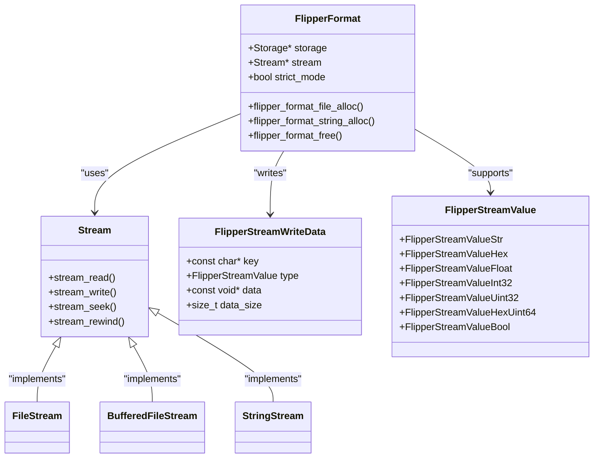
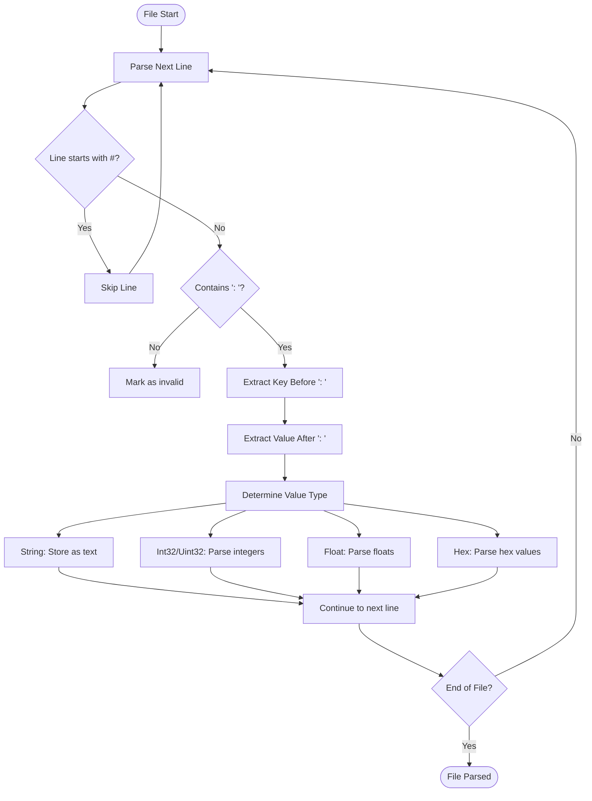
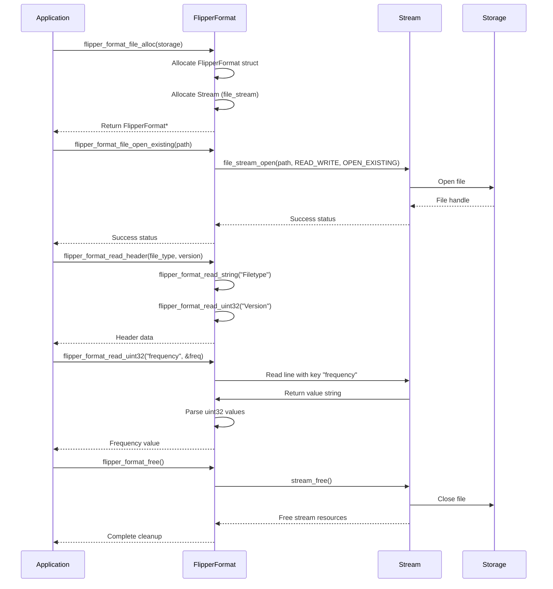
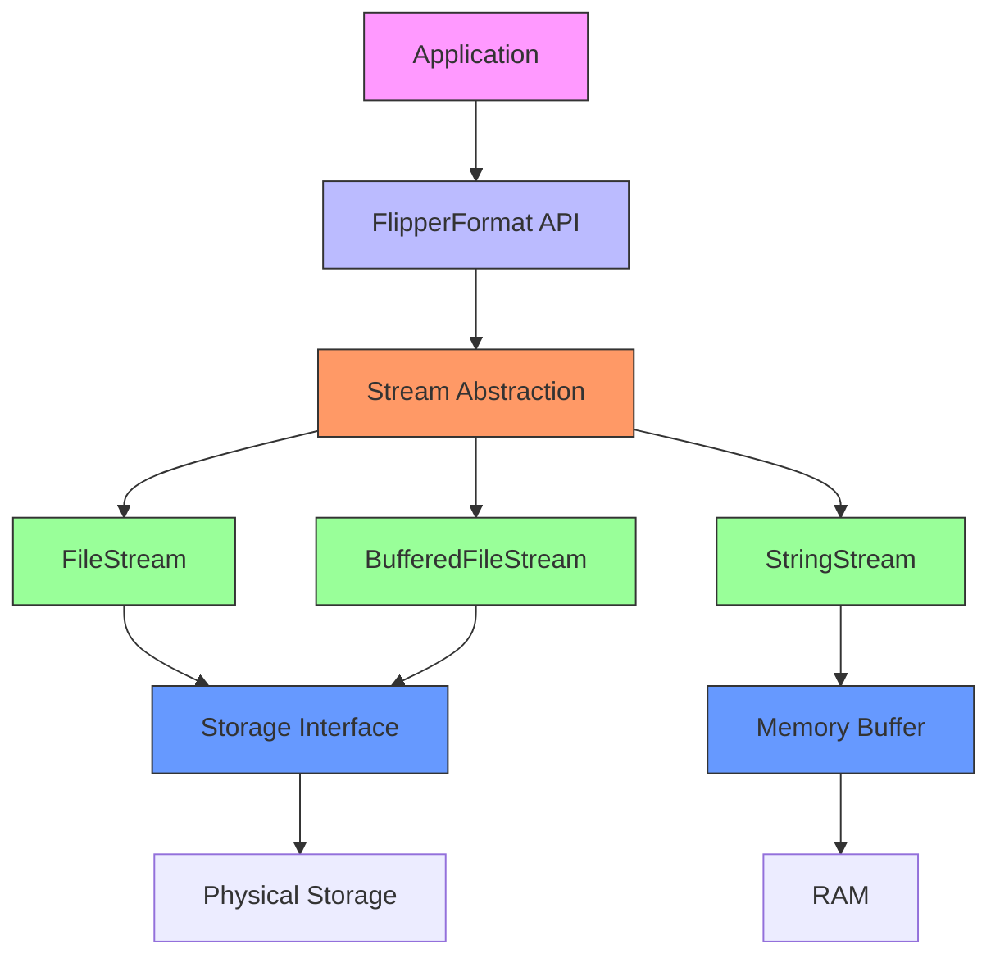
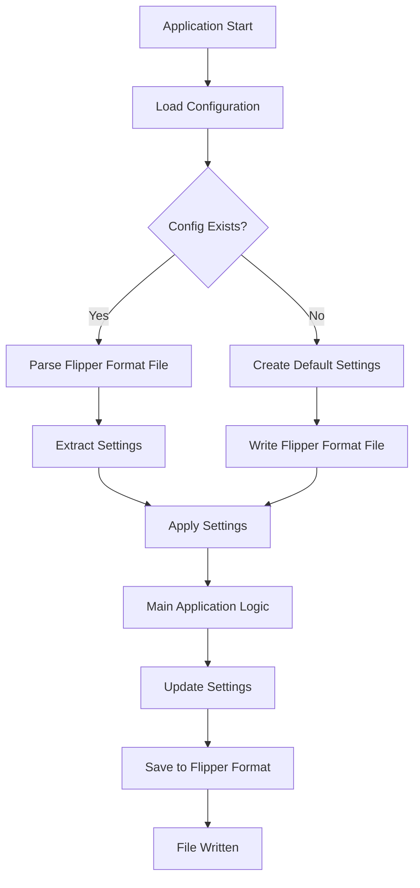

# Flipper Format

<cite>
**Referenced Files in This Document**   
- [flipper_format.h](file://lib/flipper_format/flipper_format.h)
- [flipper_format.c](file://lib/flipper_format/flipper_format.c)
- [flipper_format_stream.h](file://lib/flipper_format/flipper_format_stream.h)
- [flipper_format_stream.c](file://lib/flipper_format/flipper_format_stream.c)
- [genie_ini.c](file://applications/external/genie_recorder/genie_ini.c)
- [subghz_txrx_create_protocol_key.c](file://applications/main/subghz/helpers/subghz_txrx_create_protocol_key.c)
- [flipper_format_test.c](file://applications/debug/unit_tests/tests/flipper_format/flipper_format_test.c)
- [SubGhzFileFormats.md](file://documentation/file_formats/SubGhzFileFormats.md)
- [NfcFileFormats.md](file://documentation/file_formats/NfcFileFormats.md)
- [LfRfidFileFormat.md](file://documentation/file_formats/LfRfidFileFormat.md)
</cite>

## Table of Contents
1. [Introduction](#introduction)
2. [Core Architecture](#core-architecture)
3. [Data Model and File Format](#data-model-and-file-format)
4. [API Interface and Usage](#api-interface-and-usage)
5. [Stream-Based Implementation](#stream-based-implementation)
6. [Error Handling and Validation](#error-handling-and-validation)
7. [Real-World Application Examples](#real-world-application-examples)
8. [Performance Considerations](#performance-considerations)
9. [Conclusion](#conclusion)

## Introduction

The Flipper Format is a lightweight, text-based serialization system designed for embedded applications on the Flipper Zero platform. It provides a simple yet robust mechanism for storing structured data in files, configuration settings, and protocol information. The format is optimized for resource-constrained environments, offering efficient parsing and minimal memory footprint while maintaining human readability.

This documentation provides a comprehensive analysis of the Flipper Format system, covering its data model, API interface, implementation architecture, and practical usage patterns. The system is implemented in the `lib/flipper_format` directory and serves as the foundation for various application data storage needs across the Flipper Zero firmware.

**Section sources**
- [flipper_format.h](file://lib/flipper_format/flipper_format.h#L1-L50)

## Core Architecture

The Flipper Format system is built on a modular architecture that separates the high-level API from the underlying stream operations. This design enables the same data format to be used with different storage backends while maintaining a consistent interface.



**Diagram sources**
- [flipper_format.h](file://lib/flipper_format/flipper_format.h#L50-L100)
- [flipper_format.c](file://lib/flipper_format/flipper_format.c#L20-L50)

**Section sources**
- [flipper_format.h](file://lib/flipper_format/flipper_format.h#L1-L200)
- [flipper_format.c](file://lib/flipper_format/flipper_format.c#L1-L100)

## Data Model and File Format

The Flipper Format employs a key-value structure with a simple text-based syntax. The format is designed to be both human-readable and machine-parsable, making it suitable for configuration files, data storage, and protocol definitions.

### File Structure

A Flipper Format file consists of lines containing key-value pairs, comments, and optional headers. The basic structure follows this pattern:

```
# Commentary
Field name: field value
```

Key characteristics of the file format:
- Lines starting with `#` are treated as comments and ignored during parsing
- The key-value separator is the string `: `
- End of line is LF (Line Feed) when writing, but CR (Carriage Return) is supported when reading
- Whitespace handling is flexible, with leading and trailing spaces ignored

### Supported Data Types

The system supports several data types, each with specific encoding rules:

| Data Type | Format Example | Description |
|---------|--------------|-----------|
| **String** | `String: text` | Text values enclosed in the value field |
| **Int32** | `Int32: 1 2 -3 4` | Signed 32-bit integers, space-separated |
| **Uint32** | `Uint32: 1 2 3 4` | Unsigned 32-bit integers, space-separated |
| **Float** | `Float: 1.0 1234.654` | Floating-point numbers, space-separated |
| **Hex** | `Hex: A4 B3 C2 D1 12 FF` | Hexadecimal values, space-separated, case-insensitive |

### Header Structure

Files typically begin with a header that identifies the file type and version:

```
Filetype: Flipper Test File
Version: 1
```

The header serves as a validation mechanism, ensuring compatibility between different versions of applications and data formats.



**Diagram sources**
- [flipper_format.h](file://lib/flipper_format/flipper_format.h#L50-L150)
- [flipper_format_stream.c](file://lib/flipper_format/flipper_format_stream.c#L50-L200)

**Section sources**
- [flipper_format.h](file://lib/flipper_format/flipper_format.h#L1-L200)
- [SubGhzFileFormats.md](file://documentation/file_formats/SubGhzFileFormats.md#L1-L50)
- [NfcFileFormats.md](file://documentation/file_formats/NfcFileFormats.md#L1-L50)

## API Interface and Usage

The Flipper Format system provides a comprehensive API for creating, reading, and modifying files. The interface is designed to be intuitive and consistent across different operations.

### Initialization and Allocation

The system supports different allocation methods depending on the use case:

```c
// Allocate for file operations
FlipperFormat* file = flipper_format_file_alloc(storage);

// Allocate for string operations
FlipperFormat* string_format = flipper_format_string_alloc();

// Allocate for buffered file operations
FlipperFormat* buffered_file = flipper_format_buffered_file_alloc(storage);
```

### File Operations

The API provides various methods for opening files with different modes:

| Function | Purpose | Parameters |
|--------|--------|-----------|
| `flipper_format_file_open_existing()` | Open existing file for reading/writing | `path` |
| `flipper_format_file_open_append()` | Open file and append to end | `path` |
| `flipper_format_file_open_always()` | Create new file or overwrite existing | `path` |
| `flipper_format_file_open_new()` | Create new file (fails if exists) | `path` |

### Reading Operations

Reading data from a Flipper Format file follows a consistent pattern:

```c
// Example from genie_ini.c
void genie_ini_load(GenieApp* app) {
    Storage* storage = furi_record_open(RECORD_STORAGE);
    FuriString* buf = furi_string_alloc();
    
    FlipperFormat* ff = flipper_format_buffered_file_alloc(storage);
    
    do {
        uint32_t format_version;
        if(!flipper_format_buffered_file_open_existing(ff, GENIE_SETTINGS_FILE)) break;
        if(!flipper_format_read_header(ff, buf, &format_version)) break;
        
        uint32_t frequency;
        flipper_format_read_uint32(ff, "frequency", &frequency, 1);
        genie_app_set_frequency(app, frequency);
        
        if(flipper_format_read_string(ff, "path", buf)) {
            genie_app_update_file_path(app, furi_string_get_cstr(buf));
        }
    } while(false);
    
    flipper_format_free(ff);
    furi_record_close(RECORD_STORAGE);
    furi_string_free(buf);
}
```

### Writing Operations

Writing data follows a similar pattern with proper error handling:

```c
// Example from genie_ini.c
void genie_ini_save(GenieApp* app) {
    Storage* storage = furi_record_open(RECORD_STORAGE);
    FuriString* buf = furi_string_alloc();
    
    FlipperFormat* ff = flipper_format_buffered_file_alloc(storage);
    
    do {
        if(!flipper_format_buffered_file_open_always(ff, GENIE_SETTINGS_FILE)) break;
        if(!flipper_format_write_header_cstr(ff, GENIE_SETTINGS_NAME, GENIE_SETTINGS_VERSION)) break;
        
        uint32_t frequency = genie_app_get_frequency(app);
        flipper_format_write_uint32(ff, "frequency", &frequency, 1);
        
        const char* path = genie_app_get_file_path(app);
        flipper_format_write_string_cstr(ff, "path", path);
    } while(false);
    
    flipper_format_free(ff);
    furi_record_close(RECORD_STORAGE);
    furi_string_free(buf);
}
```



**Diagram sources**
- [flipper_format.h](file://lib/flipper_format/flipper_format.h#L100-L300)
- [flipper_format.c](file://lib/flipper_format/flipper_format.c#L100-L300)
- [genie_ini.c](file://applications/external/genie_recorder/genie_ini.c#L1-L80)

**Section sources**
- [flipper_format.h](file://lib/flipper_format/flipper_format.h#L1-L400)
- [flipper_format.c](file://lib/flipper_format/flipper_format.c#L1-L400)
- [genie_ini.c](file://applications/external/genie_recorder/genie_ini.c#L1-L80)

## Stream-Based Implementation

The Flipper Format system is built on a stream-based architecture that abstracts the underlying storage mechanism. This design allows the same API to work with files, strings, and other data sources.

### Stream Interface

The core of the implementation is the `Stream` abstraction, which provides a consistent interface for reading and writing data:

```c
// From flipper_format_stream.h
typedef struct {
    const char* key;
    FlipperStreamValue type;
    const void* data;
    size_t data_size;
} FlipperStreamWriteData;

bool flipper_format_stream_write_value_line(Stream* stream, FlipperStreamWriteData* write_data);
bool flipper_format_stream_read_value_line(Stream* stream, const char* key, FlipperStreamValue type, void* _data, size_t data_size, bool strict_mode);
```

### Key Operations

The stream implementation handles the low-level details of parsing and formatting:

```c
// Key reading algorithm
static bool flipper_format_stream_read_valid_key(Stream* stream, FuriString* key) {
    furi_string_reset(key);
    const size_t buffer_size = 32;
    uint8_t buffer[buffer_size];
    
    bool found = false;
    bool error = false;
    bool accumulate = true;
    bool new_line = true;
    
    while(true) {
        size_t was_read = stream_read(stream, buffer, buffer_size);
        if(was_read == 0) break;
        
        for(size_t i = 0; i < was_read; i++) {
            uint8_t data = buffer[i];
            if(data == flipper_format_eoln) {
                furi_string_reset(key);
                accumulate = true;
                new_line = true;
            } else if(data == flipper_format_comment && new_line) {
                accumulate = false;
                new_line = false;
            } else if(data == flipper_format_delimiter) {
                if(new_line) {
                    furi_string_reset(key);
                    accumulate = false;
                    new_line = false;
                } else {
                    if(accumulate) {
                        if(!stream_seek(stream, i - was_read, StreamOffsetFromCurrent)) {
                            error = true;
                            break;
                        }
                        found = true;
                        break;
                    }
                }
            } else {
                new_line = false;
                if(accumulate) {
                    furi_string_push_back(key, data);
                }
            }
        }
        if(found || error) break;
    }
    return found;
}
```

### Value Processing

The system processes different value types through a unified interface:

```c
// From flipper_format.c
bool flipper_format_write_string_cstr(
    FlipperFormat* flipper_format,
    const char* key,
    const char* data) {
    furi_check(flipper_format);
    FlipperStreamWriteData write_data = {
        .key = key,
        .type = FlipperStreamValueStr,
        .data = data,
        .data_size = 1,
    };
    bool result = flipper_format_stream_write_value_line(flipper_format->stream, &write_data);
    return result;
}
```



**Diagram sources**
- [flipper_format_stream.h](file://lib/flipper_format/flipper_format_stream.h#L1-L50)
- [flipper_format_stream.c](file://lib/flipper_format/flipper_format_stream.c#L1-L200)
- [flipper_format.c](file://lib/flipper_format/flipper_format.c#L1-L100)

**Section sources**
- [flipper_format_stream.h](file://lib/flipper_format/flipper_format_stream.h#L1-L100)
- [flipper_format_stream.c](file://lib/flipper_format/flipper_format_stream.c#L1-L300)

## Error Handling and Validation

The Flipper Format system implements robust error handling and validation mechanisms to ensure data integrity and prevent corruption.

### Error Handling Pattern

The API uses a consistent error handling pattern based on the `do-while(0)` idiom:

```c
// Example from unit tests
static bool test_read(const char* file_name) {
    Storage* storage = furi_record_open(RECORD_STORAGE);
    bool result = false;
    
    FlipperFormat* file = flipper_format_file_alloc(storage);
    FuriString* string_value = furi_string_alloc();
    uint32_t uint32_value;
    void* scratchpad = malloc(512);
    
    do {
        if(!flipper_format_file_open_existing(file, file_name)) break;
        if(!flipper_format_read_header(file, string_value, &uint32_value)) break;
        if(furi_string_cmp_str(string_value, test_filetype) != 0) break;
        if(uint32_value != test_version) break;
        
        // Additional validation checks...
        
        result = true;
    } while(false);
    
    // Cleanup resources
    free(scratchpad);
    furi_string_free(string_value);
    flipper_format_free(file);
    furi_record_close(RECORD_STORAGE);
    
    return result;
}
```

### Validation Mechanisms

The system includes several validation features:

1. **Strict Mode**: Controls how strictly the parser enforces format rules
2. **Header Validation**: Verifies file type and version compatibility
3. **Type Safety**: Ensures data is read and written with the correct type
4. **Bounds Checking**: Validates array sizes and data lengths

### Key Existence Checking

The system provides functions to check for key existence without loading the entire value:

```c
bool flipper_format_key_exist(FlipperFormat* flipper_format, const char* key) {
    size_t pos = stream_tell(flipper_format->stream);
    stream_seek(flipper_format->stream, 0, StreamOffsetFromStart);
    bool result = flipper_format_stream_seek_to_key(flipper_format->stream, key, false);
    stream_seek(flipper_format->stream, pos, StreamOffsetFromStart);
    return result;
}
```

**Section sources**
- [flipper_format_test.c](file://applications/debug/unit_tests/tests/flipper_format/flipper_format_test.c#L1-L200)
- [flipper_format.c](file://lib/flipper_format/flipper_format.c#L300-L400)

## Real-World Application Examples

The Flipper Format system is used extensively throughout the Flipper Zero firmware for various purposes, demonstrating its versatility and reliability.

### SubGhz Protocol Files

The SubGhz subsystem uses Flipper Format for storing radio signal data:

```
Filetype: Flipper SubGhz Key File
Version: 1
Frequency: 433920000
Preset: FuriHalSubGhzPresetOok650Async
Protocol: Princeton
Bit: 24
Key: 00 00 00 00 00 95 D5 D4
TE: 400
```

This example shows how the format stores both metadata (file type, version) and protocol-specific data (frequency, key, timing).

### NFC Device Files

NFC applications use Flipper Format to store card information:

```
Filetype: Flipper NFC device
Version: 4
Device type: Mifare Classic
UID: BA E2 7C 9D
ATQA: 00 02
SAK: 18
Mifare Classic type: 4K
Block 0: BA E2 7C 9D B9 18 02 00 46 44 53 37 30 56 30 31
Block 3: FF FF FF FF FF FF FF 07 80 69 FF FF FF FF FF FF
```

### LF RFID Keys

Low-frequency RFID keys are stored in a simple format:

```
Filetype: Flipper RFID key
Version: 1
Key type: EM4100
Data: 01 23 45 67 89
```

### Configuration Files

Applications use Flipper Format for configuration storage, as seen in the Genie Recorder:

```c
// Configuration save function
void genie_ini_save(GenieApp* app) {
    // ... initialization ...
    do {
        if(!flipper_format_buffered_file_open_always(ff, GENIE_SETTINGS_FILE)) break;
        if(!flipper_format_write_header_cstr(ff, GENIE_SETTINGS_NAME, GENIE_SETTINGS_VERSION)) break;
        
        uint32_t frequency = genie_app_get_frequency(app);
        flipper_format_write_uint32(ff, "frequency", &frequency, 1);
        
        const char* path = genie_app_get_file_path(app);
        flipper_format_write_string_cstr(ff, "path", path);
    } while(false);
    // ... cleanup ...
}
```

### Protocol Key Generation

The SubGhz system generates protocol keys using Flipper Format:

```c
bool subghz_txrx_gen_keeloq_protocol(
    SubGhzTxRx* instance,
    const char* preset_name,
    uint32_t frequency,
    uint32_t serial,
    uint8_t btn,
    uint16_t cnt,
    const char* manufacture_name) {
    // ... setup ...
    if(instance->transmitter &&
       subghz_protocol_keeloq_create_data(
           subghz_transmitter_get_protocol_instance(instance->transmitter),
           instance->fff_data,
           serial,
           btn,
           cnt,
           manufacture_name,
           instance->preset)) {
        flipper_format_write_string_cstr(instance->fff_data, "Manufacture", manufacture_name);
        res = true;
    }
    // ... cleanup ...
    return res;
}
```



**Diagram sources**
- [SubGhzFileFormats.md](file://documentation/file_formats/SubGhzFileFormats.md#L1-L100)
- [NfcFileFormats.md](file://documentation/file_formats/NfcFileFormats.md#L1-L100)
- [LfRfidFileFormat.md](file://documentation/file_formats/LfRfidFileFormat.md#L1-L50)
- [genie_ini.c](file://applications/external/genie_recorder/genie_ini.c#L1-L80)

**Section sources**
- [SubGhzFileFormats.md](file://documentation/file_formats/SubGhzFileFormats.md#L1-L300)
- [NfcFileFormats.md](file://documentation/file_formats/NfcFileFormats.md#L1-L300)
- [LfRfidFileFormat.md](file://documentation/file_formats/LfRfidFileFormat.md#L1-L50)
- [subghz_txrx_create_protocol_key.c](file://applications/main/subghz/helpers/subghz_txrx_create_protocol_key.c#L1-L200)

## Performance Considerations

The Flipper Format system is designed with performance and memory efficiency in mind, making it suitable for embedded systems with limited resources.

### Memory Usage

The system employs several strategies to minimize memory consumption:

1. **Stream-Based Processing**: Data is processed incrementally without loading the entire file into memory
2. **On-Demand Parsing**: Values are only parsed when explicitly requested
3. **Buffer Reuse**: Temporary buffers are reused across operations

### Embedded System Optimization

Key performance characteristics for embedded environments:

- **Low Memory Footprint**: The `FlipperFormat` struct is minimal, containing only a stream pointer and flags
- **Efficient String Handling**: Uses `FuriString` for dynamic string operations with minimal allocations
- **Direct Stream Access**: Allows applications to access the underlying stream for optimized operations

### Performance Trade-offs

The design makes several trade-offs to balance performance and functionality:

| Aspect | Optimization | Trade-off |
|------|-------------|---------|
| **Parsing Speed** | Incremental parsing | Slower random access |
| **Memory Usage** | Stream-based processing | Requires sequential access |
| **Error Recovery** | Strict validation | Less tolerant of malformed input |
| **Flexibility** | Multiple storage backends | Slight overhead from abstraction |

### Best Practices for Performance

When using the Flipper Format system on embedded platforms:

1. **Use Buffered Operations**: For frequent file access, use `flipper_format_buffered_file_alloc()`
2. **Minimize File Operations**: Open files once and perform multiple operations
3. **Use Appropriate Data Types**: Choose the most efficient type for your data
4. **Validate Early**: Check file headers and key existence before processing
5. **Clean Up Resources**: Always call `flipper_format_free()` to prevent memory leaks

**Section sources**
- [flipper_format.h](file://lib/flipper_format/flipper_format.h#L1-L100)
- [flipper_format.c](file://lib/flipper_format/flipper_format.c#L1-L200)

## Conclusion

The Flipper Format system provides a robust, efficient, and flexible solution for data serialization on the Flipper Zero platform. Its key-value structure, simple text-based format, and stream-based implementation make it well-suited for embedded applications with limited resources.

The system's architecture separates concerns effectively, with a clean API layer abstracting the underlying stream operations. This design enables consistent usage patterns across different applications while allowing for optimization through different storage backends.

Real-world examples demonstrate the format's versatility, from storing complex protocol data in SubGhz applications to simple configuration files in utility apps. The comprehensive error handling and validation mechanisms ensure data integrity, while the performance characteristics make it suitable for resource-constrained environments.

For developers working with the Flipper Zero platform, understanding the Flipper Format system is essential for creating applications that persist data reliably and efficiently. The combination of human-readable format, robust API, and embedded-friendly design makes it a cornerstone of the platform's data storage capabilities.