# Storage Service

<cite>
**Referenced Files in This Document**   
- [storage.h](file://applications/services/storage/storage.h)
- [storage.c](file://applications/services/storage/storage.c)
- [storage_i.h](file://applications/services/storage/storage_i.h)
- [storage_int.c](file://applications/services/storage/storages/storage_int.c)
- [storage_ext.c](file://applications/services/storage/storages/storage_ext.c)
- [lfs.h](file://lib/littlefs/lfs.h)
- [ff.h](file://lib/fatfs/ff.h)
- [storage_glue.h](file://applications/services/storage/storage_glue.h)
- [storage_processing.h](file://applications/services/storage/storage_processing.h)
- [filesystem_api_defines.h](file://applications/services/storage/filesystem_api_defines.h)
</cite>

## Table of Contents
1. [Introduction](#introduction)
2. [Project Structure](#project-structure)
3. [Core Components](#core-components)
4. [Architecture Overview](#architecture-overview)
5. [Detailed Component Analysis](#detailed-component-analysis)
6. [File System Drivers](#file-system-drivers)
7. [API Interface](#api-interface)
8. [Component Interactions](#component-interactions)
9. [Thread Safety and Asynchronous Operations](#thread-safety-and-asynchronous-operations)
10. [Cross-Cutting Concerns](#cross-cutting-concerns)
11. [System Context and Data Flow](#system-context-and-data-flow)

## Introduction
The Storage Service provides a unified abstraction layer for file system operations on the Flipper Zero device, enabling consistent access to both internal and external storage. This documentation details the architecture, API interface, and implementation of the storage service that unifies access to LittleFS for internal storage and FatFs for external SD card storage. The service provides a thread-safe, asynchronous interface for file operations, directory management, and storage information queries, serving as the foundation for all file system interactions in the Flipper Zero firmware.

## Project Structure
The storage service is organized in a modular architecture with clear separation between the abstraction layer, file system drivers, and client applications. The core implementation resides in the `applications/services/storage/` directory, with driver-specific code in the `storages/` subdirectory.

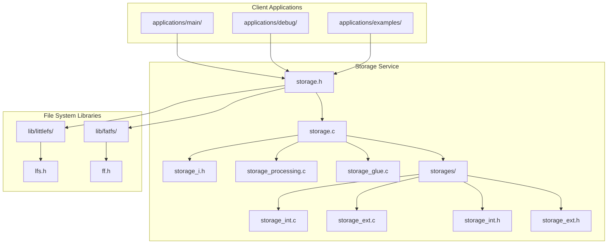

**Diagram sources**
- [storage.h](file://applications/services/storage/storage.h)
- [storage.c](file://applications/services/storage/storage.c)
- [storages/storage_int.c](file://applications/services/storage/storages/storage_int.c)
- [storages/storage_ext.c](file://applications/services/storage/storages/storage_ext.c)
- [lib/littlefs/lfs.h](file://lib/littlefs/lfs.h)
- [lib/fatfs/ff.h](file://lib/fatfs/ff.h)

**Section sources**
- [storage.h](file://applications/services/storage/storage.h)
- [storage.c](file://applications/services/storage/storage.c)

## Core Components
The storage service consists of several core components that work together to provide a unified interface for file system operations. The main components include the storage abstraction layer, internal storage driver (LittleFS), external storage driver (FatFs), message processing system, and glue layer that connects the components.

The service follows a service-oriented architecture where client applications interact with the storage service through a well-defined API, while the service handles the complexity of interacting with different file system drivers. The design emphasizes thread safety, power loss protection, and data integrity.

**Section sources**
- [storage.h](file://applications/services/storage/storage.h)
- [storage.c](file://applications/services/storage/storage.c)
- [storage_i.h](file://applications/services/storage/storage_i.h)

## Architecture Overview
The storage service implements a layered architecture that abstracts the differences between internal and external storage systems. The architecture follows a service pattern with message-based communication between components, ensuring thread safety and asynchronous operation.

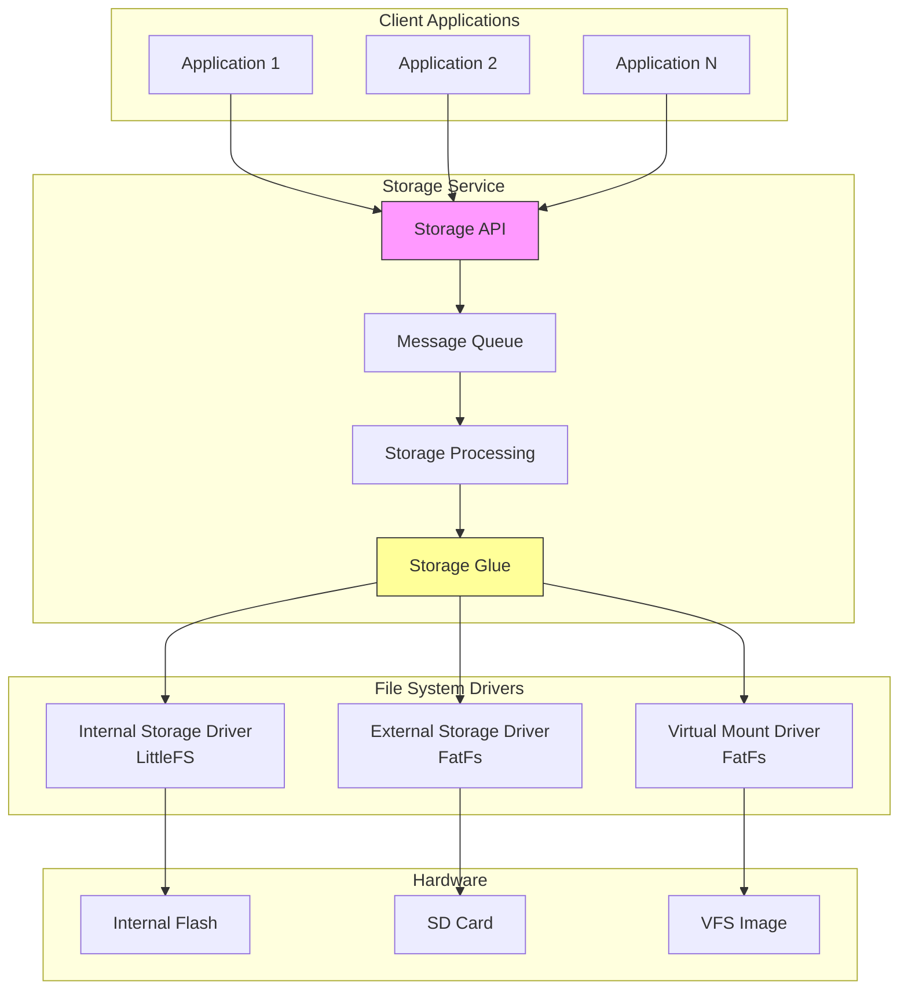

**Diagram sources**
- [storage.h](file://applications/services/storage/storage.h)
- [storage.c](file://applications/services/storage/storage.c)
- [storage_processing.c](file://applications/services/storage/storage_processing.c)
- [storage_glue.c](file://applications/services/storage/storage_glue.c)

## Detailed Component Analysis

### Storage Abstraction Layer
The storage abstraction layer provides a unified API for file system operations regardless of the underlying storage type. It handles path resolution, error translation, and request queuing.

```mermaid
classDiagram
class Storage {
+File* storage_file_alloc()
+void storage_file_free()
+FuriPubSub* storage_get_pubsub()
+bool storage_file_open()
+bool storage_file_close()
+size_t storage_file_read()
+size_t storage_file_write()
+bool storage_dir_open()
+bool storage_dir_read()
+FS_Error storage_common_remove()
+FS_Error storage_common_rename()
+FS_Error storage_common_mkdir()
}
class File {
+bool storage_file_is_open()
+bool storage_file_is_dir()
+size_t storage_file_read()
+size_t storage_file_write()
+bool storage_file_seek()
+uint64_t storage_file_tell()
+bool storage_file_eof()
}
class FileInfo {
+uint64_t size
+uint32_t timestamp
+bool is_dir
+char name[256]
}
class StorageEvent {
+StorageEventType type
}
enum StorageEventType {
CardMount
CardUnmount
CardMountError
FileClose
DirClose
}
Storage --> File : "creates/manages"
Storage --> FileInfo : "uses for stat"
Storage --> StorageEvent : "publishes via PubSub"
```

**Diagram sources**
- [storage.h](file://applications/services/storage/storage.h)
- [filesystem_api_defines.h](file://applications/services/storage/filesystem_api_defines.h)

### Message Processing System
The message processing system handles asynchronous operations and ensures thread safety through a message queue architecture.

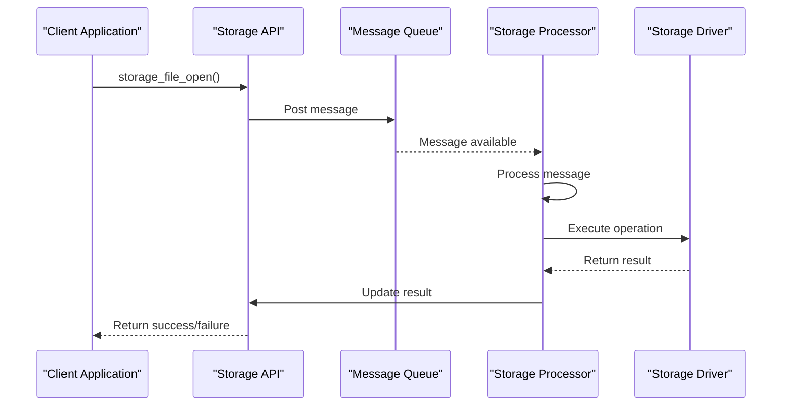

**Diagram sources**
- [storage.c](file://applications/services/storage/storage.c)
- [storage_processing.c](file://applications/services/storage/storage_processing.c)
- [storage_message.h](file://applications/services/storage/storage_message.h)

## File System Drivers

### Internal Storage Driver (LittleFS)
The internal storage driver implements the LittleFS file system for the device's internal flash memory. It provides wear leveling, power loss protection, and efficient storage utilization.

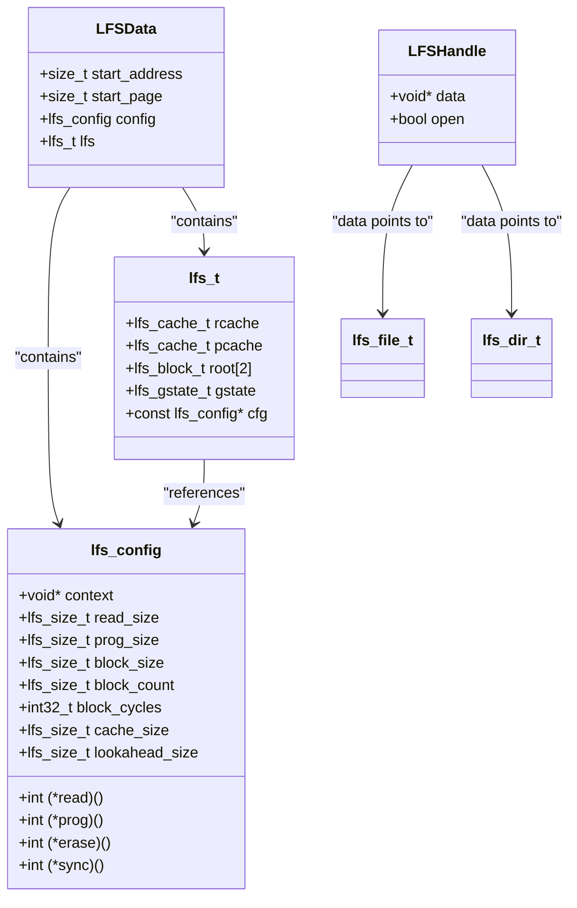

**Diagram sources**
- [storages/storage_int.c](file://applications/services/storage/storages/storage_int.c)
- [lib/littlefs/lfs.h](file://lib/littlefs/lfs.h)

### External Storage Driver (FatFs)
The external storage driver implements the FatFs file system for SD card storage, providing compatibility with standard FAT file systems.

```mermaid
classDiagram
class SDData {
+FATFS* fs
+const char* path
+bool sd_was_present
}
class FATFS {
+BYTE fs_type
+BYTE drv
+BYTE n_fats
+WORD id
+WORD n_rootdir
+WORD csize
+DWORD n_fatent
+DWORD fsize
+DWORD volbase
+DWORD fatbase
+DWORD dirbase
+DWORD database
+DWORD winsect
+BYTE win[_MAX_SS]
}
class FIL {
+_FDID obj
+BYTE flag
+BYTE err
+FSIZE_t fptr
+DWORD clust
+DWORD sect
+BYTE buf[_MAX_SS]
}
class DIR {
+_FDID obj
+DWORD dptr
+DWORD clust
+DWORD sect
+BYTE* dir
+BYTE fn[12]
}
class FILINFO {
+FSIZE_t fsize
+WORD fdate
+WORD ftime
+BYTE fattrib
+TCHAR fname[13]
}
enum FRESULT {
FR_OK
FR_DISK_ERR
FR_NOT_READY
FR_NO_FILE
FR_NO_PATH
FR_DENIED
FR_EXIST
FR_INVALID_OBJECT
FR_WRITE_PROTECTED
}
SDData --> FATFS : "contains pointer"
FATFS --> FIL : "manages files"
FATFS --> DIR : "manages directories"
FIL --> FILINFO : "returns info"
DIR --> FILINFO : "returns info"
```

**Diagram sources**
- [storages/storage_ext.c](file://applications/services/storage/storages/storage_ext.c)
- [lib/fatfs/ff.h](file://lib/fatfs/ff.h)

## API Interface

### File Operations
The storage service provides a comprehensive API for file operations, including opening, reading, writing, and closing files.

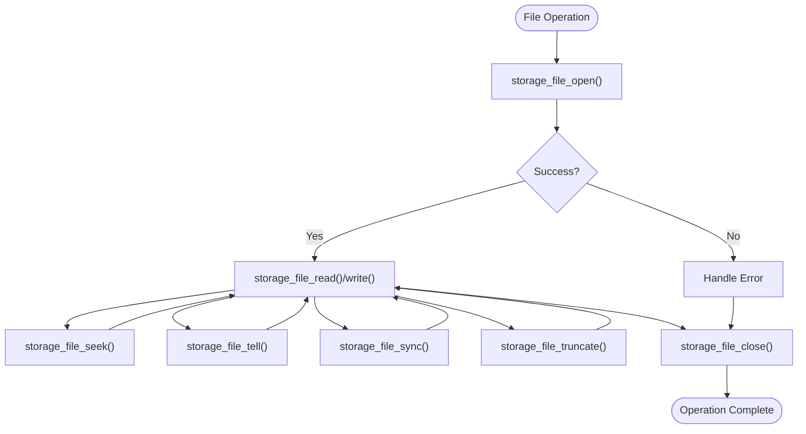

**Diagram sources**
- [storage.h](file://applications/services/storage/storage.h)

### Directory Management
The API provides functions for directory creation, traversal, and manipulation.

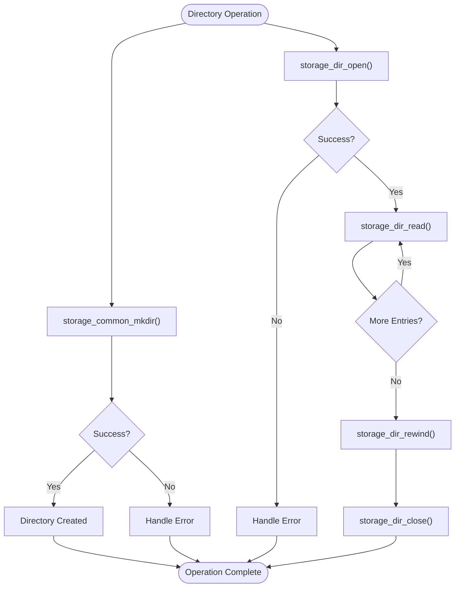

**Diagram sources**
- [storage.h](file://applications/services/storage/storage.h)

### Storage Information Queries
The service provides functions to query storage status, capacity, and file metadata.

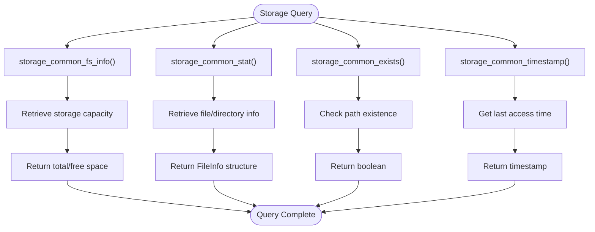

**Diagram sources**
- [storage.h](file://applications/services/storage/storage.h)

## Component Interactions
The storage service components interact through a well-defined message passing system that ensures thread safety and asynchronous operation.

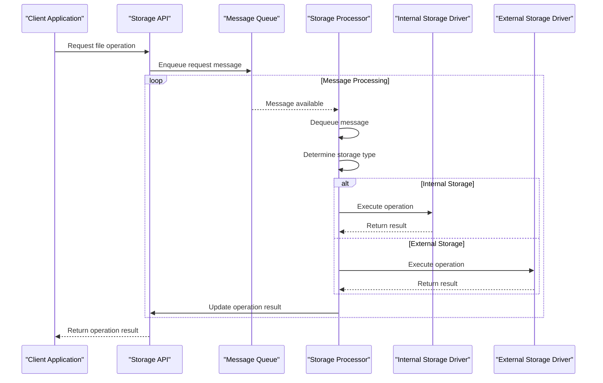

**Diagram sources**
- [storage.c](file://applications/services/storage/storage.c)
- [storage_processing.c](file://applications/services/storage/storage_processing.c)
- [storage_glue.c](file://applications/services/storage/storage_glue.c)

## Thread Safety and Asynchronous Operations
The storage service implements a thread-safe architecture using message queuing and a dedicated service thread.

```mermaid
stateDiagram-v2
[*] --> Idle
Idle --> Processing : "Message received"
Processing --> InternalOp : "Internal storage request"
Processing --> ExternalOp : "External storage request"
Processing --> VirtualOp : "Virtual mount request"
InternalOp --> Complete : "Operation finished"
ExternalOp --> Complete : "Operation finished"
VirtualOp --> Complete : "Operation finished"
Complete --> Idle : "Return to idle"
Processing --> Error : "Operation failed"
Error --> Idle : "Return to idle"
note right of Processing
All operations are
processed sequentially
in a single thread
end
```

**Diagram sources**
- [storage.c](file://applications/services/storage/storage.c)
- [storage_message.h](file://applications/services/storage/storage_message.h)

## Cross-Cutting Concerns

### Power Loss Protection
The storage service implements multiple mechanisms to protect against data corruption during power loss events.

```mermaid
flowchart TD
Start([Power Loss Event]) --> LittleFS["LittleFS Wear Leveling"]
Start --> FatFs["FatFs Write Caching"]
Start --> Sync["Explicit Sync Operations"]
Start --> Journaling["Metadata Journaling"]
LittleFS --> |Block Allocation| WearLeveling["Wear Leveling Across Blocks"]
FatFs --> |Cluster Allocation| Fragmentation["Minimize Fragmentation"]
Sync --> |f_sync()| CacheFlush["Flush Write Cache"]
Journaling --> |Atomic Updates| Consistency["File System Consistency"]
WearLeveling --> Protection["Data Integrity"]
Fragmentation --> Protection
CacheFlush --> Protection
Consistency --> Protection
Protection --> End([Protected Storage State])
```

**Diagram sources**
- [storages/storage_int.c](file://applications/services/storage/storages/storage_int.c)
- [storages/storage_ext.c](file://applications/services/storage/storages/storage_ext.c)

### Data Integrity Checks
The service implements comprehensive data integrity checks at multiple levels.

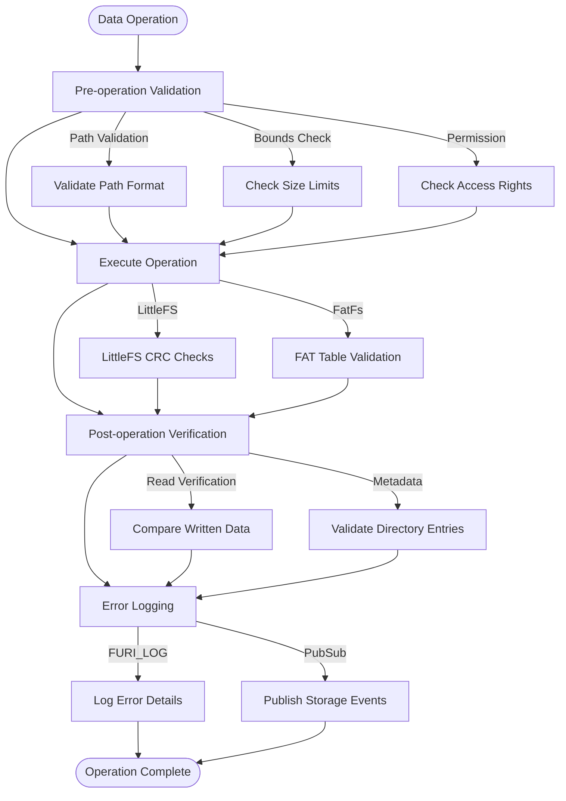

**Diagram sources**
- [storages/storage_int.c](file://applications/services/storage/storages/storage_int.c)
- [storages/storage_ext.c](file://applications/services/storage/storages/storage_ext.c)
- [storage.c](file://applications/services/storage/storage.c)

### Permission Management
The storage service implements a path-based permission system to control access to different storage areas.

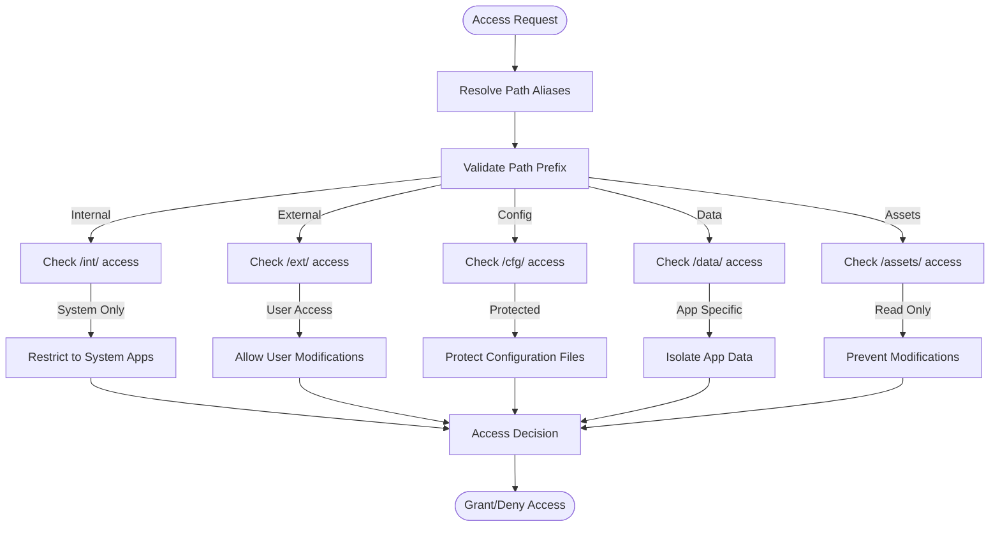

**Diagram sources**
- [storage.h](file://applications/services/storage/storage.h)
- [storage.c](file://applications/services/storage/storage.c)

## System Context and Data Flow

### Storage Stack Architecture
The complete storage stack architecture shows all layers from client applications to hardware.

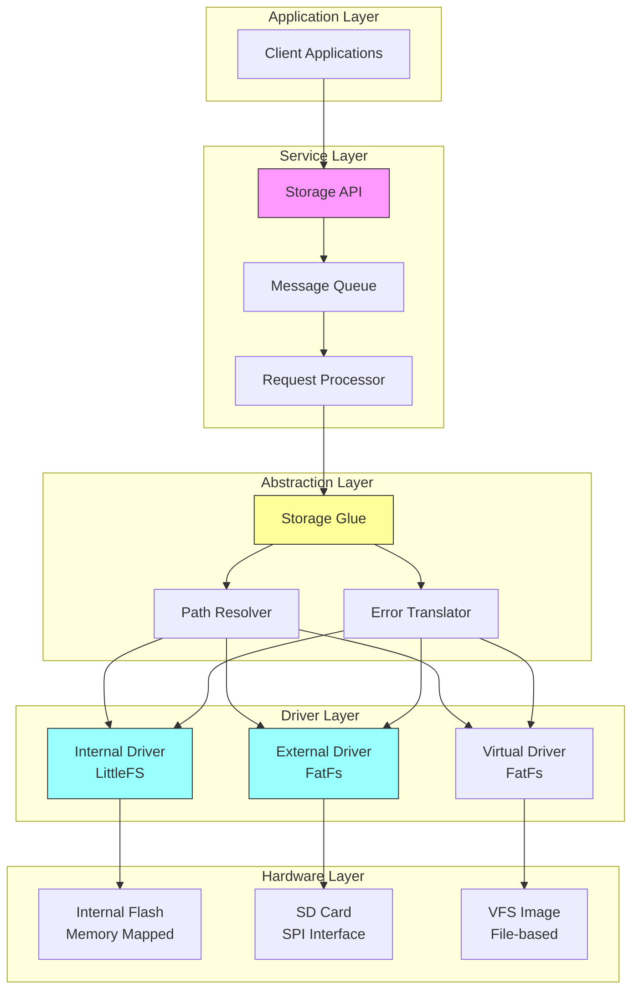

**Diagram sources**
- [storage.h](file://applications/services/storage/storage.h)
- [storage.c](file://applications/services/storage/storage.c)
- [storage_glue.c](file://applications/services/storage/storage_glue.c)
- [storages/storage_int.c](file://applications/services/storage/storages/storage_int.c)
- [storages/storage_ext.c](file://applications/services/storage/storages/storage_ext.c)

### Data Flow Patterns
The data flow patterns illustrate how data moves through the storage system during common operations.

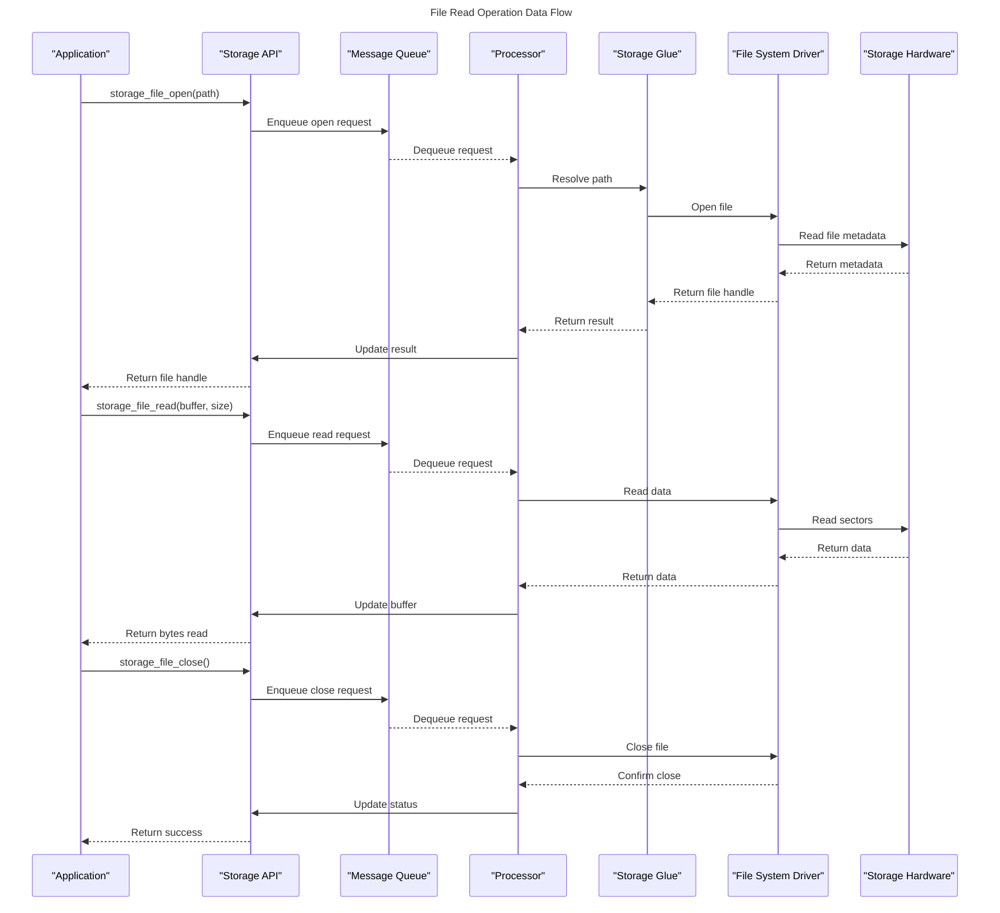

**Diagram sources**
- [storage.c](file://applications/services/storage/storage.c)
- [storage_processing.c](file://applications/services/storage/storage_processing.c)
- [storage_glue.c](file://applications/services/storage/storage_glue.c)
- [storages/storage_int.c](file://applications/services/storage/storages/storage_int.c)
- [storages/storage_ext.c](file://applications/services/storage/storages/storage_ext.c)