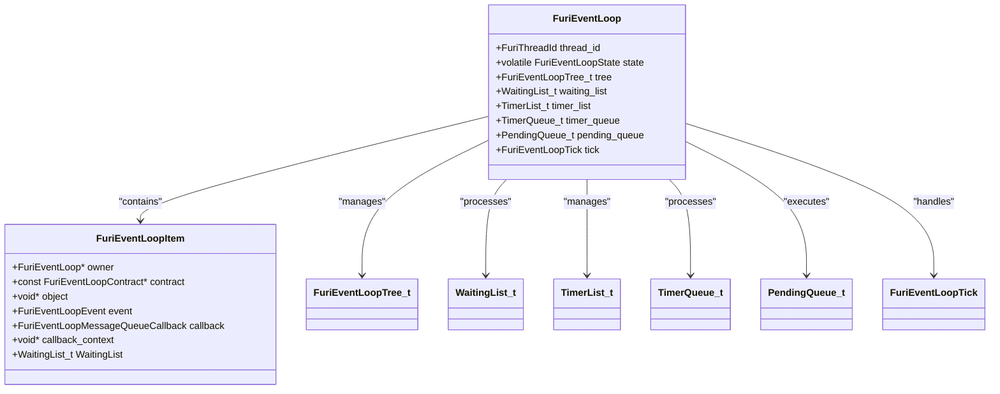
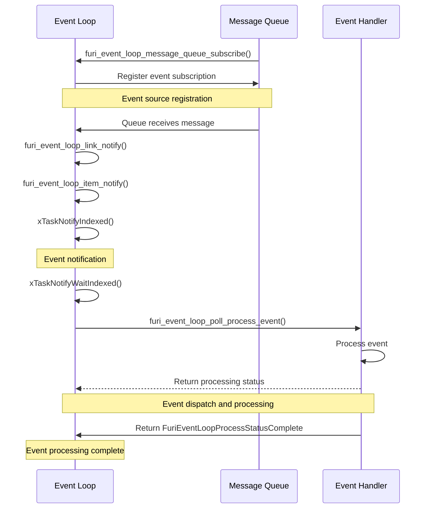
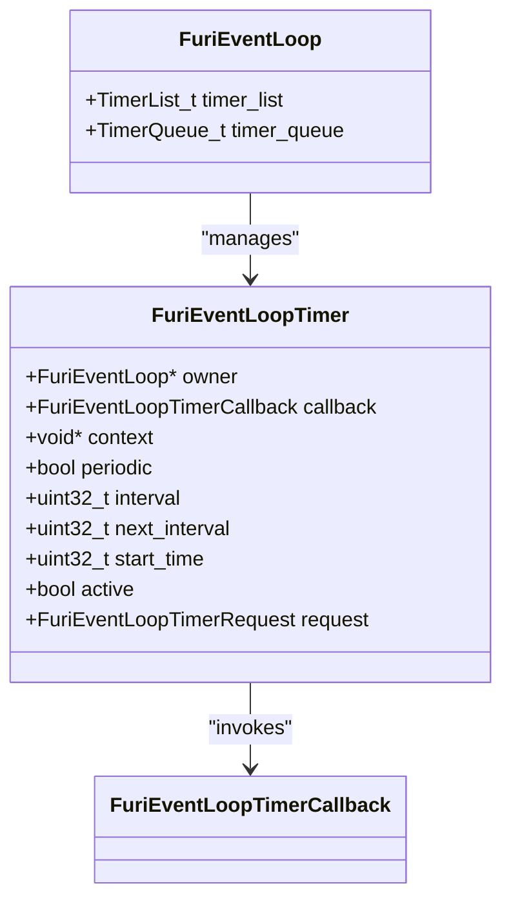
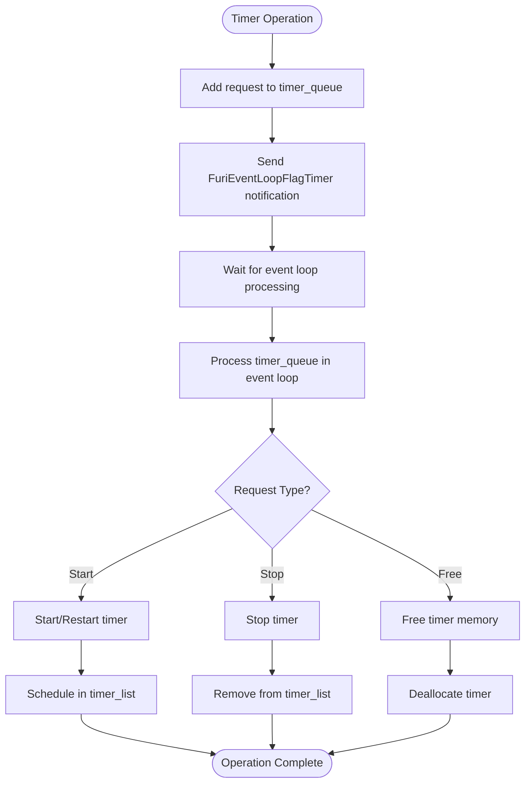
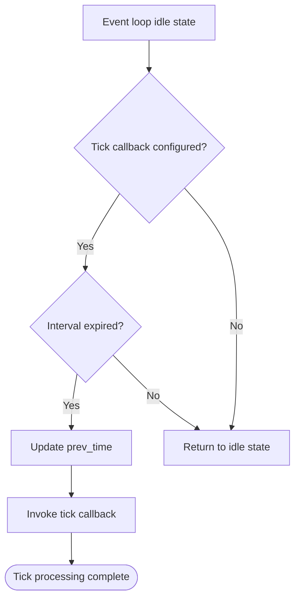
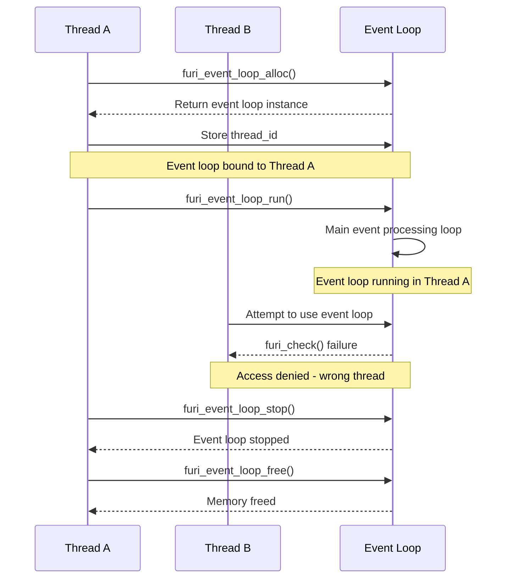
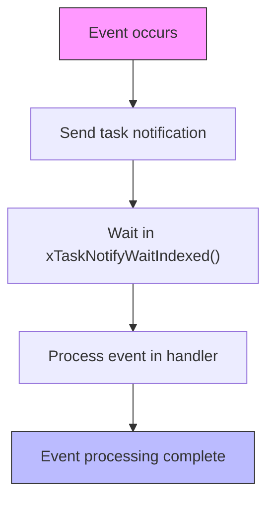

# Event Loop Architecture

<cite>
**Referenced Files in This Document**   
- [event_loop.h](file://furi/core/event_loop.h)
- [event_loop.c](file://furi/core/event_loop.c)
- [event_loop_i.h](file://furi/core/event_loop_i.h)
- [event_loop_timer.h](file://furi/core/event_loop_timer.h)
- [event_loop_timer.c](file://furi/core/event_loop_timer.c)
- [event_loop_tick.c](file://furi/core/event_loop_tick.c)
- [event_loop_tick_i.h](file://furi/core/event_loop_tick_i.h)
</cite>

## Table of Contents
1. [Introduction](#introduction)
2. [Event Loop Structure](#event-loop-structure)
3. [Event Sources and Dispatch Mechanisms](#event-sources-and-dispatch-mechanisms)
4. [Timer Integration and Timeout Handling](#timer-integration-and-timeout-handling)
5. [Thread Context and Event Loop Relationship](#thread-context-and-event-loop-relationship)
6. [Performance Considerations](#performance-considerations)
7. [Best Practices](#best-practices)

## Introduction
The Furi OS event loop system provides a reactive programming model for handling asynchronous events in a single-threaded, non-blocking manner. Inspired by epoll/kqueue concepts and asyncio event loops, the system enables efficient event processing by monitoring various event sources and dispatching them to appropriate handlers. The event loop serves as the central coordination mechanism for application logic, integrating hardware interrupts, message queues, timers, and other asynchronous events into a unified processing framework.

**Section sources**
- [event_loop.h](file://furi/core/event_loop.h#L1-L50)

## Event Loop Structure
The event loop structure is designed to manage event sources and coordinate their processing within a single thread context. The `FuriEventLoop` structure contains all necessary components for event management, including tracking of event sources, timer management, and state information.



**Diagram sources**
- [event_loop_i.h](file://furi/core/event_loop_i.h#L77-L96)

**Section sources**
- [event_loop_i.h](file://furi/core/event_loop_i.h#L77-L96)
- [event_loop.h](file://furi/core/event_loop.h#L29-L29)

### Core Components
The `FuriEventLoop` structure contains several key components:

- **thread_id**: Stores the thread identifier to ensure the event loop is only accessed from the thread that created it
- **state**: Tracks the current state of the event loop (stopped, idle, processing)
- **tree**: A B+ tree that maps event sources to their corresponding event loop items
- **waiting_list**: A list of event items that have pending events to be processed
- **timer_list**: A sorted list of active timers ordered by expiration time
- **timer_queue**: A queue for timer operation requests (start, stop, free)
- **pending_queue**: A queue for deferred function calls
- **tick**: Configuration for periodic tick callbacks

The event loop enforces thread affinity, meaning it can only be used within the thread that allocated it. This design prevents race conditions and simplifies synchronization requirements.

## Event Sources and Dispatch Mechanisms
The event loop system supports multiple types of event sources, with message queues being the primary mechanism for event notification. Events are dispatched through a reactive model where the event loop polls for ready events and invokes the appropriate handlers.



**Diagram sources**
- [event_loop.c](file://furi/core/event_loop.c#L200-L380)
- [event_loop.h](file://furi/core/event_loop.h#L100-L130)

**Section sources**
- [event_loop.c](file://furi/core/event_loop.c#L200-L380)
- [event_loop.h](file://furi/core/event_loop.h#L100-L130)

### Event Registration and Handling
Event sources are registered with the event loop using the `furi_event_loop_message_queue_subscribe` function, which associates a message queue with a specific event type and callback handler. The event loop supports two event types:

- **FuriEventLoopEventIn**: Triggered when an item is inserted into a container (e.g., message queue)
- **FuriEventLoopEventOut**: Triggered when an item is retrieved from a container (e.g., message queue)

When an event occurs, the event loop notifies the appropriate handler through a series of steps:
1. The event source calls `furi_event_loop_link_notify` to signal an event
2. This triggers `furi_event_loop_item_notify` to add the event item to the waiting list
3. A FreeRTOS task notification is sent to wake up the event loop
4. The event loop processes the event by calling the registered callback

The callback function returns a boolean value indicating whether the event was fully processed. If the callback returns `false`, the event processing is delayed, allowing for non-blocking operations that may need to wait for additional resources.

## Timer Integration and Timeout Handling
The event loop provides comprehensive timer functionality for managing time-based events and timeouts. Timers are integrated into the event loop's main processing cycle, ensuring efficient handling of time-based operations alongside other event sources.



**Diagram sources**
- [event_loop_timer.h](file://furi/core/event_loop_timer.h#L50-L60)
- [event_loop_timer.c](file://furi/core/event_loop_timer.c#L0-L50)

**Section sources**
- [event_loop_timer.h](file://furi/core/event_loop_timer.h#L50-L60)
- [event_loop_timer.c](file://furi/core/event_loop_timer.c#L0-L50)

### Timer Management
The event loop supports two types of timers:
- **One-shot timers (FuriEventLoopTimerTypeOnce)**: Execute once after the specified interval
- **Periodic timers (FuriEventLoopTimerTypePeriodic)**: Execute repeatedly at the specified interval

Timer operations are managed through a request queue system to ensure thread safety and proper sequencing:



**Diagram sources**
- [event_loop_timer.c](file://furi/core/event_loop_timer.c#L100-L150)

**Section sources**
- [event_loop_timer.c](file://furi/core/event_loop_timer.c#L100-L150)

### Tick Callbacks
In addition to regular timers, the event loop supports tick callbacks that are called periodically when the event loop is idle. These callbacks serve as low-priority timers that only fire when there is processing time available after handling higher-priority events and timers.

The tick callback mechanism is implemented with the `furi_event_loop_tick_set` function, which configures a callback to be invoked at specified intervals. Unlike regular timers, tick callbacks are not monotonic and may be skipped if the event loop is busy processing other events.



**Diagram sources**
- [event_loop_tick.c](file://furi/core/event_loop_tick.c#L0-L70)

**Section sources**
- [event_loop_tick.c](file://furi/core/event_loop_tick.c#L0-L70)

## Thread Context and Event Loop Relationship
The event loop is tightly coupled with thread context, enforcing a one-to-one relationship between event loops and threads. This design ensures thread safety and prevents race conditions by restricting event loop operations to the thread that created it.



**Diagram sources**
- [event_loop.c](file://furi/core/event_loop.c#L50-L100)
- [event_loop.h](file://furi/core/event_loop.h#L60-L70)

**Section sources**
- [event_loop.c](file://furi/core/event_loop.c#L50-L100)
- [event_loop.h](file://furi/core/event_loop.h#L60-L70)

### Thread Safety Mechanisms
The event loop employs several mechanisms to ensure thread safety:

1. **Thread ID validation**: Each public function verifies that it is being called from the correct thread using `furi_thread_get_current_id()`
2. **Critical sections**: FreeRTOS critical sections are used to protect access to shared data structures
3. **Task notifications**: FreeRTOS task notifications are used for inter-thread communication without requiring additional synchronization primitives

The event loop also supports deferred function calls through the `furi_event_loop_pend_callback` function, which allows functions to be scheduled for execution in the event loop's thread context. This mechanism enables safe cross-thread communication by queuing callbacks for execution in the correct thread.

## Performance Considerations
The event loop architecture is designed with performance in mind, balancing low latency event processing with high throughput capabilities. Several factors influence the performance characteristics of the event loop system.

### Latency and Throughput
The event loop's main processing loop is optimized for low latency by minimizing the time between event occurrence and handler invocation. The use of FreeRTOS task notifications ensures that events are processed as quickly as possible, with minimal overhead.



**Diagram sources**
- [event_loop.c](file://furi/core/event_loop.c#L150-L200)

**Section sources**
- [event_loop.c](file://furi/core/event_loop.c#L150-L200)

Key performance characteristics:
- **Event processing latency**: Determined by the time to process higher-priority events and the overhead of the event dispatch mechanism
- **Throughput**: Limited by the processing time of event handlers and the efficiency of the event polling mechanism
- **Timer accuracy**: Affected by event loop load and the scheduling granularity of FreeRTOS

### Optimization Opportunities
The event loop implementation includes several optimizations:

1. **Efficient timer management**: Timers are stored in a sorted list ordered by expiration time, allowing the event loop to quickly determine the next timer to expire
2. **Batched timer processing**: Multiple expired timers can be processed in a single iteration, reducing overhead
3. **Deferred operations**: Timer operations are queued and processed in batches, minimizing the impact on the main event processing loop
4. **Minimal locking**: Critical sections are kept as short as possible to reduce contention

## Best Practices
To ensure reliable and efficient operation of the event loop system, several best practices should be followed when developing applications that use the event loop.

### Non-blocking Event Handlers
Event handlers should be designed to be non-blocking to prevent the event loop from being stalled. Long-running operations should be handled asynchronously:

```c
// Good: Non-blocking handler
bool message_queue_callback(FuriMessageQueue* queue, void* context) {
    // Process available messages without blocking
    while(furi_message_queue_get(queue, &message, 0) == FuriStatusOk) {
        process_message(&message);
    }
    return true; // Event fully processed
}

// Bad: Blocking handler
bool message_queue_callback(FuriMessageQueue* queue, void* context) {
    // This blocks the event loop until a message is available
    furi_message_queue_get(queue, &message, FuriWaitForever);
    process_message(&message);
    return true;
}
```

**Section sources**
- [event_loop.h](file://furi/core/event_loop.h#L120-L130)

### Proper Error Handling
Error handling within the event loop should follow these guidelines:

1. Use `furi_check()` for critical assertions that indicate programming errors
2. Return appropriate status values from event handlers to indicate processing state
3. Handle timer callback errors gracefully, as timer callbacks can be invoked from different contexts

```c
// Example of proper error handling in a timer callback
void timer_callback(void* context) {
    MyContext* ctx = (MyContext*)context;
    
    // Validate context
    if(!ctx || !ctx->valid) {
        FURI_LOG_W("Timer", "Invalid context");
        return;
    }
    
    // Perform operation with error checking
    if(!perform_operation(ctx)) {
        FURI_LOG_E("Timer", "Operation failed");
        // Consider stopping the timer or retrying
        return;
    }
}
```

**Section sources**
- [event_loop_timer.h](file://furi/core/event_loop_timer.h#L80-L90)

### Resource Management
Proper resource management is critical when working with the event loop:

1. Always free timers before freeing the event loop with `furi_event_loop_timer_free()`
2. Unsubscribe from event sources before destroying them
3. Ensure all pending callbacks are processed before stopping the event loop

```c
// Proper cleanup sequence
void cleanup_event_loop(FuriEventLoop* loop) {
    // Stop and free all timers
    // Unsubscribe from all event sources
    // Stop the event loop
    furi_event_loop_stop(loop);
    // Free the event loop
    furi_event_loop_free(loop);
}
```

**Section sources**
- [event_loop_timer.h](file://furi/core/event_loop_timer.h#L70-L80)
- [event_loop.h](file://furi/core/event_loop.h#L80-L90)