# Furi OS Primitives

<cite>
**Referenced Files in This Document**   
- [thread.h](file://furi/core/thread.h)
- [thread.c](file://furi/core/thread.c)
- [event_loop.h](file://furi/core/event_loop.h)
- [event_loop.c](file://furi/core/event_loop.c)
- [message_queue.h](file://furi/core/message_queue.h)
- [message_queue.c](file://furi/core/message_queue.c)
- [mutex.h](file://furi/core/mutex.h)
- [mutex.c](file://furi/core/mutex.c)
- [semaphore.h](file://furi/core/semaphore.h)
- [semaphore.c](file://furi/core/semaphore.c)
- [timer.h](file://furi/core/timer.h)
- [timer.c](file://furi/core/timer.c)
- [string.h](file://furi/core/string.h)
- [string.c](file://furi/core/string.c)
- [record.h](file://furi/core/record.h)
- [record.c](file://furi/core/record.c)
</cite>

## Table of Contents
1. [Introduction](#introduction)
2. [Threading System](#threading-system)
3. [Event Loop](#event-loop)
4. [Message Queues](#message-queues)
5. [Mutexes](#mutexes)
6. [Semaphores](#semaphores)
7. [Timers](#timers)
8. [String Utilities](#string-utilities)
9. [Record System](#record-system)
10. [Best Practices](#best-practices)

## Introduction
Furi OS is a real-time operating system designed for embedded devices, particularly the Flipper Zero platform. This document provides comprehensive documentation for the core primitives that form the foundation of Furi OS, including threading, event loops, synchronization mechanisms, timers, and utility functions. These primitives are built on top of FreeRTOS and provide a higher-level, more user-friendly API for application development. The documentation covers function signatures, parameter descriptions, return values, error codes, usage examples, and best practices for resource management in embedded contexts.

## Threading System

The threading system in Furi OS provides a robust mechanism for creating and managing concurrent execution paths. It offers three different allocation methods to suit various use cases, from lightweight service threads to fully-featured application threads.

### Thread States and Priorities
Furi OS defines three possible thread states:
- **FuriThreadStateStopped**: Thread is not running
- **FuriThreadStateStarting**: Thread is in the process of starting
- **FuriThreadStateRunning**: Thread is actively executing

The system supports multiple priority levels, allowing developers to control thread scheduling:
- **FuriThreadPriorityIdle**: Lowest priority, for background tasks
- **FuriThreadPriorityLowest** to **FuriThreadPriorityHighest**: Graduated priority levels
- **FuriThreadPriorityIsr**: Highest priority, for deferred interrupt handling

### Thread Creation and Management
Furi OS provides three functions for thread allocation, each with different capabilities and constraints:

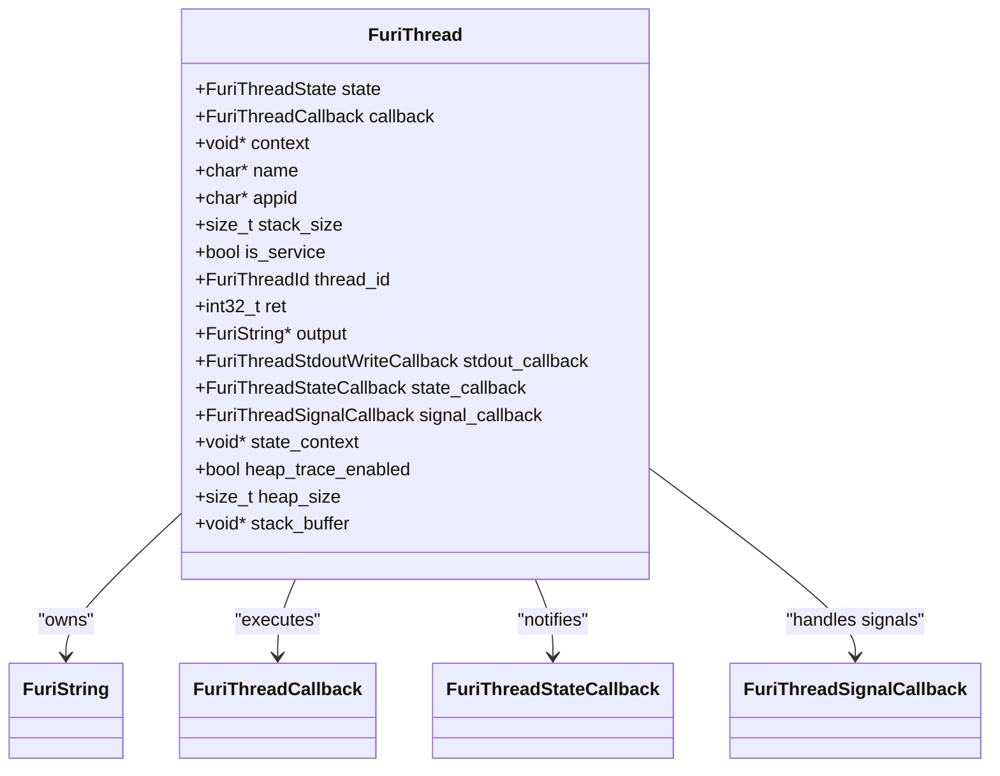

**Diagram sources**
- [thread.h](file://furi/core/thread.h#L1-L200)
- [thread.c](file://furi/core/thread.c#L1-L200)

**Section sources**
- [thread.h](file://furi/core/thread.h#L1-L200)
- [thread.c](file://furi/core/thread.c#L1-L200)

#### Thread Allocation Functions

**furi_thread_alloc()**
- **Purpose**: Creates a standard thread with full capabilities
- **Parameters**: None
- **Returns**: Pointer to FuriThread instance or NULL on failure
- **Usage**: Use when you need full control over thread configuration

**furi_thread_alloc_service()**
- **Purpose**: Creates a memory-efficient service thread
- **Parameters**: 
  - `name`: Human-readable thread name (can be NULL)
  - `stack_size`: Stack size in bytes (fixed after creation)
  - `callback`: Function to execute in the thread
  - `context`: User-specified data passed to the callback
- **Returns**: Pointer to FuriThread instance
- **Limitations**: Cannot return from callback, cannot be joined or freed, stack size cannot be changed
- **Usage**: Ideal for long-running background services

**furi_thread_alloc_ex()**
- **Purpose**: Creates a thread with extended parameters
- **Parameters**: Same as furi_thread_alloc_service()
- **Returns**: Pointer to FuriThread instance
- **Usage**: When you need a standard thread with immediate configuration

### Thread Lifecycle Management
Proper thread lifecycle management is critical in embedded systems to prevent resource leaks and ensure system stability.

#### Initialization and Configuration
```c
// Example: Creating and configuring a standard thread
FuriThread* my_thread = furi_thread_alloc();
furi_thread_set_name(my_thread, "MyWorker");
furi_thread_set_stack_size(my_thread, 2048);
furi_thread_set_callback(my_thread, my_worker_function);
furi_thread_set_context(my_thread, my_data);
```

#### Thread Callback Function
The thread callback function must follow the signature:
```c
int32_t (*FuriThreadCallback)(void* context);
```
The function receives a context pointer and returns an integer status code. For service threads, the callback should never return (typically runs in an infinite loop).

#### Cleanup and Resource Management
```c
// Example: Proper thread cleanup
void my_thread_cleanup(FuriThread* thread) {
    // Ensure thread is stopped before freeing
    if(furi_thread_get_state(thread) != FuriThreadStateStopped) {
        // Thread must be stopped before freeing
        furi_thread_join(thread);
    }
    
    // Free the thread instance
    furi_thread_free(thread);
}
```

**Critical Rules for Thread Management:**
1. Threads must be in the **STOPPED** state before calling `furi_thread_free()`
2. Service threads cannot be freed and will exist for the lifetime of the application
3. Stack size can only be changed when the thread is stopped
4. Thread names and application IDs can only be set when the thread is stopped

### Error Handling and Safety
The threading system includes comprehensive error checking:
- **Assertions**: Uses `furi_check()` to validate preconditions
- **Crash handling**: Calls `furi_crash()` for unrecoverable errors
- **Stack monitoring**: Checks stack watermark and logs warnings if too low
- **Heap tracking**: Optional heap allocation tracking for debugging

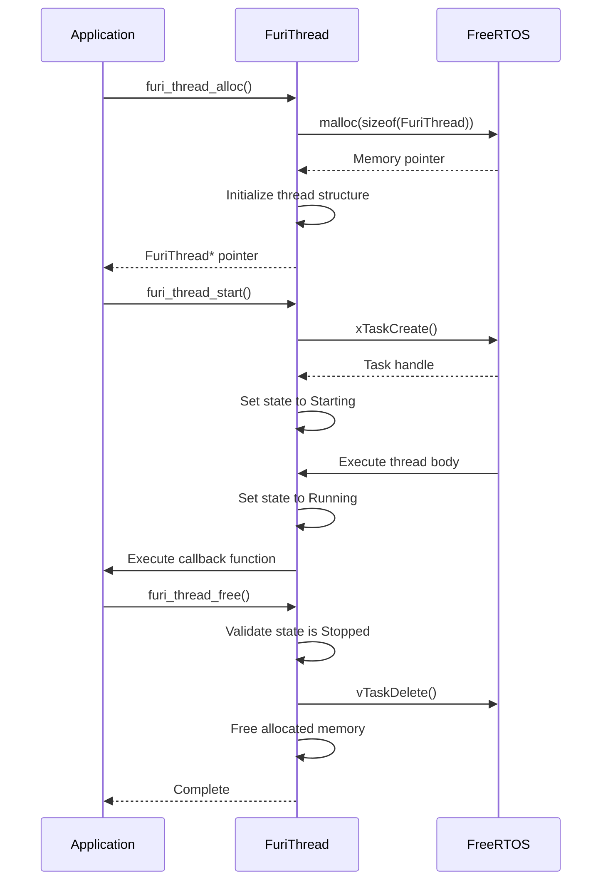

**Diagram sources**
- [thread.c](file://furi/core/thread.c#L200-L400)
- [thread.h](file://furi/core/thread.h#L1-L50)

**Section sources**
- [thread.c](file://furi/core/thread.c#L1-L500)
- [thread.h](file://furi/core/thread.h#L1-L300)

## Event Loop

The event loop in Furi OS provides a reactive, asynchronous programming model inspired by epoll/kqueue and asyncio concepts. It enables efficient handling of I/O operations, timers, and other asynchronous events without blocking the main thread.

### Architecture and Design
The event loop is designed to be lightweight and efficient, with the following key characteristics:
- Single event loop per thread
- Thread-affine (cannot be used across threads)
- Non-blocking API for delegated objects
- Priority-based event processing

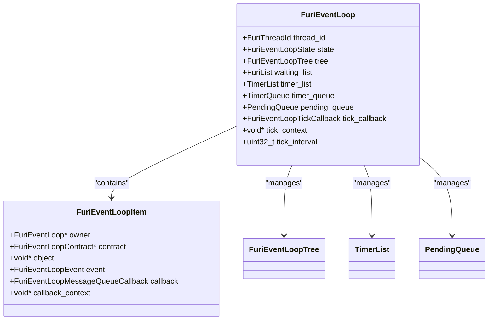

**Diagram sources**
- [event_loop.h](file://furi/core/event_loop.h#L1-L100)
- [event_loop.c](file://furi/core/event_loop.c#L1-L100)

**Section sources**
- [event_loop.h](file://furi/core/event_loop.h#L1-L163)
- [event_loop.c](file://furi/core/event_loop.c#L1-L200)

### Core Components
The event loop consists of several key components that work together to manage asynchronous events:

#### Event Loop Instance
The `FuriEventLoop` structure maintains the state and configuration of an event loop:
- **thread_id**: Identifier of the thread that owns the event loop
- **state**: Current state (Idle, Processing, Stopped)
- **tree**: Red-black tree for efficient event source lookup
- **waiting_list**: List of event sources ready for processing
- **timer_list**: List of active timers
- **timer_queue**: Queue for timer expiration events
- **pending_queue**: Queue for deferred function calls

#### Event Types
Furi OS defines two primary event types:
- **FuriEventLoopEventOut**: Triggered when an item is retrieved from a container (e.g., message queue)
- **FuriEventLoopEventIn**: Triggered when an item is inserted into a container

### API Functions
The event loop provides a comprehensive API for managing asynchronous operations.

#### Creation and Destruction
```c
// Allocate a new event loop instance
FuriEventLoop* furi_event_loop_alloc(void);

// Free an event loop instance
void furi_event_loop_free(FuriEventLoop* instance);
```

#### Main Loop Execution
```c
// Start the event loop (runs continuously until stopped)
void furi_event_loop_run(FuriEventLoop* instance);

// Stop the event loop from another thread
void furi_event_loop_stop(FuriEventLoop* instance);
```

#### Tick Callbacks
Tick callbacks provide periodic execution similar to low-priority timers:
```c
// Set a tick callback that fires when the event loop is idle
void furi_event_loop_tick_set(
    FuriEventLoop* instance,
    uint32_t interval,
    FuriEventLoopTickCallback callback,
    void* context);
```
**Important**: Tick callbacks are not monotonic and may be skipped if the event loop is busy processing other events.

#### Deferred Function Calls
The event loop supports deferred execution of functions:
```c
// Schedule a function to be called after all pending timer commands
void furi_event_loop_pend_callback(
    FuriEventLoop* instance,
    FuriEventLoopPendingCallback callback,
    void* context);
```

### Message Queue Integration
The event loop integrates with message queues to provide event-driven message processing:

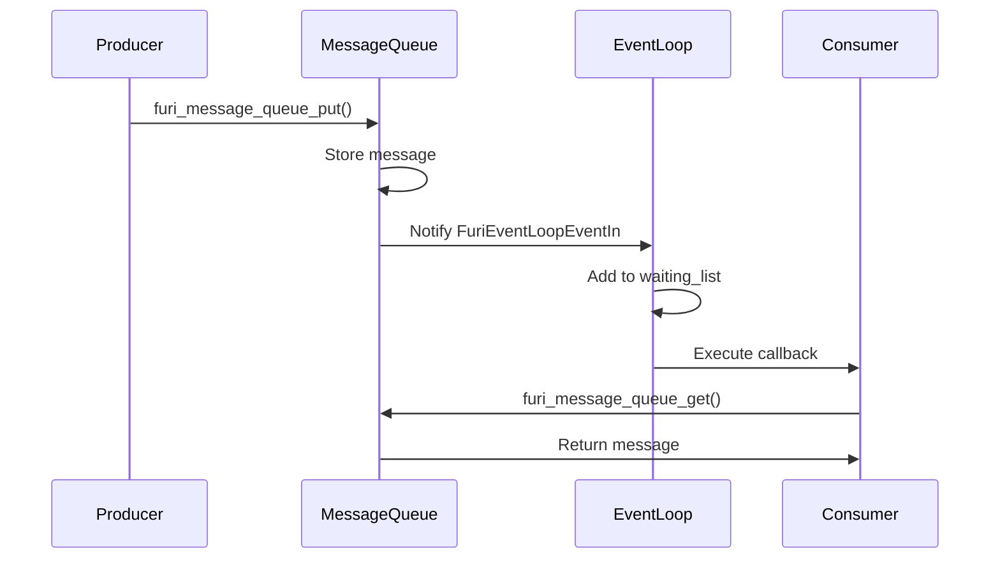

**Diagram sources**
- [event_loop.c](file://furi/core/event_loop.c#L200-L300)
- [message_queue.c](file://furi/core/message_queue.c#L1-L50)

**Section sources**
- [event_loop.h](file://furi/core/event_loop.h#L80-L163)
- [event_loop.c](file://furi/core/event_loop.c#L150-L300)

#### Subscription Management
```c
// Subscribe to message queue events
void furi_event_loop_message_queue_subscribe(
    FuriEventLoop* instance,
    FuriMessageQueue* message_queue,
    FuriEventLoopEvent event,
    FuriEventLoopMessageQueueCallback callback,
    void* context);

// Unsubscribe from message queue events
void furi_event_loop_message_queue_unsubscribe(
    FuriEventLoop* instance,
    FuriMessageQueue* message_queue);
```

**Important**: Only one subscription per event type is allowed.

### Event Processing Flow
The event loop processes events in a specific order of priority:
1. **Stop events**: Highest priority, terminates the loop
2. **Pending callbacks**: Functions scheduled for deferred execution
3. **Timer events**: Expired timers and timer queue processing
4. **I/O events**: Message queue and other synchronization primitive events
5. **Tick events**: Periodic callbacks when the loop is idle

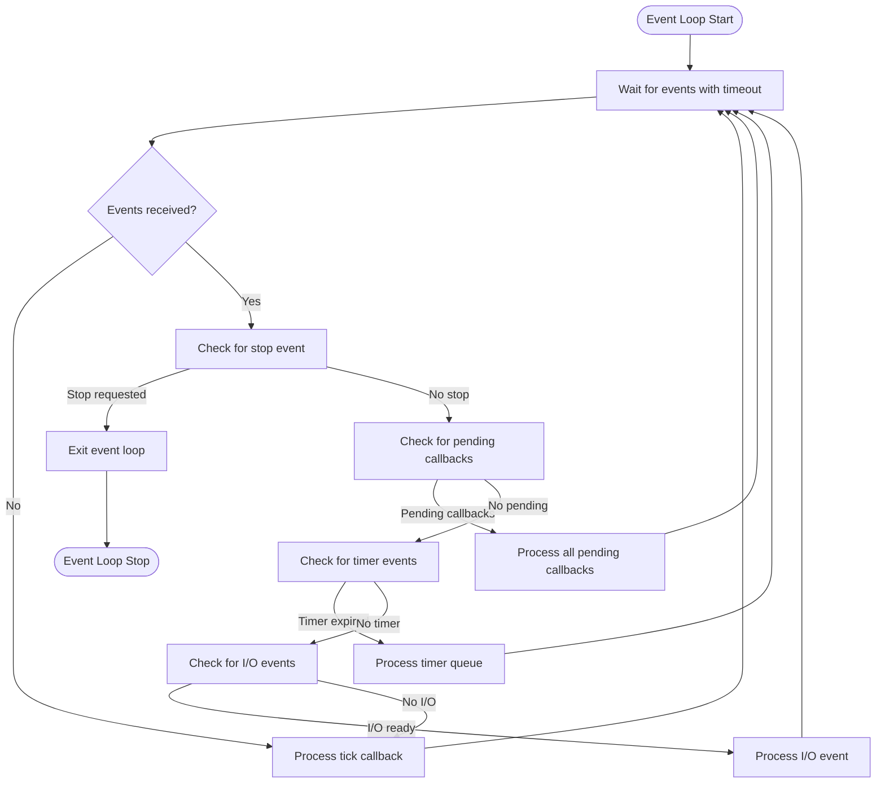

**Diagram sources**
- [event_loop.c](file://furi/core/event_loop.c#L250-L350)

**Section sources**
- [event_loop.c](file://furi/core/event_loop.c#L150-L381)

## Message Queues

Message queues in Furi OS provide a thread-safe mechanism for passing data between threads. They are built on FreeRTOS queues and offer a simple, reliable API for inter-thread communication.

### Data Structure
The `FuriMessageQueue` structure encapsulates a FreeRTOS static queue with additional metadata:

```c
struct FuriMessageQueue {
    StaticQueue_t container;           // FreeRTOS queue container
    FuriEventLoopLink event_loop_link; // Link to event loop
    uint8_t buffer[];                  // Message storage buffer
};
```

**Important**: The container must be the first member, and the buffer must be the last member, enabling safe casting between `FuriMessageQueue*` and `QueueHandle_t`.

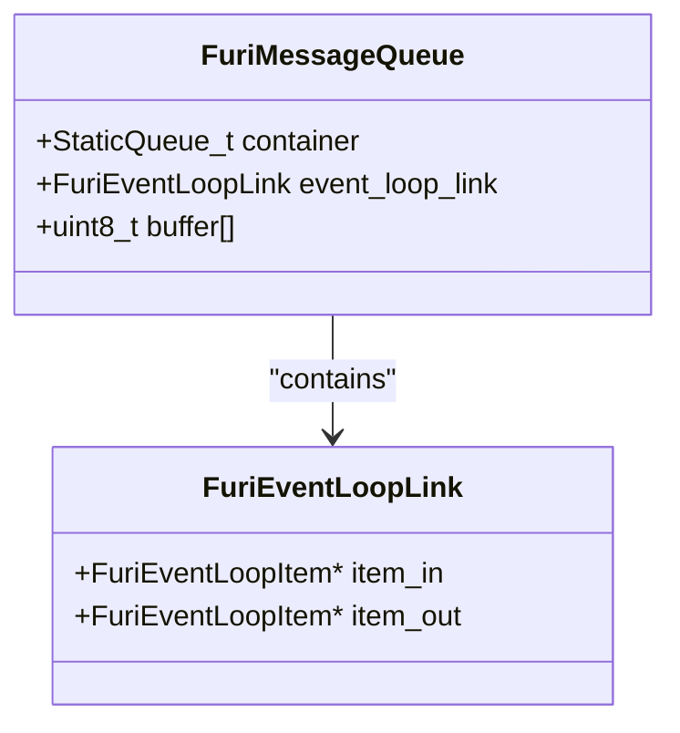

**Diagram sources**
- [message_queue.h](file://furi/core/message_queue.h#L1-L20)
- [message_queue.c](file://furi/core/message_queue.c#L1-L20)

**Section sources**
- [message_queue.h](file://furi/core/message_queue.h#L1-L94)
- [message_queue.c](file://furi/core/message_queue.c#L1-L50)

### Creation and Destruction
```c
// Allocate a message queue
FuriMessageQueue* furi_message_queue_alloc(uint32_t msg_count, uint32_t msg_size);

// Free a message queue
void furi_message_queue_free(FuriMessageQueue* instance);
```

**Parameters:**
- `msg_count`: Maximum number of messages the queue can hold
- `msg_size`: Size of each message in bytes

**Constraints:**
- Cannot be called from interrupt context
- Both parameters must be greater than zero
- Event loop must be disconnected before freeing

### Message Operations
The message queue API provides functions for sending and receiving messages with configurable timeouts.

#### Sending Messages
```c
FuriStatus furi_message_queue_put(
    FuriMessageQueue* instance, 
    const void* msg_ptr, 
    uint32_t timeout);
```

**Return values:**
- `FuriStatusOk`: Message successfully queued
- `FuriStatusErrorParameter`: Invalid parameters (null pointer)
- `FuriStatusErrorResource`: Queue full and timeout expired
- `FuriStatusErrorTimeout`: Timeout expired while waiting
- `FuriStatusErrorISR`: Called from interrupt context with non-zero timeout

#### Receiving Messages
```c
FuriStatus furi_message_queue_get(
    FuriMessageQueue* instance, 
    void* msg_ptr, 
    uint32_t timeout);
```

**Return values:**
- `FuriStatusOk`: Message successfully received
- `FuriStatusErrorParameter`: Invalid parameters (null pointer)
- `FuriStatusErrorResource`: Queue empty and timeout expired
- `FuriStatusErrorTimeout`: Timeout expired while waiting
- `FuriStatusErrorISR`: Called from interrupt context with non-zero timeout

### Queue Information
The API provides several functions to query queue state:

```c
// Get queue capacity (maximum message count)
uint32_t furi_message_queue_get_capacity(FuriMessageQueue* instance);

// Get message size in bytes
uint32_t furi_message_queue_get_message_size(FuriMessageQueue* instance);

// Get current message count
uint32_t furi_message_queue_get_count(FuriMessageQueue* instance);

// Get available space (empty slots)
uint32_t furi_message_queue_get_space(FuriMessageQueue* instance);

// Reset queue (remove all messages)
FuriStatus furi_message_queue_reset(FuriMessageQueue* instance);
```

### Usage Example
```c
// Define a message structure
typedef struct {
    uint32_t event_type;
    uint32_t data;
} MyMessage;

// Create a message queue
FuriMessageQueue* queue = furi_message_queue_alloc(10, sizeof(MyMessage));

// Producer thread
void producer_thread(void* context) {
    MyMessage msg = { .event_type = 1, .data = 42 };
    FuriStatus result = furi_message_queue_put(queue, &msg, FuriWaitForever);
    if(result != FuriStatusOk) {
        // Handle error
    }
}

// Consumer thread
void consumer_thread(void* context) {
    MyMessage msg;
    FuriStatus result = furi_message_queue_get(queue, &msg, 100);
    if(result == FuriStatusOk) {
        // Process message
    } else if(result == FuriStatusErrorTimeout) {
        // No message available within timeout
    }
}

// Cleanup
furi_message_queue_free(queue);
```

### Thread Safety and Interrupt Context
The message queue functions are designed to be safe in both thread and interrupt contexts:

**From Thread Context:**
- Can use any timeout value
- Blocking operations are permitted

**From Interrupt Context:**
- Timeout must be zero (non-blocking)
- Special ISR-safe FreeRTOS functions are used
- `portYIELD_FROM_ISR()` is called when necessary

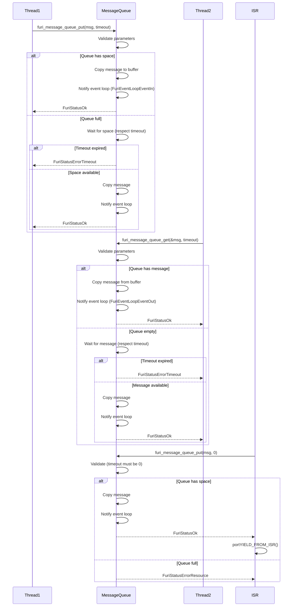

**Diagram sources**
- [message_queue.c](file://furi/core/message_queue.c#L50-L200)

**Section sources**
- [message_queue.h](file://furi/core/message_queue.h#L1-L94)
- [message_queue.c](file://furi/core/message_queue.c#L1-L234)

## Mutexes

Mutexes in Furi OS provide mutual exclusion for protecting shared resources from concurrent access. They are built on FreeRTOS mutexes and offer both normal and recursive variants.

### Data Structure
The `FuriMutex` structure encapsulates a FreeRTOS static semaphore:

```c
struct FuriMutex {
    StaticSemaphore_t container;
};
```

**Important**: The container must be the first member of the structure to enable safe casting between `FuriMutex*` and `SemaphoreHandle_t`.

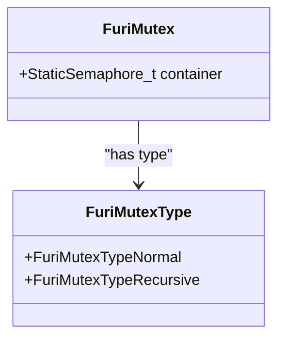

**Diagram sources**
- [mutex.h](file://furi/core/mutex.h#L1-L10)
- [mutex.c](file://furi/core/mutex.c#L1-L10)

**Section sources**
- [mutex.h](file://furi/core/mutex.h#L1-L63)
- [mutex.c](file://furi/core/mutex.c#L1-L125)

### Mutex Types
Furi OS supports two types of mutexes:

#### Normal Mutex
- Standard mutual exclusion
- Cannot be acquired twice by the same thread (would cause deadlock)
- Use for protecting shared resources from concurrent access

#### Recursive Mutex
- Can be acquired multiple times by the same thread
- Requires the same number of release calls as acquire calls
- Use in situations where a function that acquires a mutex calls another function that also needs the same mutex

### API Functions
The mutex API provides functions for creation, acquisition, release, and ownership checking.

#### Creation and Destruction
```c
// Allocate a mutex
FuriMutex* furi_mutex_alloc(FuriMutexType type);

// Free a mutex
void furi_mutex_free(FuriMutex* instance);
```

**Parameters:**
- `type`: FuriMutexTypeNormal or FuriMutexTypeRecursive

**Constraints:**
- Cannot be called from interrupt context
- Must be called from the same thread that created the mutex

#### Acquisition and Release
```c
// Acquire mutex with timeout
FuriStatus furi_mutex_acquire(FuriMutex* instance, uint32_t timeout);

// Release mutex
FuriStatus furi_mutex_release(FuriMutex* instance);
```

**Acquisition Return values:**
- `FuriStatusOk`: Mutex successfully acquired
- `FuriStatusErrorISR`: Called from interrupt context
- `FuriStatusErrorTimeout`: Timeout expired while waiting
- `FuriStatusErrorResource`: Mutex could not be acquired (should not occur with valid parameters)

**Release Return values:**
- `FuriStatusOk`: Mutex successfully released
- `FuriStatusErrorISR`: Called from interrupt context
- `FuriStatusErrorResource`: Mutex could not be released (e.g., not owned by calling thread)

#### Ownership Information
```c
// Get the thread ID of the mutex owner
FuriThreadId furi_mutex_get_owner(FuriMutex* instance);
```

Returns NULL if the mutex is not currently owned by any thread.

### Usage Example
```c
// Shared resource
static int shared_counter = 0;
static FuriMutex* counter_mutex = NULL;

// Initialize mutex
counter_mutex = furi_mutex_alloc(FuriMutexTypeNormal);

// Thread-safe increment function
void safe_increment(void) {
    FuriStatus result = furi_mutex_acquire(counter_mutex, 100);
    if(result == FuriStatusOk) {
        shared_counter++;
        furi_mutex_release(counter_mutex);
    } else {
        // Handle timeout or error
    }
}

// Recursive mutex example
FuriMutex* recursive_mutex = furi_mutex_alloc(FuriMutexTypeRecursive);

void inner_function(void) {
    // This can be called even if the mutex is already held
    furi_mutex_acquire(recursive_mutex, FuriWaitForever);
    // Critical section
    furi_mutex_release(recursive_mutex);
}

void outer_function(void) {
    furi_mutex_acquire(recursive_mutex, FuriWaitForever);
    // Critical section
    inner_function(); // Can acquire the same mutex again
    furi_mutex_release(recursive_mutex);
}

// Cleanup
furi_mutex_free(counter_mutex);
furi_mutex_free(recursive_mutex);
```

### Thread Safety and Error Handling
The mutex implementation includes comprehensive error checking:

**From Thread Context:**
- Supports blocking and non-blocking acquisition
- Timeout parameter specifies maximum wait time
- Proper error codes returned for various failure conditions

**From Interrupt Context:**
- Cannot acquire or release mutexes
- Returns `FuriStatusErrorISR` if called from interrupt context

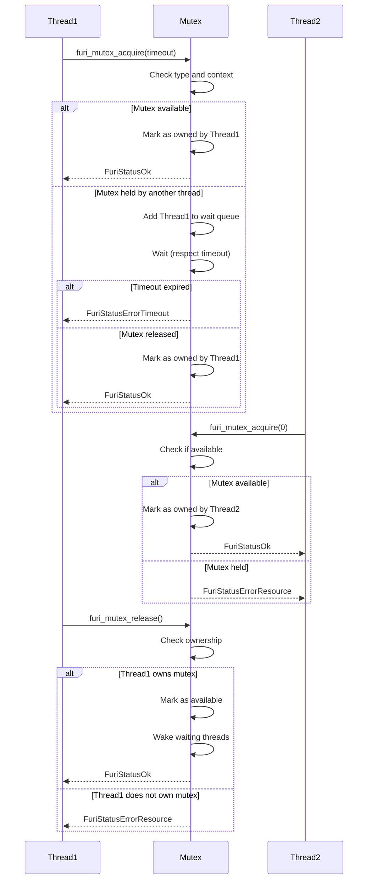

**Diagram sources**
- [mutex.c](file://furi/core/mutex.c#L50-L120)

**Section sources**
- [mutex.h](file://furi/core/mutex.h#L1-L63)
- [mutex.c](file://furi/core/mutex.c#L1-L125)

## Semaphores

Semaphores in Furi OS provide counting semaphore functionality for resource management and thread synchronization. They are built on FreeRTOS semaphores and support both binary and counting variants.

### Data Structure
The `FuriSemaphore` structure encapsulates a FreeRTOS static semaphore:

```c
struct FuriSemaphore {
    StaticSemaphore_t container;
};
```

**Important**: The container must be the first member of the structure to enable safe casting between `FuriSemaphore*` and `SemaphoreHandle_t`.

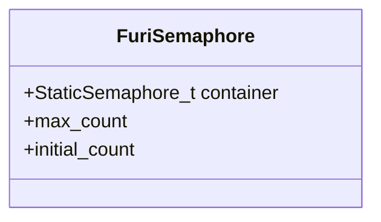

**Diagram sources**
- [semaphore.h](file://furi/core/semaphore.h#L1-L10)
- [semaphore.c](file://furi/core/semaphore.c#L1-L10)

**Section sources**
- [semaphore.h](file://furi/core/semaphore.h#L1-L59)
- [semaphore.c](file://furi/core/semaphore.c#L1-L123)

### Creation and Configuration
```c
// Allocate a semaphore
FuriSemaphore* furi_semaphore_alloc(uint32_t max_count, uint32_t initial_count);

// Free a semaphore
void furi_semaphore_free(FuriSemaphore* instance);
```

**Parameters:**
- `max_count`: Maximum count value (must be > 0)
- `initial_count`: Initial count value (must be <= max_count)

**Special Cases:**
- If `max_count` is 1, a binary semaphore is created
- If `max_count` > 1, a counting semaphore is created
- If `max_count` is 1 and `initial_count` is not 0, the semaphore is initially available

**Constraints:**
- Cannot be called from interrupt context
- Both parameters must be valid (max_count > 0, initial_count <= max_count)

### Semaphore Operations
The semaphore API provides functions for acquiring and releasing the semaphore with configurable timeouts.

#### Acquiring the Semaphore
```c
FuriStatus furi_semaphore_acquire(FuriSemaphore* instance, uint32_t timeout);
```

**Return values:**
- `FuriStatusOk`: Semaphore successfully acquired (count decremented)
- `FuriStatusErrorISR`: Called from interrupt context with non-zero timeout
- `FuriStatusErrorParameter`: Invalid parameters (timeout != 0 in ISR context)
- `FuriStatusErrorTimeout`: Timeout expired while waiting
- `FuriStatusErrorResource`: Semaphore could not be acquired (should not occur with valid parameters)

#### Releasing the Semaphore
```c
FuriStatus furi_semaphore_release(FuriSemaphore* instance);
```

**Return values:**
- `FuriStatusOk`: Semaphore successfully released (count incremented)
- `FuriStatusErrorISR`: Called from interrupt context with yield required
- `FuriStatusErrorResource`: Semaphore could not be released (e.g., already at max_count)

#### Querying Semaphore State
```c
// Get current semaphore count
uint32_t furi_semaphore_get_count(FuriSemaphore* instance);
```

Returns the current count value (0 to max_count).

### Usage Patterns
Semaphores are commonly used for:

#### Resource Pooling
Managing a fixed number of resources (e.g., database connections, hardware devices):

```c
// Create a semaphore for 3 available resources
FuriSemaphore* resource_sem = furi_semaphore_alloc(3, 3);

// Acquire a resource
FuriStatus result = furi_semaphore_acquire(resource_sem, 100);
if(result == FuriStatusOk) {
    // Use the resource
    // ...
    // Release the resource
    furi_semaphore_release(resource_sem);
} else {
    // No resources available within timeout
}
```

#### Thread Synchronization
Coordinating between threads, such as signaling completion:

```c
// Create a binary semaphore (initially unavailable)
FuriSemaphore* sync_sem = furi_semaphore_alloc(1, 0);

// Worker thread
void worker_thread(void* context) {
    // Do work
    // ...
    // Signal completion
    furi_semaphore_release(sync_sem);
}

// Main thread
void main_thread(void* context) {
    // Start worker
    furi_thread_start(worker_thread_instance);
    // Wait for completion
    FuriStatus result = furi_semaphore_acquire(sync_sem, FuriWaitForever);
    if(result == FuriStatusOk) {
        // Worker has completed
    }
}
```

#### Producer-Consumer Coordination
Working with message queues to coordinate producers and consumers:

```c
// Create a semaphore to track available space
FuriSemaphore* space_sem = furi_semaphore_alloc(queue_capacity, queue_capacity);
// Create a semaphore to track available messages
FuriSemaphore* message_sem = furi_semaphore_alloc(queue_capacity, 0);

// Producer
void producer(void* context) {
    while(1) {
        // Wait for available space
        furi_semaphore_acquire(space_sem, FuriWaitForever);
        // Add message to queue
        furi_message_queue_put(queue, &msg, 0);
        // Signal message available
        furi_semaphore_release(message_sem);
    }
}

// Consumer
void consumer(void* context) {
    while(1) {
        // Wait for message
        furi_semaphore_acquire(message_sem, FuriWaitForever);
        // Get message from queue
        furi_message_queue_get(queue, &msg, 0);
        // Signal space available
        furi_semaphore_release(space_sem);
    }
}
```

### Interrupt Context Support
The semaphore API supports operations from interrupt context with specific constraints:

**From Thread Context:**
- Can use any timeout value
- Blocking operations are permitted
- Standard FreeRTOS semaphore functions are used

**From Interrupt Context:**
- Timeout must be zero (non-blocking)
- ISR-safe FreeRTOS functions are used (`FromISR` variants)
- `portYIELD_FROM_ISR()` is called when a higher-priority task is unblocked

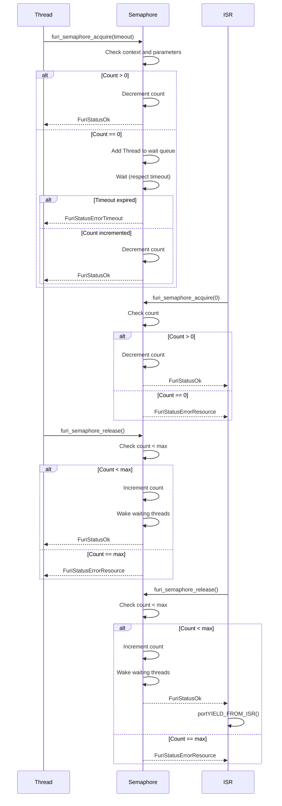

**Diagram sources**
- [semaphore.c](file://furi/core/semaphore.c#L50-L120)

**Section sources**
- [semaphore.h](file://furi/core/semaphore.h#L1-L59)
- [semaphore.c](file://furi/core/semaphore.c#L1-L123)

## Timers

Timers in Furi OS provide software timer functionality for deferred execution of functions. They are built on FreeRTOS timers and offer both one-shot and periodic execution modes.

### Data Structure
The `FuriTimer` structure encapsulates a FreeRTOS static timer:

```c
struct FuriTimer {
    StaticTimer_t container;
    FuriTimerCallback cb_func;
    void* cb_context;
    volatile bool can_be_removed;
};
```

**Important**: The container must be the first member of the structure to enable safe casting between `FuriTimer*` and `TimerHandle_t`.

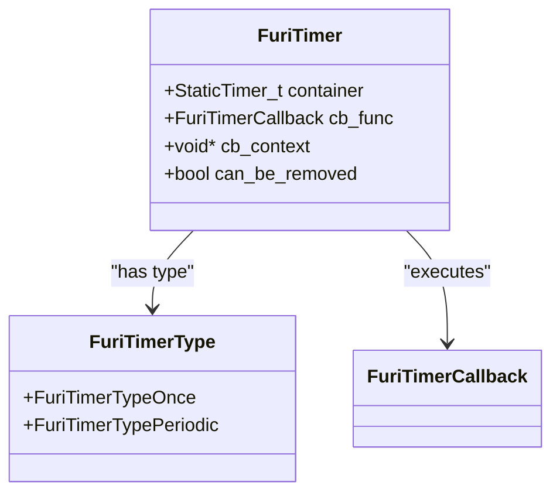

**Diagram sources**
- [timer.h](file://furi/core/timer.h#L1-L20)
- [timer.c](file://furi/core/timer.c#L1-L20)

**Section sources**
- [timer.h](file://furi/core/timer.h#L1-L117)
- [timer.c](file://furi/core/timer.c#L1-L170)

### Timer Types
Furi OS supports two types of timers:

#### One-shot Timer (FuriTimerTypeOnce)
- Executes the callback function once after the specified delay
- Automatically stops after execution
- Use for delayed execution of a single action

#### Periodic Timer (FuriTimerTypePeriodic)
- Executes the callback function repeatedly at the specified interval
- Continues until explicitly stopped
- Use for recurring tasks like status updates or polling

### API Functions
The timer API provides functions for creation, starting, stopping, and querying timer state.

#### Creation and Destruction
```c
// Allocate a timer
FuriTimer* furi_timer_alloc(FuriTimerCallback func, FuriTimerType type, void* context);

// Free a timer
void furi_timer_free(FuriTimer* instance);
```

**Parameters:**
- `func`: Callback function to execute when timer expires
- `type`: FuriTimerTypeOnce or FuriTimerTypePeriodic
- `context`: User-specified data passed to the callback

**Important**: Timer allocation must not be called from interrupt context.

#### Starting and Stopping
```c
// Start or restart a timer
FuriStatus furi_timer_start(FuriTimer* instance, uint32_t ticks);

// Restart a timer with the same timeout
FuriStatus furi_timer_restart(FuriTimer* instance, uint32_t ticks);

// Stop a timer
FuriStatus furi_timer_stop(FuriTimer* instance);
```

**Parameters:**
- `ticks`: Time delay in system ticks (configTICK_RATE_HZ determines the tick period)

**Note**: These are asynchronous calls - the actual operation occurs when the timer service processes the request.

#### Querying Timer State
```c
// Check if timer is running
uint32_t furi_timer_is_running(FuriTimer* instance);

// Get timer expiration time
uint32_t furi_timer_get_expire_time(FuriTimer* instance);

// Get name of currently executing timer
const char* furi_timer_get_current_name(void);
```

### Usage Example
```c
// Timer callback function
void my_timer_callback(void* context) {
    // This runs in the timer thread context
    FuriString* log_msg = furi_string_alloc_printf("Timer expired: %s", (char*)context);
    // Use furi_timer_get_current_name() to get timer name
    const char* timer_name = furi_timer_get_current_name();
    // Perform timer action
    furi_string_free(log_msg);
}

// Create and start a one-shot timer
FuriTimer* one_shot_timer = furi_timer_alloc(
    my_timer_callback, 
    FuriTimerTypeOnce, 
    "One-shot timer");
furi_timer_start(one_shot_timer, 1000); // 1000 ticks delay

// Create and start a periodic timer
FuriTimer* periodic_timer = furi_timer_alloc(
    my_timer_callback, 
    FuriTimerTypePeriodic, 
    "Periodic timer");
furi_timer_start(periodic_timer, 500); // 500 ticks interval

// Restart a timer
furi_timer_restart(one_shot_timer, 2000); // New 2000 ticks delay

// Stop a timer
furi_timer_stop(periodic_timer);

// Check timer state
if(furi_timer_is_running(periodic_timer)) {
    uint32_t expire_time = furi_timer_get_expire_time(periodic_timer);
    // Timer is active, will expire at expire_time
}

// Cleanup
furi_timer_free(one_shot_timer);
furi_timer_free(periodic_timer);
```

### Timer Thread and Priority
The timer implementation includes functions to manage the timer thread priority:

```c
// Set timer thread priority
void furi_timer_set_thread_priority(FuriTimerThreadPriority priority);
```

**Priority Levels:**
- **FuriTimerThreadPriorityNormal**: Lower than other threads (default)
- **FuriTimerThreadPriorityElevated**: Same as other threads

This allows developers to control the relative priority of timer callbacks compared to other application threads.

### Deferred Function Calls
The timer system supports deferred function calls from the timer thread:

```c
// Schedule a function to be called from the timer thread
void furi_timer_pending_callback(FuriTimerPendigCallback callback, void* context, uint32_t arg);
```

This is useful for executing functions in the timer thread context, which may have different privileges or requirements than the calling thread.

### Thread Safety and Asynchronous Nature
The timer API has important characteristics regarding thread safety and execution:

**Asynchronous Operations:**
- Start, restart, and stop operations are asynchronous
- The actual operation occurs when the timer service processes the request
- This means there may be a delay between calling a function and its effect

**Thread Context:**
- Timer callbacks execute in the timer thread context, not the thread that started the timer
- The timer thread has its own stack and priority
- Use `furi_timer_get_current_name()` to identify which timer is executing

**Memory Management:**
- Timer deallocation is complex due to asynchronous nature
- `furi_timer_free()` waits for the timer to be completely removed from the timer service
- This ensures no dangling references or use-after-free errors

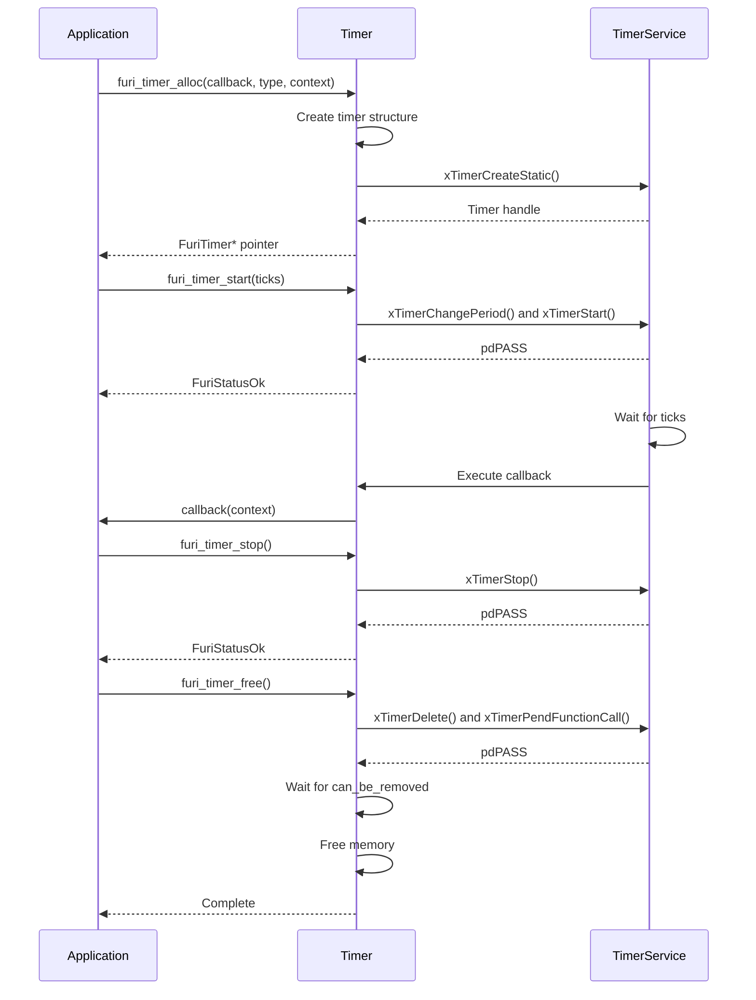

**Diagram sources**
- [timer.c](file://furi/core/timer.c#L50-L150)

**Section sources**
- [timer.h](file://furi/core/timer.h#L1-L117)
- [timer.c](file://furi/core/timer.c#L1-L170)

## String Utilities

The string utilities in Furi OS provide a robust, memory-safe string handling system. Built on the M*LIB library, it offers automatic memory management, bounds checking, and a rich set of string manipulation functions.

### Data Structure
The `FuriString` structure provides an opaque container for string data:

```c
typedef struct FuriString FuriString;
```

The actual implementation is hidden, but it manages:
- Dynamic memory allocation and resizing
- Null-terminated C string compatibility
- Capacity and size tracking
- Memory efficiency for common operations

```mermaid
classDiagram
class FuriString {
+allocate()
+free()
+reserve()
+reset()
+swap()
+move()
+hash()
+size()
+empty()
+get_char()
+get_cstr()
+set()
+set_str()
+cat()
+printf()
+vprintf()
+trim()
+to_upper()
+to_lower()
+replace()
+split()
+find()
+starts_with()
+ends_with()
}
FuriString : +data : char*
FuriString : +size : size_t
FuriString : +capacity : size_t
```

**Diagram sources**
- [string.h](file://furi/core/string.h#L1-L50)
- [string.c](file://furi/core/string.c#L1-L50)

**Section sources**
- [string.h](file://furi/core/string.h#L1-L200)
- [string.c](file://furi/core/string.c#L1-L200)

### Creation and Destruction
The string API provides multiple constructors for creating strings in different ways:

#### Constructors
```c
// Allocate empty string
FuriString* furi_string_alloc(void);

// Allocate and copy from another FuriString
FuriString* furi_string_alloc_set(const FuriString* source);

// Allocate and copy from C string
FuriString* furi_string_alloc_set_str(const char cstr_source[]);

// Allocate and format with printf-style arguments
FuriString* furi_string_alloc_printf(const char format[], ...) 
    _ATTRIBUTE((__format__(__printf__, 1, 2)));

// Allocate and format with va_list arguments
FuriString* furi_string_alloc_vprintf(const char format[], va_list args);

// Allocate and move content from another string
FuriString* furi_string_alloc_move(FuriString* source);
```

#### Destructor
```c
// Free string memory
void furi_string_free(FuriString* string);
```

### Memory Management
The string system includes functions for explicit memory management:

```c
// Reserve memory for at least 'size' characters
void furi_string_reserve(FuriString* string, size_t size);

// Reset string to empty state
void furi_string_reset(FuriString* string);

// Swap content with another string (O(1) operation)
void furi_string_swap(FuriString* string_1, FuriString* string_2);

// Move content from source to destination
void furi_string_move(FuriString* string_1, FuriString* string_2);
```

### String Information
Query functions provide information about string state:

```c
// Compute hash value
size_t furi_string_hash(const FuriString* string);

// Get string size (length)
size_t furi_string_size(const FuriString* string);

// Check if string is empty
bool furi_string_empty(const FuriString* string);
```

### Getters
Access string data in different formats:

```c
// Get character at index
char furi_string_get_char(const FuriString* string, size_t index);

// Get C string representation
const char* furi_string_get_cstr(const FuriString* string);
```

**Important**: The C string pointer is only valid until the next modifying operation on the string.

### Modifiers
Functions to modify string content:

```c
// Set string to another FuriString
void furi_string_set(FuriString* string, FuriString* source);

// Set string to C string
void furi_string_set_str(FuriString* string, const char cstr_source[]);

// Concatenate string with another FuriString
void furi_string_cat(FuriString* string, const FuriString* cat);

// Concatenate string with C string
void furi_string_cat_str(FuriString* string, const char cstr_cat[]);

// Format string with printf-style arguments
void furi_string_printf(FuriString* string, const char format[], ...) 
    _ATTRIBUTE((__format__(__printf__, 2, 3)));

// Format string with va_list arguments
void furi_string_vprintf(FuriString* string, const char format[], va_list args);

// Trim whitespace from string
void furi_string_trim(FuriString* string);

// Convert to uppercase
void furi_string_to_upper(FuriString* string);

// Convert to lowercase
void furi_string_to_lower(FuriString* string);

// Replace substring
bool furi_string_replace(FuriString* string, const char find[], const char replace[]);

// Split string by delimiter
FuriStringArray* furi_string_split(const FuriString* string, const char delimiter);
```

### Usage Example
```c
// Create strings using different constructors
FuriString* str1 = furi_string_alloc(); // Empty string
FuriString* str2 = furi_string_alloc_set_str("Hello"); // From C string
FuriString* str3 = furi_string_alloc_printf("World %d", 42); // Formatted

// Modify strings
furi_string_cat_str(str2, " ");
furi_string_cat(str2, str3);
furi_string_printf(str1, "Message: %s", furi_string_get_cstr(str2));

// Query string properties
size_t length = furi_string_size(str1);
bool is_empty = furi_string_empty(str1);
const char* cstr = furi_string_get_cstr(str1);

// Memory management
furi_string_reserve(str1, 256); // Pre-allocate memory
furi_string_reset(str1); // Clear content, keep memory

// String operations
furi_string_to_upper(str2);
furi_string_trim(str2);
furi_string_replace(str2, "WORLD", "UNIVERSE");

// Cleanup
furi_string_free(str1);
furi_string_free(str2);
furi_string_free(str3);
```

### Performance Characteristics
The string implementation is designed for efficiency in embedded contexts:

**Memory Efficiency:**
- Automatic resizing with geometric growth
- Capacity tracking to minimize reallocations
- Move semantics to avoid unnecessary copying

**Time Complexity:**
- O(1) for size, empty, swap operations
- O(n) for concatenation, formatting, search operations
- Amortized O(1) for append operations due to capacity management

**Safety Features:**
- Bounds checking for index access
- Null-termination guarantee
- Memory leak prevention through proper cleanup
- Thread safety (when used within same thread)

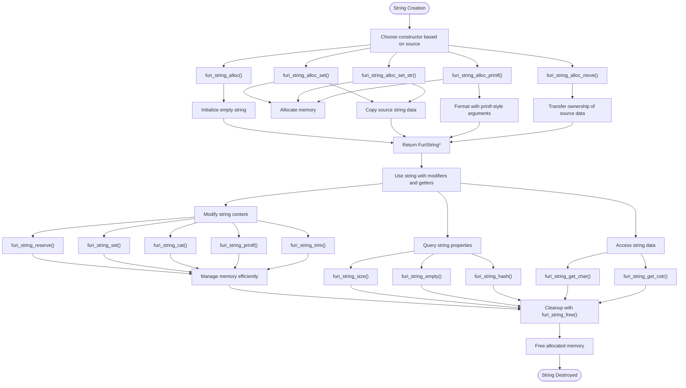

**Diagram sources**
- [string.c](file://furi/core/string.c#L200-L400)

**Section sources**
- [string.h](file://furi/core/string.h#L1-L800)
- [string.c](file://furi/core/string.c#L1-L800)

## Record System

The record system in Furi OS provides a service discovery and inter-process communication mechanism. It allows components to register named services and access them by name, enabling loose coupling between system components.

### Architecture and Design
The record system acts as a global registry for named services, similar to a service locator pattern. It enables components to:

1. **Register** services with a unique name
2. **Discover** services by name
3. **Access** service functionality through a common interface
4. **Manage** service lifecycle

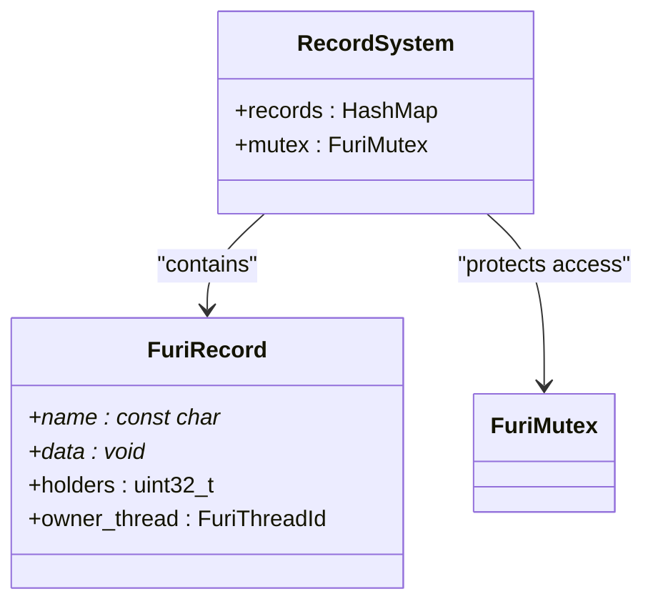

**Diagram sources**
- [record.h](file://furi/core/record.h#L1-L20)
- [record.c](file://furi/core/record.c#L1-L20)

**Section sources**
- [record.h](file://furi/core/record.h#L1-L68)
- [record.c](file://furi/core/record.c#L1-L20)

### Core Functions
The record system provides a simple API for service registration and access:

#### Initialization
```c
// Initialize record storage (internal use only)
void furi_record_init(void);
```

#### Existence Check
```c
// Check if a record exists
bool furi_record_exists(const char* name);
```

**Parameters:**
- `name`: Name of the record to check

**Returns:**
- `true` if the record exists, `false` otherwise

#### Service Registration
```c
// Create a record
void furi_record_create(const char* name, void* data);
```

**Parameters:**
- `name`: Unique name for the record
- `data`: Pointer to the service data (must not be NULL)

**Constraints:**
- Must be called from the same thread that will own the record
- Name must be unique
- Data pointer must be valid

#### Service Destruction
```c
// Destroy a record
bool furi_record_destroy(const char* name);
```

**Returns:**
- `true` if the record was successfully destroyed
- `false` if the record still has holders or the calling thread is not the owner

#### Service Access
```c
// Open a record (gain access to a service)
void* furi_record_open(const char* name);

// Close a record (release access to a service)
void furi_record_close(const char* name);
```

**Important**: `furi_record_open()` suspends the caller thread until the record is available.

### Usage Pattern
The record system follows a specific usage pattern to ensure proper resource management:

```c
// Service provider (e.g., in a driver or system service)
void my_service_init(void) {
    // Create service data
    MyServiceData* service_data = malloc(sizeof(MyServiceData));
    // Initialize service
    my_service_setup(service_data);
    // Register service
    furi_record_create("my_service", service_data);
}

void my_service_deinit(void) {
    // Destroy service
    furi_record_destroy("my_service");
}

// Service consumer (e.g., in an application)
void my_app_thread(void* context) {
    // Access service (blocks until available)
    MyServiceData* service = furi_record_open("my_service");
    
    // Use service
    my_service_do_work(service);
    
    // Release service access
    furi_record_close("my_service");
}
```

### Thread Safety and Constraints
The record system includes important thread safety considerations:

**Thread Safety:**
- `furi_record_exists()`: Thread-safe
- `furi_record_create()`: Thread-safe, but must be called from owner thread
- `furi_record_destroy()`: Thread-safe, but must be called from owner thread
- `furi_record_open()`: Thread-safe, suspends caller if record not available
- `furi_record_close()`: Thread-safe, must be called from same thread as open

**Critical Rules:**
1. **Create and destroy** must be executed from the same thread
2. **Open and close** must be executed from the same thread
3. The **owner thread** must destroy the record
4. Records with active holders cannot be destroyed

### Error Handling
The record system provides clear error conditions:

**furi_record_create():**
- Asserts if data pointer is NULL
- Asserts if name is already in use
- Thread-safe with mutex protection

**furi_record_destroy():**
- Returns `false` if record still has holders
- Returns `false` if calling thread is not the owner
- Returns `true` on successful destruction

**furi_record_open():**
- Suspends caller thread until record is available
- Returns NULL if record does not exist (should not occur with proper initialization)
- Thread-safe with reference counting

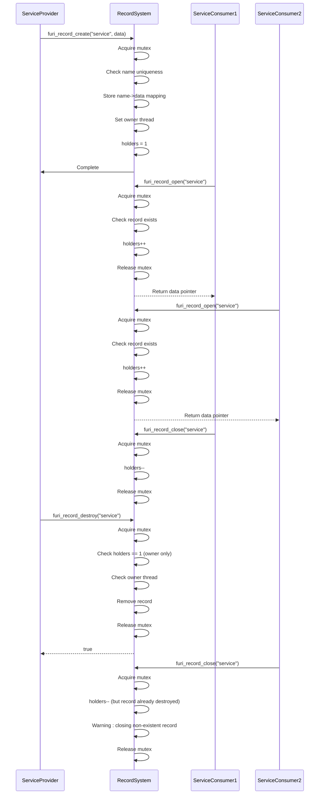

**Diagram sources**
- [record.c](file://furi/core/record.c#L50-L150)

**Section sources**
- [record.h](file://furi/core/record.h#L1-L68)
- [record.c](file://furi/core/record.c#L1-L150)

## Best Practices

This section outlines best practices for using Furi OS primitives effectively and safely in embedded applications.

### Resource Management
Proper resource management is critical in embedded systems with limited memory:

**Thread Management:**
- Always free threads with `furi_thread_free()` when no longer needed
- Ensure threads are stopped before freeing
- Use service threads for long-running background tasks to save memory
- Set appropriate stack sizes to avoid overflow while minimizing memory usage

**Synchronization Primitives:**
- Always free mutexes, semaphores, and message queues when no longer needed
- Match every `alloc` with a corresponding `free`
- Use RAII-like patterns or cleanup functions to ensure resources are released

**Timer Management:**
- Always stop timers before freeing them
- Be aware of the asynchronous nature of timer operations
- Use `furi_timer_free()` which handles the complex cleanup process

### Error Handling
Robust error handling ensures system stability:

**Check Return Values:**
```c
// Always check return values
FuriStatus status = furi_mutex_acquire(mutex, 100);
if(status != FuriStatusOk) {
    // Handle timeout or error
    FURI_LOG_E("Mutex", "Failed to acquire: %d", status);
    return;
}
```

**Use Appropriate Timeouts:**
- Avoid `FuriWaitForever` in production code
- Use finite timeouts to prevent deadlocks
- Choose timeouts based on expected operation duration

**Validate Parameters:**
- Ensure pointers are not NULL before use
- Validate input ranges and constraints
- Use assertions during development to catch errors early

### Concurrency Patterns
Effective use of concurrency primitives:

**Producer-Consumer:**
- Use message queues for data transfer
- Use semaphores to track available space and messages
- Ensure proper synchronization to avoid race conditions

**Reader-Writer:**
- Use mutexes for exclusive access
- Consider using semaphores for multiple readers
- Minimize critical section duration

**Thread Coordination:**
- Use semaphores for signaling between threads
- Use condition variables (if available) for complex coordination
- Avoid busy-waiting; use blocking operations with timeouts

### Performance Considerations
Optimize for the constrained embedded environment:

**Memory Usage:**
- Pre-allocate memory when possible
- Reuse objects instead of creating and destroying
- Use stack allocation for small, short-lived objects

**CPU Efficiency:**
- Minimize context switches
- Avoid unnecessary locking
- Use event-driven programming instead of polling

**Power Consumption:**
- Use low-power modes when idle
- Minimize timer frequency
- Batch operations when possible

### Debugging and Testing
Ensure reliability through proper testing:

**Enable Debug Features:**
- Use heap and stack monitoring during development
- Enable assertions to catch programming errors
- Use logging to trace execution flow

**Testing Strategies:**
- Test edge cases and error conditions
- Verify resource cleanup in all code paths
- Test under memory-constrained conditions

### Code Organization
Structure code for maintainability:

**Modular Design:**
- Separate concerns into different modules
- Use clear interfaces between components
- Minimize dependencies between modules

**Naming Conventions:**
- Use descriptive names for threads, records, and services
- Follow consistent naming patterns
- Include purpose in names when not obvious

**Documentation:**
- Document thread safety requirements
- Specify ownership and lifetime of objects
- Document error handling expectations

By following these best practices, developers can create robust, efficient, and maintainable applications on the Furi OS platform.

**Section sources**
- [thread.c](file://furi/core/thread.c#L500-L700)
- [mutex.c](file://furi/core/mutex.c#L100-L120)
- [semaphore.c](file://furi/core/semaphore.c#L100-L120)
- [timer.c](file://furi/core/timer.c#L150-L170)
- [string.c](file://furi/core/string.c#L700-L800)
- [record.c](file://furi/core/record.c#L100-L150)