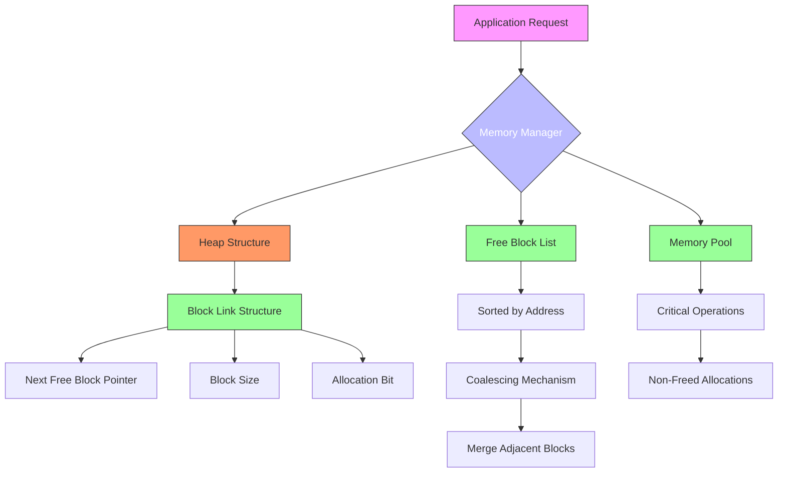
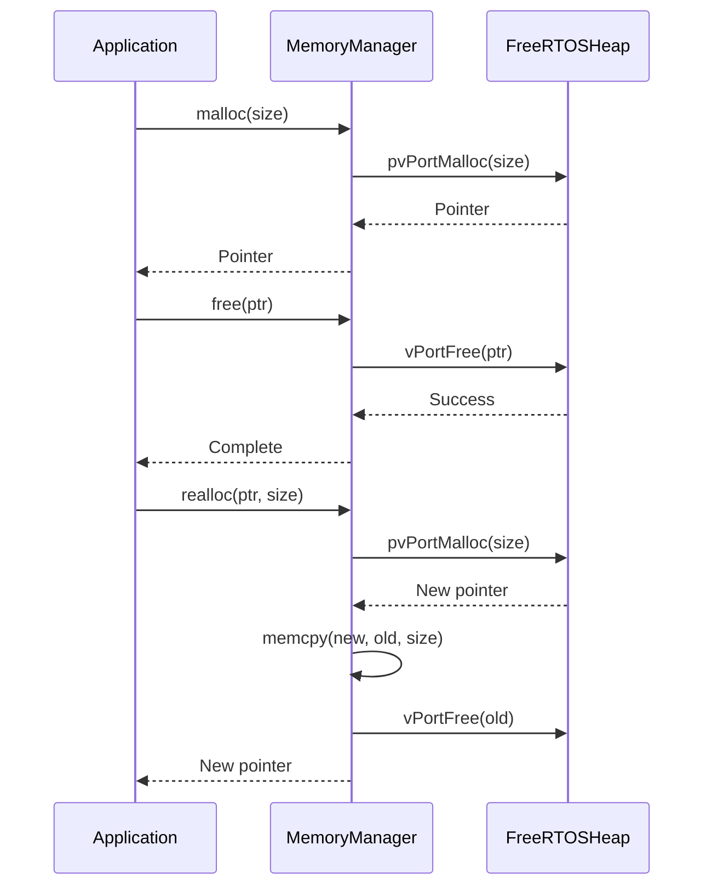
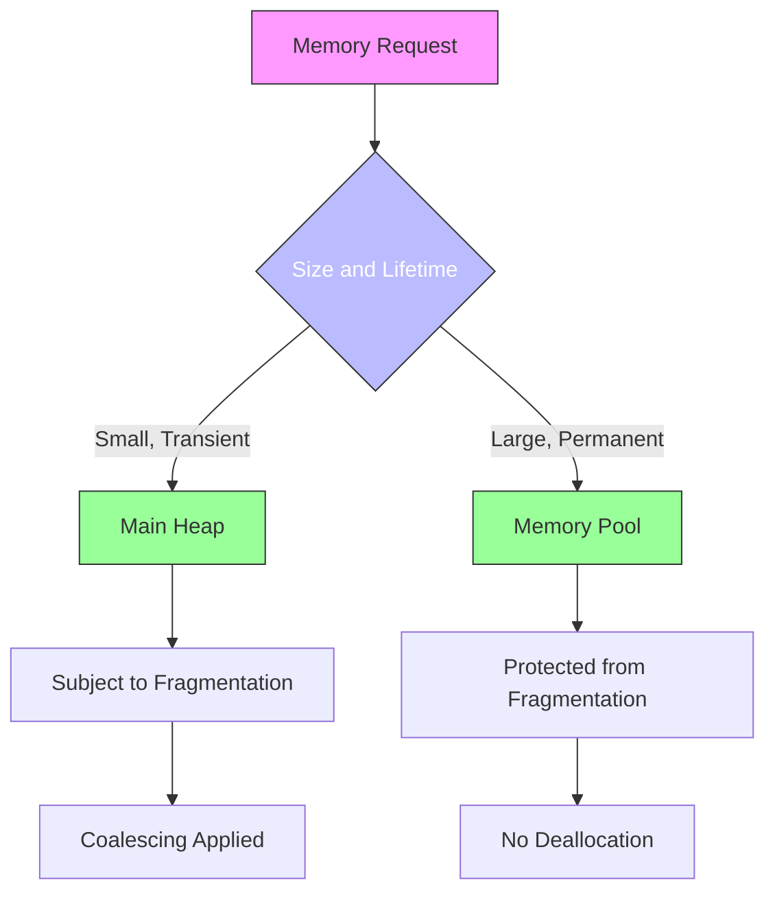

# Memory Management

<cite>
**Referenced Files in This Document**   
- [memmgr.h](file://furi/core/memmgr.h#L1-L78)
- [memmgr.c](file://furi/core/memmgr.c#L1-L113)
- [memmgr_heap.h](file://furi/core/memmgr_heap.h#L1-L50)
- [memmgr_heap.c](file://furi/core/memmgr_heap.c#L1-L660)
- [string.h](file://furi/core/string.h#L1-L796)
- [string.c](file://furi/core/string.c#L1-L325)
</cite>

## Table of Contents
1. [Memory Management System Overview](#memory-management-system-overview)
2. [Heap Management Architecture](#heap-management-architecture)
3. [Memory Allocation Strategies](#memory-allocation-strategies)
4. [Fragmentation Considerations in Embedded Contexts](#fragmentation-considerations-in-embedded-contexts)
5. [Thread Stack Integration](#thread-stack-integration)
6. [String Utilities and Safety Features](#string-utilities-and-safety-features)
7. [Best Practices for Memory Usage Optimization](#best-practices-for-memory-usage-optimization)

## Memory Management System Overview

The Furi OS memory management system provides a comprehensive framework for dynamic memory allocation in embedded environments. The system is designed to balance performance, reliability, and safety while operating within the constrained resources typical of embedded devices. At its core, the memory management system consists of two primary components: a heap-based dynamic memory allocator and a specialized string utility library.

The memory manager implements a wrapper around FreeRTOS's heap management system, providing additional functionality for monitoring and debugging memory usage. This approach allows the system to leverage the proven reliability of FreeRTOS while adding application-specific features tailored to the Flipper Zero platform. The string utilities provide a safe, efficient alternative to standard C string functions, addressing common security vulnerabilities such as buffer overflows.

Key metrics provided by the memory management system include:
- **Free heap size**: Current available memory for allocation
- **Total heap size**: Overall heap capacity
- **Minimum free heap**: Historical low-water mark for available memory
- **Memory pool information**: Separate allocation pool for critical operations

These metrics enable developers to monitor memory usage patterns and identify potential issues before they lead to system instability.

**Section sources**
- [memmgr.h](file://furi/core/memmgr.h#L1-L78)
- [memmgr.c](file://furi/core/memmgr.c#L1-L113)

## Heap Management Architecture

The heap management system in Furi OS is built on FreeRTOS's heap_4 implementation, which features coalescence of adjacent free blocks to minimize fragmentation. This architecture choice is particularly important in embedded systems where memory is limited and long-term stability is critical.



**Diagram sources**
- [memmgr_heap.c](file://furi/core/memmgr_heap.c#L1-L660)
- [memmgr.c](file://furi/core/memmgr.c#L1-L113)

**Section sources**
- [memmgr_heap.c](file://furi/core/memmgr_heap.c#L1-L660)
- [memmgr_heap.h](file://furi/core/memmgr_heap.h#L1-L50)

### Core Data Structures

The heap management system uses a linked list of free blocks to track available memory. Each block is represented by the `BlockLink_t` structure:

```c
typedef struct A_BLOCK_LINK {
    struct A_BLOCK_LINK* pxNextFreeBlock;
    size_t xBlockSize;
} BlockLink_t;
```

The `xBlockSize` field includes a special bit (xBlockAllocatedBit) that indicates whether the block is allocated or free. This design allows for efficient determination of block status without requiring additional metadata.

### Initialization Process

The heap is initialized during the first memory allocation request through the `prvHeapInit()` function. This lazy initialization approach ensures that memory management resources are only allocated when needed. The heap boundaries are defined by linker symbols (`__heap_start__`), which are set during the build process based on the target hardware's memory map.

## Memory Allocation Strategies

Furi OS implements several memory allocation strategies to accommodate different use cases and performance requirements. These strategies are exposed through a comprehensive API that wraps the underlying FreeRTOS heap functions.

### Standard Allocation Functions

The memory manager provides standard C library allocation functions that are thread-safe and integrated with FreeRTOS:



**Diagram sources**
- [memmgr.c](file://furi/core/memmgr.c#L1-L113)

### Specialized Allocation Functions

In addition to standard functions, the system provides specialized allocation mechanisms:

**Aligned Memory Allocation**
```c
void* aligned_malloc(size_t size, size_t alignment);
void aligned_free(void* p);
```

This function allocates memory with specific alignment requirements, which is essential for hardware interfaces and performance-critical operations. The implementation stores a pointer to the original allocation immediately before the aligned block, allowing proper deallocation through `aligned_free()`.

**Memory Pool Allocation**
```c
void* memmgr_alloc_from_pool(size_t size);
```

This function allocates memory from a separate pool that cannot be freed. This strategy is used for critical system components that must remain allocated for the device's lifetime, preventing fragmentation in the main heap.

### Error Handling and Out-of-Memory Conditions

The memory manager handles out-of-memory conditions gracefully:

1. When `malloc()` fails, it returns `NULL`
2. The system tracks the minimum free heap size to help diagnose memory pressure
3. Applications should always check allocation results before use

```c
void* ptr = malloc(1024);
if(ptr == NULL) {
    // Handle allocation failure
    // Log error, free non-critical memory, or enter safe mode
}
```

**Section sources**
- [memmgr.c](file://furi/core/memmgr.c#L1-L113)
- [memmgr.h](file://furi/core/memmgr.h#L1-L78)

## Fragmentation Considerations in Embedded Contexts

Memory fragmentation is a critical concern in embedded systems with limited RAM and long operational lifetimes. The Furi OS memory manager addresses fragmentation through several mechanisms:

### Block Coalescing

The heap implementation automatically merges adjacent free blocks when memory is freed. This coalescing mechanism prevents the heap from becoming fragmented over time, maintaining larger contiguous free blocks for future allocations.

```c
static void prvInsertBlockIntoFreeList(BlockLink_t* pxBlockToInsert) {
    // Insert block in address order
    // Check if adjacent blocks are free
    // Merge with adjacent free blocks if possible
}
```

### Fragmentation Monitoring

The system provides tools to monitor and analyze heap fragmentation:

```c
size_t memmgr_heap_get_max_free_block(void);
void memmgr_heap_printf_free_blocks(void);
```

These functions allow developers to:
- Determine the largest contiguous block available
- Print detailed information about all free blocks
- Identify fragmentation patterns during development

### Memory Pool Strategy

By allocating critical, long-lived objects from a separate memory pool, the system protects the main heap from fragmentation caused by these allocations. This separation ensures that transient allocations and deallocations do not impact the availability of memory for critical system components.



**Diagram sources**
- [memmgr_heap.c](file://furi/core/memmgr_heap.c#L1-L660)

**Section sources**
- [memmgr_heap.c](file://furi/core/memmgr_heap.c#L1-L660)

## Thread Stack Integration

The memory manager integrates with the threading system to provide detailed memory usage tracking per thread. This integration is crucial for identifying memory leaks and optimizing resource allocation in multi-threaded applications.

### Thread Memory Tracking

The system can track memory allocations by thread, allowing developers to monitor which threads are consuming the most memory:

```c
void memmgr_heap_enable_thread_trace(FuriThreadId thread_id);
void memmgr_heap_disable_thread_trace(FuriThreadId thread_id);
size_t memmgr_heap_get_thread_memory(FuriThreadId thread_id);
```

This tracking uses a dictionary structure to maintain allocation records for each monitored thread. When enabled, every allocation and deallocation is recorded with the allocating thread's ID.

### Implementation Details

The thread tracking system uses the M*LIB dictionary implementation to store allocation records:

```c
DICT_DEF2(MemmgrHeapThreadDict, uint32_t, MemmgrHeapAllocDict_t)
static MemmgrHeapThreadDict_t memmgr_heap_thread_dict = {0};
```

When a thread is registered for tracking:
1. A dictionary is created to store its allocations
2. Each allocation records the pointer and size
3. Deallocation removes the record
4. The system can report total allocated memory for the thread

This approach provides detailed insights into memory usage patterns without significantly impacting performance.

**Section sources**
- [memmgr_heap.c](file://furi/core/memmgr_heap.c#L1-L660)
- [memmgr_heap.h](file://furi/core/memmgr_heap.h#L1-L50)

## String Utilities and Safety Features

The Furi OS string utilities provide a safe, efficient alternative to standard C string functions, addressing common security vulnerabilities while maintaining good performance.

### FuriString Data Structure

The string system is built around the `FuriString` opaque structure:

```c
struct FuriString {
    string_t string;
};
```

This wrapper provides a consistent interface while leveraging the underlying M*LIB string implementation for efficiency and safety.

### Safety Features

The string utilities include several safety mechanisms:

**Automatic Buffer Management**
- Dynamic resizing eliminates buffer overflow risks
- Capacity is automatically increased as needed
- No manual memory management required

**Bounds Checking**
- All operations validate indices
- Functions like `furi_string_get_char()` check bounds
- Prevents out-of-bounds access

**Safe String Operations**
```c
void furi_string_set_strn(FuriString* s, const char str[], size_t n);
```
This function limits the number of characters copied, preventing buffer overflows from untrusted input.

### Buffer Overflow Prevention

The system prevents buffer overflows through multiple mechanisms:

1. **Encapsulation**: String data is hidden behind an opaque interface
2. **Automatic Resizing**: Buffers grow as needed during concatenation
3. **Length-Limited Operations**: Functions accept maximum lengths
4. **Bounds Checking**: Index operations are validated

```c
// Safe concatenation
FuriString* str = furi_string_alloc_set_str("Hello");
furi_string_cat_printf(str, " World: %d", 42);
// Buffer automatically resized as needed
```

### Usage Examples

The string utilities are used throughout the codebase for various purposes:

```c
// String creation
FuriString* str = furi_string_alloc_set_str("Initial value");

// Formatted output
FuriString* formatted = furi_string_alloc_printf("Value: %d", 42);

// String manipulation
furi_string_replace_str(str, "old", "new", 0);

// Cleanup
furi_string_free(str);
```

**Section sources**
- [string.h](file://furi/core/string.h#L1-L796)
- [string.c](file://furi/core/string.c#L1-L325)

## Best Practices for Memory Usage Optimization

Effective memory management in embedded systems requires adherence to several best practices to ensure long-term stability and optimal performance.

### Memory Allocation Guidelines

**Prefer Stack Allocation When Possible**
- Use stack variables for small, short-lived data
- Avoid dynamic allocation for fixed-size buffers
- Stack allocation is faster and doesn't fragment heap

**Use Memory Pools for Critical Components**
- Allocate essential system components from the memory pool
- Prevents fragmentation of main heap
- Ensures availability of critical resources

**Always Check Allocation Results**
```c
void* ptr = malloc(size);
if(ptr == NULL) {
    // Handle out-of-memory condition
    return FURI_STRING_FAILURE;
}
```

### String Usage Best Practices

**Reuse String Objects**
- Allocate strings once and reuse them in loops
- Avoid repeated allocation/deallocation
- Use `furi_string_reset()` to clear content

**Use Appropriate String Functions**
- Use `furi_string_set_strn()` when input length is uncertain
- Prefer `furi_string_printf()` over manual buffer management
- Use `furi_string_cat_printf()` for efficient concatenation

### Memory Leak Prevention

**Match Allocation with Deallocation**
- Every `furi_string_alloc()` must have a corresponding `furi_string_free()`
- Use RAII patterns when possible
- Consider using static analysis tools

**Monitor Memory Usage**
- Regularly check `memmgr_get_free_heap()`
- Track `memmgr_get_minimum_free_heap()` during testing
- Use thread memory tracking to identify leaks

### System Stability Considerations

The relationship between memory management and system stability is critical:

1. **Fragmentation Prevention**: Coalescing and memory pools maintain heap health
2. **Error Handling**: Graceful degradation when memory is exhausted
3. **Monitoring**: Tools to diagnose memory issues before they cause failures
4. **Predictable Performance**: Consistent allocation/deallocation times

By following these best practices, developers can create applications that maintain stability even under memory pressure, ensuring reliable operation in the resource-constrained environment of the Flipper Zero platform.

**Section sources**
- [memmgr.c](file://furi/core/memmgr.c#L1-L113)
- [memmgr_heap.c](file://furi/core/memmgr_heap.c#L1-L660)
- [string.c](file://furi/core/string.c#L1-L325)
- [string.h](file://furi/core/string.h#L1-L796)