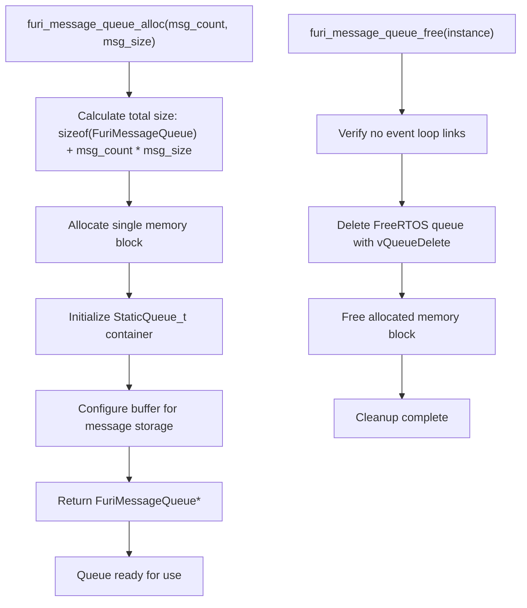
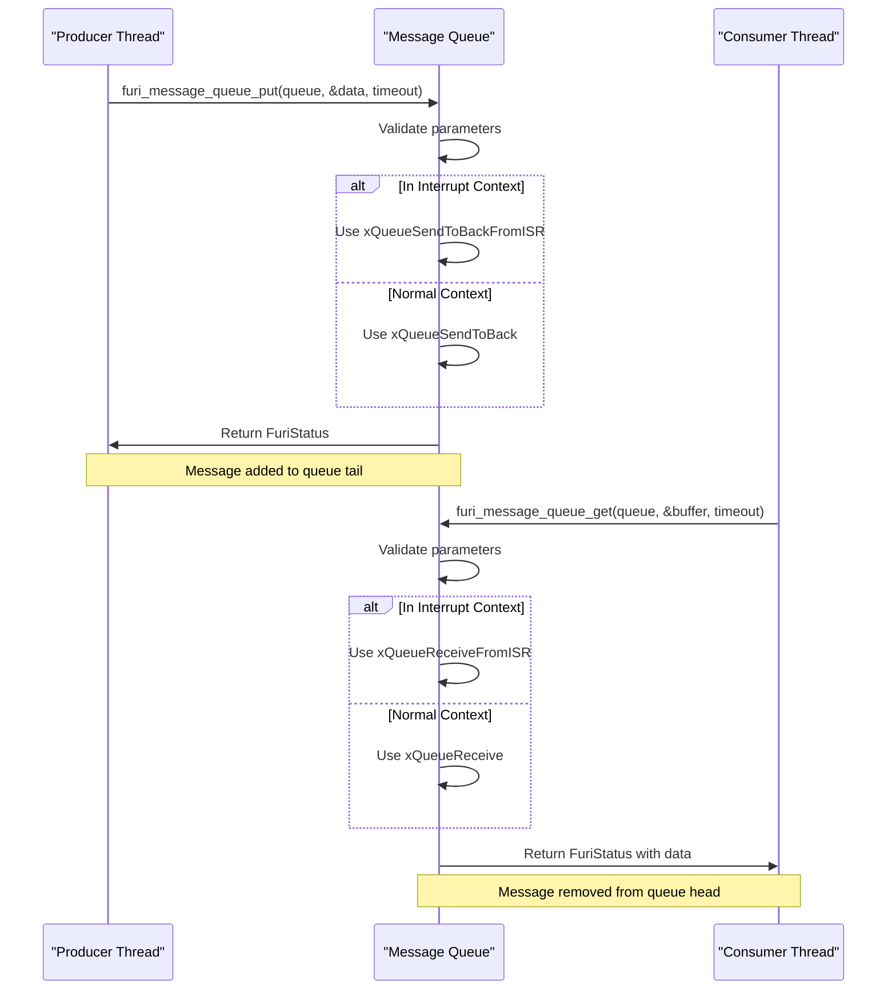
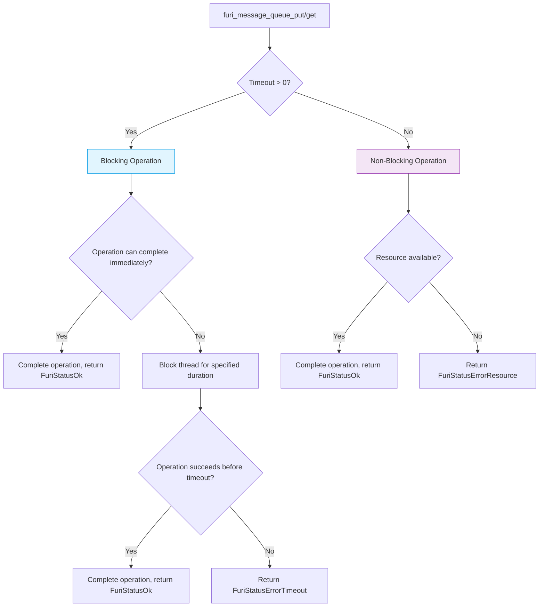
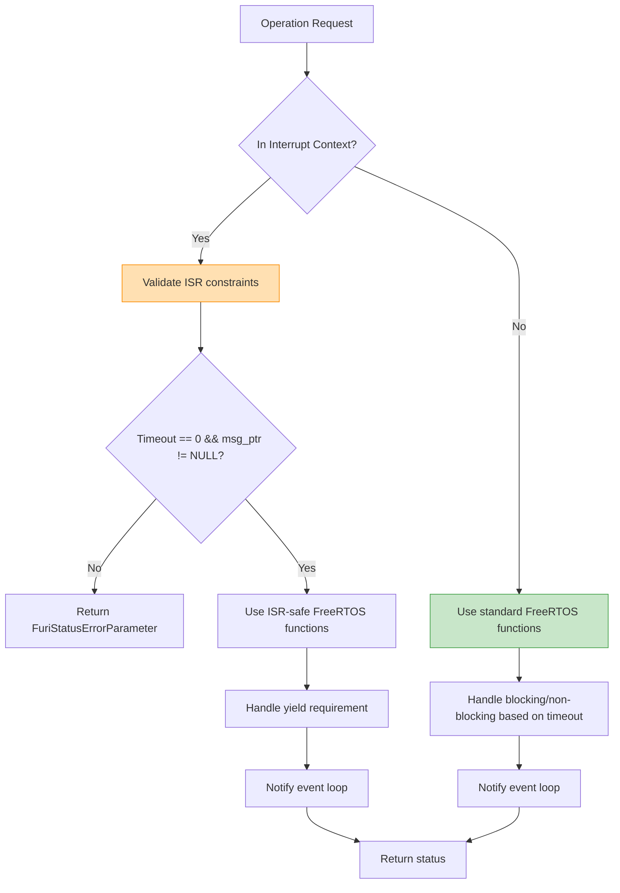
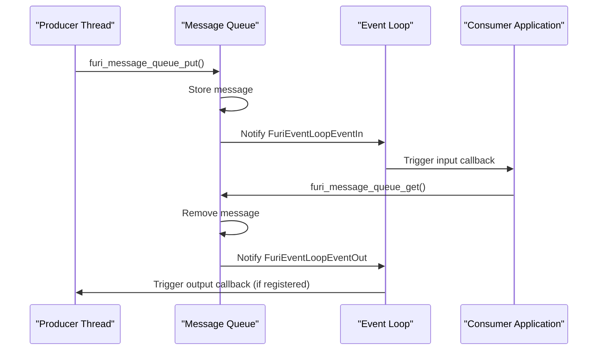

# Message Queue System

<cite>
**Referenced Files in This Document**   
- [message_queue.h](file://furi/core/message_queue.h)
- [message_queue.c](file://furi/core/message_queue.c)
- [message_queue_i.h](file://furi/core/message_queue_i.h)
- [event_loop.h](file://furi/core/event_loop.h)
- [event_loop_link_i.h](file://furi/core/event_loop_link_i.h)
</cite>

## Table of Contents
1. [Introduction](#introduction)
2. [Core Components](#core-components)
3. [Message Queue Structure and Memory Management](#message-queue-structure-and-memory-management)
4. [Message Allocation and Queuing Mechanics](#message-allocation-and-queuing-mechanics)
5. [Blocking vs Non-Blocking Operations](#blocking-vs-non-blocking-operations)
6. [Thread Safety and Interrupt Context Handling](#thread-safety-and-interrupt-context-handling)
7. [Event Loop Integration](#event-loop-integration)
8. [Performance Characteristics and Best Practices](#performance-characteristics-and-best-practices)
9. [Conclusion](#conclusion)

## Introduction
The Furi OS message queue system provides a robust mechanism for inter-thread communication and data passing within the embedded operating environment. Built on top of FreeRTOS, this implementation offers a thread-safe, efficient way to exchange data between different execution contexts while maintaining system stability and responsiveness. The message queue serves as a fundamental building block for application development on the Flipper Zero platform, enabling decoupled communication between components with different execution priorities and timing requirements.

The system is designed to handle variable-sized messages with configurable queue depth, providing flexibility for different use cases ranging from simple event notification to complex data transfer. This documentation provides a comprehensive analysis of the message queue implementation, covering its architecture, functionality, and best practices for effective usage in application development.

**Section sources**
- [message_queue.h](file://furi/core/message_queue.h#L1-L93)
- [message_queue.c](file://furi/core/message_queue.c#L1-L233)

## Core Components

The message queue system consists of several key components that work together to provide reliable inter-thread communication. At its core, the implementation leverages FreeRTOS queue primitives while adding additional abstractions and safety checks specific to the Furi OS environment. The primary components include the message queue structure itself, memory management functions, and integration with the event loop system.

The API exposes a clean interface for queue creation, message passing, and queue management, abstracting away the underlying FreeRTOS complexity. Key functions include `furi_message_queue_alloc` for queue creation, `furi_message_queue_put` and `furi_message_queue_get` for message operations, and various utility functions for queue state inspection. The system also includes comprehensive error checking through the `furi_check` mechanism, ensuring robust operation even in edge cases.

```mermaid
classDiagram
class FuriMessageQueue {
+StaticQueue_t container
+FuriEventLoopLink event_loop_link
+uint8_t buffer[]
+furi_message_queue_alloc(msg_count, msg_size) FuriMessageQueue*
+furi_message_queue_free(instance) void
+furi_message_queue_put(instance, msg_ptr, timeout) FuriStatus
+furi_message_queue_get(instance, msg_ptr, timeout) FuriStatus
+furi_message_queue_get_capacity(instance) uint32_t
+furi_message_queue_get_message_size(instance) uint32_t
+furi_message_queue_get_count(instance) uint32_t
+furi_message_queue_get_space(instance) uint32_t
+furi_message_queue_reset(instance) FuriStatus
}
class StaticQueue_t {
+uint32_t uxMessagesWaiting
+uint32_t uxLength
+uint32_t uxItemSize
}
class FuriEventLoopLink {
+void* item_in
+void* item_out
}
FuriMessageQueue --> StaticQueue_t : "contains"
FuriMessageQueue --> FuriEventLoopLink : "contains"
FuriMessageQueue --> "FreeRTOS Queue" : "wraps"
```

**Diagram sources**
- [message_queue.h](file://furi/core/message_queue.h#L15-L20)
- [message_queue.c](file://furi/core/message_queue.c#L10-L15)

**Section sources**
- [message_queue.h](file://furi/core/message_queue.h#L1-L93)
- [message_queue.c](file://furi/core/message_queue.c#L1-L233)

## Message Queue Structure and Memory Management

The `FuriMessageQueue` structure is carefully designed to optimize memory usage and ensure compatibility with the underlying FreeRTOS implementation. The structure consists of three main components: the FreeRTOS queue container, an event loop link structure, and a variable-length buffer array. The memory layout is critical to the implementation, with specific requirements enforced through static assertions.

The structure uses a technique called "flexible array member" with `uint8_t buffer[]` as the final member, allowing the allocation of both the structure header and message storage in a single memory block. This approach eliminates the need for separate memory allocations and reduces memory fragmentation. When a queue is created with `furi_message_queue_alloc`, memory is allocated for the entire structure plus the message storage area, calculated as `sizeof(FuriMessageQueue) + msg_count * msg_size`.

Two important constraints are enforced through static assertions:
- The `container` member must be the first element in the structure (offset 0)
- The `buffer` member must be the last element in the structure

These constraints enable the safe casting of a `FuriMessageQueue*` pointer to `QueueHandle_t`, which is essential for interfacing with FreeRTOS functions. The memory management system uses standard `malloc` and `free` functions, with all allocations checked through `furi_check` to ensure validity.



**Diagram sources**
- [message_queue.c](file://furi/core/message_queue.c#L34-L54)
- [message_queue.c](file://furi/core/message_queue.c#L62-L70)

**Section sources**
- [message_queue.c](file://furi/core/message_queue.c#L34-L70)

## Message Allocation and Queuing Mechanics

The message queue implementation provides a comprehensive set of functions for managing message flow between threads. The core operations revolve around message insertion (`put`) and extraction (`get`), with additional utility functions for monitoring queue state. The system is designed to handle messages of fixed size, with the size specified at queue creation time and enforced throughout the queue's lifetime.

When allocating a message queue, developers must specify two critical parameters: message count (queue depth) and message size (in bytes). These parameters determine the total memory footprint and the type of data that can be passed through the queue. For example, a queue configured with a message size of `sizeof(uint32_t)` can only pass 32-bit integers, while a larger size could accommodate complex structures.

The queuing mechanics follow a first-in, first-out (FIFO) principle, with messages always added to the back of the queue. The implementation uses FreeRTOS's `xQueueSendToBack` function internally, ensuring consistent behavior with the underlying RTOS. Each message operation includes comprehensive parameter validation through `furi_check`, which verifies that the queue instance is valid and that the message pointer is not null.

Queue state can be monitored through several utility functions:
- `furi_message_queue_get_capacity`: Returns the maximum number of messages the queue can hold
- `furi_message_queue_get_message_size`: Returns the size of each message in bytes
- `furi_message_queue_get_count`: Returns the current number of messages in the queue
- `furi_message_queue_get_space`: Returns the available space for additional messages

These functions provide essential information for flow control and can help prevent queue overflow or underflow conditions.



**Diagram sources**
- [message_queue.c](file://furi/core/message_queue.c#L72-L135)
- [message_queue.c](file://furi/core/message_queue.c#L137-L178)

**Section sources**
- [message_queue.c](file://furi/core/message_queue.c#L72-L178)

## Blocking vs Non-Blocking Operations

The message queue system supports both blocking and non-blocking operations through the timeout parameter, providing flexibility for different application requirements. The timeout parameter, specified in RTOS ticks, controls the behavior when a queue operation cannot be completed immediately.

For **blocking operations**, a timeout value greater than zero allows the calling thread to wait for the specified duration until the operation can succeed. When putting a message to a full queue, the producer thread will block until space becomes available or the timeout expires. Similarly, when getting a message from an empty queue, the consumer thread will block until a message arrives or the timeout expires. This behavior enables efficient resource utilization, as blocked threads do not consume CPU cycles.

For **non-blocking operations**, a timeout value of zero results in immediate return regardless of success or failure. This is particularly useful in time-critical contexts or when implementing polling mechanisms. The function returns immediately with either `FuriStatusOk` (operation succeeded) or `FuriStatusErrorResource` (queue full when putting, or empty when getting).

The system also handles **indefinite blocking** when a special timeout value (typically `FuriWaitForever`) is used, causing the thread to wait indefinitely until the operation can complete. This is useful for consumer threads that should always have work to do.

The implementation carefully distinguishes between different error conditions:
- `FuriStatusErrorTimeout`: Operation failed due to timeout expiration
- `FuriStatusErrorResource`: Operation failed due to immediate resource unavailability (non-blocking)
- `FuriStatusErrorParameter`: Invalid parameters were provided
- `FuriStatusErrorISR`: Attempt to perform an operation not allowed from interrupt context



**Diagram sources**
- [message_queue.c](file://furi/core/message_queue.c#L72-L135)
- [message_queue.c](file://furi/core/message_queue.c#L137-L178)

**Section sources**
- [message_queue.c](file://furi/core/message_queue.c#L72-L178)

## Thread Safety and Interrupt Context Handling

The message queue implementation provides comprehensive thread safety and supports operations from both thread and interrupt contexts. This dual-context capability is essential for embedded systems where hardware interrupts need to communicate with application threads efficiently.

The system detects the execution context using `furi_kernel_is_irq_or_masked()` and routes operations to the appropriate FreeRTOS API variants:
- In **thread context**: Standard FreeRTOS queue functions (`xQueueSendToBack`, `xQueueReceive`) are used
- In **interrupt context**: ISR-safe variants (`xQueueSendToBackFromISR`, `xQueueReceiveFromISR`) are used

This context-aware design ensures that message passing can occur safely regardless of the calling context. When operating in interrupt context, additional restrictions apply:
- Timeout must be zero (non-blocking only)
- Message pointer must not be null
- Special ISR-safe functions are required

The implementation includes safety checks to enforce these restrictions, returning `FuriStatusErrorParameter` if an invalid operation is attempted from interrupt context. For example, attempting to perform a blocking operation (timeout > 0) from an ISR will fail immediately.

The system also handles the critical section requirements for queue state queries. Functions like `furi_message_queue_get_space` use `taskENTER_CRITICAL_FROM_ISR` and `taskEXIT_CRITICAL_FROM_ISR` when called from interrupt context to prevent race conditions during the calculation of available space.

Thread safety is further enhanced by the underlying FreeRTOS queue implementation, which uses mutexes and atomic operations to protect shared data structures. This ensures that multiple threads can safely access the same queue simultaneously without data corruption.



**Diagram sources**
- [message_queue.c](file://furi/core/message_queue.c#L72-L178)

**Section sources**
- [message_queue.c](file://furi/core/message_queue.c#L72-L178)

## Event Loop Integration

The message queue system is tightly integrated with the Furi OS event loop through the `FuriEventLoopLink` structure and associated contract. This integration enables event-driven programming patterns where queue state changes can trigger callbacks in the event loop, eliminating the need for active polling.

The `FuriEventLoopLink` structure contains pointers for input and output items, allowing the queue to participate in the event loop's notification system. When a message is successfully put into the queue, the system notifies the event loop of an `FuriEventLoopEventIn` event. Conversely, when a message is successfully retrieved from the queue, an `FuriEventLoopEventOut` event is generated.

This integration is facilitated by the `furi_message_queue_event_loop_contract`, which provides two key functions:
- `get_link`: Returns the event loop link structure for the queue
- `get_level`: Returns the current level for a given event type (message count for input, available space for output)

The contract allows the event loop to monitor queue state and trigger appropriate callbacks when significant changes occur. For example, a consumer application can register to be notified when messages become available (input event), while a producer can be notified when space becomes available (output event).

This event-driven approach significantly improves system efficiency by eliminating busy-waiting and reducing CPU utilization. Applications can remain idle until there is actual work to do, conserving power and allowing other tasks to execute.



**Diagram sources**
- [message_queue.c](file://furi/core/message_queue.c#L200-L233)
- [message_queue_i.h](file://furi/core/message_queue_i.h#L1-L6)

**Section sources**
- [message_queue.c](file://furi/core/message_queue.c#L200-L233)

## Performance Characteristics and Best Practices

The message queue system exhibits predictable performance characteristics that are essential for real-time embedded applications. Understanding these characteristics and following best practices ensures optimal system performance and reliability.

**Performance Characteristics:**
- **Time Complexity**: O(1) for all basic operations (put, get, state queries)
- **Memory Overhead**: Minimal, with only the structure header and event loop link overhead
- **Context Switching**: Occurs only when blocking operations time out or when higher priority tasks are unblocked
- **Interrupt Latency**: ISR operations are fast, with minimal processing before yielding

**Best Practices for Message Size Optimization:**
1. **Use appropriate message sizes**: Match the message size to the data being passed. For simple events, use small messages (e.g., `sizeof(uint32_t)`). For complex data, consider the trade-off between message size and queue depth.
2. **Avoid large messages**: Large messages increase memory usage and can cause cache inefficiencies. For large data transfers, consider passing pointers to data rather than the data itself.
3. **Consider alignment**: Ensure message sizes are aligned to natural boundaries (4-byte or 8-byte) for optimal memory access performance.
4. **Balance queue depth and memory**: Deeper queues provide more buffering but consume more memory. Choose a depth that accommodates peak message rates without excessive memory usage.

**Thread Safety Considerations:**
- Always check return values to handle error conditions appropriately
- Never access queue internals directly; use only the provided API functions
- Be cautious with queue cleanup: ensure no threads are blocked on the queue before freeing it
- Avoid holding references to freed queues

**Potential Deadlock Patterns to Avoid:**
1. **Circular dependencies**: Don't create chains of queues where Thread A waits for Thread B, which waits for Thread C, which waits for Thread A
2. **Nested blocking**: Avoid blocking operations within critical sections or callbacks
3. **Inadequate timeout values**: Use reasonable timeouts to prevent indefinite blocking
4. **Resource starvation**: Ensure producers don't overwhelm consumers with messages

**Memory Management Guidelines:**
- Always pair `furi_message_queue_alloc` with `furi_message_queue_free`
- Verify that the event loop has disconnected from the queue before freeing
- Consider using static allocation for queues with known, fixed requirements
- Monitor queue utilization to optimize size and depth parameters

**Section sources**
- [message_queue.h](file://furi/core/message_queue.h#L1-L93)
- [message_queue.c](file://furi/core/message_queue.c#L1-L233)

## Conclusion
The Furi OS message queue system provides a robust, efficient, and flexible mechanism for inter-thread communication in embedded applications. By building on FreeRTOS primitives while adding Furi OS-specific enhancements, the implementation offers a powerful tool for application developers. The system's support for both blocking and non-blocking operations, combined with interrupt context safety and event loop integration, makes it suitable for a wide range of use cases.

Key strengths of the implementation include its memory-efficient single-allocation design, comprehensive error checking, and seamless integration with the event-driven programming model. The careful attention to thread safety and context awareness ensures reliable operation in complex, multi-threaded environments.

When using the message queue system, developers should follow best practices for message size optimization, proper error handling, and careful resource management. By understanding the performance characteristics and potential pitfalls, applications can leverage the full power of this communication mechanism while maintaining system stability and responsiveness.

The message queue serves as a fundamental building block for the Flipper Zero platform, enabling the development of sophisticated, responsive applications that can efficiently coordinate activities across multiple execution contexts.

**Section sources**
- [message_queue.h](file://furi/core/message_queue.h#L1-L93)
- [message_queue.c](file://furi/core/message_queue.c#L1-L233)