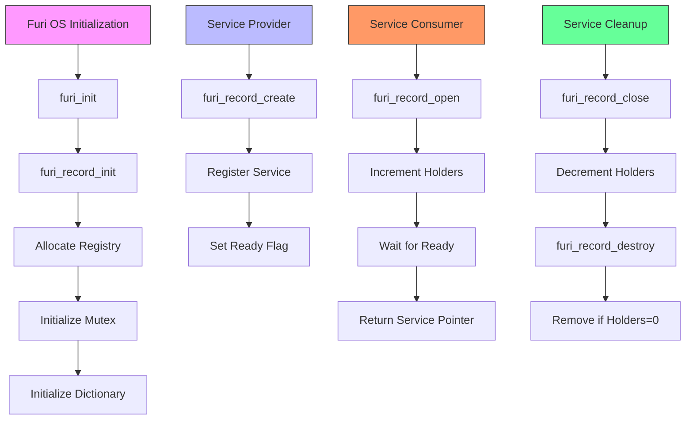
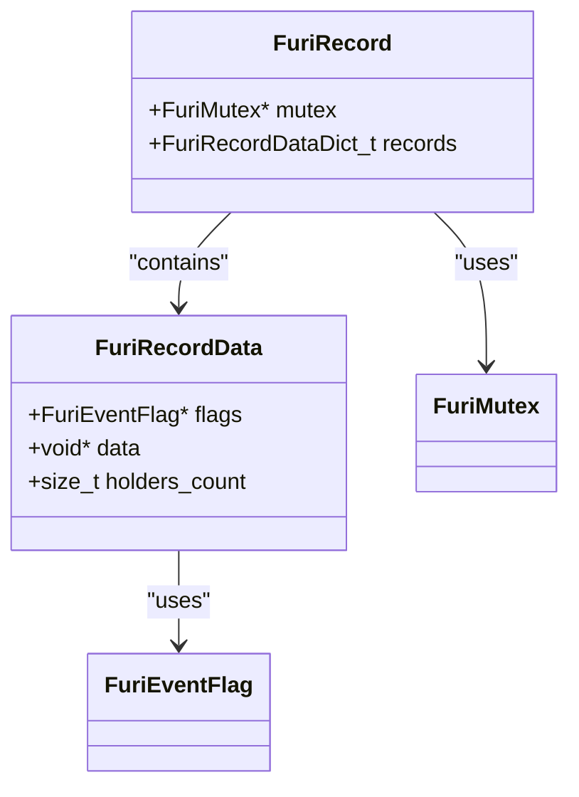
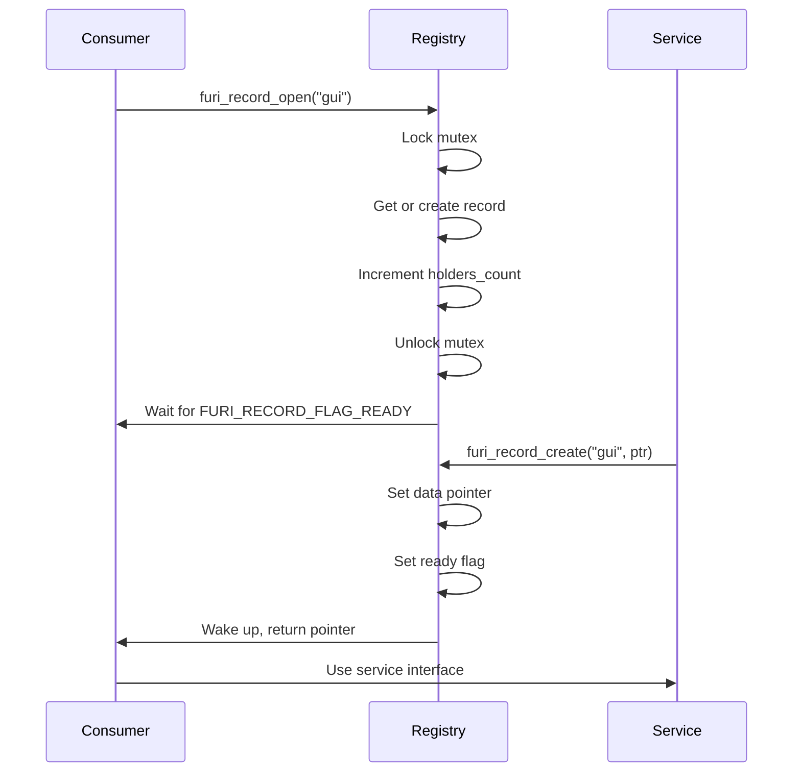

# Service Discovery

<cite>
**Referenced Files in This Document**   
- [record.h](file://furi/core/record.h)
- [record.c](file://furi/core/record.c)
- [gui.h](file://applications/services/gui/gui.h)
- [storage.h](file://applications/services/storage/storage.h)
- [furi.h](file://furi/furi.h)
- [furi.c](file://furi/furi.c)
</cite>

## Table of Contents
1. [Introduction](#introduction)
2. [Core Components](#core-components)
3. [Architecture Overview](#architecture-overview)
4. [Detailed Component Analysis](#detailed-component-analysis)
5. [Service Publication and Subscription](#service-publication-and-subscription)
6. [Lifetime Management and Cleanup](#lifetime-management-and-cleanup)
7. [Thread Safety Considerations](#thread-safety-considerations)
8. [Best Practices for Service Design](#best-practices-for-service-design)
9. [Conclusion](#conclusion)

## Introduction
The Furi OS service discovery system provides a centralized registry for components to publish, discover, and access shared services. This record-based system enables loose coupling between application components by allowing them to obtain references to services through symbolic names rather than direct dependencies. The system supports dynamic service availability, reference counting, and thread-safe operations, making it suitable for embedded environments with concurrent access patterns.

**Section sources**
- [record.h](file://furi/core/record.h#L1-L67)
- [record.c](file://furi/core/record.c#L1-L149)

## Core Components

The service discovery system consists of a central registry implemented as a thread-safe dictionary that maps service names to service instances. Each registered service is represented by a **FuriRecordData** structure containing the service pointer, reference count, and synchronization primitives. The registry itself (**FuriRecord**) uses a mutex for exclusive access during modifications and event flags to signal service availability to waiting clients.

```c
typedef struct {
    FuriEventFlag* flags;
    void* data;
    size_t holders_count;
} FuriRecordData;
```

The system is initialized during Furi OS startup via **furi_record_init()**, which allocates the registry structure and initializes its mutex and dictionary. Services are published using **furi_record_create()**, discovered via **furi_record_open()**, and released with **furi_record_close()**. The registry supports existence checking through **furi_record_exists()** and allows service removal with **furi_record_destroy()**, which is protected by reference counting to prevent premature deallocation.

**Section sources**
- [record.c](file://furi/core/record.c#L20-L40)
- [record.h](file://furi/core/record.h#L15-L60)

## Architecture Overview



**Diagram sources**
- [furi.c](file://furi/furi.c#L7-L11)
- [record.c](file://furi/core/record.c#L54-L67)
- [record.h](file://furi/core/record.h#L30-L35)

## Detailed Component Analysis

### Record Registry Structure
The service registry is implemented as a global singleton (**furi_record**) containing a mutex-protected dictionary of service records. Each service entry (**FuriRecordData**) maintains:

- **data**: Pointer to the actual service instance
- **holders_count**: Reference counter for active users
- **flags**: Event flag for signaling service readiness

The dictionary uses string keys (service names) with automatic string duplication to prevent memory issues. The registry initialization occurs early in the boot process, ensuring availability before application code executes.



**Diagram sources**
- [record.c](file://furi/core/record.c#L20-L40)
- [record.c](file://furi/core/record.c#L54-L67)

### Service Publication Mechanism
Service providers register their interfaces using **furi_record_create()**, which follows a strict protocol:

1. Acquire registry mutex
2. Create or retrieve the service record
3. Verify the service hasn't already been published
4. Store the service pointer
5. Signal readiness via event flag
6. Release mutex

This sequence ensures atomic publication and prevents race conditions. The service remains unavailable until the data pointer is set and the ready flag is signaled, guaranteeing consumers receive fully initialized services.

**Section sources**
- [record.c](file://furi/core/record.c#L90-L105)

### Service Discovery and Access
Consumers obtain service references through **furi_record_open()**, which implements a blocking wait pattern:

1. Acquire registry mutex
2. Create service record if missing
3. Increment reference counter
4. Release mutex
5. Wait indefinitely for service readiness
6. Return service pointer

This design allows services to be requested before they exist, supporting asynchronous initialization patterns. The blocking behavior ensures callers receive valid service pointers, eliminating null pointer risks in application code.



**Diagram sources**
- [record.c](file://furi/core/record.c#L120-L135)
- [record.c](file://furi/core/record.c#L90-L105)

## Service Publication and Subscription

### Publication Example
```c
// Service provider code
Gui* gui = malloc(sizeof(Gui));
// Initialize gui structure...
furi_record_create(RECORD_GUI, gui);
```

### Subscription Example
```c
// Service consumer code
typedef struct {
    Gui* gui;
    Power* power;
    NotificationApp* notifications;
} BatteryTestApp;

BatteryTestApp* app = malloc(sizeof(BatteryTestApp));
app->gui = furi_record_open(RECORD_GUI);
app->power = furi_record_open(RECORD_POWER);
app->notifications = furi_record_open(RECORD_NOTIFICATION);
```

### Reference Counting
The system maintains accurate reference counts to prevent premature service destruction. Each **furi_record_open()** increments the holders counter, while **furi_record_close()** decrements it. Service destruction (**furi_record_destroy()**) only succeeds when the holder count reaches zero, ensuring no active users are disrupted.

**Section sources**
- [record.c](file://furi/core/record.c#L120-L140)
- [record.c](file://furi/core/record.c#L107-L118)

## Lifetime Management and Cleanup

Proper cleanup follows a strict sequence to maintain system integrity:

1. Consumers must call **furi_record_close()** for each opened service
2. Service providers can then call **furi_record_destroy()**
3. Destruction only succeeds when all consumers have closed their references

```c
// Cleanup sequence
furi_record_close(RECORD_NOTIFICATION);
furi_record_close(RECORD_GUI);
furi_record_close(RECORD_POWER);

// Later, when no other users exist
bool destroyed = furi_record_destroy(RECORD_GUI);
// destroyed will be true only if holders_count == 0
```

The system prevents use-after-free conditions by blocking destruction until all references are released. This reference counting mechanism enables dynamic service lifecycle management while maintaining memory safety.

**Section sources**
- [record.c](file://furi/core/record.c#L107-L118)
- [record.c](file://furi/core/record.c#L137-L149)

## Thread Safety Considerations

The service discovery system is fully thread-safe with the following constraints:

- **Registry operations**: Protected by a normal mutex, allowing safe concurrent access
- **Per-service synchronization**: Event flags ensure proper ordering between publication and consumption
- **Thread affinity**: Create/destroy operations must occur in the same thread, as must open/close pairs

The mutex ensures atomic modifications to the registry dictionary, while event flags provide efficient blocking for service availability. This combination allows high concurrency for service access while preventing race conditions during registration and cleanup.

```c
// Thread-safe operations
bool exists = furi_record_exists("gui"); // Safe from any thread
void* service = furi_record_open("gui"); // Safe, but open/close must be same thread
```

**Section sources**
- [record.h](file://furi/core/record.h#L20-L55)

## Best Practices for Service Design

### Interface Design
Services should expose stable, well-defined interfaces through header files:

```c
// gui.h
#define RECORD_GUI "gui"
typedef struct Gui Gui;
void gui_add_view_port(Gui* gui, ViewPort* view_port, GuiLayer layer);
```

### Versioning Strategy
The system supports service versioning through naming conventions:

- **RECORD_GUI_V1**, **RECORD_GUI_V2** for major versions
- Backward compatibility layers for smooth transitions
- Deprecation warnings for obsolete services

### Error Handling
Applications should handle service availability gracefully:

```c
if(furi_record_exists(RECORD_STORAGE)) {
    storage = furi_record_open(RECORD_STORAGE);
} else {
    // Handle missing service (e.g., SD card not present)
    show_error("Storage unavailable");
}
```

### Modular System Integration
Services should be designed as independent modules with minimal dependencies, enabling dynamic loading and replacement. The record system facilitates this modularity by abstracting service location and lifecycle management.

**Section sources**
- [gui.h](file://applications/services/gui/gui.h#L1-L151)
- [storage.h](file://applications/services/storage/storage.h#L1-L199)

## Conclusion
The Furi OS service discovery system provides a robust, thread-safe mechanism for component decoupling through a centralized service registry. By leveraging reference counting, event-driven synchronization, and strict thread safety guarantees, the system enables reliable inter-component communication in resource-constrained embedded environments. The design promotes modular architecture, allowing services to be dynamically published, discovered, and cleaned up without tight coupling between components. This foundation supports the development of extensible, maintainable applications on the Flipper Zero platform.