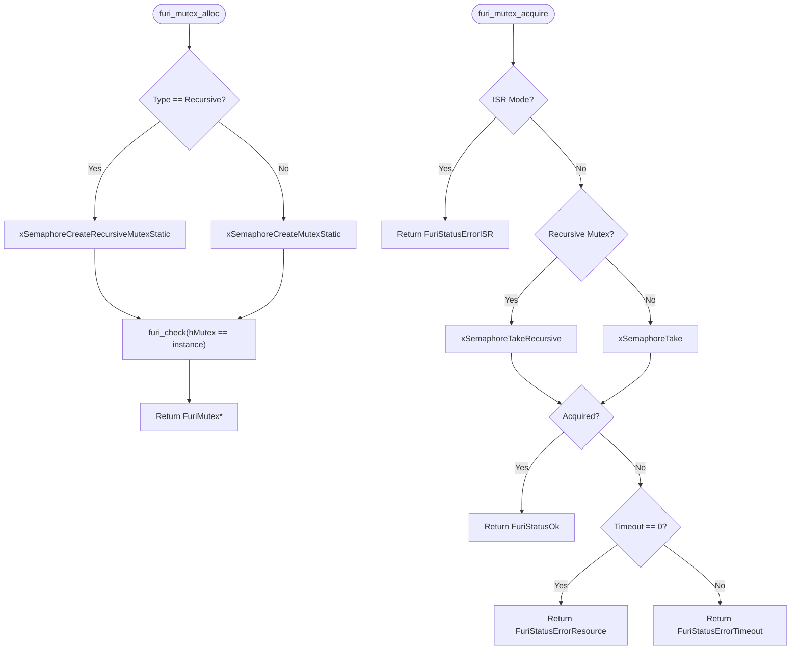
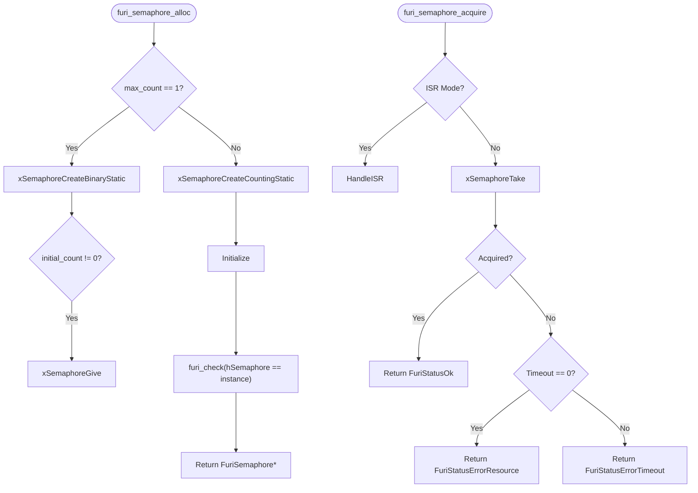
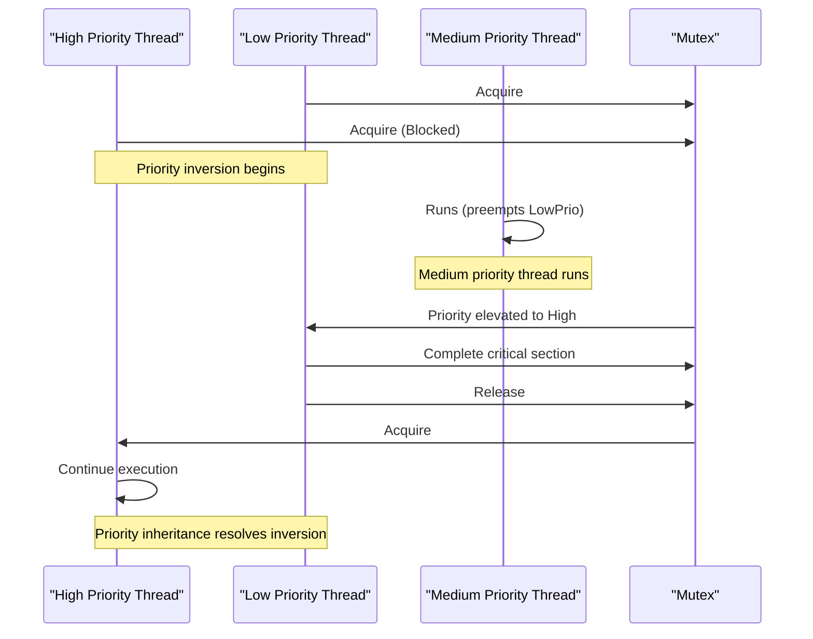
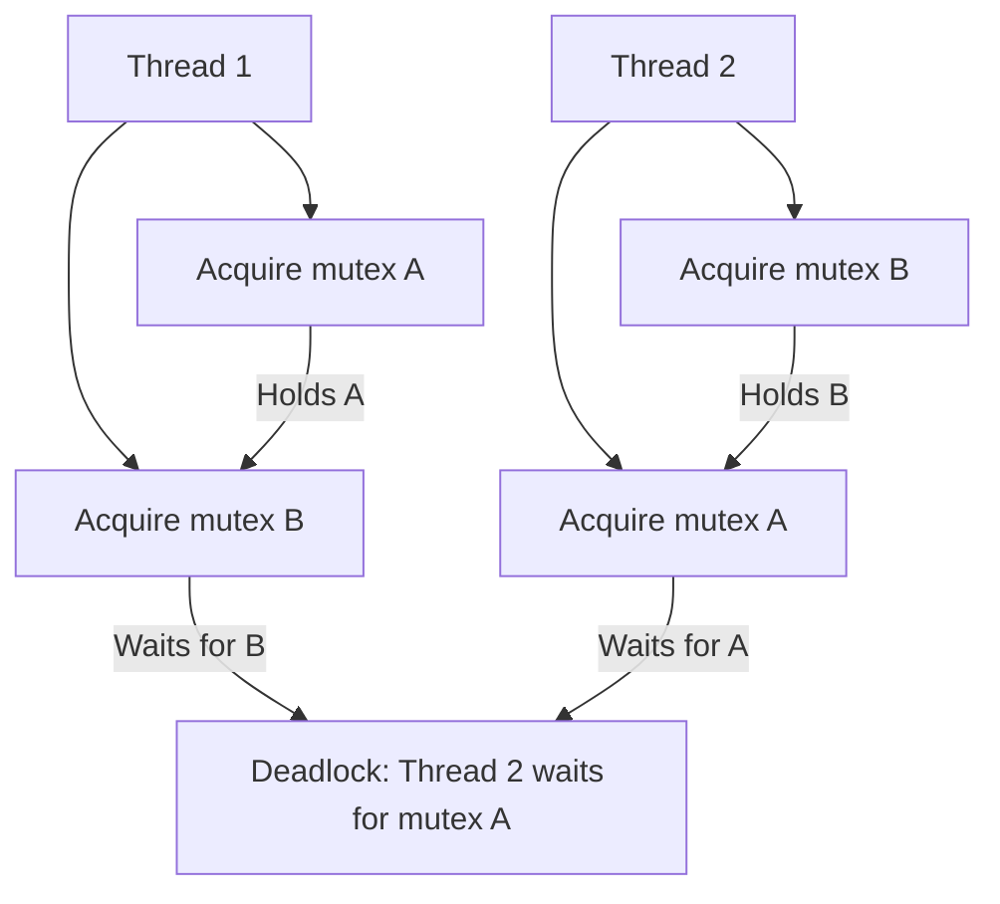
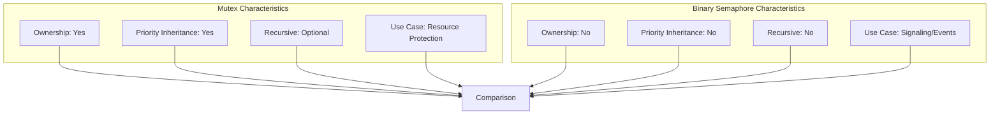

# Synchronization Primitives

<cite>
**Referenced Files in This Document**   
- [mutex.h](file://furi/core/mutex.h)
- [mutex.c](file://furi/core/mutex.c)
- [semaphore.h](file://furi/core/semaphore.h)
- [semaphore.c](file://furi/core/semaphore.c)
- [thread.h](file://furi/core/thread.h)
- [thread.c](file://furi/core/thread.c)
</cite>

## Table of Contents
1. [Introduction](#introduction)
2. [Mutex Implementation](#mutex-implementation)
3. [Semaphore Implementation](#semaphore-implementation)
4. [Ownership and Priority Semantics](#ownership-and-priority-semantics)
5. [Usage Patterns and Examples](#usage-patterns-and-examples)
6. [Deadlock Prevention and Best Practices](#deadlock-prevention-and-best-practices)
7. [Performance Considerations](#performance-considerations)

## Introduction
Furi OS provides synchronization primitives for coordinating access to shared resources in a multi-threaded environment. This document details the implementation and usage of mutexes and semaphores, which are essential for ensuring thread safety and preventing race conditions. The synchronization mechanisms are built on top of FreeRTOS primitives, providing a clean abstraction layer for application developers. Understanding these primitives is crucial for developing reliable and efficient applications on the Flipper Zero platform.

**Section sources**
- [mutex.h](file://furi/core/mutex.h#L1-L62)
- [semaphore.h](file://furi/core/semaphore.h#L1-L58)

## Mutex Implementation

### Mutex Structure and Types
Furi OS implements mutexes through the `FuriMutex` structure, which wraps FreeRTOS semaphore primitives. The mutex system supports two types of mutexes:

**FuriMutexTypeNormal**: A standard mutex that does not allow recursive acquisition by the same thread.
**FuriMutexTypeRecursive**: A recursive mutex that allows the same thread to acquire the mutex multiple times.

The `FuriMutex` structure contains a `StaticSemaphore_t` container as its first member, which enables direct casting to FreeRTOS semaphore handles. This design choice optimizes memory usage and simplifies the interface between Furi OS and FreeRTOS.

```c
typedef struct FuriMutex FuriMutex;

typedef enum {
    FuriMutexTypeNormal,
    FuriMutexTypeRecursive,
} FuriMutexType;
```

### Mutex Operations
The mutex API provides four primary operations: allocation, deallocation, acquisition, and release. These operations are implemented as thin wrappers around FreeRTOS functions, with additional error checking and abstraction.

**Allocation**: The `furi_mutex_alloc` function creates a new mutex instance based on the specified type. It allocates memory for the `FuriMutex` structure and initializes the underlying FreeRTOS semaphore using static allocation.

**Acquisition**: The `furi_mutex_acquire` function attempts to acquire the mutex with a specified timeout. If the mutex is already held by another thread, the calling thread will block until the mutex becomes available or the timeout expires.

**Release**: The `furi_mutex_release` function releases the mutex, allowing other waiting threads to acquire it. For recursive mutexes, the mutex is only fully released when the number of release operations matches the number of acquisition operations by the same thread.

**Deallocation**: The `furi_mutex_free` function destroys a mutex instance and frees its associated memory.



**Diagram sources**
- [mutex.c](file://furi/core/mutex.c#L30-L124)

**Section sources**
- [mutex.h](file://furi/core/mutex.h#L1-L62)
- [mutex.c](file://furi/core/mutex.c#L1-L124)

## Semaphore Implementation

### Semaphore Structure and Interface
Furi OS implements counting semaphores through the `FuriSemaphore` structure, which also wraps FreeRTOS semaphore primitives. Unlike mutexes, semaphores do not have ownership semantics and can be released by any thread, regardless of which thread acquired them.

The `FuriSemaphore` structure contains a `StaticSemaphore_t` container as its first member, similar to the mutex implementation. This design enables efficient memory usage and direct casting to FreeRTOS semaphore handles.

```c
typedef struct FuriSemaphore FuriSemaphore;
```

### Semaphore Operations
The semaphore API provides five primary operations: allocation, deallocation, acquisition, release, and count retrieval.

**Allocation**: The `furi_semaphore_alloc` function creates a new semaphore instance with a specified maximum count and initial count. If the maximum count is 1, a binary semaphore is created using `xSemaphoreCreateBinaryStatic`. Otherwise, a counting semaphore is created using `xSemaphoreCreateCountingStatic`.

**Acquisition**: The `furi_semaphore_acquire` function attempts to acquire the semaphore with a specified timeout. If the semaphore count is zero, the calling thread will block until the semaphore is released by another thread or the timeout expires.

**Release**: The `furi_semaphore_release` function increments the semaphore count, allowing other waiting threads to acquire it.

**Count Retrieval**: The `furi_semaphore_get_count` function returns the current count of the semaphore, which represents the number of available resources.



**Diagram sources**
- [semaphore.c](file://furi/core/semaphore.c#L1-L122)

**Section sources**
- [semaphore.h](file://furi/core/semaphore.h#L1-L58)
- [semaphore.c](file://furi/core/semaphore.c#L1-L122)

## Ownership and Priority Semantics

### Mutex Ownership
Furi OS mutexes implement ownership semantics, where a mutex can only be released by the thread that acquired it. This prevents programming errors where one thread releases a mutex acquired by another thread.

The `furi_mutex_get_owner` function returns the thread identifier of the current owner of a mutex. This function queries the underlying FreeRTOS semaphore to determine the current holder.

```c
FuriThreadId furi_mutex_get_owner(FuriMutex* instance) {
    furi_check(instance);

    SemaphoreHandle_t hMutex = (SemaphoreHandle_t)instance;
    FuriThreadId owner;

    if(FURI_IS_IRQ_MODE()) {
        owner = (FuriThreadId)xSemaphoreGetMutexHolderFromISR(hMutex);
    } else {
        owner = (FuriThreadId)xSemaphoreGetMutexHolder(hMutex);
    }

    return owner;
}
```

### Priority Inheritance
The documentation and code analysis do not reveal explicit implementation of priority inheritance in the Furi OS mutex system. Priority inheritance is a mechanism to prevent priority inversion, where a high-priority thread is blocked by a low-priority thread holding a mutex.

In FreeRTOS, priority inheritance is automatically implemented for mutexes (but not for binary semaphores). Since Furi OS mutexes are built on FreeRTOS mutexes, they inherit this behavior. When a high-priority thread attempts to acquire a mutex held by a low-priority thread, the priority of the low-priority thread is temporarily elevated to that of the highest-priority waiting thread.

This mechanism ensures that the low-priority thread can complete its critical section quickly and release the mutex, reducing the blocking time for high-priority threads.



**Diagram sources**
- [mutex.c](file://furi/core/mutex.c#L80-L124)
- [thread.c](file://furi/core/thread.c#L1-L756)

**Section sources**
- [mutex.c](file://furi/core/mutex.c#L80-L124)
- [thread.c](file://furi/core/thread.c#L1-L756)

## Usage Patterns and Examples

### Mutual Exclusion for Shared Resource Protection
Mutexes are primarily used to protect shared resources from concurrent access. The following example demonstrates how to use a mutex to protect a shared counter variable:

```c
// Global variables
FuriMutex* counter_mutex;
volatile uint32_t shared_counter = 0;

// Thread function
int32_t counter_thread(void* context) {
    while(1) {
        // Attempt to acquire the mutex with 100ms timeout
        FuriStatus status = furi_mutex_acquire(counter_mutex, 100);
        
        if(status == FuriStatusOk) {
            // Critical section - modify shared counter
            shared_counter++;
            
            // Simulate some work
            furi_delay_ms(10);
            
            // Release the mutex
            furi_mutex_release(counter_mutex);
        } else {
            // Handle timeout or error
            FURI_LOG_E("Counter", "Failed to acquire mutex: %d", status);
        }
        
        // Non-critical section - delay before next iteration
        furi_delay_ms(50);
    }
    
    return 0;
}

// Initialization
void init_counter_system() {
    // Allocate a normal mutex
    counter_mutex = furi_mutex_alloc(FuriMutexTypeNormal);
    
    if(!counter_mutex) {
        FURI_LOG_E("Counter", "Failed to allocate mutex");
        return;
    }
}
```

### Counting Semaphore for Resource Pooling
Counting semaphores are ideal for managing pools of identical resources. The following example demonstrates using a semaphore to manage a pool of network connections:

```c
// Global variables
FuriSemaphore* connection_semaphore;
#define MAX_CONNECTIONS 5
#define INITIAL_CONNECTIONS 3

// Initialize connection pool
void init_connection_pool() {
    // Create a counting semaphore with max 5 connections, initially 3 available
    connection_semaphore = furi_semaphore_alloc(MAX_CONNECTIONS, INITIAL_CONNECTIONS);
    
    if(!connection_semaphore) {
        FURI_LOG_E("Network", "Failed to allocate connection semaphore");
        return;
    }
}

// Acquire a connection
bool acquire_connection(uint32_t timeout_ms) {
    FuriStatus status = furi_semaphore_acquire(connection_semaphore, timeout_ms);
    return (status == FuriStatusOk);
}

// Release a connection
void release_connection() {
    furi_semaphore_release(connection_semaphore);
}

// Get available connections
uint32_t get_available_connections() {
    return furi_semaphore_get_count(connection_semaphore);
}

// Connection worker thread
int32_t connection_worker(void* context) {
    while(1) {
        // Attempt to acquire a connection with 500ms timeout
        if(acquire_connection(500)) {
            // Use the connection for network operations
            perform_network_operation();
            
            // Release the connection when done
            release_connection();
        } else {
            // No connections available within timeout
            FURI_LOG_W("Network", "No connections available");
        }
        
        // Wait before attempting to acquire another connection
        furi_delay_ms(100);
    }
    
    return 0;
}
```

**Section sources**
- [mutex.c](file://furi/core/mutex.c#L50-L124)
- [semaphore.c](file://furi/core/semaphore.c#L50-L122)

## Deadlock Prevention and Best Practices

### Deadlock Prevention Strategies
Deadlock occurs when two or more threads are blocked forever, each waiting for a resource held by the other. Furi OS applications can prevent deadlocks by following these strategies:

**Lock Ordering**: Always acquire multiple mutexes in a consistent order across all threads. This prevents circular wait conditions.

**Timeouts**: Always use timeouts when acquiring mutexes and semaphores. This ensures that threads do not block indefinitely if a resource becomes unavailable.

**Minimize Critical Section Duration**: Keep critical sections as short as possible to reduce contention and blocking time.

**Avoid Nested Locks**: Minimize the use of nested mutex acquisitions, as they increase the risk of deadlocks.

### Proper Lock Ordering Practices
When multiple mutexes are required, establish a global ordering convention. For example, if mutex A and mutex B are used together, always acquire A before B in all threads:

```c
// Correct: Consistent ordering
void function1() {
    furi_mutex_acquire(mutex_A, FURI_WAIT_FOREVER);
    furi_mutex_acquire(mutex_B, FURI_WAIT_FOREVER);
    // Critical section
    furi_mutex_release(mutex_B);
    furi_mutex_release(mutex_A);
}

void function2() {
    furi_mutex_acquire(mutex_A, FURI_WAIT_FOREVER);
    furi_mutex_acquire(mutex_B, FURI_WAIT_FOREVER);
    // Critical section
    furi_mutex_release(mutex_B);
    furi_mutex_release(mutex_A);
}
```

The following pattern should be avoided as it can lead to deadlock:

```c
// Incorrect: Inconsistent ordering (deadlock risk)
void bad_function1() {
    furi_mutex_acquire(mutex_A, FURI_WAIT_FOREVER);
    furi_mutex_acquire(mutex_B, FURI_WAIT_FOREVER);
    // Critical section
    furi_mutex_release(mutex_B);
    furi_mutex_release(mutex_A);
}

void bad_function2() {
    furi_mutex_acquire(mutex_B, FURI_WAIT_FOREVER);
    furi_mutex_acquire(mutex_A, FURI_WAIT_FOREVER);
    // Critical section
    furi_mutex_release(mutex_A);
    furi_mutex_release(mutex_B);
}
```



**Diagram sources**
- [mutex.c](file://furi/core/mutex.c#L50-L124)

**Section sources**
- [mutex.c](file://furi/core/mutex.c#L50-L124)

## Performance Considerations

### Contention and Critical Section Duration
The performance of synchronization primitives is heavily influenced by contention and critical section duration. High contention occurs when multiple threads frequently attempt to acquire the same mutex or semaphore, leading to increased blocking and context switching.

To minimize performance impact:

**Minimize Critical Section Duration**: Only include code that absolutely requires mutual exclusion within critical sections. Move non-critical operations outside the protected region.

**Use Appropriate Timeout Values**: Use finite timeouts instead of infinite waits to prevent threads from blocking indefinitely and to enable graceful degradation under high load.

**Choose the Right Primitive**: Use mutexes for mutual exclusion with ownership semantics, and semaphores for resource counting without ownership requirements.

### Differences Between Binary Semaphores and Mutexes
Understanding the differences between binary semaphores and mutexes is crucial for selecting the appropriate synchronization primitive:

**Ownership**: Mutexes have ownership semantics - they must be released by the thread that acquired them. Binary semaphores do not have ownership - any thread can release them.

**Priority Inheritance**: Mutexes typically implement priority inheritance to prevent priority inversion. Binary semaphores do not implement priority inheritance.

**Recursive Acquisition**: Recursive mutexes allow the same thread to acquire the mutex multiple times. Binary semaphores do not support recursive acquisition.

**Use Cases**: Use mutexes for protecting shared resources and ensuring mutual exclusion. Use binary semaphores for signaling between threads or implementing one-shot events.



**Diagram sources**
- [mutex.c](file://furi/core/mutex.c#L1-L124)
- [semaphore.c](file://furi/core/semaphore.c#L1-L122)

**Section sources**
- [mutex.c](file://furi/core/mutex.c#L1-L124)
- [semaphore.c](file://furi/core/semaphore.c#L1-L122)