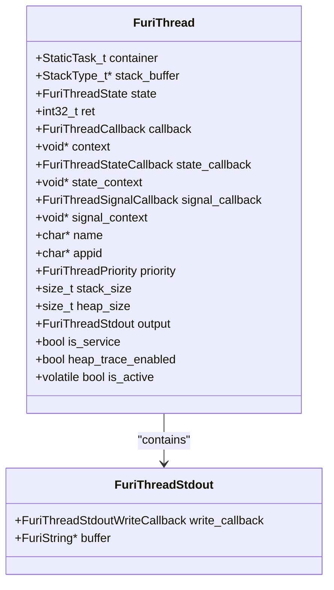
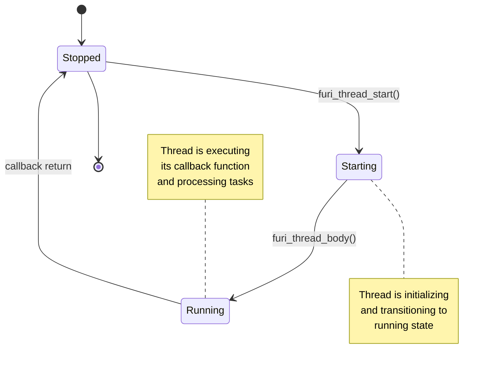
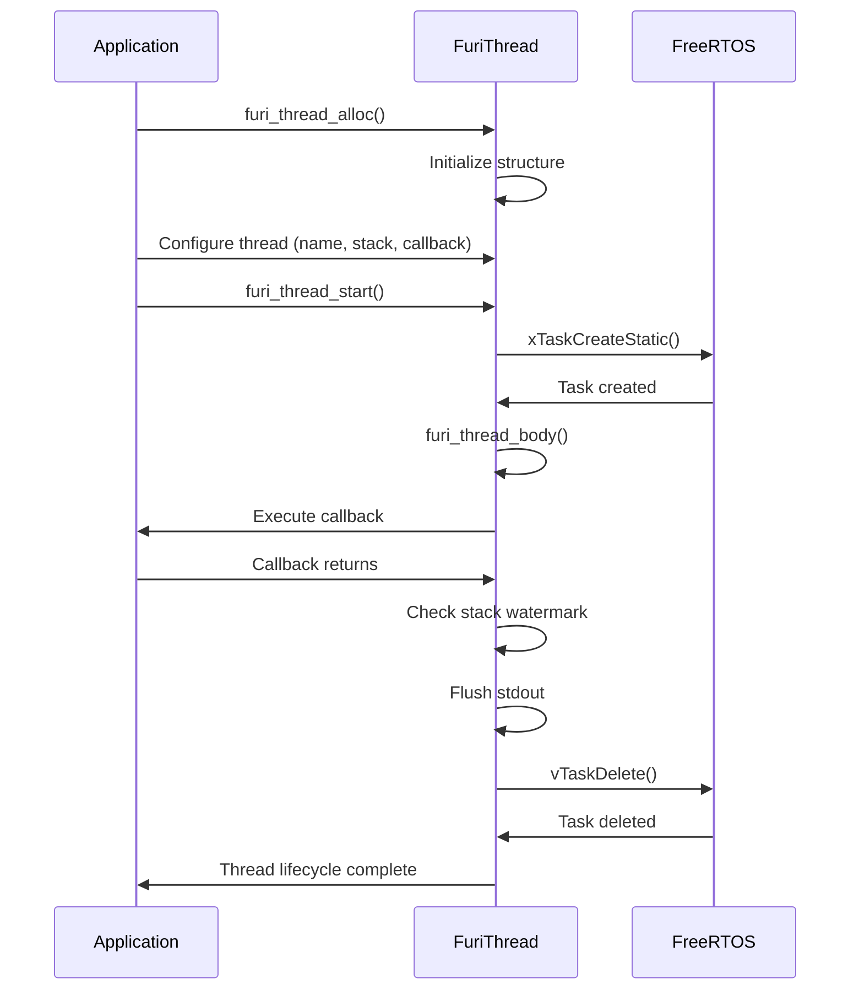
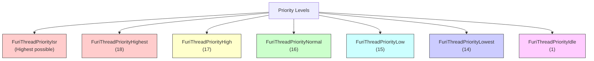
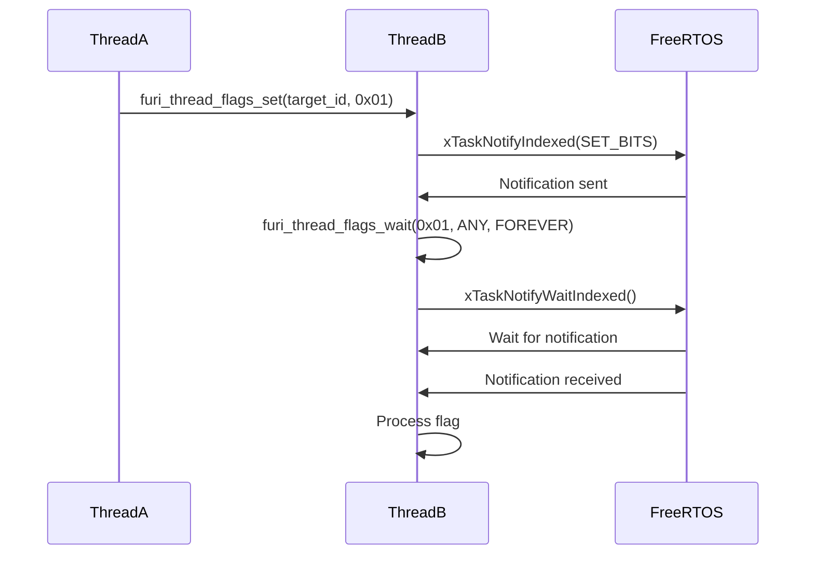
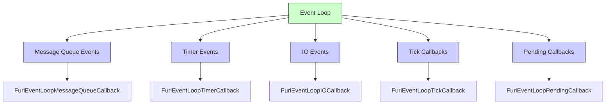

# Threading Model

<cite>
**Referenced Files in This Document**   
- [thread.h](file://furi/core/thread.h#L1-L507)
- [thread.c](file://furi/core/thread.c#L1-L756)
- [thread_i.h](file://furi/core/thread_i.h#L1-L49)
- [message_queue.h](file://furi/core/message_queue.h#L1-L94)
- [event_flag.h](file://furi/core/event_flag.h#L1-L71)
- [event_loop.h](file://furi/core/event_loop.h#L1-L163)
</cite>

## Table of Contents
1. [Introduction](#introduction)
2. [Thread Structure and Lifecycle](#thread-structure-and-lifecycle)
3. [Thread Creation and Configuration](#thread-creation-and-configuration)
4. [Priority Management](#priority-management)
5. [Thread Synchronization Mechanisms](#thread-synchronization-mechanisms)
6. [Event Loop Integration](#event-loop-integration)
7. [Memory Management and Stack Considerations](#memory-management-and-stack-considerations)
8. [Common Pitfalls and Mitigation Strategies](#common-pitfalls-and-mitigation-strategies)
9. [Thread Enumeration and Debugging](#thread-enumeration-and-debugging)

## Introduction
The Furi OS threading implementation provides a comprehensive multitasking framework built on FreeRTOS, offering developers fine-grained control over thread creation, scheduling, and synchronization. This document details the threading model used in the Flipper Zero firmware, focusing on the `FuriThread` abstraction layer that encapsulates FreeRTOS task management with additional features for memory tracking, debugging, and inter-thread communication. The threading system supports both standard and service threads, with different memory and lifecycle characteristics, and integrates with various synchronization primitives including message queues, event flags, and thread flags.

**Section sources**
- [thread.h](file://furi/core/thread.h#L1-L507)
- [thread.c](file://furi/core/thread.c#L1-L756)

## Thread Structure and Lifecycle

### FuriThread Data Structure
The `FuriThread` structure represents the core thread abstraction in Furi OS, encapsulating both the FreeRTOS task control block and additional metadata for debugging and monitoring. The structure is designed with careful attention to memory layout, with the `container` field positioned as the first member to ensure compatibility with FreeRTOS expectations.



**Diagram sources**
- [thread_i.h](file://furi/core/thread_i.h#L1-L49)

### Thread States and Transitions
Furi OS threads transition through three primary states during their lifecycle: Stopped, Starting, and Running. The state machine is designed to ensure thread safety and prevent race conditions during configuration and cleanup operations.



**Diagram sources**
- [thread.h](file://furi/core/thread.h#L25-L35)
- [thread.c](file://furi/core/thread.c#L100-L150)

**Section sources**
- [thread.h](file://furi/core/thread.h#L25-L35)
- [thread.c](file://furi/core/thread.c#L100-L150)

## Thread Creation and Configuration

### Thread Allocation Methods
Furi OS provides three distinct methods for thread allocation, each serving different use cases and performance requirements:

1. **Standard Allocation**: Uses heap allocation for maximum flexibility
2. **Service Allocation**: Uses memory pool allocation for efficiency
3. **Extended Allocation**: Combines standard allocation with convenience configuration

```c
// Standard thread allocation
FuriThread* thread = furi_thread_alloc();
furi_thread_set_name(thread, "MyThread");
furi_thread_set_stack_size(thread, 1024);
furi_thread_set_callback(thread, my_callback);
furi_thread_set_context(thread, my_context);
furi_thread_start(thread);

// Service thread allocation (more memory efficient)
FuriThread* service_thread = furi_thread_alloc_service(
    "ServiceThread",
    512,
    service_callback,
    service_context
);
furi_thread_start(service_thread);

// Extended allocation (convenience method)
FuriThread* ex_thread = furi_thread_alloc_ex(
    "ExThread",
    2048,
    ex_callback,
    ex_context
);
furi_thread_start(ex_thread);
```

The implementation uses different memory allocation strategies: `furi_thread_alloc()` uses `malloc()` for heap allocation, while `furi_thread_alloc_service()` uses `memmgr_alloc_from_pool()` for memory pool allocation, which is more efficient but has limitations on thread lifecycle management.

**Section sources**
- [thread.h](file://furi/core/thread.h#L75-L150)
- [thread.c](file://furi/core/thread.c#L250-L350)

### Thread Lifecycle Management
The thread lifecycle follows a strict sequence of operations that must be respected to ensure system stability. Threads must be in the Stopped state when being configured or freed, and certain operations have specific requirements.



**Diagram sources**
- [thread.c](file://furi/core/thread.c#L100-L200)
- [thread.h](file://furi/core/thread.h#L300-L350)

**Section sources**
- [thread.c](file://furi/core/thread.c#L100-L200)
- [thread.h](file://furi/core/thread.h#L300-L350)

## Priority Management

### Priority Levels and Scheduling
Furi OS implements a priority-based preemptive scheduling system with a defined hierarchy of priority levels. The priority system is designed to balance responsiveness with system stability, providing both standard and specialized priority levels for different use cases.

```c
typedef enum {
    FuriThreadPriorityNone = 0,      // Uninitialized, choose system default
    FuriThreadPriorityIdle = 1,      // Idle priority
    FuriThreadPriorityLowest = 14,   // Lowest
    FuriThreadPriorityLow = 15,      // Low
    FuriThreadPriorityNormal = 16,   // Normal
    FuriThreadPriorityHigh = 17,     // High
    FuriThreadPriorityHighest = 18,  // Highest
    FuriThreadPriorityIsr = (FURI_CONFIG_THREAD_MAX_PRIORITIES - 1), // Deferred ISR
} FuriThreadPriority;
```

The priority system integrates with FreeRTOS's scheduler, with FuriThread priorities mapping directly to FreeRTOS task priorities. The `FuriThreadPriorityIsr` level is reserved for deferred interrupt service routines, ensuring they have the highest possible priority in the system.



**Diagram sources**
- [thread.h](file://furi/core/thread.h#L40-L60)

### Priority Configuration and Adjustment
Thread priorities can be configured during thread setup or adjusted dynamically for the current thread. The API provides both instance-specific and current-thread priority management functions.

```c
// Set priority for a specific thread (must be stopped)
furi_thread_set_priority(thread, FuriThreadPriorityHigh);

// Get priority of a specific thread
FuriThreadPriority priority = furi_thread_get_priority(thread);

// Set priority of current thread
furi_thread_set_current_priority(FuriThreadPriorityLow);

// Get priority of current thread
FuriThreadPriority current_priority = furi_thread_get_current_priority();
```

The implementation ensures thread safety by validating that threads are in the appropriate state before priority changes are applied. For `furi_thread_set_priority()`, the thread must be in the Stopped state, while current thread priority changes can be made at any time.

**Section sources**
- [thread.h](file://furi/core/thread.h#L170-L200)
- [thread.c](file://furi/core/thread.c#L200-L250)

## Thread Synchronization Mechanisms

### Thread Flags
Thread flags provide a lightweight mechanism for inter-thread communication and synchronization. Each thread has a 31-bit flags register that can be set, cleared, and waited upon by other threads.

```c
// Set flags on a target thread
uint32_t result = furi_thread_flags_set(thread_id, 0x01);

// Clear flags on current thread
uint32_t previous = furi_thread_flags_clear(0x01);

// Get current flags
uint32_t current = furi_thread_flags_get();

// Wait for flags with options
uint32_t received = furi_thread_flags_wait(
    0x01,                    // flags to wait for
    FuriFlagWaitAny,         // wait for any flag
    FuriWaitForever          // wait indefinitely
);
```

The thread flags implementation leverages FreeRTOS task notifications, using index 1 of the task notification array (index 0 is reserved for stream buffers). This provides an efficient, lock-free mechanism for thread signaling.



**Diagram sources**
- [thread.h](file://furi/core/thread.h#L300-L350)
- [thread.c](file://furi/core/thread.c#L400-L500)

### Message Queues
Message queues provide a structured mechanism for passing data between threads. They are implemented as bounded buffers with configurable capacity and message size.

```c
// Create a message queue
FuriMessageQueue* queue = furi_message_queue_alloc(10, sizeof(MyMessage));

// Put message into queue
MyMessage msg = { .data = 42 };
FuriStatus status = furi_message_queue_put(queue, &msg, FuriWaitForever);

// Get message from queue
MyMessage received_msg;
status = furi_message_queue_get(queue, &received_msg, 100); // 100ms timeout

// Clean up
furi_message_queue_free(queue);
```

The message queue API provides functions to query queue state, including capacity, message count, and available space, allowing threads to make informed decisions about message handling.

**Section sources**
- [message_queue.h](file://furi/core/message_queue.h#L1-L94)

### Event Flags
Event flags provide a shared synchronization primitive that can be used by multiple threads to coordinate on specific events or conditions.

```c
// Create event flag
FuriEventFlag* event_flag = furi_event_flag_alloc();

// Set flags
uint32_t result = furi_event_flag_set(event_flag, 0x01);

// Wait for flags
uint32_t received = furi_event_flag_wait(
    event_flag,
    0x01,
    FuriFlagWaitAny,
    FuriWaitForever
);

// Clean up
furi_event_flag_free(event_flag);
```

Event flags are particularly useful for implementing producer-consumer patterns and for coordinating complex multi-threaded workflows where multiple threads need to respond to the same events.

**Section sources**
- [event_flag.h](file://furi/core/event_flag.h#L1-L71)

## Event Loop Integration

### Event Loop Architecture
The Furi OS event loop system provides a reactive programming model that integrates with the threading system to handle asynchronous events efficiently. Each thread can have its own event loop, which processes events from various sources including message queues, timers, and I/O operations.



**Diagram sources**
- [event_loop.h](file://furi/core/event_loop.h#L1-L163)

### Event Loop Usage Patterns
The event loop system supports subscription-based event handling, where threads can subscribe to specific event types on message queues and other synchronization primitives.

```c
// Create event loop
FuriEventLoop* event_loop = furi_event_loop_alloc();

// Subscribe to message queue events
furi_event_loop_message_queue_subscribe(
    event_loop,
    message_queue,
    FuriEventLoopEventIn,
    message_queue_callback,
    callback_context
);

// Run event loop
furi_event_loop_run(event_loop);

// Stop event loop
furi_event_loop_stop(event_loop);

// Clean up
furi_event_loop_free(event_loop);
```

The event loop also supports tick callbacks, which are called periodically when the loop is idle, providing a mechanism for low-priority background processing.

**Section sources**
- [event_loop.h](file://furi/core/event_loop.h#L1-L163)

## Memory Management and Stack Considerations

### Stack Allocation and Management
Furi OS provides flexible stack allocation options, with different strategies for standard and service threads. The stack size is configurable for standard threads but fixed for service threads.

```c
// Stack size validation
#define THREAD_MAX_STACK_SIZE (UINT16_MAX * sizeof(StackType_t))
#define THREAD_STACK_WATERMARK_MIN (256u)

// Stack watermark check in thread body
size_t stack_watermark = furi_thread_get_stack_space(thread);
if(stack_watermark < THREAD_STACK_WATERMARK_MIN) {
#ifdef FURI_DEBUG
    furi_crash("Stack watermark is dangerously low");
#endif
    FURI_LOG_E(
        thread->name ? thread->name : "Thread",
        "Stack watermark is too low %zu < " STRINGIFY(
            THREAD_STACK_WATERMARK_MIN) ". Increase stack size.",
        stack_watermark);
}
```

The system automatically checks stack watermark when a thread exits, logging warnings if the stack usage exceeds safe thresholds. This helps identify potential stack overflow issues during development.

**Section sources**
- [thread.c](file://furi/core/thread.c#L120-L140)

### Heap Tracing and Memory Monitoring
Furi OS includes built-in heap usage tracing capabilities that can be enabled for individual threads to monitor dynamic memory allocation.

```c
// Enable heap tracing for a thread
furi_thread_enable_heap_trace(thread);

// Get heap usage
size_t heap_size = furi_thread_get_heap_size(thread);

// Disable heap tracing
furi_thread_disable_heap_trace(thread);
```

Heap tracing is particularly useful for identifying memory leaks and optimizing memory usage in resource-constrained environments.

**Section sources**
- [thread.h](file://furi/core/thread.h#L250-L280)
- [thread.c](file://furi/core/thread.c#L300-L330)

## Common Pitfalls and Mitigation Strategies

### Stack Overflow Prevention
Stack overflow is a critical concern in embedded systems. Furi OS provides several mechanisms to detect and prevent stack overflow issues:

1. **Stack Watermark Monitoring**: Automatic checking of stack usage at thread exit
2. **Minimum Stack Size Enforcement**: Runtime validation of stack size parameters
3. **Debug Mode Crashing**: Immediate termination in debug builds when stack is critically low

```c
// Stack overflow mitigation strategy
void thread_callback(void* context) {
    // Use dynamic allocation for large data structures
    uint8_t* large_buffer = malloc(1024);
    if(large_buffer) {
        // Process data
        free(large_buffer);
    }
    
    // Keep stack usage minimal in deeply nested functions
    process_data_efficiently();
    
    return 0;
}
```

### Priority Inversion Mitigation
While Furi OS does not implement priority inheritance protocols, developers can mitigate priority inversion through careful design:

1. **Minimize Critical Section Duration**: Keep mutex-protected sections as short as possible
2. **Use Appropriate Synchronization Primitives**: Choose the right primitive for the use case
3. **Avoid Nested Locking**: Prevent deadlock and priority inversion scenarios

```c
// Priority inversion mitigation example
void critical_operation(void) {
    // Acquire mutex
    furi_mutex_acquire(mutex, FuriWaitForever);
    
    // Perform minimal critical work
    update_shared_variable();
    
    // Release mutex immediately
    furi_mutex_release(mutex);
    
    // Perform non-critical work without holding the mutex
    process_results();
}
```

**Section sources**
- [thread.c](file://furi/core/thread.c#L120-L140)

## Thread Enumeration and Debugging

### Thread Enumeration API
Furi OS provides comprehensive thread enumeration capabilities for debugging and monitoring purposes.

```c
// Enumerate all threads
FuriThreadList* thread_list = furi_thread_list_alloc();
if(furi_thread_enumerate(thread_list)) {
    FuriThreadListItem* item = NULL;
    while((item = furi_thread_list_get_next(thread_list))) {
        FURI_LOG_I(
            "Thread",
            "%s (%s) P:%lu S:%lu/%lu H:%lu",
            item->name,
            item->app_id,
            item->priority,
            item->stack_size - item->stack_min_free,
            item->stack_size,
            item->heap
        );
    }
}

furi_thread_list_free(thread_list);
```

The enumeration system provides detailed information about each thread, including name, application ID, priority, stack usage, and heap allocation.

### Debugging Tools and Utilities
The threading system includes several debugging utilities:

1. **Thread-Specific Logging**: Each thread can have its own stdout callback
2. **Runtime Information**: Thread state, stack space, and heap usage queries
3. **Suspension/Resumption**: Ability to suspend and resume threads for debugging

```c
// Set custom stdout callback for current thread
void custom_stdout(const char* data, size_t size) {
    // Route output to specific destination
    log_to_file(data, size);
}

furi_thread_set_stdout_callback(custom_stdout);
```

These tools enable comprehensive runtime monitoring and debugging of thread behavior in complex multi-threaded applications.

**Section sources**
- [thread.c](file://furi/core/thread.c#L550-L750)
- [thread.h](file://furi/core/thread.h#L400-L450)