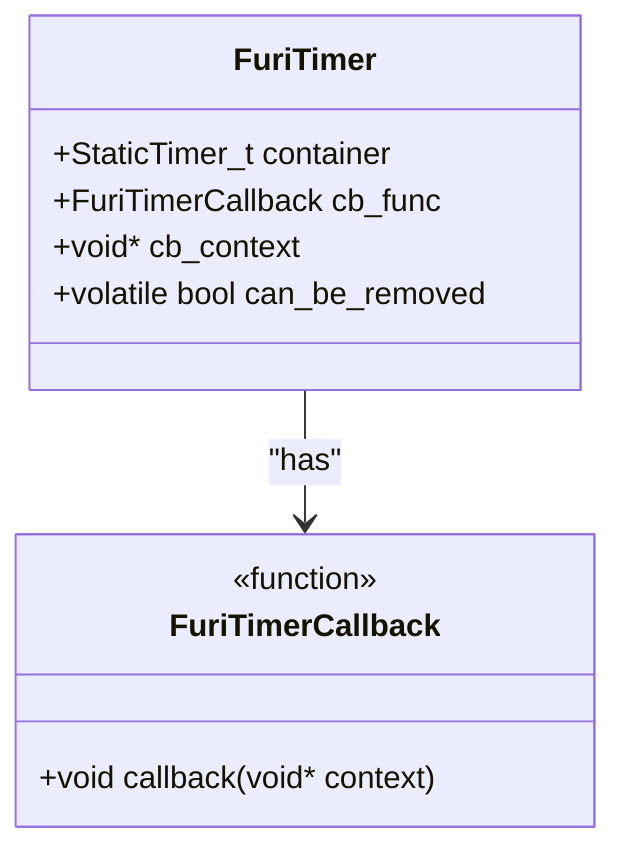
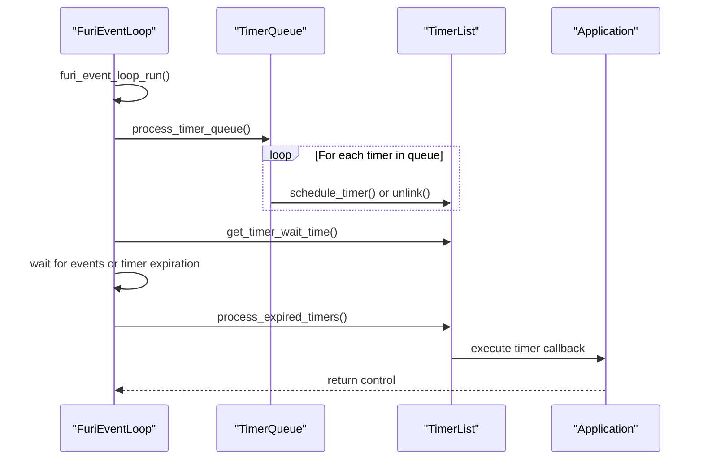
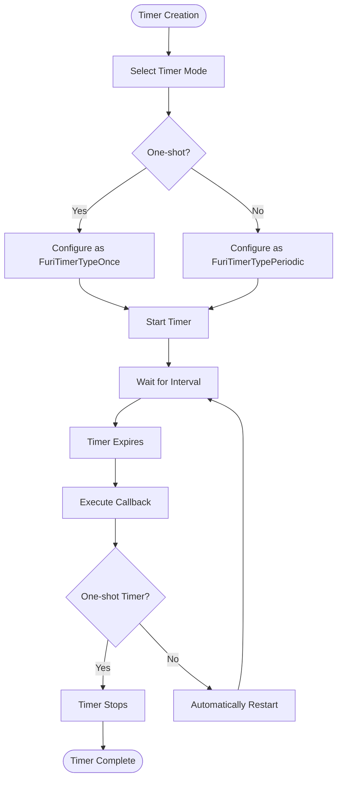
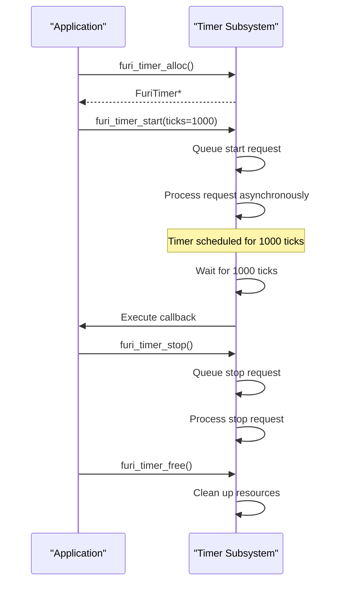
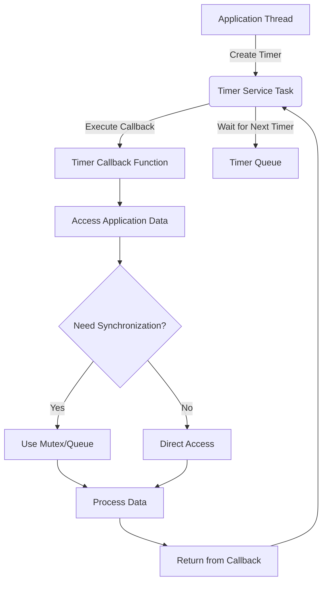
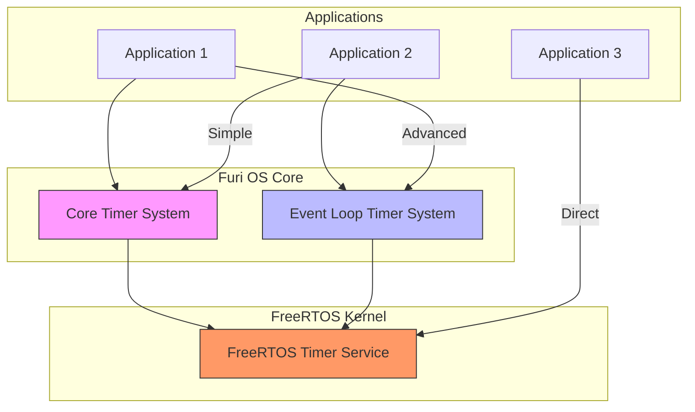

# Timer Subsystem

<cite>
**Referenced Files in This Document**   
- [timer.h](file://furi/core/timer.h#L1-L117)
- [timer.c](file://furi/core/timer.c#L1-L169)
- [event_loop_timer.h](file://furi/core/event_loop_timer.h#L1-L119)
- [event_loop_timer.c](file://furi/core/event_loop_timer.c#L1-L216)
- [event_loop.h](file://furi/core/event_loop.h#L1-L163)
- [archive.c](file://applications/main/archive/archive.c#L128-L134)
- [nfc_app.c](file://applications/main/nfc/nfc_app.c#L444-L449)
</cite>

## Table of Contents
1. [Introduction](#introduction)
2. [Core Timer Implementation](#core-timer-implementation)
3. [Event Loop Timer Integration](#event-loop-timer-integration)
4. [Timer Modes and Resolution](#timer-modes-and-resolution)
5. [Timer Creation and Management](#timer-creation-and-management)
6. [Callback Execution Context](#callback-execution-context)
7. [Power Management Considerations](#power-management-considerations)
8. [Accuracy and Jitter Characteristics](#accuracy-and-jitter-characteristics)
9. [Best Practices for Timer Usage](#best-practices-for-timer-usage)
10. [Architecture Overview](#architecture-overview)

## Introduction
The Furi OS timer subsystem provides a comprehensive software timer framework that enables applications to schedule deferred operations with precise timing control. This document details the implementation of software timers and their integration with the event loop system, covering the timer_t structure, timer modes (one-shot vs periodic), resolution characteristics, and practical usage patterns. The timer subsystem is built on FreeRTOS timer primitives but extends them with additional features and abstractions to support the specific requirements of the Flipper Zero platform.

**Section sources**
- [timer.h](file://furi/core/timer.h#L1-L117)
- [event_loop_timer.h](file://furi/core/event_loop_timer.h#L1-L119)

## Core Timer Implementation

The core timer implementation in Furi OS is based on FreeRTOS software timers, providing a higher-level abstraction for timer management. The `FuriTimer` structure encapsulates the FreeRTOS timer functionality while adding additional metadata and safety checks.

```c
typedef struct FuriTimer {
    StaticTimer_t container;
    FuriTimerCallback cb_func;
    void* cb_context;
    volatile bool can_be_removed;
} FuriTimer;
```

The timer subsystem provides a complete API for timer lifecycle management, including allocation, starting, stopping, and freeing timers. The implementation ensures thread safety and proper resource cleanup, with asynchronous operations that are processed by the FreeRTOS timer service.



**Diagram sources**
- [timer.h](file://furi/core/timer.h#L25-L30)
- [timer.c](file://furi/core/timer.c#L15-L25)

**Section sources**
- [timer.h](file://furi/core/timer.h#L1-L117)
- [timer.c](file://furi/core/timer.c#L1-L169)

## Event Loop Timer Integration

The event loop timer system provides an alternative timer implementation that is tightly integrated with the FuriEventLoop. This allows for more efficient timer management within event-driven applications, with timers being processed as part of the event loop's main processing cycle.

The event loop timer system uses a sorted list to manage timers, ensuring that the timer with the shortest remaining time is always at the front of the list. This enables the event loop to determine the appropriate sleep duration when waiting for events.

```c
typedef struct FuriEventLoopTimer {
    FuriEventLoop* owner;
    FuriEventLoopTimerCallback callback;
    void* context;
    bool periodic;
    bool active;
    uint32_t interval;
    uint32_t next_interval;
    uint32_t start_time;
    FuriEventLoopTimerRequest request;
    TimerList_field_t timer_list_field;
    TimerQueue_field_t timer_queue_field;
} FuriEventLoopTimer;
```

The integration with the event loop allows for efficient processing of timer events alongside other event sources such as message queues and I/O operations.



**Diagram sources**
- [event_loop_timer.h](file://furi/core/event_loop_timer.h#L45-L50)
- [event_loop_timer.c](file://furi/core/event_loop_timer.c#L1-L216)

**Section sources**
- [event_loop_timer.h](file://furi/core/event_loop_timer.h#L1-L119)
- [event_loop_timer.c](file://furi/core/event_loop_timer.c#L1-L216)

## Timer Modes and Resolution

The Furi OS timer subsystem supports two primary timer modes: one-shot and periodic. These modes are defined by the `FuriTimerType` enumeration:

```c
typedef enum {
    FuriTimerTypeOnce = 0, ///< One-shot timer.
    FuriTimerTypePeriodic = 1 ///< Repeating timer.
} FuriTimerType;
```

One-shot timers execute their callback function exactly once after the specified interval has elapsed, while periodic timers automatically restart after each expiration, creating a repeating timer that fires at regular intervals.

The timer resolution is based on the system tick, which is typically 1ms on the Flipper Zero platform. All timer intervals are specified in ticks, allowing for precise timing control. The actual resolution may be affected by system load and the priority of the timer service task.



**Diagram sources**
- [timer.h](file://furi/core/timer.h#L15-L19)
- [event_loop_timer.h](file://furi/core/event_loop_timer.h#L17-L19)

**Section sources**
- [timer.h](file://furi/core/timer.h#L1-L117)
- [event_loop_timer.h](file://furi/core/event_loop_timer.h#L1-L119)

## Timer Creation and Management

The timer subsystem provides a comprehensive API for creating, starting, stopping, and managing timers. The process begins with timer allocation, where a timer instance is created with a specified callback function, timer type, and context.

```c
FuriTimer* furi_timer_alloc(FuriTimerCallback func, FuriTimerType type, void* context);
```

After allocation, timers can be started with a specified interval in ticks:

```c
FuriStatus furi_timer_start(FuriTimer* instance, uint32_t ticks);
```

Timers can also be restarted with a new interval or stopped entirely:

```c
FuriStatus furi_timer_restart(FuriTimer* instance, uint32_t ticks);
FuriStatus furi_timer_stop(FuriTimer* instance);
```

Proper cleanup is essential, and timers must be freed when no longer needed:

```c
void furi_timer_free(FuriTimer* instance);
```

The event loop timer system provides similar functionality with a slightly different API:

```c
FuriEventLoopTimer* furi_event_loop_timer_alloc(
    FuriEventLoop* instance,
    FuriEventLoopTimerCallback callback,
    FuriEventLoopTimerType type,
    void* context);

void furi_event_loop_timer_start(FuriEventLoopTimer* timer, uint32_t interval);
void furi_event_loop_timer_stop(FuriEventLoopTimer* timer);
void furi_event_loop_timer_free(FuriEventLoopTimer* timer);
```



**Diagram sources**
- [timer.h](file://furi/core/timer.h#L35-L90)
- [event_loop_timer.h](file://furi/core/event_loop_timer.h#L55-L95)

**Section sources**
- [timer.h](file://furi/core/timer.h#L1-L117)
- [timer.c](file://furi/core/timer.c#L1-L169)
- [event_loop_timer.h](file://furi/core/event_loop_timer.h#L1-L119)
- [event_loop_timer.c](file://furi/core/event_loop_timer.c#L1-L216)

## Callback Execution Context

Timer callbacks in Furi OS execute in the context of the FreeRTOS timer service task, which runs at a configurable priority. This means that timer callbacks do not execute in the context of the application thread that created the timer, but rather in a dedicated timer thread.

The execution context has important implications for application design:

1. Timer callbacks should be short and non-blocking to avoid delaying other timer operations
2. Direct access to application data structures may require synchronization
3. Certain API calls may not be available from the timer context

The timer subsystem provides a mechanism to control the priority of the timer service task:

```c
typedef enum {
    FuriTimerThreadPriorityNormal, /**< Lower then other threads */
    FuriTimerThreadPriorityElevated, /**< Same as other threads */
} FuriTimerThreadPriority;

void furi_timer_set_thread_priority(FuriTimerThreadPriority priority);
```

Applications can temporarily elevate the timer priority for time-sensitive operations, such as animations:

```c
// Raise timer priority so that animations can play
furi_timer_set_thread_priority(FuriTimerThreadPriorityElevated);
// ... perform time-sensitive operations ...
// Restore default timer priority
furi_timer_set_thread_priority(FuriTimerThreadPriorityNormal);
```

This pattern is used in applications like the archive and NFC applications to ensure smooth animation playback.



**Diagram sources**
- [timer.c](file://furi/core/timer.c#L154-L168)
- [archive.c](file://applications/main/archive/archive.c#L128-L134)
- [nfc_app.c](file://applications/main/nfc/nfc_app.c#L444-L449)

**Section sources**
- [timer.h](file://furi/core/timer.h#L105-L115)
- [timer.c](file://furi/core/timer.c#L154-L168)
- [archive.c](file://applications/main/archive/archive.c#L128-L134)
- [nfc_app.c](file://applications/main/nfc/nfc_app.c#L444-L449)

## Power Management Considerations

The Furi OS timer subsystem is designed to work efficiently with the platform's power management features. However, the behavior of timers during low-power modes depends on the specific implementation and system configuration.

When the system enters deep sleep or other low-power states, the timer subsystem must be carefully managed to ensure proper operation. The FreeRTOS tickless idle mode is typically used to reduce power consumption while maintaining timer accuracy.

Key considerations for power management include:

1. Timers continue to run during sleep if the system tick is maintained
2. High-frequency timers may prevent the system from entering deep sleep states
3. Applications should stop non-essential timers before entering low-power modes
4. Critical timers should be configured with appropriate priorities to ensure timely execution

The event loop timer system provides additional control over timer behavior, allowing applications to manage timers more efficiently in power-constrained environments.

**Section sources**
- [event_loop.h](file://furi/core/event_loop.h#L1-L163)
- [timer.h](file://furi/core/timer.h#L1-L117)

## Accuracy and Jitter Characteristics

The accuracy of software timers in Furi OS is primarily determined by the system tick resolution and the scheduling behavior of the FreeRTOS kernel. The typical system tick is 1ms, which sets the fundamental resolution for all timers.

Jitter in timer expiration can occur due to several factors:

1. System load and CPU utilization
2. Priority of the timer service task
3. Interrupt handling and other real-time constraints
4. Scheduling delays in the FreeRTOS kernel

The actual timer accuracy may vary depending on the system conditions, with periodic timers potentially accumulating small timing errors over multiple cycles. One-shot timers are generally more accurate for single events.

Applications requiring high timing precision should account for potential jitter and design their algorithms accordingly. For example, using shorter timer intervals with application-level counting can provide more precise timing than relying on long timer periods.

**Section sources**
- [timer.c](file://furi/core/timer.c#L1-L169)
- [event_loop_timer.c](file://furi/core/event_loop_timer.c#L1-L216)

## Best Practices for Timer Usage

Effective timer usage in Furi OS applications requires following several best practices to ensure reliability, efficiency, and proper resource management:

### Proper Timer Cleanup
Always free timers when they are no longer needed to prevent memory leaks:

```c
FuriTimer* timer = furi_timer_alloc(callback, FuriTimerTypePeriodic, context);
// ... use timer ...
furi_timer_stop(timer);
furi_timer_free(timer);
```

### Avoid Timer Proliferation
Minimize the number of active timers by:
- Using a single periodic timer with internal state management instead of multiple one-shot timers
- Consolidating related timing operations into a single timer callback
- Stopping timers when they are not needed (e.g., when an application is in the background)

### Handle Timer State Correctly
Be aware that timer state queries may return obsolete information due to the asynchronous nature of timer operations:

```c
uint32_t is_running = furi_timer_is_running(timer);
// This may not reflect the current state if stop/start commands are pending
```

### Use Appropriate Timer Types
Choose the timer mode based on the use case:
- Use one-shot timers for single events or delayed operations
- Use periodic timers for recurring tasks like polling or animations

### Manage Timer Priority Wisely
Temporarily elevate timer priority only when necessary for time-sensitive operations, and always restore the default priority:

```c
furi_timer_set_thread_priority(FuriTimerThreadPriorityElevated);
// Perform time-sensitive operations
furi_timer_set_thread_priority(FuriTimerThreadPriorityNormal);
```

### Error Handling
Always check return values from timer operations and handle potential failures appropriately:

```c
FuriStatus status = furi_timer_start(timer, 1000);
if(status != FuriStatusOk) {
    // Handle error - timer could not be started
}
```

**Section sources**
- [timer.h](file://furi/core/timer.h#L1-L117)
- [timer.c](file://furi/core/timer.c#L1-L169)
- [event_loop_timer.h](file://furi/core/event_loop_timer.h#L1-L119)
- [event_loop_timer.c](file://furi/core/event_loop_timer.c#L1-L216)

## Architecture Overview

The Furi OS timer subsystem consists of two complementary timer implementations: the core timer system and the event loop timer system. Both systems are built on FreeRTOS software timers but provide different abstractions and integration points for application development.



**Diagram sources**
- [timer.h](file://furi/core/timer.h#L1-L117)
- [event_loop_timer.h](file://furi/core/event_loop_timer.h#L1-L119)
- [timer.c](file://furi/core/timer.c#L1-L169)
- [event_loop_timer.c](file://furi/core/event_loop_timer.c#L1-L216)

**Section sources**
- [timer.h](file://furi/core/timer.h#L1-L117)
- [event_loop_timer.h](file://furi/core/event_loop_timer.h#L1-L119)
- [timer.c](file://furi/core/timer.c#L1-L169)
- [event_loop_timer.c](file://furi/core/event_loop_timer.c#L1-L216)