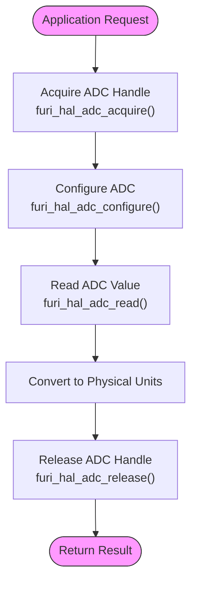
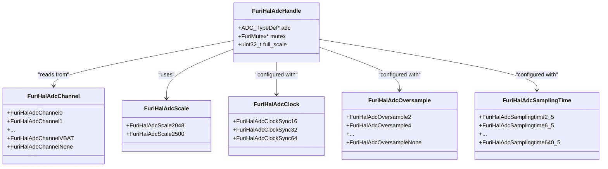
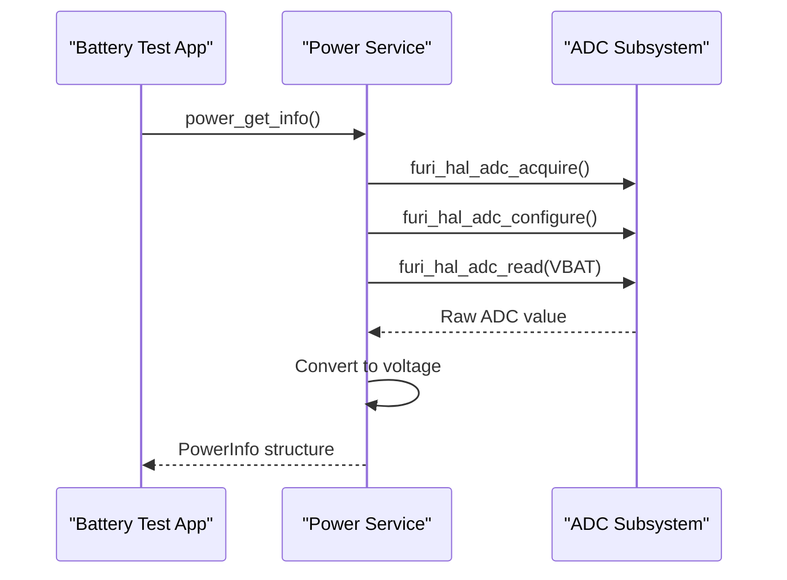
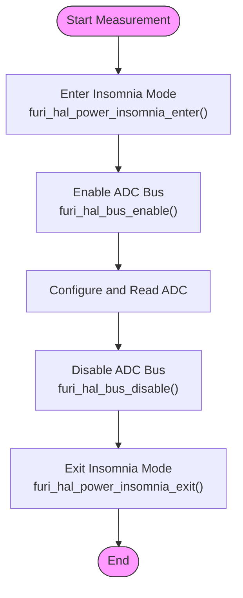

# ADC Interface

<cite>
**Referenced Files in This Document**   
- [furi_hal_adc.h](file://targets/furi_hal_include/furi_hal_adc.h)
- [furi_hal_adc.c](file://targets/f7/furi_hal/furi_hal_adc.c)
- [power.h](file://applications/services/power/power_service/power.h)
- [battery_test_app.c](file://applications/debug/battery_test_app/battery_test_app.c)
</cite>

## Table of Contents
1. [Introduction](#introduction)
2. [ADC Configuration](#adc-configuration)
3. [Channel Configuration and Sampling](#channel-configuration-and-sampling)
4. [Conversion Modes](#conversion-modes)
5. [Advanced Features](#advanced-features)
6. [Battery Voltage Monitoring Example](#battery-voltage-monitoring-example)
7. [Calibration and Accuracy](#calibration-and-accuracy)
8. [Noise Reduction Techniques](#noise-reduction-techniques)
9. [Power Optimization](#power-optimization)
10. [Implementation Examples](#implementation-examples)

## Introduction
The ADC (Analog to Digital Converter) subsystem in the Flipper Zero firmware provides a hardware abstraction layer for analog signal acquisition. The implementation is based on the STM32WB series microcontroller's ADC peripheral, with a simplified API designed for ease of use while maintaining high precision. The ADC interface is managed through the Furi HAL (Hardware Abstraction Layer), which provides functions for initialization, configuration, and reading analog values.

The ADC subsystem is primarily used for battery voltage monitoring, temperature sensing, and other analog sensor readings. It uses the internal voltage reference for improved accuracy and stability, compensating for the noisy power supply from the SMPS (Switched-Mode Power Supply). The system is designed to balance precision, speed, and power consumption, making it suitable for battery-powered applications.

**Section sources**
- [furi_hal_adc.h](file://targets/furi_hal_include/furi_hal_adc.h#L1-L50)
- [furi_hal_adc.c](file://targets/f7/furi_hal/furi_hal_adc.c#L1-L50)

## ADC Configuration
The ADC configuration process involves several steps to ensure accurate and reliable measurements. The configuration API provides both default and extended configuration options to accommodate different use cases.

### Initialization Process
The ADC subsystem must be initialized before use by calling `furi_hal_adc_init()`. This function allocates memory for the ADC handle and initializes the mutex for thread-safe access. The initialization is typically performed during system startup.

```c
void furi_hal_adc_init(void) {
    furi_hal_adc_handle = malloc(sizeof(FuriHalAdcHandle));
    furi_hal_adc_handle->adc = ADC1;
    furi_hal_adc_handle->mutex = furi_mutex_alloc(FuriMutexTypeNormal);
}
```

### Configuration Parameters
The ADC can be configured with various parameters to optimize performance for specific applications:

**:ADC Voltage Scale**
- **FuriHalAdcScale2048**: 2.048V reference scale (default)
- **FuriHalAdcScale2500**: 2.5V reference scale

**:ADC Clock Settings**
- **FuriHalAdcClockSync16**: 16MHz, synchronous (PCLK/4)
- **FuriHalAdcClockSync32**: 32MHz, synchronous (PCLK/2) 
- **FuriHalAdcClockSync64**: 64MHz, synchronous (PCLK/1) - default

**:Oversampling Options**
- **FuriHalAdcOversample2** to **FuriHalAdcOversample256**: 2 to 256 samples averaged
- **FuriHalAdcOversampleNone**: No oversampling

**:Sampling Time Settings**
- **FuriHalAdcSamplingtime2_5** to **FuriHalAdcSamplingtime640_5**: 2.5 to 640.5 ADC clock cycles

The default configuration uses FuriHalAdcScale2048, FuriHalAdcClockSync64, FuriHalAdcOversample64, and FuriHalAdcSamplingtime247_5, which provides approximately 0.1% precision for 0-2.048V measurements.

**Section sources**
- [furi_hal_adc.h](file://targets/furi_hal_include/furi_hal_adc.h#L50-L150)
- [furi_hal_adc.c](file://targets/f7/furi_hal/furi_hal_adc.c#L100-L200)

## Channel Configuration and Sampling
The ADC subsystem supports multiple channels for analog signal acquisition, including external pins and internal sensors.

### Channel Types
The ADC channels are categorized into different types based on their characteristics:

**:Fast Channels (0-5)**
- Designed for high-speed sampling
- Connected to external pins
- Suitable for rapidly changing signals

**:Slow Channels (6-18)**
- Optimized for slower, more stable signals
- Higher impedance tolerance
- Better noise rejection

**:Special Internal Channels**
- **FuriHalAdcChannelVREFINT**: Internal voltage reference (for calibration)
- **FuriHalAdcChannelTEMPSENSOR**: On-die temperature sensor (requires ≥5μs sampling time)
- **FuriHalAdcChannelVBAT**: Battery voltage measurement (VBAT/3, requires ≥12μs sampling time)

### Sampling Procedure
The sampling process follows a specific sequence to ensure accurate readings:

1. Acquire ADC handle using `furi_hal_adc_acquire()`
2. Configure ADC parameters with `furi_hal_adc_configure()` or `furi_hal_adc_configure_ex()`
3. Read ADC value using `furi_hal_adc_read()`
4. Convert raw value to physical units
5. Release ADC handle with `furi_hal_adc_release()`

The handle acquisition ensures exclusive access to the ADC peripheral and manages power domains appropriately.



**Diagram sources**
- [furi_hal_adc.h](file://targets/furi_hal_include/furi_hal_adc.h#L150-L200)
- [furi_hal_adc.c](file://targets/f7/furi_hal/furi_hal_adc.c#L200-L250)

**Section sources**
- [furi_hal_adc.h](file://targets/furi_hal_include/furi_hal_adc.h#L150-L200)
- [furi_hal_adc.c](file://targets/f7/furi_hal/furi_hal_adc.c#L200-L250)

## Conversion Modes
The ADC subsystem supports different conversion modes to accommodate various application requirements.

### Single-Shot Mode
The default mode is single-shot conversion, where each measurement is triggered individually. This mode is suitable for periodic measurements and power-sensitive applications.

```c
FuriHalAdcHandle* handle = furi_hal_adc_acquire();
furi_hal_adc_configure(handle);
uint16_t raw_value = furi_hal_adc_read(handle, channel);
furi_hal_adc_release(handle);
```

In single-shot mode, the ADC performs one conversion per trigger and then enters a low-power state. This mode minimizes power consumption when measurements are infrequent.

### Continuous Mode
Although not directly exposed in the current API, continuous mode can be implemented using low-level controls. In continuous mode, the ADC continuously samples the selected channel and updates the result register.

The implementation uses the STM32WB's ADC peripheral in single conversion mode with software triggering, which effectively provides single-shot behavior. Continuous sampling can be achieved by repeatedly calling the read function in a loop, but this requires careful power management.

### Resolution Settings
The ADC provides 12-bit resolution, but the effective number of bits is approximately 10 due to noise and other factors. The resolution can be improved through oversampling, where multiple samples are averaged to increase the effective resolution.

The oversampling ratio directly affects the measurement time and precision:
- **Oversample2**: ~1 extra bit of resolution
- **Oversample4**: ~2 extra bits of resolution  
- **Oversample8**: ~3 extra bits of resolution
- **Oversample16**: ~4 extra bits of resolution

Higher oversampling ratios provide better noise rejection and improved precision but increase measurement time proportionally.

**Section sources**
- [furi_hal_adc.h](file://targets/furi_hal_include/furi_hal_adc.h#L200-L230)
- [furi_hal_adc.c](file://targets/f7/furi_hal/furi_hal_adc.c#L250-L282)

## Advanced Features
The ADC subsystem includes several advanced features to enhance measurement accuracy and functionality.

### Analog Watchdog
The current implementation does not expose the analog watchdog feature through the high-level API. The analog watchdog can be implemented using low-level controls to monitor input voltage ranges and generate interrupts when thresholds are exceeded.

### Discontinuous Mode
Discontinuous mode is not currently supported in the high-level API. This mode allows the ADC to perform conversions in groups, which can be useful for power optimization in specific scenarios.

### Dual ADC Operation
The STM32WB microcontroller supports dual ADC operation, but this feature is not utilized in the current implementation. The system uses a single ADC instance (ADC1) for all analog measurements.

### DMA Support
Direct Memory Access (DMA) support is not available in the current API but can be implemented using low-level controls. DMA would enable high-speed sampling without CPU intervention, which is beneficial for applications requiring rapid data acquisition.

The implementation currently uses polling mode for ADC conversions, which is suitable for the typical use cases of battery monitoring and sensor reading where high sampling rates are not required.



**Diagram sources**
- [furi_hal_adc.h](file://targets/furi_hal_include/furi_hal_adc.h#L50-L150)
- [furi_hal_adc.c](file://targets/f7/furi_hal/furi_hal_adc.c#L1-L50)

**Section sources**
- [furi_hal_adc.h](file://targets/furi_hal_include/furi_hal_adc.h#L150-L230)
- [furi_hal_adc.c](file://targets/f7/furi_hal/furi_hal_adc.c#L1-L282)

## Battery Voltage Monitoring Example
The battery voltage monitoring system demonstrates a practical application of the ADC subsystem. The implementation uses the special internal channel FuriHalAdcChannelVBAT to measure the battery voltage.

### Battery Measurement Process
The battery voltage monitoring follows these steps:

1. Acquire the power service record
2. Request battery information using power_get_info()
3. Extract the gauge voltage from the PowerInfo structure
4. Display the voltage on the UI

```c
void battery_test_battery_info_update_model(void* context) {
    BatteryTestApp* app = context;
    power_get_info(app->power, &app->info);
    BatteryInfoModel battery_info_data = {
        .vbus_voltage = app->info.voltage_vbus,
        .gauge_voltage = app->info.voltage_gauge,
        .gauge_current = app->info.current_gauge,
        .gauge_temperature = app->info.temperature_gauge,
        .charge = app->info.charge,
        .health = app->info.health,
    };
    battery_info_set_data(app->battery_info, &battery_info_data);
}
```

The power service abstracts the ADC details, providing a higher-level interface for battery monitoring. This abstraction allows applications to access battery information without directly managing the ADC hardware.

### Integration with Power Service
The power service acts as an intermediary between the ADC hardware and applications, providing a clean API for battery-related information:



**Diagram sources**
- [battery_test_app.c](file://applications/debug/battery_test_app/battery_test_app.c#L50-L80)
- [power.h](file://applications/services/power/power_service/power.h#L50-L100)

**Section sources**
- [battery_test_app.c](file://applications/debug/battery_test_app/battery_test_app.c#L50-L80)
- [power.h](file://applications/services/power/power_service/power.h#L50-L100)

## Calibration and Accuracy
The ADC subsystem includes calibration mechanisms to ensure measurement accuracy.

### Internal Calibration
The system uses the internal voltage reference (VREFINT) for calibration. The VREFINT channel provides a stable reference voltage that can be used to calibrate the ADC readings.

```c
float furi_hal_adc_convert_vref(FuriHalAdcHandle* handle, uint16_t value) {
    // Convert VREFINT reading to voltage
    return (float)value * handle->full_scale / 4095.0f;
}
```

The calibration process involves:
1. Reading the VREFINT channel
2. Comparing the measured value with the expected reference voltage
3. Adjusting subsequent measurements based on the calibration factor

### Accuracy Considerations
Several factors affect ADC accuracy:

**:Signal Conditioning**
- Input impedance should be kept below 10kΩ
- High-impedance circuits may require buffering
- Proper decoupling capacitors should be used

**:Noise Sources**
- SMPS power supply noise
- Digital switching noise
- External electromagnetic interference

**:Timing Constraints**
- Internal channels have minimum sampling time requirements
- Temperature sensor requires ≥5μs sampling time
- VBAT channel requires ≥12μs sampling time

The default configuration parameters were optimized for 0-2.048V measurements with approximately 0.1% precision. Higher precision can be achieved with careful circuit design and parameter tuning.

**Section sources**
- [furi_hal_adc.h](file://targets/furi_hal_include/furi_hal_adc.h#L200-L230)
- [furi_hal_adc.c](file://targets/f7/furi_hal/furi_hal_adc.c#L150-L200)

## Noise Reduction Techniques
The ADC implementation includes several noise reduction techniques to improve measurement quality.

### Oversampling
Oversampling is the primary noise reduction technique, where multiple samples are averaged to reduce random noise. The relationship between oversampling ratio and noise reduction follows the square root law:

Noise Reduction = √(Oversampling Ratio)

For example, with 64x oversampling, random noise is reduced by a factor of 8 (√64).

### Sampling Time Optimization
The sampling time is carefully selected to balance noise rejection and measurement speed. Longer sampling times allow the internal sampling capacitor to fully charge, reducing errors from high-impedance sources.

The default sampling time of 247.5 ADC clocks (3.87μs at 64MHz) is suitable for circuits with relatively high impedance. For low-impedance sources, shorter sampling times can be used to reduce measurement time.

### Reference Voltage Stability
The system uses the internal voltage reference (VREFBUF) to provide a stable reference voltage. The reference voltage is trimmed using factory calibration values:

```c
uint32_t trim_value = 0;
switch(scale) {
case FuriHalAdcScale2048:
    LL_VREFBUF_SetVoltageScaling(LL_VREFBUF_VOLTAGE_SCALE0);
    trim_value = LL_VREFBUF_SC0_GetCalibration() & 0x3FU;
    break;
case FuriHalAdcScale2500:
    LL_VREFBUF_SetVoltageScaling(LL_VREFBUF_VOLTAGE_SCALE1);
    trim_value = LL_VREFBUF_SC1_GetCalibration() & 0x3FU;
    break;
}
LL_VREFBUF_SetTrimming(trim_value);
```

A 500ms timer ensures the reference voltage is stable before ADC configuration.

**Section sources**
- [furi_hal_adc.c](file://targets/f7/furi_hal/furi_hal_adc.c#L100-L150)

## Power Optimization
The ADC subsystem includes several power optimization features to extend battery life.

### Power Management
The system implements power management through:

**:Insomnia Mode**
- `furi_hal_power_insomnia_enter()` prevents sleep during ADC operations
- `furi_hal_power_insomnia_exit()` allows sleep after ADC operations

**:Bus Power Control**
- ADC bus is enabled only during measurements
- Bus is disabled after measurements to reduce power consumption

**:Handle-Based Access**
- ADC handle acquisition ensures exclusive access
- Prevents concurrent access that could increase power consumption

### Measurement Timing
The default configuration balances measurement speed and power consumption:

- Total measurement time: ~260μs per reading
- Sampling time: 3.87μs
- Conversion time: 256.13μs (64 samples at 64MHz)

For battery-powered applications, measurements should be taken at appropriate intervals to balance accuracy and power consumption.

### Low-Power Design Considerations
When designing for low power:

**:Minimize Measurement Frequency**
- Take measurements only when necessary
- Use event-driven rather than periodic sampling when possible

**:Optimize Configuration**
- Use lower oversampling ratios when high precision is not required
- Select appropriate sampling times for the source impedance

**:Manage Power States**
- Ensure ADC is properly released after use
- Allow system to enter low-power states between measurements



**Diagram sources**
- [furi_hal_adc.c](file://targets/f7/furi_hal/furi_hal_adc.c#L50-L100)

**Section sources**
- [furi_hal_adc.c](file://targets/f7/furi_hal/furi_hal_adc.c#L50-L100)

## Implementation Examples
This section provides practical examples of ADC usage in the Flipper Zero firmware.

### Basic ADC Usage
```c
// Example: Reading an external analog sensor
float read_analog_sensor(FuriHalAdcChannel channel) {
    FuriHalAdcHandle* handle = furi_hal_adc_acquire();
    if(!handle) return -1.0f;
    
    furi_hal_adc_configure(handle);
    uint16_t raw_value = furi_hal_adc_read(handle, channel);
    float voltage = furi_hal_adc_convert_to_voltage(handle, raw_value);
    
    furi_hal_adc_release(handle);
    return voltage;
}
```

### Battery Voltage Measurement
```c
// Example: Battery voltage monitoring
float get_battery_voltage(void) {
    FuriHalAdcHandle* handle = furi_hal_adc_acquire();
    if(!handle) return -1.0f;
    
    furi_hal_adc_configure(handle);
    uint16_t vbat_raw = furi_hal_adc_read(handle, FuriHalAdcChannelVBAT);
    float battery_voltage = furi_hal_adc_convert_vbat(handle, vbat_raw);
    
    furi_hal_adc_release(handle);
    return battery_voltage;
}
```

### Temperature Measurement
```c
// Example: On-die temperature measurement
float get_temperature(void) {
    FuriHalAdcHandle* handle = furi_hal_adc_acquire();
    if(!handle) return -1000.0f; // Error value
    
    // Use extended configuration for temperature sensor
    furi_hal_adc_configure_ex(
        handle,
        FuriHalAdcScale2048,
        FuriHalAdcClockSync64,
        FuriHalAdcOversample64,
        FuriHalAdcSamplingtime247_5
    );
    
    uint16_t temp_raw = furi_hal_adc_read(handle, FuriHalAdcChannelTEMPSENSOR);
    float temperature = furi_hal_adc_convert_temp(handle, temp_raw);
    
    furi_hal_adc_release(handle);
    return temperature;
}
```

These examples demonstrate the proper usage pattern: acquire handle, configure, read, convert, and release. This pattern ensures thread safety and proper power management.

**Section sources**
- [furi_hal_adc.h](file://targets/furi_hal_include/furi_hal_adc.h#L150-L230)
- [furi_hal_adc.c](file://targets/f7/furi_hal/furi_hal_adc.c#L200-L282)