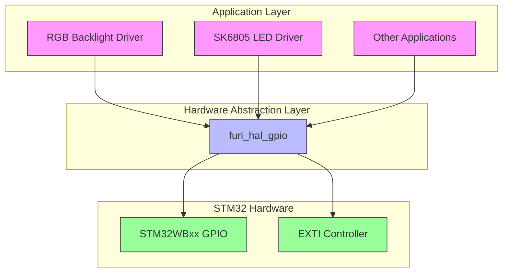
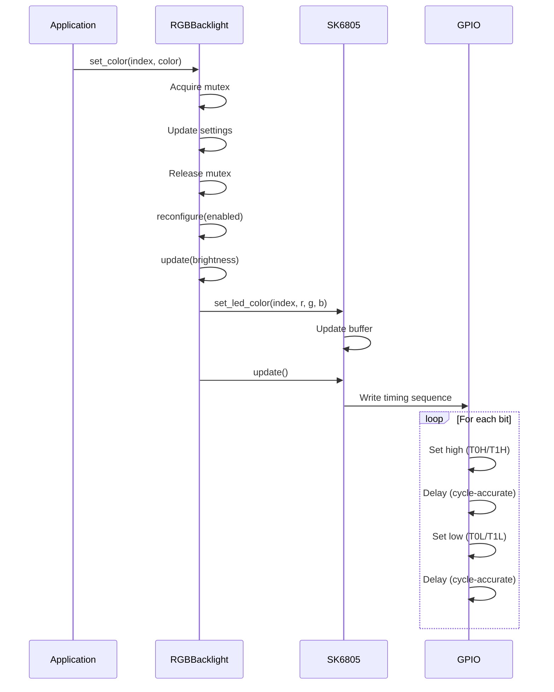

# GPIO Interface

<cite>
**Referenced Files in This Document**   
- [furi_hal_gpio.h](file://targets/f7/furi_hal/furi_hal_gpio.h#L0-L287)
- [furi_hal_gpio.c](file://targets/f7/furi_hal/furi_hal_gpio.c#L0-L343)
- [SK6805.c](file://lib/drivers/SK6805.c#L0-L105)
- [SK6805.h](file://lib/drivers/SK6805.h#L0-L54)
- [rgb_backlight.c](file://lib/drivers/rgb_backlight.c#L0-L318)
- [rgb_backlight.h](file://lib/drivers/rgb_backlight.h#L0-L111)
</cite>

## Table of Contents
1. [Introduction](#introduction)
2. [GPIO Architecture Overview](#gpio-architecture-overview)
3. [Pin Configuration](#pin-configuration)
4. [Digital Read/Write Operations](#digital-readwrite-operations)
5. [Interrupt Handling](#interrupt-handling)
6. [Advanced Features](#advanced-features)
7. [LED Control Examples](#led-control-examples)
8. [Input Debouncing and Switch Interfaces](#input-debouncing-and-switch-interfaces)
9. [Power Optimization](#power-optimization)
10. [Best Practices](#best-practices)

## Introduction

The GPIO (General Purpose Input/Output) subsystem in the Flipper Zero firmware provides a comprehensive interface for controlling hardware pins and peripherals. This documentation details the complete GPIO functionality, including pin configuration, digital operations, interrupt handling, and advanced features. The system is designed to be both powerful and accessible, supporting various pin modes, speed settings, and pull configurations.

The GPIO interface is implemented in the hardware abstraction layer (HAL) and provides both simple and advanced configuration options. It supports standard digital input/output operations, alternate functions for peripheral interfaces, analog mode, and sophisticated interrupt handling capabilities. The system is built on top of the STM32WBxx HAL library, providing a consistent interface across different hardware targets.

**Section sources**
- [furi_hal_gpio.h](file://targets/f7/furi_hal/furi_hal_gpio.h#L0-L287)
- [furi_hal_gpio.c](file://targets/f7/furi_hal/furi_hal_gpio.c#L0-L343)

## GPIO Architecture Overview

The GPIO subsystem follows a layered architecture with clear separation between the hardware abstraction layer and application-level drivers. The core functionality is implemented in the `furi_hal_gpio` module, which provides low-level access to GPIO pins, while higher-level drivers like the SK6805 LED controller and RGB backlight system build upon this foundation.



**Diagram sources**
- [furi_hal_gpio.h](file://targets/f7/furi_hal/furi_hal_gpio.h#L0-L287)
- [furi_hal_gpio.c](file://targets/f7/furi_hal/furi_hal_gpio.c#L0-L343)
- [SK6805.c](file://lib/drivers/SK6805.c#L0-L105)
- [rgb_backlight.c](file://lib/drivers/rgb_backlight.c#L0-L318)

**Section sources**
- [furi_hal_gpio.h](file://targets/f7/furi_hal/furi_hal_gpio.h#L0-L287)
- [furi_hal_gpio.c](file://targets/f7/furi_hal/furi_hal_gpio.c#L0-L343)

## Pin Configuration

The GPIO subsystem provides multiple functions for configuring pin modes, with varying levels of control and complexity. The configuration system supports input, output, alternate function, analog, and interrupt modes, along with pull-up/pull-down resistors and speed settings.

### Configuration Functions

The GPIO interface offers three initialization functions with increasing levels of configuration options:

```c
// Simple initialization with basic mode setting
void furi_hal_gpio_init_simple(const GpioPin* gpio, const GpioMode mode);

// Normal initialization with pull and speed settings
void furi_hal_gpio_init(
    const GpioPin* gpio,
    const GpioMode mode,
    const GpioPull pull,
    const GpioSpeed speed);

// Extended initialization with alternate function support
void furi_hal_gpio_init_ex(
    const GpioPin* gpio,
    const GpioMode mode,
    const GpioPull pull,
    const GpioSpeed speed,
    const GpioAltFn alt_fn);
```

### Pin Structure

The `GpioPin` structure defines a GPIO pin with its port and pin mask:

```c
typedef struct {
    GPIO_TypeDef* port;
    uint16_t pin;
} GpioPin;
```

This structure allows for type-safe pin references and is used throughout the GPIO API.

### Mode Configuration

The `GpioMode` enum defines various pin operation modes:

```c
typedef enum {
    GpioModeInput,
    GpioModeOutputPushPull,
    GpioModeOutputOpenDrain,
    GpioModeAltFunctionPushPull,
    GpioModeAltFunctionOpenDrain,
    GpioModeAnalog,
    GpioModeInterruptRise,
    GpioModeInterruptFall,
    GpioModeInterruptRiseFall,
    GpioModeEventRise,
    GpioModeEventFall,
    GpioModeEventRiseFall,
} GpioMode;
```

### Pull Configuration

The `GpioPull` enum controls internal pull resistors:

```c
typedef enum {
    GpioPullNo,
    GpioPullUp,
    GpioPullDown,
} GpioPull;
```

### Speed Configuration

The `GpioSpeed` enum sets the pin switching speed:

```c
typedef enum {
    GpioSpeedLow,
    GpioSpeedMedium,
    GpioSpeedHigh,
    GpioSpeedVeryHigh,
} GpioSpeed;
```

### Alternate Functions

The `GpioAltFn` enum defines alternate functions for multiplexed pins, mapping to specific peripheral interfaces like I2C, SPI, USART, and others. Each alternate function value corresponds to a specific peripheral mapping on the STM32 microcontroller.

**Section sources**
- [furi_hal_gpio.h](file://targets/f7/furi_hal/furi_hal_gpio.h#L0-L287)
- [furi_hal_gpio.c](file://targets/f7/furi_hal/furi_hal_gpio.c#L0-L343)

## Digital Read/Write Operations

The GPIO subsystem provides efficient functions for digital read and write operations, optimized for performance and thread safety.

### Write Operations

The `furi_hal_gpio_write` function performs atomic write operations using the BSRR (Bit Set/Reset Register) for glitch-free pin control:

```c
static inline void furi_hal_gpio_write(const GpioPin* gpio, const bool state) {
    // writing to BSSR is an atomic operation
    if(state == true) {
        gpio->port->BSRR = gpio->pin;
    } else {
        gpio->port->BSRR = (uint32_t)gpio->pin << GPIO_NUMBER;
    }
}
```

An additional function allows writing to a port and pin combination:

```c
static inline void furi_hal_gpio_write_port_pin(GPIO_TypeDef* port, uint16_t pin, const bool state) {
    // writing to BSSR is an atomic operation
    if(state == true) {
        port->BSRR = pin;
    } else {
        port->BSRR = pin << GPIO_NUMBER;
    }
}
```

### Read Operations

The `furi_hal_gpio_read` function reads the current state of a GPIO pin:

```c
static inline bool furi_hal_gpio_read(const GpioPin* gpio) {
    if((gpio->port->IDR & gpio->pin) != 0x00U) {
        return true;
    } else {
        return false;
    }
}
```

A complementary function reads from a specific port and pin:

```c
static inline bool furi_hal_gpio_read_port_pin(GPIO_TypeDef* port, uint16_t pin) {
    if((port->IDR & pin) != 0x00U) {
        return true;
    } else {
        return false;
    }
}
```

These functions use the IDR (Input Data Register) to read pin states and return boolean values for easy integration in conditional statements.

**Section sources**
- [furi_hal_gpio.h](file://targets/f7/furi_hal/furi_hal_gpio.h#L0-L287)
- [furi_hal_gpio.c](file://targets/f7/furi_hal/furi_hal_gpio.c#L0-L343)

## Interrupt Handling

The GPIO subsystem provides a comprehensive interrupt handling mechanism for responding to pin state changes. This system supports various interrupt types and callback-based event handling.

### Interrupt Configuration

The interrupt system uses the EXTI (External Interrupt) controller to detect pin state changes. The `furi_hal_gpio_init_ex` function configures the pin for interrupt mode when one of the interrupt modes is selected:

```c
// Interrupt modes in GpioMode enum
GpioModeInterruptRise,
GpioModeInterruptFall,
GpioModeInterruptRiseFall,
GpioModeEventRise,
GpioModeEventFall,
GpioModeEventRiseFall,
```

When a pin is configured in interrupt mode, the system sets up the EXTI controller to detect the specified edge transitions (rising, falling, or both).

### Interrupt Callback Management

The system provides functions to manage interrupt callbacks:

```c
// Add and enable interrupt callback
void furi_hal_gpio_add_int_callback(const GpioPin* gpio, GpioExtiCallback cb, void* ctx);

// Enable interrupt
void furi_hal_gpio_enable_int_callback(const GpioPin* gpio);

// Disable interrupt
void furi_hal_gpio_disable_int_callback(const GpioPin* gpio);

// Remove interrupt callback
void furi_hal_gpio_remove_int_callback(const GpioPin* gpio);
```

The `GpioInterrupt` structure stores callback information:

```c
typedef struct {
    GpioExtiCallback callback;
    void* context;
} GpioInterrupt;
```

### Interrupt Implementation

The interrupt handling is implemented using critical sections to ensure thread safety during configuration changes. When a pin is configured for interrupt mode, the system:

1. Sets the pin to input mode
2. Configures the SYSCFG EXTI source
3. Enables the appropriate trigger (rising, falling, or both)
4. Manages the EXTI line configuration

The interrupt callbacks are stored in a global array, with one entry per GPIO pin.

**Section sources**
- [furi_hal_gpio.h](file://targets/f7/furi_hal/furi_hal_gpio.h#L0-L287)
- [furi_hal_gpio.c](file://targets/f7/furi_hal/furi_hal_gpio.c#L0-L343)

## Advanced Features

The GPIO subsystem includes several advanced features that enhance its functionality and flexibility for various applications.

### Open-Drain Configuration

Open-drain output mode allows multiple devices to share a common signal line, commonly used in I2C buses and other wired-AND configurations. This mode is configured using:

```c
GpioModeOutputOpenDrain
GpioModeAltFunctionOpenDrain
```

In open-drain mode, the pin can only actively drive low or go into high-impedance state, requiring an external pull-up resistor to achieve a high logic level.

### Pull-Up/Pull-Down Resistors

Internal pull resistors can be configured to ensure defined pin states when no external signal is present:

```c
GpioPullNo     // No pull resistor
GpioPullUp     // Internal pull-up resistor
GpioPullDown   // Internal pull-down resistor
```

These pull resistors are particularly useful for button inputs and unused pins to prevent floating states.

### Speed Settings

The GPIO speed settings control the slew rate of pin transitions, balancing between signal integrity and electromagnetic interference:

```c
GpioSpeedLow       // Low speed, reduced EMI
GpioSpeedMedium    // Medium speed
GpioSpeedHigh      // High speed
GpioSpeedVeryHigh  // Very high speed, maximum performance
```

Higher speeds provide faster transitions but may increase power consumption and EMI.

### Alternate Functions

Alternate functions allow GPIO pins to be connected to various on-chip peripherals instead of being used as general-purpose I/O. The `GpioAltFn` enum defines mappings for peripherals such as:

- I2C (GpioAltFn4I2C1, GpioAltFn4I2C3)
- SPI (GpioAltFn5SPI1, GpioAltFn5SPI2)
- USART (GpioAltFn7USART1)
- LPUART (GpioAltFn8LPUART1)
- USB (GpioAltFn10USB)
- RF interfaces (GpioAltFn6RF_*)

**Section sources**
- [furi_hal_gpio.h](file://targets/f7/furi_hal/furi_hal_gpio.h#L0-L287)
- [furi_hal_gpio.c](file://targets/f7/furi_hal/furi_hal_gpio.c#L0-L343)

## LED Control Examples

The GPIO subsystem is used by various drivers to control LEDs, including the SK6805 addressable LED driver and the RGB backlight system.

### SK6805 Driver

The SK6805 driver controls addressable RGB LEDs using a single GPIO pin with precise timing requirements.

#### Driver Interface

The SK6805 driver provides the following functions:

```c
// Initialize the LED driver
void SK6805_init(void);

// Get the number of LEDs
uint8_t SK6805_get_led_count(void);

// Set color for a specific LED
void SK6805_set_led_color(uint8_t led_index, uint8_t r, uint8_t g, uint8_t b);

// Update all LEDs with current colors
void SK6805_update(void);
```

#### Implementation Details

The driver uses GPIO pin PA8 for data transmission:

```c
static const GpioPin led_pin = {.port = GPIOA, .pin = LL_GPIO_PIN_8};
```

The timing-critical `SK6805_update` function uses direct GPIO manipulation with cycle-accurate delays:

```c
void SK6805_update(void) {
    FURI_CRITICAL_ENTER();
    uint32_t end;
    for(uint8_t lednumber = 0; lednumber < SK6805_LED_COUNT; lednumber++) {
        for(uint8_t color = 0; color < 3; color++) {
            uint8_t i = 0b10000000;
            while(i != 0) {
                if(led_buffer[lednumber][color] & (i)) {
                    // T1H: 600ns high
                    furi_hal_gpio_write(SK6805_LED_PIN, true);
                    end = DWT->CYCCNT + 30;
                    while(DWT->CYCCNT < end);
                    // T1L: 600ns low
                    furi_hal_gpio_write(SK6805_LED_PIN, false);
                    end = DWT->CYCCNT + 26;
                    while(DWT->CYCCNT < end);
                } else {
                    // T0H: 300ns high
                    furi_hal_gpio_write(SK6805_LED_PIN, true);
                    end = DWT->CYCCNT + 11;
                    while(DWT->CYCCNT < end);
                    // T0L: 900ns low
                    furi_hal_gpio_write(SK6805_LED_PIN, false);
                    end = DWT->CYCCNT + 43;
                    while(DWT->CYCCNT < end);
                }
                i >>= 1;
            }
        }
    }
    FURI_CRITICAL_EXIT();
}
```

The driver uses the DWT (Data Watchpoint and Trace) cycle counter for precise timing, ensuring the SK6805 protocol requirements are met.

### RGB Backlight Driver

The RGB backlight driver provides higher-level control over the LED colors and effects.

#### Driver Interface

The RGB backlight driver provides functions for color control and effects:

```c
// Load settings at boot
void rgb_backlight_load_settings(bool enabled);

// Save current settings
void rgb_backlight_save_settings(void);

// Set color for a specific LED
void rgb_backlight_set_color(uint8_t index, const RgbColor* color);

// Get color of a specific LED
void rgb_backlight_get_color(uint8_t index, RgbColor* color);

// Set rainbow mode
void rgb_backlight_set_rainbow_mode(RGBBacklightRainbowMode rainbow_mode);

// Set rainbow speed
void rgb_backlight_set_rainbow_speed(uint8_t rainbow_speed);

// Set rainbow interval
void rgb_backlight_set_rainbow_interval(uint32_t rainbow_interval);

// Set rainbow saturation
void rgb_backlight_set_rainbow_saturation(uint8_t rainbow_saturation);

// Reconfigure with new settings
void rgb_backlight_reconfigure(bool enabled);

// Update backlight with brightness
void rgb_backlight_update(uint8_t brightness, bool forced);
```

#### Implementation Details

The driver uses a state structure to manage settings and state:

```c
static struct {
    RgbColor colors[SK6805_LED_COUNT];
    RGBBacklightRainbowMode rainbow_mode;
    uint8_t rainbow_speed;
    uint32_t rainbow_interval;
    uint32_t rainbow_saturation;
} rgb_settings;

static struct {
    bool settings_loaded;
    FuriMutex* mutex;
    bool enabled;
    uint8_t last_brightness;
    FuriTimer* rainbow_timer;
    HsvColor rainbow_hsv;
} rgb_state;
```

The driver implements rainbow effects using a timer callback:

```c
void rainbow_timer(void* ctx) {
    // Update rainbow effect
    rgb_state.rainbow_hsv.h += rgb_settings.rainbow_speed;
    
    RgbColor rgb;
    hsv2rgb(&rgb_state.rainbow_hsv, &rgb);
    
    switch(rgb_settings.rainbow_mode) {
    case RGBBacklightRainbowModeWave: {
        // Wave effect with hue shift across LEDs
        HsvColor hsv = rgb_state.rainbow_hsv;
        for(uint8_t i = 0; i < SK6805_get_led_count(); i++) {
            if(i) {
                hsv.h += (50 * i);
                hsv2rgb(&hsv, &rgb);
            }
            SK6805_set_led_color(i, rgb.r, rgb.g, rgb.b);
        }
        break;
    }
    
    case RGBBacklightRainbowModeSolid:
        // Solid color across all LEDs
        for(uint8_t i = 0; i < SK6805_get_led_count(); i++) {
            SK6805_set_led_color(i, rgb.r, rgb.g, rgb.b);
        }
        break;
        
    default:
        break;
    }
    
    SK6805_update();
}
```

The driver uses mutex protection for thread safety and saves settings to persistent storage.



**Diagram sources**
- [SK6805.c](file://lib/drivers/SK6805.c#L0-L105)
- [SK6805.h](file://lib/drivers/SK6805.h#L0-L54)
- [rgb_backlight.c](file://lib/drivers/rgb_backlight.c#L0-L318)
- [rgb_backlight.h](file://lib/drivers/rgb_backlight.h#L0-L111)

**Section sources**
- [SK6805.c](file://lib/drivers/SK6805.c#L0-L105)
- [SK6805.h](file://lib/drivers/SK6805.h#L0-L54)
- [rgb_backlight.c](file://lib/drivers/rgb_backlight.c#L0-L318)
- [rgb_backlight.h](file://lib/drivers/rgb_backlight.h#L0-L111)

## Input Debouncing and Switch Interfaces

While the provided codebase does not contain explicit debouncing implementations, best practices for switch interfaces can be derived from the GPIO capabilities.

### Switch Interface Design

For reliable switch detection, consider the following configuration:

```c
// Configure switch input with pull-up resistor
furi_hal_gpio_init(
    &switch_pin,
    GpioModeInput,
    GpioPullUp,
    GpioSpeedLow
);
```

Using a pull-up resistor ensures a defined high state when the switch is open, with the switch connecting the pin to ground when closed.

### Software Debouncing

Implement debouncing using timer-based sampling:

```c
// Pseudocode for debouncing
void switch_debounce_task(void) {
    static bool switch_state = false;
    static bool switch_state_debounced = false;
    static uint32_t last_change_time = 0;
    
    bool current_state = furi_hal_gpio_read(&switch_pin);
    
    if(current_state != switch_state) {
        last_change_time = furi_get_tick();
        switch_state = current_state;
    }
    
    if((furi_get_tick() - last_change_time > DEBOUNCE_MS) && 
       (switch_state != switch_state_debounced)) {
        switch_state_debounced = switch_state;
        // Notify application of switch state change
        event_send(switch_state_debounced);
    }
}
```

### Interrupt-Based Detection

Use GPIO interrupts for efficient switch detection:

```c
// Add interrupt callback for switch
furi_hal_gpio_add_int_callback(
    &switch_pin,
    switch_interrupt_callback,
    NULL
);
```

The interrupt handler should schedule debouncing logic rather than performing it directly to avoid blocking other interrupts.

**Section sources**
- [furi_hal_gpio.h](file://targets/f7/furi_hal/furi_hal_gpio.h#L0-L287)
- [furi_hal_gpio.c](file://targets/f7/furi_hal/furi_hal_gpio.c#L0-L343)

## Power Optimization

The GPIO subsystem provides several features for power optimization in battery-powered devices like the Flipper Zero.

### Pin Configuration for Low Power

Configure unused pins to minimize power consumption:

```c
// Configure unused pins as output low
furi_hal_gpio_init(
    &unused_pin,
    GpioModeOutputPushPull,
    GpioPullNo,
    GpioSpeedLow
);
furi_hal_gpio_write(&unused_pin, false);
```

Alternatively, configure as analog input to disable input Schmitt triggers:

```c
// Configure as analog to minimize power
furi_hal_gpio_init_simple(&unused_pin, GpioModeAnalog);
```

### Peripheral Power Management

The GPIO implementation includes power management features:

```c
// Enable/disable pull resistors in power management registers
LL_PWR_EnableGPIOPullUp(pwr_port, pwr_pin);
LL_PWR_EnableGPIOPullDown(pwr_port, pwr_pin);
```

These settings ensure proper operation during low-power modes.

### Interrupt Efficiency

Use interrupt-driven designs instead of polling to reduce CPU activity:

```c
// Instead of polling:
while(1) {
    if(furi_hal_gpio_read(&sensor_pin)) {
        handle_event();
    }
    furi_delay_ms(10);
}

// Use interrupts:
furi_hal_gpio_add_int_callback(&sensor_pin, sensor_callback, NULL);
```

Interrupts allow the processor to sleep until an event occurs, significantly reducing power consumption.

**Section sources**
- [furi_hal_gpio.h](file://targets/f7/furi_hal/furi_hal_gpio.h#L0-L287)
- [furi_hal_gpio.c](file://targets/f7/furi_hal/furi_hal_gpio.c#L0-L343)

## Best Practices

Follow these best practices when working with the GPIO subsystem:

### Pin Configuration

- Always initialize pins before use
- Use appropriate pull resistors for input pins
- Select the lowest speed setting that meets your requirements
- Configure unused pins to prevent floating states

### Interrupt Handling

- Keep interrupt callbacks short and efficient
- Use critical sections when accessing shared data
- Avoid blocking operations in interrupt context
- Use mutexes for thread-safe access to shared resources

### LED Control

- Use the RGB backlight driver for high-level color control
- Be aware of timing requirements for addressable LEDs
- Consider power consumption when setting LED brightness
- Use effects sparingly to conserve battery

### Power Management

- Configure unused pins appropriately
- Use interrupt-driven designs instead of polling
- Minimize GPIO activity when possible
- Consider the power implications of pull resistors

### Error Handling

- Check return values and use assertions where appropriate
- Handle configuration errors gracefully
- Validate parameters before use
- Use the furi_check macro for runtime assertions

By following these practices, you can create reliable, efficient, and power-conscious applications using the GPIO subsystem.

**Section sources**
- [furi_hal_gpio.h](file://targets/f7/furi_hal/furi_hal_gpio.h#L0-L287)
- [furi_hal_gpio.c](file://targets/f7/furi_hal/furi_hal_gpio.c#L0-L343)
- [SK6805.c](file://lib/drivers/SK6805.c#L0-L105)
- [rgb_backlight.c](file://lib/drivers/rgb_backlight.c#L0-L318)