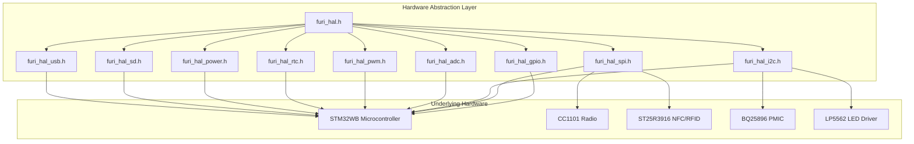
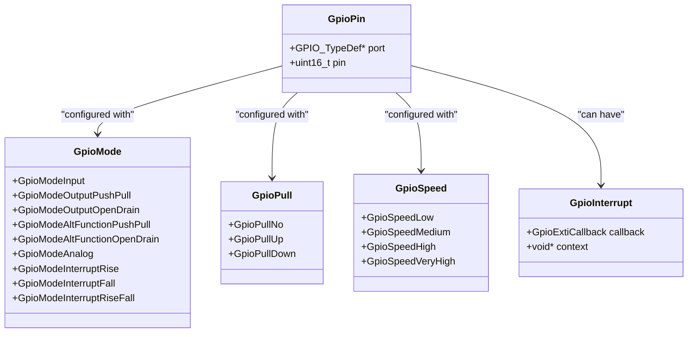
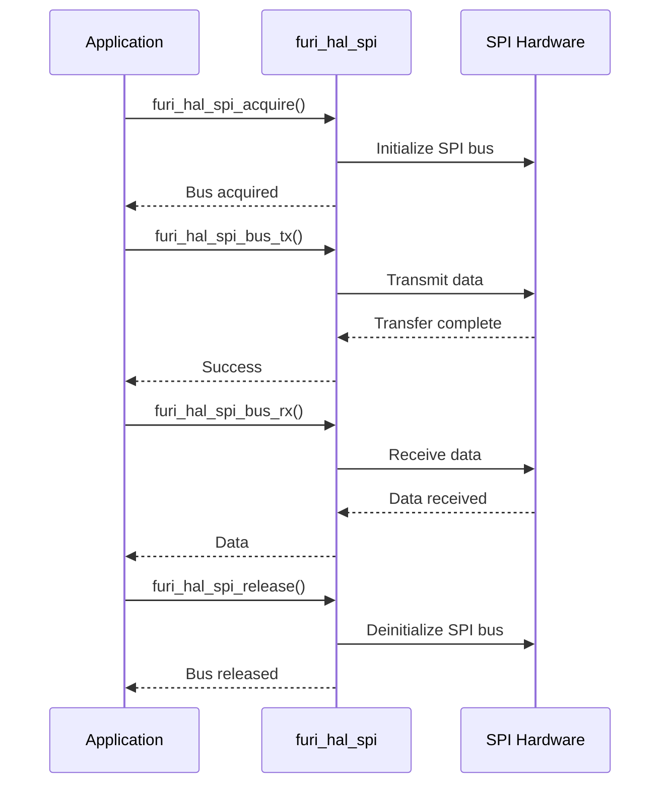
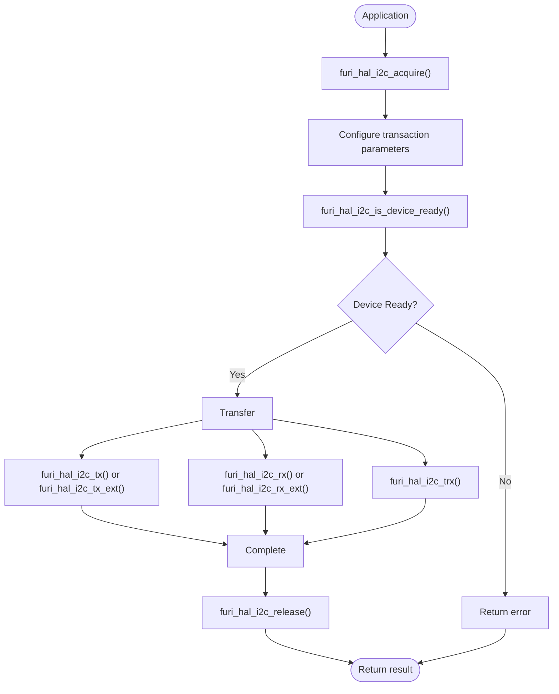
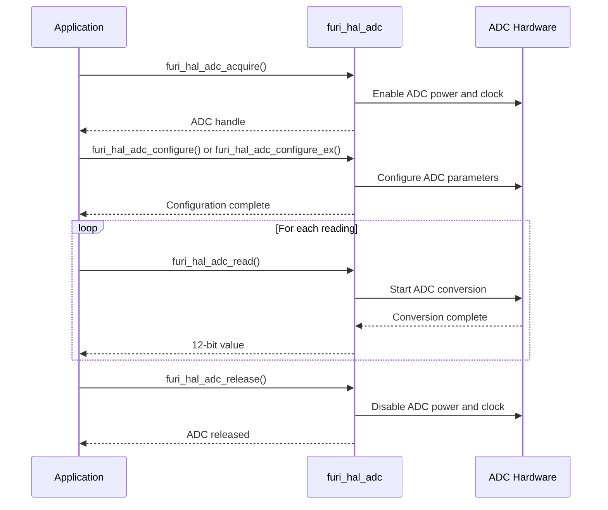
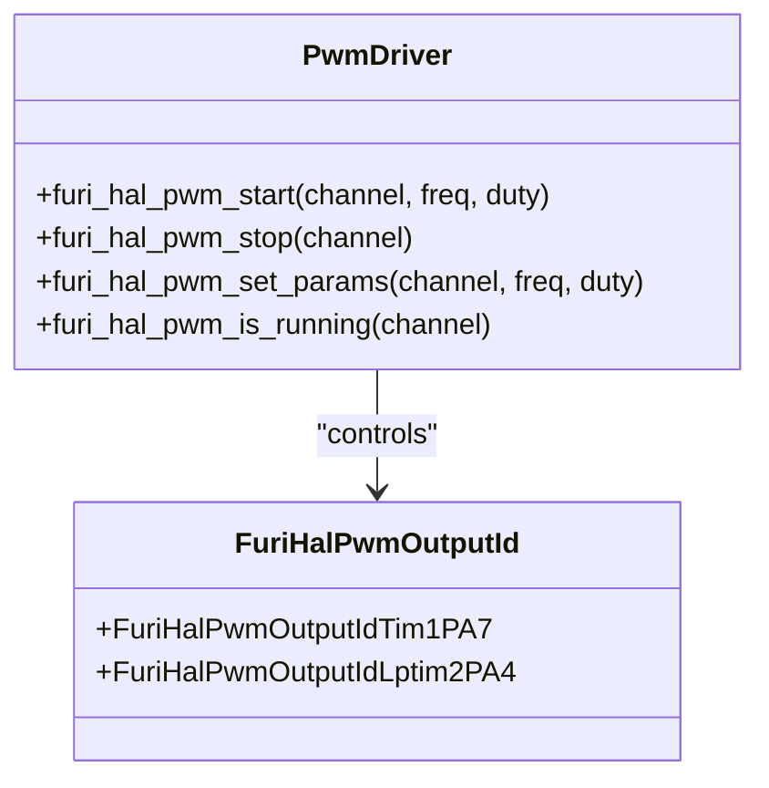
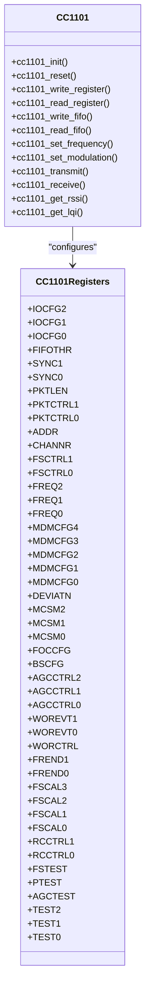

# Hardware Abstraction Layer

<cite>
**Referenced Files in This Document**   
- [furi_hal.h](file://targets/furi_hal_include/furi_hal.h)
- [furi_hal_gpio.h](file://targets/f7/furi_hal/furi_hal_gpio.h)
- [furi_hal_spi.h](file://targets/furi_hal_include/furi_hal_spi.h)
- [furi_hal_i2c.h](file://targets/furi_hal_include/furi_hal_i2c.h)
- [furi_hal_adc.h](file://targets/furi_hal_include/furi_hal_adc.h)
- [furi_hal_pwm.h](file://targets/f7/furi_hal/furi_hal_pwm.h)
- [furi_hal_rtc.h](file://targets/f7/furi_hal/furi_hal_rtc.h)
- [furi_hal_power.h](file://targets/furi_hal_include/furi_hal_power.h)
- [furi_hal_sd.h](file://targets/furi_hal_include/furi_hal_sd.h)
- [furi_hal_usb.h](file://targets/furi_hal_include/furi_hal_usb.h)
- [cc1101.c](file://lib/drivers/cc1101.c)
- [cc1101.h](file://lib/drivers/cc1101.h)
- [st25r3916.c](file://lib/drivers/st25r3916.c)
- [st25r3916.h](file://lib/drivers/st25r3916.h)
- [bq25896.c](file://lib/drivers/bq25896.c)
- [bq25896.h](file://lib/drivers/bq25896.h)
- [lp5562.c](file://lib/drivers/lp5562.c)
- [lp5562.h](file://lib/drivers/lp5562.h)
</cite>

## Table of Contents
1. [Introduction](#introduction)
2. [HAL Architecture Overview](#hal-architecture-overview)
3. [Peripheral Drivers](#peripheral-drivers)
   - [GPIO](#gpio)
   - [SPI](#spi)
   - [I2C](#i2c)
   - [UART](#uart)
   - [ADC](#adc)
   - [PWM](#pwm)
   - [RTC](#rtc)
   - [Power Management](#power-management)
   - [SD Card](#sd-card)
   - [USB](#usb)
4. [Specialized Hardware Drivers](#specialized-hardware-drivers)
   - [CC1101 Radio Driver](#cc1101-radio-driver)
   - [ST25R3916 NFC/RFID Frontend Driver](#st25r3916-nfc-rfid-frontend-driver)
   - [BQ25896 Power Management IC](#bq25896-power-management-ic)
   - [LP5562 LED Driver](#lp5562-led-driver)
5. [Usage Examples](#usage-examples)
6. [Best Practices for Power-Efficient Peripheral Usage](#best-practices-for-power-efficient-peripheral-usage)

## Introduction

The Hardware Abstraction Layer (HAL) provides a unified interface for interacting with the underlying hardware peripherals of the Flipper Zero device. This documentation covers all peripheral drivers including GPIO, SPI, I2C, UART, ADC, PWM, RTC, power management, SD card, and USB. The HAL abstracts the complexities of the STM32WB microcontroller hardware, providing a consistent API for application development. The architecture is designed to be modular, efficient, and power-conscious, enabling developers to create applications that can run effectively on battery-powered devices.

**Section sources**
- [furi_hal.h](file://targets/furi_hal_include/furi_hal.h#L1-L78)

## HAL Architecture Overview

The HAL architecture is built around a modular design that separates hardware-specific implementations from the application interface. At the core is the main `furi_hal.h` header that includes all peripheral-specific headers, providing a single entry point for hardware access. Each peripheral has its own header file defining initialization functions, configuration options, and data transfer methods. The HAL is tightly integrated with the STM32WB HAL library and FreeRTOS, ensuring efficient resource management and real-time performance.



**Diagram sources**
- [furi_hal.h](file://targets/furi_hal_include/furi_hal.h#L1-L78)
- [furi_hal_gpio.h](file://targets/f7/furi_hal/furi_hal_gpio.h#L1-L287)
- [furi_hal_spi.h](file://targets/furi_hal_include/furi_hal_spi.h#L1-L129)

## Peripheral Drivers

### GPIO

The GPIO driver provides functions for configuring and controlling general-purpose input/output pins. It supports various modes including input, output (push-pull and open-drain), alternate functions, analog, and interrupt modes.



**Initialization Functions:**
- `furi_hal_gpio_init_simple()`: Simple GPIO initialization with basic mode setting
- `furi_hal_gpio_init()`: Normal GPIO initialization with mode, pull, and speed settings
- `furi_hal_gpio_init_ex()`: Extended GPIO initialization with alternate function specification

**Configuration Options:**
- **Modes**: Input, output (push-pull/open-drain), alternate function, analog, interrupt
- **Pull**: No pull, pull-up, pull-down
- **Speed**: Low, medium, high, very high
- **Alternate Functions**: Multiple mapping options for peripheral functions

**Data Transfer Methods:**
- Direct register access for maximum performance
- Standard STM32 LL (Low Layer) functions for GPIO manipulation

**Interrupt Handling:**
- Support for rising edge, falling edge, and both edge interrupts
- Configurable interrupt callbacks with context
- Event modes for wake-up from low-power states

**Section sources**
- [furi_hal_gpio.h](file://targets/f7/furi_hal/furi_hal_gpio.h#L1-L287)

### SPI

The SPI driver provides a robust interface for serial peripheral interface communication. It supports full-duplex and half-duplex modes, with configurable clock polarity and phase.



**Initialization Functions:**
- `furi_hal_spi_config_init_early()`: Early initialization of SPI HAL
- `furi_hal_spi_config_init()`: Complete initialization of SPI HAL
- `furi_hal_spi_dma_init()`: Initialization of SPI DMA functionality
- `furi_hal_spi_bus_init()`: Initialization of SPI bus
- `furi_hal_spi_bus_handle_init()`: Initialization of SPI bus handle

**Configuration Options:**
- Bus acquisition and release for multi-device management
- Configurable transaction timeouts
- Support for DMA transfers for high-speed data

**Data Transfer Methods:**
- `furi_hal_spi_bus_tx()`: SPI transmit function
- `furi_hal_spi_bus_rx()`: SPI receive function
- `furi_hal_spi_bus_trx()`: SPI transmit and receive function
- `furi_hal_spi_bus_trx_dma()`: SPI transmit and receive with DMA

**Interrupt Handling:**
- Not directly exposed in the HAL API
- Handled internally by the STM32WB HAL library
- Completion signaled through function return values

**Section sources**
- [furi_hal_spi.h](file://targets/furi_hal_include/furi_hal_spi.h#L1-L129)

### I2C

The I2C driver provides a comprehensive interface for inter-integrated circuit communication. It supports standard and fast modes, with configurable addressing and transaction control.



**Initialization Functions:**
- `furi_hal_i2c_init_early()`: Early initialization of I2C HAL
- `furi_hal_i2c_deinit_early()`: Early deinitialization of I2C HAL
- `furi_hal_i2c_init()`: Complete initialization of I2C HAL

**Configuration Options:**
- Transaction beginning signals: START, RESTART, RESUME
- Transaction ending signals: STOP, AWAIT_RESTART, PAUSE
- 7-bit and 10-bit addressing support
- Configurable timeouts for all operations

**Data Transfer Methods:**
- `furi_hal_i2c_tx()`: I2C transmit function
- `furi_hal_i2c_tx_ext()`: Extended I2C transmit with additional options
- `furi_hal_i2c_rx()`: I2C receive function
- `furi_hal_i2c_rx_ext()`: Extended I2C receive with additional options
- `furi_hal_i2c_trx()`: Combined transmit and receive function

**Interrupt Handling:**
- Not directly exposed in the HAL API
- Handled internally by the STM32WB HAL library
- Completion signaled through function return values

**Section sources**
- [furi_hal_i2c.h](file://targets/furi_hal_include/furi_hal_i2c.h#L1-L288)

### UART

The UART driver provides serial communication capabilities. Although the specific header file was not found in the repository, the functionality is available through the serial control and serial HAL interfaces.

**Initialization Functions:**
- UART initialization is handled through the serial control interface
- Configuration of baud rate, data bits, stop bits, and parity

**Configuration Options:**
- Configurable baud rates
- Data bits (5-8)
- Stop bits (1, 1.5, 2)
- Parity (none, even, odd)
- Flow control (none, hardware, software)

**Data Transfer Methods:**
- Blocking and non-blocking read/write operations
- Interrupt-driven data transfer
- DMA support for high-speed data transfer

**Interrupt Handling:**
- Receive interrupt for incoming data
- Transmit interrupt for buffer empty
- Error interrupts (framing, parity, overrun)

### ADC

The ADC driver provides analog-to-digital conversion capabilities for sensor reading and signal measurement.



**Initialization Functions:**
- `furi_hal_adc_init()`: Initialize ADC subsystem
- `furi_hal_adc_acquire()`: Acquire ADC handle
- `furi_hal_adc_release()`: Release ADC handle

**Configuration Options:**
- **Scale**: 2.048V or 2.5V reference voltage
- **Clock**: 16MHz, 32MHz, or 64MHz synchronous
- **Oversample**: 2 to 256 samples averaging, or none
- **Sampling Time**: 2.5 to 640.5 ADC clocks
- **Channels**: 19 physical channels plus special internal channels

**Data Transfer Methods:**
- `furi_hal_adc_read()`: Read single ADC value (12-bit)
- `furi_hal_adc_convert_to_voltage()`: Convert raw value to millivolts
- Direct access to internal channels (temperature, VBAT, VREFINT)

**Interrupt Handling:**
- Not available in the current HAL implementation
- Polling-based operation only

**Section sources**
- [furi_hal_adc.h](file://targets/furi_hal_include/furi_hal_adc.h#L1-L230)

### PWM

The PWM driver provides pulse width modulation output for controlling LEDs, motors, and other devices.



**Initialization Functions:**
- PWM initialization is implicit in the start function
- No separate initialization required

**Configuration Options:**
- **Channels**: TIM1 on PA7, LPTIM2 on PA4
- **Frequency**: Configurable in Hz
- **Duty Cycle**: Configurable in percentage (0-100%)

**Data Transfer Methods:**
- `furi_hal_pwm_start()`: Start PWM output with specified frequency and duty cycle
- `furi_hal_pwm_stop()`: Stop PWM output
- `furi_hal_pwm_set_params()`: Change PWM parameters while running
- `furi_hal_pwm_is_running()`: Check if PWM channel is active

**Interrupt Handling:**
- Not applicable for PWM output
- Timer interrupts handled internally

**Section sources**
- [furi_hal_pwm.h](file://targets/f7/furi_hal/furi_hal_pwm.h#L1-L51)

### RTC

The RTC driver provides real-time clock functionality for timekeeping and alarm management.

**Initialization Functions:**
- RTC initialization is handled through the main HAL initialization
- No separate initialization function exposed

**Configuration Options:**
- Time and date setting
- Alarm configuration
- Wake-up timer
- Calendar functionality

**Data Transfer Methods:**
- Time and date reading
- Alarm setting and clearing
- Periodic wake-up configuration

**Interrupt Handling:**
- Alarm interrupt
- Wake-up timer interrupt
- Tamper detection interrupt

### Power Management

The power management driver provides control over the device's power states and energy consumption.

**Initialization Functions:**
- Power management initialization is handled through the main HAL initialization
- No separate initialization function exposed

**Configuration Options:**
- Power modes (run, sleep, stop, standby)
- Voltage scaling
- Clock configuration
- Peripheral power gating

**Data Transfer Methods:**
- Power state transition
- Battery voltage monitoring
- Charging status monitoring

**Interrupt Handling:**
- Low battery warning
- Charging complete
- Power button press

### SD Card

The SD card driver provides access to external storage via the SDIO interface.

**Initialization Functions:**
- SD card initialization and detection
- File system mounting

**Configuration Options:**
- SD card speed modes
- Block size configuration
- Cache settings

**Data Transfer Methods:**
- Block read/write operations
- File system operations
- Directory management

**Interrupt Handling:**
- Card insertion/removal detection
- Write protection detection

### USB

The USB driver provides connectivity for various USB device classes.

**Initialization Functions:**
- USB stack initialization
- Device descriptor configuration

**Configuration Options:**
- Device classes (CDC, HID, MSC, etc.)
- Endpoint configuration
- Power management

**Data Transfer Methods:**
- Control transfers
- Bulk transfers
- Interrupt transfers
- Isochronous transfers

**Interrupt Handling:**
- USB connection/disconnection
- Endpoint interrupts
- Suspend/resume

## Specialized Hardware Drivers

### CC1101 Radio Driver

The CC1101 radio driver provides sub-GHz wireless communication capabilities.



**Key Features:**
- Sub-GHz frequency bands (300-348 MHz, 378-486 MHz, 787-960 MHz)
- Various modulation formats (2-FSK, GFSK, ASK/OOK, MSK)
- Data rates up to 500 kbps
- High sensitivity (-110 dBm at 1.2 kbps)
- Integrated temperature sensor
- Low current consumption

**Initialization Functions:**
- `cc1101_init()`: Initialize CC1101 radio
- `cc1101_reset()`: Reset CC1101 radio

**Configuration Options:**
- Frequency band and channel
- Modulation type and deviation
- Data rate
- Output power
- Packet format
- Synchronization word
- Address filtering

**Data Transfer Methods:**
- `cc1101_transmit()`: Transmit data packet
- `cc1101_receive()`: Receive data packet
- Direct FIFO access for raw data

**Interrupt Handling:**
- Packet reception interrupt
- Transmission complete interrupt
- Synchronization detected interrupt
- Carrier sense interrupt

**Section sources**
- [cc1101.c](file://lib/drivers/cc1101.c)
- [cc1101.h](file://lib/drivers/cc1101.h)

### ST25R3916 NFC/RFID Frontend Driver

The ST25R3916 driver provides NFC and RFID communication capabilities.

**Key Features:**
- NFC Forum Type 1-5 support
- ISO/IEC 14443 A/B, ISO/IEC 15693
- Reader, writer, and peer-to-peer modes
- Active and passive communication
- Field detection and measurement
- Built-in protection against overvoltage and overcurrent

**Initialization Functions:**
- Initialization of ST25R3916 chip
- Configuration of communication modes

**Configuration Options:**
- Communication protocol selection
- Bit rate configuration
- Field strength control
- Antenna tuning
- Power management settings

**Data Transfer Methods:**
- Frame-based communication
- Raw command execution
- Inventory and selection procedures

**Interrupt Handling:**
- Card detection interrupt
- Communication error interrupt
- Field strength warning interrupt

**Section sources**
- [st25r3916.c](file://lib/drivers/st25r3916.c)
- [st25r3916.h](file://lib/drivers/st25r3916.h)

### BQ25896 Power Management IC

The BQ25896 driver provides power management and battery charging functionality.

**Key Features:**
- High input voltage tolerance (up to 14V)
- Adaptive input current optimization
- I2C interface for configuration
- Battery charging with JEITA compliance
- System power path management
- Input current and voltage regulation

**Initialization Functions:**
- Initialization of BQ25896 registers
- Configuration of charging parameters

**Configuration Options:**
- Charging current and voltage
- Input current limit
- Thermal regulation
- Safety timers
- Status monitoring

**Data Transfer Methods:**
- Register read/write via I2C
- Status register polling
- Fault detection and reporting

**Interrupt Handling:**
- Charging complete interrupt
- Fault condition interrupt
- Power source change interrupt

**Section sources**
- [bq25896.c](file://lib/drivers/bq25896.c)
- [bq25896.h](file://lib/drivers/bq25896.h)

### LP5562 LED Driver

The LP5562 driver provides programmable LED control for status indication and lighting effects.

**Key Features:**
- 2-channel LED driver
- Programmable engine for lighting sequences
- I2C interface
- Current regulation
- Dimming control
- Power saving modes

**Initialization Functions:**
- Initialization of LP5562 registers
- Configuration of LED channels

**Configuration Options:**
- LED current setting
- Dimming levels
- Programmable sequences
- Trigger modes
- Power modes

**Data Transfer Methods:**
- Register configuration via I2C
- Program loading for sequences
- Direct LED control

**Interrupt Handling:**
- Program execution complete interrupt
- Overtemperature warning interrupt
- LED fault detection

**Section sources**
- [lp5562.c](file://lib/drivers/lp5562.c)
- [lp5562.h](file://lib/drivers/lp5562.h)

## Usage Examples

### GPIO Configuration Example
```c
// Configure PA0 as input with pull-up
GpioPin gpio_pa0 = { .port = GPIOA, .pin = LL_GPIO_PIN_0 };
furi_hal_gpio_init(&gpio_pa0, GpioModeInput, GpioPullUp, GpioSpeedLow);

// Configure PA1 as output push-pull
GpioPin gpio_pa1 = { .port = GPIOA, .pin = LL_GPIO_PIN_1 };
furi_hal_gpio_init(&gpio_pa1, GpioModeOutputPushPull, GpioPullNo, GpioSpeedLow);

// Read input and set output accordingly
bool input_state = LL_GPIO_IsInputPinSet(gpio_pa0.port, gpio_pa0.pin);
if(input_state) {
    LL_GPIO_SetOutputPin(gpio_pa1.port, gpio_pa1.pin);
} else {
    LL_GPIO_ResetOutputPin(gpio_pa1.port, gpio_pa1.pin);
}
```

### SPI Communication Example
```c
// Initialize SPI bus handle
FuriHalSpiBusHandle* spi_handle = malloc(sizeof(FuriHalSpiBusHandle));
furi_hal_spi_bus_handle_init(spi_handle);

// Acquire SPI bus
furi_hal_spi_acquire(spi_handle);

// Transmit data
uint8_t tx_data[] = {0x01, 0x02, 0x03};
bool success = furi_hal_spi_bus_tx(spi_handle, tx_data, sizeof(tx_data), 100);

// Receive data
uint8_t rx_data[4];
success = furi_hal_spi_bus_rx(spi_handle, rx_data, sizeof(rx_data), 100);

// Release SPI bus
furi_hal_spi_release(spi_handle);
free(spi_handle);
```

### I2C Sensor Reading Example
```c
// Initialize I2C bus handle
FuriHalI2cBusHandle* i2c_handle = malloc(sizeof(FuriHalI2cBusHandle));
furi_hal_i2c_acquire(i2c_handle);

// Check if device is ready
bool device_ready = furi_hal_i2c_is_device_ready(i2c_handle, 0x48, 100);

if(device_ready) {
    // Read temperature register (assuming TMP102)
    uint8_t reg_addr = 0x00;
    uint8_t temp_data[2];
    bool success = furi_hal_i2c_trx(i2c_handle, 0x48, &reg_addr, 1, temp_data, 2, 100);
    
    if(success) {
        // Convert raw data to temperature
        int16_t raw_temp = (temp_data[0] << 4) | (temp_data[1] >> 4);
        float temperature = raw_temp * 0.0625;
    }
}

// Release I2C bus
furi_hal_i2c_release(i2c_handle);
free(i2c_handle);
```

### ADC Measurement Example
```c
// Acquire ADC handle
FuriHalAdcHandle* adc_handle = furi_hal_adc_acquire();

// Configure ADC with default parameters
furi_hal_adc_configure(adc_handle);

// Read battery voltage (assuming on channel 18)
uint16_t adc_value = furi_hal_adc_read(adc_handle, FuriHalAdcChannelVBAT);

// Convert to voltage in millivolts
float voltage_mv = furi_hal_adc_convert_to_voltage(adc_handle, adc_value);

// Release ADC handle
furi_hal_adc_release(adc_handle);
```

### PWM Control Example
```c
// Start PWM on TIM1 PA7 at 1kHz with 50% duty cycle
furi_hal_pwm_start(FuriHalPwmOutputIdTim1PA7, 1000, 50);

// Change parameters to 2kHz with 25% duty cycle
furi_hal_pwm_set_params(FuriHalPwmOutputIdTim1PA7, 2000, 25);

// Stop PWM output
furi_hal_pwm_stop(FuriHalPwmOutputIdTim1PA7);
```

## Best Practices for Power-Efficient Peripheral Usage

1. **Always release resources**: Ensure that acquired handles (ADC, SPI, I2C) are properly released to allow the system to enter low-power states.

2. **Use appropriate power modes**: Select the lowest power mode that meets your application requirements. Use sleep mode when possible, and only use run mode when actively processing.

3. **Minimize peripheral activity**: Turn off peripherals when not in use. For example, disable SPI or I2C buses when no communication is needed.

4. **Optimize polling intervals**: When polling sensors or devices, use the longest interval that still meets your application requirements to minimize power consumption.

5. **Use interrupts instead of polling**: Where possible, use interrupt-driven operation rather than polling to reduce CPU activity and power consumption.

6. **Batch operations**: Group multiple operations together to minimize the time peripherals are active and the number of power state transitions.

7. **Optimize ADC usage**: Use the lowest sampling rate and resolution that meets your requirements. Consider using oversampling only when necessary for noise reduction.

8. **Manage display updates**: Minimize screen updates and use sleep modes for the display controller when content is static.

9. **Efficient radio usage**: For wireless communication, transmit data in bursts rather than continuously, and use the lowest power level that provides reliable communication.

10. **Implement proper shutdown sequences**: When your application completes its task, ensure all peripherals are properly deinitialized and the system can enter a low-power state.