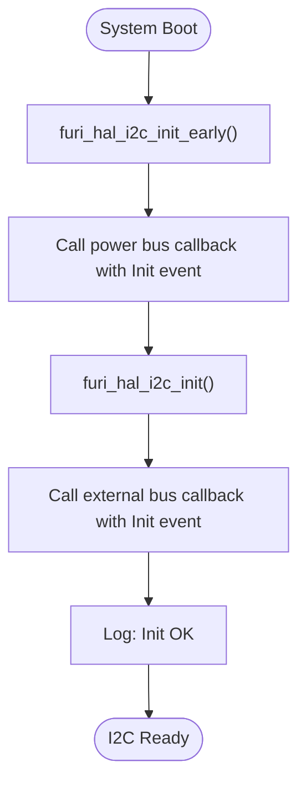
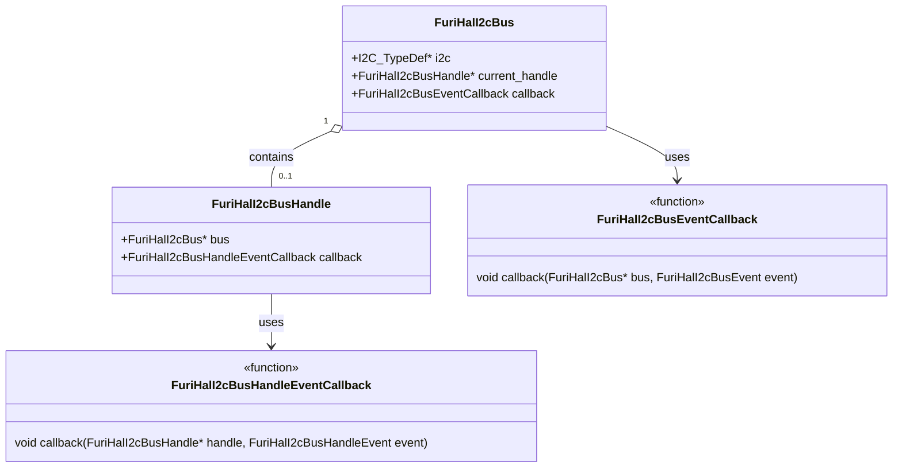
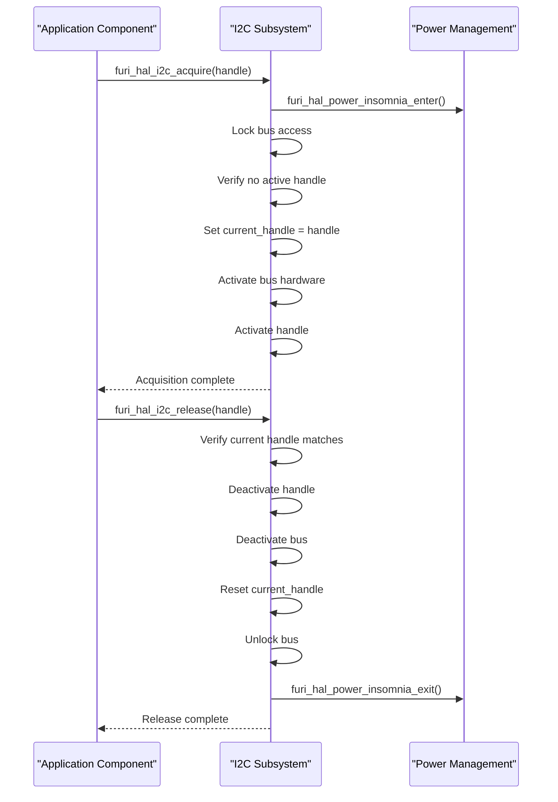
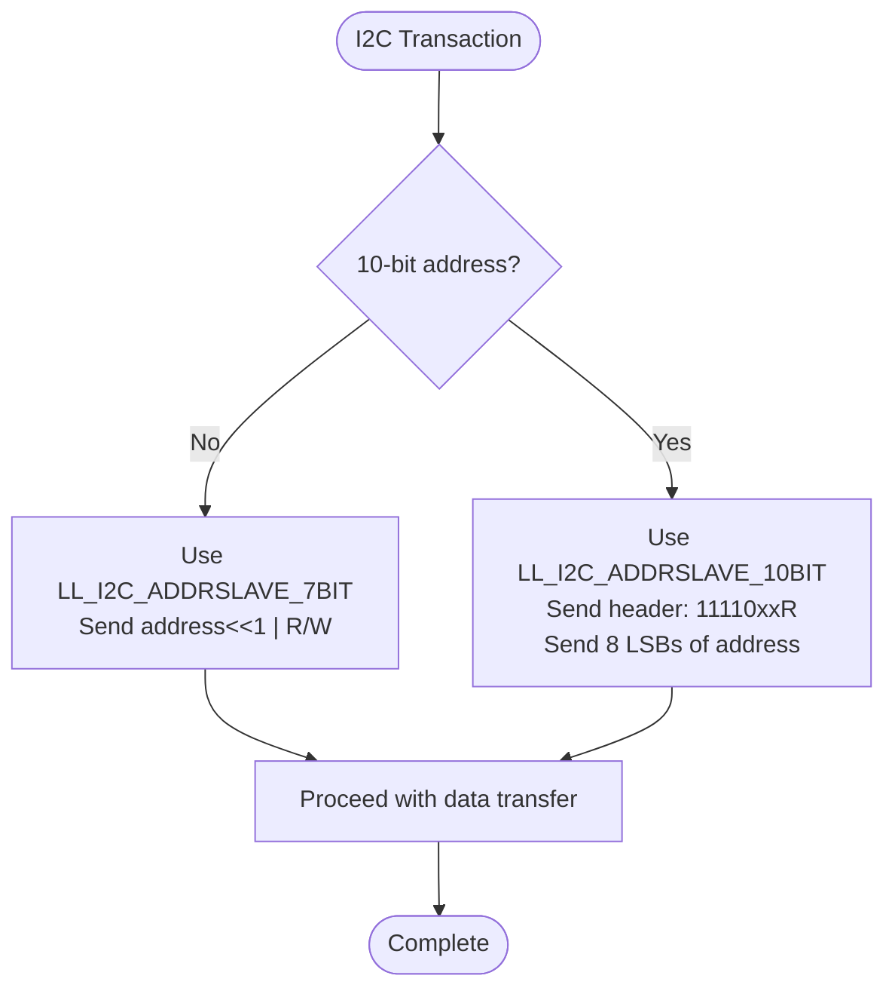
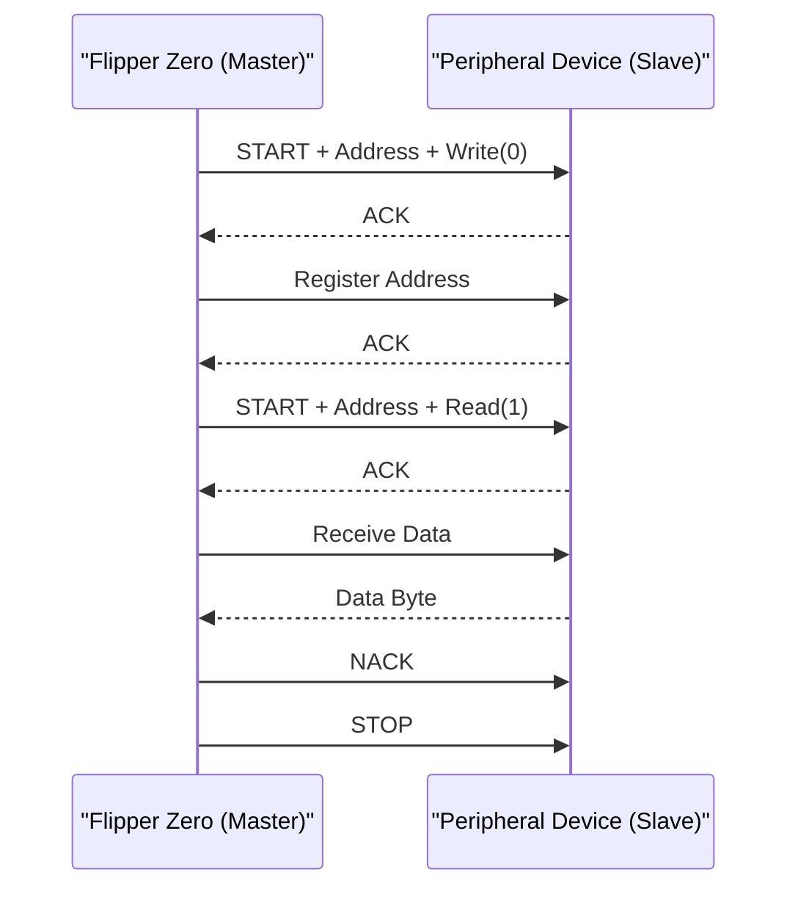
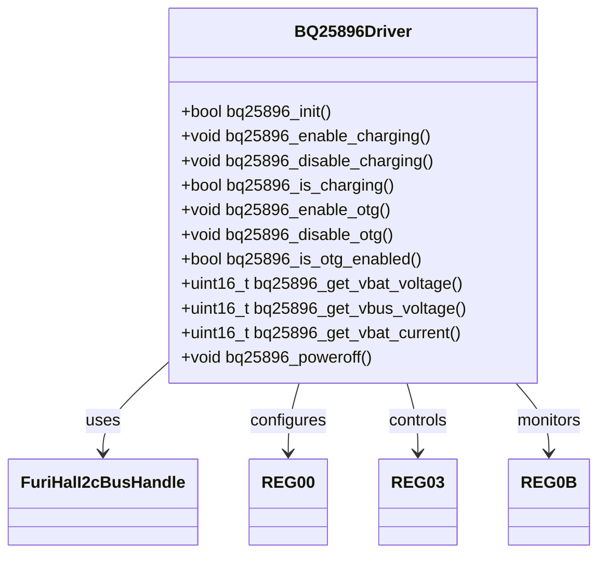
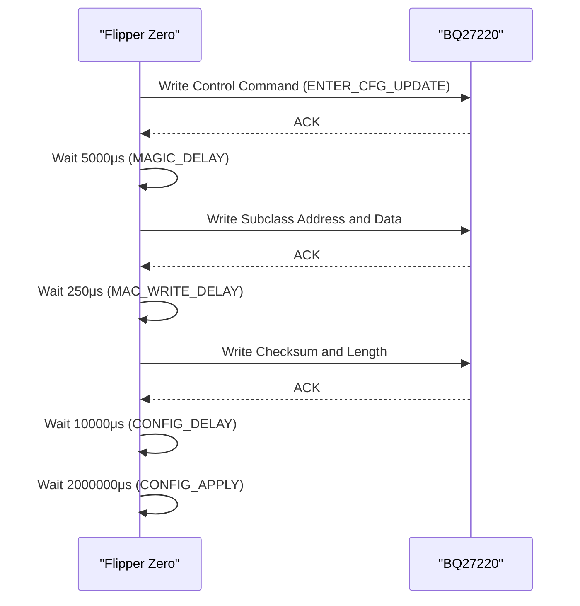

# I2C Interface

<cite>
**Referenced Files in This Document**   
- [furi_hal_i2c.h](file://targets/furi_hal_include/furi_hal_i2c.h)
- [furi_hal_i2c.c](file://targets/f7/furi_hal/furi_hal_i2c.c)
- [furi_hal_i2c_config.h](file://targets/f7/furi_hal/furi_hal_i2c_config.h)
- [furi_hal_i2c_types.h](file://targets/f7/furi_hal/furi_hal_i2c_types.h)
- [bq25896.c](file://lib/drivers/bq25896.c)
- [bq25896.h](file://lib/drivers/bq25896.h)
- [bq25896_reg.h](file://lib/drivers/bq25896_reg.h)
- [bq27220.c](file://lib/drivers/bq27220.c)
- [bq27220.h](file://lib/drivers/bq27220.h)
- [bq27220_reg.h](file://lib/drivers/bq27220_reg.h)
- [bq27220_data_memory.h](file://lib/drivers/bq27220_data_memory.h)
- [lp5562.c](file://lib/drivers/lp5562.c)
- [lp5562.h](file://lib/drivers/lp5562.h)
- [lp5562_reg.h](file://lib/drivers/lp5562_reg.h)
</cite>

## Table of Contents
1. [Introduction](#introduction)
2. [I2C Bus Initialization and Configuration](#i2c-bus-initialization-and-configuration)
3. [Addressing Modes](#addressing-modes)
4. [Master/Slave Operation](#masterslave-operation)
5. [Device-Specific Implementations](#device-specific-implementations)
6. [Advanced I2C Features](#advanced-i2c-features)
7. [Error Detection and Recovery](#error-detection-and-recovery)
8. [Hardware Considerations](#hardware-considerations)

## Introduction
The I2C (Inter-Integrated Circuit) interface is a fundamental communication protocol used in the Flipper Zero firmware to interact with various peripheral devices. This document provides comprehensive documentation for the I2C subsystem, covering initialization, addressing modes, clock configuration, master/slave operation, and specific implementations for key devices such as the BQ25896 power management IC, BQ27220 fuel gauge, and LP5562 LED driver. The documentation also addresses advanced topics including DMA transfers, error detection and recovery, bus recovery procedures, and hardware considerations for pull-up resistors and bus contention.

**Section sources**
- [furi_hal_i2c.h](file://targets/furi_hal_include/furi_hal_i2c.h#L0-L288)

## I2C Bus Initialization and Configuration

### Bus Initialization Process
The I2C subsystem in the Flipper Zero firmware follows a two-stage initialization process to ensure proper configuration and power management. The initialization begins with an early initialization phase that sets up the power state of the I2C buses, followed by a complete initialization that configures the hardware peripherals.

The initialization sequence is implemented through three primary functions:
- `furi_hal_i2c_init_early()`: Initializes the power state of I2C buses
- `furi_hal_i2c_deinit_early()`: Deinitializes I2C buses during shutdown
- `furi_hal_i2c_init()`: Completes the full initialization of I2C buses



**Diagram sources**
- [furi_hal_i2c.c](file://targets/f7/furi_hal/furi_hal_i2c.c#L10-L30)

**Section sources**
- [furi_hal_i2c.c](file://targets/f7/furi_hal/furi_hal_i2c.c#L10-L30)
- [furi_hal_i2c.h](file://targets/furi_hal_include/furi_hal_i2c.h#L45-L55)

### Bus Configuration Parameters
The I2C subsystem supports two distinct buses with different configurations optimized for their respective purposes:

1. **Internal (Power) I2C Bus (I2C1)**:
   - Purpose: Communication with power management components
   - Clock speed: 400 kHz
   - Pins: PA9 (SCL), PA10 (SDA)
   - Behavior: Under reset when not in use

2. **External I2C Bus (I2C3)**:
   - Purpose: Communication with external expansion modules
   - Clock speed: 100 kHz
   - Pins: PC0 (SCL), PC1 (SDA)
   - Behavior: Under reset when not in use

The configuration is defined in the `furi_hal_i2c_config.h` file, which exposes handles and bus structures for both internal and external I2C interfaces.



**Diagram sources**
- [furi_hal_i2c_types.h](file://targets/f7/furi_hal/furi_hal_i2c_types.h#L15-L52)
- [furi_hal_i2c_config.h](file://targets/f7/furi_hal/furi_hal_i2c_config.h#L10-L32)

**Section sources**
- [furi_hal_i2c_types.h](file://targets/f7/furi_hal/furi_hal_i2c_types.h#L15-L52)
- [furi_hal_i2c_config.h](file://targets/f7/furi_hal/furi_hal_i2c_config.h#L10-L32)

### Bus Acquisition and Release
The I2C subsystem implements a resource management system to prevent bus contention between different components. Before performing I2C operations, a component must acquire the bus handle using `furi_hal_i2c_acquire()`, and release it afterward using `furi_hal_i2c_release()`.

The acquisition process follows these steps:
1. Enter power insomnia mode to prevent system sleep
2. Lock bus access to prevent other components from acquiring it
3. Verify no other handle is currently active
4. Set the current handle pointer
5. Activate the bus hardware
6. Activate the handle-specific configuration



**Diagram sources**
- [furi_hal_i2c.c](file://targets/f7/furi_hal/furi_hal_i2c.c#L32-L55)

**Section sources**
- [furi_hal_i2c.c](file://targets/f7/furi_hal/furi_hal_i2c.c#L32-L55)

## Addressing Modes

### 7-bit and 10-bit Addressing
The I2C subsystem supports both 7-bit and 10-bit addressing modes through the extended I2C functions. The addressing mode is specified in the `furi_hal_i2c_tx_ext()` and `furi_hal_i2c_rx_ext()` functions using the `ten_bit` parameter.

For 7-bit addressing:
- The 7-bit slave address is left-shifted by 1 bit
- The least significant bit is used for read/write indication
- Example: Address 0x55 becomes 0xAA for write, 0xAB for read

For 10-bit addressing:
- The first byte contains the header: 11110xxR (where xx are the two most significant bits of the address, R is read/write)
- The second byte contains the remaining 8 bits of the address
- Followed by the data bytes

The implementation uses the STM32WB's hardware support for 10-bit addressing through the `LL_I2C_ADDRSLAVE_10BIT` and `LL_I2C_ADDRSLAVE_7BIT` constants.



**Section sources**
- [furi_hal_i2c.c](file://targets/f7/furi_hal/furi_hal_i2c.c#L150-L180)

### Device Address Constants
The device drivers define their I2C addresses as constants in their respective header files:

- **BQ25896**: `#define BQ25896_ADDRESS 0xD6` (7-bit address 0x6B)
- **BQ27220**: `#define BQ27220_ADDRESS 0x55` (7-bit address 0x2A)
- **LP5562**: `#define LP5562_ADDRESS 0x30` (7-bit address 0x18)

These addresses are used in all I2C communication functions to specify the target slave device.

**Section sources**
- [bq25896_reg.h](file://lib/drivers/bq25896_reg.h#L10-L11)
- [bq27220.h](file://lib/drivers/bq27220.h#L15-L16)
- [lp5562.h](file://lib/drivers/lp5562.h#L15-L16)

## Master/Slave Operation

### Master Mode Implementation
The Flipper Zero firmware operates exclusively in I2C master mode, controlling communication with slave devices. The master mode implementation provides several transaction types:

1. **Standard Write (TX)**: `furi_hal_i2c_tx()` - Sends data to a slave device
2. **Standard Read (RX)**: `furi_hal_i2c_rx()` - Reads data from a slave device
3. **Combined Read-Write (TRX)**: `furi_hal_i2c_trx()` - Writes register address, then reads data
4. **Extended Operations**: `furi_hal_i2c_tx_ext()` and `furi_hal_i2c_rx_ext()` - Support advanced transaction control

The transaction control is managed through the `FuriHalI2cBegin` and `FuriHalI2cEnd` enumerations, which allow for:
- `FuriHalI2cBeginStart`: Begin with START condition
- `FuriHalI2cBeginRestart`: Begin with RESTART condition
- `FuriHalI2cBeginResume`: Resume a paused transaction
- `FuriHalI2cEndStop`: End with STOP condition
- `FuriHalI2cEndAwaitRestart`: End with clock stretching, await restart
- `FuriHalI2cEndPause`: Pause with clock stretching



**Diagram sources**
- [furi_hal_i2c.h](file://targets/furi_hal_include/furi_hal_i2c.h#L60-L85)

**Section sources**
- [furi_hal_i2c.h](file://targets/furi_hal_include/furi_hal_i2c.h#L60-L85)

### Multi-Master Arbitration
Although the current implementation does not support multi-master operation, the hardware layer is designed with arbitration capabilities. The STM32WB I2C peripheral automatically handles arbitration through hardware mechanisms:

- **Arbitration**: When multiple masters start transmission simultaneously, the master that transmits a logic 1 while detecting a logic 0 on the bus loses arbitration
- **Clock Synchronization**: Masters synchronize their clocks to the slowest clock on the bus
- **Bus Control**: The winning master continues transmission, while the losing master stops and waits for a STOP condition

The firmware does not implement multi-master recovery, as the Flipper Zero operates as the sole master on its I2C buses.

### Clock Stretching
Clock stretching is supported through the `FuriHalI2cEndAwaitRestart` and `FuriHalI2cEndPause` end conditions. When a transaction ends with clock stretching, the SCL line is held low, preventing other devices from initiating communication.

The implementation uses the STM32WB's hardware support for clock stretching:
- `LL_I2C_MODE_SOFTEND`: Software end mode (clock stretching)
- `LL_I2C_MODE_RELOAD`: Reload mode (pause with clock stretching)
- `LL_I2C_MODE_AUTOEND`: Automatic end mode (STOP condition)

**Section sources**
- [furi_hal_i2c.h](file://targets/furi_hal_include/furi_hal_i2c.h#L25-L40)
- [furi_hal_i2c.c](file://targets/f7/furi_hal/furi_hal_i2c.c#L120-L140)

## Device-Specific Implementations

### BQ25896 Power Management IC
The BQ25896 driver provides comprehensive control over the power management functions, including charging, battery protection, and OTG (On-The-Go) functionality.

#### Initialization and Configuration
The initialization process resets the device and configures key parameters:

```c
bool bq25896_init(FuriHalI2cBusHandle* handle) {
    bool result = true;
    
    // Reset the device
    bq25896_regs.r14.REG_RST = 1;
    result &= furi_hal_i2c_write_reg_8(
        handle, BQ25896_ADDRESS, 0x14, *(uint8_t*)&bq25896_regs.r14, BQ25896_I2C_TIMEOUT);
    
    // Configure ADC for continuous conversion
    bq25896_regs.r02.CONV_START = 1;
    bq25896_regs.r02.CONV_RATE = 1;
    result &= furi_hal_i2c_write_reg_8(
        handle, BQ25896_ADDRESS, 0x02, *(uint8_t*)&bq25896_regs.r02, BQ25896_I2C_TIMEOUT);
    
    // Disable watchdog
    bq25896_regs.r07.WATCHDOG = WatchdogDisable;
    result &= furi_hal_i2c_write_reg_8(
        handle, BQ25896_ADDRESS, 0x07, *(uint8_t*)&bq25896_regs.r07, BQ25896_I2C_TIMEOUT);
    
    // Configure OTG power
    bq25896_regs.r0A.BOOSTV = 0x8; // 5.062V
    bq25896_regs.r0A.BOOST_LIM = BoostLim_1400; // 1.4A
    result &= furi_hal_i2c_write_reg_8(
        handle, BQ25896_ADDRESS, 0x0A, *(uint8_t*)&bq25896_regs.r0A, BQ25896_I2C_TIMEOUT);
    
    return result;
}
```

**Section sources**
- [bq25896.c](file://lib/drivers/bq25896.c#L20-L60)

#### Key Functionality
The driver provides functions for essential power management operations:

- **Charging Control**: `bq25896_enable_charging()`, `bq25896_disable_charging()`
- **OTG Control**: `bq25896_enable_otg()`, `bq25896_disable_otg()`
- **Voltage Monitoring**: `bq25896_get_vbat_voltage()`, `bq25896_get_vbus_voltage()`
- **Current Monitoring**: `bq25896_get_vbat_current()`
- **Power Off**: `bq25896_poweroff()` - Enables shipping mode

The charging status is determined by reading the CHRG_STAT bits in register 0x0B, with values indicating no charging, pre-charge, fast charge, or charge completion.



**Diagram sources**
- [bq25896.c](file://lib/drivers/bq25896.c#L20-L150)
- [bq25896_reg.h](file://lib/drivers/bq25896_reg.h#L10-L276)

**Section sources**
- [bq25896.c](file://lib/drivers/bq25896.c#L20-L150)
- [bq25896.h](file://lib/drivers/bq25896.h#L10-L68)

### BQ27220 Fuel Gauge
The BQ27220 driver implements communication with the fuel gauge IC, providing battery capacity, voltage, current, and temperature monitoring.

#### Initialization and Authentication
The BQ27220 requires a specific initialization sequence, including authentication to access configuration registers:

```c
static bool bq27220_data_memory_check(
    FuriHalI2cBusHandle* handle,
    const BQ27220DMData* data_memory,
    bool update) {
    
    if(update) {
        const uint16_t cfg_request = Control_ENTER_CFG_UPDATE;
        if(!bq27220_write(
               handle, CommandSelectSubclass, (uint8_t*)&cfg_request, sizeof(cfg_request))) {
            return false;
        };
        
        // Wait for CFGUPDATE mode
        uint32_t timeout = BQ27220_TIMEOUT(BQ27220_TIMEOUT_COMMON_US);
        Bq27220OperationStatus operation_status;
        while(--timeout > 0) {
            if(bq27220_get_operation_status(handle, &operation_status)) {
                if(operation_status.CFGUPDATE) {
                    break;
                }
            }
            furi_delay_us(BQ27220_TIMEOUT_CYCLE_INTERVAL_US);
        }
        
        if(timeout == 0) {
            return false;
        }
    }
    
    // Process data memory records
    // ...
}
```

**Section sources**
- [bq27220.c](file://lib/drivers/bq27220.c#L150-L200)

#### Data Memory Operations
The driver implements a complex protocol for reading and writing data memory, which requires specific timing delays:

- **MAC_WRITE_DELAY_US**: 250μs between writes to Subclass/MAC area
- **SELECT_DELAY_US**: 1000μs between requesting data load and reading
- **MAGIC_DELAY_US**: 5000μs between control operations
- **CONFIG_DELAY_US**: 10000μs after configuration changes
- **CONFIG_APPLY_US**: 2000000μs for configuration to take effect

The data memory operations use a checksum verification mechanism:
```
checksum = 0xFF - (sum of address and data bytes)
```



**Diagram sources**
- [bq27220.c](file://lib/drivers/bq27220.c#L50-L100)

**Section sources**
- [bq27220.c](file://lib/drivers/bq27220.c#L50-L250)

### LP5562 LED Driver
The LP5562 driver controls the RGB LED through I2C communication, supporting both direct control and programmable engine modes.

#### Initialization Sequence
The initialization follows a specific sequence with required delays:

```c
void lp5562_configure(FuriHalI2cBusHandle* handle) {
    // Configure operation mode
    Reg08_Config config = {.INT_CLK_EN = true, .PS_EN = true, .PWM_HF = true};
    furi_hal_i2c_write_reg_8(handle, LP5562_ADDRESS, 0x08, *(uint8_t*)&config, LP5562_I2C_TIMEOUT);
    
    // Configure LED mapping
    Reg70_LedMap map = {
        .red = EngSelectI2C,
        .green = EngSelectI2C,
        .blue = EngSelectI2C,
        .white = EngSelectI2C,
    };
    furi_hal_i2c_write_reg_8(handle, LP5562_ADDRESS, 0x70, *(uint8_t*)&map, LP5562_I2C_TIMEOUT);
}

void lp5562_enable(FuriHalI2cBusHandle* handle) {
    // Enable chip
    Reg00_Enable reg = {.CHIP_EN = true, .LOG_EN = true};
    furi_hal_i2c_write_reg_8(handle, LP5562_ADDRESS, 0x00, *(uint8_t*)&reg, LP5562_I2C_TIMEOUT);
    
    // Required delay after enabling
    furi_delay_us(500); // >488μs required
}
```

**Section sources**
- [lp5562.c](file://lib/drivers/lp5562.c#L10-L30)

#### Programmable Engine Operation
The LP5562 supports three independent program engines that can execute sequences of LED commands. The engine execution involves:

1. Loading the program into memory (registers 0x10-0x1F, 0x30-0x3F, 0x50-0x5F)
2. Configuring the engine to "load" mode
3. Starting the engine in "run" mode
4. Routing the output to the desired LED channels

```c
void lp5562_execute_program(
    FuriHalI2cBusHandle* handle,
    LP5562Engine eng,
    LP5562Channel ch,
    uint16_t* program) {
    
    // Configure engine to load mode
    furi_hal_i2c_read_reg_8(handle, LP5562_ADDRESS, 0x01, &reg_val, LP5562_I2C_TIMEOUT);
    reg_val &= ~(0x3 << bit_offset);
    reg_val |= (0x01 << bit_offset); // load
    furi_hal_i2c_write_reg_8(handle, LP5562_ADDRESS, 0x01, reg_val, LP5562_I2C_TIMEOUT);
    furi_delay_us(100);
    
    // Load program (convert to big-endian)
    for(uint8_t i = 0; i < 16; i++) {
        program[i] = __REV16(program[i]);
    }
    furi_hal_i2c_write_mem(
        handle,
        LP5562_ADDRESS,
        0x10 + (0x20 * (eng - 1)),
        (uint8_t*)program,
        16 * 2,
        LP5562_I2C_TIMEOUT);
    
    // Start engine
    reg_val &= ~(0x3 << bit_offset);
    reg_val |= (0x02 << bit_offset); // run
    furi_hal_i2c_write_reg_8(handle, LP5562_ADDRESS, 0x01, reg_val, LP5562_I2C_TIMEOUT);
    
    // Route output to channel
    lp5562_set_channel_src(handle, ch, eng);
}
```

**Section sources**
- [lp5562.c](file://lib/drivers/lp5562.c#L100-L150)

## Advanced I2C Features

### DMA Transfers
The I2C implementation leverages the STM32WB's hardware DMA capabilities for efficient data transfer. The low-level implementation uses the `LL_I2C_HandleTransfer()` function, which configures the I2C peripheral and DMA channels for automatic data transfer without CPU intervention.

The DMA transfer process:
1. Configure DMA channel with source/destination addresses
2. Set transfer size and direction
3. Enable DMA request from I2C peripheral
4. Start I2C transaction
5. DMA automatically transfers data between memory and I2C data register
6. Generate interrupt on completion

This reduces CPU overhead and enables high-speed data transfers, particularly important for the 400kHz internal I2C bus.

**Section sources**
- [furi_hal_i2c.c](file://targets/f7/furi_hal/furi_hal_i2c.c#L150-L200)

### Transaction Chaining
The I2C subsystem supports transaction chaining through the `FuriHalI2cBeginRestart` and `FuriHalI2cEndAwaitRestart` mechanisms. This allows multiple read/write operations to be performed without releasing the bus, which is essential for register-based devices that require write-then-read sequences.

Example of a combined transaction:
```c
// Write register address, then read data
bool furi_hal_i2c_trx(
    FuriHalI2cBusHandle* handle,
    uint8_t address,
    const uint8_t* tx_data,
    size_t tx_size,
    uint8_t* rx_data,
    size_t rx_size,
    uint32_t timeout) {
    
    // Write phase
    if(!furi_hal_i2c_tx_ext(
           handle, address, false, tx_data, tx_size,
           FuriHalI2cBeginStart, FuriHalI2cEndAwaitRestart, timeout)) {
        return false;
    }
    
    // Read phase (uses RESTART)
    return furi_hal_i2c_rx_ext(
        handle, address, false, rx_data, rx_size,
        FuriHalI2cBeginRestart, FuriHalI2cEndStop, timeout);
}
```

**Section sources**
- [furi_hal_i2c.c](file://targets/f7/furi_hal/furi_hal_i2c.c#L100-L150)

## Error Detection and Recovery

### Timeout Mechanisms
The I2C implementation includes comprehensive timeout mechanisms to prevent system hangs during communication failures. All I2C operations include a timeout parameter (in milliseconds) that limits the maximum duration of the operation.

The timeout is implemented using the `FuriHalCortexTimer`:
```c
static bool furi_hal_i2c_wait_for_idle(I2C_TypeDef* i2c, FuriHalI2cBegin begin, FuriHalCortexTimer timer) {
    do {
        if(furi_hal_cortex_timer_is_expired(timer)) {
            return false;
        }
    } while(begin == FuriHalI2cBeginStart && LL_I2C_IsActiveFlag_BUSY(i2c));
    return true;
}
```

Each byte transfer is also monitored for timeout:
```c
static bool furi_hal_i2c_transfer(
    I2C_TypeDef* i2c,
    uint8_t* data,
    uint32_t size,
    FuriHalI2cEnd end,
    bool read,
    FuriHalCortexTimer timer) {
    
    while(size > 0) {
        bool should_stop = furi_hal_cortex_timer_is_expired(timer) ||
                           furi_hal_i2c_transfer_is_aborted(i2c);
        
        if(read && LL_I2C_IsActiveFlag_RXNE(i2c)) {
            *data = LL_I2C_ReceiveData8(i2c);
            data++;
            size--;
        } else if(!read && LL_I2C_IsActiveFlag_TXIS(i2c)) {
            LL_I2C_TransmitData8(i2c, *data);
            data++;
            size--;
        }
        
        if(should_stop) {
            return size == 0; // Success only if all data transferred
        }
    }
    // ...
}
```

**Section sources**
- [furi_hal_i2c.c](file://targets/f7/furi_hal/furi_hal_i2c.c#L80-L150)

### Bus Recovery Procedures
The I2C subsystem includes mechanisms for bus recovery in case of lock-up conditions. The primary recovery method is through bus deinitialization and reinitialization:

1. **Bus Reset**: The `furi_hal_i2c_deinit_early()` function places the I2C peripheral in reset state
2. **GPIO Reconfiguration**: The SCL and SDA pins are reconfigured as GPIOs to manually control the bus
3. **Clock Pulse Generation**: If SDA is stuck low, clock pulses are generated on SCL until SDA is released
4. **Reinitialization**: The bus is reinitialized with `furi_hal_i2c_init_early()`

The hardware abstraction layer also includes a device readiness check:
```c
bool furi_hal_i2c_is_device_ready(FuriHalI2cBusHandle* handle, uint8_t i2c_addr, uint32_t timeout) {
    // Attempt to communicate with device
    return furi_hal_i2c_tx(handle, i2c_addr, NULL, 0, timeout);
}
```

This function sends a START condition followed by the address and STOP, without sending any data. If the device acknowledges the address, it is considered ready.

**Section sources**
- [furi_hal_i2c.c](file://targets/f7/furi_hal/furi_hal_i2c.c#L60-L80)
- [furi_hal_i2c.h](file://targets/furi_hal_include/furi_hal_i2c.h#L145-L155)

## Hardware Considerations

### Pull-Up Resistor Selection
Proper pull-up resistor selection is critical for reliable I2C operation. The Flipper Zero design includes pull-up resistors on both I2C buses:

- **Internal Bus**: 4.7kΩ pull-ups for 400kHz operation
- **External Bus**: 10kΩ pull-ups for 100kHz operation with expansion modules

The pull-up resistor value is determined by:
- Bus capacitance (typically 10-400pF)
- Desired rise time
- Supply voltage (3.3V)
- Number of devices on the bus

The general formula for pull-up calculation:
```
Rp(min) = (Vcc - V OL) / I OL
Rp(max) = tr / (0.8473 * Cbus)
```

Where:
- Vcc = 3.3V
- VOL = 0.4V (maximum low-level output voltage)
- IOL = 3mA (maximum sink current)
- tr = 1000ns (maximum rise time for 400kHz)
- Cbus = total bus capacitance

### Bus Contention Handling
The I2C implementation includes several mechanisms to prevent and handle bus contention:

1. **Bus Acquisition**: The `furi_hal_i2c_acquire()` function ensures exclusive access to the bus
2. **Power Management**: The `furi_hal_power_insomnia_enter()` prevents system sleep during I2C operations
3. **Hardware Reset**: Buses are placed in reset state when not in use to prevent unintended communication
4. **Timeout Protection**: All operations have timeout limits to prevent indefinite blocking

For external expansion modules, the system must account for potential conflicts with other I2C masters. The current implementation assumes the Flipper Zero is the sole master on the external bus, but future designs may need to implement multi-master arbitration.

**Section sources**
- [furi_hal_i2c.c](file://targets/f7/furi_hal/furi_hal_i2c.c#L32-L55)
- [furi_hal_i2c_config.h](file://targets/f7/furi_hal/furi_hal_i2c_config.h#L10-L32)