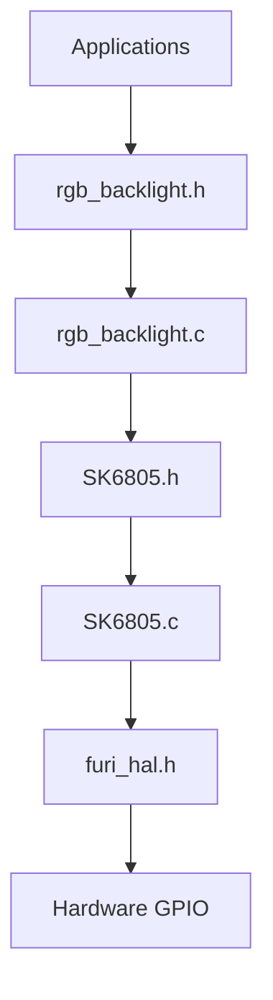
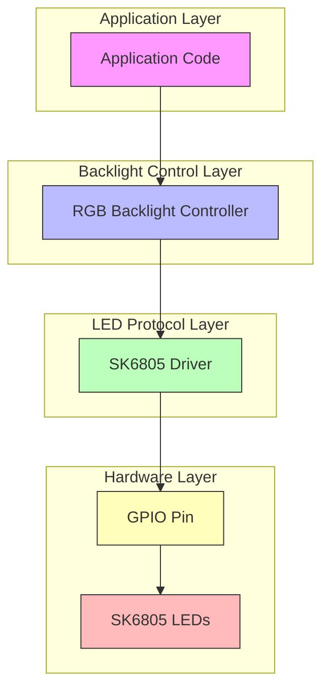
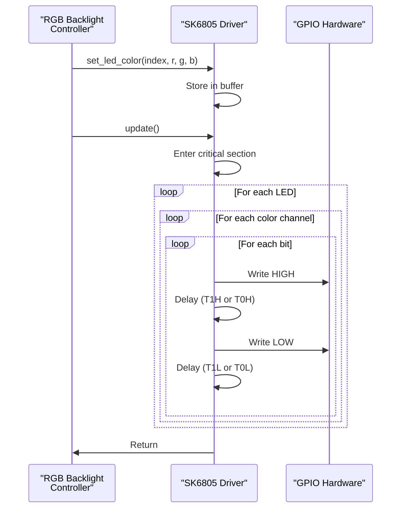
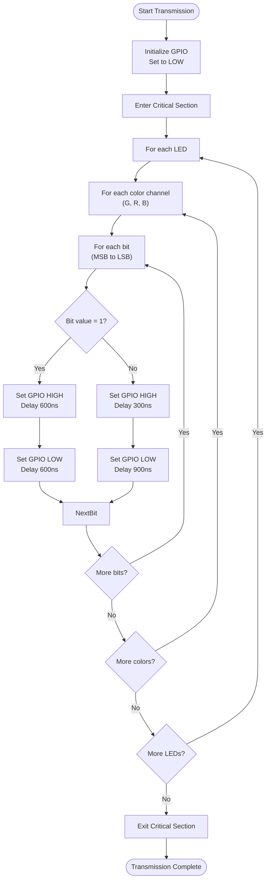
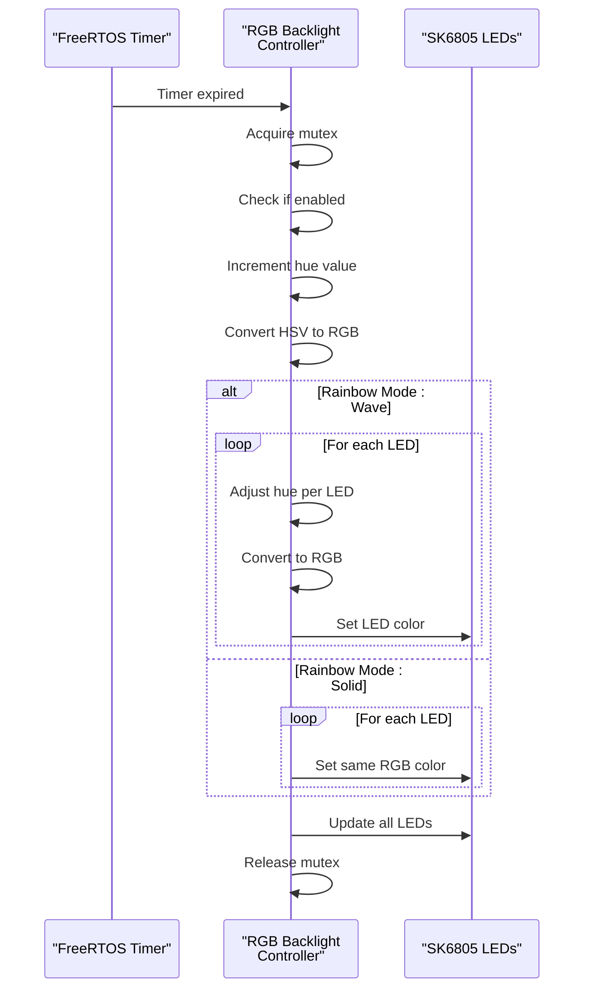

# PWM Interface

<cite>
**Referenced Files in This Document**   
- [rgb_backlight.c](file://lib/drivers/rgb_backlight.c)
- [rgb_backlight.h](file://lib/drivers/rgb_backlight.h)
- [SK6805.c](file://lib/drivers/SK6805.c)
- [SK6805.h](file://lib/drivers/SK6805.h)
</cite>

## Table of Contents
1. [Introduction](#introduction)
2. [Project Structure](#project-structure)
3. [Core Components](#core-components)
4. [Architecture Overview](#architecture-overview)
5. [Detailed Component Analysis](#detailed-component-analysis)
6. [PWM Implementation via Bit-Banging](#pwm-implementation-via-bit-banging)
7. [RGB Backlight Control](#rgb-backlight-control)
8. [Timer-Based Synchronization](#timer-based-synchronization)
9. [Advanced Features](#advanced-features)
10. [Usage Examples](#usage-examples)
11. [Performance and Limitations](#performance-and-limitations)
12. [Conclusion](#conclusion)

## Introduction
This document provides a comprehensive analysis of the Pulse Width Modulation (PWM) interface implementation in the Flipper Zero firmware, focusing on RGB backlight control. Although no dedicated PWM hardware module is directly exposed in the codebase, PWM-like behavior is achieved through precise GPIO timing control, commonly known as bit-banging. The primary application of this technique is in driving SK6805 addressable RGB LEDs used for backlighting. This documentation details the architecture, implementation, and usage patterns of this soft-PWM system.

## Project Structure
The PWM-related functionality is located within the `lib/drivers` directory of the firmware repository. The key components are organized as follows:
- `SK6805.c` and `SK6805.h`: Low-level driver for the SK6805 LED protocol
- `rgb_backlight.c` and `rgb_backlight.h`: High-level RGB backlight control abstraction
These files are part of the hardware abstraction layer and are designed to be used by applications requiring RGB lighting control.



**Diagram sources**
- [rgb_backlight.h](file://lib/drivers/rgb_backlight.h)
- [SK6805.h](file://lib/drivers/SK6805.h)

**Section sources**
- [rgb_backlight.c](file://lib/drivers/rgb_backlight.c)
- [SK6805.c](file://lib/drivers/SK6805.c)

## Core Components
The PWM subsystem consists of two primary components:
1. **SK6805 Driver**: Implements the timing-critical protocol for communicating with SK6805 LEDs
2. **RGB Backlight Controller**: Provides a user-friendly interface for controlling RGB backlight settings

These components work together to simulate PWM behavior through precise timing of GPIO signals, enabling control over LED brightness and color.

**Section sources**
- [rgb_backlight.c](file://lib/drivers/rgb_backlight.c#L1-L50)
- [SK6805.c](file://lib/drivers/SK6805.c#L1-L30)

## Architecture Overview
The architecture follows a layered approach where high-level applications interact with the RGB backlight controller, which in turn manages the low-level SK6805 protocol implementation. The SK6805 protocol uses a single-wire interface with strict timing requirements to control individual LEDs.



**Diagram sources**
- [rgb_backlight.c](file://lib/drivers/rgb_backlight.c#L1-L20)
- [SK6805.c](file://lib/drivers/SK6805.c#L1-L15)

## Detailed Component Analysis

### SK6805 Protocol Implementation
The SK6805 driver implements a bit-banged protocol that simulates PWM through precise timing of high and low signal states. Each bit of data is transmitted using a specific timing pattern that effectively creates a duty cycle.



**Diagram sources**
- [SK6805.c](file://lib/drivers/SK6805.c#L50-L100)

**Section sources**
- [SK6805.c](file://lib/drivers/SK6805.c#L1-L105)

## PWM Implementation via Bit-Banging
The SK6805 protocol uses a form of PWM implemented through bit-banging on a GPIO pin. Unlike traditional PWM hardware modules, this implementation generates the required timing sequences in software using precise cycle counting.

### Timing Specifications
The protocol defines two distinct timing patterns for transmitting binary 1 and binary 0:

| Bit Value | T1H (High Time) | T1L (Low Time) | T0H (High Time) | T0L (Low Time) |
|-----------|-----------------|----------------|-----------------|----------------|
| 1 | 600 ns (615 ns actual) | 600 ns (587 ns actual) | - | - |
| 0 | - | - | 300 ns (312 ns actual) | 900 ns (890 ns actual) |

These timing values are implemented using the DWT (Data Watchpoint and Trace) cycle counter to achieve nanosecond-level precision:
```c
// For bit value 1
furi_hal_gpio_write(SK6805_LED_PIN, true);
end = DWT->CYCCNT + 30;  // ~600ns
while(DWT->CYCCNT < end);
furi_hal_gpio_write(SK6805_LED_PIN, false);
end = DWT->CYCCNT + 26;  // ~600ns
while(DWT->CYCCNT < end);

// For bit value 0
furi_hal_gpio_write(SK6805_LED_PIN, true);
end = DWT->CYCCNT + 11;  // ~300ns
while(DWT->CYCCNT < end);
furi_hal_gpio_write(SK6805_LED_PIN, false);
end = DWT->CYCCNT + 43;  // ~900ns
while(DWT->CYCCNT < end);
```

The effective frequency of this PWM-like signal varies depending on the bit value:
- For bit 1: ~833 kHz (1.2 μs period)
- For bit 0: ~833 kHz (1.2 μs period)

Although the period is consistent, the duty cycle varies:
- For bit 1: 50% duty cycle (600ns high, 600ns low)
- For bit 0: 25% duty cycle (300ns high, 900ns low)

This timing-based encoding allows the SK6805 LEDs to interpret the data stream correctly and maintain the desired brightness levels.



**Diagram sources**
- [SK6805.c](file://lib/drivers/SK6805.c#L70-L100)

**Section sources**
- [SK6805.c](file://lib/drivers/SK6805.c#L50-L105)

## RGB Backlight Control
The RGB backlight controller provides a higher-level interface for managing the RGB LEDs, abstracting away the low-level timing details of the SK6805 protocol.

### Configuration Structure
The system maintains two primary data structures:

**Settings Structure**: Persistent configuration stored in non-volatile memory
```c
static struct {
    RgbColor colors[SK6805_LED_COUNT];
    RGBBacklightRainbowMode rainbow_mode;
    uint8_t rainbow_speed;
    uint32_t rainbow_interval;
    uint32_t rainbow_saturation;
} rgb_settings;
```

**Runtime State Structure**: Volatile state maintained during operation
```c
static struct {
    bool settings_loaded;
    FuriMutex* mutex;
    bool enabled;
    uint8_t last_brightness;
    FuriTimer* rainbow_timer;
    HsvColor rainbow_hsv;
} rgb_state;
```

### Control Functions
The API provides several functions for controlling the backlight:

**Section sources**
- [rgb_backlight.c](file://lib/drivers/rgb_backlight.c#L50-L100)
- [rgb_backlight.h](file://lib/drivers/rgb_backlight.h#L20-L50)

## Timer-Based Synchronization
The system uses FreeRTOS timers to synchronize periodic operations, particularly for rainbow effects. The timer-based synchronization ensures that visual effects are updated at consistent intervals.

### Rainbow Effect Timer
When rainbow mode is enabled, a periodic timer is created to update the LED colors:

```c
void rgb_backlight_reconfigure(bool enabled) {
    // ... other code ...
    if(rgb_state.enabled && rgb_settings.rainbow_mode != RGBBacklightRainbowModeOff) {
        if(rgb_state.rainbow_timer == NULL) {
            rgb_state.rainbow_timer = furi_timer_alloc(rainbow_timer, FuriTimerTypePeriodic, NULL);
        } else {
            furi_timer_stop(rgb_state.rainbow_timer);
        }
        furi_timer_start(rgb_state.rainbow_timer, rgb_settings.rainbow_interval);
    }
    // ... other code ...
}
```

The timer callback function `rainbow_timer` is responsible for updating the color values:



**Diagram sources**
- [rgb_backlight.c](file://lib/drivers/rgb_backlight.c#L200-L250)

**Section sources**
- [rgb_backlight.c](file://lib/drivers/rgb_backlight.c#L150-L300)

## Advanced Features
The RGB backlight system implements several advanced features beyond basic PWM control.

### Rainbow Modes
The system supports multiple rainbow effect modes:

**Rainbow Mode Types**
```c
typedef enum {
    RGBBacklightRainbowModeOff,
    RGBBacklightRainbowModeWave,
    RGBBacklightRainbowModeSolid,
    RGBBacklightRainbowModeCount,
} RGBBacklightRainbowMode;
```

- **Off**: Static color mode, no automatic changes
- **Wave**: Wave-like rainbow effect where colors shift across the LEDs
- **Solid**: Solid rainbow color that changes over time

### Configuration Persistence
The system saves and loads settings from non-volatile storage:

```c
void rgb_backlight_load_settings(bool enabled) {
    saved_struct_load(
        RGB_BACKLIGHT_SETTINGS_PATH,
        &rgb_settings,
        sizeof(rgb_settings),
        RGB_BACKLIGHT_SETTINGS_MAGIC,
        RGB_BACKLIGHT_SETTINGS_VERSION);
}

void rgb_backlight_save_settings(void) {
    saved_struct_save(
        RGB_BACKLIGHT_SETTINGS_PATH,
        &rgb_settings,
        sizeof(rgb_settings),
        RGB_BACKLIGHT_SETTINGS_MAGIC,
        RGB_BACKLIGHT_SETTINGS_VERSION);
}
```

### Thread Safety
The implementation uses mutexes to ensure thread safety:

```c
furi_check(furi_mutex_acquire(rgb_state.mutex, FuriWaitForever) == FuriStatusOk);
// Critical section operations
furi_check(furi_mutex_release(rgb_state.mutex) == FuriStatusOk);
```

**Section sources**
- [rgb_backlight.c](file://lib/drivers/rgb_backlight.c#L100-L150)

## Usage Examples
The following examples demonstrate how to use the RGB backlight interface.

### Basic Color Control
```c
// Set first LED to red
RgbColor red = {255, 0, 0};
rgb_backlight_set_color(0, &red);

// Update with 50% brightness
rgb_backlight_update(128, false);
```

### Rainbow Effect Control
```c
// Enable wave rainbow effect
rgb_backlight_set_rainbow_mode(RGBBacklightRainbowModeWave);

// Set rainbow speed to medium
rgb_backlight_set_rainbow_speed(10);

// Set update interval to 200ms
rgb_backlight_set_rainbow_interval(200);

// Reconfigure to apply changes
rgb_backlight_reconfigure(true);
```

### Complete Initialization
```c
// Initialize at boot
rgb_backlight_load_settings(true);

// Set custom colors
RgbColor blue = {0, 0, 255};
RgbColor green = {0, 255, 0};
RgbColor purple = {128, 0, 128};

rgb_backlight_set_color(0, &blue);
rgb_backlight_set_color(1, &green);
rgb_backlight_set_color(2, &purple);

// Apply with full brightness
rgb_backlight_update(255, true);
```

**Section sources**
- [rgb_backlight.c](file://lib/drivers/rgb_backlight.c#L300-L318)
- [rgb_backlight.h](file://lib/drivers/rgb_backlight.h#L60-L100)

## Performance and Limitations
The bit-banged PWM implementation has several performance characteristics and limitations.

### Timing Constraints
The SK6805 protocol requires extremely precise timing, which necessitates:
- Execution in a critical section to prevent interruptions
- Use of cycle-accurate delays via the DWT cycle counter
- High CPU frequency to achieve the required timing resolution

### CPU Usage
During LED updates, the CPU is fully occupied with timing-critical operations:
- No other code can execute during the critical section
- Interrupts are disabled during the update sequence
- The duration of the update is proportional to the number of LEDs and bits

### Resolution Limitations
The effective brightness resolution is limited by:
- The 8-bit color depth (0-255) for each channel
- The fixed timing ratios of the SK6805 protocol
- The system clock frequency and timing precision

### Frequency Constraints
The effective update frequency depends on:
- Number of LEDs in the chain
- Number of color channels (3 per LED)
- Number of bits per channel (8)
- Timing requirements per bit

For a 3-LED system:
- Total bits: 3 LEDs × 3 channels × 8 bits = 72 bits
- Time per bit: ~1.2 μs
- Total update time: ~86.4 μs
- Maximum update frequency: ~11.6 kHz

**Section sources**
- [SK6805.c](file://lib/drivers/SK6805.c#L70-L100)

## Conclusion
The PWM interface in the Flipper Zero firmware is implemented through a sophisticated bit-banging approach using the SK6805 protocol. While not a traditional hardware PWM implementation, this software-based approach provides precise control over RGB LEDs for backlighting. The system abstracts the complex timing requirements into a user-friendly API, allowing applications to control LED brightness and color without managing the low-level details. The architecture demonstrates a well-designed layered approach with proper synchronization, persistence, and thread safety. Despite the CPU-intensive nature of bit-banging, the implementation efficiently balances performance and functionality for the target use case of RGB backlight control.