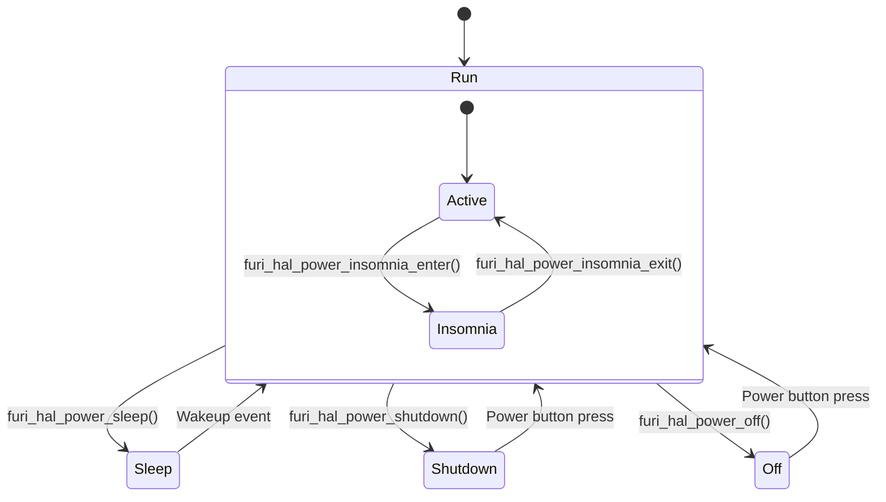
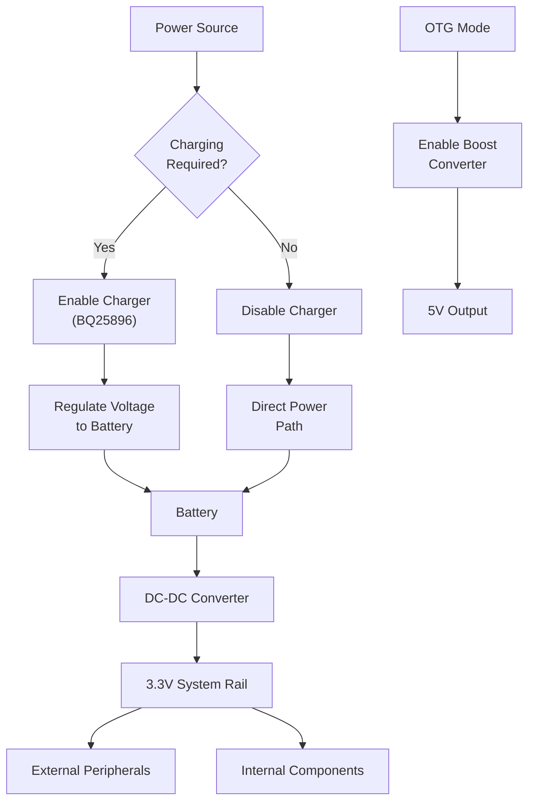
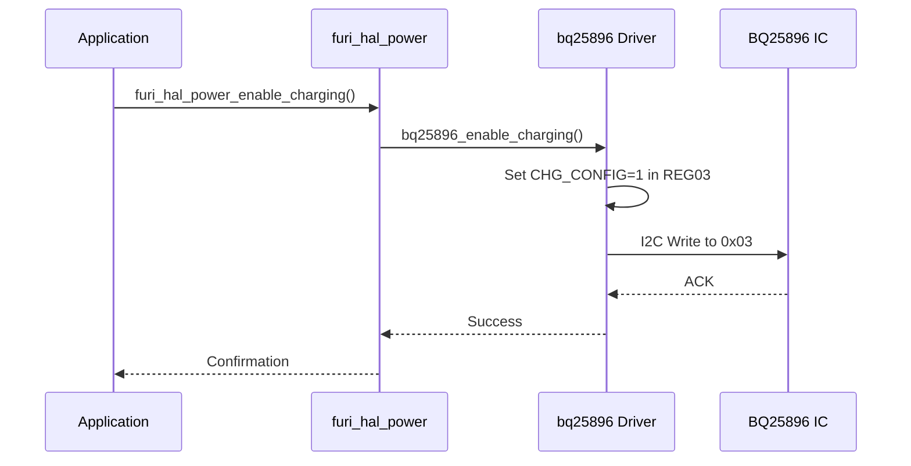
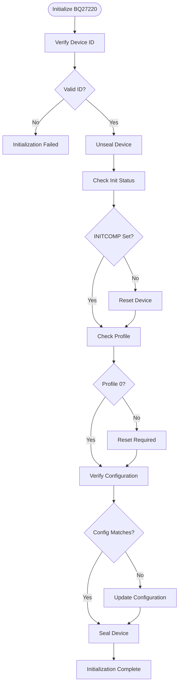
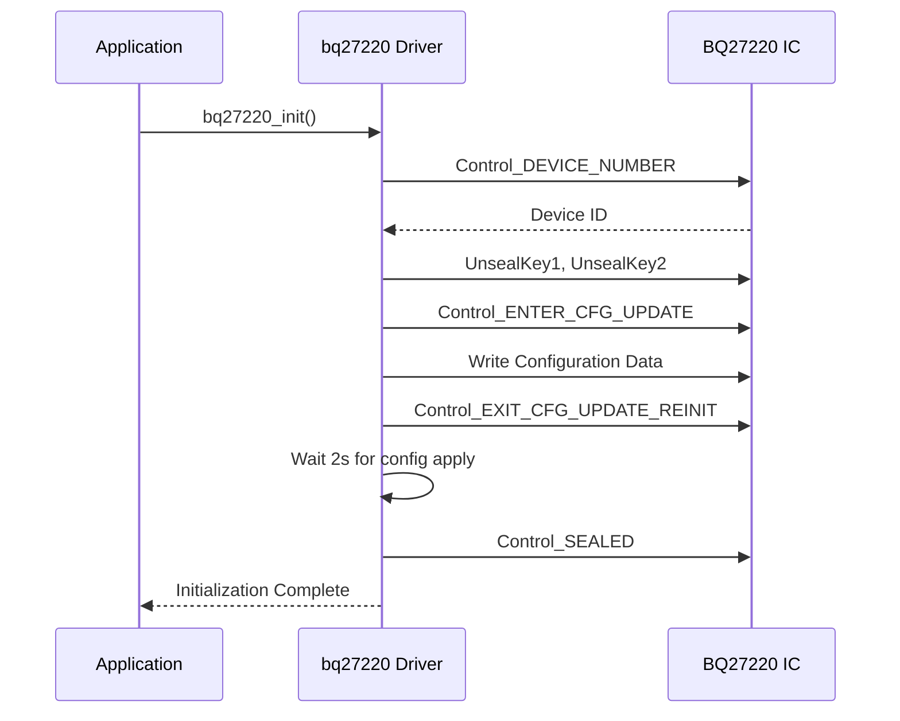
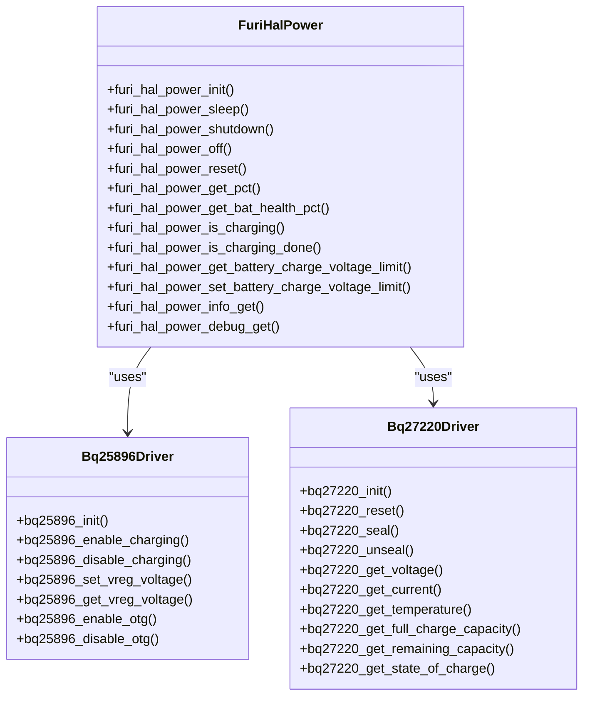
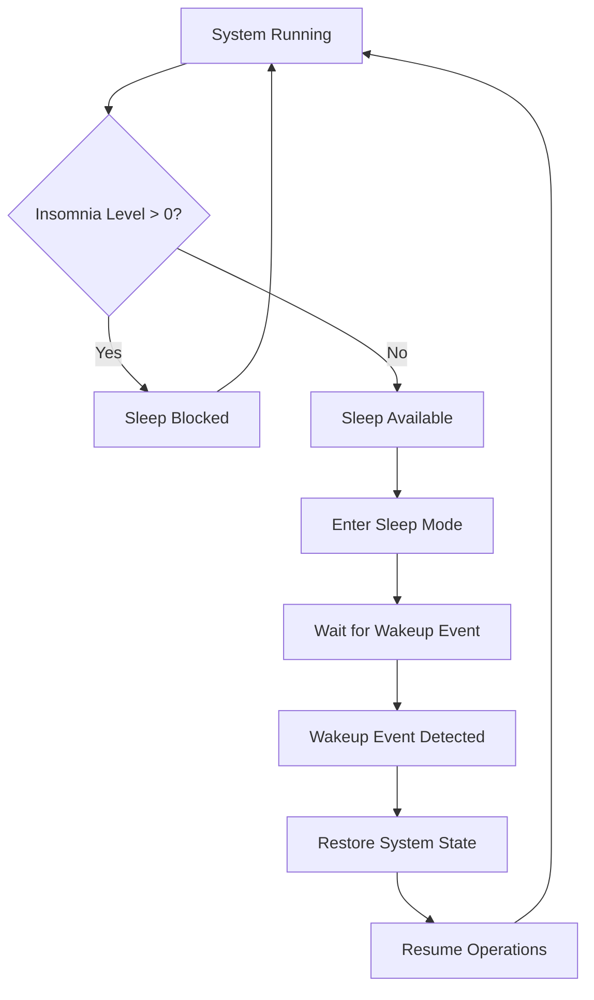

# Power Management

<cite>
**Referenced Files in This Document**   
- [furi_hal_power.h](file://targets/furi_hal_include/furi_hal_power.h)
- [bq25896.c](file://lib/drivers/bq25896.c)
- [bq25896.h](file://lib/drivers/bq25896.h)
- [bq27220.c](file://lib/drivers/bq27220.c)
- [bq27220.h](file://lib/drivers/bq27220.h)
- [bq27220_data_memory.h](file://lib/drivers/bq27220_data_memory.h)
</cite>

## Table of Contents
1. [Introduction](#introduction)
2. [Power Modes and System States](#power-modes-and-system-states)
3. [Voltage Regulation and Power Control](#voltage-regulation-and-power-control)
4. [Battery Charging Control with BQ25896](#battery-charging-control-with-bq25896)
5. [Fuel Gauging with BQ27220](#fuel-gauging-with-bq27220)
6. [Battery Profile Configuration](#battery-profile-configuration)
7. [Power Management API](#power-management-api)
8. [Brownout Detection and Low-Power Initialization](#brownout-detection-and-low-power-initialization)
9. [Wakeup Sources and Sleep Management](#wakeup-sources-and-sleep-management)
10. [Battery Health Monitoring and Charging Status](#battery-health-monitoring-and-charging-status)
11. [Optimization for Battery-Operated Scenarios](#optimization-for-battery-operated-scenarios)
12. [Troubleshooting Power Issues](#troubleshooting-power-issues)

## Introduction
The power management subsystem in the Flipper Zero firmware provides comprehensive control over device power states, battery charging, and energy monitoring. This documentation details the implementation of power modes, voltage regulation, battery charging control via the BQ25896 IC, and fuel gauging with the BQ27220 IC. The system is designed to optimize battery life while maintaining reliable operation across various usage scenarios. The power management layer abstracts hardware complexity through a well-defined API that allows applications to monitor battery status, control charging behavior, and manage power states without direct hardware interaction.

**Section sources**
- [furi_hal_power.h](file://targets/furi_hal_include/furi_hal_power.h#L1-L50)

## Power Modes and System States
The Flipper Zero firmware implements a hierarchical power management system with multiple power states that balance performance and energy consumption. The system supports several power modes including run, sleep, and shutdown states, each with specific characteristics and use cases.

The primary power states are:
- **Run Mode**: Full operation with all peripherals active
- **Sleep Mode**: Reduced power state with selective peripheral disablement
- **Shutdown Mode**: Minimal power consumption with only essential circuits active

The transition between these states is managed through the power HAL (Hardware Abstraction Layer) which provides functions to enter and exit sleep states. The `furi_hal_power_sleep()` function initiates the sleep sequence, while `furi_hal_power_sleep_available()` checks if sleep conditions are met. The system implements an "insomnia" mechanism to prevent unwanted sleep during critical operations, managed through `furi_hal_power_insomnia_enter()` and `furi_hal_power_insomnia_exit()` functions.

**Diagram sources**
- [furi_hal_power.h](file://targets/furi_hal_include/furi_hal_power.h#L60-L100)

**Section sources**
- [furi_hal_power.h](file://targets/furi_hal_include/furi_hal_power.h#L60-L120)

## Voltage Regulation and Power Control
The voltage regulation system manages power distribution across the device's various components. The system provides 3.3V power to external GPIO and SD card interfaces through dedicated control functions. The `furi_hal_power_enable_external_3_3v()` and `furi_hal_power_disable_external_3_3v()` functions control the external power rail, allowing applications to power down peripherals when not in use to conserve energy.

The system also implements a "suppress charge" mode through `furi_hal_power_suppress_charge_enter()` and `furi_hal_power_suppress_charge_exit()` functions. This mode is used when applications require a clean power supply without the noise generated by charging operations. When suppress charge mode is active, the charging circuit is temporarily disabled to ensure stable power delivery for sensitive operations.

OTG (On-The-Go) power management is handled through a dedicated subsystem that allows the device to act as a USB host. The `furi_hal_power_enable_otg()` and `furi_hal_power_disable_otg()` functions control the OTG power path, while `furi_hal_power_check_otg_status()` monitors for fault conditions. The system automatically disables OTG if a fault is detected to prevent damage to connected devices.

**Diagram sources**
- [furi_hal_power.h](file://targets/furi_hal_include/furi_hal_power.h#L150-L200)
- [bq25896.c](file://lib/drivers/bq25896.c#L100-L150)

**Section sources**
- [furi_hal_power.h](file://targets/furi_hal_include/furi_hal_power.h#L150-L200)

## Battery Charging Control with BQ25896
The BQ25896 integrated circuit serves as the primary battery charging controller, managing the charging process with precision and safety. The driver implementation in `bq25896.c` provides a comprehensive interface for controlling and monitoring the charging system.

### Charging Configuration
The BQ25896 driver initializes with optimal default settings:
- **OTG Configuration**: Boost voltage set to 5.062V with 1.4A current limit
- **Watchdog**: Disabled to prevent unintended resets
- **ADC**: Configured for continuous conversion mode

The charging process is controlled through several key functions:
- `bq25896_enable_charging()`: Activates the charging circuit
- `bq25896_disable_charging()`: Deactivates the charging circuit
- `bq25896_poweroff()`: Sends the device to shipping mode by disabling the BATFET

**Diagram sources**
- [bq25896.c](file://lib/drivers/bq27220.c#L150-L200)
- [bq25896.h](file://lib/drivers/bq25896.h#L30-L50)

### Voltage and Current Regulation
The charging voltage limit is adjustable through the `bq25896_set_vreg_voltage()` function, which accepts values in millivolts. The valid range is 3840mV to 4208mV in 16mV steps. Values outside this range are clamped to the nearest valid value. The actual voltage is calculated as VREG * 16 + 3840.

The system monitors multiple voltage and current parameters:
- **VBUS Voltage**: Input voltage from USB source
- **VSYS Voltage**: System voltage (calculated as SYSV * 20 + 2304)
- **VBAT Voltage**: Battery voltage (calculated as BATV * 20 + 2304)
- **VBAT Current**: Charging current (calculated as ICHGR * 50)

These measurements are used to determine charging status and detect fault conditions. The `bq25896_check_otg_fault()` function monitors for OTG boost faults, which can occur due to overcurrent or short circuit conditions.

**Section sources**
- [bq25896.c](file://lib/drivers/bq25896.c#L150-L300)
- [bq25896.h](file://lib/drivers/bq25896.h#L30-L60)

## Fuel Gauging with BQ27220
The BQ27220 fuel gauge IC provides accurate battery state monitoring through advanced impedance tracking algorithms. The driver implementation in `bq27220.c` handles the complex initialization and configuration process required by this sophisticated chip.

### Initialization Process
The initialization sequence in `bq27220_init()` performs several critical steps:
1. Verify device presence and correct ID (0x0220)
2. Unseal the device for configuration access
3. Check initialization status and reset if needed
4. Verify correct battery profile is loaded
5. Update configuration if necessary
6. Seal the device to prevent accidental changes

The initialization process includes extensive error checking and recovery mechanisms. If any step fails, the system attempts a reset and reinitialization cycle. The driver includes specific timing delays between operations to ensure reliable communication with the gauge.

**Diagram sources**
- [bq27220.c](file://lib/drivers/bq27220.c#L250-L350)

### Status Monitoring
The fuel gauge provides detailed status information through several status registers:

**Control Status (CommandControl)**
- BATT_ID: Battery identification
- SNOOZE: SNOOZE mode status
- BCA: Board calibration routine status
- CCA: Coulomb counter calibration status

**Battery Status (CommandBatteryStatus)**
- DSG: Discharge status
- SYSDWN: System shutdown indicator
- TDA: Terminate discharge alarm
- BATTPRES: Battery presence detection
- AUTH_GD: Battery authentication status
- OCVGD: OCV measurement quality
- TCA: Terminate charge alarm
- CHGINH: Charge inhibit status
- FC: Full charge detection
- OTD/OTC: Overtemperature detection
- SLEEP: Sleep mode status
- OCVFAIL: OCV measurement failure
- OCVCOMP: OCV measurement completion
- FD: Full discharge detection

**Operation Status (CommandOperationStatus)**
- CALMD: Calibration mode status
- SEC: Security access level
- EDV2: EDV2 threshold status
- VDQ: Discharge qualification status
- INITCOMP: Initialization completion
- SMTH: Smooth engine status
- BTPINT: BTP threshold status
- CFGUPDATE: Configuration update mode

**Section sources**
- [bq27220.h](file://lib/drivers/bq27220.h#L50-L150)
- [bq27220.c](file://lib/drivers/bq27220.c#L450-L500)

## Battery Profile Configuration
The battery profile configuration is managed through the data memory system in the BQ27220 fuel gauge. The configuration data is defined in `bq27220_data_memory.h` and loaded during initialization to ensure accurate battery monitoring.

### Configuration Data Structure
The configuration data is organized as a sequence of records with the following structure:
- **Type**: Data type (U8, U16, U32, etc.)
- **Address**: Memory address in the gauge
- **Value**: Configuration value

The configuration includes critical battery parameters:
- **CEDV Profile**: Chemical ID, full charge capacity, design capacity
- **EMF Profile**: Open-circuit voltage characteristics
- **Impedance Profile**: R0, R1, C0, C1 values for impedance tracking
- **Temperature Profile**: T0, TC values for temperature compensation
- **Thresholds**: EDV0, EDV1, EDV2 discharge thresholds
- **State of Charge Mapping**: DOD0-DOD100 start points

### Configuration Update Process
The configuration update process follows a strict sequence:
1. Enter configuration update mode using Control_ENTER_CFG_UPDATE
2. Wait for CFGUPDATE flag to be set
3. Write configuration data with proper checksum
4. Exit configuration update mode
5. Wait for configuration to be applied (2-second delay)
6. Verify configuration was accepted

The system uses specific timing delays between operations to ensure reliability:
- BQ27220_MAC_WRITE_DELAY_US: 250μs between write operations
- BQ27220_SELECT_DELAY_US: 1ms between select and read operations
- BQ27220_MAGIC_DELAY_US: 5ms between control operations
- BQ27220_CONFIG_DELAY_US: 10ms after configuration write
- BQ27220_CONFIG_APPLY_US: 2s after exiting config mode

**Diagram sources**
- [bq27220.c](file://lib/drivers/bq27220.c#L200-L300)
- [bq27220_data_memory.h](file://lib/drivers/bq27220_data_memory.h#L1-L50)

**Section sources**
- [bq27220_data_memory.h](file://lib/drivers/bq27220_data_memory.h#L1-L87)

## Power Management API
The power management API provides a comprehensive interface for applications to interact with the power subsystem. The API is exposed through the `furi_hal_power.h` header file and implemented in the corresponding HAL layer.

### Core Functions
The API includes functions for power state management:
- `furi_hal_power_init()`: Initialize power drivers
- `furi_hal_power_sleep()`: Enter sleep mode
- `furi_hal_power_shutdown()`: Switch to shutdown state
- `furi_hal_power_off()`: Power off device
- `furi_hal_power_reset()`: Reset device

### Battery Monitoring Functions
The API provides several functions for battery state monitoring:
- `furi_hal_power_get_pct()`: Get remaining capacity in percent
- `furi_hal_power_get_bat_health_pct()`: Get battery health in percent
- `furi_hal_power_get_battery_remaining_capacity()`: Get remaining capacity in mAh
- `furi_hal_power_get_battery_full_capacity()`: Get full charge capacity in mAh
- `furi_hal_power_get_battery_design_capacity()`: Get design capacity in mAh

### Charging Control Functions
The API includes functions for charging management:
- `furi_hal_power_is_charging()`: Check if charging is active
- `furi_hal_power_is_charging_done()`: Check if charging is complete
- `furi_hal_power_get_battery_charge_voltage_limit()`: Get charge voltage limit
- `furi_hal_power_set_battery_charge_voltage_limit()`: Set charge voltage limit

### Power Information Retrieval
The system provides two functions for retrieving detailed power information:
- `furi_hal_power_info_get()`: Get general power information
- `furi_hal_power_debug_get()`: Get debug power information

Both functions use a callback mechanism to provide data, allowing for flexible output formatting.

**Diagram sources**
- [furi_hal_power.h](file://targets/furi_hal_include/furi_hal_power.h#L1-L227)
- [bq25896.h](file://lib/drivers/bq25896.h#L1-L68)
- [bq27220.h](file://lib/drivers/bq27220.h#L1-L276)

**Section sources**
- [furi_hal_power.h](file://targets/furi_hal_include/furi_hal_power.h#L1-L227)

## Brownout Detection and Low-Power Initialization
The power management system includes robust brownout detection and low-power initialization mechanisms to ensure reliable operation under varying power conditions.

### Brownout Detection
The system monitors battery voltage through both the BQ25896 charger and BQ27220 fuel gauge ICs. The `furi_hal_power_get_battery_voltage()` function can query voltage from either IC, providing redundancy in voltage monitoring. When the battery voltage drops below a critical threshold, the system can initiate a controlled shutdown to prevent data corruption.

The BQ27220 fuel gauge includes built-in brownout protection features:
- **OCVGD (Open-Circuit Voltage Good)**: Indicates when a valid OCV measurement can be taken
- **OCVFAIL**: Indicates OCV measurement failure due to excessive current
- **SYSDWN**: System shutdown indicator that triggers when battery voltage is critically low

### Low-Power Initialization
The initialization process is designed to function reliably even at low battery voltages. The BQ27220 driver includes specific handling for low-power conditions:
- **Initialization Retry**: If initialization fails, the system attempts a reset and reinitialization
- **Timing Tolerance**: The driver uses conservative timing values to ensure reliability at low voltages
- **Error Recovery**: Comprehensive error checking with multiple recovery paths

The system also implements a "shipping mode" through the BQ25896 charger, which minimizes power consumption when the device is not in use. This is activated by setting the BATFET_DIS bit in REG09, effectively disconnecting the battery from the system.

**Section sources**
- [bq27220.c](file://lib/drivers/bq27220.c#L300-L400)
- [bq25896.c](file://lib/drivers/bq25896.c#L50-L100)

## Wakeup Sources and Sleep Management
The sleep management system provides fine-grained control over device sleep states and wakeup sources.

### Insomnia Mechanism
The system implements an "insomnia" mechanism to prevent unwanted sleep during critical operations:
- `furi_hal_power_insomnia_enter()`: Increases insomnia level, preventing sleep
- `furi_hal_power_insomnia_exit()`: Decreases insomnia level, allowing sleep
- `furi_hal_power_insomnia_level()`: Returns current insomnia level

The insomnia level acts as a reference counter - sleep is only allowed when the level is zero. This allows multiple subsystems to independently prevent sleep without coordination.

### Sleep Availability
The `furi_hal_power_sleep_available()` function checks if sleep conditions are met:
- Insomnia level is zero
- No active operations that require wakefulness
- System is not in a critical state

When sleep is available, the `furi_hal_power_sleep()` function initiates the sleep sequence, which includes:
1. Notifying subsystems of impending sleep
2. Saving critical state information
3. Disabling non-essential peripherals
4. Entering low-power MCU mode
5. Waiting for wakeup event

### Wakeup Sources
Wakeup sources include:
- User input (button presses)
- Timer expiration
- External interrupts
- Communication events (USB, Bluetooth)
- Sensor triggers

The system automatically handles the transition from sleep to active state, restoring necessary peripherals and resuming operations.

**Diagram sources**
- [furi_hal_power.h](file://targets/furi_hal_include/furi_hal_power.h#L70-L90)

**Section sources**
- [furi_hal_power.h](file://targets/furi_hal_include/furi_hal_power.h#L70-L100)

## Battery Health Monitoring and Charging Status
The power management system provides comprehensive battery health monitoring and charging status reporting.

### Battery Health Metrics
The system reports several battery health metrics:
- **State of Charge (SoC)**: Current charge level as percentage
- **State of Health (SoH)**: Battery health as percentage of original capacity
- **Full Charge Capacity**: Current maximum charge capacity in mAh
- **Design Capacity**: Original design capacity in mAh
- **Cycle Count**: Number of charge/discharge cycles

These metrics are calculated by the BQ27220 fuel gauge using advanced impedance tracking algorithms that account for battery aging and usage patterns.

### Charging Status
The system provides detailed charging status information:
- **Charging State**: Not charging, precharge, fast charge, or charge termination
- **Charge Complete**: Indicates when charging is complete while connected
- **Charge Current**: Current charging current in mA
- **Charge Voltage**: Current battery voltage during charging

The `furi_hal_power_is_charging()` function returns true for all charging states (precharge, fast charge, and charge termination), while `furi_hal_power_is_charging_done()` returns true only when charging is complete.

### Temperature Monitoring
Battery temperature is monitored through the BQ27220 fuel gauge:
- `furi_hal_power_get_battery_temperature(FuriHalPowerICFuelGauge)`: Returns temperature in Celsius
- The system uses temperature data to adjust charging parameters and prevent overheating

The BQ27220 includes overtemperature detection for both charge (OTC) and discharge (OTD) conditions, which can trigger safety shutdowns if temperatures exceed safe limits.

**Section sources**
- [furi_hal_power.h](file://targets/furi_hal_include/furi_hal_power.h#L110-L150)
- [bq27220.c](file://lib/drivers/bq27220.c#L500-L550)

## Optimization for Battery-Operated Scenarios
The power management system includes several features to optimize battery life in portable operation scenarios.

### Power-Saving Techniques
Key power-saving techniques include:
- **Peripheral Power Control**: External 3.3V power can be disabled when not needed
- **Suppress Charge Mode**: Charging can be temporarily disabled for clean power during sensitive operations
- **OTG Power Management**: OTG power is only enabled when needed and automatically disabled on fault
- **Sleep Mode Optimization**: The system enters sleep mode when idle and wakes only for necessary events

### Application-Level Optimization
Applications can optimize power consumption by:
- Using `furi_hal_power_insomnia_enter()` and `furi_hal_power_insomnia_exit()` to properly manage sleep prevention
- Disabling external power rails when not in use
- Minimizing active time during operations
- Using efficient algorithms to reduce CPU load
- Batch operations to minimize wake cycles

### Configuration Recommendations
For optimal battery life:
- Set appropriate charge voltage limits based on battery specifications
- Monitor battery health and replace batteries when SoH drops below 80%
- Use sleep mode aggressively during idle periods
- Disable unused peripherals and features
- Minimize screen on time and brightness
- Use efficient communication protocols

The system provides tools for monitoring power consumption through the `furi_hal_power_info_get()` and `furi_hal_power_debug_get()` functions, allowing developers to identify and address power-hungry operations.

**Section sources**
- [furi_hal_power.h](file://targets/furi_hal_include/furi_hal_power.h#L180-L220)

## Troubleshooting Power Issues
This section provides guidance for diagnosing and resolving common power management issues.

### Common Issues and Solutions
**Issue: Device fails to charge**
- Check USB connection and cable
- Verify charger is providing sufficient power
- Check for OTG faults using `furi_hal_power_check_otg_fault()`
- Reset the BQ25896 charger using `bq25896_init()`

**Issue: Inaccurate battery readings**
- Ensure correct battery profile is loaded in BQ27220
- Verify fuel gauge initialization completes successfully
- Check for communication errors with the fuel gauge
- Reset and reinitialize the fuel gauge

**Issue: Device shuts down unexpectedly**
- Check battery health and replace if SoH is low
- Verify brownout detection is functioning
- Check for excessive current draw
- Monitor temperature to rule out thermal shutdown

**Issue: Device fails to wake from sleep**
- Check wakeup sources are properly configured
- Verify insomnia level is properly managed
- Check for hardware issues with wakeup buttons
- Review sleep entry/exit sequence

### Diagnostic Tools
The system provides several diagnostic functions:
- `furi_hal_power_debug_get()`: Provides detailed debug information
- `bq27220_get_operation_status()`: Returns detailed fuel gauge status
- `bq25896_get_charge_status()`: Returns detailed charger status
- I2C communication monitoring for error detection

When troubleshooting, follow this systematic approach:
1. Verify power source quality
2. Check battery condition and health
3. Verify communication with power management ICs
4. Review initialization sequence
5. Monitor system behavior under load
6. Check for firmware issues

**Section sources**
- [bq27220.c](file://lib/drivers/bq27220.c#L1-L578)
- [bq25896.c](file://lib/drivers/bq25896.c#L1-L208)
- [furi_hal_power.h](file://targets/furi_hal_include/furi_hal_power.h#L1-L227)