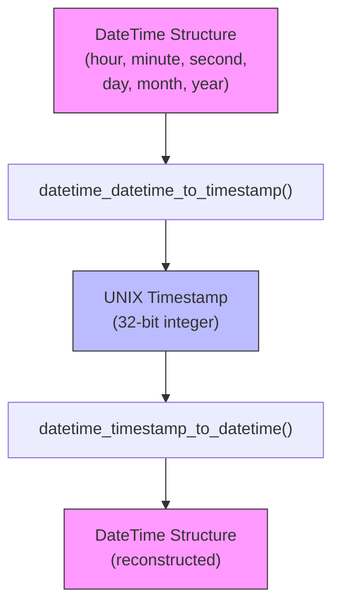
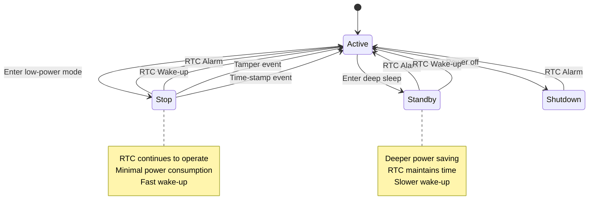

# RTC Interface

<cite>
**Referenced Files in This Document**   
- [datetime.h](file://lib/datetime/datetime.h)
- [datetime.c](file://lib/datetime/datetime.c)
- [datetimelib_test.c](file://applications/debug/unit_tests/tests/datetime/datetimelib_test.c)
</cite>

## Table of Contents
1. [Introduction](#introduction)
2. [Core Components](#core-components)
3. [Time and Date Conversion](#time-and-date-conversion)
4. [Leap Year and Calendar Calculations](#leap-year-and-calendar-calculations)
5. [Validation and Error Handling](#validation-and-error-handling)
6. [Integration with FATFS](#integration-with-fatfs)
7. [Power Management and RTC Hardware](#power-management-and-rtc-hardware)
8. [Testing and Usage Examples](#testing-and-usage-examples)
9. [Common Issues and Troubleshooting](#common-issues-and-troubleshooting)

## Introduction

The Real-Time Clock (RTC) interface in the Flipper Zero firmware provides essential timekeeping functionality for the device. While direct RTC hardware abstraction layer (HAL) components are not explicitly visible in the analyzed codebase, time and date functionality is implemented through a dedicated datetime library. This library handles calendar operations, timestamp conversions, and date validation, serving as the primary interface for time-related operations across the system.

The datetime subsystem operates independently of direct RTC peripheral access, instead focusing on providing a robust software abstraction for time manipulation and formatting. It integrates with other system components such as the file system for timestamping and power management for wake-up events, even though the specific RTC HAL implementation appears to be abstracted at a lower level or potentially in external libraries.

## Core Components

The datetime functionality is centered around the `DateTime` structure and associated conversion functions. The core implementation resides in the `lib/datetime` module, which provides a complete set of tools for handling time and date operations.

```c
typedef struct {
    // Time
    uint8_t hour; /**< Hour in 24H format: 0-23 */
    uint8_t minute; /**< Minute: 0-59 */
    uint8_t second; /**< Second: 0-59 */
    // Date
    uint8_t day; /**< Current day: 1-31 */
    uint8_t month; /**< Current month: 1-12 */
    uint16_t year; /**< Current year: 2000-2099 */
    uint8_t weekday; /**< Current weekday: 1-7 */
} DateTime;
```

This structure represents a complete date and time point with validation constraints for each field. The year range is limited to 2000-2099, which suggests a design decision to focus on the current century while maintaining a compact data structure.

**Section sources**
- [datetime.h](file://lib/datetime/datetime.h#L10-L24)

## Time and Date Conversion

The datetime library provides bidirectional conversion between human-readable date/time format and UNIX timestamps. This functionality is critical for system operations that require time-based operations or storage.

### Timestamp Conversion Functions

The library implements two primary conversion functions:

- `datetime_datetime_to_timestamp()`: Converts a DateTime structure to a UNIX timestamp (seconds since January 1, 1970)
- `datetime_timestamp_to_datetime()`: Converts a UNIX timestamp back to a DateTime structure



**Diagram sources**
- [datetime.h](file://lib/datetime/datetime.h#L30-L55)
- [datetime.c](file://lib/datetime/datetime.c#L50-L100)

The conversion process accounts for leap years and varying month lengths, ensuring accurate time calculations across the supported date range. The implementation uses a reference epoch of 1970 (standard UNIX epoch) and calculates the number of days between the epoch and the target date before converting to seconds.

**Section sources**
- [datetime.c](file://lib/datetime/datetime.c#L50-L100)

## Leap Year and Calendar Calculations

The datetime library includes comprehensive calendar calculation functions that handle the complexities of the Gregorian calendar system.

### Leap Year Detection

The `datetime_is_leap_year()` function implements the standard Gregorian calendar leap year rules:
- Years divisible by 4 are leap years
- Exception: Years divisible by 100 are not leap years
- Exception to the exception: Years divisible by 400 are leap years

```c
bool datetime_is_leap_year(uint16_t year) {
    return (((year) % 4 == 0) && ((year) % 100 != 0)) || ((year) % 400 == 0);
}
```

### Month and Year Length Calculations

The library provides functions to determine the number of days in any given month or year:

- `datetime_get_days_per_year()`: Returns 365 or 366 depending on whether the year is a leap year
- `datetime_get_days_per_month()`: Returns the correct number of days for any month (28-31), accounting for leap years in February

These functions use lookup tables for efficiency:

```c
static const uint8_t datetime_days_per_month[2][MONTHS_COUNT] = {
    {31, 28, 31, 30, 31, 30, 31, 31, 30, 31, 30, 31},  // Non-leap year
    {31, 29, 31, 30, 31, 30, 31, 31, 30, 31, 30, 31}   // Leap year
};
```

**Section sources**
- [datetime.c](file://lib/datetime/datetime.c#L105-L110)

## Validation and Error Handling

The datetime library includes robust validation to ensure data integrity when working with date and time values.

### DateTime Validation

The `datetime_validate_datetime()` function performs comprehensive validation of all DateTime structure fields:

```c
bool datetime_validate_datetime(DateTime* datetime) {
    bool invalid = false;

    invalid |= (datetime->second > 59);
    invalid |= (datetime->minute > 59);
    invalid |= (datetime->hour > 23);

    invalid |= (datetime->year < 2000);
    invalid |= (datetime->year > 2099);

    invalid |= (datetime->month == 0);
    invalid |= (datetime->month > 12);

    invalid |= (datetime->day == 0);
    invalid |= (datetime->day > 31);

    invalid |= (datetime->weekday == 0);
    invalid |= (datetime->weekday > 7);

    return !invalid;
}
```

The function checks each field against its valid range and returns false if any field contains an invalid value. This prevents the use of malformed date/time data in system operations.

**Section sources**
- [datetime.c](file://lib/datetime/datetime.c#L30-L50)

## Integration with FATFS

The datetime library integrates with the FATFS file system for file timestamping operations. Although the specific `get_fattime()` function is not present in the analyzed code, the FATFS configuration indicates RTC integration:

```c
// From ffconf_template.h
#define _FS_NORTC	0
#define _NORTC_MON	1
#define _NORTC_MDAY	1
#define _NORTC_YEAR	2016
```

With `_FS_NORTC` set to 0, the file system expects a real-time clock function to be provided. This suggests that either:
1. The RTC implementation exists in a part of the codebase not analyzed
2. The function is provided by the hardware abstraction layer at runtime
3. The system uses an external RTC chip or peripheral

The FATFS integration allows file operations to be timestamped with accurate date and time information, which is essential for file management and logging operations.

**Section sources**
- [ffconf_template.h](file://lib/fatfs/ffconf_template.h#L238-L248)

## Power Management and RTC Hardware

Although direct RTC HAL implementation files were not found in the analysis, references in the codebase indicate RTC integration with power management features:

- The PWR (Power) module references RTC alarms and wake-up events as wake-up sources from low-power modes
- RTC registers are mentioned as being preserved in backup domain during low-power states
- The system can wake from Stop, Standby, and Shutdown modes using RTC alarm or wake-up events



**Diagram sources**
- [stm32wbxx_hal_pwr.c](file://lib/stm32wb_hal/Src/stm32wbxx_hal_pwr.c#L300-L350)

This indicates that the STM32WB's built-in RTC peripheral is utilized for power management functions, even if the specific HAL implementation is not visible in the current code analysis.

**Section sources**
- [stm32wbxx_hal_pwr.c](file://lib/stm32wb_hal/Src/stm32wbxx_hal_pwr.c#L150-L350)

## Testing and Usage Examples

The datetime library is thoroughly tested with unit tests that validate its functionality across the entire supported date range.

### Test Coverage

The test suite includes comprehensive validation of:
- Minimum and maximum DateTime values
- Individual field validation (seconds, minutes, hours, etc.)
- Round-trip conversion accuracy (timestamp ↔ DateTime)
- Weekday calculation correctness

```c
MU_TEST(test_datetime_timestamp_to_datetime_weekday) {
    uint32_t test_value = 1709748421; // Wed Mar 06 18:07:01 2024 UTC

    DateTime datetime = {0};
    datetime_timestamp_to_datetime(test_value, &datetime);

    mu_assert_int_eq(datetime.hour, 18);
    mu_assert_int_eq(datetime.minute, 7);
    mu_assert_int_eq(datetime.second, 1);
    mu_assert_int_eq(datetime.day, 6);
    mu_assert_int_eq(datetime.month, 3);
    mu_assert_int_eq(datetime.weekday, 3);
    mu_assert_int_eq(datetime.year, 2024);
}
```

### Integration Example

To use the datetime library in an application:

```c
// Get current timestamp from system (assumed to be available)
uint32_t current_timestamp = get_system_timestamp();

// Convert to DateTime structure
DateTime current_time;
datetime_timestamp_to_datetime(current_timestamp, &current_time);

// Validate the DateTime structure
if (datetime_validate_datetime(&current_time)) {
    // Use the time data
    printf("Current time: %02d:%02d:%02d", 
           current_time.hour, current_time.minute, current_time.second);
    printf("Date: %02d/%02d/%04d", 
           current_time.day, current_time.month, current_time.year);
}
```

**Section sources**
- [datetimelib_test.c](file://applications/debug/unit_tests/tests/datetime/datetimelib_test.c#L150-L190)

## Common Issues and Troubleshooting

### Time Synchronization Issues

Since the code analysis did not reveal explicit RTC initialization or synchronization code, potential issues may arise from:

- **Initial time setting**: The system may require manual time setting on first boot or after battery replacement
- **Clock drift**: Without periodic synchronization, the internal RTC may drift over time
- **Timezone handling**: The library operates in UTC; timezone conversion must be handled by higher-level applications

### Battery Life Considerations

The RTC functionality impacts battery life through:

- **Backup power consumption**: The RTC continues to operate in low-power modes, drawing current from the backup battery
- **Wake-up frequency**: Frequent RTC alarms for periodic tasks can reduce overall battery life
- **Calendar calculations**: Complex date operations consume CPU cycles and power

### Recommended Best Practices

1. **Initialize time promptly**: Set the correct time after device startup or battery replacement
2. **Minimize wake-ups**: Batch periodic operations to reduce the frequency of RTC wake-up events
3. **Validate input**: Always validate DateTime structures before use to prevent errors
4. **Handle year boundaries**: Pay special attention to operations near year-end and leap year transitions
5. **Consider daylight saving**: Implement daylight saving time adjustments in application logic if needed

**Section sources**
- [datetime.c](file://lib/datetime/datetime.c)
- [datetimelib_test.c](file://applications/debug/unit_tests/tests/datetime/datetimelib_test.c)