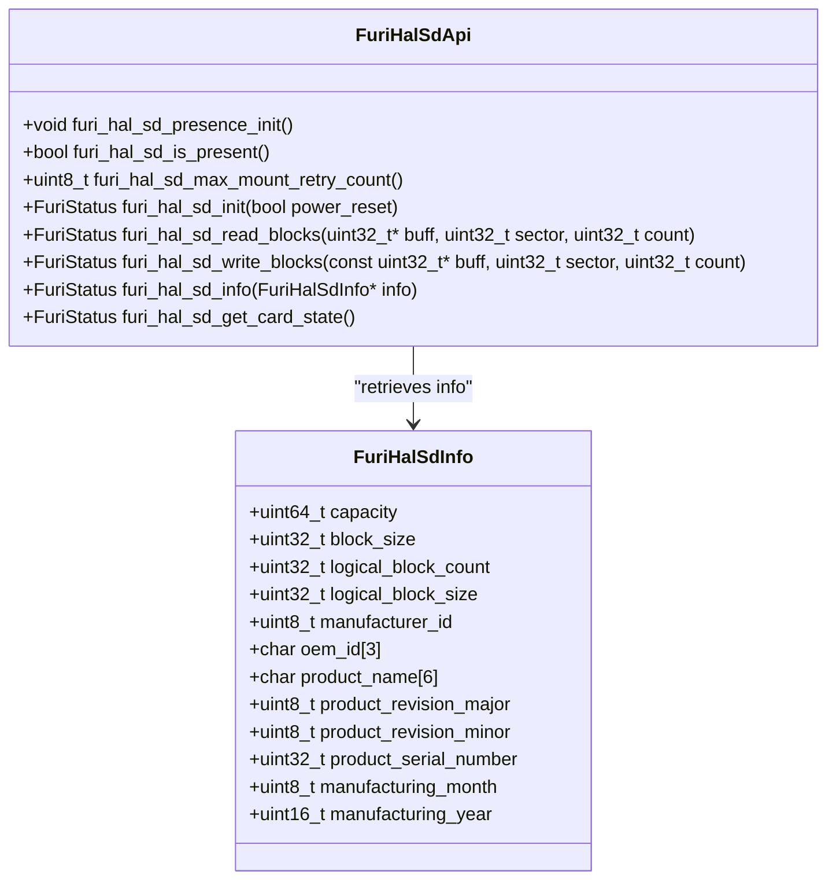
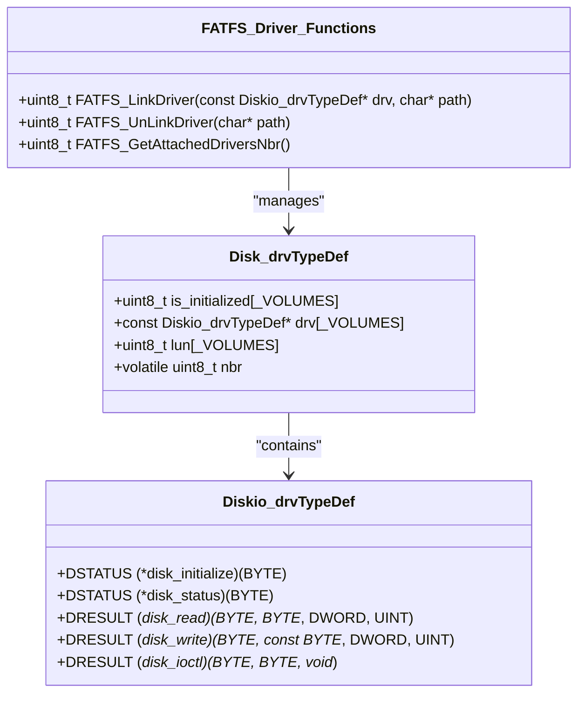
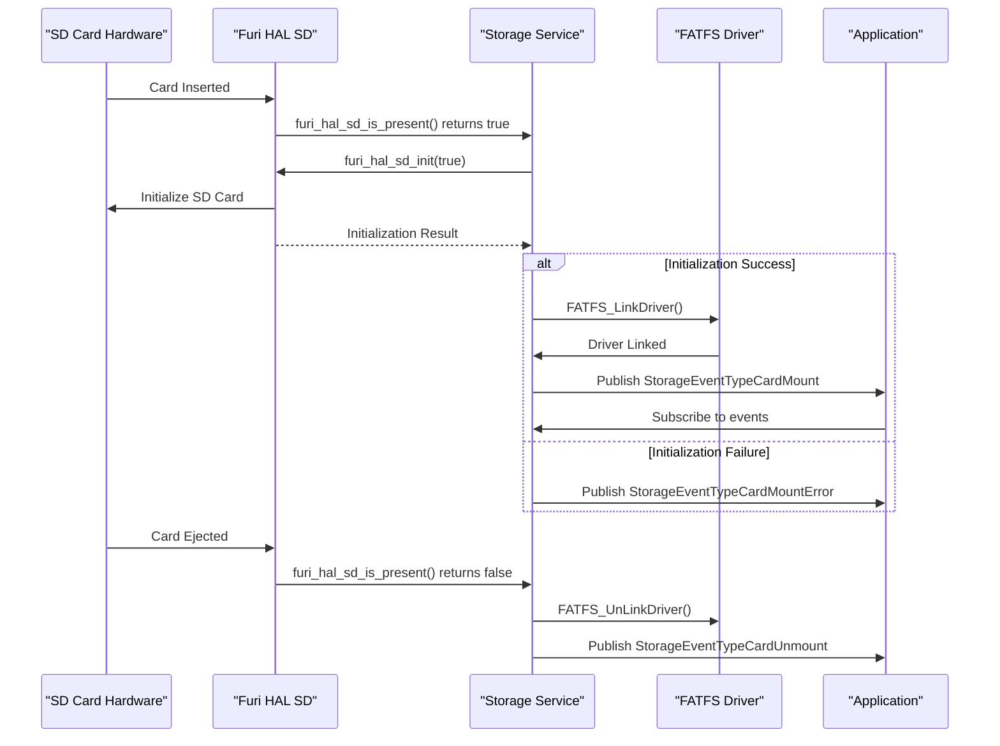
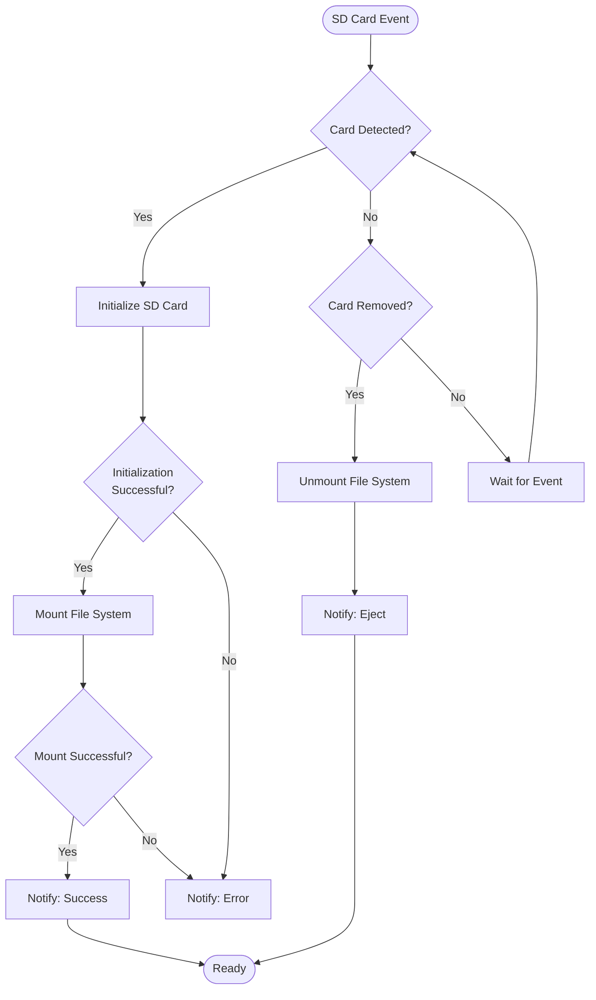
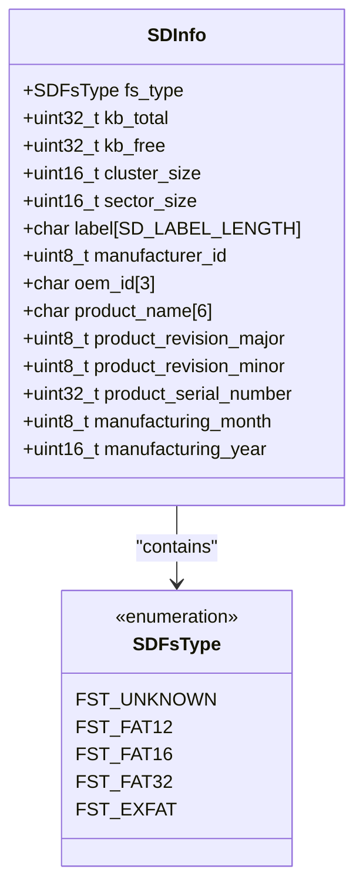

# SD Card Interface

<cite>
**Referenced Files in This Document**   
- [furi_hal_sd.h](file://targets/furi_hal_include/furi_hal_sd.h#L1-L87)
- [diskio.h](file://lib/fatfs/diskio.h#L1-L80)
- [ff_gen_drv.c](file://lib/fatfs/ff_gen_drv.c#L1-L124)
- [ff_gen_drv.h](file://lib/fatfs/ff_gen_drv.h#L1-L81)
- [sd_notify.c](file://applications/services/storage/storages/sd_notify.c#L1-L83)
- [sd_notify.h](file://applications/services/storage/storages/sd_notify.h#L1-L18)
- [storage.h](file://applications/services/storage/storage.h#L1-L681)
- [storage.c](file://applications/services/storage/storage.c#L1-L123)
- [storage_i.h](file://applications/services/storage/storage_i.h#L1-L33)
- [storage_sd_api.h](file://applications/services/storage/storage_sd_api.h#L1-L42)
</cite>

## Table of Contents
1. [Introduction](#introduction)
2. [SD Card Hardware Abstraction Layer](#sd-card-hardware-abstraction-layer)
3. [FATFS Integration and Block-Level Operations](#fatfs-integration-and-block-level-operations)
4. [Storage Service Architecture](#storage-service-architecture)
5. [Card Detection and Mounting Process](#card-detection-and-mounting-process)
6. [Error Handling and Notification System](#error-handling-and-notification-system)
7. [Supported SD Card Types and Formatting Requirements](#supported-sd-card-types-and-formatting-requirements)
8. [Performance Optimization and Wear Leveling Considerations](#performance-optimization-and-wear-leveling-considerations)
9. [Conclusion](#conclusion)

## Introduction
The SD card subsystem in the Flipper Zero firmware provides a robust interface for managing external storage through a combination of hardware abstraction, file system integration, and event-driven architecture. This documentation details the initialization sequence, card detection mechanism, interface configuration, FATFS integration, error handling, and performance considerations for SD card operations. The system supports both SPI and SDIO interfaces through the hardware abstraction layer, with the current implementation focusing on reliable block-level access and file system management.

**Section sources**
- [furi_hal_sd.h](file://targets/furi_hal_include/furi_hal_sd.h#L1-L87)
- [storage.h](file://applications/services/storage/storage.h#L1-L681)

## SD Card Hardware Abstraction Layer

The SD card hardware abstraction layer (HAL) provides a unified interface for SD card operations, abstracting the underlying communication protocol (SPI or SDIO). The `furi_hal_sd.h` header defines the core API for SD card interaction, including initialization, block read/write operations, and card information retrieval.



**Diagram sources**
- [furi_hal_sd.h](file://targets/furi_hal_include/furi_hal_sd.h#L1-L87)

**Section sources**
- [furi_hal_sd.h](file://targets/furi_hal_include/furi_hal_sd.h#L1-L87)

### Initialization Sequence
The SD card initialization sequence begins with presence detection initialization via `furi_hal_sd_presence_init()`, which configures the GPIO pin used to detect SD card insertion. The actual initialization process is triggered by `furi_hal_sd_init(bool power_reset)`, which performs the following steps:
1. Optionally resets the card power based on the `power_reset` parameter
2. Initializes the SD card interface (SPI or SDIO)
3. Performs card identification and initialization sequence
4. Configures the card for data transfer mode

The initialization includes multiple retry attempts, controlled by `furi_hal_sd_max_mount_retry_count()`, to handle cases where the card may not be ready immediately after insertion.

### Block-Level Operations
The HAL provides block-level read and write operations through `furi_hal_sd_read_blocks()` and `furi_hal_sd_write_blocks()`, which operate on fixed-size sectors (typically 512 bytes). These functions serve as the foundation for higher-level file system operations, translating logical block addresses to physical card sectors. The `FuriHalSdInfo` structure provides comprehensive card information, including capacity, block size, manufacturer details, and production date.

## FATFS Integration and Block-Level Operations

The FATFS library integration is facilitated through the `ff_gen_drv` module, which acts as a bridge between the FATFS file system and the hardware-specific SD card driver. This abstraction allows FATFS to work with various storage devices through a standardized interface.



**Diagram sources**
- [ff_gen_drv.h](file://lib/fatfs/ff_gen_drv.h#L1-L81)
- [ff_gen_drv.c](file://lib/fatfs/ff_gen_drv.c#L1-L124)
- [diskio.h](file://lib/fatfs/diskio.h#L1-L80)

**Section sources**
- [ff_gen_drv.h](file://lib/fatfs/ff_gen_drv.h#L1-L81)
- [ff_gen_drv.c](file://lib/fatfs/ff_gen_drv.c#L1-L124)
- [diskio.h](file://lib/fatfs/diskio.h#L1-L80)

### FATFS Driver Architecture
The `Diskio_drvTypeDef` structure defines function pointers for the five essential disk operations: initialize, status, read, write, and ioctl. The `Disk_drvTypeDef` structure manages multiple volumes, tracking initialization status, driver references, logical unit numbers, and the total number of attached drivers. The FATFS linking functions (`FATFS_LinkDriver`, `FATFS_UnLinkDriver`) manage the registration and unregistration of storage drivers with the FATFS system, assigning logical drive letters (0:, 1:, etc.) to each connected device.

### Block Translation and Caching
The integration layer translates FATFS block requests into calls to the HAL functions. When FATFS requests a block read or write, the driver forwards the operation to `furi_hal_sd_read_blocks()` or `furi_hal_sd_write_blocks()`, handling any necessary data type conversions and error mapping between the two systems. The `_USE_WRITE` and `_USE_IOCTL` configuration macros in `diskio.h` enable write operations and device control functions respectively, allowing for features like synchronization, trimming, and media status queries.

## Storage Service Architecture

The storage service provides a comprehensive API for file and directory operations, building on the FATFS integration to offer a user-friendly interface for applications. The architecture follows a layered approach, with the storage service managing multiple storage types (internal and external) through a unified API.

```mermaid
graph TB
subgraph "Storage Service"
Storage[Storage Service]
PubSub[FuriPubSub]
MessageQueue[FuriMessageQueue]
end
subgraph "Storage Types"
Internal[Internal Storage]
External[External Storage (SD)]
Mount[Mount Point Storage]
end
subgraph "FATFS Layer"
FFGenDrv[FF Gen Driver]
FATFS[FATFS Library]
end
subgraph "HAL Layer"
FuriHalSD[Furi HAL SD]
end
Application --> Storage
Storage --> Internal
Storage --> External
Storage --> Mount
External --> FFGenDrv
FFGenDrv --> FATFS
FFGenDrv --> FuriHalSD
Storage --> PubSub
Storage --> MessageQueue
style Storage fill:#f9f,stroke:#333
style External fill:#f9f,stroke:#333
```

**Diagram sources**
- [storage.h](file://applications/services/storage/storage.h#L1-L681)
- [storage.c](file://applications/services/storage/storage.c#L1-L123)
- [storage_i.h](file://applications/services/storage/storage_i.h#L1-L33)

**Section sources**
- [storage.h](file://applications/services/storage/storage.h#L1-L681)
- [storage.c](file://applications/services/storage/storage.c#L1-L123)
- [storage_i.h](file://applications/services/storage/storage_i.h#L1-L33)

### Service Initialization
The storage service is initialized through `storage_app_alloc()`, which allocates memory for the storage structure, creates a message queue for inter-thread communication, and initializes the pubsub system for event notification. The service manages three storage types: internal (ST_INT), external (ST_EXT, SD card), and mount point (ST_MNT). During initialization, the internal and external storage systems are initialized through `storage_int_init()` and `storage_ext_init()` respectively.

### Message Processing Loop
The storage service runs as a separate thread (`storage_srv`) with a message processing loop that handles storage operations and periodic tick events. The loop processes messages from the message queue with a timeout of 1000ms, allowing it to perform periodic tasks such as checking SD card status. The `storage_tick()` function is called on each timeout, checking the status of all storage devices and triggering appropriate events when the SD card state changes.

## Card Detection and Mounting Process

The card detection and mounting process is a critical component of the SD card subsystem, ensuring reliable operation when cards are inserted or removed. The process involves hardware detection, initialization, file system mounting, and event notification.



**Diagram sources**
- [storage.c](file://applications/services/storage/storage.c#L1-L123)
- [furi_hal_sd.h](file://targets/furi_hal_include/furi_hal_sd.h#L1-L87)
- [storage.h](file://applications/services/storage/storage.h#L1-L681)

**Section sources**
- [storage.c](file://applications/services/storage/storage.c#L1-L123)
- [furi_hal_sd.h](file://targets/furi_hal_include/furi_hal_sd.h#L1-L87)

### Detection Mechanism
Card detection is handled by the `furi_hal_sd_is_present()` function, which reads the state of a dedicated GPIO pin connected to the SD card socket's detection switch. The `storage_tick()` function in the storage service periodically checks this status and compares it with the previous state to detect insertion or removal events. When a state change is detected, the service updates the internal storage status and triggers the appropriate initialization or cleanup sequence.

### Mounting Process
When a card is detected, the mounting process begins with a power reset initialization (`furi_hal_sd_init(true)`). If successful, the service links the SD card driver to FATFS using `FATFS_LinkDriver()`, which assigns the logical drive path "/ext" to the card. The mounting process supports automatic retry through `furi_hal_sd_max_mount_retry_count()` to handle cases where the card may not be ready immediately after insertion. Once mounted, the service publishes a `StorageEventTypeCardMount` event through the pubsub system.

## Error Handling and Notification System

The SD card subsystem implements a comprehensive error handling and notification system to ensure reliable operation and provide feedback to users and applications. The system handles various error conditions including card insertion/removal, CRC errors, timeout conditions, and file system errors.



**Diagram sources**
- [sd_notify.c](file://applications/services/storage/storages/sd_notify.c#L1-L83)
- [storage.c](file://applications/services/storage/storage.c#L1-L123)
- [storage.h](file://applications/services/storage/storage.h#L1-L681)

**Section sources**
- [sd_notify.c](file://applications/services/storage/storages/sd_notify.c#L1-L83)
- [storage.c](file://applications/services/storage/storage.c#L1-L123)

### Error Types and Handling
The system handles several types of errors:
- **Card insertion/removal**: Detected through GPIO monitoring and handled by mounting/unmounting the file system
- **CRC errors**: Handled at the HAL level during block read/write operations, with automatic retry mechanisms
- **Timeout conditions**: Managed through the initialization retry count and operation timeouts
- **File system errors**: Reported through the FATFS result codes and translated to appropriate storage status

The `FuriStatus` return type in the HAL functions and `DRESULT` in FATFS provide detailed error information that is propagated up the stack to the application level.

### Notification System
The notification system provides visual feedback to users through LED sequences defined in `sd_notify.c`. Different sequences indicate various states:
- **Success**: Three green flashes indicating successful mounting
- **Error**: Three red flashes indicating a mounting or operation error
- **Eject**: Three blue flashes indicating card unmounting
- **Wait**: Solid red and blue indicating initialization in progress

These notifications are triggered by calls to `sd_notify_success()`, `sd_notify_error()`, `sd_notify_eject()`, and `sd_notify_wait()` from the storage service, providing immediate visual feedback on SD card status changes.

## Supported SD Card Types and Formatting Requirements

The SD card subsystem supports a range of SD card types with specific formatting requirements to ensure compatibility and optimal performance. The system is designed to work with standard SD, SDHC, and SDXC cards, with support for various file system types.



**Diagram sources**
- [storage_sd_api.h](file://applications/services/storage/storage_sd_api.h#L1-L42)
- [furi_hal_sd.h](file://targets/furi_hal_include/furi_hal_sd.h#L1-L87)

**Section sources**
- [storage_sd_api.h](file://applications/services/storage/storage_sd_api.h#L1-L42)

### Supported Card Types
The system supports:
- **SDSC (Standard Capacity)**: Up to 2GB, typically formatted with FAT16
- **SDHC (High Capacity)**: 4GB to 32GB, typically formatted with FAT32
- **SDXC (Extended Capacity)**: 64GB to 2TB, typically formatted with exFAT

The `FuriHalSdInfo` structure in the HAL layer provides detailed card information, while the `SDInfo` structure in the storage API provides file system-specific information. The maximum supported capacity is limited by the addressing capabilities of the file system and the hardware interface.

### Formatting Requirements
For optimal compatibility and performance, SD cards should be formatted with the following specifications:
- **File System**: FAT32 is recommended for cards up to 32GB; exFAT for larger cards
- **Cluster Size**: 32KB or 64KB for optimal performance with large files
- **Volume Label**: Should be ASCII characters, limited to 34 characters
- **Allocation Unit**: Should match the typical file size to minimize wasted space

The system automatically detects the file system type and provides this information through the `sd_api_get_fs_type_text()` function, which returns human-readable text for the file system type.

## Performance Optimization and Wear Leveling Considerations

The SD card subsystem includes several performance optimization features and considerations for wear leveling to ensure efficient operation and extend card lifespan. These optimizations balance speed, power consumption, and card longevity.

### Read/Write Optimization
The system implements several performance optimizations for read and write operations:
- **Block Buffering**: Operations are performed in 512-byte blocks, the standard SD card sector size, to minimize overhead
- **Sequential Access**: The system optimizes for sequential read/write patterns, which are faster than random access
- **Batch Operations**: Multiple small writes are batched when possible to reduce command overhead
- **Direct Memory Access**: Where supported by hardware, DMA is used to transfer data directly between the SD card and memory

The `storage_file_write()` and `storage_file_read()` functions in the storage API provide efficient interfaces for applications, with the underlying system handling buffering and caching to optimize performance.

### Wear Leveling Considerations
While the SD card subsystem does not implement explicit wear leveling algorithms, it considers wear leveling in several ways:
- **Minimizing Write Operations**: The system avoids unnecessary writes and synchronizes data only when required
- **Reducing Small Writes**: Small writes are buffered and written in larger chunks to reduce the number of erase cycles
- **File System Choice**: Recommending FAT32 or exFAT, which have better wear characteristics than alternatives
- **Error Recovery**: Robust error handling prevents repeated failed write attempts that could accelerate wear

Applications are encouraged to follow best practices such as writing data in larger chunks, minimizing file system metadata changes, and avoiding frequent small updates to the same files.

### Power Management
The system includes power management features to reduce power consumption during SD card operations:
- **Idle Power Down**: The card is powered down when not in use
- **Clock Management**: The SD clock is disabled when the card is idle
- **Voltage Management**: The system uses the lowest appropriate voltage for the card type

These features help extend battery life while maintaining reliable SD card operation.

## Conclusion
The SD card subsystem in the Flipper Zero firmware provides a comprehensive and robust interface for external storage management. Through a layered architecture combining hardware abstraction, FATFS integration, and a service-oriented design, the system delivers reliable card detection, initialization, and file operations. The implementation supports standard SD, SDHC, and SDXC cards with FAT32 and exFAT file systems, providing applications with a consistent API for data storage. The error handling and notification system ensures reliable operation in the face of card insertion/removal, CRC errors, and timeout conditions. Performance optimizations and wear leveling considerations help maximize both speed and card lifespan. The modular design allows for future enhancements, such as support for additional file systems or improved wear leveling algorithms, while maintaining backward compatibility with existing applications.