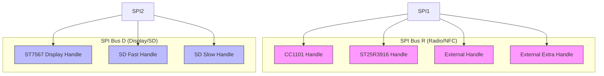
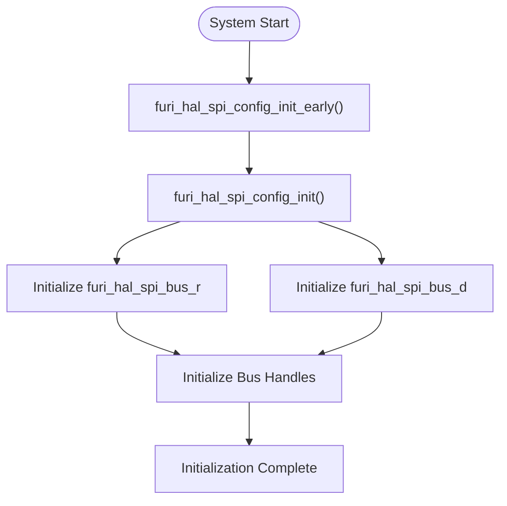
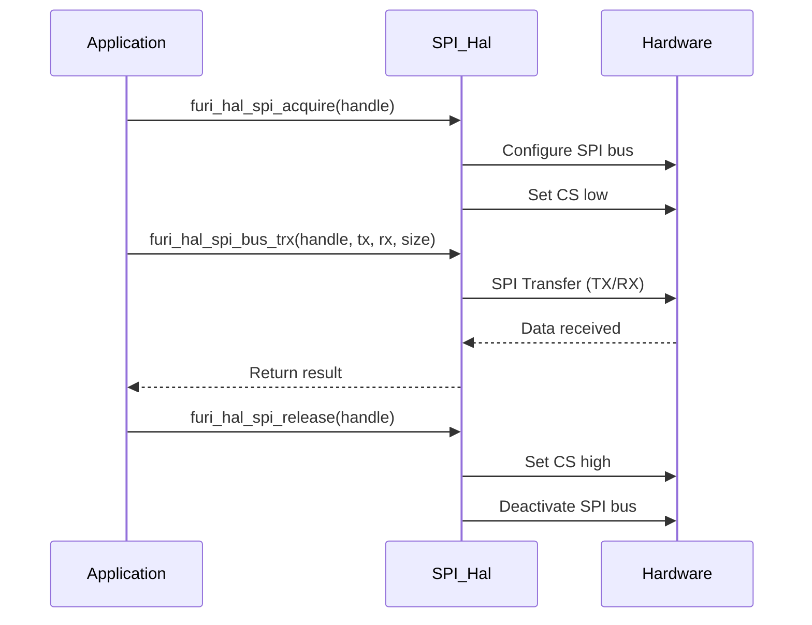
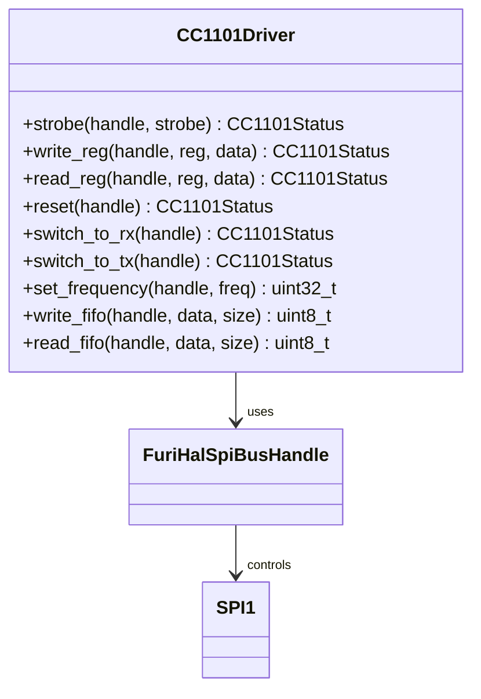
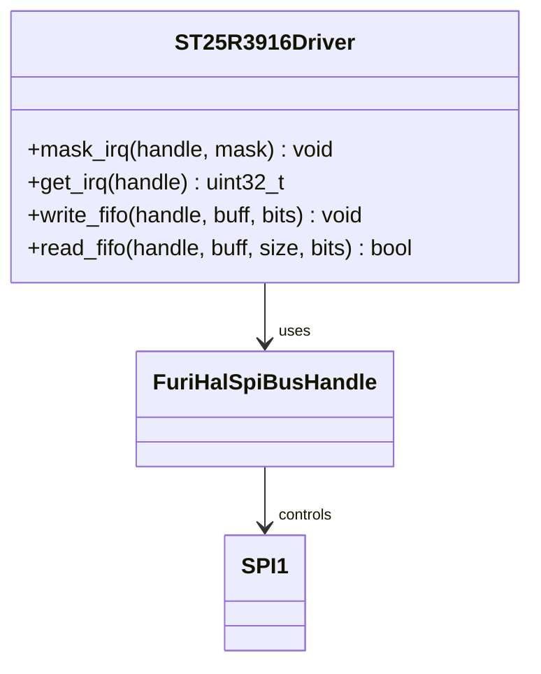
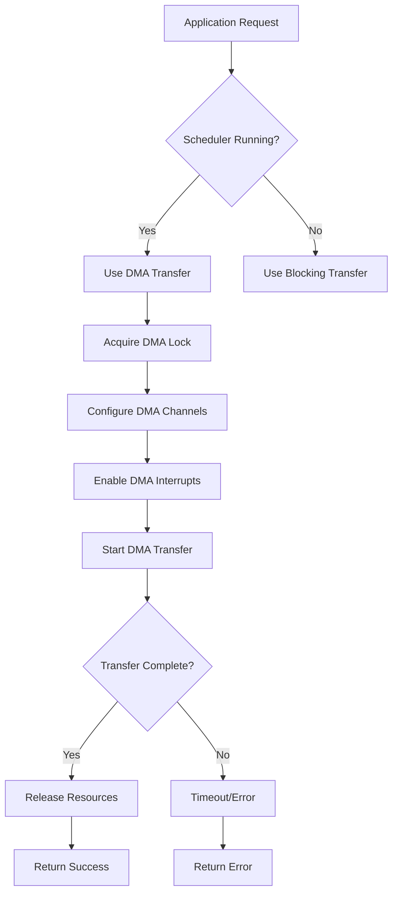
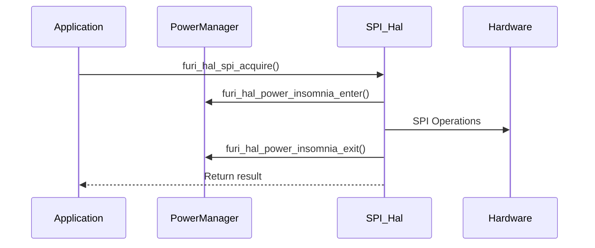

# SPI Interface

<cite>
**Referenced Files in This Document**   
- [furi_hal_spi.h](file://targets/furi_hal_include/furi_hal_spi.h#L1-L129)
- [furi_hal_spi_config.h](file://targets/f7/furi_hal/furi_hal_spi_config.h#L1-L76)
- [furi_hal_spi_types.h](file://targets/f7/furi_hal/furi_hal_spi_types.h#L1-L63)
- [furi_hal_spi.c](file://targets/f7/furi_hal/furi_hal_spi.c#L1-L379)
- [furi_hal_spi_config.c](file://targets/f7/furi_hal/furi_hal_spi_config.c#L1-L447)
- [cc1101.h](file://lib/drivers/cc1101.h#L1-L196)
- [cc1101.c](file://lib/drivers/cc1101.c#L1-L1000)
- [st25r3916.h](file://lib/drivers/st25r3916.h#L1-L114)
- [st25r3916.c](file://lib/drivers/st25r3916.c#L1-L1000)
</cite>

## Table of Contents
1. [Introduction](#introduction)
2. [SPI Bus Architecture](#spi-bus-architecture)
3. [Initialization and Configuration](#initialization-and-configuration)
4. [SPI Transaction Model](#spi-transaction-model)
5. [Device-Specific Implementations](#device-specific-implementations)
6. [DMA Support and Performance](#dma-support-and-performance)
7. [Error Handling and Power Management](#error-handling-and-power-management)
8. [Conclusion](#conclusion)

## Introduction
The SPI (Serial Peripheral Interface) subsystem in the Flipper Zero firmware provides a robust interface for communicating with various peripheral devices such as radio transceivers, NFC/RFID frontends, and LED drivers. This document details the architecture, configuration, and usage of the SPI subsystem, focusing on initialization, transaction models, DMA support, and device-specific implementations.

**Section sources**
- [furi_hal_spi.h](file://targets/furi_hal_include/furi_hal_spi.h#L1-L129)
- [furi_hal_spi_config.h](file://targets/f7/furi_hal/furi_hal_spi_config.h#L1-L76)

## SPI Bus Architecture
The SPI subsystem is designed with a modular architecture that supports multiple SPI buses and handles. The system is divided into two main buses: `furi_hal_spi_bus_r` for radio and NFC devices, and `furi_hal_spi_bus_d` for display and SD card operations.

**Diagram sources**
- [furi_hal_spi_config.h](file://targets/f7/furi_hal/furi_hal_spi_config.h#L1-L76)
- [furi_hal_spi_types.h](file://targets/f7/furi_hal/furi_hal_spi_types.h#L1-L63)

**Section sources**
- [furi_hal_spi_types.h](file://targets/f7/furi_hal/furi_hal_spi_types.h#L1-L63)
- [furi_hal_spi_config.h](file://targets/f7/furi_hal/furi_hal_spi_config.h#L1-L76)

## Initialization and Configuration
The SPI subsystem initialization occurs in multiple phases, starting with early configuration and culminating in full initialization. The system uses callback mechanisms to manage bus and handle events.

### Bus Initialization
The SPI buses are initialized through a series of functions that set up the hardware and configure the necessary GPIO pins. The initialization process includes:

- **Early Initialization**: Configures basic bus parameters and initializes mutexes for bus access control.
- **Full Initialization**: Completes the setup by initializing all predefined bus handles.

**Diagram sources**
- [furi_hal_spi_config.c](file://targets/f7/furi_hal/furi_hal_spi_config.c#L1-L447)

**Section sources**
- [furi_hal_spi_config.c](file://targets/f7/furi_hal/furi_hal_spi_config.c#L1-L447)
- [furi_hal_spi.c](file://targets/f7/furi_hal/furi_hal_spi.c#L1-L379)

### Configuration Presets
The system defines several configuration presets for different devices, specifying parameters such as clock polarity, phase, and baud rate:

| Preset | Device | Clock Polarity | Clock Phase | Baud Rate | Data Width |
|--------|--------|----------------|-------------|-----------|------------|
| furi_hal_spi_preset_2edge_low_8m | ST25R3916 (NFC) | Low | 2EDGE | 8MHz | 8-bit |
| furi_hal_spi_preset_1edge_low_8m | CC1101 (Radio) | Low | 1EDGE | 8MHz | 8-bit |
| furi_hal_spi_preset_1edge_low_4m | ST7567 (Display) | Low | 1EDGE | 4MHz | 8-bit |
| furi_hal_spi_preset_1edge_low_16m | SD Card (Fast) | Low | 1EDGE | 16MHz | 8-bit |
| furi_hal_spi_preset_1edge_low_2m | SD Card (Slow)/External | Low | 1EDGE | 2MHz | 8-bit |

**Section sources**
- [furi_hal_spi_config.c](file://targets/f7/furi_hal/furi_hal_spi_config.c#L1-L447)

## SPI Transaction Model
The SPI subsystem provides a comprehensive transaction model that supports various communication patterns, including receive, transmit, and duplex operations.

### Transaction Functions
The core transaction functions are:

- **furi_hal_spi_bus_rx**: Receives data from a device
- **furi_hal_spi_bus_tx**: Transmits data to a device
- **furi_hal_spi_bus_trx**: Performs simultaneous transmit and receive operations
- **furi_hal_spi_bus_trx_dma**: DMA-based transmit and receive operations

**Diagram sources**
- [furi_hal_spi.c](file://targets/f7/furi_hal/furi_hal_spi.c#L1-L379)

**Section sources**
- [furi_hal_spi.c](file://targets/f7/furi_hal/furi_hal_spi.c#L1-L379)

### Chip Select Management
Chip select (CS) management is handled automatically during the acquire and release operations:

1. **Acquire**: Takes ownership of the SPI bus, enables the SPI peripheral, and asserts the CS line
2. **Release**: Releases ownership, disables the SPI peripheral, and deasserts the CS line

This ensures that only one device can communicate on a bus at a time, preventing bus contention.

## Device-Specific Implementations

### CC1101 Radio Transceiver
The CC1101 driver provides both low-level and high-level APIs for configuring and operating the radio transceiver.

**Diagram sources**
- [cc1101.h](file://lib/drivers/cc1101.h#L1-L196)
- [cc1101.c](file://lib/drivers/cc1101.c#L1-L1000)

**Section sources**
- [cc1101.h](file://lib/drivers/cc1101.h#L1-L196)
- [cc1101.c](file://lib/drivers/cc1101.c#L1-L1000)

### ST25R3916 NFC/RFID Frontend
The ST25R3916 driver provides interrupt management and FIFO operations for NFC communications.

**Diagram sources**
- [st25r3916.h](file://lib/drivers/st25r3916.h#L1-L114)
- [st25r3916.c](file://lib/drivers/st25r3916.c#L1-L1000)

**Section sources**
- [st25r3916.h](file://lib/drivers/st25r3916.h#L1-L114)
- [st25r3916.c](file://lib/drivers/st25r3916.c#L1-L1000)

### LP5562 LED Driver
**Note**: The LP5562 LED driver uses I2C rather than SPI, as evidenced by its header file including `furi_hal_i2c.h` instead of `furi_hal_spi.h`. This device is not SPI-based.

## DMA Support and Performance
The SPI subsystem includes DMA (Direct Memory Access) support for high-speed data transfers, particularly beneficial for SD card operations and display updates.

### DMA Architecture
The DMA system uses a semaphore-based synchronization mechanism to coordinate transfers:

**Diagram sources**
- [furi_hal_spi.c](file://targets/f7/furi_hal/furi_hal_spi.c#L1-L379)

**Section sources**
- [furi_hal_spi.c](file://targets/f7/furi_hal/furi_hal_spi.c#L1-L379)

### Performance Considerations
The system optimizes performance through:

- **Baud Rate Selection**: Different presets for various speed requirements
- **DMA for Large Transfers**: Reduces CPU overhead for bulk data operations
- **Bus Multiplexing**: Two separate SPI buses (SPI1 and SPI2) to enable concurrent operations
- **Mutex Protection**: Ensures thread-safe access to shared bus resources

## Error Handling and Power Management
The SPI subsystem incorporates robust error handling and power optimization features.

### Error Handling
The system uses several mechanisms for error detection and recovery:

- **furi_check()**: Validates function preconditions and parameters
- **furi_crash()**: Terminates execution on critical programming errors
- **Timeout Mechanisms**: Prevents infinite blocking in transaction functions
- **DMA Error Detection**: Monitors for DMA transfer timeouts

### Power Optimization
The system implements power-saving features through:

- **Power Insomnia Management**: Prevents system sleep during SPI operations
- **Peripheral Power Control**: Enables/disables SPI peripherals only when needed
- **GPIO State Management**: Configures pins to low-power states when inactive

**Diagram sources**
- [furi_hal_spi.c](file://targets/f7/furi_hal/furi_hal_spi.c#L1-L379)

**Section sources**
- [furi_hal_spi.c](file://targets/f7/furi_hal/furi_hal_spi.c#L1-L379)

## Conclusion
The SPI subsystem in the Flipper Zero firmware provides a comprehensive, efficient, and reliable interface for communicating with peripheral devices. Its modular architecture supports multiple buses and devices with appropriate configuration presets for different speed and timing requirements. The system's support for DMA enables high-performance data transfers while maintaining power efficiency through careful resource management. The transaction model with proper chip select management ensures reliable communication, and the comprehensive error handling mechanisms contribute to system stability.

The implementation demonstrates thoughtful design with features like early and full initialization phases, mutex-based bus sharing, and power management integration. This makes the SPI subsystem well-suited for the embedded environment of the Flipper Zero device, balancing performance, reliability, and power efficiency requirements.