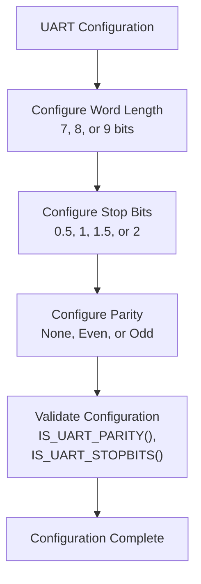
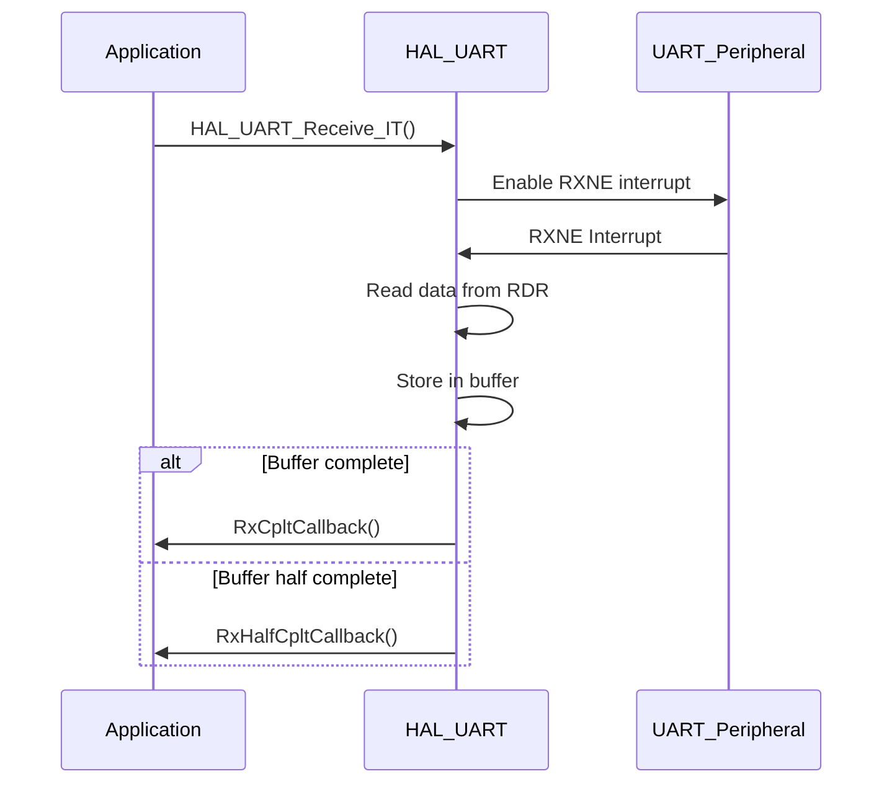
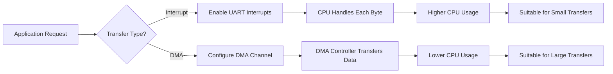
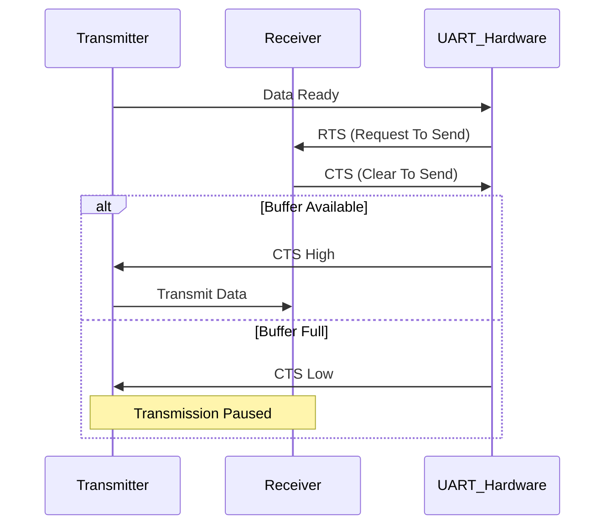
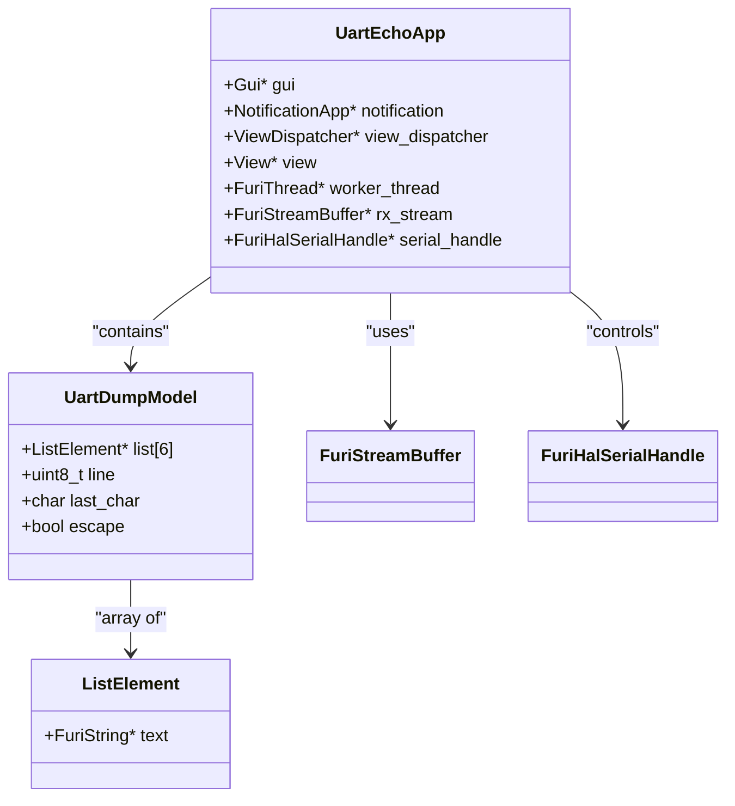
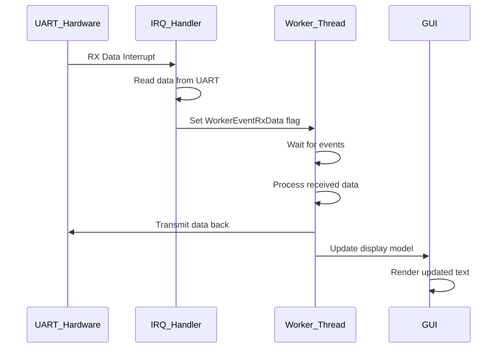
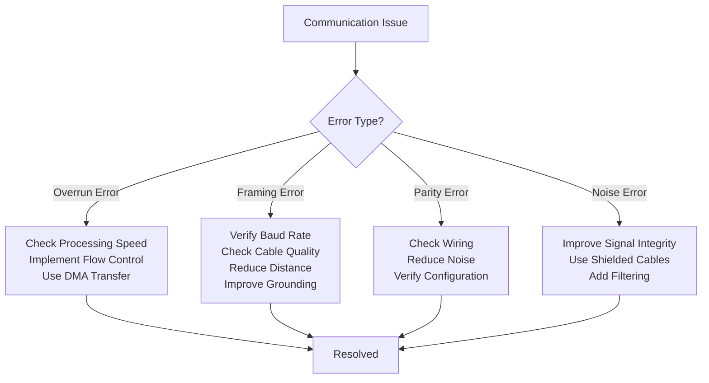

# UART Interface

<cite>
**Referenced Files in This Document**   
- [stm32wbxx_hal_uart.h](file://lib/stm32wb_hal/Inc/stm32wbxx_hal_uart.h#L0-L1749)
- [uart_echo.c](file://applications/debug/uart_echo/uart_echo.c#L0-L340)
</cite>

## Table of Contents
1. [Introduction](#introduction)
2. [UART Configuration Parameters](#uart-configuration-parameters)
3. [Data Transfer Methods](#data-transfer-methods)
4. [Advanced UART Features](#advanced-uart-features)
5. [UART Echo Debug Application](#uart-echo-debug-application)
6. [Error Handling and Common Issues](#error-handling-and-common-issues)
7. [Implementation Examples](#implementation-examples)

## Introduction
The UART (Universal Asynchronous Receiver-Transmitter) interface provides a fundamental serial communication capability for the Flipper Zero device. This documentation details the configuration, operation, and advanced features of the UART subsystem based on the STM32WB HAL implementation. The UART interface supports various communication parameters including baud rates, data bits, stop bits, and parity settings, enabling flexible integration with external devices and debugging tools.

**Section sources**
- [stm32wbxx_hal_uart.h](file://lib/stm32wb_hal/Inc/stm32wbxx_hal_uart.h#L0-L100)

## UART Configuration Parameters

### Baud Rate Configuration
The baud rate determines the speed of serial communication and is configured through the `BaudRate` member of the `UART_InitTypeDef` structure. The STM32WB UART peripheral calculates the baud rate register value based on the input clock frequency and prescaler settings. The maximum supported baud rate is 8,000,000, derived from the maximum clock frequency (64 MHz) divided by the minimum oversampling factor (8).

```c
typedef struct {
    uint32_t BaudRate;                  /*!< UART communication baud rate */
    uint32_t WordLength;                /*!< Number of data bits */
    uint32_t StopBits;                  /*!< Number of stop bits */
    uint32_t Parity;                    /*!< Parity mode */
    uint32_t Mode;                      /*!< Transmit/Receive mode */
    uint32_t HwFlowCtl;                 /*!< Hardware flow control */
    uint32_t OverSampling;              /*!< Oversampling method */
    uint32_t OneBitSampling;            /*!< Single sample method */
    uint32_t ClockPrescaler;            /*!< Clock prescaler value */
} UART_InitTypeDef;
```

**Section sources**
- [stm32wbxx_hal_uart.h](file://lib/stm32wb_hal/Inc/stm32wbxx_hal_uart.h#L50-L100)

### Data, Stop Bits, and Parity Settings
The UART configuration supports flexible data framing options:

**Data Bits (Word Length)**
- Configured through the `WordLength` parameter
- Supports 7, 8, or 9 data bits per frame

**Stop Bits**
- Configurable options include:
  - UART_STOPBITS_0_5: 0.5 stop bits
  - UART_STOPBITS_1: 1 stop bit (default)
  - UART_STOPBITS_1_5: 1.5 stop bits
  - UART_STOPBITS_2: 2 stop bits

**Parity Settings**
- UART_PARITY_NONE: No parity checking
- UART_PARITY_EVEN: Even parity
- UART_PARITY_ODD: Odd parity
- When parity is enabled, the computed parity bit is inserted at the MSB position of the transmitted data



**Diagram sources**
- [stm32wbxx_hal_uart.h](file://lib/stm32wb_hal/Inc/stm32wbxx_hal_uart.h#L150-L200)
- [stm32wbxx_hal_uart.h](file://lib/stm32wb_hal/Inc/stm32wbxx_hal_uart.h#L400-L450)

**Section sources**
- [stm32wbxx_hal_uart.h](file://lib/stm32wb_hal/Inc/stm32wbxx_hal_uart.h#L150-L200)
- [stm32wbxx_hal_uart.h](file://lib/stm32wb_hal/Inc/stm32wbxx_hal_uart.h#L400-L450)

## Data Transfer Methods

### Interrupt-Driven Data Transfer
The UART subsystem supports interrupt-driven data transfer, allowing non-blocking communication. The HAL provides functions for initiating transmission and reception with interrupt notification:

```c
HAL_StatusTypeDef HAL_UART_Transmit_IT(UART_HandleTypeDef *huart, const uint8_t *pData, uint16_t Size);
HAL_StatusTypeDef HAL_UART_Receive_IT(UART_HandleTypeDef *huart, uint8_t *pData, uint16_t Size);
```

When interrupt-driven transfer is initiated, the UART peripheral generates interrupts for various events:
- UART_IT_TXE: Transmit data register empty
- UART_IT_RXNE: Receive data register not empty
- UART_IT_TC: Transmission complete
- UART_IT_IDLE: Idle line detected

The interrupt handler `HAL_UART_IRQHandler()` processes these events and calls appropriate callback functions such as `HAL_UART_TxCpltCallback()` and `HAL_UART_RxCpltCallback()` upon completion.



**Diagram sources**
- [stm32wbxx_hal_uart.h](file://lib/stm32wb_hal/Inc/stm32wbxx_hal_uart.h#L800-L900)
- [stm32wbxx_hal_uart.h](file://lib/stm32wb_hal/Inc/stm32wbxx_hal_uart.h#L1600-L1650)

**Section sources**
- [stm32wbxx_hal_uart.h](file://lib/stm32wb_hal/Inc/stm32wbxx_hal_uart.h#L800-L900)
- [stm32wbxx_hal_uart.h](file://lib/stm32wb_hal/Inc/stm32wbxx_hal_uart.h#L1600-L1650)

### DMA-Based Data Transfer
For high-throughput applications, the UART subsystem supports DMA (Direct Memory Access) based data transfer, which minimizes CPU involvement during data transfer operations:

```c
HAL_StatusTypeDef HAL_UART_Transmit_DMA(UART_HandleTypeDef *huart, const uint8_t *pData, uint16_t Size);
HAL_StatusTypeDef HAL_UART_Receive_DMA(UART_HandleTypeDef *huart, uint8_t *pData, uint16_t Size);
```

DMA transfer offers several advantages:
- Reduced CPU overhead
- Higher data throughput
- Efficient handling of large data transfers
- Support for background data transfer while CPU performs other tasks

The DMA transfer can be controlled with additional functions:
- `HAL_UART_DMAPause()`: Pause DMA transfer
- `HAL_UART_DMAResume()`: Resume paused DMA transfer
- `HAL_UART_DMAStop()`: Stop DMA transfer



**Diagram sources**
- [stm32wbxx_hal_uart.h](file://lib/stm32wb_hal/Inc/stm32wbxx_hal_uart.h#L1650-L1700)

**Section sources**
- [stm32wbxx_hal_uart.h](file://lib/stm32wb_hal/Inc/stm32wbxx_hal_uart.h#L1650-L1700)

## Advanced UART Features

### Hardware Flow Control (RTS/CTS)
The UART interface supports hardware flow control using RTS (Request To Send) and CTS (Clear To Send) signals to prevent data loss during high-speed communication:

```c
// Hardware flow control options
#define UART_HWCONTROL_NONE        0x00000000U  /*!< No hardware control */
#define UART_HWCONTROL_RTS         USART_CR3_RTSE  /*!< Request To Send */
#define UART_HWCONTROL_CTS         USART_CR3_CTSE  /*!< Clear To Send */
#define UART_HWCONTROL_RTS_CTS     (USART_CR3_RTSE | USART_CR3_CTSE)  /*!< RTS and CTS */
```

Hardware flow control can be enabled/disabled using dedicated macros:
- `__HAL_UART_HWCONTROL_CTS_ENABLE()`: Enable CTS flow control
- `__HAL_UART_HWCONTROL_CTS_DISABLE()`: Disable CTS flow control
- `__HAL_UART_HWCONTROL_RTS_ENABLE()`: Enable RTS flow control
- `__HAL_UART_HWCONTROL_RTS_DISABLE()`: Disable RTS flow control



**Diagram sources**
- [stm32wbxx_hal_uart.h](file://lib/stm32wb_hal/Inc/stm32wbxx_hal_uart.h#L400-L450)
- [stm32wbxx_hal_uart.h](file://lib/stm32wb_hal/Inc/stm32wbxx_hal_uart.h#L1200-L1400)

**Section sources**
- [stm32wbxx_hal_uart.h](file://lib/stm32wb_hal/Inc/stm32wbxx_hal_uart.h#L400-L450)
- [stm32wbxx_hal_uart.h](file://lib/stm32wb_hal/Inc/stm32wbxx_hal_uart.h#L1200-L1400)

### LIN Bus Support
The UART peripheral includes built-in support for LIN (Local Interconnect Network) bus protocol, commonly used in automotive applications:

```c
// LIN mode configuration
#define UART_LIN_DISABLE    0x00000000U    /*!< LIN disable */
#define UART_LIN_ENABLE     USART_CR2_LINEN  /*!< LIN enable */

// LIN break detection length
#define UART_LINBREAKDETECTLENGTH_10B    0x00000000U  /*!< 10-bit break detection */
#define UART_LINBREAKDETECTLENGTH_11B    USART_CR2_LBDL  /*!< 11-bit break detection */
```

Key LIN features:
- Automatic break detection
- Synchronization with LIN header
- Support for LIN master and slave modes
- Configurable break detection length (10 or 11 bits)

LIN mode is configured using the `HAL_LIN_Init()` function, which sets up the UART peripheral for LIN protocol operation with specified break detection length.

**Section sources**
- [stm32wbxx_hal_uart.h](file://lib/stm32wb_hal/Inc/stm32wbxx_hal_uart.h#L600-L650)

### Synchronous Mode Operation
The UART interface can operate in synchronous mode, where a clock signal is provided for data synchronization. This mode is useful for applications requiring precise timing:

```c
// Synchronous mode is configured through advanced features
typedef struct {
    uint32_t AdvFeatureInit;
    uint32_t ClockPrescaler;            /*!< Clock prescaler for synchronous mode */
    // ... other fields
} UART_AdvFeatureInitTypeDef;
```

Synchronous mode benefits:
- Precise data sampling
- Elimination of clock drift issues
- Support for higher data rates
- Improved noise immunity

**Section sources**
- [stm32wbxx_hal_uart.h](file://lib/stm32wb_hal/Inc/stm32wbxx_hal_uart.h#L100-L150)

## UART Echo Debug Application

### Application Architecture
The UART echo application serves as a debugging tool that receives data through the UART interface and immediately transmits it back, creating an "echo" effect. The application architecture consists of several components:

```c
typedef struct {
    Gui* gui;
    NotificationApp* notification;
    ViewDispatcher* view_dispatcher;
    View* view;
    FuriThread* worker_thread;
    FuriStreamBuffer* rx_stream;
    FuriHalSerialHandle* serial_handle;
} UartEchoApp;
```

Key components:
- **GUI System**: Displays received data on the screen
- **Worker Thread**: Handles UART interrupts and data processing
- **Stream Buffer**: Temporarily stores received data
- **Serial Handle**: Interface to the UART hardware



**Diagram sources**
- [uart_echo.c](file://applications/debug/uart_echo/uart_echo.c#L20-L50)

**Section sources**
- [uart_echo.c](file://applications/debug/uart_echo/uart_echo.c#L20-L100)

### Interrupt Handling and Data Flow
The UART echo application uses an interrupt-driven approach to handle incoming data efficiently:

```c
static void uart_echo_on_irq_cb(FuriHalSerialHandle* handle, FuriHalSerialRxEvent event, void* context) {
    UartEchoApp* app = context;
    WorkerEventFlags flag = 0;

    if(event & FuriHalSerialRxEventData) {
        uint8_t data = furi_hal_serial_async_rx(handle);
        furi_stream_buffer_send(app->rx_stream, &data, 1, 0);
        flag |= WorkerEventRxData;
    }

    if(event & FuriHalSerialRxEventIdle) {
        flag |= WorkerEventRxIdle;
    }

    // Error handling
    if(event & FuriHalSerialRxEventFrameError) {
        flag |= WorkerEventRxFramingError;
    }
    if(event & FuriHalSerialRxEventOverrunError) {
        flag |= WorkerEventRxOverrunError;
    }

    furi_thread_flags_set(furi_thread_get_id(app->worker_thread), flag);
}
```

The data flow follows this sequence:
1. UART interrupt occurs when data is received
2. Interrupt callback reads data and stores it in stream buffer
3. Worker thread is notified via thread flags
4. Worker thread processes the data and transmits it back
5. Data is also displayed on the screen through the GUI model



**Diagram sources**
- [uart_echo.c](file://applications/debug/uart_echo/uart_echo.c#L100-L150)

**Section sources**
- [uart_echo.c](file://applications/debug/uart_echo/uart_echo.c#L100-L200)

## Error Handling and Common Issues

### Error Detection and Reporting
The UART subsystem provides comprehensive error detection mechanisms:

```c
// Error codes
#define HAL_UART_ERROR_NONE      (0x00000000U)  /*!< No error */
#define HAL_UART_ERROR_PE        (0x00000001U)  /*!< Parity error */
#define HAL_UART_ERROR_NE        (0x00000002U)  /*!< Noise error */
#define HAL_UART_ERROR_FE        (0x00000004U)  /*!< Frame error */
#define HAL_UART_ERROR_ORE       (0x00000008U)  /*!< Overrun error */
#define HAL_UART_ERROR_DMA       (0x00000010U)  /*!< DMA transfer error */
#define HAL_UART_ERROR_RTO       (0x00000020U)  /*!< Receiver Timeout error */
```

Errors are reported through:
- The `ErrorCode` field in the `UART_HandleTypeDef`
- Error callback functions (`HAL_UART_ErrorCallback()`)
- Status flags in the UART interrupt and status registers

### Buffer Overruns
Buffer overruns occur when data is received faster than it can be processed. The UART echo application handles this by:

1. Using a stream buffer to temporarily store incoming data
2. Processing data in a dedicated worker thread
3. Monitoring for overrun events and reporting them

```c
if(event & FuriHalSerialRxEventOverrunError) {
    flag |= WorkerEventRxOverrunError;
}
```

Prevention strategies:
- Use DMA for high-speed data transfer
- Optimize data processing code
- Increase buffer sizes when possible
- Implement flow control

### Framing Errors
Framing errors occur when the stop bit is not detected properly, indicating timing issues or noise on the communication line:

```c
if(event & FuriHalSerialRxEventFrameError) {
    flag |= WorkerEventRxFramingError;
}
```

Common causes:
- Baud rate mismatch between transmitter and receiver
- Excessive cable length
- Electrical noise
- Poor signal integrity

Troubleshooting steps:
1. Verify baud rate settings on both ends
2. Check cable connections and quality
3. Reduce communication distance
4. Implement proper grounding
5. Consider using lower baud rates



**Diagram sources**
- [stm32wbxx_hal_uart.h](file://lib/stm32wb_hal/Inc/stm32wbxx_hal_uart.h#L250-L300)
- [uart_echo.c](file://applications/debug/uart_echo/uart_echo.c#L150-L200)

**Section sources**
- [stm32wbxx_hal_uart.h](file://lib/stm32wb_hal/Inc/stm32wbxx_hal_uart.h#L250-L300)
- [uart_echo.c](file://applications/debug/uart_echo/uart_echo.c#L150-L200)

## Implementation Examples

### Basic UART Configuration
```c
UART_HandleTypeDef huart;
UART_InitTypeDef init_config;

// Initialize UART handle
huart.Instance = USART1;
huart.Init.BaudRate = 115200;
huart.Init.WordLength = UART_WORDLENGTH_8B;
huart.Init.StopBits = UART_STOPBITS_1;
huart.Init.Parity = UART_PARITY_NONE;
huart.Init.Mode = UART_MODE_TX_RX;
huart.Init.HwFlowCtl = UART_HWCONTROL_NONE;
huart.Init.OverSampling = UART_OVERSAMPLING_16;
huart.Init.OneBitSampling = UART_ONE_BIT_SAMPLE_DISABLE;

// Initialize UART
if(HAL_UART_Init(&huart) != HAL_OK) {
    // Initialization error
    Error_Handler();
}
```

### UART with Hardware Flow Control
```c
// Configure UART with RTS/CTS flow control
huart.Init.HwFlowCtl = UART_HWCONTROL_RTS_CTS;

// Enable flow control after initialization
__HAL_UART_HWCONTROL_RTS_ENABLE(&huart);
__HAL_UART_HWCONTROL_CTS_ENABLE(&huart);
```

### Interrupt-Driven Communication
```c
uint8_t rx_buffer[256];
uint8_t tx_buffer[] = "Hello UART!";

// Start interrupt-driven reception
HAL_UART_Receive_IT(&huart, rx_buffer, sizeof(rx_buffer));

// Start interrupt-driven transmission
HAL_UART_Transmit_IT(&huart, tx_buffer, sizeof(tx_buffer));

// Implement callback functions
void HAL_UART_RxCpltCallback(UART_HandleTypeDef *huart) {
    // Reception complete - process data
    ProcessReceivedData();
    
    // Restart reception
    HAL_UART_Receive_IT(huart, rx_buffer, sizeof(rx_buffer));
}

void HAL_UART_TxCpltCallback(UART_HandleTypeDef *huart) {
    // Transmission complete
    TransmissionComplete = true;
}
```

### DMA-Based High-Speed Transfer
```c
uint8_t large_tx_buffer[1024];
uint8_t large_rx_buffer[1024];

// Configure DMA for UART
huart.hdmatx = &hdma_usart1_tx;
huart.hdmarx = &hdma_usart1_rx;

// Start DMA transmission
HAL_UART_Transmit_DMA(&huart, large_tx_buffer, sizeof(large_tx_buffer));

// Start DMA reception
HAL_UART_Receive_DMA(&huart, large_rx_buffer, sizeof(large_rx_buffer));

// Handle DMA completion
void HAL_UART_TxHalfCpltCallback(UART_HandleTypeDef *huart) {
    // Half of transmission complete - can update first half of buffer
    UpdateFirstHalfOfBuffer();
}

void HAL_UART_TxCpltCallback(UART_HandleTypeDef *huart) {
    // Complete transmission - can restart or process data
    DMA_TransmissionComplete = true;
}
```

**Section sources**
- [stm32wbxx_hal_uart.h](file://lib/stm32wb_hal/Inc/stm32wbxx_hal_uart.h#L1600-L1700)
- [uart_echo.c](file://applications/debug/uart_echo/uart_echo.c#L200-L340)