# USB Interface

<cite>
**Referenced Files in This Document**   
- [usb.h](file://lib/libusb_stm32/inc/usb.h)
- [usb_std.h](file://lib/libusb_stm32/inc/usb_std.h)
- [usbd_core.h](file://lib/libusb_stm32/inc/usbd_core.h)
- [usb_cdc.h](file://lib/libusb_stm32/inc/usb_cdc.h)
- [usb_hid.h](file://lib/libusb_stm32/inc/usb_hid.h)
- [usb_dfu.h](file://lib/libusb_stm32/inc/usb_dfu.h)
- [usb_ccid.h](file://lib/libusb_stm32/inc/usb_ccid.h)
</cite>

## Table of Contents
1. [Introduction](#introduction)
2. [Project Structure](#project-structure)
3. [Core Components](#core-components)
4. [Architecture Overview](#architecture-overview)
5. [Detailed Component Analysis](#detailed-component-analysis)
6. [USB Device Modes Configuration](#usb-device-modes-configuration)
7. [Endpoint Management](#endpoint-management)
8. [Descriptor Structure](#descriptor-structure)
9. [Class-Specific Requests](#class-specific-requests)
10. [Enumeration Process](#enumeration-process)
11. [Advanced Features](#advanced-features)
12. [Implementation Examples](#implementation-examples)
13. [Physical Layer Considerations](#physical-layer-considerations)

## Introduction
This document provides comprehensive documentation for the USB subsystem in the Flipper Zero firmware. It covers the configuration of various USB device modes including CDC (Communication Device Class), HID (Human Interface Device), CCID (Chip Card Interface Device), and DFU (Device Firmware Upgrade). The documentation details the descriptor structure, class-specific requests, enumeration process, and advanced features such as remote wakeup and power management. The USB stack implementation is based on the Lightweight USB device Stack for STM32 microcontrollers, specifically tailored for the Flipper Zero's STM32WB55 microcontroller.

## Project Structure
The USB subsystem is organized within the libusb_stm32 library, which provides a lightweight USB device stack implementation for STM32 microcontrollers. The structure follows a modular approach with clear separation between core USB functionality, class-specific implementations, and hardware abstraction.

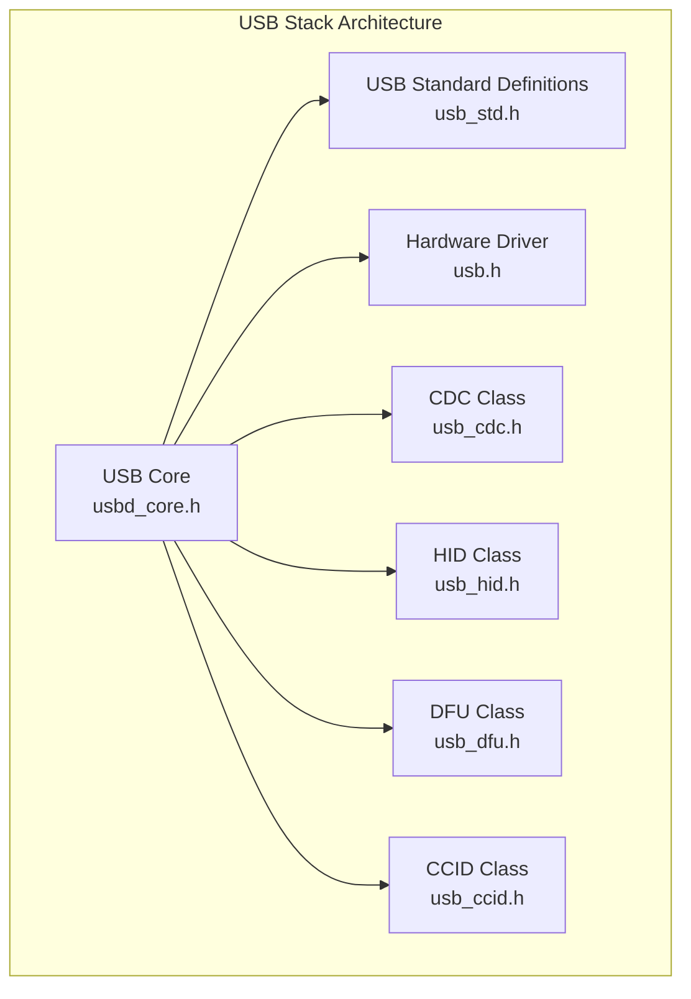
```mermaid
graph TD
subgraph "USB Stack Architecture"
USB_Core[USB Core<br>usbd_core.h]
USB_Std[USB Standard Definitions<br>usb_std.h]
USB_Hardware[Hardware Driver<br>usb.h]
USB_CDC[CDC Class<br>usb_cdc.h]
USB_HID[HID Class<br>usb_hid.h]
USB_DFU[DFU Class<br>usb_dfu.h]
USB_CCID[CCID Class<br>usb_ccid.h]
USB_Core --> USB_Std
USB_Core --> USB_Hardware
USB_Core --> USB_CDC
USB_Core --> USB_HID
USB_Core --> USB_DFU
USB_Core --> USB_CCID
end
```

**Diagram sources**
- [usb.h](file://lib/libusb_stm32/inc/usb.h)
- [usb_std.h](file://lib/libusb_stm32/inc/usb_std.h)
- [usbd_core.h](file://lib/libusb_stm32/inc/usbd_core.h)

**Section sources**
- [usb.h](file://lib/libusb_stm32/inc/usb.h)
- [usb_std.h](file://lib/libusb_stm32/inc/usb_std.h)

## Core Components
The USB subsystem consists of several core components that work together to provide USB device functionality. The main components include the USB core driver, standard USB definitions, hardware abstraction layer, and class-specific implementations. The core component is the usbd_core.h header which defines the fundamental data structures and functions for USB device operation, including the usbd_device structure that represents a USB device instance and the usbd_driver structure that defines the hardware driver interface.

**Section sources**
- [usbd_core.h](file://lib/libusb_stm32/inc/usbd_core.h)
- [usb_std.h](file://lib/libusb_stm32/inc/usb_std.h)

## Architecture Overview
The USB architecture follows a layered design pattern with clear separation between hardware abstraction, core USB functionality, and class-specific implementations. The hardware abstraction layer provides a consistent interface to the USB peripheral regardless of the specific STM32 microcontroller variant. The core layer implements the USB protocol stack and device state machine, while the class-specific layers implement the functionality for different USB device classes.

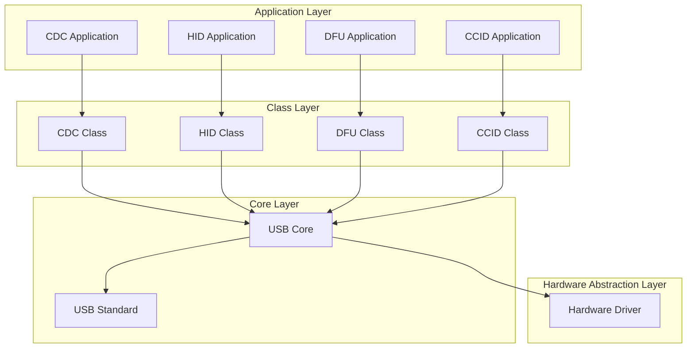
```mermaid
graph TD
subgraph "Application Layer"
CDC_App[CDC Application]
HID_App[HID Application]
DFU_App[DFU Application]
CCID_App[CCID Application]
end
subgraph "Class Layer"
USB_CDC[CDC Class]
USB_HID[HID Class]
USB_DFU[DFU Class]
USB_CCID[CCID Class]
end
subgraph "Core Layer"
USB_Core[USB Core]
USB_Std[USB Standard]
end
subgraph "Hardware Abstraction Layer"
USB_Hardware[Hardware Driver]
end
CDC_App --> USB_CDC
HID_App --> USB_HID
DFU_App --> USB_DFU
CCID_App --> USB_CCID
USB_CDC --> USB_Core
USB_HID --> USB_Core
USB_DFU --> USB_Core
USB_CCID --> USB_Core
USB_Core --> USB_Std
USB_Core --> USB_Hardware
```

**Diagram sources**
- [usbd_core.h](file://lib/libusb_stm32/inc/usbd_core.h)
- [usb_cdc.h](file://lib/libusb_stm32/inc/usb_cdc.h)
- [usb_hid.h](file://lib/libusb_stm32/inc/usb_hid.h)
- [usb_dfu.h](file://lib/libusb_stm32/inc/usb_dfu.h)
- [usb_ccid.h](file://lib/libusb_stm32/inc/usb_ccid.h)

## Detailed Component Analysis

### USB Core Analysis
The USB core component provides the fundamental functionality for USB device operation. It implements the USB device state machine, endpoint management, and control transfer processing.

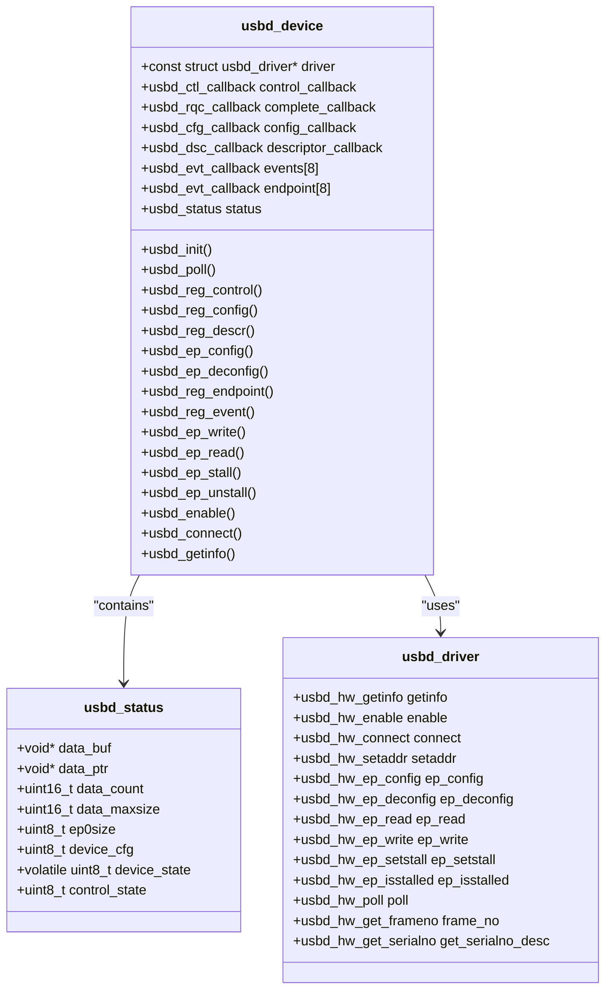
```mermaid
classDiagram
class usbd_device {
+const struct usbd_driver* driver
+usbd_ctl_callback control_callback
+usbd_rqc_callback complete_callback
+usbd_cfg_callback config_callback
+usbd_dsc_callback descriptor_callback
+usbd_evt_callback events[8]
+usbd_evt_callback endpoint[8]
+usbd_status status
+usbd_init()
+usbd_poll()
+usbd_reg_control()
+usbd_reg_config()
+usbd_reg_descr()
+usbd_ep_config()
+usbd_ep_deconfig()
+usbd_reg_endpoint()
+usbd_reg_event()
+usbd_ep_write()
+usbd_ep_read()
+usbd_ep_stall()
+usbd_ep_unstall()
+usbd_enable()
+usbd_connect()
+usbd_getinfo()
}
class usbd_status {
+void* data_buf
+void* data_ptr
+uint16_t data_count
+uint16_t data_maxsize
+uint8_t ep0size
+uint8_t device_cfg
+volatile uint8_t device_state
+uint8_t control_state
}
class usbd_driver {
+usbd_hw_getinfo getinfo
+usbd_hw_enable enable
+usbd_hw_connect connect
+usbd_hw_setaddr setaddr
+usbd_hw_ep_config ep_config
+usbd_hw_ep_deconfig ep_deconfig
+usbd_hw_ep_read ep_read
+usbd_hw_ep_write ep_write
+usbd_hw_ep_setstall ep_setstall
+usbd_hw_ep_isstalled ep_isstalled
+usbd_hw_poll poll
+usbd_hw_get_frameno frame_no
+usbd_hw_get_serialno get_serialno_desc
}
usbd_device --> usbd_status : "contains"
usbd_device --> usbd_driver : "uses"
```

**Diagram sources**
- [usbd_core.h](file://lib/libusb_stm32/inc/usbd_core.h)

**Section sources**
- [usbd_core.h](file://lib/libusb_stm32/inc/usbd_core.h)

### USB Standard Definitions Analysis
The USB standard definitions component provides the fundamental USB data structures and constants as defined in the USB specification.

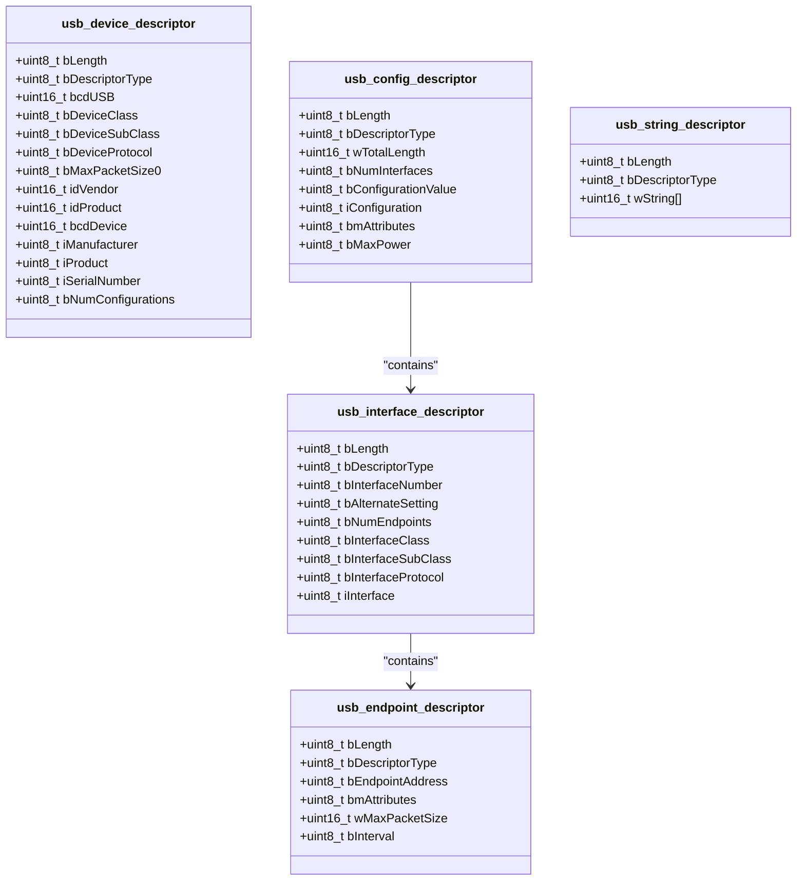
```mermaid
classDiagram
class usb_device_descriptor {
+uint8_t bLength
+uint8_t bDescriptorType
+uint16_t bcdUSB
+uint8_t bDeviceClass
+uint8_t bDeviceSubClass
+uint8_t bDeviceProtocol
+uint8_t bMaxPacketSize0
+uint16_t idVendor
+uint16_t idProduct
+uint16_t bcdDevice
+uint8_t iManufacturer
+uint8_t iProduct
+uint8_t iSerialNumber
+uint8_t bNumConfigurations
}
class usb_config_descriptor {
+uint8_t bLength
+uint8_t bDescriptorType
+uint16_t wTotalLength
+uint8_t bNumInterfaces
+uint8_t bConfigurationValue
+uint8_t iConfiguration
+uint8_t bmAttributes
+uint8_t bMaxPower
}
class usb_interface_descriptor {
+uint8_t bLength
+uint8_t bDescriptorType
+uint8_t bInterfaceNumber
+uint8_t bAlternateSetting
+uint8_t bNumEndpoints
+uint8_t bInterfaceClass
+uint8_t bInterfaceSubClass
+uint8_t bInterfaceProtocol
+uint8_t iInterface
}
class usb_endpoint_descriptor {
+uint8_t bLength
+uint8_t bDescriptorType
+uint8_t bEndpointAddress
+uint8_t bmAttributes
+uint16_t wMaxPacketSize
+uint8_t bInterval
}
class usb_string_descriptor {
+uint8_t bLength
+uint8_t bDescriptorType
+uint16_t wString[]
}
usb_config_descriptor --> usb_interface_descriptor : "contains"
usb_interface_descriptor --> usb_endpoint_descriptor : "contains"
```

**Diagram sources**
- [usb_std.h](file://lib/libusb_stm32/inc/usb_std.h)

**Section sources**
- [usb_std.h](file://lib/libusb_stm32/inc/usb_std.h)

## USB Device Modes Configuration
The USB subsystem supports multiple device modes including CDC, HID, CCID, and DFU. Each mode is configured through specific class descriptors and interface settings.

### CDC Mode Configuration
CDC (Communication Device Class) mode enables the device to appear as a virtual COM port to the host system. This mode is commonly used for serial communication and debugging.

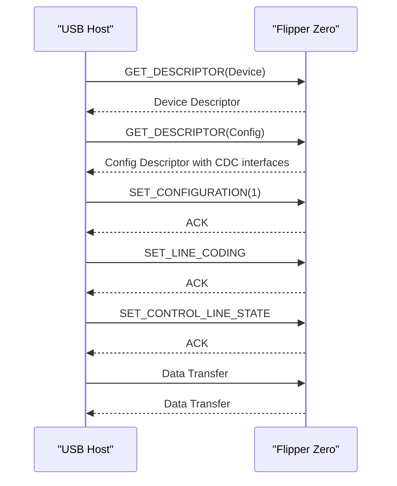
```mermaid
sequenceDiagram
participant Host as "USB Host"
participant Device as "Flipper Zero"
Host->>Device : GET_DESCRIPTOR(Device)
Device-->>Host : Device Descriptor
Host->>Device : GET_DESCRIPTOR(Config)
Device-->>Host : Config Descriptor with CDC interfaces
Host->>Device : SET_CONFIGURATION(1)
Device-->>Host : ACK
Host->>Device : SET_LINE_CODING
Device-->>Host : ACK
Host->>Device : SET_CONTROL_LINE_STATE
Device-->>Host : ACK
Host->>Device : Data Transfer
Device-->>Host : Data Transfer
```

**Diagram sources**
- [usb_cdc.h](file://lib/libusb_stm32/inc/usb_cdc.h)
- [usb_std.h](file://lib/libusb_stm32/inc/usb_std.h)

### HID Mode Configuration
HID (Human Interface Device) mode allows the device to emulate input devices such as keyboards, mice, or game controllers.

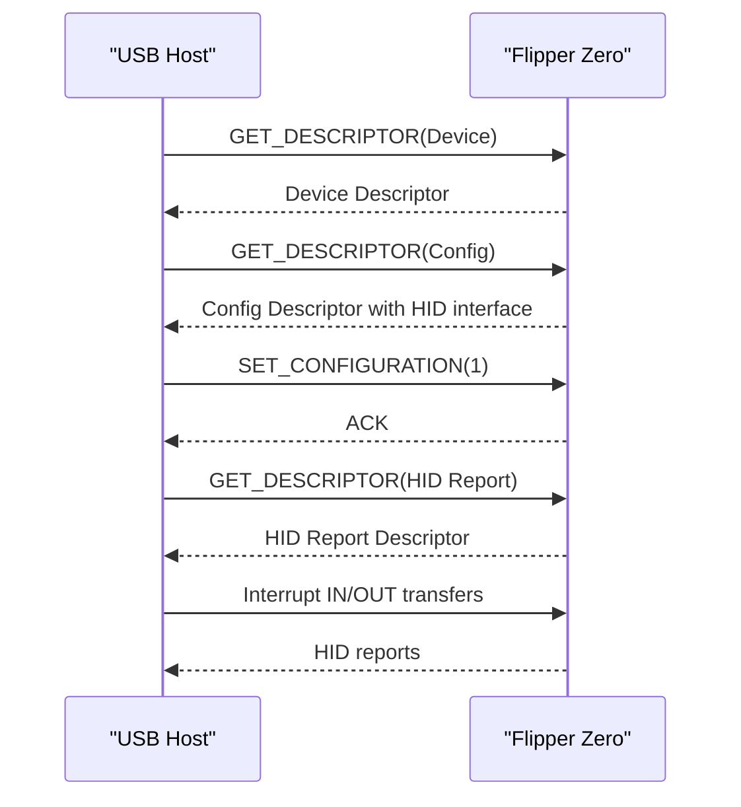
```mermaid
sequenceDiagram
participant Host as "USB Host"
participant Device as "Flipper Zero"
Host->>Device : GET_DESCRIPTOR(Device)
Device-->>Host : Device Descriptor
Host->>Device : GET_DESCRIPTOR(Config)
Device-->>Host : Config Descriptor with HID interface
Host->>Device : SET_CONFIGURATION(1)
Device-->>Host : ACK
Host->>Device : GET_DESCRIPTOR(HID Report)
Device-->>Host : HID Report Descriptor
Host->>Device : Interrupt IN/OUT transfers
Device-->>Host : HID reports
```

**Diagram sources**
- [usb_hid.h](file://lib/libusb_stm32/inc/usb_hid.h)
- [usb_std.h](file://lib/libusb_stm32/inc/usb_std.h)

### CCID Mode Configuration
CCID (Chip Card Interface Device) mode enables the device to act as a smart card reader, allowing communication with smart cards and secure elements.

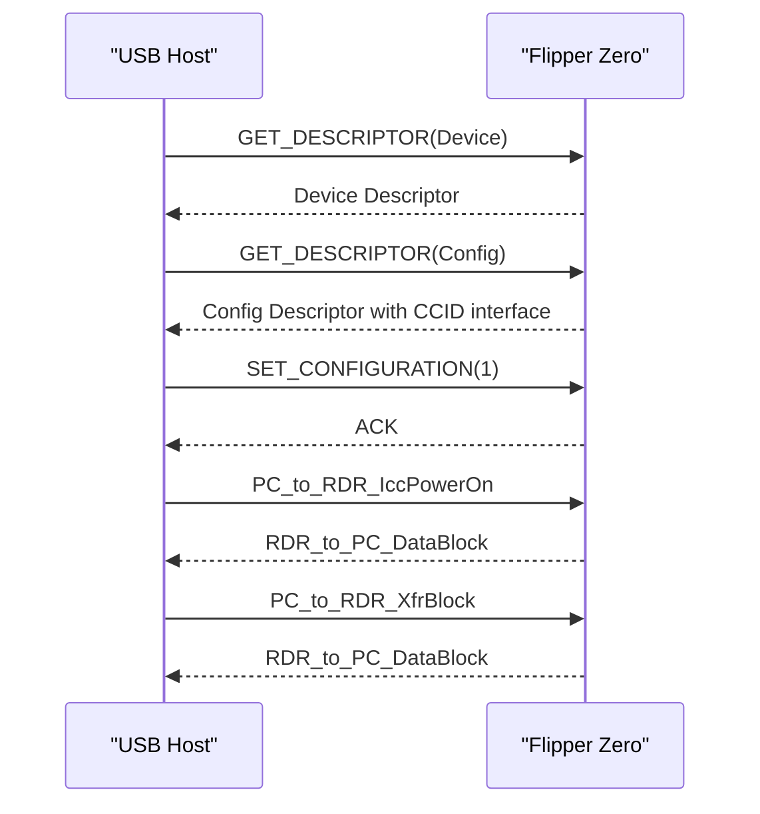
```mermaid
sequenceDiagram
participant Host as "USB Host"
participant Device as "Flipper Zero"
Host->>Device : GET_DESCRIPTOR(Device)
Device-->>Host : Device Descriptor
Host->>Device : GET_DESCRIPTOR(Config)
Device-->>Host : Config Descriptor with CCID interface
Host->>Device : SET_CONFIGURATION(1)
Device-->>Host : ACK
Host->>Device : PC_to_RDR_IccPowerOn
Device-->>Host : RDR_to_PC_DataBlock
Host->>Device : PC_to_RDR_XfrBlock
Device-->>Host : RDR_to_PC_DataBlock
```

**Diagram sources**
- [usb_ccid.h](file://lib/libusb_stm32/inc/usb_ccid.h)
- [usb_std.h](file://lib/libusb_stm32/inc/usb_std.h)

### DFU Mode Configuration
DFU (Device Firmware Upgrade) mode allows the device firmware to be updated over USB, providing a reliable method for firmware updates.

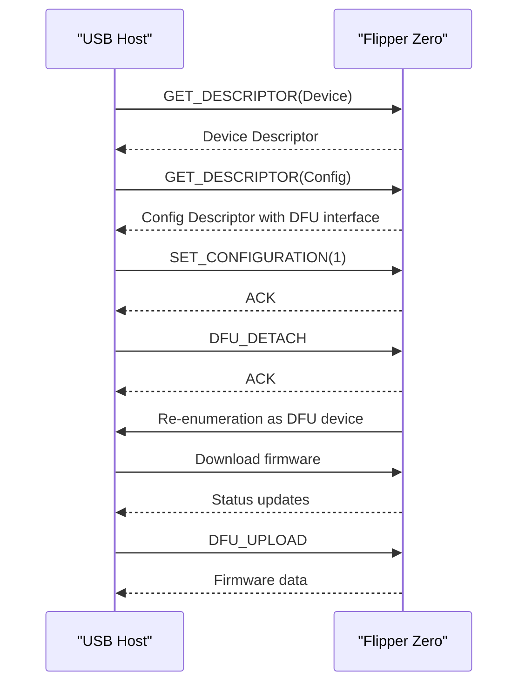
```mermaid
sequenceDiagram
participant Host as "USB Host"
participant Device as "Flipper Zero"
Host->>Device : GET_DESCRIPTOR(Device)
Device-->>Host : Device Descriptor
Host->>Device : GET_DESCRIPTOR(Config)
Device-->>Host : Config Descriptor with DFU interface
Host->>Device : SET_CONFIGURATION(1)
Device-->>Host : ACK
Host->>Device : DFU_DETACH
Device-->>Host : ACK
Device->>Host : Re-enumeration as DFU device
Host->>Device : Download firmware
Device-->>Host : Status updates
Host->>Device : DFU_UPLOAD
Device-->>Host : Firmware data
```

**Diagram sources**
- [usb_dfu.h](file://lib/libusb_stm32/inc/usb_dfu.h)
- [usb_std.h](file://lib/libusb_stm32/inc/usb_std.h)

## Endpoint Management
Endpoint management is a critical aspect of USB device operation, handling data transfer between the device and host.

### Endpoint Configuration Flow
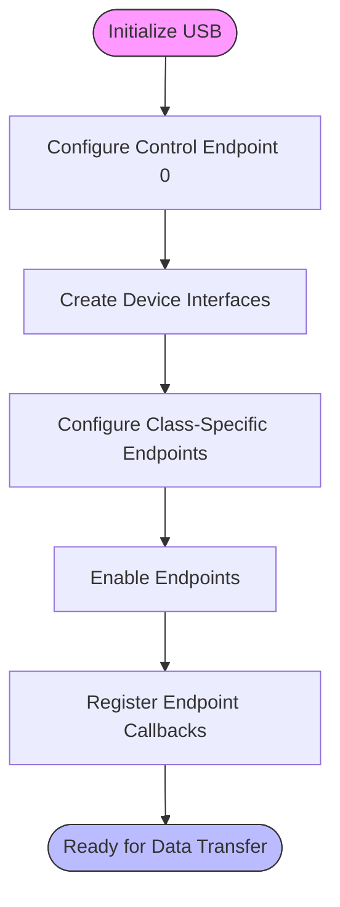
```mermaid
flowchart TD
Start([Initialize USB]) --> ConfigureControlEndpoint["Configure Control Endpoint 0"]
ConfigureControlEndpoint --> CreateInterfaces["Create Device Interfaces"]
CreateInterfaces --> ConfigureEndpoints["Configure Class-Specific Endpoints"]
ConfigureEndpoints --> EnableEndpoints["Enable Endpoints"]
EnableEndpoints --> RegisterCallbacks["Register Endpoint Callbacks"]
RegisterCallbacks --> Ready([Ready for Data Transfer])
style Start fill:#f9f,stroke:#333
style Ready fill:#bbf,stroke:#333
```

**Diagram sources**
- [usbd_core.h](file://lib/libusb_stm32/inc/usbd_core.h)

### Endpoint Types and Usage
The USB subsystem supports various endpoint types for different data transfer requirements:

- **Control Endpoints**: Used for device configuration and command/status operations (Endpoint 0)
- **Interrupt Endpoints**: Used for periodic, low-latency data transfer (e.g., HID reports)
- **Bulk Endpoints**: Used for reliable, high-volume data transfer (e.g., CDC data)
- **Isochronous Endpoints**: Used for time-sensitive data transfer with guaranteed bandwidth

**Section sources**
- [usbd_core.h](file://lib/libusb_stm32/inc/usbd_core.h)
- [usb_std.h](file://lib/libusb_stm32/inc/usb_std.h)

## Descriptor Structure
USB descriptors provide the host with information about the device's capabilities and configuration.

### Descriptor Hierarchy
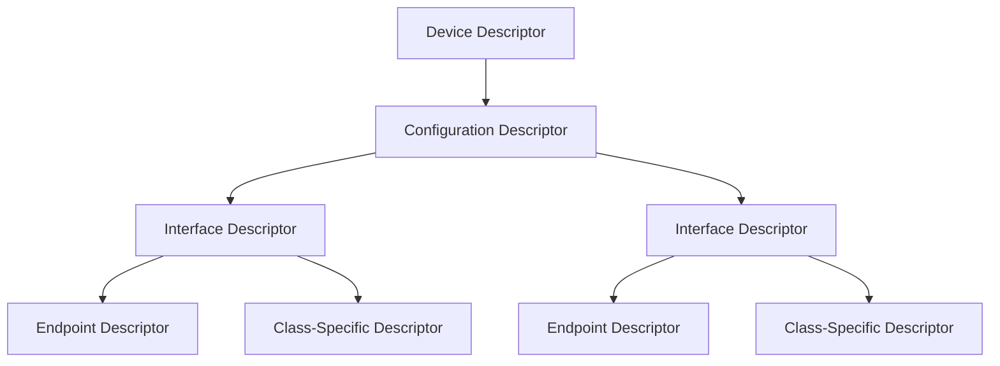
```mermaid
graph TD
Device[Device Descriptor] --> Configuration[Configuration Descriptor]
Configuration --> Interface[Interface Descriptor]
Interface --> Endpoint[Endpoint Descriptor]
Interface --> ClassSpecific[Class-Specific Descriptor]
Configuration --> Interface2[Interface Descriptor]
Interface2 --> Endpoint2[Endpoint Descriptor]
Interface2 --> ClassSpecific2[Class-Specific Descriptor]
```

**Diagram sources**
- [usb_std.h](file://lib/libusb_stm32/inc/usb_std.h)

### Descriptor Types
The USB subsystem supports the following descriptor types:

- **Device Descriptor**: Contains basic device information (vendor ID, product ID, etc.)
- **Configuration Descriptor**: Describes a specific device configuration
- **String Descriptor**: Provides human-readable strings (manufacturer, product, serial number)
- **Interface Descriptor**: Describes a specific interface within a configuration
- **Endpoint Descriptor**: Describes an endpoint's characteristics
- **Class-Specific Descriptor**: Provides class-specific information

**Section sources**
- [usb_std.h](file://lib/libusb_stm32/inc/usb_std.h)

## Class-Specific Requests
Class-specific requests allow the host to control and query device-specific functionality.

### CDC Class Requests
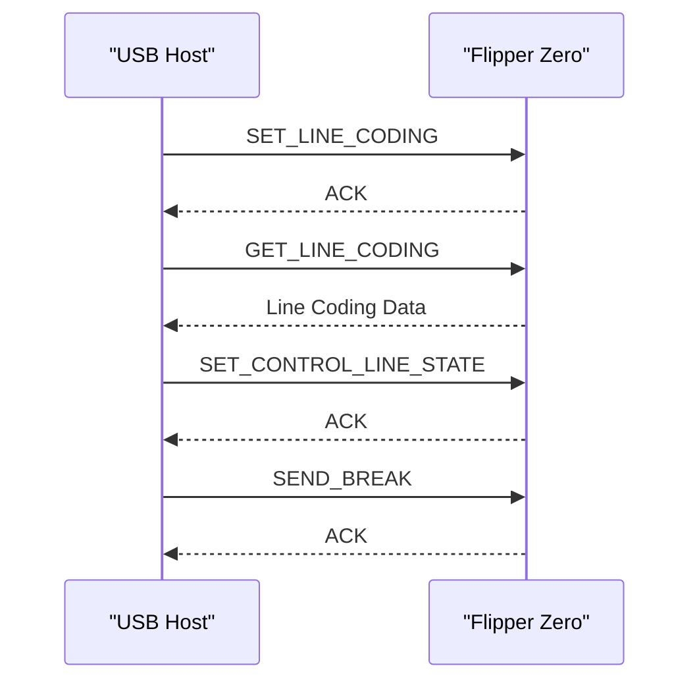
```mermaid
sequenceDiagram
participant Host as "USB Host"
participant Device as "Flipper Zero"
Host->>Device : SET_LINE_CODING
Device-->>Host : ACK
Host->>Device : GET_LINE_CODING
Device-->>Host : Line Coding Data
Host->>Device : SET_CONTROL_LINE_STATE
Device-->>Host : ACK
Host->>Device : SEND_BREAK
Device-->>Host : ACK
```

**Diagram sources**
- [usb_cdc.h](file://lib/libusb_stm32/inc/usb_cdc.h)

### HID Class Requests
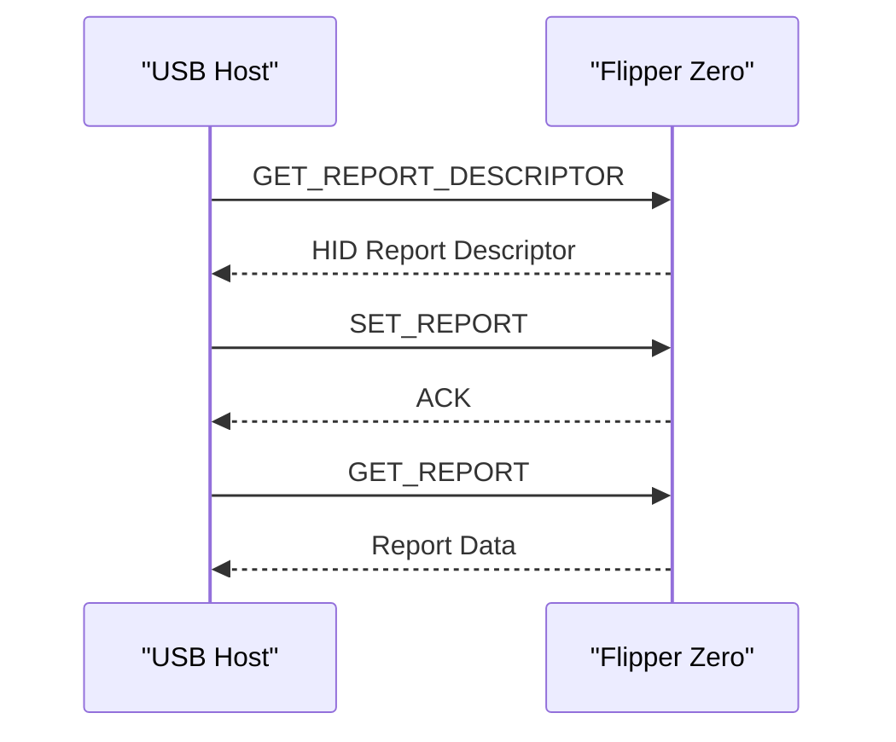
```mermaid
sequenceDiagram
participant Host as "USB Host"
participant Device as "Flipper Zero"
Host->>Device : GET_REPORT_DESCRIPTOR
Device-->>Host : HID Report Descriptor
Host->>Device : SET_REPORT
Device-->>Host : ACK
Host->>Device : GET_REPORT
Device-->>Host : Report Data
```

**Diagram sources**
- [usb_hid.h](file://lib/libusb_stm32/inc/usb_hid.h)

## Enumeration Process
The USB enumeration process establishes communication between the host and device.

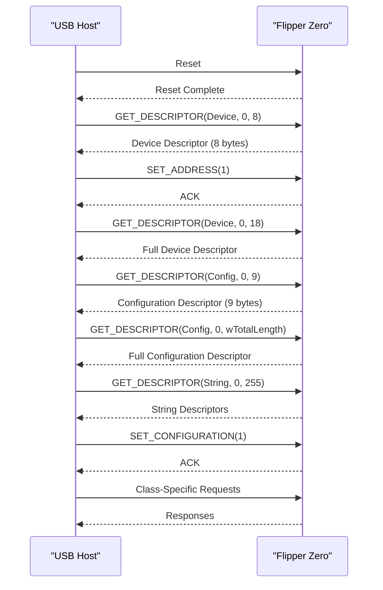
```mermaid
sequenceDiagram
participant Host as "USB Host"
participant Device as "Flipper Zero"
Host->>Device : Reset
Device-->>Host : Reset Complete
Host->>Device : GET_DESCRIPTOR(Device, 0, 8)
Device-->>Host : Device Descriptor (8 bytes)
Host->>Device : SET_ADDRESS(1)
Device-->>Host : ACK
Host->>Device : GET_DESCRIPTOR(Device, 0, 18)
Device-->>Host : Full Device Descriptor
Host->>Device : GET_DESCRIPTOR(Config, 0, 9)
Device-->>Host : Configuration Descriptor (9 bytes)
Host->>Device : GET_DESCRIPTOR(Config, 0, wTotalLength)
Device-->>Host : Full Configuration Descriptor
Host->>Device : GET_DESCRIPTOR(String, 0, 255)
Device-->>Host : String Descriptors
Host->>Device : SET_CONFIGURATION(1)
Device-->>Host : ACK
Host->>Device : Class-Specific Requests
Device-->>Host : Responses
```

**Diagram sources**
- [usbd_core.h](file://lib/libusb_stm32/inc/usbd_core.h)
- [usb_std.h](file://lib/libusb_stm32/inc/usb_std.h)

## Advanced Features

### Remote Wakeup
Remote wakeup allows the device to signal the host to exit suspend mode.

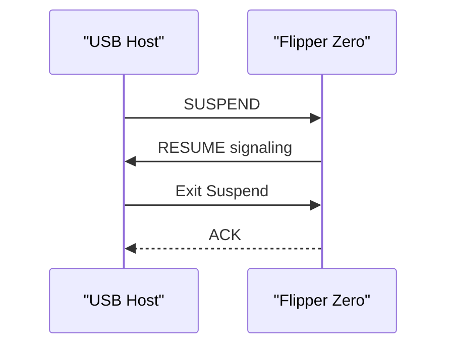
```mermaid
sequenceDiagram
participant Host as "USB Host"
participant Device as "Flipper Zero"
Host->>Device : SUSPEND
Device->>Host : RESUME signaling
Host->>Device : Exit Suspend
Device-->>Host : ACK
```

**Section sources**
- [usbd_core.h](file://lib/libusb_stm32/inc/usbd_core.h)

### Suspend/Resume Handling
The USB subsystem provides mechanisms for handling suspend and resume events.

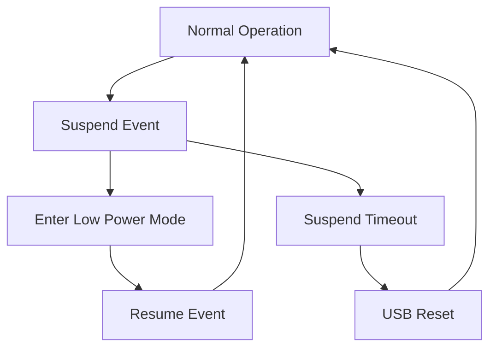
```mermaid
flowchart TD
Normal[Normal Operation] --> Suspend["Suspend Event"]
Suspend --> LowPower["Enter Low Power Mode"]
LowPower --> Resume["Resume Event"]
Resume --> Normal
Suspend --> Timeout["Suspend Timeout"]
Timeout --> Reset["USB Reset"]
Reset --> Normal
```

**Diagram sources**
- [usbd_core.h](file://lib/libusb_stm32/inc/usbd_core.h)

### Power Budgeting
The device reports its power requirements to the host during enumeration.

**Section sources**
- [usb_std.h](file://lib/libusb_stm32/inc/usb_std.h)

## Implementation Examples

### Virtual COM Port Implementation
Example implementation of a virtual COM port using CDC class:

```c
// Device descriptor with CDC class
struct usb_device_descriptor device_desc = {
    .bLength = sizeof(struct usb_device_descriptor),
    .bDescriptorType = USB_DTYPE_DEVICE,
    .bcdUSB = VERSION_BCD(2, 0, 0),
    .bDeviceClass = USB_CLASS_CDC,
    .bDeviceSubClass = USB_CDC_SUBCLASS_ACM,
    .bDeviceProtocol = USB_CDC_PROTO_NONE,
    .bMaxPacketSize0 = 64,
    .idVendor = 0x1234,
    .idProduct = 0x5678,
    .bcdDevice = VERSION_BCD(1, 0, 0),
    .iManufacturer = 1,
    .iProduct = 2,
    .iSerialNumber = 3,
    .bNumConfigurations = 1
};
```

**Section sources**
- [usb_cdc.h](file://lib/libusb_stm32/inc/usb_cdc.h)

### Keyboard Emulation Implementation
Example implementation of keyboard emulation using HID class:

```c
// HID report descriptor for keyboard
static const uint8_t hid_keyboard_report_desc[] = {
    0x05, 0x01,        // Usage Page (Generic Desktop)
    0x09, 0x06,        // Usage (Keyboard)
    0xA1, 0x01,        // Collection (Application)
    0x05, 0x07,        // Usage Page (Key Codes)
    0x19, 0xE0,        // Usage Minimum (224)
    0x29, 0xE7,        // Usage Maximum (231)
    0x15, 0x00,        // Logical Minimum (0)
    0x25, 0x01,        // Logical Maximum (1)
    0x75, 0x01,        // Report Size (1)
    0x95, 0x08,        // Report Count (8)
    0x81, 0x02,        // Input (Data, Variable, Absolute)
    0x95, 0x01,        // Report Count (1)
    0x75, 0x08,        // Report Size (8)
    0x81, 0x03,        // Input (Constant)
    0x95, 0x05,        // Report Count (5)
    0x75, 0x01,        // Report Size (1)
    0x05, 0x08,        // Usage Page (LEDs)
    0x19, 0x01,        // Usage Minimum (1)
    0x29, 0x05,        // Usage Maximum (5)
    0x91, 0x02,        // Output (Data, Variable, Absolute)
    0x95, 0x01,        // Report Count (1)
    0x75, 0x03,        // Report Size (3)
    0x91, 0x03,        // Output (Constant)
    0x95, 0x06,        // Report Count (6)
    0x75, 0x08,        // Report Size (8)
    0x15, 0x00,        // Logical Minimum (0)
    0x25, 0x65,        // Logical Maximum (101)
    0x05, 0x07,        // Usage Page (Key Codes)
    0x19, 0x00,        // Usage Minimum (0)
    0x29, 0x65,        // Usage Maximum (101)
    0x81, 0x00,        // Input (Data, Array)
    0xC0               // End Collection
};
```

**Section sources**
- [usb_hid.h](file://lib/libusb_stm32/inc/usb_hid.h)

### Smart Card Interface Implementation
Example implementation of a smart card interface using CCID class:

```c
// CCID device initialization
void ccid_init(usbd_device *dev) {
    // Configure CCID interface
    usbd_ep_config(dev, 0x81, USB_EPTYPE_BULK, 64);
    usbd_ep_config(dev, 0x01, USB_EPTYPE_BULK, 64);
    usbd_ep_config(dev, 0x82, USB_EPTYPE_INTERRUPT, 8);
    
    // Register CCID callbacks
    usbd_reg_endpoint(dev, 0x81, ccid_bulk_in_callback);
    usbd_reg_endpoint(dev, 0x01, ccid_bulk_out_callback);
    usbd_reg_endpoint(dev, 0x82, ccid_interrupt_in_callback);
}
```

**Section sources**
- [usb_ccid.h](file://lib/libusb_stm32/inc/usb_ccid.h)

## Physical Layer Considerations

### USB Speed Detection
The USB subsystem automatically detects the connection speed (Full Speed or Low Speed).

**Section sources**
- [usbd_core.h](file://lib/libusb_stm32/inc/usbd_core.h)

### Signal Integrity Requirements
Proper signal integrity is essential for reliable USB communication:

- **D+ and D- traces** should be length-matched within 500 mils
- **Impedance control** of 90Ω differential and 45Ω single-ended
- **Series termination resistors** of 22-33Ω may be required
- **Proper grounding** and power decoupling

### ESD Protection
Electrostatic discharge protection is critical for USB interfaces:

- **TVS diodes** should be used on D+ and D- lines
- **Low capacitance** protection devices (< 5pF) to avoid signal degradation
- **Proper PCB layout** with short traces to protection devices

**Section sources**
- [usb.h](file://lib/libusb_stm32/inc/usb.h)