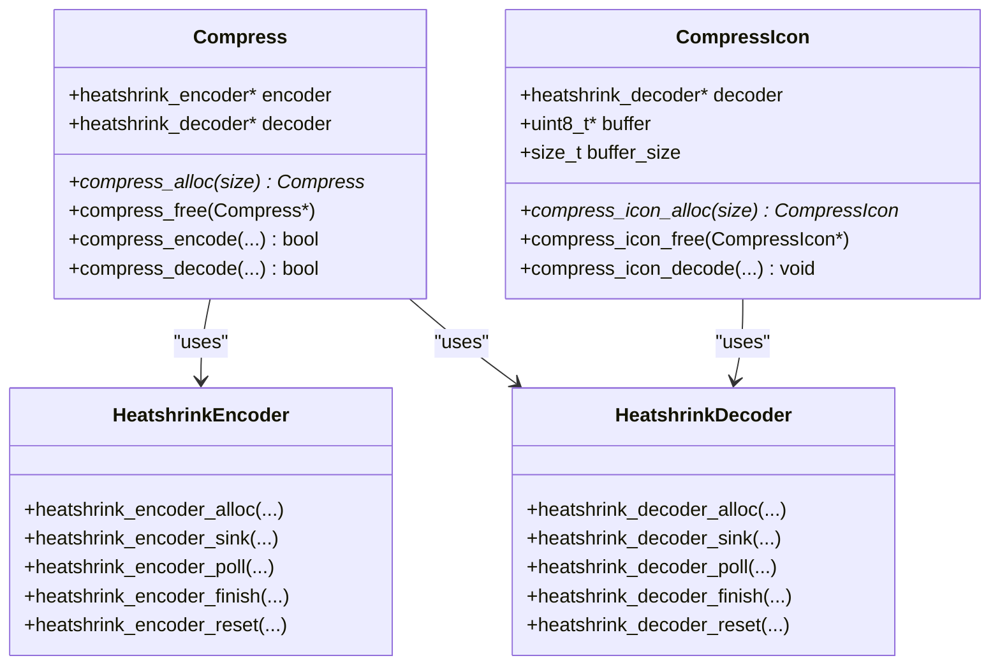
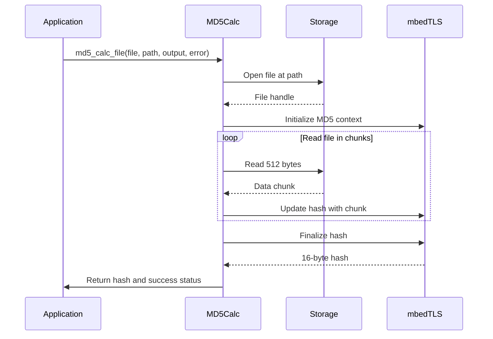
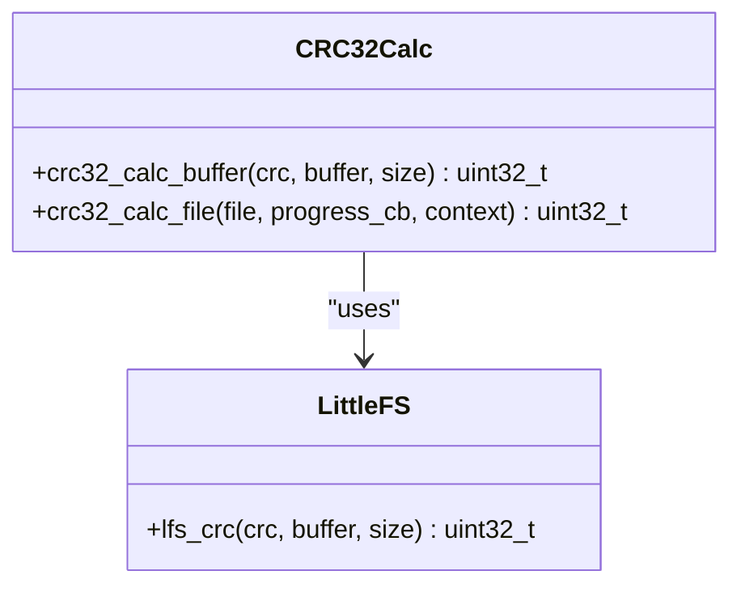
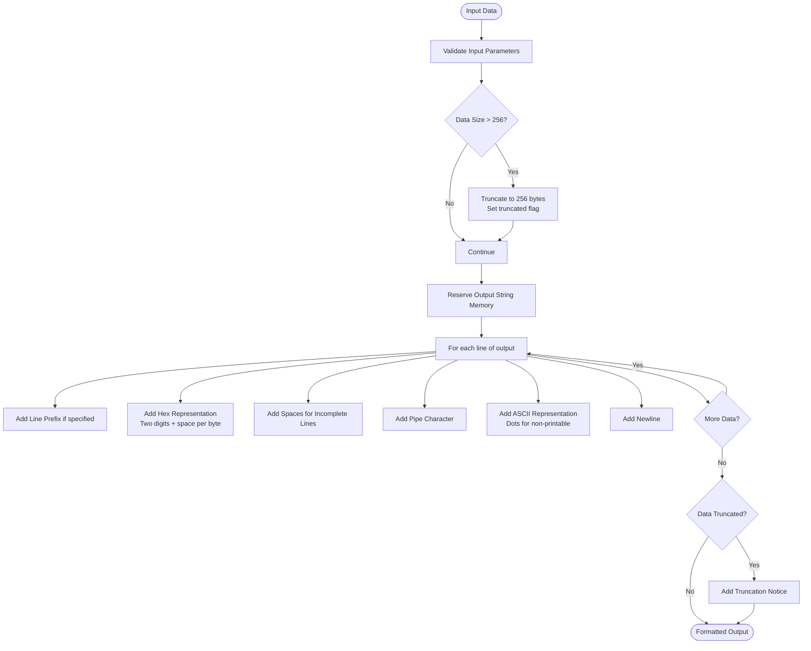
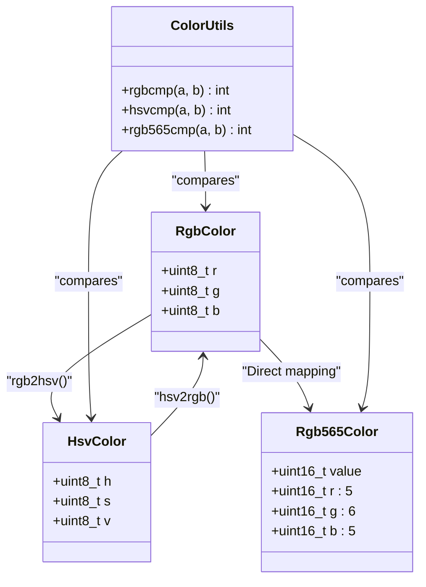

# Data Processing Utilities

<cite>
**Referenced Files in This Document**   
- [compress.h](file://lib/toolbox/compress.h)
- [compress.c](file://lib/toolbox/compress.c)
- [md5_calc.h](file://lib/toolbox/md5_calc.h)
- [md5_calc.c](file://lib/toolbox/md5_calc.c)
- [crc32_calc.h](file://lib/toolbox/crc32_calc.h)
- [crc32_calc.c](file://lib/toolbox/crc32_calc.c)
- [pretty_format.h](file://lib/toolbox/pretty_format.h)
- [pretty_format.c](file://lib/toolbox/pretty_format.c)
- [colors.h](file://lib/toolbox/colors.h)
- [colors.c](file://lib/toolbox/colors.c)
- [m_cstr_dup.h](file://lib/toolbox/m_cstr_dup.h)
</cite>

## Table of Contents
1. [Introduction](#introduction)
2. [Data Compression Utilities](#data-compression-utilities)
3. [Cryptographic Hash Functions](#cryptographic-hash-functions)
4. [CRC32 Checksums](#crc32-checksums)
5. [Pretty Formatting](#pretty-formatting)
6. [Color Utilities](#color-utilities)
7. [String Duplication](#string-duplication)
8. [Performance and Best Practices](#performance-and-best-practices)
9. [Conclusion](#conclusion)

## Introduction
The Toolbox library in the Flipper Zero firmware provides a comprehensive suite of data processing utilities designed for efficient data storage, integrity verification, and user interface formatting. These utilities are optimized for resource-constrained embedded environments and offer essential functionality for developers working on applications that require data compression, cryptographic operations, checksum verification, and visual formatting. This document provides a detailed analysis of the key components within the toolbox library, including data compression, cryptographic hash functions, CRC32 checksums, pretty formatting, color utilities, and string duplication mechanisms.

**Section sources**
- [compress.h](file://lib/toolbox/compress.h#L1-L105)
- [md5_calc.h](file://lib/toolbox/md5_calc.h#L1-L16)
- [crc32_calc.h](file://lib/toolbox/crc32_calc.h#L1-L18)
- [pretty_format.h](file://lib/toolbox/pretty_format.h#L1-L29)
- [colors.h](file://lib/toolbox/colors.h#L1-L41)
- [m_cstr_dup.h](file://lib/toolbox/m_cstr_dup.h#L1-L17)

## Data Compression Utilities

The data compression utilities in the toolbox library are based on the LZSS (Lempel-Ziv-Storer-Szymanski) algorithm, implemented through the Heatshrink compression library. The compression system provides two main interfaces: general-purpose compression/decompression and icon-specific compression.

### Compression Architecture
The compression system is built around two primary structures: `Compress` for general data compression and `CompressIcon` for icon data compression. Both utilize the Heatshrink encoder and decoder libraries for the actual compression algorithm.



**Diagram sources**
- [compress.h](file://lib/toolbox/compress.h#L20-L85)
- [compress.c](file://lib/toolbox/compress.c#L85-L284)

### Compression Implementation
The compression system uses a header structure to identify compressed data and determine the decompression process:

```c
typedef struct {
    uint8_t is_compressed;
    uint8_t reserved;
    uint16_t compressed_buff_size;
} CompressHeader;
```

When compressing data, the system evaluates whether compression is beneficial. If the compressed data would be larger than the original (plus one byte for the header), the original data is stored with a flag indicating it is uncompressed. This prevents data expansion for files that don't compress well.

The compression process involves:
1. Allocating encoder and decoder instances with specified buffer sizes
2. Sinking input data into the encoder
3. Polling encoded data from the encoder
4. Finalizing the encoding process
5. Writing the header and compressed data to the output buffer

### Usage Examples
For compressing configuration data:

```c
Compress* compressor = compress_alloc(1024);
uint8_t* input_data = /* configuration data */;
size_t input_size = /* size of configuration data */;
uint8_t output_buffer[2048];
size_t output_size;

bool success = compress_encode(
    compressor, 
    input_data, 
    input_size, 
    output_buffer, 
    sizeof(output_buffer), 
    &output_size
);

if(success) {
    // Store compressed data
}
compress_free(compressor);
```

For decompressing icon data:

```c
CompressIcon* icon_compressor = compress_icon_alloc(256);
uint8_t* icon_data = /* compressed icon data */;
uint8_t* decoded_data;

compress_icon_decode(icon_compressor, icon_data, &decoded_data);
// Use decoded_data for display
compress_icon_free(icon_compressor);
```

**Section sources**
- [compress.h](file://lib/toolbox/compress.h#L1-L105)
- [compress.c](file://lib/toolbox/compress.c#L0-L284)

## Cryptographic Hash Functions

The toolbox library provides MD5 hash calculation functionality for file integrity verification. The implementation uses the mbedTLS library for cryptographic operations.

### MD5 Calculation Architecture
The MD5 utility provides two functions for calculating hash values:



**Diagram sources**
- [md5_calc.h](file://lib/toolbox/md5_calc.h#L1-L16)
- [md5_calc.c](file://lib/toolbox/md5_calc.c#L0-L58)

### MD5 Implementation
The MD5 calculation functions are defined in `md5_calc.h`:

```c
bool md5_calc_file(
    File* file, 
    const char* path, 
    unsigned char output[16], 
    FS_Error* file_error);

bool md5_string_calc_file(
    File* file, 
    const char* path, 
    FuriString* output, 
    FS_Error* file_error);
```

The first function calculates the MD5 hash of a file and returns the raw 16-byte hash value. The second function returns the hash as a formatted hexadecimal string.

The implementation reads the file in 512-byte chunks to minimize memory usage, which is critical for embedded systems with limited RAM. For each chunk read, it updates the MD5 context using mbedTLS functions.

### Usage Examples
For verifying file integrity:

```c
File file;
unsigned char hash[16];
FS_Error error;

bool success = md5_calc_file(&file, "/ext/config.bin", hash, &error);

if(success) {
    // File read successfully, hash contains MD5 value
    // Compare with expected hash to verify integrity
} else {
    // Handle error
}
```

For displaying a hash as a hexadecimal string:

```c
File file;
FuriString* hash_string = furi_string_alloc();
FS_Error error;

bool success = md5_string_calc_file(&file, "/ext/firmware.bin", hash_string, &error);

if(success) {
    // hash_string contains the MD5 hash in hexadecimal format
    printf("File hash: %s\n", furi_string_get_cstr(hash_string));
}
furi_string_free(hash_string);
```

**Section sources**
- [md5_calc.h](file://lib/toolbox/md5_calc.h#L1-L16)
- [md5_calc.c](file://lib/toolbox/md5_calc.c#L0-L58)

## CRC32 Checksums

The CRC32 utility provides cyclic redundancy check functionality for data integrity verification. Unlike MD5, which is a cryptographic hash, CRC32 is designed for error detection in digital networks and storage devices.

### CRC32 Architecture
The CRC32 implementation leverages the LittleFS library's CRC function, providing both buffer-based and file-based checksum calculation:



**Diagram sources**
- [crc32_calc.h](file://lib/toolbox/crc32_calc.h#L1-L18)
- [crc32_calc.c](file://lib/toolbox/crc32_calc.c#L0-L38)

### CRC32 Implementation
The CRC32 functions are defined as:

```c
uint32_t crc32_calc_buffer(
    uint32_t crc, 
    const void* buffer, 
    size_t size);

uint32_t crc32_calc_file(
    File* file, 
    const FileCrcProgressCb progress_cb, 
    void* context);
```

The `crc32_calc_buffer` function calculates the CRC32 checksum of a memory buffer, allowing incremental calculation by providing a previous CRC value. The `crc32_calc_file` function calculates the CRC32 of an entire file and supports progress callbacks for long operations.

The implementation reads files in 512-byte chunks and updates the CRC value incrementally. The progress callback is invoked every 512 bytes (or at the end of the file) to provide feedback on the calculation progress.

### Usage Examples
For calculating CRC32 of data in memory:

```c
uint8_t data[] = {0x01, 0x02, 0x03, 0x04};
uint32_t crc = crc32_calc_buffer(0, data, sizeof(data));
// crc now contains the CRC32 checksum
```

For verifying file integrity with progress indication:

```c
File file;
storage_file_open(&file, "/ext/firmware.bin", FSAM_READ, FSOM_OPEN_EXISTING);

uint32_t crc = crc32_calc_file(&file, progress_callback, my_context);
storage_file_close(&file);

// Compare crc with expected value to verify file integrity
```

**Section sources**
- [crc32_calc.h](file://lib/toolbox/crc32_calc.h#L1-L18)
- [crc32_calc.c](file://lib/toolbox/crc32_calc.c#L0-L38)

## Pretty Formatting

The pretty formatting utility provides functions for formatting binary data in human-readable formats, particularly for debugging and display purposes.

### Pretty Formatting Architecture
The primary function in this utility formats binary data as a canonical hex dump:



**Diagram sources**
- [pretty_format.h](file://lib/toolbox/pretty_format.h#L1-L29)
- [pretty_format.c](file://lib/toolbox/pretty_format.c#L0-L65)

### Pretty Formatting Implementation
The main function provided is:

```c
void pretty_format_bytes_hex_canonical(
    FuriString* result,
    size_t num_places,
    const char* line_prefix,
    const uint8_t* data,
    size_t data_size);
```

This function formats binary data as a hex dump with both hexadecimal and ASCII representations. It limits the output to 256 bytes to prevent excessive memory usage and adds a truncation notice if the input data exceeds this limit.

The output format includes:
- Optional line prefix
- Hexadecimal representation (two digits per byte, separated by spaces)
- ASCII representation (printable characters shown as-is, non-printable as dots)
- Proper alignment with spaces for incomplete lines

### Usage Examples
For debugging binary data:

```c
FuriString* formatted = furi_string_alloc();
uint8_t packet[] = {0x01, 0x02, 0x03, 0x41, 0x42, 0x43}; // Includes "ABC"

pretty_format_bytes_hex_canonical(
    formatted, 
    8, 
    "Packet: ", 
    packet, 
    sizeof(packet)
);

printf("%s\n", furi_string_get_cstr(formatted));
furi_string_free(formatted);
```

This would produce output like:
```
Packet: 01 02 03 41 42 43    |...ABC
```

**Section sources**
- [pretty_format.h](file://lib/toolbox/pretty_format.h#L1-L29)
- [pretty_format.c](file://lib/toolbox/pretty_format.c#L0-L65)

## Color Utilities

The color utilities provide functions for color space conversion and comparison, supporting both RGB and HSV color models.

### Color Utilities Architecture
The color system supports multiple color representations and conversion functions:



**Diagram sources**
- [colors.h](file://lib/toolbox/colors.h#L1-L41)
- [colors.c](file://lib/toolbox/colors.c#L0-L92)

### Color Utilities Implementation
The color utilities define three color structures:

```c
typedef struct {
    uint8_t r;
    uint8_t g;
    uint8_t b;
} RgbColor;

typedef struct {
    uint8_t h;
    uint8_t s;
    uint8_t v;
} HsvColor;

typedef union {
    uint16_t value;
    struct {
        uint16_t r : 5;
        uint16_t g : 6;
        uint16_t b : 5;
    } FURI_PACKED;
} Rgb565Color;
```

The library provides conversion functions between RGB and HSV color spaces, which are commonly used in different contexts:
- RGB: Used for direct color specification
- HSV: More intuitive for human color selection (Hue, Saturation, Value)
- RGB565: Compact 16-bit representation for display operations

Comparison functions are provided for each color type, using `memcmp` for efficient byte-by-byte comparison.

### Usage Examples
For converting between color spaces:

```c
RgbColor rgb = {255, 128, 0}; // Orange
HsvColor hsv;
rgb2hsv(&rgb, &hsv);
// hsv now contains the HSV representation

HsvColor new_hsv = {120, 200, 200}; // Greenish
RgbColor new_rgb;
hsv2rgb(&new_hsv, &new_rgb);
// new_rgb contains the RGB representation
```

For comparing colors:

```c
RgbColor color1 = {255, 0, 0};
RgbColor color2 = {255, 0, 0};
int result = rgbcmp(&color1, &color2);
// result is 0, indicating colors are equal
```

**Section sources**
- [colors.h](file://lib/toolbox/colors.h#L1-L41)
- [colors.c](file://lib/toolbox/colors.c#L0-L92)

## String Duplication

The string duplication utility provides macros for safely managing string memory allocation and deallocation, integrating with the M-Core library's object management system.

### String Duplication Implementation
The m_cstr_dup.h header defines a set of macros for string management:

```c
#define M_INIT_DUP(a)        ((a) = strdup(""))
#define M_INIT_SET_DUP(a, b) ((a) = strdup(b))
#define M_SET_DUP(a, b)      (free((void*)a), (a) = strdup(b))
#define M_CLEAR_DUP(a)       (free((void*)a))

#define M_CSTR_DUP_OPLIST      \
    (INIT(M_INIT_DUP),         \
     INIT_SET(M_INIT_SET_DUP), \
     SET(M_SET_DUP),           \
     CLEAR(M_CLEAR_DUP),       \
     HASH(m_core_cstr_hash),   \
     EQUAL(M_CSTR_EQUAL),      \
     CMP(strcmp),              \
     TYPE(const char*))
```

These macros provide a consistent interface for string operations within the M-Core library's generic data structure system. The OPLIST (operation list) defines how string objects should be initialized, set, cleared, hashed, compared, and sorted.

### Usage Examples
The string duplication macros are primarily used within M-Core data structures:

```c
// Using with M-Core string container
M_CSTR_DUP_DEF(my_string)
M_CSTR_DUP_INIT(my_string_var);
M_CSTR_DUP_SET_STR(my_string_var, "Hello World");
// Use my_string_var...
M_CSTR_DUP_CLEAR(my_string_var);
```

This approach ensures consistent memory management and prevents memory leaks by pairing each allocation with a corresponding deallocation.

**Section sources**
- [m_cstr_dup.h](file://lib/toolbox/m_cstr_dup.h#L1-L17)

## Performance and Best Practices

### Memory Usage Patterns
The data processing utilities are designed with careful attention to memory usage in embedded environments:

- **Compression**: Uses fixed-size buffers determined at allocation time. The default window size is 256 bytes (2^8) with a lookahead buffer of 16 bytes (2^4).
- **Hashing**: Processes data in 512-byte chunks to balance memory usage and I/O efficiency.
- **Formatting**: Limits output to 256 bytes to prevent excessive memory allocation.
- **Colors**: Uses compact 8-bit or 16-bit representations for efficient storage.

### Computational Complexity
- **Compression**: O(n) time complexity, where n is the input size. The LZSS algorithm provides good compression ratios for typical embedded data.
- **MD5**: O(n) time complexity, with constant memory usage regardless of input size.
- **CRC32**: O(n) time complexity, optimized for fast calculation on embedded processors.
- **Formatting**: O(n) time complexity, with memory usage proportional to output size.

### Best Practices for Embedded Environments
1. **Pre-allocate resources**: Allocate compression instances and buffers during initialization rather than at runtime.
2. **Reuse instances**: Reuse compression and hashing instances across multiple operations to avoid repeated memory allocation.
3. **Monitor memory usage**: Be aware of the memory footprint of each utility, especially when processing large files.
4. **Handle failures gracefully**: Always check return values and handle errors appropriately, particularly for file operations.
5. **Use appropriate chunk sizes**: The default 512-byte chunk size balances performance and memory usage, but can be adjusted based on specific requirements.

## Conclusion
The data processing utilities in the Toolbox library provide essential functionality for the Flipper Zero firmware, enabling efficient data storage through compression, reliable data integrity verification through MD5 and CRC32 checksums, user-friendly output formatting, color manipulation, and safe string management. These utilities are carefully designed for the constraints of embedded systems, with attention to memory usage, computational efficiency, and reliability. By understanding the architecture and proper usage patterns of these utilities, developers can create robust applications that efficiently handle data processing tasks in resource-constrained environments.