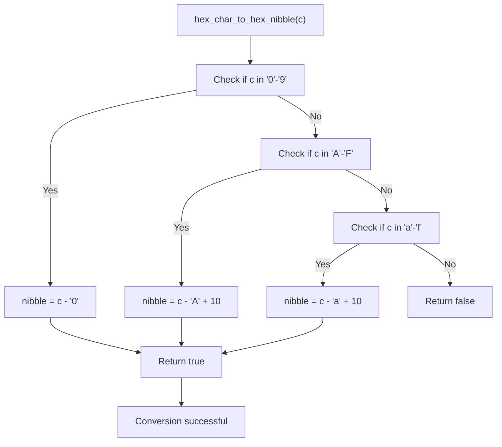
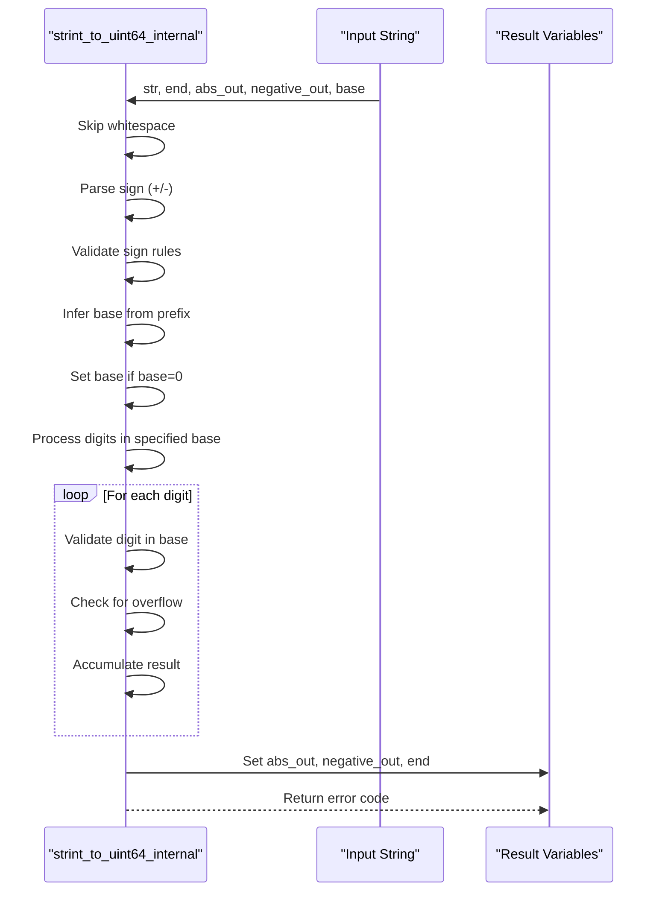
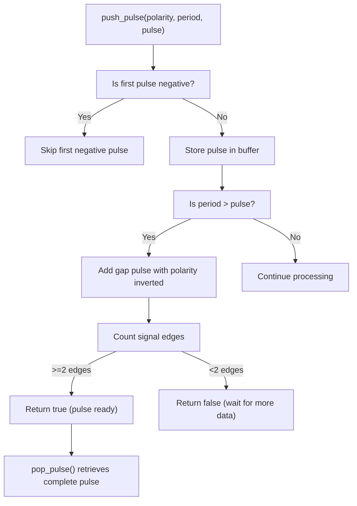
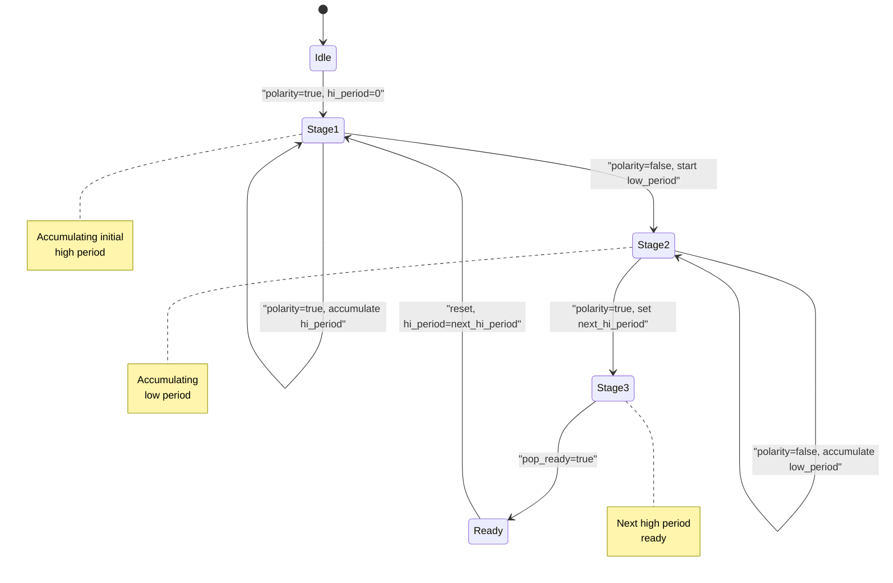
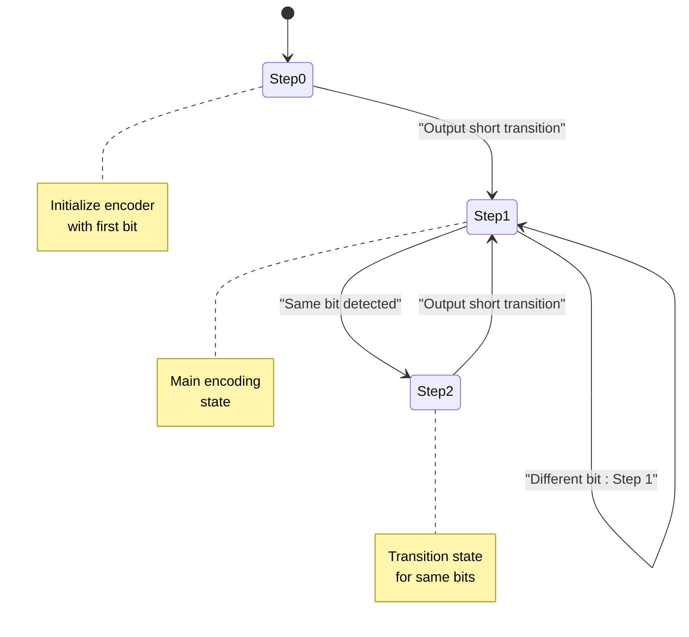

# Encoding and Signal Processing

<cite>
**Referenced Files in This Document**   
- [hex.h](file://lib/toolbox/hex.h)
- [hex.c](file://lib/toolbox/hex.c)
- [strint.h](file://lib/toolbox/strint.h)
- [strint.c](file://lib/toolbox/strint.c)
- [float_tools.h](file://lib/toolbox/float_tools.h)
- [float_tools.c](file://lib/toolbox/float_tools.c)
- [pulse_joiner.h](file://lib/toolbox/pulse_joiner.h)
- [pulse_joiner.c](file://lib/toolbox/pulse_joiner.c)
- [pulse_glue.h](file://lib/toolbox/pulse_protocols/pulse_glue.h)
- [pulse_glue.c](file://lib/toolbox/pulse_protocols/pulse_glue.c)
- [manchester_encoder.h](file://lib/toolbox/manchester_encoder.h)
- [manchester_encoder.c](file://lib/toolbox/manchester_encoder.c)
- [manchester_decoder.h](file://lib/toolbox/manchester_decoder.h)
- [manchester_decoder.c](file://lib/toolbox/manchester_decoder.c)
</cite>

## Table of Contents
1. [Introduction](#introduction)
2. [Hexadecimal Encoding and Decoding](#hexadecimal-encoding-and-decoding)
3. [String-to-Integer Conversion](#string-to-integer-conversion)
4. [Floating-Point Utilities](#floating-point-utilities)
5. [Pulse Joining Operations](#pulse-joining-operations)
6. [Pulse Protocol Glue Logic](#pulse-protocol-glue-logic)
7. [Manchester Encoding and Decoding](#manchester-encoding-and-decoding)
8. [Integration in Wireless Protocol Processing](#integration-in-wireless-protocol-processing)
9. [Performance and Error Handling](#performance-and-error-handling)
10. [Conclusion](#conclusion)

## Introduction
This document provides a comprehensive analysis of the encoding and signal processing utilities within the Toolbox library of the Flipper Zero firmware. These utilities form the foundation for wireless protocol processing, signal manipulation, and data representation conversion. The components covered include hexadecimal encoding/decoding, string-to-integer conversion, floating-point comparison, pulse joining operations, pulse protocol glue logic, and Manchester encoding/decoding implementations. These functions are essential for processing radio signals, implementing wireless protocols, and converting between different data representations in embedded systems.

## Hexadecimal Encoding and Decoding

The hexadecimal encoding and decoding utilities provide bidirectional conversion between ASCII hexadecimal representations and binary data. These functions are critical for parsing and generating human-readable hexadecimal strings used in protocol analysis, debugging, and configuration.

### Function Overview
The hex.h interface provides several functions for converting between ASCII hex characters and binary values:

- **hex_char_to_hex_nibble**: Converts a single ASCII hex character to its 4-bit binary equivalent
- **hex_char_to_uint8**: Converts two ASCII hex characters to an 8-bit unsigned integer
- **hex_chars_to_uint8**: Converts a string of ASCII hex characters to uint8_t values
- **hex_chars_to_uint64**: Converts a string of ASCII hex characters to a 64-bit unsigned integer
- **uint8_to_hex_chars**: Converts binary data to ASCII hex characters

```c
bool hex_char_to_hex_nibble(char c, uint8_t* nibble);
bool hex_char_to_uint8(char hi, char low, uint8_t* value);
void uint8_to_hex_chars(const uint8_t* src, uint8_t* target, int length);
```

### Implementation Details
The implementation in hex.c uses a straightforward approach for character-to-nibble conversion, handling both uppercase and lowercase hexadecimal digits (0-9, A-F, a-f). The conversion functions validate input characters and return boolean status codes to indicate success or failure.

The `uint8_to_hex_chars` function uses a lookup table ("0123456789ABCDEF") to convert binary values to their ASCII hex representation. It processes data in reverse order to handle the conversion efficiently.



**Diagram sources**
- [hex.c](file://lib/toolbox/hex.c#L10-L30)

**Section sources**
- [hex.h](file://lib/toolbox/hex.h#L10-L50)
- [hex.c](file://lib/toolbox/hex.c#L1-L70)

## String-to-Integer Conversion

The string-to-integer conversion utilities provide robust parsing of numeric strings into various integer types with comprehensive error handling. This functionality is essential for command-line interfaces, configuration parsing, and user input processing.

### Error Handling Model
The strint.h header defines a comprehensive error enumeration that provides detailed information about conversion failures:

- **StrintParseNoError**: Conversion successful
- **StrintParseSignError**: Invalid sign characters (multiple +/- or negative sign for unsigned types)
- **StrintParseAbsentError**: No valid digits found after whitespace and sign
- **StrintParseOverflowError**: Result exceeds the range of the target type

### Supported Conversions
The library provides functions for converting strings to various integer types:

- **strint_to_uint64**: 64-bit unsigned integer
- **strint_to_int64**: 64-bit signed integer
- **strint_to_uint32**: 32-bit unsigned integer
- **strint_to_int32**: 32-bit signed integer
- **strint_to_uint16**: 16-bit unsigned integer
- **strint_to_int16**: 16-bit signed integer

### Base Detection
The conversion functions support automatic base detection when the base parameter is set to 0:
- **0x** prefix: Base 16 (hexadecimal)
- **0b** prefix: Base 2 (binary)
- **0** prefix: Base 8 (octal)
- No prefix: Base 10 (decimal)



**Diagram sources**
- [strint.c](file://lib/toolbox/strint.c#L30-L120)

**Section sources**
- [strint.h](file://lib/toolbox/strint.h#L1-L70)
- [strint.c](file://lib/toolbox/strint.c#L1-L120)

## Floating-Point Utilities

The floating-point utilities provide a reliable method for comparing floating-point numbers, addressing the inherent precision limitations of floating-point arithmetic in embedded systems.

### Precision-Aware Comparison
The `float_is_equal` function implements a relative comparison algorithm that accounts for floating-point precision limitations:

```c
bool float_is_equal(float a, float b) {
    return fabsf(a - b) <= FLT_EPSILON * fmaxf(fabsf(a), fabsf(b));
}
```

This approach uses the machine epsilon (FLT_EPSILON) as a relative tolerance threshold, making the comparison robust across different magnitude ranges. The algorithm takes the maximum absolute value of the two numbers to determine the appropriate tolerance level.

### Use Cases
This utility is essential for:
- Comparing sensor readings with threshold values
- Validating floating-point calculations
- Testing numerical algorithms
- Implementing control systems with floating-point parameters

The relative comparison method is superior to absolute difference checks because it scales appropriately with the magnitude of the numbers being compared, preventing false negatives for large values and false positives for small values.

**Section sources**
- [float_tools.h](file://lib/toolbox/float_tools.h#L1-L20)
- [float_tools.c](file://lib/toolbox/float_tools.c#L1-L9)

## Pulse Joining Operations

The pulse joining operations provide a mechanism for combining individual pulse measurements into complete timer pulses, which is essential for processing radio frequency signals in wireless protocols.

### Data Structure
The PulseJoiner structure maintains a circular buffer of pulse events:

```c
typedef struct PulseJoiner {
    size_t pulse_index;
    Pulse pulses[PULSE_MAX_COUNT];
} PulseJoiner;
```

Each pulse contains polarity (high-to-low or low-to-high) and timing information.

### Core Functions
- **pulse_joiner_alloc**: Creates and initializes a PulseJoiner instance
- **pulse_joiner_free**: Releases memory allocated for a PulseJoiner
- **pulse_joiner_push_pulse**: Adds a pulse event and returns true when a complete pulse is ready
- **pulse_joiner_pop_pulse**: Retrieves the next complete pulse period and duration

### Signal Processing Logic
The algorithm waits for at least two signal edges (transitions) before considering a pulse complete. It omits the first negative pulse to handle signal initialization properly. The implementation accumulates pulse times and calculates the overall period by summing high and low periods.



**Diagram sources**
- [pulse_joiner.c](file://lib/toolbox/pulse_joiner.c#L50-L100)

**Section sources**
- [pulse_joiner.h](file://lib/toolbox/pulse_joiner.h#L1-L45)
- [pulse_joiner.c](file://lib/toolbox/pulse_joiner.c#L1-L115)

## Pulse Protocol Glue Logic

The pulse protocol glue logic provides a stateful mechanism for combining separated pulse measurements into coherent signal periods, which is essential for processing Manchester-encoded and other pulse-based protocols.

### State Machine
The PulseGlue structure maintains three key state variables:
- **hi_period**: Accumulated high period duration
- **low_period**: Accumulated low period duration
- **next_hi_period**: Next high period (used for transition)

### Operation Phases
The algorithm operates in three distinct phases:
1. **Stage 1**: Accumulate the initial high period
2. **Stage 2**: Accumulate the low period after detecting a high period
3. **Stage 3**: Prepare the next high period and signal readiness

### Function Interface
- **pulse_glue_alloc**: Creates a new PulseGlue instance
- **pulse_glue_free**: Releases PulseGlue memory
- **pulse_glue_reset**: Resets the internal state
- **pulse_glue_push**: Adds a pulse and returns true when data is ready
- **pulse_glue_pop**: Retrieves the combined pulse length and period

The glue logic effectively transforms a stream of individual pulse measurements into meaningful signal periods that can be interpreted by higher-level protocol decoders.



**Diagram sources**
- [pulse_glue.c](file://lib/toolbox/pulse_protocols/pulse_glue.c#L30-L50)

**Section sources**
- [pulse_glue.h](file://lib/toolbox/pulse_protocols/pulse_glue.h#L1-L25)
- [pulse_glue.c](file://lib/toolbox/pulse_protocols/pulse_glue.c#L1-L55)

## Manchester Encoding and Decoding

The Manchester encoding and decoding utilities provide bidirectional conversion between raw data bits and Manchester-encoded signal representations, which are widely used in wireless protocols.

### Manchester Encoding

#### State Management
The ManchesterEncoderState tracks:
- **prev_bit**: Previous data bit
- **step**: Current encoding step (0, 1, or 2)

#### Encoding Process
The encoder implements a state machine that converts data bits into pulse patterns:
- **Step 0**: Initialize with current bit, output short transition
- **Step 1**: Output full transition based on bit change
- **Step 2**: Output short transition for same bit, reset for change

```c
bool manchester_encoder_advance(
    ManchesterEncoderState* state,
    const bool curr_bit,
    ManchesterEncoderResult* result);
```

The encoding results are represented as:
- **ShortLow**: Brief low signal
- **LongLow**: Extended low signal
- **LongHigh**: Extended high signal  
- **ShortHigh**: Brief high signal



**Diagram sources**
- [manchester_encoder.c](file://lib/toolbox/manchester_encoder.c#L20-L50)

### Manchester Decoding

#### Event-Driven Model
The decoder uses an event-driven state machine with:
- **ManchesterEvent**: Input events (ShortLow, ShortHigh, LongLow, LongHigh, Reset)
- **ManchesterState**: Current state (Start1, Mid1, Mid0, Start0)

#### State Transitions
The decoding logic uses a lookup table (transitions array) to determine the next state based on the current state and input event. When transitioning to Mid0 or Mid1 states, the decoder outputs the corresponding data bit (false or true).

```c
bool manchester_advance(
    ManchesterState state,
    ManchesterEvent event,
    ManchesterState* next_state,
    bool* data);
```

The reset event returns the decoder to a known initial state (Mid1), ensuring reliable synchronization after errors or signal interruptions.

**Section sources**
- [manchester_encoder.h](file://lib/toolbox/manchester_encoder.h#L1-L30)
- [manchester_encoder.c](file://lib/toolbox/manchester_encoder.c#L1-L60)
- [manchester_decoder.h](file://lib/toolbox/manchester_decoder.h#L1-L30)
- [manchester_decoder.c](file://lib/toolbox/manchester_decoder.c#L1-L35)

## Integration in Wireless Protocol Processing

The encoding and signal processing utilities work together to support wireless protocol processing and signal manipulation. They form a processing pipeline that converts raw radio signals into interpretable data and vice versa.

### Signal Processing Pipeline


### Data Conversion Examples
**Hexadecimal to Integer Conversion:**
```c
uint8_t value;
bool success = hex_chars_to_uint8("1A2B", &value); // value = 0x1A
```

**String to Integer Conversion:**
```c
uint32_t result;
char* end;
StrintParseError error = strint_to_uint32("0xFF", &end, &result, 0); // result = 255
```

**Manchester Encoding Example:**
```c
ManchesterEncoderState state;
manchester_encoder_reset(&state);
ManchesterEncoderResult result;

manchester_encoder_advance(&state, true, &result);  // Encode bit 1
manchester_encoder_advance(&state, false, &result); // Encode bit 0
```

## Performance and Error Handling

### Performance Characteristics
- **Hexadecimal conversion**: O(n) time complexity, minimal memory usage
- **String-to-integer conversion**: O(n) time complexity with single-pass parsing
- **Floating-point comparison**: Constant time, optimized for embedded systems
- **Pulse processing**: O(1) amortized time, fixed-size buffers prevent memory allocation
- **Manchester encoding/decoding**: State machine with constant-time transitions

### Error Handling Strategies
Each utility employs appropriate error handling for its domain:

- **Hex conversion**: Returns boolean status, uses furi_check for null pointer validation
- **String conversion**: Detailed error enumeration, preserves output values on failure
- **Pulse processing**: Asserts on buffer overflow, uses state validation
- **Manchester coding**: Crash on invalid state (furi_crash), ensuring reliability

### Memory Management
All dynamic allocations use standard malloc/free with no custom memory pools. The pulse processing components use fixed-size buffers (PULSE_MAX_COUNT = 6) to prevent memory fragmentation in embedded environments.

**Section sources**
- [hex.c](file://lib/toolbox/hex.c#L1-L70)
- [strint.c](file://lib/toolbox/strint.c#L1-L120)
- [pulse_joiner.c](file://lib/toolbox/pulse_joiner.c#L1-L115)
- [pulse_glue.c](file://lib/toolbox/pulse_protocols/pulse_glue.c#L1-L55)

## Conclusion
The encoding and signal processing utilities in the Toolbox library provide a comprehensive foundation for wireless protocol processing and signal manipulation. These components work together to convert between different data representations, process pulse data from radio signals, and implement Manchester-coded protocols. The design emphasizes reliability, efficiency, and ease of integration in embedded systems. The comprehensive error handling, clear interfaces, and well-documented behavior make these utilities suitable for both high-level application development and low-level signal processing tasks. Understanding these components is essential for developing and debugging wireless protocols on the Flipper Zero platform.