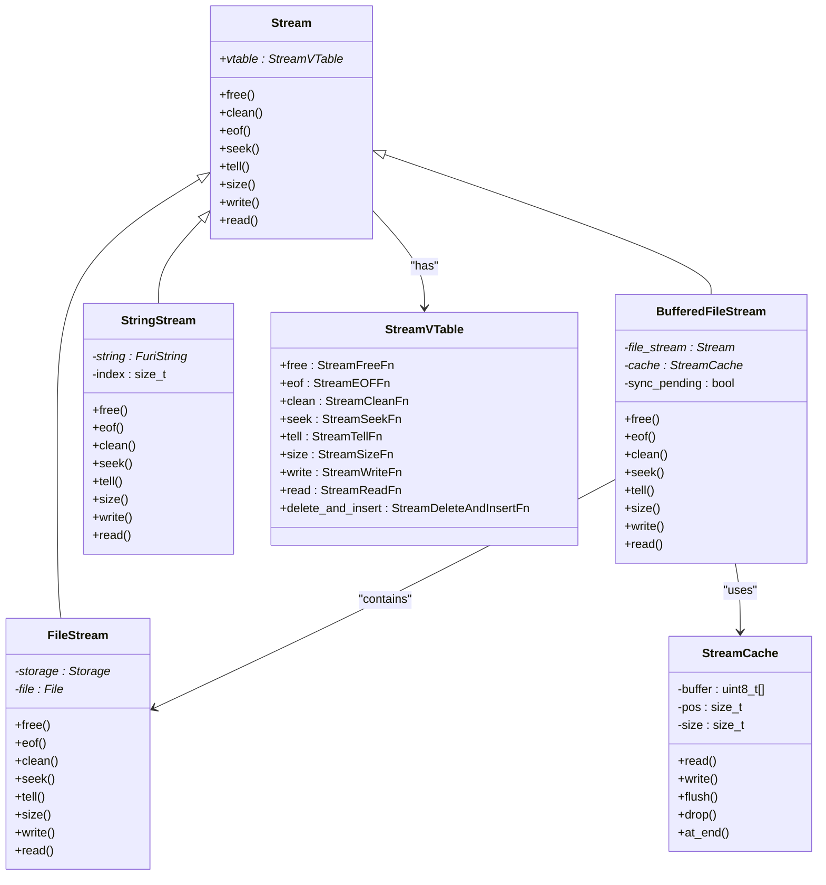
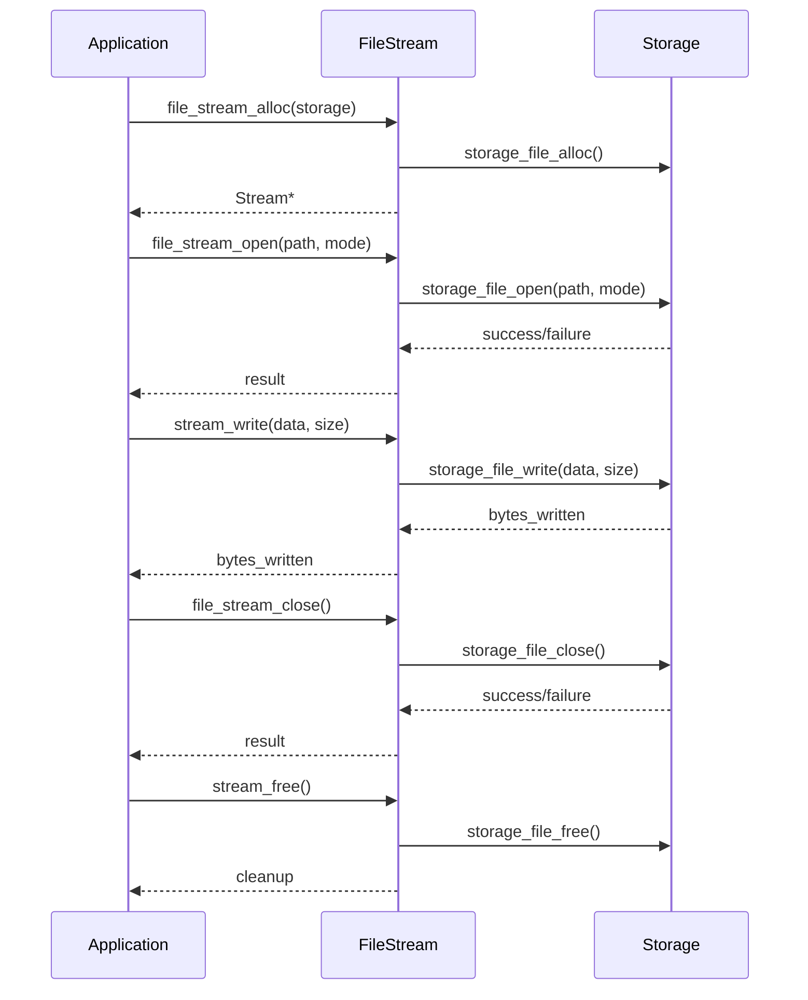
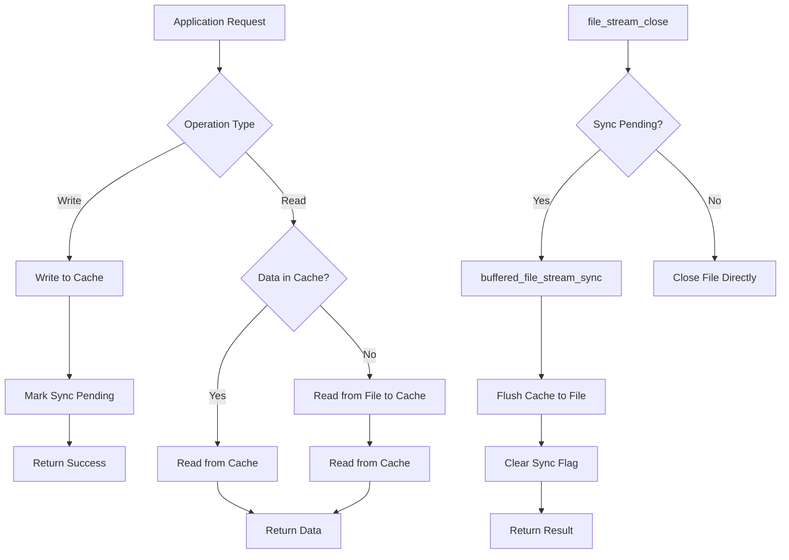
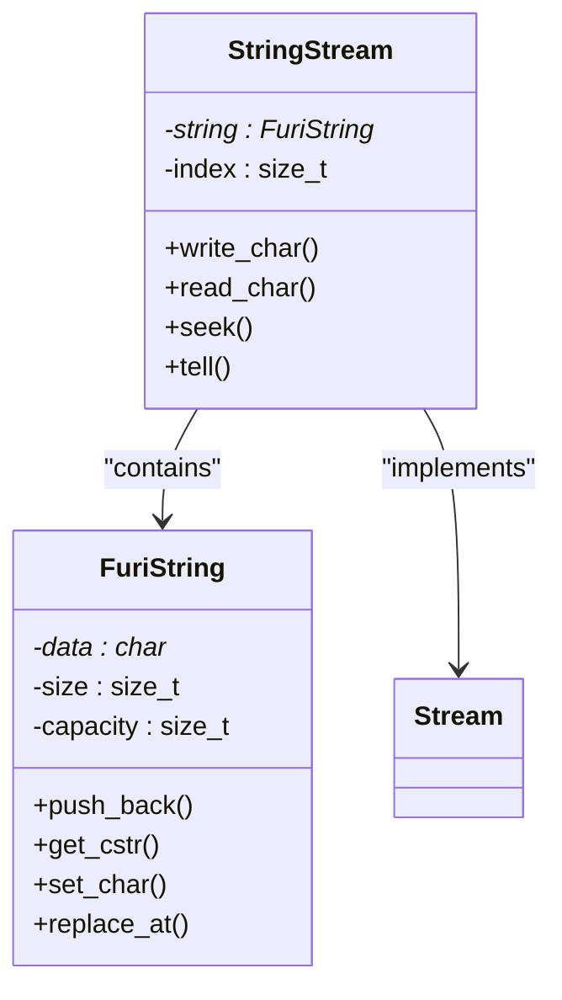
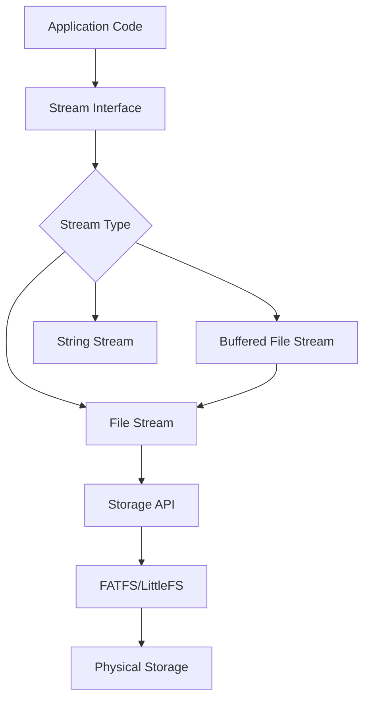

# Streams and I/O Utilities

<cite>
**Referenced Files in This Document**   
- [stream.h](file://lib/toolbox/stream/stream.h#L0-L354)
- [stream.c](file://lib/toolbox/stream/stream.c#L0-L436)
- [file_stream.h](file://lib/toolbox/stream/file_stream.h#L0-L48)
- [file_stream.c](file://lib/toolbox/stream/file_stream.c#L0-L218)
- [buffered_file_stream.h](file://lib/toolbox/stream/buffered_file_stream.h#L0-L54)
- [buffered_file_stream.c](file://lib/toolbox/stream/buffered_file_stream.c#L0-L254)
- [string_stream.h](file://lib/toolbox/stream/string_stream.h#L0-L18)
- [string_stream.c](file://lib/toolbox/stream/string_stream.c#L0-L180)
- [dir_walk.h](file://lib/toolbox/dir_walk.h#L0-L38)
- [dir_walk.c](file://lib/toolbox/dir_walk.c#L0-L199)
- [tar_archive.h](file://lib/toolbox/tar/tar_archive.h#L0-L45)
- [tar_archive.c](file://lib/toolbox/tar/tar_archive.c#L0-L200)
</cite>

## Table of Contents
1. [Introduction](#introduction)
2. [Core Stream Architecture](#core-stream-architecture)
3. [Abstract Stream Interface](#abstract-stream-interface)
4. [File-Based Stream Implementations](#file-based-stream-implementations)
5. [String Streams](#string-streams)
6. [Stream Caching and Buffering](#stream-caching-and-buffering)
7. [Directory Traversal Utilities](#directory-traversal-utilities)
8. [TAR Archive Handling](#tar-archive-handling)
9. [Error Handling and Memory Management](#error-handling-and-memory-management)
10. [Practical Examples](#practical-examples)
11. [Integration with Flipper Zero File System](#integration-with-flipper-zero-file-system)

## Introduction
The Streams and I/O Utilities library provides a comprehensive framework for data input/output operations in the Flipper Zero firmware. This document details the architecture and functionality of the stream subsystem, which enables efficient data processing and storage operations across various data sources including files, strings, and archives. The library implements a unified interface for different stream types, allowing consistent handling of data regardless of the underlying storage mechanism. This abstraction simplifies development while maintaining performance and reliability in resource-constrained embedded environments.

## Core Stream Architecture



**Diagram sources**
- [stream.h](file://lib/toolbox/stream/stream.h#L0-L354)
- [file_stream.h](file://lib/toolbox/stream/file_stream.h#L0-L48)
- [buffered_file_stream.h](file://lib/toolbox/stream/buffered_file_stream.h#L0-L54)
- [string_stream.h](file://lib/toolbox/stream/string_stream.h#L0-L18)

**Section sources**
- [stream.h](file://lib/toolbox/stream/stream.h#L0-L354)
- [stream.c](file://lib/toolbox/stream/stream.c#L0-L436)

## Abstract Stream Interface

The abstract stream interface provides a unified API for various data sources through the `Stream` structure and virtual function table pattern. This design enables polymorphic behavior where different stream implementations can be used interchangeably through the same interface.

```c
typedef struct Stream Stream;

typedef enum {
    StreamOffsetFromCurrent,
    StreamOffsetFromStart,
    StreamOffsetFromEnd,
} StreamOffset;

typedef enum {
    StreamDirectionForward,
    StreamDirectionBackward,
} StreamDirection;

typedef bool (*StreamWriteCB)(Stream* stream, const void* context);

typedef struct {
    void (*free)(Stream* stream);
    bool (*eof)(Stream* stream);
    void (*clean)(Stream* stream);
    bool (*seek)(Stream* stream, int32_t offset, StreamOffset offset_type);
    size_t (*tell)(Stream* stream);
    size_t (*size)(Stream* stream);
    size_t (*write)(Stream* stream, const uint8_t* data, size_t size);
    size_t (*read)(Stream* stream, uint8_t* data, size_t count);
    bool (*delete_and_insert)(
        Stream* stream,
        size_t delete_size,
        StreamWriteCB write_callback,
        const void* context);
} StreamVTable;

struct Stream {
    const StreamVTable* vtable;
};
```

The interface provides fundamental operations for stream manipulation:
- **Positioning**: `stream_seek()`, `stream_tell()`, `stream_rewind()`
- **Data transfer**: `stream_read()`, `stream_write()`
- **State management**: `stream_eof()`, `stream_size()`, `stream_clean()`
- **Advanced operations**: `stream_delete_and_insert()`, `stream_insert()`

**Section sources**
- [stream.h](file://lib/toolbox/stream/stream.h#L0-L354)
- [stream.c](file://lib/toolbox/stream/stream.c#L0-L436)

## File-Based Stream Implementations

### Basic File Stream

The `file_stream` implementation provides direct access to the Flipper Zero's file system through the Storage API. It serves as the foundation for file-based I/O operations.



**Diagram sources**
- [file_stream.h](file://lib/toolbox/stream/file_stream.h#L0-L48)
- [file_stream.c](file://lib/toolbox/stream/file_stream.c#L0-L218)

### Buffered File Stream

The `buffered_file_stream` enhances file operations with caching to reduce the number of physical I/O operations, improving performance especially for small, frequent reads and writes.



**Diagram sources**
- [buffered_file_stream.h](file://lib/toolbox/stream/buffered_file_stream.h#L0-L54)
- [buffered_file_stream.c](file://lib/toolbox/stream/buffered_file_stream.c#L0-L254)

**Section sources**
- [file_stream.h](file://lib/toolbox/stream/file_stream.h#L0-L48)
- [file_stream.c](file://lib/toolbox/stream/file_stream.c#L0-L218)
- [buffered_file_stream.h](file://lib/toolbox/stream/buffered_file_stream.h#L0-L54)
- [buffered_file_stream.c](file://lib/toolbox/stream/buffered_file_stream.c#L0-L254)

## String Streams

String streams provide in-memory stream functionality using `FuriString` as the underlying storage. This implementation is particularly useful for configuration parsing, data formatting, and temporary data manipulation.

```c
Stream* string_stream_alloc(void);
```

The string stream implementation offers several advantages:
- **Zero-copy operations**: Direct manipulation of string data
- **Dynamic sizing**: Automatic string expansion as data is written
- **Position tracking**: Standard stream positioning interface
- **Memory efficiency**: No additional buffering overhead



**Diagram sources**
- [string_stream.h](file://lib/toolbox/stream/string_stream.h#L0-L18)
- [string_stream.c](file://lib/toolbox/stream/string_stream.c#L0-L180)

**Section sources**
- [string_stream.h](file://lib/toolbox/stream/string_stream.h#L0-L18)
- [string_stream.c](file://lib/toolbox/stream/string_stream.c#L0-L180)

## Stream Caching and Buffering

The stream caching mechanism is implemented in `stream_cache.c` and provides a reusable buffer for optimizing I/O operations. This component is used by the buffered file stream to minimize physical file operations.

```c
typedef struct StreamCache StreamCache;

StreamCache* stream_cache_alloc(void);
void stream_cache_free(StreamCache* cache);
size_t stream_cache_read(StreamCache* cache, uint8_t* data, size_t size);
size_t stream_cache_write(StreamCache* cache, const uint8_t* data, size_t size);
bool stream_cache_flush(StreamCache* cache, Stream* destination);
void stream_cache_drop(StreamCache* cache);
```

Key features of the stream cache:
- **Fixed-size buffer**: Optimized for the constrained memory environment
- **Circular buffer semantics**: Efficient use of buffer space
- **Flush operations**: Controlled synchronization with underlying streams
- **Position tracking**: Maintains read/write position within the cache

The cache significantly improves performance for scenarios involving:
- Small, frequent writes that would otherwise cause many file system calls
- Sequential reads that can be prefetched into the buffer
- Temporary data staging before permanent storage

**Section sources**
- [buffered_file_stream.c](file://lib/toolbox/stream/buffered_file_stream.c#L0-L254)
- [stream_cache.c](file://lib/toolbox/stream/stream_cache.c#L0-L150)

## Directory Traversal Utilities

The `dir_walk` component provides recursive directory traversal capabilities, enabling applications to process file hierarchies efficiently.

```c
typedef bool (*DirWalkCallback)(const char* path, void* context);

bool dir_walk(const char* root_path, DirWalkCallback callback, void* context);
```

This utility supports:
- **Recursive traversal**: Automatic processing of nested directories
- **Callback-based processing**: Custom logic execution for each file/directory
- **Path filtering**: Integration with path utilities for selective processing
- **Error resilience**: Continues traversal despite individual file errors

Common use cases include:
- File system backups and synchronization
- Bulk file operations (renaming, conversion)
- Content indexing and searching
- Storage analysis and cleanup

**Section sources**
- [dir_walk.h](file://lib/toolbox/dir_walk.h#L0-L38)
- [dir_walk.c](file://lib/toolbox/dir_walk.c#L0-L199)

## TAR Archive Handling

The TAR archive implementation provides basic archiving capabilities for bundling multiple files into a single container.

```c
typedef struct TarArchive TarArchive;

TarArchive* tar_archive_open(const char* path, FS_AccessMode mode);
bool tar_archive_close(TarArchive* archive);
bool tar_archive_add_file(TarArchive* archive, const char* source_path, const char* archive_path);
bool tar_archive_extract_file(TarArchive* archive, const char* archive_path, const char* dest_path);
```

Key features:
- **Streaming interface**: Memory-efficient processing of large archives
- **File-level operations**: Add and extract individual files without loading the entire archive
- **Standard TAR format**: Compatibility with common archive tools
- **Error handling**: Robust processing of corrupted or incomplete archives

The implementation is optimized for the Flipper Zero's constraints:
- Minimal memory footprint
- Progressive processing
- Integration with the existing stream architecture

**Section sources**
- [tar_archive.h](file://lib/toolbox/tar/tar_archive.h#L0-L45)
- [tar_archive.c](file://lib/toolbox/tar/tar_archive.c#L0-L200)

## Error Handling and Memory Management

The stream utilities employ a comprehensive error handling strategy that ensures reliability in the embedded environment:

### Error Propagation
- **Return value checking**: All operations return status codes
- **Error chaining**: Underlying storage errors are propagated through the stream interface
- **Graceful degradation**: Operations continue when possible despite partial failures

### Memory Management
- **Explicit allocation/deallocation**: All streams must be freed with `stream_free()`
- **Resource cleanup**: Associated resources (files, buffers) are released during stream cleanup
- **Memory safety**: Bounds checking and null pointer validation in critical paths

```mermaid
flowchart TD
A[Operation Request] --> B{Valid Stream?}
B --> |No| C[furi_check() failure]
B --> |Yes| D[Execute Operation]
D --> E{Success?}
E --> |Yes| F[Return Success]
E --> |No| G[Return Error Code]
G --> H[Preserve Stream State]
H --> I[Allow Recovery Attempts]
```

**Section sources**
- [stream.c](file://lib/toolbox/stream/stream.c#L0-L436)
- [file_stream.c](file://lib/toolbox/stream/file_stream.c#L0-L218)
- [buffered_file_stream.c](file://lib/toolbox/stream/buffered_file_stream.c#L0-L254)

## Practical Examples

### Reading Configuration Files

```c
// Example: Reading a configuration file with error handling
bool read_config_file(Storage* storage, const char* path, ConfigData* config) {
    Stream* stream = file_stream_alloc(storage);
    bool success = false;
    
    do {
        if(!file_stream_open(stream, path, FSAM_READ, FSOM_OPEN_EXISTING)) {
            break;
        }
        
        // Read configuration line by line
        FuriString* line = furi_string_alloc();
        while(stream_read_line(stream, line)) {
            if(furi_string_start_with_str(line, "setting=")) {
                parse_setting(config, line);
            }
        }
        furi_string_free(line);
        
        success = true;
    } while(false);
    
    file_stream_close(stream);
    stream_free(stream);
    
    return success;
}
```

### Directory Traversal for File Processing

```c
// Example: Recursive directory traversal to find specific files
typedef struct {
    FuriString* pattern;
    FuriStringArray* matches;
} SearchContext;

bool search_callback(const char* path, void* context) {
    SearchContext* ctx = (SearchContext*)context;
    if(strstr(path, furi_string_get_cstr(ctx->pattern))) {
        furi_string_array_push_back(ctx->matches, path);
    }
    return true; // Continue traversal
}

void find_files(const char* root_path, const char* pattern) {
    SearchContext ctx = {
        .pattern = furi_string_alloc_set(pattern),
        .matches = furi_string_array_alloc()
    };
    
    dir_walk(root_path, search_callback, &ctx);
    
    // Process matches
    for(size_t i = 0; i < furi_string_array_size(ctx.matches); i++) {
        printf("Found: %s\n", furi_string_get_cstr(furi_string_array_get(ctx.matches, i)));
    }
    
    furi_string_free(ctx.pattern);
    furi_string_array_free(ctx.matches);
}
```

### TAR Archive Creation

```c
// Example: Creating a TAR archive from multiple files
bool create_backup_archive(Storage* storage, const char* archive_path, const char* source_dir) {
    Stream* stream = buffered_file_stream_alloc(storage);
    TarArchive* archive = NULL;
    bool success = false;
    
    do {
        if(!buffered_file_stream_open(stream, archive_path, FSAM_WRITE, FSOM_CREATE_ALWAYS)) {
            break;
        }
        
        archive = tar_archive_open_from_stream(stream);
        if(!archive) break;
        
        // Add all files from directory
        SearchContext ctx = {
            .pattern = furi_string_alloc(),
            .matches = furi_string_array_alloc()
        };
        
        dir_walk(source_dir, collect_all_files, &ctx);
        
        for(size_t i = 0; i < furi_string_array_size(ctx.matches); i++) {
            const char* file_path = furi_string_get_cstr(furi_string_array_get(ctx.matches, i));
            const char* arc_path = path_basename(file_path);
            if(!tar_archive_add_file(archive, file_path, arc_path)) {
                break;
            }
        }
        
        furi_string_free(ctx.pattern);
        furi_string_array_free(ctx.matches);
        
        success = true;
    } while(false);
    
    if(archive) tar_archive_close(archive);
    buffered_file_stream_close(stream);
    stream_free(stream);
    
    return success;
}
```

**Section sources**
- [stream.h](file://lib/toolbox/stream/stream.h#L0-L354)
- [file_stream.h](file://lib/toolbox/stream/file_stream.h#L0-L48)
- [buffered_file_stream.h](file://lib/toolbox/stream/buffered_file_stream.h#L0-L54)
- [dir_walk.h](file://lib/toolbox/dir_walk.h#L0-L38)
- [tar_archive.h](file://lib/toolbox/tar/tar_archive.h#L0-L45)

## Integration with Flipper Zero File System

The stream utilities are tightly integrated with the Flipper Zero's storage subsystem, providing a high-level interface to the underlying file system.

### Architecture Layers


### Key Integration Points
- **Storage abstraction**: All file streams require a `Storage*` instance
- **Path handling**: Integration with `path.c` utilities for cross-platform compatibility
- **Error mapping**: Translation between stream errors and file system errors
- **Memory constraints**: Optimized buffer sizes for the device's RAM limitations

The integration enables:
- **Unified I/O interface**: Consistent API across different data sources
- **Resource efficiency**: Shared code paths and optimized memory usage
- **Reliability**: Comprehensive error handling and recovery mechanisms
- **Extensibility**: Easy addition of new stream types and storage backends

**Section sources**
- [file_stream.c](file://lib/toolbox/stream/file_stream.c#L0-L218)
- [buffered_file_stream.c](file://lib/toolbox/stream/buffered_file_stream.c#L0-L254)
- [lib/toolbox/path.h](file://lib/toolbox/path.h#L0-L50)
- [services/storage/storage.h](file://applications/services/storage/storage.h#L0-L200)