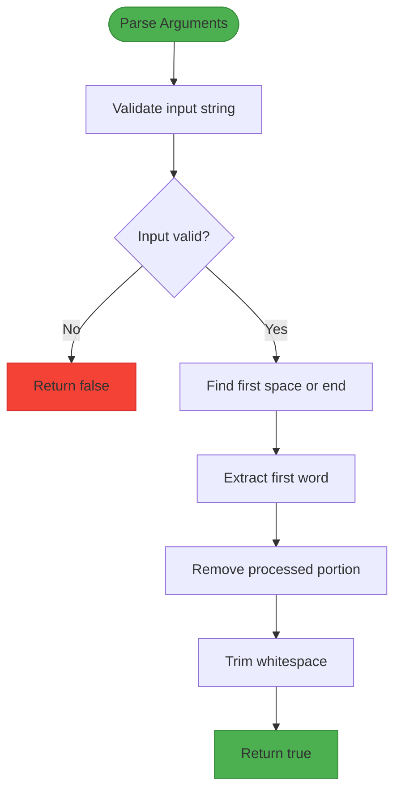
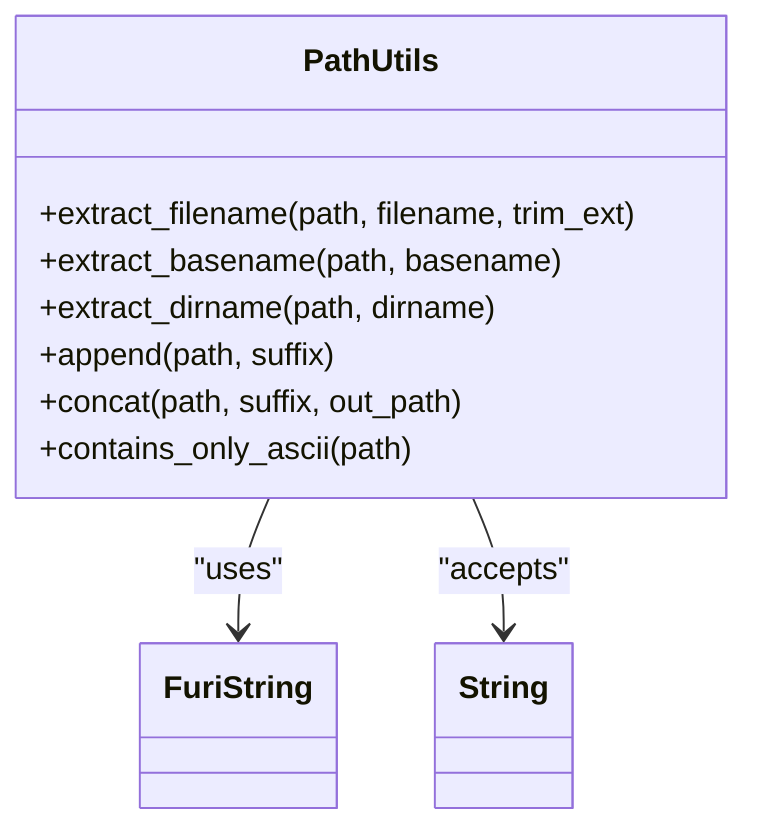
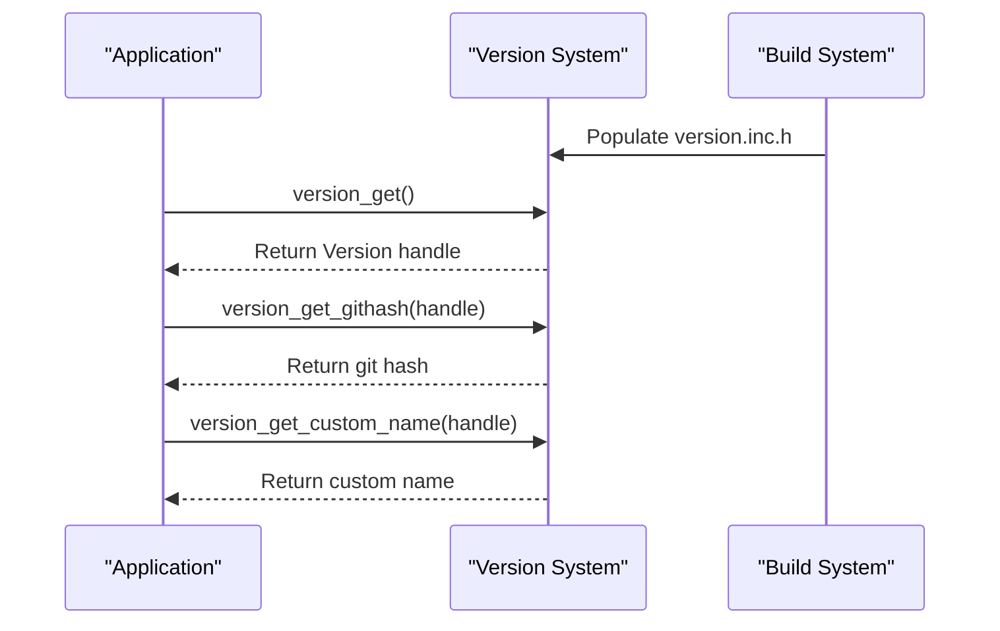
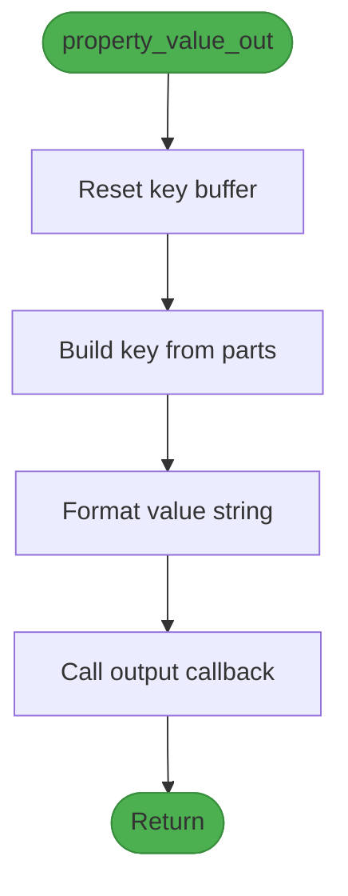
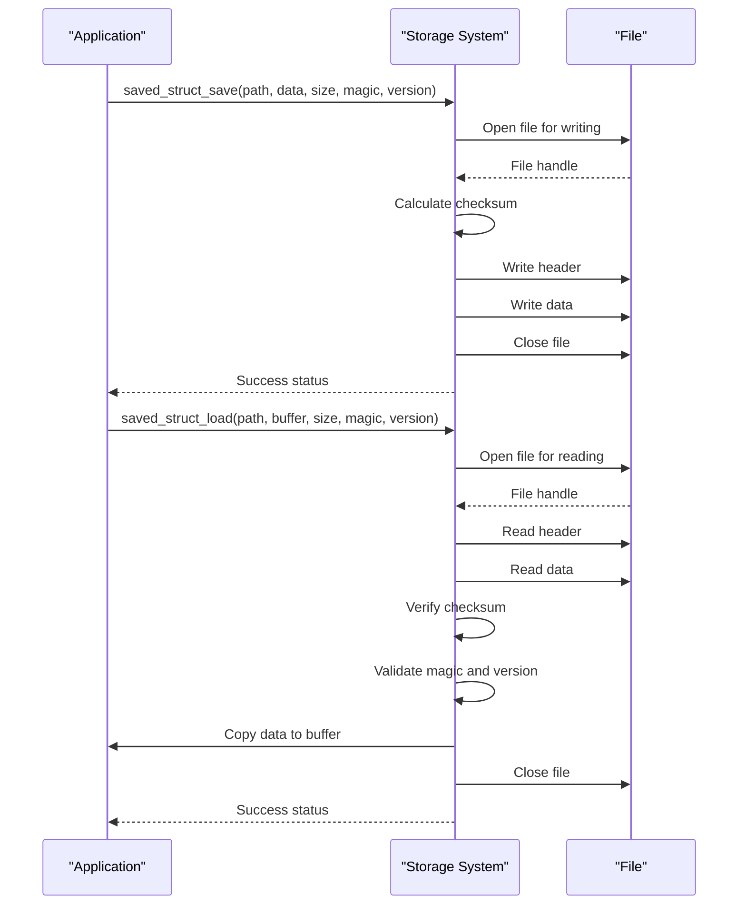
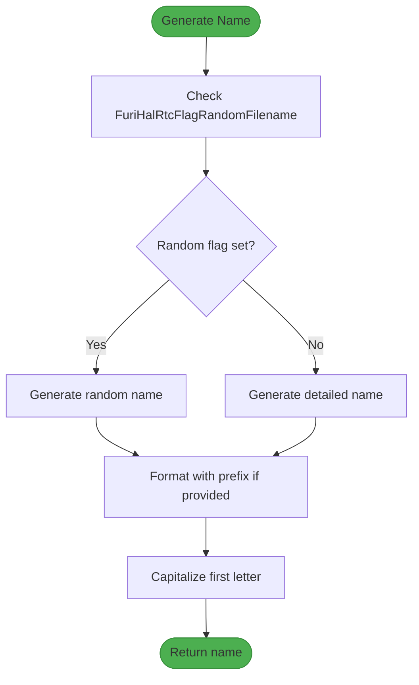
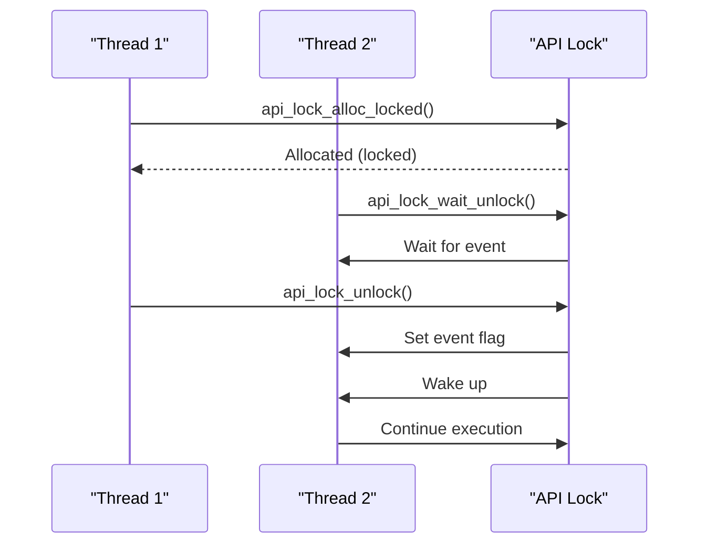
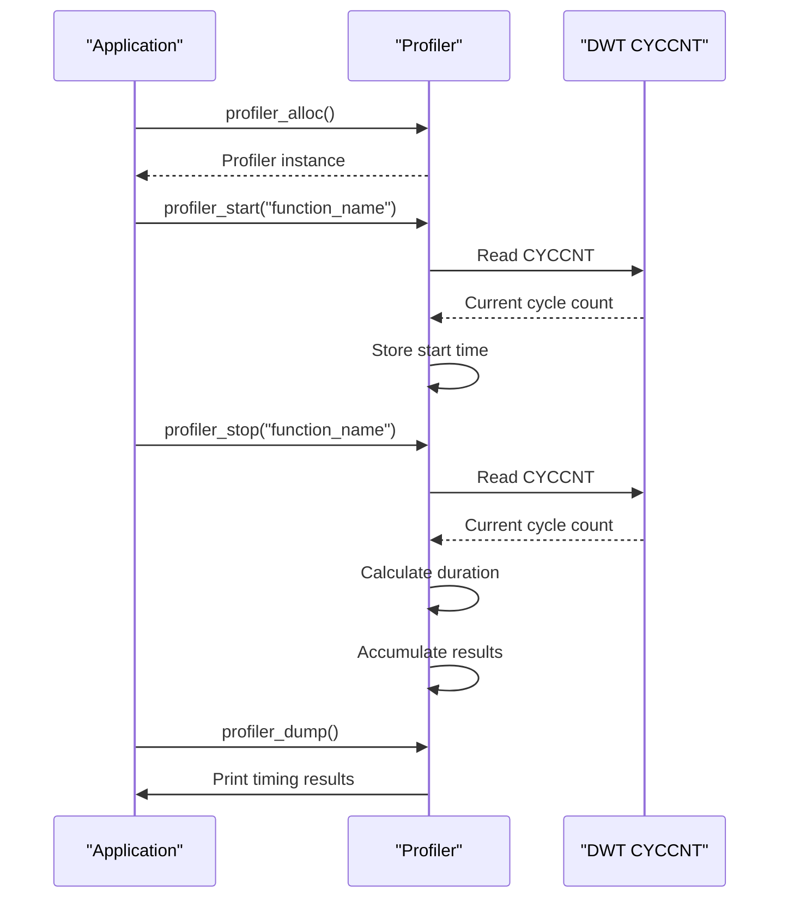

# System Utilities

<cite>
**Referenced Files in This Document**   
- [args.h](file://lib/toolbox/args.h#L1-L82)
- [args.c](file://lib/toolbox/args.c#L1-L100)
- [path.h](file://lib/toolbox/path.h#L1-L87)
- [path.c](file://lib/toolbox/path.c#L1-L148)
- [version.h](file://lib/toolbox/version.h#L1-L117)
- [version.c](file://lib/toolbox/version.c#L1-L99)
- [property.h](file://lib/toolbox/property.h#L1-L40)
- [property.c](file://lib/toolbox/property.c#L1-L34)
- [saved_struct.h](file://lib/toolbox/saved_struct.h#L1-L65)
- [saved_struct.c](file://lib/toolbox/saved_struct.c#L1-L183)
- [name_generator.h](file://lib/toolbox/name_generator.h#L1-L52)
- [name_generator.c](file://lib/toolbox/name_generator.c#L1-L104)
- [api_lock.h](file://lib/toolbox/api_lock.h#L1-L44)
- [profiler.h](file://lib/toolbox/profiler.h#L1-L24)
- [profiler.c](file://lib/toolbox/profiler.c#L1-L88)
</cite>

## Table of Contents
1. [Introduction](#introduction)
2. [Argument Parsing Utilities](#argument-parsing-utilities)
3. [Path Manipulation Functions](#path-manipulation-functions)
4. [Version Management System](#version-management-system)
5. [Property System](#property-system)
6. [Structured Data Persistence](#structured-data-persistence)
7. [Name Generation Tools](#name-generation-tools)
8. [API Locking Mechanisms](#api-locking-mechanisms)
9. [Profiling Utilities](#profiling-utilities)
10. [Integration and Usage Patterns](#integration-and-usage-patterns)

## Introduction
The Toolbox library in the Flipper Zero firmware provides a comprehensive collection of utility functions that support application development, configuration management, and performance analysis. These utilities form the foundational layer for various system components and applications, offering standardized solutions for common programming tasks. The system utilities cover essential functionality including command-line argument parsing, file path manipulation, version information management, property-based data output, structured data persistence, unique name generation, thread-safe API access, and code execution profiling. These components are designed to be lightweight, efficient, and easy to integrate, following the embedded systems constraints of the Flipper Zero platform. The utilities are implemented in C with careful attention to memory management, error handling, and performance characteristics suitable for resource-constrained environments.

**Section sources**
- [args.h](file://lib/toolbox/args.h#L1-L82)
- [path.h](file://lib/toolbox/path.h#L1-L87)
- [version.h](file://lib/toolbox/version.h#L1-L117)

## Argument Parsing Utilities

The argument parsing utilities in the Toolbox library provide functions for extracting and processing command-line arguments or configuration strings. These functions are designed to handle common parsing scenarios encountered in embedded applications, particularly when processing user input or configuration parameters.

The core functionality is provided by three main functions that extract different types of values from argument strings:

- `args_read_int_and_trim`: Extracts an integer value from the beginning of an argument string and removes it
- `args_read_string_and_trim`: Extracts the first word from an argument string and removes it
- `args_read_probably_quoted_string_and_trim`: Extracts a string that may be enclosed in quotes, handling quoted arguments properly

Additionally, the library provides functions for parsing hexadecimal data:

- `args_read_hex_bytes`: Converts a string of hexadecimal ASCII characters into a byte array
- `args_char_to_hex`: Converts two hexadecimal characters into a single byte value

These utilities work with FuriString objects, which are dynamic string containers that handle memory management automatically. The parsing functions modify the input string by removing the processed portion, allowing for sequential processing of multiple arguments.

**Diagram sources**
- [args.h](file://lib/toolbox/args.h#L1-L82)
- [args.c](file://lib/toolbox/args.c#L1-L100)

**Section sources**
- [args.h](file://lib/toolbox/args.h#L1-L82)
- [args.c](file://lib/toolbox/args.c#L1-L100)

## Path Manipulation Functions

The path manipulation utilities provide comprehensive functions for working with file system paths in a platform-independent manner. These functions handle common operations such as extracting filename components, combining paths, and validating path strings.

Key functions include:

- `path_extract_filename`: Extracts the filename from a path, with option to include or exclude the extension
- `path_extract_filename_no_ext`: Extracts filename without extension
- `path_extract_ext_str`: Extracts file extension as a string
- `path_extract_basename`: Extracts the last component of a path
- `path_extract_dirname`: Extracts the directory portion of a path
- `path_append`: Appends a component to an existing path
- `path_concat`: Combines two path components into a new path
- `path_contains_only_ascii`: Validates that a path contains only ASCII characters

These functions work with both string pointers and FuriString objects, providing flexibility in usage. The implementation handles various edge cases such as multiple path separators and ensures proper formatting of the resulting paths.

**Diagram sources**
- [path.h](file://lib/toolbox/path.h#L1-L87)
- [path.c](file://lib/toolbox/path.c#L1-L148)

**Section sources**
- [path.h](file://lib/toolbox/path.h#L1-L87)
- [path.c](file://lib/toolbox/path.c#L1-L148)

## Version Management System

The version management system provides access to build-time and runtime version information for the firmware. This utility is essential for identifying the current firmware version, build configuration, and source control metadata.

The Version structure contains the following information:

- Git commit hash
- Git branch name
- Build date and time
- Firmware version (last git tag)
- Hardware target
- Dirty flag (indicating uncommitted changes)
- Firmware origin (official or fork name)
- Custom Flipper name (user-defined device name)

Key functions include:

- `version_get()`: Returns a handle to the current version information
- `version_get_githash()`: Retrieves the git commit hash
- `version_get_gitbranch()`: Retrieves the git branch name
- `version_get_builddate()`: Retrieves the build timestamp
- `version_get_version()`: Retrieves the firmware version
- `version_get_custom_name()`: Retrieves the custom device name
- `version_set_custom_name()`: Sets a custom device name
- `version_get_target()`: Retrieves the hardware target
- `version_get_dirty_flag()`: Checks if the build has uncommitted changes

The version information is populated at build time from generated header files and can be accessed throughout the application lifecycle.

**Diagram sources**
- [version.h](file://lib/toolbox/version.h#L1-L117)
- [version.c](file://lib/toolbox/version.c#L1-L99)

**Section sources**
- [version.h](file://lib/toolbox/version.h#L1-L117)
- [version.c](file://lib/toolbox/version.c#L1-L99)

## Property System

The property system provides a flexible mechanism for outputting key-value pairs of device information through a callback interface. This utility is designed for scenarios where structured data needs to be formatted and transmitted, such as in diagnostic outputs or configuration exports.

The core component is the `PropertyValueContext` structure which contains:

- `key`: String buffer for building the property key
- `value`: String buffer for the property value
- `out`: Callback function to receive the key-value pair
- `sep`: Separator character for key parts
- `last`: Flag indicating the last property
- `context`: User-defined context passed to the callback

The main function `property_value_out()` builds a key from multiple parts separated by the specified separator, formats the value according to the provided format string, and invokes the output callback with the complete key-value pair.

This system enables a consistent approach to property output across different components while allowing customization of the output destination through the callback mechanism.

**Diagram sources**
- [property.h](file://lib/toolbox/property.h#L1-L40)
- [property.c](file://lib/toolbox/property.c#L1-L34)

**Section sources**
- [property.h](file://lib/toolbox/property.h#L1-L40)
- [property.c](file://lib/toolbox/property.c#L1-L34)

## Structured Data Persistence

The structured data persistence utilities provide a reliable mechanism for saving and loading binary data structures to and from files with integrity checking. This system ensures data consistency through checksum validation and version compatibility checking.

The `saved_struct` system uses a file format with the following components:

- Header containing magic number, version, checksum, flags, and timestamp
- Payload containing the actual data

Key functions include:

- `saved_struct_save()`: Saves data to a file with metadata and checksum
- `saved_struct_load()`: Loads data from a file with integrity verification
- `saved_struct_get_metadata()`: Retrieves metadata from a saved structure file

The system performs multiple validation checks:
- File size validation
- Magic number verification (ensures correct file type)
- Version compatibility checking
- Checksum validation (ensures data integrity)

This approach provides a robust solution for persistent storage of configuration data, application state, and other structured information.

**Diagram sources**
- [saved_struct.h](file://lib/toolbox/saved_struct.h#L1-L65)
- [saved_struct.c](file://lib/toolbox/saved_struct.c#L1-L183)

**Section sources**
- [saved_struct.h](file://lib/toolbox/saved_struct.h#L1-L65)
- [saved_struct.c](file://lib/toolbox/saved_struct.c#L1-L183)

## Name Generation Tools

The name generation utilities provide functions for creating unique and descriptive names for files and other entities. These functions support different naming strategies based on user preferences and system configuration.

The library offers several naming modes:

- **Random names**: Combines random adjectives and nouns from predefined lists
- **Detailed names**: Uses timestamp-based naming with optional prefixes
- **Automatic names**: Selects between random and detailed naming based on system flags

Key functions include:

- `name_generator_make_random()`: Generates a random name from word lists
- `name_generator_make_detailed()`: Generates a timestamp-based name
- `name_generator_make_auto()`: Automatically selects naming strategy
- `name_generator_make_random_prefixed()`: Generates random name with prefix
- `name_generator_make_detailed_datetime()`: Generates detailed name with custom time

The random naming system uses two word lists:
- Left words (adjectives): "big", "cheeky", "feral", "great", etc.
- Right words (nouns): "abyss", "alarm", "artefact", "basement", etc.

The detailed naming format follows the pattern: `[prefix]-YYYYMMDD-HHMMSS`

**Diagram sources**
- [name_generator.h](file://lib/toolbox/name_generator.h#L1-L52)
- [name_generator.c](file://lib/toolbox/name_generator.c#L1-L104)

**Section sources**
- [name_generator.h](file://lib/toolbox/name_generator.h#L1-L52)
- [name_generator.c](file://lib/toolbox/name_generator.c#L1-L104)

## API Locking Mechanisms

The API locking mechanism provides a lightweight synchronization primitive for protecting critical sections in multi-threaded environments. The implementation uses FuriEventFlag for efficient thread signaling.

The system is designed with performance in mind, as indicated by the benchmark comments in the header file. The implementation choices reflect careful consideration of execution overhead:

- Uses FuriEventFlag instead of mutexes or semaphores for lower overhead
- Provides simple macros for common operations
- Minimizes the number of function calls in the critical path

Key components:

- `FuriApiLock`: Type definition for the lock (pointer to FuriEventFlag)
- `API_LOCK_EVENT`: Event flag bit used for signaling
- `api_lock_alloc_locked()`: Allocates and initializes the lock in locked state
- `api_lock_wait_unlock()`: Waits for the lock to be released
- `api_lock_unlock()`: Releases the lock
- `api_lock_free()`: Frees the lock resources
- `api_lock_wait_unlock_and_free()`: Convenience macro for wait and free

The benchmark results in the header file show that FuriEventFlag provides better performance than FuriSemaphore, FuriMutex, and even approaches the speed of no locking in some test cases.

**Diagram sources**
- [api_lock.h](file://lib/toolbox/api_lock.h#L1-L44)

**Section sources**
- [api_lock.h](file://lib/toolbox/api_lock.h#L1-L44)

## Profiling Utilities

The profiling utilities provide a simple yet effective system for measuring code execution performance. The profiler uses the processor's cycle counter (DWT CYCCNT) for high-precision timing measurements.

The Profiler system consists of:

- `Profiler` structure containing a dictionary of timing records
- `ProfilerRecord` structure storing timing data for each profiled section
- Hash table implementation using M-dict for efficient key-value storage

Key functions:

- `profiler_alloc()`: Creates a new profiler instance
- `profiler_free()`: Destroys a profiler instance
- `profiler_prealloc()`: Pre-allocates a timing record
- `profiler_start()`: Starts timing for a named section
- `profiler_stop()`: Stops timing and accumulates results
- `profiler_dump()`: Outputs timing results to console

The profiler measures execution time in processor cycles and converts to human-readable units (seconds, milliseconds, microseconds). For sections executed multiple times, it provides both total and average execution times.

The implementation uses the DWT (Data Watchpoint and Trace) unit's cycle counter, which provides high-resolution timing with minimal overhead.

**Diagram sources**
- [profiler.h](file://lib/toolbox/profiler.h#L1-L24)
- [profiler.c](file://lib/toolbox/profiler.c#L1-L88)

**Section sources**
- [profiler.h](file://lib/toolbox/profiler.h#L1-L24)
- [profiler.c](file://lib/toolbox/profiler.c#L1-L88)

## Integration and Usage Patterns

The Toolbox utilities are designed to work together seamlessly and integrate with other system components. Common integration patterns include:

**Configuration Management**
- Using `saved_struct` for persistent storage of application settings
- Combining `name_generator` with `path` functions to create unique file names
- Using `args` parsing for command-line configuration

**System Information Reporting**
- Using `version` functions to report firmware information
- Using `property` system to format device information
- Combining multiple utilities for comprehensive system reports

**Performance Monitoring**
- Using `profiler` to identify performance bottlenecks
- Combining profiling with version information for comparative analysis
- Using structured data persistence to store performance metrics

**Thread-Safe Operations**
- Using `api_lock` to protect shared resources
- Combining locking with data persistence operations
- Ensuring thread safety in configuration management

These utilities follow consistent design principles:
- Clear separation of concerns
- Minimal memory footprint
- Efficient execution
- Comprehensive error handling
- Easy integration through simple APIs

The modular design allows developers to use individual utilities as needed while providing a cohesive system for application development on the Flipper Zero platform.

**Section sources**
- [args.h](file://lib/toolbox/args.h#L1-L82)
- [path.h](file://lib/toolbox/path.h#L1-L87)
- [version.h](file://lib/toolbox/version.h#L1-L117)
- [property.h](file://lib/toolbox/property.h#L1-L40)
- [saved_struct.h](file://lib/toolbox/saved_struct.h#L1-L65)
- [name_generator.h](file://lib/toolbox/name_generator.h#L1-L52)
- [api_lock.h](file://lib/toolbox/api_lock.h#L1-L44)
- [profiler.h](file://lib/toolbox/profiler.h#L1-L24)