# Toolbox Utilities

<cite>
**Referenced Files in This Document**   
- [args.h](file://lib/toolbox/args.h)
- [path.h](file://lib/toolbox/path.h)
- [version.h](file://lib/toolbox/version.h)
- [property.h](file://lib/toolbox/property.h)
- [saved_struct.h](file://lib/toolbox/saved_struct.h)
- [strint.h](file://lib/toolbox/strint.h)
- [varint.h](file://lib/toolbox/varint.h)
- [bit_buffer.h](file://lib/toolbox/bit_buffer.h)
- [compress.h](file://lib/toolbox/compress.h)
- [md5_calc.h](file://lib/toolbox/md5_calc.h)
- [crc32_calc.h](file://lib/toolbox/crc32_calc.h)
- [pretty_format.h](file://lib/toolbox/pretty_format.h)
- [colors.h](file://lib/toolbox/colors.h)
- [name_generator.h](file://lib/toolbox/name_generator.h)
- [simple_array.h](file://lib/toolbox/simple_array.h)
- [stream.h](file://lib/toolbox/stream.h)
- [file_stream.h](file://lib/toolbox/stream/file_stream.h)
- [buffered_file_stream.h](file://lib/toolbox/stream/buffered_file_stream.h)
- [string_stream.h](file://lib/toolbox/stream/string_stream.h)
- [stream_cache.h](file://lib/toolbox/stream/stream_cache.h)
- [dir_walk.h](file://lib/toolbox/dir_walk.h)
- [pulse_joiner.h](file://lib/toolbox/pulse_joiner.h)
- [keys_dict.h](file://lib/toolbox/keys_dict.h)
- [protocol_dict.h](file://lib/toolbox/protocols/protocol_dict.h)
- [pulse_glue.h](file://lib/toolbox/pulse_protocols/pulse_glue.h)
- [tar_archive.h](file://lib/toolbox/tar/tar_archive.h)
- [hex.h](file://lib/toolbox/hex.h)
- [float_tools.h](file://lib/toolbox/float_tools.h)
- [value_index.h](file://lib/toolbox/value_index.h)
- [profiler.h](file://lib/toolbox/profiler.h)
- [manchester_encoder.h](file://lib/toolbox/manchester_encoder.h)
- [manchester_decoder.h](file://lib/toolbox/manchester_decoder.h)
- [m_cstr_dup.h](file://lib/toolbox/m_cstr_dup.h)
</cite>

## Table of Contents
1. [Introduction](#introduction)
2. [Core Utility Modules](#core-utility-modules)
3. [Argument Parsing](#argument-parsing)
4. [Path Manipulation](#path-manipulation)
5. [Version Management](#version-management)
6. [Property System](#property-system)
7. [Structured Data Saving](#structured-data-saving)
8. [String-to-Integer Conversion](#string-to-integer-conversion)
9. [Variable-Length Integer Encoding](#variable-length-integer-encoding)
10. [Bit Buffer Operations](#bit-buffer-operations)
11. [Data Compression](#data-compression)
12. [Cryptographic Hash Functions](#cryptographic-hash-functions)
13. [Pretty Formatting](#pretty-formatting)
14. [Color Utilities](#color-utilities)
15. [Name Generation](#name-generation)
16. [Simple Arrays](#simple-arrays)
17. [Stream Abstractions](#stream-abstractions)
18. [Directory Walking](#directory-walking)
19. [Pulse Processing](#pulse-processing)
20. [Dictionary Systems](#dictionary-systems)
21. [Pulse Protocol Glue](#pulse-protocol-glue)
22. [TAR Archive Handling](#tar-archive-handling)
23. [Hexadecimal Utilities](#hexadecimal-utilities)
24. [Floating-Point Tools](#floating-point-tools)
25. [Value Indexing](#value-indexing)
26. [Profiling](#profiling)
27. [Manchester Encoding/Decoding](#manchester-encodingdecoding)
28. [String Duplication](#string-duplication)

## Introduction
The Toolbox utility library is a comprehensive collection of low-level utilities designed to support various functionalities within the Flipper Zero firmware ecosystem. These utilities provide essential services ranging from basic data manipulation to complex system interactions. The library is structured into modular components, each focusing on a specific domain of functionality, enabling developers to leverage well-tested, reusable code across different applications and services.

This documentation provides a detailed overview of each utility module, including implementation details, usage patterns, and code examples. The goal is to make these tools accessible to developers of all skill levels, from beginners to advanced users.

## Core Utility Modules
The Toolbox library is organized into several key modules, each serving a distinct purpose. These modules are designed to be lightweight, efficient, and easy to integrate into various parts of the firmware. The modular design ensures that developers can include only the components they need, minimizing code bloat and resource usage.

```mermaid
graph TD
A[Toolbox Utilities] --> B[Argument Parsing]
A --> C[Path Manipulation]
A --> D[Version Management]
A --> E[Property System]
A --> F[Structured Data Saving]
A --> G[String-to-Integer Conversion]
A --> H[Variable-Length Integer Encoding]
A --> I[Bit Buffer Operations]
A --> J[Data Compression]
A --> K[Cryptographic Hash Functions]
A --> L[Pretty Formatting]
A --> M[Color Utilities]
A --> N[Name Generation]
A --> O[Simple Arrays]
A --> P[Stream Abstractions]
A --> Q[Directory Walking]
A --> R[Pulse Processing]
A --> S[Dictionary Systems]
A --> T[Pulse Protocol Glue]
A --> U[TAR Archive Handling]
A --> V[Hexadecimal Utilities]
A --> W[Floating-Point Tools]
A --> X[Value Indexing]
A --> Y[Profiling]
A --> Z[Manchester Encoding/Decoding]
A --> AA[String Duplication]
```



**Diagram sources**
- [args.h](file://lib/toolbox/args.h)
- [path.h](file://lib/toolbox/path.h)
- [version.h](file://lib/toolbox/version.h)
- [property.h](file://lib/toolbox/property.h)
- [saved_struct.h](file://lib/toolbox/saved_struct.h)
- [strint.h](file://lib/toolbox/strint.h)
- [varint.h](file://lib/toolbox/varint.h)
- [bit_buffer.h](file://lib/toolbox/bit_buffer.h)
- [compress.h](file://lib/toolbox/compress.h)
- [md5_calc.h](file://lib/toolbox/md5_calc.h)
- [crc32_calc.h](file://lib/toolbox/crc32_calc.h)
- [pretty_format.h](file://lib/toolbox/pretty_format.h)
- [colors.h](file://lib/toolbox/colors.h)
- [name_generator.h](file://lib/toolbox/name_generator.h)
- [simple_array.h](file://lib/toolbox/simple_array.h)
- [stream.h](file://lib/toolbox/stream.h)
- [dir_walk.h](file://lib/toolbox/dir_walk.h)
- [pulse_joiner.h](file://lib/toolbox/pulse_joiner.h)
- [keys_dict.h](file://lib/toolbox/keys_dict.h)
- [protocol_dict.h](file://lib/toolbox/protocols/protocol_dict.h)
- [pulse_glue.h](file://lib/toolbox/pulse_protocols/pulse_glue.h)
- [tar_archive.h](file://lib/toolbox/tar/tar_archive.h)
- [hex.h](file://lib/toolbox/hex.h)
- [float_tools.h](file://lib/toolbox/float_tools.h)
- [value_index.h](file://lib/toolbox/value_index.h)
- [profiler.h](file://lib/toolbox/profiler.h)
- [manchester_encoder.h](file://lib/toolbox/manchester_encoder.h)
- [manchester_decoder.h](file://lib/toolbox/manchester_decoder.h)
- [m_cstr_dup.h](file://lib/toolbox/m_cstr_dup.h)

## Argument Parsing
The argument parsing module provides functions for extracting and processing command-line arguments. It supports various data types, including integers, strings, and hexadecimal values.

### Key Functions
- **args_read_int_and_trim**: Extracts an integer value from the argument string and trims the string.
- **args_read_string_and_trim**: Extracts the first argument from the argument string and trims the string.
- **args_read_probably_quoted_string_and_trim**: Extracts the first quoted argument from the argument string and trims the string.
- **args_read_hex_bytes**: Converts hex ASCII values to a byte array.

### Example Usage
```c
FuriString* args = furi_string_alloc_set("123 abc 0x1A");
int value;
if(args_read_int_and_trim(args, &value)) {
    // value is now 123
}
```

**Section sources**
- [args.h](file://lib/toolbox/args.h#L15-L81)

## Path Manipulation
The path manipulation module provides functions for extracting and modifying file paths. It supports operations such as extracting filenames, extensions, and directory names.

### Key Functions
- **path_extract_filename_no_ext**: Extracts the filename without the extension from the path.
- **path_extract_filename**: Extracts the filename from the path, with an option to trim the extension.
- **path_extract_ext_str**: Extracts the file extension from the path as a string.
- **path_extract_extension**: Extracts the file extension from the path.
- **path_extract_basename**: Extracts the last path component.
- **path_extract_dirname**: Extracts the path except for the last component.
- **path_append**: Appends a new component to the path, adding a path delimiter.
- **path_concat**: Concatenates two path parts into a single path.
- **path_contains_only_ascii**: Checks if the path contains only ASCII characters.

### Example Usage
```c
FuriString* path = furi_string_alloc_set("/path/to/file.txt");
FuriString* filename = furi_string_alloc();
path_extract_filename(path, filename, true);
// filename is now "file"
```

**Section sources**
- [path.h](file://lib/toolbox/path.h#L15-L86)

## Version Management
The version management module provides functions for retrieving and setting version information about the firmware. It includes details such as the git commit hash, branch, build date, and custom names.

### Key Functions
- **version_get**: Retrieves the current running firmware version handle.
- **version_get_githash**: Retrieves the git commit hash.
- **version_get_gitbranch**: Retrieves the git branch.
- **version_get_gitbranchnum**: Retrieves the number of commits in the git branch.
- **version_get_builddate**: Retrieves the build date.
- **version_get_version**: Retrieves the build version.
- **version_get_custom_name**: Retrieves the custom flipper name.
- **version_set_custom_name**: Sets the custom flipper name.
- **version_get_target**: Retrieves the hardware target.
- **version_get_dirty_flag**: Retrieves the flag indicating if the build is "dirty".
- **version_get_firmware_origin**: Retrieves the firmware origin.
- **version_get_git_origin**: Retrieves the git repo origin.

### Example Usage
```c
const Version* version = version_get();
const char* githash = version_get_githash(version);
// githash contains the git commit hash
```

**Section sources**
- [version.h](file://lib/toolbox/version.h#L15-L116)

## Property System
The property system module provides a callback-based mechanism for building and outputting key-value pairs of device information. It is useful for generating structured output, such as configuration files or diagnostic reports.

### Key Functions
- **property_value_out**: Builds key and value strings and outputs them via a callback function.

### Example Usage
```c
void my_callback(const char* key, const char* value, bool last, void* context) {
    // Handle the key-value pair
}

PropertyValueContext ctx = {
    .key = furi_string_alloc(),
    .value = furi_string_alloc(),
    .out = my_callback,
    .sep = '.',
    .last = false,
    .context = NULL
};

property_value_out(&ctx, "%d", 2, "battery", "level", 100);
```

**Section sources**
- [property.h](file://lib/toolbox/property.h#L15-L39)

## Structured Data Saving
The structured data saving module provides functions for serializing and deserializing data structures to and from files. It includes metadata such as magic numbers and version information to ensure data integrity.

### Key Functions
- **saved_struct_load**: Loads data from a file in saved structure format.
- **saved_struct_save**: Saves data in saved structure format.
- **saved_struct_get_metadata**: Retrieves metadata from a saved structure file.

### Example Usage
```c
MyData data;
if(saved_struct_load("/path/to/file", &data, sizeof(data), 0x42, 1)) {
    // Data loaded successfully
}
```

**Section sources**
- [saved_struct.h](file://lib/toolbox/saved_struct.h#L15-L64)

## String-to-Integer Conversion
The string-to-integer conversion module provides functions for converting strings to various integer types. It supports different bases and handles errors gracefully.

### Key Functions
- **strint_to_uint64**: Converts a string to a `uint64_t`.
- **strint_to_int64**: Converts a string to an `int64_t`.
- **strint_to_uint32**: Converts a string to a `uint32_t`.
- **strint_to_int32**: Converts a string to an `int32_t`.
- **strint_to_uint16**: Converts a string to a `uint16_t`.
- **strint_to_int16**: Converts a string to an `int16_t`.

### Example Usage
```c
uint32_t value;
char* end;
StrintParseError error = strint_to_uint32("123", &end, &value, 10);
if(error == StrintParseNoError) {
    // value is now 123
}
```

**Section sources**
- [strint.h](file://lib/toolbox/strint.h#L15-L70)

## Variable-Length Integer Encoding
The variable-length integer encoding module provides functions for packing and unpacking integers using a variable-length encoding scheme. This is useful for reducing the size of data in storage or transmission.

### Key Functions
- **varint_uint32_pack**: Packs a `uint32_t` into a varint.
- **varint_uint32_unpack**: Unpacks a varint into a `uint32_t`.
- **varint_uint32_length**: Calculates the length of a varint for a given `uint32_t`.
- **varint_int32_pack**: Packs an `int32_t` into a varint.
- **varint_int32_unpack**: Unpacks a varint into an `int32_t`.
- **varint_int32_length**: Calculates the length of a varint for a given `int32_t`.

### Example Usage
```c
uint8_t buffer[5];
size_t length = varint_uint32_pack(123, buffer);
// buffer contains the varint representation of 123
```

**Section sources**
- [varint.h](file://lib/toolbox/varint.h#L15-L35)

## Bit Buffer Operations
The bit buffer operations module provides a flexible interface for manipulating bit-level data. It supports operations such as copying, writing, and modifying bit buffers.

### Key Functions
- **bit_buffer_alloc**: Allocates a new bit buffer.
- **bit_buffer_free**: Frees a bit buffer.
- **bit_buffer_reset**: Clears all data from a bit buffer.
- **bit_buffer_copy**: Copies another bit buffer's contents.
- **bit_buffer_copy_bytes**: Copies a byte array to a bit buffer.
- **bit_buffer_write_bytes**: Writes a bit buffer's contents to a memory location.
- **bit_buffer_get_size**: Retrieves the size of a bit buffer in bits.
- **bit_buffer_append**: Appends another bit buffer's contents.
- **bit_buffer_append_byte**: Appends a byte to a bit buffer.
- **bit_buffer_append_bit**: Appends a bit to a bit buffer.

### Example Usage
```c
BitBuffer* buffer = bit_buffer_alloc(10);
bit_buffer_append_byte(buffer, 0xFF);
// buffer now contains 0xFF
```

**Section sources**
- [bit_buffer.h](file://lib/toolbox/bit_buffer.h#L15-L363)

## Data Compression
The data compression module provides functions for compressing and decompressing data using the LZSS algorithm. It is optimized for use with icons and other small data structures.

### Key Functions
- **compress_icon_alloc**: Initializes an icon compressor.
- **compress_icon_free**: Frees an icon compressor.
- **compress_icon_decode**: Decompresses an icon.
- **compress_alloc**: Allocates a compressor and decompressor.
- **compress_free**: Frees a compressor and decompressor.
- **compress_encode**: Encodes data.
- **compress_decode**: Decodes data.

### Example Usage
```c
CompressIcon* icon_compressor = compress_icon_alloc(1024);
uint8_t* decoded;
compress_icon_decode(icon_compressor, compressed_data, &decoded);
// decoded contains the decompressed data
```

**Section sources**
- [compress.h](file://lib/toolbox/compress.h#L15-L105)

## Cryptographic Hash Functions
The cryptographic hash functions module provides functions for calculating MD5 and CRC32 hashes of files and data.

### Key Functions
- **md5_calc_file**: Calculates the MD5 hash of a file.
- **md5_string_calc_file**: Calculates the MD5 hash of a file and returns it as a string.
- **crc32_calc_file**: Calculates the CRC32 hash of a file.

### Example Usage
```c
unsigned char md5[16];
FS_Error error;
if(md5_calc_file(file, "/path/to/file", md5, &error)) {
    // md5 contains the MD5 hash of the file
}
```

**Section sources**
- [md5_calc.h](file://lib/toolbox/md5_calc.h#L15-L16)
- [crc32_calc.h](file://lib/toolbox/crc32_calc.h)

## Pretty Formatting
The pretty formatting module provides functions for formatting data in a human-readable way. It is useful for generating logs, reports, and user interfaces.

### Key Functions
- **pretty_format_number**: Formats a number with commas.
- **pretty_format_time**: Formats a time duration.
- **pretty_format_size**: Formats a size in bytes.

### Example Usage
```c
char buffer[32];
pretty_format_number(buffer, sizeof(buffer), 1234567);
// buffer contains "1,234,567"
```

**Section sources**
- [pretty_format.h](file://lib/toolbox/pretty_format.h)

## Color Utilities
The color utilities module provides functions for working with colors. It supports operations such as converting between color formats and generating color palettes.

### Key Functions
- **color_rgb_to_hsv**: Converts an RGB color to HSV.
- **color_hsv_to_rgb**: Converts an HSV color to RGB.
- **color_blend**: Blends two colors.

### Example Usage
```c
uint8_t r, g, b;
color_hsv_to_rgb(120, 100, 100, &r, &g, &b);
// r, g, b contain the RGB values
```

**Section sources**
- [colors.h](file://lib/toolbox/colors.h)

## Name Generation
The name generation module provides functions for generating random names. It is useful for creating unique identifiers and temporary filenames.

### Key Functions
- **name_generator_generate**: Generates a random name.

### Example Usage
```c
FuriString* name = furi_string_alloc();
name_generator_generate(name, 8);
// name contains a random 8-character string
```

**Section sources**
- [name_generator.h](file://lib/toolbox/name_generator.h)

## Simple Arrays
The simple arrays module provides a basic implementation of dynamic arrays. It supports operations such as adding, removing, and accessing elements.

### Key Functions
- **simple_array_alloc**: Allocates a new simple array.
- **simple_array_free**: Frees a simple array.
- **simple_array_add**: Adds an element to the array.
- **simple_array_get**: Retrieves an element from the array.
- **simple_array_remove**: Removes an element from the array.

### Example Usage
```c
SimpleArray* array = simple_array_alloc(sizeof(int));
int value = 42;
simple_array_add(array, &value);
// array now contains 42
```

**Section sources**
- [simple_array.h](file://lib/toolbox/simple_array.h)

## Stream Abstractions
The stream abstractions module provides a unified interface for working with different types of streams, such as files, strings, and buffered file streams.

### Key Functions
- **stream_read**: Reads data from a stream.
- **stream_write**: Writes data to a stream.
- **stream_seek**: Seeks to a position in a stream.
- **stream_tell**: Retrieves the current position in a stream.
- **stream_eof**: Checks if the end of the stream has been reached.

### Example Usage
```c
Stream* stream = file_stream_open("/path/to/file", FS_OPEN_READ);
uint8_t buffer[256];
size_t bytes_read = stream_read(stream, buffer, sizeof(buffer));
// buffer contains the data read from the file
```

**Section sources**
- [stream.h](file://lib/toolbox/stream.h)
- [file_stream.h](file://lib/toolbox/stream/file_stream.h)
- [buffered_file_stream.h](file://lib/toolbox/stream/buffered_file_stream.h)
- [string_stream.h](file://lib/toolbox/stream/string_stream.h)
- [stream_cache.h](file://lib/toolbox/stream/stream_cache.h)

## Directory Walking
The directory walking module provides functions for traversing directory trees. It is useful for searching, indexing, and processing files in a directory hierarchy.

### Key Functions
- **dir_walk_start**: Starts walking a directory.
- **dir_walk_next**: Retrieves the next entry in the directory.
- **dir_walk_stop**: Stops walking the directory.

### Example Usage
```c
DirWalk* walk = dir_walk_start("/path/to/directory");
FuriString* entry = furi_string_alloc();
while(dir_walk_next(walk, entry)) {
    // entry contains the name of the next file or directory
}
dir_walk_stop(walk);
```

**Section sources**
- [dir_walk.h](file://lib/toolbox/dir_walk.h)

## Pulse Processing
The pulse processing module provides functions for joining and processing pulse data. It is used in applications that deal with signal processing, such as infrared and sub-GHz protocols.

### Key Functions
- **pulse_joiner_alloc**: Allocates a new pulse joiner.
- **pulse_joiner_free**: Frees a pulse joiner.
- **pulse_joiner_feed**: Feeds pulse data to the joiner.
- **pulse_joiner_get_result**: Retrieves the joined pulse data.

### Example Usage
```c
PulseJoiner* joiner = pulse_joiner_alloc();
pulse_joiner_feed(joiner, pulse_data, pulse_count);
uint32_t* result;
size_t result_count;
pulse_joiner_get_result(joiner, &result, &result_count);
// result contains the joined pulse data
```

**Section sources**
- [pulse_joiner.h](file://lib/toolbox/pulse_joiner.h)

## Dictionary Systems
The dictionary systems module provides functions for managing key-value dictionaries. It supports both simple key dictionaries and protocol-specific dictionaries.

### Key Functions
- **keys_dict_alloc**: Allocates a new key dictionary.
- **keys_dict_free**: Frees a key dictionary.
- **keys_dict_add**: Adds a key-value pair to the dictionary.
- **keys_dict_get**: Retrieves a value from the dictionary.
- **protocol_dict_alloc**: Allocates a new protocol dictionary.
- **protocol_dict_free**: Frees a protocol dictionary.
- **protocol_dict_add**: Adds a protocol to the dictionary.
- **protocol_dict_get**: Retrieves a protocol from the dictionary.

### Example Usage
```c
KeysDict* dict = keys_dict_alloc();
keys_dict_add(dict, "key", "value");
const char* value = keys_dict_get(dict, "key");
// value is "value"
```

**Section sources**
- [keys_dict.h](file://lib/toolbox/keys_dict.h)
- [protocol_dict.h](file://lib/toolbox/protocols/protocol_dict.h)

## Pulse Protocol Glue
The pulse protocol glue module provides functions for bridging different pulse protocols. It is used to ensure compatibility between various signal processing components.

### Key Functions
- **pulse_glue_connect**: Connects two pulse protocols.
- **pulse_glue_disconnect**: Disconnects two pulse protocols.
- **pulse_glue_transfer**: Transfers pulse data between protocols.

### Example Usage
```c
PulseGlue* glue = pulse_glue_connect(protocol1, protocol2);
pulse_glue_transfer(glue, pulse_data, pulse_count);
// pulse_data is transferred between protocols
```

**Section sources**
- [pulse_glue.h](file://lib/toolbox/pulse_protocols/pulse_glue.h)

## TAR Archive Handling
The TAR archive handling module provides functions for creating and extracting TAR archives. It is useful for packaging and distributing files.

### Key Functions
- **tar_archive_create**: Creates a new TAR archive.
- **tar_archive_extract**: Extracts a TAR archive.
- **tar_archive_add_file**: Adds a file to the archive.
- **tar_archive_close**: Closes the archive.

### Example Usage
```c
TarArchive* archive = tar_archive_create("/path/to/archive.tar");
tar_archive_add_file(archive, "/path/to/file", "file.txt");
tar_archive_close(archive);
// archive.tar contains file.txt
```

**Section sources**
- [tar_archive.h](file://lib/toolbox/tar/tar_archive.h)

## Hexadecimal Utilities
The hexadecimal utilities module provides functions for converting between hexadecimal strings and byte arrays. It is useful for encoding and decoding binary data.

### Key Functions
- **hex_str_to_bytes**: Converts a hexadecimal string to a byte array.
- **hex_bytes_to_str**: Converts a byte array to a hexadecimal string.

### Example Usage
```c
uint8_t bytes[2];
hex_str_to_bytes("1A2B", bytes, 2);
// bytes contains {0x1A, 0x2B}
```

**Section sources**
- [hex.h](file://lib/toolbox/hex.h)

## Floating-Point Tools
The floating-point tools module provides functions for working with floating-point numbers. It includes utilities for formatting, parsing, and comparing floating-point values.

### Key Functions
- **float_tools_format**: Formats a floating-point number.
- **float_tools_parse**: Parses a floating-point number from a string.
- **float_tools_compare**: Compares two floating-point numbers.

### Example Usage
```c
char buffer[32];
float_tools_format(buffer, sizeof(buffer), 3.14159, 2);
// buffer contains "3.14"
```

**Section sources**
- [float_tools.h](file://lib/toolbox/float_tools.h)

## Value Indexing
The value indexing module provides functions for creating and managing indexes of values. It is useful for optimizing searches and lookups.

### Key Functions
- **value_index_alloc**: Allocates a new value index.
- **value_index_free**: Frees a value index.
- **value_index_add**: Adds a value to the index.
- **value_index_find**: Finds a value in the index.

### Example Usage
```c
ValueIndex* index = value_index_alloc();
value_index_add(index, 42);
size_t pos;
if(value_index_find(index, 42, &pos)) {
    // 42 is at position pos
}
```

**Section sources**
- [value_index.h](file://lib/toolbox/value_index.h)

## Profiling
The profiling module provides functions for measuring the performance of code. It includes timers and counters for tracking execution time and resource usage.

### Key Functions
- **profiler_start**: Starts profiling.
- **profiler_stop**: Stops profiling.
- **profiler_get_time**: Retrieves the elapsed time.

### Example Usage
```c
profiler_start();
// Code to profile
profiler_stop();
uint32_t time = profiler_get_time();
// time contains the elapsed time in microseconds
```

**Section sources**
- [profiler.h](file://lib/toolbox/profiler.h)

## Manchester Encoding/Decoding
The Manchester encoding/decoding module provides functions for encoding and decoding data using the Manchester code. It is used in various communication protocols.

### Key Functions
- **manchester_encode**: Encodes data using Manchester code.
- **manchester_decode**: Decodes data using Manchester code.

### Example Usage
```c
uint8_t encoded[16];
size_t encoded_len = manchester_encode(data, data_len, encoded, sizeof(encoded));
// encoded contains the Manchester-encoded data
```

**Section sources**
- [manchester_encoder.h](file://lib/toolbox/manchester_encoder.h)
- [manchester_decoder.h](file://lib/toolbox/manchester_decoder.h)

## String Duplication
The string duplication module provides functions for duplicating C strings. It ensures that strings are properly allocated and copied.

### Key Functions
- **m_cstr_dup**: Duplicates a C string.

### Example Usage
```c
char* original = "Hello, World!";
char* duplicate = m_cstr_dup(original);
// duplicate contains a copy of original
```

**Section sources**
- [m_cstr_dup.h](file://lib/toolbox/m_cstr_dup.h)