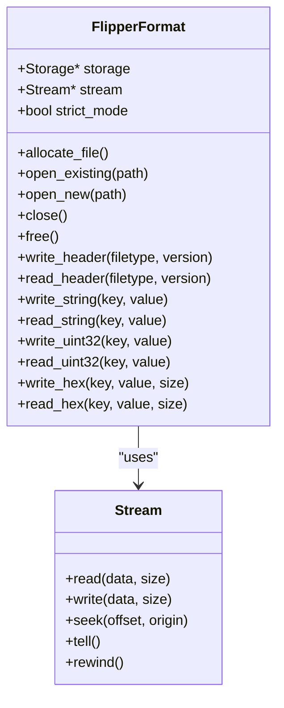
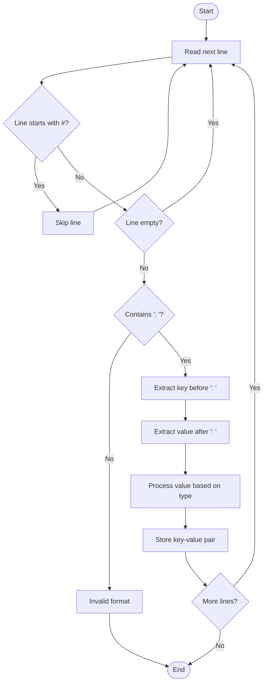
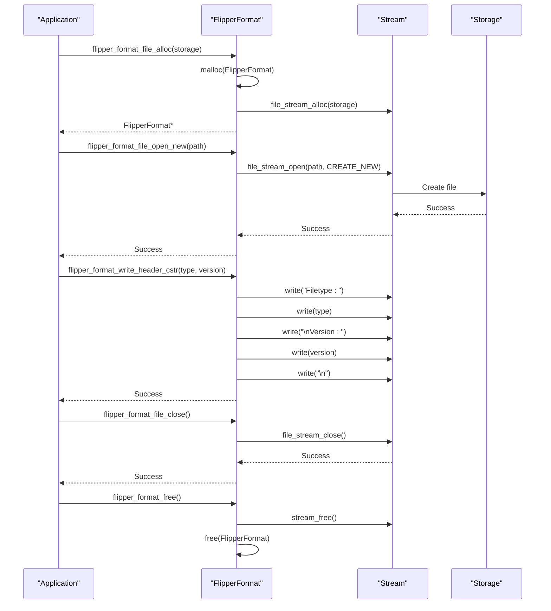

# File Format Specifications

<cite>
**Referenced Files in This Document**   
- [flipper_format.h](file://lib/flipper_format/flipper_format.h)
- [flipper_format.c](file://lib/flipper_format/flipper_format.c)
- [flipper_format_stream.h](file://lib/flipper_format/flipper_format_stream.h)
- [flipper_format_stream.c](file://lib/flipper_format/flipper_format_stream.c)
</cite>

## Table of Contents
1. [Introduction](#introduction)
2. [Flipper Format Container Specification](#flipper-format-container-specification)
3. [Supported Data Types](#supported-data-types)
4. [File Structure and Syntax](#file-structure-and-syntax)
5. [Serialization and Encoding Rules](#serialization-and-encoding-rules)
6. [Programmatic Parsing and Generation](#programmatic-parsing-and-generation)
7. [Version Compatibility and Extension Mechanisms](#version-compatibility-and-extension-mechanisms)
8. [Conclusion](#conclusion)

## Introduction
This document provides comprehensive specifications for the file formats used by the Flipper Zero firmware. The Flipper Zero platform utilizes a standardized container format known as the Flipper Format to store data across various applications including NFC, LF RFID, Sub-GHz, Infrared, iButton, and BadUSB scripts. This specification details the binary structure, metadata fields, data layout, serialization format, and encoding rules for these files. The Flipper Format is designed to be human-readable while maintaining efficient parsing capabilities, enabling interoperability between different components of the firmware ecosystem.

**Section sources**
- [flipper_format.h](file://lib/flipper_format/flipper_format.h#L1-L50)

## Flipper Format Container Specification

The Flipper Format is a text-based container format designed for storing structured data in a simple and portable manner. It serves as the foundation for all file types used in the Flipper Zero firmware, providing a consistent interface for reading, writing, and manipulating data across different application domains.

### Header Structure
Every Flipper Format file begins with a mandatory header that identifies the file type and version. The header consists of two required fields:

- **Filetype**: A string value that specifies the purpose or category of the file
- **Version**: An unsigned 32-bit integer indicating the format version

These fields must appear at the beginning of the file and are used by the system to validate compatibility and determine appropriate processing logic.

### Key-Value Pair System
The format organizes data as a sequence of key-value pairs separated by ": ". Each key is a case-sensitive string that uniquely identifies a data field within the file. Keys may only appear once per file unless explicitly allowed by the specific application format.

### Data Sections
Following the header, additional data sections contain application-specific information organized as key-value pairs. These sections can include multiple types of data such as strings, integers, hexadecimal values, and floating-point numbers.



**Diagram sources**
- [flipper_format.h](file://lib/flipper_format/flipper_format.h#L50-L100)
- [flipper_format.c](file://lib/flipper_format/flipper_format.c#L25-L50)

**Section sources**
- [flipper_format.h](file://lib/flipper_format/flipper_format.h#L1-L199)
- [flipper_format.c](file://lib/flipper_format/flipper_format.c#L1-L50)

## Supported Data Types

The Flipper Format supports several primitive data types, each with specific formatting rules and parsing behavior.

### String Type
Strings are represented as plain text values without quotes. They can contain any printable ASCII characters and are terminated by a newline character.

**Example:**
```
Label: My Device Name
```

### Integer Types
Two integer types are supported:

- **Int32**: Signed 32-bit integers in decimal format
- **Uint32**: Unsigned 32-bit integers in decimal format

Multiple integer values can be stored in a single field by separating them with spaces.

**Example:**
```
Counter: 12345
Values: 1 2 3 4 5
```

### Floating-Point Type
Floating-point numbers use standard decimal notation with a period as the decimal separator.

**Example:**
```
Voltage: 3.7
Precision: 0.001
```

### Hexadecimal Type
Hexadecimal data is represented as a sequence of two-digit hexadecimal values separated by spaces. Each value represents one byte (8 bits) of binary data.

**Example:**
```
Data: A4 B3 C2 D1 12 FF
Key: 00 11 22 33 44 55 66 77
```

### Boolean Type
Boolean values are represented as "true" or "false" strings.

**Example:**
```
Enabled: true
Visible: false
```

### 64-Bit Unsigned Integer
For larger numeric values, the format supports 64-bit unsigned integers in hexadecimal format.

**Example:**
```
SerialNumber: 1A2B3C4D5E6F7890
```

**Section sources**
- [flipper_format_stream.h](file://lib/flipper_format/flipper_format_stream.h#L10-L30)
- [flipper_format.c](file://lib/flipper_format/flipper_format.c#L300-L350)

## File Structure and Syntax

### Overall Structure
A complete Flipper Format file follows this structure:

```
Filetype: <file_type_name>
Version: <version_number>
# Optional comment
Field1: value1
Field2: value2
...
```

### Syntax Rules
- Lines starting with "#" are treated as comments and ignored during parsing
- The key-value separator is exactly ": " (colon followed by space)
- End-of-line is LF (Line Feed, \n) when writing, but CR (Carriage Return) is supported when reading
- Whitespace (spaces and tabs) is allowed around values but is trimmed during parsing
- Empty lines are permitted and ignored

### Example File
```
Filetype: Flipper NFC Device
Version: 1
# Saved NFC card data
Device type: Mifare Classic 1K
UID: 04 12 34 56 78 AB CD
ATQA: 04 00
SAK: 08
```



**Diagram sources**
- [flipper_format_stream.c](file://lib/flipper_format/flipper_format_stream.c#L50-L100)
- [flipper_format.c](file://lib/flipper_format/flipper_format.c#L200-L250)

**Section sources**
- [flipper_format.h](file://lib/flipper_format/flipper_format.h#L1-L199)
- [flipper_format_stream.c](file://lib/flipper_format/flipper_format_stream.c#L1-L200)

## Serialization and Encoding Rules

### Writing Files
When creating Flipper Format files, applications should follow these steps:

1. Allocate a FlipperFormat instance using `flipper_format_file_alloc()`
2. Open a new file with `flipper_format_file_open_new()`
3. Write the header using `flipper_format_write_header_cstr()`
4. Add comments with `flipper_format_write_comment_cstr()` if needed
5. Write data fields using appropriate write functions
6. Close the file with `flipper_format_file_close()`
7. Free the FlipperFormat instance with `flipper_format_free()`

### Reading Files
To parse existing Flipper Format files:

1. Allocate a FlipperFormat instance
2. Open the existing file with `flipper_format_file_open_existing()`
3. Read the header with `flipper_format_read_header()`
4. Retrieve individual fields using corresponding read functions
5. Close and free resources when complete

### Memory Management
The library uses dynamic memory allocation for strings and buffers. All allocated strings (FuriString) must be properly freed using `furi_string_free()` to prevent memory leaks.

### Error Handling
All write and read operations return boolean values indicating success or failure. Applications should use the do-while(0) pattern for error handling, allowing clean exit from nested operations.



**Diagram sources**
- [flipper_format.c](file://lib/flipper_format/flipper_format.c#L100-L200)
- [flipper_format_stream.c](file://lib/flipper_format/flipper_format_stream.c#L200-L300)

**Section sources**
- [flipper_format.h](file://lib/flipper_format/flipper_format.h#L50-L150)
- [flipper_format.c](file://lib/flipper_format/flipper_format.c#L1-L300)

## Programmatic Parsing and Generation

### Creating Files Programmatically
```c
FlipperFormat* format = flipper_format_file_alloc(storage);

do {
    const uint32_t version = 1;
    const char* filetype = "Flipper Test File";
    const char* string_value = "String value";
    const uint32_t uint32_value = 1234;
    const uint16_t array_size = 4;
    const uint8_t array[array_size] = {0x00, 0x01, 0xFF, 0xA3};

    if(!flipper_format_file_open_new(format, "/ext/flipper_format_test")) break;
    if(!flipper_format_write_header_cstr(format, filetype, version)) break;
    if(!flipper_format_write_comment_cstr(format, "Just test file")) break;
    if(!flipper_format_write_string_cstr(format, "String", string_value)) break;
    if(!flipper_format_write_uint32(format, "UINT", &uint32_value, 1)) break;
    if(!flipper_format_write_hex(format, "Hex Array", array, array_size)) break;
} while(0);

flipper_format_free(format);
```

### Reading Files Programmatically
```c
FlipperFormat* file = flipper_format_file_alloc(storage);
FuriString* file_type = furi_string_alloc();
FuriString* string_value = furi_string_alloc();
uint32_t uint32_value = 0;
uint8_t array[4] = {0};
uint16_t array_size = 4;

do {
    uint32_t version = 1;

    if(!flipper_format_file_open_existing(file, "/ext/flipper_format_test")) break;
    if(!flipper_format_read_header(file, file_type, &version)) break;
    if(!flipper_format_read_string(file, "String", string_value)) break;
    if(!flipper_format_read_uint32(file, "UINT", &uint32_value, 1)) break;
    if(!flipper_format_read_hex(file, "Hex Array", array, array_size)) break;
} while(0);

furi_string_free(file_type);
furi_string_free(string_value);
flipper_format_free(file);
```

### Field Existence Checking
Applications can check for the existence of specific fields using:
```c
bool exists = flipper_format_key_exist(format, "FieldName");
```

### Value Count Retrieval
To determine how many values are stored in a multi-value field:
```c
uint32_t count;
bool success = flipper_format_get_value_count(format, "FieldName", &count);
```

**Section sources**
- [flipper_format.h](file://lib/flipper_format/flipper_format.h#L150-L200)
- [flipper_format.c](file://lib/flipper_format/flipper_format.c#L400-L500)

## Version Compatibility and Extension Mechanisms

### Versioning Strategy
The Version field in the header enables backward compatibility. Applications should:
- Read the version number from the header
- Support multiple versions of their format when possible
- Reject files with unsupported versions
- Increment the version number when making breaking changes

### Strict Mode
The format library supports a strict mode that can be enabled with `flipper_format_set_strict_mode()`. In strict mode:
- Field order matters during parsing
- Unknown fields cause parsing to fail
- Type mismatches are strictly enforced

### Extension Guidelines
When extending existing formats:
1. Add new fields rather than modifying existing ones
2. Keep backward compatibility with older versions
3. Document new fields clearly
4. Increment the version number only for breaking changes
5. Use descriptive but concise field names

### Migration Strategy
For format migrations:
- Provide conversion utilities when possible
- Maintain support for older formats during transition periods
- Clearly document deprecation timelines
- Use version numbers to distinguish between format variants

**Section sources**
- [flipper_format.h](file://lib/flipper_format/flipper_format.h#L200-L250)
- [flipper_format.c](file://lib/flipper_format/flipper_format.c#L500-L600)

## Conclusion
The Flipper Format provides a robust, extensible container system for storing structured data in the Flipper Zero firmware. Its simple text-based syntax makes it human-readable while providing efficient parsing capabilities through a well-defined API. By adhering to the specifications outlined in this document, developers can ensure compatibility across different applications and maintain data integrity throughout the device ecosystem. The format's support for multiple data types, clear versioning strategy, and comprehensive error handling make it suitable for storing configuration data, device information, and captured signals across all supported technologies including NFC, LF RFID, Sub-GHz, Infrared, iButton, and BadUSB scripts.