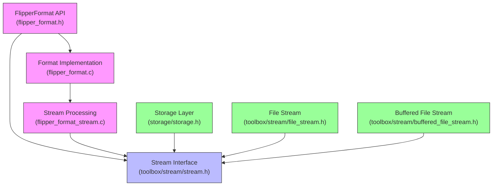
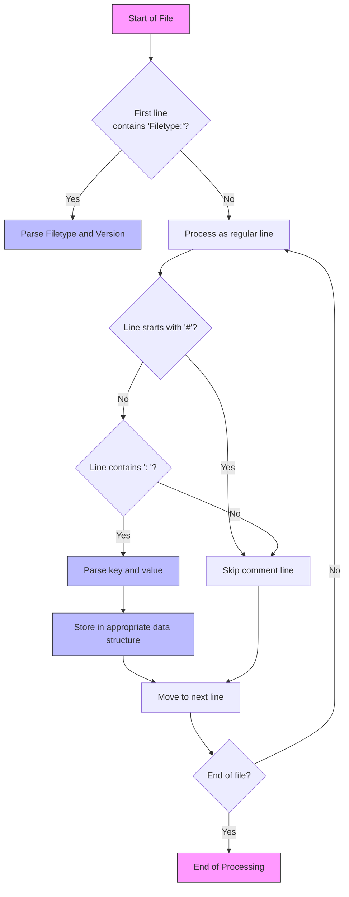
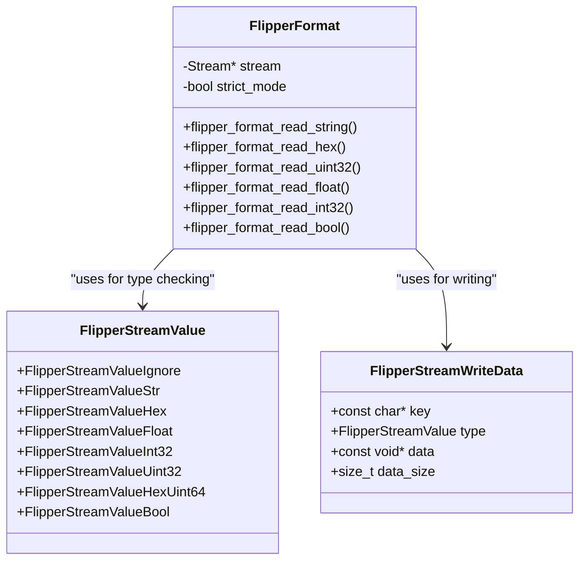
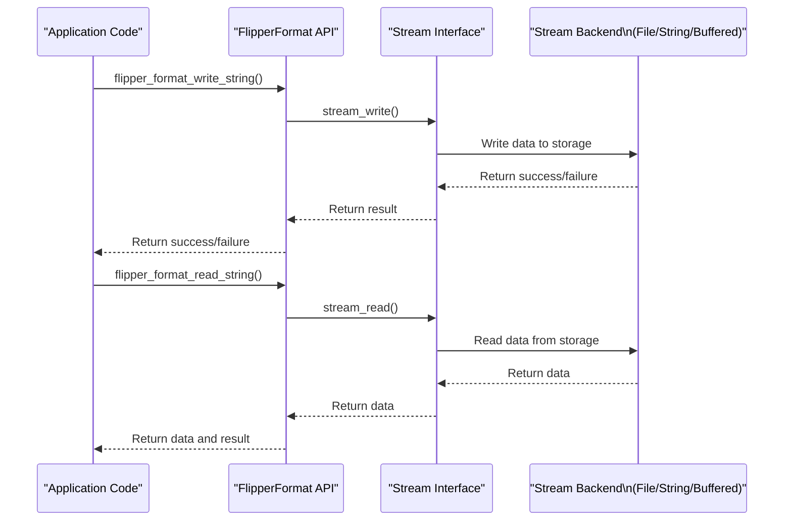

# Flipper Format Specification

<cite>
**Referenced Files in This Document**   
- [flipper_format.h](file://lib/flipper_format/flipper_format.h)
- [flipper_format.c](file://lib/flipper_format/flipper_format.c)
- [flipper_format_stream.h](file://lib/flipper_format/flipper_format_stream.h)
- [flipper_format_stream.c](file://lib/flipper_format/flipper_format_stream.c)
- [flipper_format_i.h](file://lib/flipper_format/flipper_format_i.h)
- [flipper_format_stream_i.h](file://lib/flipper_format/flipper_format_stream_i.h)
</cite>

## Table of Contents
1. [Introduction](#introduction)
2. [Core Architecture](#core-architecture)
3. [File Structure and Syntax](#file-structure-and-syntax)
4. [Data Types and Encoding](#data-types-and-encoding)
5. [Stream Processing Architecture](#stream-processing-architecture)
6. [API Usage and Code Examples](#api-usage-and-code-examples)
7. [Error Handling and Memory Management](#error-handling-and-memory-management)
8. [Version Compatibility and Strict Mode](#version-compatibility-and-strict-mode)
9. [Conclusion](#conclusion)

## Introduction

The Flipper Format is a lightweight, text-based container format used throughout the Flipper Zero firmware to store structured data in files. Designed for simplicity and efficiency, it serves as the standard serialization format for configuration files, protocol data, and application-specific information. The format combines human readability with programmatic accessibility, enabling both users and applications to interact with stored data effectively.

The Flipper Format specification defines a clear structure for key-value pairs, supporting multiple data types while maintaining a simple text-based syntax. Its implementation leverages a stream processing architecture that enables efficient reading and writing of data, even on resource-constrained embedded systems. This documentation provides a comprehensive analysis of the format's binary structure, serialization rules, and API usage patterns, with detailed examples from the actual implementation in the Flipper Zero firmware.

**Section sources**
- [flipper_format.h](file://lib/flipper_format/flipper_format.h#L1-L50)

## Core Architecture

The Flipper Format implementation follows a layered architecture that separates the high-level format specification from the low-level stream processing operations. At its core, the system consists of two main components: the format interface layer and the stream processing layer.



**Diagram sources**
- [flipper_format.h](file://lib/flipper_format/flipper_format.h#L1-L200)
- [flipper_format.c](file://lib/flipper_format/flipper_format.c#L1-L200)
- [flipper_format_stream.h](file://lib/flipper_format/flipper_format_stream.h#L1-L100)

The architecture centers around the `FlipperFormat` structure, which acts as a wrapper around a generic `Stream` interface. This design enables the format to work with different underlying storage mechanisms, including regular files and string buffers. The separation between the format logic and stream operations allows for code reuse and flexibility in handling various data sources.

The core data structure, `FlipperFormat`, contains a pointer to a `Stream` instance and a boolean flag for strict mode operation:

```c
struct FlipperFormat {
    Stream* stream;
    bool strict_mode;
};
```

This simple structure delegates all low-level I/O operations to the stream interface, which can be implemented by different backends such as file streams or string streams. The `strict_mode` flag controls how the parser handles errors and malformed input, providing flexibility for different use cases.

**Section sources**
- [flipper_format.c](file://lib/flipper_format/flipper_format.c#L20-L50)
- [flipper_format.h](file://lib/flipper_format/flipper_format.h#L50-L100)

## File Structure and Syntax

The Flipper Format uses a simple text-based syntax that is both human-readable and easy to parse programmatically. The format consists of key-value pairs separated by a colon and space, with optional comments and a standardized header structure.

### Basic Syntax Rules

The format follows these fundamental syntax rules:
- Lines starting with `#` are treated as comments and ignored during parsing
- Key-value pairs use the format `Key: value`
- The separator between key and value is exactly `: ` (colon followed by space)
- End of line is represented by LF (`\n`), though CR (`\r`) is supported for reading
- Whitespace is significant and follows specific parsing rules



**Diagram sources**
- [flipper_format_stream.c](file://lib/flipper_format/flipper_format_stream.c#L50-L200)
- [flipper_format_stream_i.h](file://lib/flipper_format/flipper_format_stream_i.h#L1-L20)

### Header Structure

The format typically begins with a header that identifies the file type and version:

```
Filetype: Flipper SubGhz Key File
Version: 1
```

The header uses two reserved keys: `Filetype` and `Version`. These are used by the `flipper_format_read_header()` and `flipper_format_write_header()` functions to validate file compatibility. The filetype string identifies the specific application or protocol that created the file, while the version number enables backward compatibility handling.

### Example File

A complete example of a Flipper Format file:

```
Filetype: Flipper Test File
Version: 1
# Just test file
String: String value
UINT: 1234
Hex: 00 01 FF A3
```

This example demonstrates the standard structure with header, comment, and multiple data types.

**Section sources**
- [flipper_format.h](file://lib/flipper_format/flipper_format.h#L50-L150)
- [flipper_format_stream.c](file://lib/flipper_format/flipper_format_stream.c#L50-L300)

## Data Types and Encoding

The Flipper Format supports several data types, each with specific encoding rules and parsing logic. The implementation uses an enumeration to identify different value types during serialization and deserialization.

### Supported Data Types



**Diagram sources**
- [flipper_format_stream.h](file://lib/flipper_format/flipper_format_stream.h#L10-L50)
- [flipper_format.h](file://lib/flipper_format/flipper_format.h#L200-L400)

The `FlipperStreamValue` enumeration defines the supported data types:
- **String**: Text values enclosed in the value field
- **Hex**: Hexadecimal byte values separated by spaces
- **Uint32**: Unsigned 32-bit integers
- **Int32**: Signed 32-bit integers
- **Float**: Floating-point numbers
- **Bool**: Boolean values (true/false)
- **HexUint64**: Hexadecimal representation of 64-bit unsigned integers

### String Type

Strings are encoded as plain text following the key-value separator:

```
String: This is a sample string value
```

The implementation uses `FuriString` objects to store string values, providing dynamic memory management and string operations:

```c
bool flipper_format_read_string(FlipperFormat* flipper_format, const char* key, FuriString* data) {
    furi_check(flipper_format);
    return flipper_format_stream_read_value_line(
        flipper_format->stream, key, FlipperStreamValueStr, data, 1, flipper_format->strict_mode);
}
```

### Hexadecimal Type

Hex values are encoded as space-separated byte values in hexadecimal notation:

```
Hex: A4 B3 C2 D1 12 FF
```

The hex parser reads each pair of characters as a single byte, supporting both uppercase and lowercase hexadecimal digits. The data is stored as raw bytes in a buffer provided by the caller.

### Numeric Types

Integer and floating-point values follow standard numeric notation:

```
Int32: -1234
Uint32: 5678
Float: 1234.5678
```

The implementation uses standard C library functions for numeric conversion, with appropriate error checking to handle malformed input.

### Boolean Type

Boolean values are represented as `true` or `false`:

```
Enabled: true
Debug: false
```

The parser is case-sensitive and only accepts these exact strings as valid boolean values.

**Section sources**
- [flipper_format.h](file://lib/flipper_format/flipper_format.h#L300-L600)
- [flipper_format_stream.h](file://lib/flipper_format/flipper_format_stream.h#L10-L80)
- [flipper_format.c](file://lib/flipper_format/flipper_format.c#L200-L500)

## Stream Processing Architecture

The Flipper Format implementation leverages a stream processing architecture that enables efficient handling of data with minimal memory overhead. This architecture is built on the `Stream` interface from the toolbox library, providing a consistent API for reading and writing data regardless of the underlying storage mechanism.

### Stream Interface Integration

The core of the stream processing architecture is the `Stream` abstraction, which provides a uniform interface for different data sources:



**Diagram sources**
- [flipper_format.c](file://lib/flipper_format/flipper_format.c#L100-L300)
- [flipper_format_stream.c](file://lib/flipper_format/flipper_format_stream.c#L1-L100)

### Key-Value Parsing Algorithm

The key-value parsing algorithm uses a state machine approach to efficiently locate and extract values:

```c
static bool flipper_format_stream_read_valid_key(Stream* stream, FuriString* key) {
    furi_string_reset(key);
    const size_t buffer_size = 32;
    uint8_t buffer[buffer_size];

    bool found = false;
    bool error = false;
    bool accumulate = true;
    bool new_line = true;

    while(true) {
        size_t was_read = stream_read(stream, buffer, buffer_size);
        if(was_read == 0) break;

        for(size_t i = 0; i < was_read; i++) {
            uint8_t data = buffer[i];
            if(data == flipper_format_eoln) {
                furi_string_reset(key);
                accumulate = true;
                new_line = true;
            } else if(data == flipper_format_eolr) {
                // ignore
            } else if(data == flipper_format_comment && new_line) {
                accumulate = false;
                new_line = false;
            } else if(data == flipper_format_delimiter) {
                if(new_line) {
                    furi_string_reset(key);
                    accumulate = false;
                    new_line = false;
                } else {
                    if(accumulate) {
                        if(!stream_seek(stream, i - was_read, StreamOffsetFromCurrent)) {
                            error = true;
                            break;
                        }
                        found = true;
                        break;
                    }
                }
            } else {
                new_line = false;
                if(accumulate) {
                    furi_string_push_back(key, data);
                }
            }
        }
        if(found || error) break;
    }
    return found;
}
```

This algorithm processes data in chunks, minimizing memory usage while maintaining parsing accuracy. It handles comments, key-value separation, and line endings efficiently.

### Memory Management

The stream architecture enables efficient memory management by:
- Processing data in small buffers rather than loading entire files into memory
- Using the `Stream` interface to abstract away storage details
- Providing both buffered and unbuffered file operations
- Minimizing memory allocation during parsing

The implementation uses a 32-byte buffer for reading data, which strikes a balance between performance and memory usage on the resource-constrained Flipper Zero platform.

**Section sources**
- [flipper_format_stream.c](file://lib/flipper_format/flipper_format_stream.c#L50-L250)
- [flipper_format.c](file://lib/flipper_format/flipper_format.c#L50-L100)

## API Usage and Code Examples

The Flipper Format API provides a comprehensive set of functions for creating, reading, and writing format files. The following examples demonstrate proper usage patterns with error handling and resource management.

### Creating and Writing Files

```c
// Example from flipper_format.h documentation
FlipperFormat* format = flipper_format_file_alloc(storage);

do {
    const uint32_t version = 1;
    const char* string_value = "String value";
    const uint32_t uint32_value = 1234;
    const uint16_t array_size = 4;
    const uint8_t array[array_size] = {0x00, 0x01, 0xFF, 0xA3};

    if(!flipper_format_file_open_new(format, EXT_PATH("flipper_format_test"))) break;
    if(!flipper_format_write_header_cstr(format, "Flipper Test File", version)) break;
    if(!flipper_format_write_comment_cstr(format, "Just test file")) break;
    if(!flipper_format_write_string_cstr(format, "String", string_value)) break;
    if(!flipper_format_write_uint32(format, "UINT", &uint32_value, 1)) break;
    if(!flipper_format_write_hex(format, "Hex Array", array, array_size)) break;

    // File written successfully
} while(0);

flipper_format_free(format);
```

This pattern uses a do-while loop to create a single exit point for error handling. Each operation is checked, and if any fail, the loop breaks and resources are cleaned up.

### Reading Files

```c
// Example from flipper_format.h documentation
FlipperFormat* file = flipper_format_file_alloc(storage);

do {
    uint32_t version = 1;
    FuriString* file_type = furi_string_alloc();
    FuriString* string_value = furi_string_alloc();
    uint32_t uint32_value = 0;
    uint16_t array_size = 4;
    uint8_t array[array_size] = {0};

    if(!flipper_format_file_open_existing(file, EXT_PATH("flipper_format_test"))) break;
    if(!flipper_format_read_header(file, file_type, &version)) break;
    if(!flipper_format_read_string(file, "String", string_value)) break;
    if(!flipper_format_read_uint32(file, "UINT", &uint32_value, 1)) break;
    if(!flipper_format_read_hex(file, "Hex Array", array, array_size)) break;

    // File read successfully
} while(0);

// Cleanup
furi_string_free(file_type);
furi_string_free(string_value);
flipper_format_free(file);
```

Note the proper cleanup of allocated `FuriString` objects in addition to the `FlipperFormat` instance.

### Key Existence Checking

```c
bool flipper_format_key_exist(FlipperFormat* flipper_format, const char* key) {
    size_t pos = stream_tell(flipper_format->stream);
    stream_seek(flipper_format->stream, 0, StreamOffsetFromStart);
    bool result = flipper_format_stream_seek_to_key(flipper_format->stream, key, false);
    stream_seek(flipper_format->stream, pos, StreamOffsetFromStart);
    return result;
}
```

This function demonstrates how to check for key existence without modifying the current file position, preserving the stream state.

### Value Count Retrieval

```c
bool flipper_format_get_value_count(
    FlipperFormat* flipper_format,
    const char* key,
    uint32_t* count) {
    furi_check(flipper_format);
    return flipper_format_stream_get_value_count(
        flipper_format->stream, key, count, flipper_format->strict_mode);
}
```

This function retrieves the number of values associated with a key, useful for determining array sizes before allocation.

**Section sources**
- [flipper_format.h](file://lib/flipper_format/flipper_format.h#L150-L250)
- [flipper_format.c](file://lib/flipper_format/flipper_format.c#L300-L400)

## Error Handling and Memory Management

The Flipper Format implementation includes comprehensive error handling and memory management practices to ensure reliability and prevent resource leaks.

### Error Handling Patterns

The API uses a consistent error handling pattern where functions return boolean values indicating success or failure:

```c
bool flipper_format_file_open_existing(FlipperFormat* flipper_format, const char* path) {
    furi_check(flipper_format);
    return file_stream_open(flipper_format->stream, path, FSAM_READ_WRITE, FSOM_OPEN_EXISTING);
}
```

The `furi_check()` macro validates input parameters, ensuring that null pointers are not dereferenced. This defensive programming approach helps catch programming errors early.

### Memory Management

The implementation follows strict memory management rules:
- All allocated resources must be freed
- The `flipper_format_free()` function handles cleanup of the `FlipperFormat` structure
- Callers are responsible for freeing `FuriString` objects
- Stream resources are managed by the `Stream` interface

```c
void flipper_format_free(FlipperFormat* flipper_format) {
    furi_check(flipper_format);
    stream_free(flipper_format->stream);
    free(flipper_format);
}
```

This function ensures that both the stream and the `FlipperFormat` structure are properly deallocated.

### Resource Cleanup

Proper resource cleanup is critical in embedded systems with limited memory. The recommended pattern uses a do-while loop with a single exit point:

```c
do {
    // Allocate resources
    FuriString* str = furi_string_alloc();
    if(!str) break;
    
    // Perform operations
    if(!some_operation(str)) break;
    
    // Success - resources will be cleaned up at the end
} while(0);

// Cleanup
if(str) furi_string_free(str);
```

This pattern ensures that all allocated resources are freed, even when errors occur.

**Section sources**
- [flipper_format.c](file://lib/flipper_format/flipper_format.c#L400-L500)
- [flipper_format.h](file://lib/flipper_format/flipper_format.h#L250-L300)

## Version Compatibility and Strict Mode

The Flipper Format includes features to handle version compatibility and parsing strictness, ensuring robust operation across different file versions and data quality.

### Version Management

The header structure with `Filetype` and `Version` keys enables version compatibility checking:

```c
bool flipper_format_read_header(
    FlipperFormat* flipper_format,
    FuriString* filetype,
    uint32_t* version) {
    furi_check(flipper_format);
    return flipper_format_read_string(flipper_format, flipper_format_filetype_key, filetype) &&
           flipper_format_read_uint32(flipper_format, flipper_format_version_key, version, 1);
}
```

Applications can use the version number to handle backward compatibility, supporting older file formats while introducing new features.

### Strict Mode

The `strict_mode` flag controls how the parser handles errors and malformed input:

```c
void flipper_format_set_strict_mode(FlipperFormat* flipper_format, bool strict_mode) {
    flipper_format->strict_mode = strict_mode;
}
```

When strict mode is enabled, the parser is more rigorous in its error checking, which can help identify corrupted files. When disabled, the parser is more forgiving, allowing for recovery from minor formatting issues.

### File Type Identification

The `Filetype` field enables applications to verify they are processing the correct file type:

```c
const char* const flipper_format_filetype_key = "Filetype";
```

This prevents applications from attempting to parse files created by other applications, reducing the risk of data corruption or security issues.

**Section sources**
- [flipper_format.c](file://lib/flipper_format/flipper_format.c#L250-L300)
- [flipper_format.h](file://lib/flipper_format/flipper_format.h#L300-L350)

## Conclusion

The Flipper Format specification provides a robust, efficient, and flexible container format for the Flipper Zero platform. Its simple text-based syntax makes it accessible to both humans and machines, while its stream-based architecture ensures efficient memory usage and performance on resource-constrained hardware.

Key strengths of the implementation include:
- **Simplicity**: Easy to understand and use, with a minimal syntax
- **Efficiency**: Stream-based processing minimizes memory usage
- **Flexibility**: Supports multiple data types and storage backends
- **Reliability**: Comprehensive error handling and memory management
- **Extensibility**: Header structure supports versioning and file type identification

The format serves as a foundational component of the Flipper Zero ecosystem, enabling consistent data storage across applications and protocols. Its design reflects the constraints and requirements of embedded systems, balancing functionality with resource efficiency.

Developers working with the Flipper Format should follow the established patterns for error handling and resource management, ensuring robust and reliable operation. The comprehensive API documentation and examples provide a solid foundation for implementing new features and applications that leverage this versatile format.