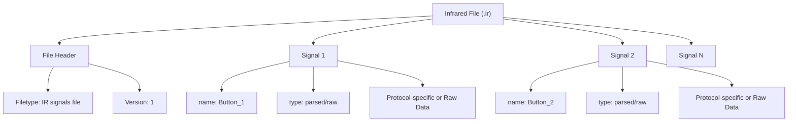
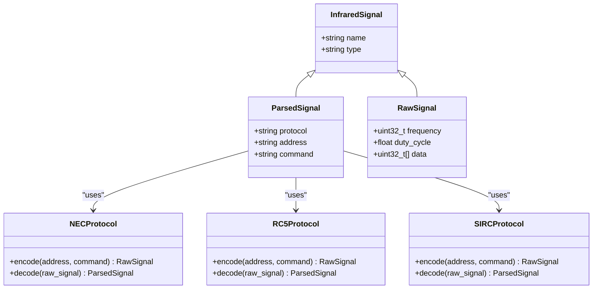
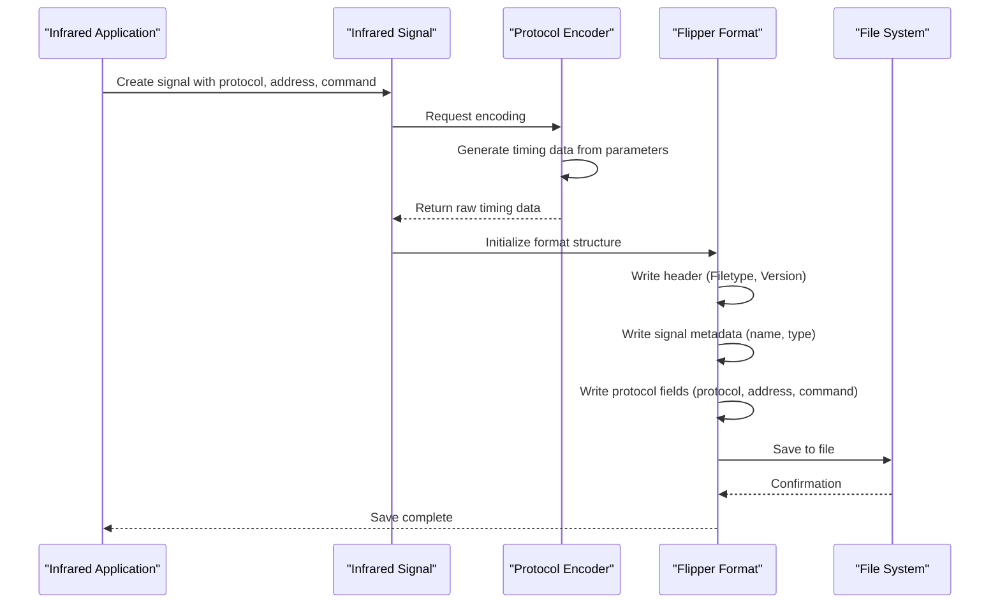

# Infrared File Formats

<cite>
**Referenced Files in This Document**   
- [InfraredFileFormats.md](file://documentation/file_formats/InfraredFileFormats.md)
- [infrared.c](file://lib/infrared/encoder_decoder/infrared.c)
- [infrared.h](file://lib/infrared/encoder_decoder/infrared.h)
- [infrared_common_encoder.c](file://lib/infrared/encoder_decoder/common/infrared_common_encoder.c)
- [infrared_protocol_nec.c](file://lib/infrared/encoder_decoder/nec/infrared_protocol_nec.c)
- [infrared_protocol_rc5.c](file://lib/infrared/encoder_decoder/rc5/infrared_protocol_rc5.c)
- [infrared_protocol_sirc.c](file://lib/infrared/encoder_decoder/sirc/infrared_protocol_sirc.c)
- [infrared_protocol_kaseikyo.c](file://lib/infrared/encoder_decoder/kaseikyo/infrared_protocol_kaseikyo.c)
</cite>

## Table of Contents
1. [Introduction](#introduction)
2. [Flipper Infrared File Format Overview](#flipper-infrared-file-format-overview)
3. [File Structure and Header Fields](#file-structure-and-header-fields)
4. [Protocol-Specific Sections](#protocol-specific-sections)
5. [Timing Data and Signal Encoding](#timing-data-and-signal-encoding)
6. [Metadata Fields](#metadata-fields)
7. [Binary Structure of Timing Data](#binary-structure-of-timing-data)
8. [Example Infrared File Contents](#example-infrared-file-contents)
9. [Parsing and Generating Infrared Files](#parsing-and-generating-infrared-files)
10. [Format Versioning and Compatibility](#format-versioning-and-compatibility)
11. [Code Implementation Analysis](#code-implementation-analysis)
12. [Conclusion](#conclusion)

## Introduction

The Flipper Zero infrared file format is designed to store infrared remote control signals in a standardized, human-readable text format. This documentation provides a comprehensive analysis of the infrared file format used by the Flipper Zero device, detailing the structure, metadata, and encoding mechanisms for infrared signals. The format supports both parsed representations of known protocols and raw timing data for unrecognized signals, enabling users to capture, store, and replay infrared commands from various remote controls.

The infrared file format serves multiple purposes within the Flipper Zero ecosystem, including storing user-captured remote control signals, maintaining universal remote libraries, and supporting unit testing of infrared protocol implementations. This document examines the technical specifications of the format, analyzes the underlying code implementation, and provides guidance for programmatically working with infrared files.

**Section sources**
- [InfraredFileFormats.md](file://documentation/file_formats/InfraredFileFormats.md)

## Flipper Infrared File Format Overview

The Flipper Infrared file format is a text-based container format used to store infrared remote control signals. Files use the `.ir` extension and follow a simple structure with key-value pairs separated by colons. Each file can contain multiple infrared signals, representing different buttons on a remote control, with each signal separated by comment markers (`#`).

The format supports three primary use cases:
- **Infrared Remote Files**: Store captured signals from specific remote controls
- **Infrared Library Files**: Store universal remote libraries with predefined button names
- **Infrared Test Files**: Store technical test data in `.irtest` files for unit testing

The format is designed to be both human-readable and machine-parsable, allowing users to inspect and modify infrared signal data directly. The structure is based on the Flipper Format container system, which provides a consistent approach to data storage across different Flipper Zero applications.



**Diagram sources**
- [InfraredFileFormats.md](file://documentation/file_formats/InfraredFileFormats.md)

**Section sources**
- [InfraredFileFormats.md](file://documentation/file_formats/InfraredFileFormats.md)

## File Structure and Header Fields

The infrared file format begins with mandatory header fields that identify the file type and version. These header fields appear at the beginning of each file and provide essential metadata for parsing the content.

The required header fields are:
- **Filetype**: Must be "IR signals file" to identify the file as containing infrared signals
- **Version**: Indicates the format version, currently "1" for the initial version

Following the header, the file contains one or more signal entries, each representing a button on a remote control. Signal entries are separated by comment characters (`#`) for readability. Each signal entry contains a set of key-value pairs that define the signal properties.

The file structure follows a hierarchical organization:
1. Global header with filetype and version
2. Multiple signal entries separated by comment markers
3. Each signal entry contains metadata and signal data

This structure allows for extensibility, as new fields can be added to signal entries without breaking compatibility with existing parsers. The use of comments as separators makes the format more user-friendly, allowing manual editing and organization of signal entries.

**Section sources**
- [InfraredFileFormats.md](file://documentation/file_formats/InfraredFileFormats.md)

## Protocol-Specific Sections

The infrared file format supports two main types of signal representations: parsed and raw. Parsed signals are used for known infrared protocols and contain protocol-specific fields, while raw signals store timing data directly.

For parsed signals, the format includes protocol-specific sections that vary depending on the infrared protocol being used. The supported protocols include:
- NEC and NEC variants (NECext, NEC42, NEC42ext)
- Samsung32
- RC6, RC5, RC5X
- SIRC and variants (SIRC15, SIRC20)
- Kaseikyo
- RCA

Each protocol has specific encoding rules and timing parameters that are abstracted in the parsed representation. Instead of storing raw timing data, parsed signals store logical protocol fields such as address and command values. This abstraction allows for easier modification of signal parameters and more efficient storage.

The protocol-specific sections share common fields:
- **protocol**: Specifies the infrared protocol name
- **address**: Contains the device address in hexadecimal format
- **command**: Contains the command code in hexadecimal format

These fields are protocol-agnostic in their naming but contain data formatted according to the specific protocol's requirements. For example, the NEC protocol uses 32-bit address and command fields, while the SIRC protocol uses different bit lengths for these values.



**Diagram sources**
- [infrared.h](file://lib/infrared/encoder_decoder/infrared.h)
- [infrared.c](file://lib/infrared/encoder_decoder/infrared.c)

**Section sources**
- [InfraredFileFormats.md](file://documentation/file_formats/InfraredFileFormats.md)
- [infrared.h](file://lib/infrared/encoder_decoder/infrared.h)

## Timing Data and Signal Encoding

For raw signals, the infrared file format stores timing data that represents the sequence of pulses and spaces in the infrared signal. This timing data captures the exact timing between logic level changes in the signal, preserving the complete waveform information.

The timing data section includes:
- **frequency**: Carrier frequency in Hertz (typically 38000 Hz)
- **duty_cycle**: Carrier duty cycle (typically 0.33)
- **data**: Array of timing values in microseconds between logic level changes

The data array contains alternating pulse and space durations, representing the complete timing sequence of the infrared signal. Each value in the array specifies the duration of the current signal level before transitioning to the opposite level. The maximum number of timing values is limited to 1024 to prevent excessive memory usage.

The encoding scheme uses pulse-distance modulation, where logical 0 and 1 values are represented by different pulse-space time combinations. For example, in the NEC protocol, a logical 0 is represented by a 562µs pulse followed by a 562µs space, while a logical 1 is represented by a 562µs pulse followed by a 1686µs space.

The carrier frequency and duty cycle parameters define the modulation characteristics. The duty cycle of 0.33 means that the carrier signal is active for one-third of each cycle, which is a common setting for infrared remotes to balance power consumption and signal reliability.

**Section sources**
- [InfraredFileFormats.md](file://documentation/file_formats/InfraredFileFormats.md)

## Metadata Fields

The infrared file format includes several metadata fields that provide context and identification for each signal. These fields are present in both parsed and raw signal types, ensuring consistent metadata handling across different signal representations.

The core metadata fields are:
- **name**: A string identifier for the button or signal, limited to printable ASCII characters
- **type**: Specifies whether the signal is "parsed" or "raw"

For parsed signals, additional metadata fields include:
- **protocol**: The name of the infrared protocol (e.g., "NECext", "SIRC")
- **address**: The device address as a 4-byte hexadecimal value
- **command**: The command code as a 4-byte hexadecimal value

For raw signals, the metadata fields are:
- **frequency**: The carrier frequency in Hertz
- **duty_cycle**: The carrier duty cycle as a floating-point value
- **data**: The raw timing data as a space-separated list of integers

The name field serves as a human-readable identifier for the signal, allowing users to recognize the function of each button (e.g., "Power", "Volume Up"). The type field determines which additional fields are present and how the signal should be processed.

The address and command fields in parsed signals are always 4 bytes long, represented as eight hexadecimal digits with spaces between each byte. This consistent format simplifies parsing and ensures compatibility across different protocols, even though some protocols may use fewer bits for address and command values.

**Section sources**
- [InfraredFileFormats.md](file://documentation/file_formats/InfraredFileFormats.md)

## Binary Structure of Timing Data

Although the infrared file format is text-based, the underlying data structure follows a binary format when processed by the Flipper Zero firmware. The timing data section, in particular, has a well-defined binary structure that optimizes storage and transmission efficiency.

When a raw signal is processed, the text-based timing data is converted to a binary array of 32-bit unsigned integers. Each integer represents the duration in microseconds between consecutive signal level changes. The array is stored in little-endian byte order, consistent with the ARM architecture used in the Flipper Zero.

The binary structure of a raw signal includes:
- 32-bit field for frequency
- 32-bit floating-point value for duty cycle
- 16-bit field for the count of timing values
- Array of 32-bit integers for timing data

For parsed signals, the binary structure varies by protocol but generally includes:
- Protocol identifier (enum value)
- 32-bit address field
- 32-bit command field
- Boolean flag for repeat signals

The Flipper Format container system handles the serialization and deserialization of these binary structures, converting between the text representation in files and the binary representation in memory. This abstraction allows the same underlying data structures to be used for file storage, in-memory processing, and transmission between components.

The binary structure is optimized for efficient processing by the infrared transmitter hardware, minimizing the computational overhead required to generate the actual infrared signal from the stored data.

**Section sources**
- [infrared.h](file://lib/infrared/encoder_decoder/infrared.h)
- [infrared.c](file://lib/infrared/encoder_decoder/infrared.c)

## Example Infrared File Contents

The following examples illustrate valid infrared file contents for different remote types, demonstrating both parsed and raw signal representations.

### Example 1: NEC Protocol Remote
```
Filetype: IR signals file
Version: 1
#
name: Power
type: parsed
protocol: NECext
address: EE 87 00 00
command: 5D A0 00 00
#
name: Volume Up
type: parsed
protocol: NECext
address: EE 87 00 00
command: 5E A0 00 00
```

### Example 2: SIRC Protocol Remote
```
Filetype: IR signals file
Version: 1
#
name: Channel 1
type: parsed
protocol: SIRC
address: 01 00 00 00
command: 15 00 00 00
#
name: Channel 2
type: parsed
protocol: SIRC
address: 01 00 00 00
command: 16 00 00 00
```

### Example 3: Raw Signal Capture
```
Filetype: IR signals file
Version: 1
#
name: Unknown Device
type: raw
frequency: 38000
duty_cycle: 0.330000
data: 504 3432 502 483 500 484 510 502 502 482 501 485 509 1452 504 1458 509 1452 504 481 501 474 509 3420 503
```

### Example 4: Universal Remote Library
```
Filetype: IR signals file
Version: 1
#
name: Power
type: parsed
protocol: NECext
address: EE 87 00 00
command: 5D A0 00 00
#
name: Input
type: parsed
protocol: NECext
address: EE 87 00 00
command: 5F A0 00 00
#
name: Volume+
type: parsed
protocol: NECext
address: EE 87 00 00
command: 60 A0 00 00
```

These examples demonstrate the flexibility of the format in handling different infrared protocols and signal types. The parsed format allows for easy modification of signal parameters, while the raw format preserves the exact timing characteristics of captured signals.

**Section sources**
- [InfraredFileFormats.md](file://documentation/file_formats/InfraredFileFormats.md)

## Parsing and Generating Infrared Files

The process of parsing and generating infrared files involves converting between the text-based file format and the internal data structures used by the Flipper Zero firmware. This conversion is handled by the Flipper Format system, which provides functions for reading and writing structured data.

To parse an infrared file:
1. Open the file and read the header to verify the filetype and version
2. For each signal entry, create a new infrared signal structure
3. Parse the metadata fields (name, type)
4. Based on the type field, parse either the protocol-specific fields or raw signal fields
5. Convert hexadecimal strings to binary values for address and command fields
6. Convert timing data strings to arrays of integers
7. Validate the parsed data against protocol specifications

To generate an infrared file:
1. Create the header with filetype and version
2. For each signal, write the metadata fields
3. Based on the signal type, write either protocol-specific fields or raw signal fields
4. Format address and command values as hexadecimal strings with proper spacing
5. Convert timing data arrays to space-separated strings
6. Separate signal entries with comment markers

The lib/infrared/encoder_decoder module provides functions for encoding and decoding infrared signals. For example, the `infrared_signal_encode()` function converts a parsed signal to raw timing data, while `infrared_signal_decode()` performs the reverse operation.

Programmatic access to infrared files can be achieved using the Flipper Format API functions such as `flipper_format_write_string()`, `flipper_format_write_uint32()`, and `flipper_format_read_string()`. These functions handle the low-level details of text formatting and parsing, allowing developers to focus on the infrared signal logic.

**Section sources**
- [infrared.h](file://lib/infrared/encoder_decoder/infrared.h)
- [infrared.c](file://lib/infrared/encoder_decoder/infrared.c)
- [infrared_common_encoder.c](file://lib/infrared/encoder_decoder/common/infrared_common_encoder.c)

## Format Versioning and Compatibility

The infrared file format includes versioning support to ensure backward compatibility as the format evolves. The current version is 1, which represents the initial stable release of the format.

The version field in the file header allows the parsing system to handle different format versions appropriately. When a file is read, the version number is checked to determine which parsing rules to apply. This enables future extensions to the format without breaking compatibility with existing files.

Backward compatibility is maintained by ensuring that:
- New fields are optional and can be ignored by older parsers
- Existing fields retain their meaning and format
- Signal data remains interpretable by older firmware versions

Extension mechanisms include:
- Adding new protocol types to the supported list
- Introducing new metadata fields for specific use cases
- Enhancing the raw signal format with additional parameters

The format design follows a principle of graceful degradation, where newer files can be partially understood by older software, even if some features are not supported. For example, a future version might add a "repeat_delay" field for parsed signals, which older software would simply ignore while still being able to transmit the basic signal.

Version checking is implemented in the infrared file parsing functions, which verify the version number before processing the file content. If an unsupported version is encountered, the system can either reject the file or attempt to parse it using the closest supported version rules.

**Section sources**
- [InfraredFileFormats.md](file://documentation/file_formats/InfraredFileFormats.md)

## Code Implementation Analysis

The implementation of infrared file handling is distributed across several components in the Flipper Zero firmware. The core functionality is located in the lib/infrared/encoder_decoder module, which provides protocol-agnostic interfaces for encoding and decoding infrared signals.

The infrared.c file contains the main interface functions that abstract the differences between various infrared protocols. It provides functions like `infrared_signal_alloc()`, `infrared_signal_free()`, and `infrared_signal_write_to_file()` that handle the creation, destruction, and file operations for infrared signals.

Protocol-specific implementations are organized in separate directories under lib/infrared/encoder_decoder, with each protocol having its own encoder, decoder, and protocol definition files. For example:
- NEC protocol: nec/infrared_encoder_nec.c, nec/infrared_decoder_nec.c
- RC5 protocol: rc5/infrared_encoder_rc5.c, rc5/infrared_decoder_rc5.c
- SIRC protocol: sirc/infrared_encoder_sirc.c, sirc/infrared_decoder_sirc.c

The common encoding functionality is implemented in infrared_common_encoder.c, which provides shared routines for generating timing data from protocol parameters. This includes functions for creating leader pulses, data bits, and stop pulses according to each protocol's specifications.

When saving infrared data to a file, the system uses the Flipper Format API to write the structured data. The process involves:
1. Creating a FlipperFormat structure using flipper_format_file_alloc()
2. Writing the header fields (Filetype, Version)
3. For each signal, writing the metadata and signal-specific fields
4. Using appropriate write functions based on data types (string, uint32, float)
5. Properly closing and deallocating the format structure

The relationship between protocol parameters and raw timing data is managed through the encoding functions. For example, in the NEC protocol, the address and command values are converted to a sequence of pulse and space durations according to the NEC timing specifications. The carrier frequency and duty cycle are applied to modulate the signal for transmission.



**Diagram sources**
- [infrared.c](file://lib/infrared/encoder_decoder/infrared.c)
- [infrared_common_encoder.c](file://lib/infrared/encoder_decoder/common/infrared_common_encoder.c)
- [infrared_protocol_nec.c](file://lib/infrared/encoder_decoder/nec/infrared_protocol_nec.c)

**Section sources**
- [infrared.c](file://lib/infrared/encoder_decoder/infrared.c)
- [infrared.h](file://lib/infrared/encoder_decoder/infrared.h)
- [infrared_common_encoder.c](file://lib/infrared/encoder_decoder/common/infrared_common_encoder.c)

## Conclusion

The Flipper Zero infrared file format provides a flexible and extensible system for storing infrared remote control signals. By supporting both parsed representations of known protocols and raw timing data for unrecognized signals, the format accommodates a wide range of use cases from simple remote control emulation to advanced signal analysis.

The text-based format ensures human readability while maintaining machine-parsability, making it accessible for both users and developers. The structured approach with clear metadata fields and protocol-specific sections enables reliable signal storage and retrieval. The integration with the Flipper Format container system provides consistency with other Flipper Zero file formats and robust error handling.

The implementation demonstrates a clean separation of concerns, with protocol-specific encoding and decoding logic isolated from the file I/O operations. This modular design allows for easy addition of new infrared protocols without affecting the core file handling functionality.

For developers working with infrared files programmatically, the Flipper Format API provides a straightforward interface for reading and writing structured data. The availability of both high-level parsed representations and low-level raw timing data offers flexibility in signal processing and analysis.

As the Flipper Zero ecosystem continues to evolve, the infrared file format is well-positioned to support new protocols and features while maintaining backward compatibility with existing files and devices.

**Section sources**
- [InfraredFileFormats.md](file://documentation/file_formats/InfraredFileFormats.md)
- [infrared.c](file://lib/infrared/encoder_decoder/infrared.c)
- [infrared.h](file://lib/infrared/encoder_decoder/infrared.h)