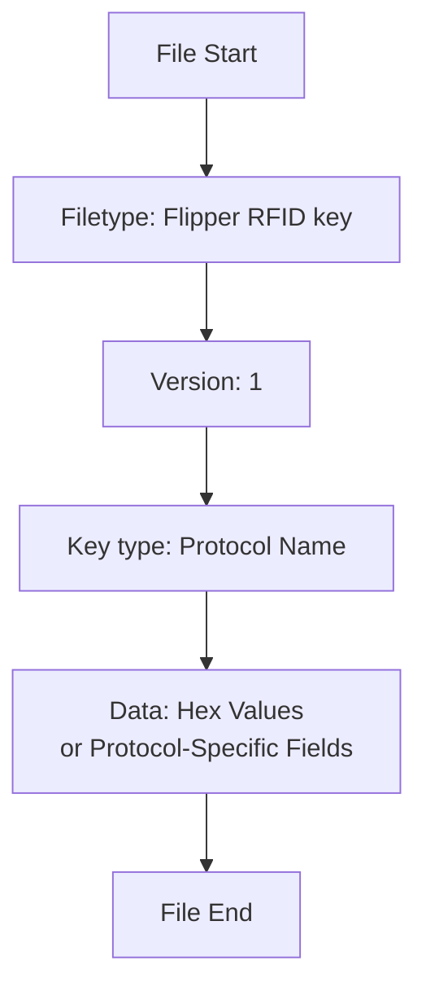
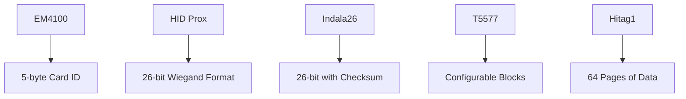
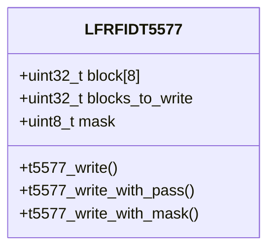

# LF RFID File Formats

<cite>
**Referenced Files in This Document**   
- [LfRfidFileFormat.md](file://documentation/file_formats/LfRfidFileFormat.md)
- [lfrfid_scene_save_data.c](file://applications/main/lfrfid/scenes/lfrfid_scene_save_data.c)
- [lfrfid_dict_file.c](file://lib/lfrfid/lfrfid_dict_file.c)
- [lfrfid_worker.c](file://lib/lfrfid/lfrfid_worker.c)
- [lfrfid_worker_modes.c](file://lib/lfrfid/lfrfid_worker_modes.c)
- [t5577.h](file://lib/lfrfid/tools/t5577.h)
- [t5577.c](file://lib/lfrfid/tools/t5577.c)
</cite>

## Table of Contents
1. [Introduction](#introduction)
2. [Flipper Format Container Structure](#flipper-format-container-structure)
3. [Metadata Fields](#metadata-fields)
4. [Protocol-Specific Data Layouts](#protocol-specific-data-layouts)
5. [T5577 Programmable Tag Format](#t5577-programmable-tag-format)
6. [File Creation and Saving Process](#file-creation-and-saving-process)
7. [Code Example: Saving LF RFID Data](#code-example-saving-lf-rfid-data)
8. [Parsing and Generating Files Programmatically](#parsing-and-generating-files-programmatically)
9. [Format Versioning and Compatibility](#format-versioning-and-compatibility)

## Introduction

The LF RFID file format used by the Flipper Zero is a text-based format designed to store low-frequency RFID key data in a human-readable and machine-parsable way. This format leverages the Flipper Format container system to store metadata and protocol-specific data for various LF RFID protocols including EM4100, HID Prox, Indala, and T5577 tags. The files use the `.rfid` extension and are structured to support both simple fixed-format tags and complex programmable tags. This documentation provides a comprehensive analysis of the file format structure, metadata fields, protocol-specific data layouts, and implementation details based on the Flipper Zero firmware source code.

## Flipper Format Container Structure

The LF RFID file format is built on the Flipper Format container system, which provides a standardized way to store structured data in text files. The container structure consists of a header followed by key-value pairs that define the RFID key properties and data.



**Diagram sources**
- [LfRfidFileFormat.md](file://documentation/file_formats/LfRfidFileFormat.md)

The container begins with a mandatory header that identifies the file type and version. The `Filetype` field always contains "Flipper RFID key" to identify the file format, while the `Version` field indicates the format version (currently 1). Following the header, the `Key type` field specifies the RFID protocol used, which determines how the subsequent data should be interpreted. The actual key data is stored in the `Data` field for most protocols, though some protocols like Hitag1 use additional fields to represent their more complex data structures.

## Metadata Fields

The LF RFID file format includes several metadata fields that provide essential information about the stored RFID key:

**Section sources**
- [LfRfidFileFormat.md](file://documentation/file_formats/LfRfidFileFormat.md#L1-L50)

| Field Name | Description | Example Values |
|------------|-------------|----------------|
| **Filetype** | Identifies the file format | "Flipper RFID key" |
| **Version** | Format version number | 1 |
| **Key type** | RFID protocol type | EM4100, HIDProx, Indala26, T5577 |
| **Data** | Key data in hexadecimal format | 01 23 45 67 89 |

The `Key type` field is particularly important as it determines the interpretation of the data field and the capabilities of the tag. The format supports numerous protocols including EM4100, H10301, Idteck, Indala26, IOProxXSF, AWID, FDX-A, FDX-B, HIDProx, HIDExt, Pyramid, Viking, Jablotron, Paradox, PAC/Stanley, Keri, Gallagher, and GProxII. Each protocol has specific data length and encoding requirements that are enforced when reading and writing these files.

## Protocol-Specific Data Layouts

Different RFID protocols have distinct data layouts and encoding schemes that are reflected in how their data is stored in the LF RFID file format.

**Section sources**
- [lfrfid_dict_file.c](file://lib/lfrfid/lfrfid_dict_file.c#L0-L268)
- [lfrfid_worker_modes.c](file://lib/lfrfid/lfrfid_worker_modes.c#L0-L799)

For standard protocols like EM4100 and HID Prox, the data is stored as a simple hexadecimal string in the `Data` field. The EM4500 protocol, for example, typically stores 5 bytes of data representing the card ID. The Indala26 protocol uses a more complex encoding that includes facility code and card number bits arranged in a specific bit pattern.

The format also supports special handling for protocols with more complex data structures. For instance, the Hitag1 protocol stores not only the tag ID but also individual page data, with each of the 64 pages represented as a separate field in the file. This allows the complete state of programmable tags to be preserved in the file.



**Diagram sources**
- [lfrfid_dict_file.c](file://lib/lfrfid/lfrfid_dict_file.c#L0-L268)

## T5577 Programmable Tag Format

The T5577 protocol represents the most complex case in the LF RFID file format due to its programmable nature. T5577 tags contain configuration registers that determine their behavior, including modulation scheme, data rate, and encoding format.

**Section sources**
- [t5577.h](file://lib/lfrfid/tools/t5577.h#L0-L85)
- [t5577.c](file://lib/lfrfid/tools/t5577.c#L0-L218)

The T5577 data structure is defined by the `LFRFIDT5577` struct which contains:

- **block[8]**: Array of 32-bit values representing the 8 configuration/data blocks
- **blocks_to_write**: Number of blocks to write to the tag
- **mask**: Bitmask indicating which blocks should be written

Block 0 is particularly important as it contains configuration bits that control the tag's operation:

| Configuration Bit | Value | Description |
|-------------------|-------|-------------|
| MODULATION_DIRECT | 0x00000000 | Direct modulation |
| MODULATION_PSK1 | 0x00001000 | PSK1 modulation |
| MODULATION_PSK2 | 0x00002000 | PSK2 modulation |
| MODULATION_PSK3 | 0x00003000 | PSK3 modulation |
| MODULATION_FSK1 | 0x00004000 | FSK1 modulation |
| MODULATION_FSK2 | 0x00005000 | FSK2 modulation |
| MODULATION_MANCHESTER | 0x00008000 | Manchester encoding |
| BITRATE_RF_8 | 0x00000000 | 8 RF/Bit |
| BITRATE_RF_16 | 0x00040000 | 16 RF/Bit |
| BITRATE_RF_32 | 0x00080000 | 32 RF/Bit |

When writing T5577 tags, the firmware uses specific timing parameters:
- Start gap: 30 units (240μs)
- Data 0: 24 units (192μs)
- Data 1: 56 units (448μs)
- Write gap: 18 units (144μs)
- Program pulse: 700 units (5.6ms)



**Diagram sources**
- [t5577.h](file://lib/lfrfid/tools/t5577.h#L0-L85)

## File Creation and Saving Process

The process of creating and saving LF RFID files involves several steps that ensure data integrity and proper formatting. The Flipper Zero firmware follows a consistent pattern for saving RFID data to files.

**Section sources**
- [lfrfid_scene_save_data.c](file://applications/main/lfrfid/scenes/lfrfid_scene_save_data.c#L0-L61)
- [lfrfid_dict_file.c](file://lib/lfrfid/lfrfid_dict_file.c#L0-L268)

When a user initiates the save process, the system first retrieves the current key data from the protocol dictionary. This data is then presented in a byte input view where the user can modify it if desired. Upon confirmation, the modified data is written back to the protocol dictionary and saved to a file using the `lfrfid_dict_file_save` function.

The saving process follows these steps:
1. Open or create the target file
2. Write the Flipper Format header with filetype and version
3. Write the key type (protocol name)
4. Write the key data in hexadecimal format
5. Handle special cases for protocols with complex data structures

For protocols like Hitag1, additional page data is written as separate fields in the file, allowing the complete tag state to be preserved.

## Code Example: Saving LF RFID Data

The following code example demonstrates how LF RFID files are created and saved in the Flipper Zero firmware, specifically showing the scene management approach used in the `lfrfid_scene_save_data.c` file:

```c
void lfrfid_scene_save_data_on_enter(void* context) {
    LfRfid* app = context;
    ByteInput* byte_input = app->byte_input;

    size_t size = protocol_dict_get_data_size(app->dict, app->protocol_id);

    bool need_restore = scene_manager_get_scene_state(app->scene_manager, LfRfidSceneSaveData);

    if(!need_restore) {
        protocol_dict_get_data(app->dict, app->protocol_id, app->old_key_data, size);
        protocol_dict_get_data(app->dict, app->protocol_id, app->new_key_data, size);
    }

    byte_input_set_header_text(byte_input, "Enter the data in hex");

    byte_input_set_result_callback(
        byte_input, lfrfid_text_input_callback, NULL, app, app->new_key_data, size);

    view_dispatcher_switch_to_view(app->view_dispatcher, LfRfidViewByteInput);
}

bool lfrfid_scene_save_data_on_event(void* context, SceneManagerEvent event) {
    LfRfid* app = context;
    SceneManager* scene_manager = app->scene_manager;
    bool consumed = false;

    if(event.type == SceneManagerEventTypeCustom) {
        if(event.event == LfRfidEventNext) {
            consumed = true;
            size_t size = protocol_dict_get_data_size(app->dict, app->protocol_id);
            protocol_dict_set_data(app->dict, app->protocol_id, app->new_key_data, size);

            if(scene_manager_has_previous_scene(scene_manager, LfRfidSceneSaveType)) {
                scene_manager_next_scene(scene_manager, LfRfidSceneSaveName);
            } else {
                if(!furi_string_empty(app->file_name)) {
                    lfrfid_delete_key(app);
                }

                if(lfrfid_save_key(app)) {
                    scene_manager_next_scene(scene_manager, LfRfidSceneSaveSuccess);
                } else {
                    scene_manager_search_and_switch_to_previous_scene(
                        scene_manager, LfRfidSceneSavedKeyMenu);
                }
            }
        }
    } else if(event.type == SceneManagerEventTypeBack) {
        scene_manager_set_scene_state(scene_manager, LfRfidSceneSaveData, 0);
        size_t size = protocol_dict_get_data_size(app->dict, app->protocol_id);
        protocol_dict_set_data(app->dict, app->protocol_id, app->old_key_data, size);
    }

    return consumed;
}
```

**Section sources**
- [lfrfid_scene_save_data.c](file://applications/main/lfrfid/scenes/lfrfid_scene_save_data.c#L0-L61)

This code demonstrates the scene-based architecture of the Flipper Zero application, where user interactions are managed through a state machine. When the user enters the save data scene, the current key data is loaded into a byte input field. When the user confirms the data (via `LfRfidEventNext`), the data is written back to the protocol dictionary and saved to a file. If the user navigates back, the original data is restored.

## Parsing and Generating Files Programmatically

Programmatic parsing and generation of LF RFID files can be accomplished by following the Flipper Format specification and protocol-specific rules.

**Section sources**
- [lfrfid_dict_file.c](file://lib/lfrfid/lfrfid_dict_file.c#L0-L268)

To parse an LF RFID file:
1. Open the file and verify the header matches "Flipper RFID key" with version 1
2. Read the "Key type" field to determine the protocol
3. Look up the protocol in the protocol dictionary
4. Read the "Data" field as hexadecimal values
5. For special protocols like Hitag1, read additional page data fields
6. Store the data in the appropriate format for the protocol

To generate an LF RFID file:
1. Create a new file or open an existing one
2. Write the header with "Filetype: Flipper RFID key" and "Version: 1"
3. Write the "Key type" field with the appropriate protocol name
4. Convert the key data to hexadecimal string format
5. Write the "Data" field with the hexadecimal data
6. For special protocols, write additional fields as needed
7. Close the file

The `lfrfid_dict_file_load` and `lfrfid_dict_file_save` functions provide the reference implementation for these operations, handling all the low-level details of file I/O and data conversion.

## Format Versioning and Compatibility

The LF RFID file format currently uses version 1, which has been stable across Flipper Zero firmware releases. The versioning system allows for future extensions while maintaining backward compatibility.

**Section sources**
- [LfRfidFileFormat.md](file://documentation/file_formats/LfRfidFileFormat.md#L1-L50)
- [lfrfid_dict_file.c](file://lib/lfrfid/lfrfid_dict_file.c#L0-L268)

The format is designed to be forward-compatible, meaning that newer versions of the firmware can read files created by older versions. However, older firmware versions may not be able to read files created by newer versions if new fields or protocols are introduced.

The current implementation includes safeguards to ensure compatibility:
- Strict validation of the file header and version
- Fallback mechanisms for unknown protocol names
- Error handling for malformed data
- Preservation of unknown fields when rewriting files

This approach ensures that users can reliably exchange LF RFID files between different Flipper Zero devices and firmware versions, maintaining the interoperability that is essential for a tool focused on RFID analysis and emulation.