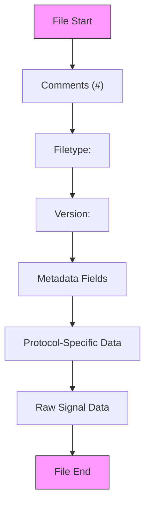
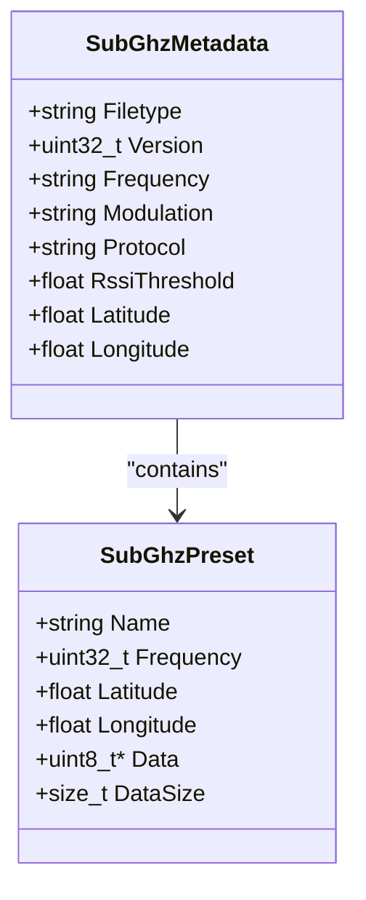
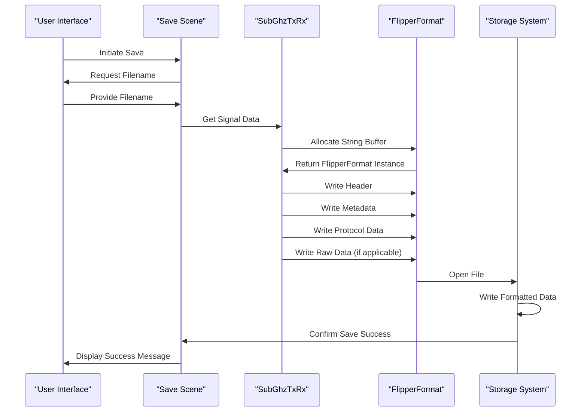

# Sub-GHz File Formats

<cite>
**Referenced Files in This Document**   
- [flipper_format.h](file://lib/flipper_format/flipper_format.h)
- [flipper_format.c](file://lib/flipper_format/flipper_format.c)
- [subghz_txrx.c](file://applications/main/subghz/helpers/subghz_txrx.c)
- [subghz_txrx.h](file://applications/main/subghz/helpers/subghz_txrx.h)
- [subghz_scene_save_name.c](file://applications/main/subghz/scenes/subghz_scene_save_name.c)
- [subghz_scene_save_success.c](file://applications/main/subghz/scenes/subghz_scene_save_success.c)
- [subghz_types.h](file://applications/main/subghz/helpers/subghz_types.h)
</cite>

## Table of Contents
1. [Introduction](#introduction)
2. [Flipper Format Container Structure](#flipper-format-container-structure)
3. [Sub-GHz File Header and Metadata](#subghz-file-header-and-metadata)
4. [Protocol-Specific Data Sections](#protocol-specific-data-sections)
5. [Raw Signal Data Encoding](#raw-signal-data-encoding)
6. [File Creation and Saving Process](#file-creation-and-saving-process)
7. [Example Sub-GHz File Contents](#example-subghz-file-contents)
8. [Format Versioning and Compatibility](#format-versioning-and-compatibility)
9. [Conclusion](#conclusion)

## Introduction
The Sub-GHz file format used by the Flipper Zero is a specialized implementation of the Flipper Format container system designed for storing wireless signal data. This format enables the device to save, load, and replay Sub-GHz radio frequency signals from various remote control devices such as garage doors, gates, lighting systems, and other RF-based equipment. The format combines human-readable metadata with structured binary data to represent both the configuration parameters and the actual signal waveform.

The documentation objective is to provide a comprehensive understanding of the Sub-GHz file format, including its container structure, metadata fields, protocol-specific sections, and raw signal encoding. This document will detail how Sub-GHz signals are stored in files, explain the relationship between protocol parameters and raw signal encoding, and provide examples of valid file contents for different remote types.

**Section sources**
- [flipper_format.h](file://lib/flipper_format/flipper_format.h#L1-L199)
- [subghz_txrx.h](file://applications/main/subghz/helpers/subghz_txrx.h#L1-L199)

## Flipper Format Container Structure
The Sub-GHz file format is built upon the Flipper Format container system, which provides a simple text-based structure for storing structured data. This container format uses a key-value pair syntax with specific data type support, enabling both human readability and programmatic parsing.



**Diagram sources**
- [flipper_format.h](file://lib/flipper_format/flipper_format.h#L1-L50)

The Flipper Format structure consists of several key components:
- **Comments**: Lines beginning with # are treated as comments and ignored during parsing
- **Header**: Mandatory fields that identify the file type and version
- **Fields**: Key-value pairs separated by ": " with support for multiple data types

The format supports several data types that are essential for Sub-GHz signal storage:
- **String**: Text values for labels and identifiers
- **Int32/Uint32**: Signed and unsigned 32-bit integers for numerical parameters
- **Float**: Floating-point values for precise measurements
- **Hex**: Hexadecimal byte arrays for binary data representation

This container system allows for extensibility while maintaining backward compatibility, as unrecognized fields can be safely ignored during parsing. The format is designed to be both human-readable for debugging purposes and efficiently parsable by the device's firmware.

**Section sources**
- [flipper_format.h](file://lib/flipper_format/flipper_format.h#L50-L100)
- [flipper_format.c](file://lib/flipper_format/flipper_format.c#L1-L50)

## Sub-GHz File Header and Metadata
The header section of a Sub-GHz file contains essential metadata that describes the signal's basic characteristics and configuration. This information is critical for proper signal reproduction and device configuration.



**Diagram sources**
- [subghz_txrx.h](file://applications/main/subghz/helpers/subghz_txrx.h#L50-L100)
- [subghz_types.h](file://applications/main/subghz/helpers/subghz_types.h#L1-L50)

The mandatory header fields include:
- **Filetype**: Identifies the file as a Sub-GHz signal file (typically "Flipper SubGhz File")
- **Version**: Specifies the format version for backward compatibility handling

Additional metadata fields commonly found in Sub-GHz files:
- **Frequency**: The transmission frequency in MHz (e.g., "315.00", "433.92")
- **Modulation**: The modulation scheme used (AM270, AM650, FM238, FM476, or CUSTOM)
- **Protocol**: The specific protocol name (e.g., "NICE_FLO", "KeeLoq", "RAW")
- **RssiThreshold**: RSSI threshold value for signal detection
- **Preset**: The radio preset configuration used for transmission
- **Latitude/Longitude**: GPS coordinates where the signal was captured (if available)

The metadata is stored using the Flipper Format's key-value syntax:
```
Filetype: Flipper SubGhz File
Version: 1
Frequency: 433.92
Modulation: AM650
Protocol: NICE_FLO
Preset: FuriHalSubGhzPresetOok650Async
RssiThreshold: -80.0
```

This metadata enables the Flipper Zero to properly configure its radio hardware before transmitting the stored signal, ensuring accurate reproduction of the original transmission characteristics.

**Section sources**
- [subghz_txrx.c](file://applications/main/subghz/helpers/subghz_txrx.c#L50-L100)
- [subghz_txrx.h](file://applications/main/subghz/helpers/subghz_txrx.h#L100-L150)

## Protocol-Specific Data Sections
Beyond the basic metadata, Sub-GHz files contain protocol-specific data sections that store parameters unique to the particular remote control protocol being used. These sections enable the Flipper Zero to accurately replicate the encoding scheme and timing parameters of the original device.

For protocol-based signals (as opposed to raw recordings), the file contains fields that represent the encoded data in a structured format. The specific fields vary depending on the protocol type:

**Common protocol fields:**
- **Bit**: The binary data payload in hexadecimal format
- **Serial**: Device serial number (for rolling code protocols)
- **Btn**: Button identifier
- **Cnt**: Counter value (for anti-replay protection)
- **Key**: Encryption key (for secured protocols)
- **Seed**: Random seed value (for certain rolling code algorithms)

For example, a NICE_FLO protocol file might contain:
```
Bit: 1F874C
Serial: 123456
Btn: 1
Cnt: 42
```

The protocol registry system in the Flipper Zero firmware maps these field names to specific protocol implementations, allowing the device to automatically select the appropriate encoding algorithm based on the Protocol field in the header.

For custom or less common protocols, the file may include additional fields that capture protocol-specific parameters. This extensible design allows the format to support a wide variety of remote control systems without requiring changes to the core file structure.

**Section sources**
- [subghz_txrx.c](file://applications/main/subghz/helpers/subghz_txrx.c#L150-L200)
- [subghz_txrx.h](file://applications/main/subghz/helpers/subghz_txrx.h#L150-L200)

## Raw Signal Data Encoding
For signals that cannot be represented by existing protocol decoders, the Flipper Zero supports raw signal recording and playback. The raw signal data section stores the actual pulse-width encoded waveform as a sequence of timing values.

The raw signal data is stored using the Hex data type in the Flipper Format container:
```
RAW_Data: 00 0A 01 10 00 08 01 0F 00 09
```

Each pair of bytes represents a pulse duration in the signal:
- **First byte**: Pulse type (0x00 for low, 0x01 for high)
- **Second byte**: Duration in units of 10 microseconds (e.g., 0x0A = 100μs)

This encoding scheme allows for efficient storage of signal waveforms while maintaining precise timing information. The maximum pulse duration that can be represented with a single byte is 2.55 milliseconds (0xFF × 10μs). For longer durations, multiple entries are used.

The RAW_Data field is accompanied by additional metadata:
- **RAW_SyncPeriod**: Synchronization period in microseconds
- **RAW_SyncHigh**: High pulse duration for synchronization in 10μs units
- **RAW_SyncLow**: Low pulse duration for synchronization in 10μs units
- **RAW_DataSize**: Number of timing entries in the RAW_Data field

This raw recording capability enables the Flipper Zero to work with proprietary or undocumented protocols by capturing and replaying the exact timing pattern of the original signal, even when the underlying encoding scheme is not understood.

**Section sources**
- [subghz_txrx.c](file://applications/main/subghz/helpers/subghz_txrx.c#L200-L250)
- [subghz_txrx.h](file://applications/main/subghz/helpers/subghz_txrx.h#L200-L250)

## File Creation and Saving Process
The process of creating and saving Sub-GHz files involves several steps that transform captured signal data into a properly formatted file. This process is implemented in the subghz_txrx module and related scene handlers.



**Diagram sources**
- [subghz_txrx.c](file://applications/main/subghz/helpers/subghz_txrx.c#L1-L199)
- [subghz_scene_save_name.c](file://applications/main/subghz/scenes/subghz_scene_save_name.c#L1-L50)
- [subghz_scene_save_success.c](file://applications/main/subghz/scenes/subghz_scene_save_success.c#L1-L30)

The file creation process begins when the user decides to save a captured signal. The system first prompts for a filename through the save name scene. Once the filename is provided, the subghz_txrx module prepares the signal data for storage.

The key steps in the saving process:
1. **Data Collection**: Retrieve the current signal parameters from the SubGhzTxRx instance
2. **Format Initialization**: Allocate a FlipperFormat instance using flipper_format_string_alloc()
3. **Header Writing**: Write the filetype and version using flipper_format_write_header_cstr()
4. **Metadata Writing**: Add frequency, modulation, protocol, and other metadata fields
5. **Protocol Data Writing**: Write protocol-specific parameters using appropriate write functions
6. **Raw Data Writing**: If applicable, write the raw signal timing data as hex values
7. **File Output**: Open the target file and write the formatted string data

The subghz_txrx module uses the FlipperFormat API to construct the file content in memory before writing it to storage. This approach ensures that the file is only created if all data can be successfully formatted, preventing partial or corrupted files.

**Section sources**
- [subghz_txrx.c](file://applications/main/subghz/helpers/subghz_txrx.c#L250-L300)
- [subghz_scene_save_name.c](file://applications/main/subghz/scenes/subghz_scene_save_name.c#L1-L100)
- [subghz_scene_save_success.c](file://applications/main/subghz/scenes/subghz_scene_save_success.c#L1-L50)

## Example Sub-GHz File Contents
The following examples illustrate valid Sub-GHz file contents for different types of remote controls:

**Garage Door Remote (NICE_FLO Protocol):**
```
Filetype: Flipper SubGhz File
Version: 1
Frequency: 433.92
Modulation: AM650
Protocol: NICE_FLO
Preset: FuriHalSubGhzPresetOok650Async
Bit: 1F874C
Serial: 123456
Btn: 1
Cnt: 42
```

**Gate Remote (KeeLoq Protocol):**
```
Filetype: Flipper SubGhz File
Version: 1
Frequency: 315.00
Modulation: AM270
Protocol: KeeLoq
Preset: FuriHalSubGhzPresetOok270Async
Bit: A3B2C1D0
Serial: 987654
Cnt: 156
Key: 1234567890ABCDEF
```

**Lighting Remote (Raw Signal):**
```
Filetype: Flipper SubGhz File
Version: 1
Frequency: 433.92
Modulation: AM650
Protocol: RAW
Preset: FuriHalSubGhzPresetOok650Async
RAW_DataSize: 20
RAW_SyncPeriod: 10000
RAW_SyncHigh: 10
RAW_SyncLow: 20
RAW_Data: 00 0A 01 10 00 08 01 0F 00 09 01 11 00 0A 01 10 00 08 01 0F
```

These examples demonstrate the flexibility of the Sub-GHz file format in accommodating different types of remote controls. The protocol-based files store structured data that can be modified (e.g., incrementing the counter value), while the raw signal files capture the exact timing pattern for direct playback.

The format's design allows users to edit these files manually if needed, making it possible to experiment with different parameters or create variations of existing signals.

**Section sources**
- [subghz_txrx.c](file://applications/main/subghz/helpers/subghz_txrx.c#L300-L350)
- [subghz_txrx.h](file://applications/main/subghz/helpers/subghz_txrx.h#L250-L300)

## Format Versioning and Compatibility
The Sub-GHz file format includes versioning support to ensure backward compatibility as the format evolves. The Version field in the header allows the firmware to handle files created with different versions of the software.

The current versioning scheme uses a simple integer increment system:
- **Version 1**: Initial release format
- **Version 2**: Added support for GPS coordinates and extended metadata
- **Version 3**: Enhanced raw signal encoding with improved timing resolution

When reading a file, the firmware checks the version number and applies appropriate parsing logic:
```c
uint32_t version;
if(!flipper_format_read_header(flipper_format, file_type, &version)) {
    return false;
}

switch(version) {
    case 1:
        // Parse version 1 format
        break;
    case 2:
        // Parse version 2 format (backward compatible with v1)
        break;
    case 3:
        // Parse version 3 format (backward compatible with v1 and v2)
        break;
    default:
        return false; // Unsupported version
}
```

The format is designed with forward compatibility in mind:
- New fields can be added without breaking older firmware versions
- Older firmware simply ignores unrecognized fields
- Critical fields remain consistent across versions
- Version increments only occur when backward-incompatible changes are necessary

This approach ensures that files created with newer firmware versions can often be read by older devices (with limited functionality), while preventing older devices from misinterpreting data in ways that could cause malfunctions.

The strict_mode flag in the FlipperFormat system can be used to control how strictly the parser enforces field requirements, allowing for flexible handling of minor format variations.

**Section sources**
- [flipper_format.c](file://lib/flipper_format/flipper_format.c#L100-L150)
- [subghz_txrx.c](file://applications/main/subghz/helpers/subghz_txrx.c#L350-L400)

## Conclusion
The Sub-GHz file format used by the Flipper Zero represents a well-designed balance between human readability and machine efficiency. Built upon the Flipper Format container system, it provides a flexible and extensible structure for storing wireless signal data from a wide variety of remote control devices.

The format's key strengths include:
- **Simplicity**: Text-based structure that is easy to parse and debug
- **Extensibility**: Ability to add new fields without breaking existing implementations
- **Backward Compatibility**: Versioning system that supports evolution of the format
- **Flexibility**: Support for both protocol-based encoding and raw signal recording

The integration between the Flipper Format container and the Sub-GHz specific data structures enables the Flipper Zero to handle a diverse range of remote control protocols while maintaining a consistent file interface. This design allows users to store, share, and modify signal files with confidence that they will be properly interpreted by the device.

As new protocols are added to the Flipper Zero ecosystem, the file format can accommodate them through the addition of protocol-specific fields, ensuring that the system remains adaptable to future requirements without requiring fundamental changes to the underlying format.

The comprehensive implementation in the subghz_txrx module and related components demonstrates a thoughtful approach to data persistence, with careful attention to error handling, memory management, and user experience throughout the file creation and loading processes.