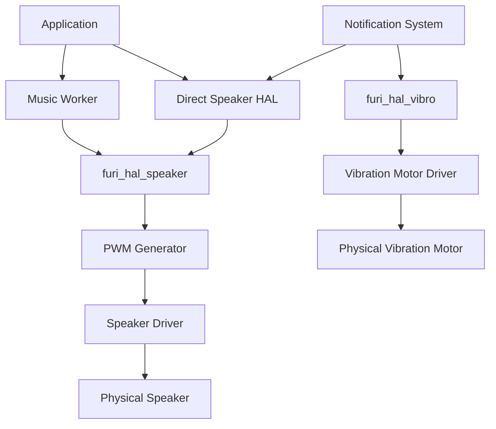
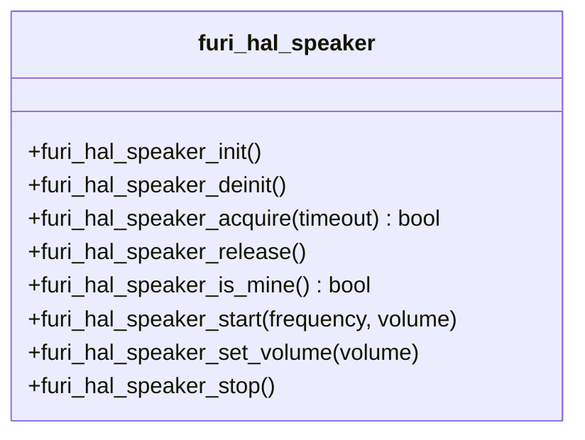
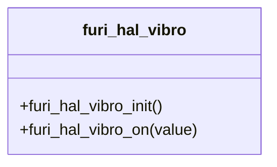
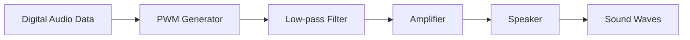
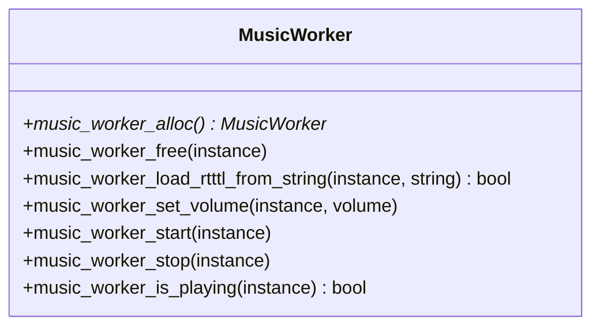
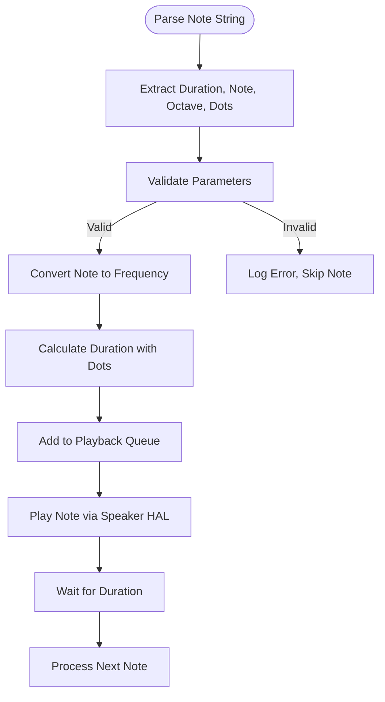
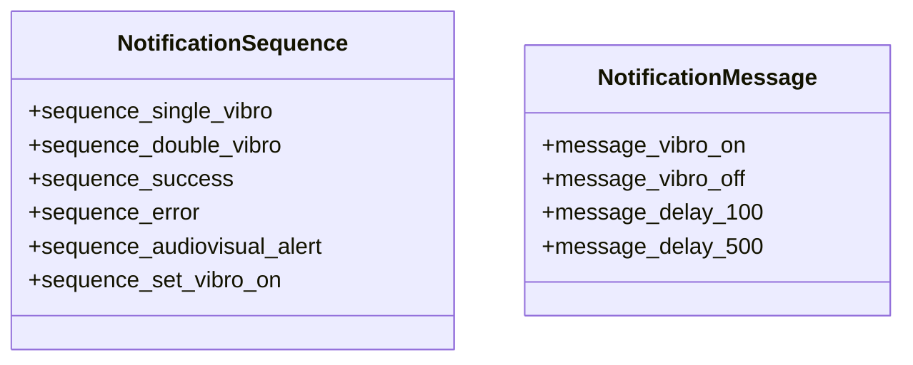

# Audio and Haptics

<cite>
**Referenced Files in This Document**   
- [furi_hal_speaker.h](file://targets/furi_hal_include/furi_hal_speaker.h#L1-L68)
- [furi_hal_vibro.h](file://targets/furi_hal_include/furi_hal_vibro.h#L1-L28)
- [speaker_debug.c](file://applications/debug/speaker_debug/speaker_debug.c#L1-L121)
- [vibro_test.c](file://applications/debug/vibro_test/vibro_test.c#L1-L67)
- [music_worker.h](file://lib/music_worker/music_worker.h#L1-L37)
- [music_worker.c](file://lib/music_worker/music_worker.c#L1-L507)
- [notification_messages.h](file://applications/services/notification/notification_messages.h#L1-L150)
</cite>

## Table of Contents
1. [Introduction](#introduction)
2. [Audio Subsystem Architecture](#audio-subsystem-architecture)
3. [Haptics Subsystem Architecture](#haptics-subsystem-architecture)
4. [Speaker API Implementation](#speaker-api-implementation)
5. [Vibration Motor API Implementation](#vibration-motor-api-implementation)
6. [PWM Generation and Audio Signal Chain](#pwm-generation-and-audio-signal-chain)
7. [Music Worker: Advanced Audio Playback](#music-worker-advanced-audio-playback)
8. [Notification System Integration](#notification-system-integration)
9. [Application Usage Examples](#application-usage-examples)
10. [Performance and Power Considerations](#performance-and-power-considerations)
11. [Troubleshooting Common Issues](#troubleshooting-common-issues)
12. [Best Practices for User Feedback](#best-practices-for-user-feedback)

## Introduction
The Audio and Haptics subsystems of the Hardware Abstraction Layer (HAL) provide essential user feedback mechanisms through sound and vibration. This document details the implementation of speaker output, vibration motor control, and PWM-based audio generation. The system enables applications to produce tones, play music sequences, and create tactile feedback patterns. The architecture separates low-level hardware control from higher-level playback management, allowing both direct control and sophisticated audio rendering. Integration with the notification system enables standardized feedback patterns across the platform.

## Audio Subsystem Architecture



**Diagram sources**
- [furi_hal_speaker.h](file://targets/furi_hal_include/furi_hal_speaker.h#L1-L68)
- [furi_hal_vibro.h](file://targets/furi_hal_include/furi_hal_vibro.h#L1-L28)
- [music_worker.h](file://lib/music_worker/music_worker.h#L1-L37)

**Section sources**
- [furi_hal_speaker.h](file://targets/furi_hal_include/furi_hal_speaker.h#L1-L68)
- [furi_hal_vibro.h](file://targets/furi_hal_include/furi_hal_vibro.h#L1-L28)

## Speaker API Implementation

The speaker HAL provides a thread-safe interface for audio output with ownership management. Applications must acquire speaker ownership before use to prevent audio conflicts.



**Diagram sources**
- [furi_hal_speaker.h](file://targets/furi_hal_include/furi_hal_speaker.h#L1-L68)

**Section sources**
- [furi_hal_speaker.h](file://targets/furi_hal_include/furi_hal_speaker.h#L1-L68)

### Key Functions
- **furi_hal_speaker_acquire**: Acquires exclusive access to the speaker with timeout
- **furi_hal_speaker_start**: Initiates tone playback at specified frequency and volume
- **furi_hal_speaker_set_volume**: Adjusts playback volume during active playback
- **furi_hal_speaker_stop**: Terminates audio output and releases hardware resources

The API uses floating-point values for frequency (in Hz) and volume (0.0 to 1.0), providing precise control over audio characteristics. The ownership model ensures that only one application can use the speaker at a time, preventing audio interference.

## Vibration Motor API Implementation

The haptics subsystem provides simple on/off control of the vibration motor through a minimal hardware abstraction.



**Diagram sources**
- [furi_hal_vibro.h](file://targets/furi_hal_include/furi_hal_vibro.h#L1-L28)

**Section sources**
- [furi_hal_vibro.h](file://targets/furi_hal_include/furi_hal_vibro.h#L1-L28)

### Key Functions
- **furi_hal_vibro_init**: Initializes the vibration motor hardware
- **furi_hal_vibro_on**: Controls motor state (true = on, false = off)

The implementation is straightforward, providing binary control of the vibration motor. More complex vibration patterns are achieved through timing control in higher-level code rather than hardware features.

## PWM Generation and Audio Signal Chain

The audio system uses PWM (Pulse Width Modulation) to generate analog-like signals from digital output. The signal chain converts digital audio data to physical sound waves:



**Diagram sources**
- [furi_hal_speaker.h](file://targets/furi_hal_include/furi_hal_speaker.h#L1-L68)

**Section sources**
- [furi_hal_speaker.h](file://targets/furi_hal_include/furi_hal_speaker.h#L1-L68)

The PWM frequency determines the maximum audio frequency that can be reproduced, while the duty cycle controls the amplitude. A low-pass filter smooths the PWM signal into an analog waveform, which is then amplified to drive the speaker. This approach allows audio generation without dedicated DAC hardware, reducing component cost.

## Music Worker: Advanced Audio Playback

The Music Worker provides higher-level audio playback capabilities beyond simple tone generation, supporting music formats and sequenced playback.



**Diagram sources**
- [music_worker.h](file://lib/music_worker/music_worker.h#L1-L37)
- [music_worker.c](file://lib/music_worker/music_worker.c#L1-L507)

**Section sources**
- [music_worker.h](file://lib/music_worker/music_worker.h#L1-L37)
- [music_worker.c](file://lib/music_worker/music_worker.c#L1-L507)

### Supported Formats
- **RTTTL (Ring Tone Text Transfer Language)**: Text-based format for monophonic ringtones
- **FMF (Flipper Music Format)**: Proprietary format using FlipperFormat serialization

The Music Worker runs in a separate thread, parsing note sequences and converting them to individual tones played through the speaker HAL. It handles timing, note duration, and volume envelope (via gradual volume reduction) to create musical playback.

### Note Processing Algorithm


**Diagram sources**
- [music_worker.c](file://lib/music_worker/music_worker.c#L200-L399)

## Notification System Integration

The notification system provides predefined sequences for common audio and haptic feedback patterns, ensuring consistency across applications.



**Diagram sources**
- [notification_messages.h](file://applications/services/notification/notification_messages.h#L1-L150)

**Section sources**
- [notification_messages.h](file://applications/services/notification/notification_messages.h#L1-L150)

### Key Sequences
- **sequence_single_vibro**: Brief vibration pulse for simple confirmation
- **sequence_double_vibro**: Two quick vibrations for distinct feedback
- **sequence_success**: Positive confirmation pattern (vibration + sound)
- **sequence_error**: Error indication pattern
- **sequence_audiovisual_alert**: Combined audio, visual, and haptic alert

Applications send notification messages to trigger these sequences, abstracting the timing and hardware control details.

## Application Usage Examples

### Speaker Debug Application
The speaker_debug application demonstrates direct usage of the music playback system:

**Section sources**
- [speaker_debug.c](file://applications/debug/speaker_debug/speaker_debug.c#L1-L121)

```c
static bool speaker_app_music_play(SpeakerDebugApp* app, const char* rtttl) {
    if(music_worker_is_playing(app->music_worker)) {
        music_worker_stop(app->music_worker);
    }

    if(!music_worker_load_rtttl_from_string(app->music_worker, rtttl)) {
        FURI_LOG_E(TAG, "Failed to load RTTTL");
        return false;
    }

    music_worker_set_volume(app->music_worker, 1.0f);
    music_worker_start(app->music_worker);

    return true;
}
```

This example shows the typical workflow: stop any existing playback, load RTTTL data, set volume, and start playback.

### Vibration Test Application
The vibro_test application demonstrates haptics control through the notification system:

**Section sources**
- [vibro_test.c](file://applications/debug/vibro_test/vibro_test.c#L1-L67)

```c
if(event.key == InputKeyOk) {
    if(event.type == InputTypePress) {
        notification_message(notification, &sequence_set_vibro_on);
        notification_message(notification, &sequence_set_green_255);
    } else if(event.type == InputTypeRelease) {
        notification_message(notification, &sequence_reset_vibro);
        notification_message(notification, &sequence_reset_green);
    }
}
```

This code creates a tactile feedback pattern where pressing OK activates vibration and a green LED, while releasing stops both.

## Performance and Power Considerations

### Audio Quality Factors
- **PWM Frequency**: Higher frequencies enable better audio fidelity but consume more power
- **Sampling Rate**: Limited by PWM capabilities and processor speed
- **Signal-to-Noise Ratio**: Affected by power supply stability and circuit design

### Power Consumption
- **Speaker**: High power draw during active playback, proportional to volume
- **Vibration Motor**: Significant current draw, especially during startup
- **Idle State**: Both subsystems consume minimal power when inactive

### Mechanical Limitations
- **Vibration Motor**: Limited by physical inertia and resonance frequency
- **Speaker**: Small size restricts bass response and maximum volume
- **Thermal Constraints**: Prolonged high-power operation may cause overheating

Optimal performance balances audio quality with power efficiency, using lower volumes and shorter durations when possible.

## Troubleshooting Common Issues

### Audio Problems
- **No Sound**: Verify speaker ownership acquisition and volume settings
- **Distorted Audio**: Check for PWM frequency conflicts or power supply issues
- **Playback Conflicts**: Ensure proper use of speaker acquisition/release

### Haptics Problems
- **Motor Not Responding**: Verify motor connection and driver circuit
- **Weak Vibration**: Check battery level and motor condition
- **Stuck Activation**: Ensure proper cleanup in application exit paths

### Debugging Tools
- **speaker_debug**: Test audio functionality and RTTTL parsing
- **vibro_test**: Verify vibration motor operation
- **Notification Sequences**: Standardized patterns for consistent testing

## Best Practices for User Feedback

### Effective Feedback Patterns
- **Short and Distinct**: Use brief sounds/vibrations for quick feedback
- **Contextual**: Match feedback type to user action (success, error, warning)
- **Consistent**: Use standard notification sequences when appropriate

### Accessibility Considerations
- **Multi-modal Feedback**: Combine audio, haptic, and visual cues
- **Adjustable Intensity**: Respect system volume and vibration settings
- **Clear Differentiation**: Ensure patterns are distinguishable

### Resource Management
- **Acquire/Release Properly**: Always release speaker ownership
- **Handle Interruptions**: Respond to system events that may preempt audio
- **Graceful Degradation**: Provide fallback feedback when resources are busy

By following these guidelines, applications can create effective, efficient, and user-friendly feedback experiences.