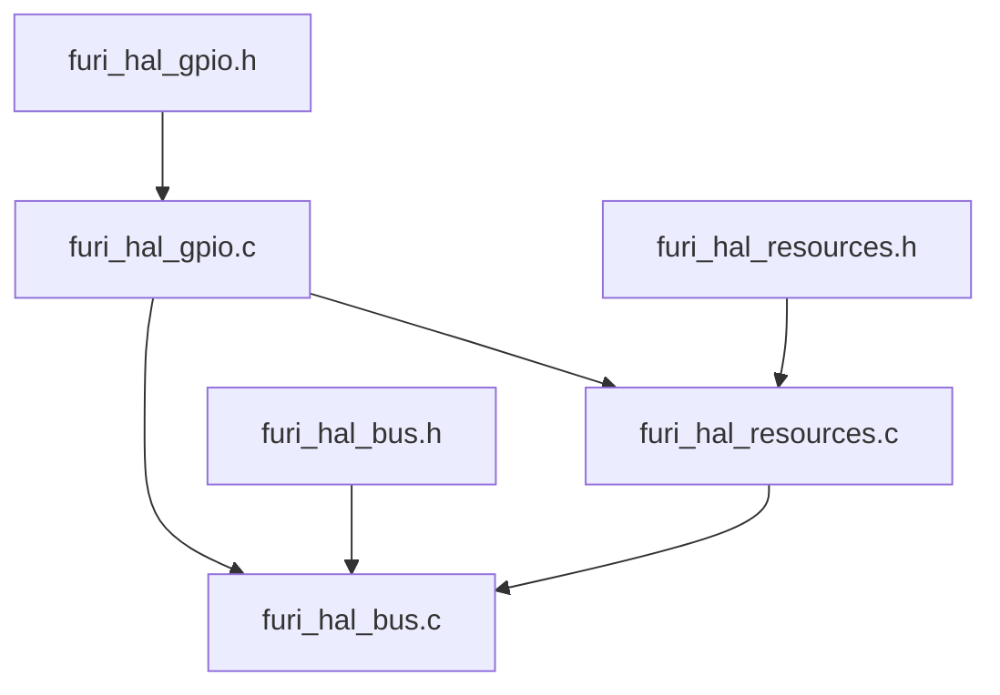
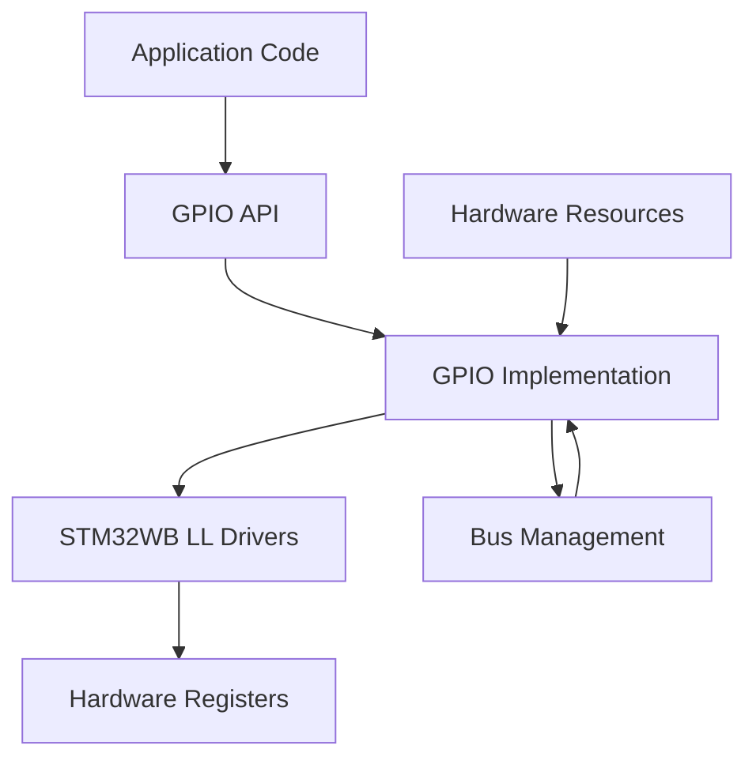
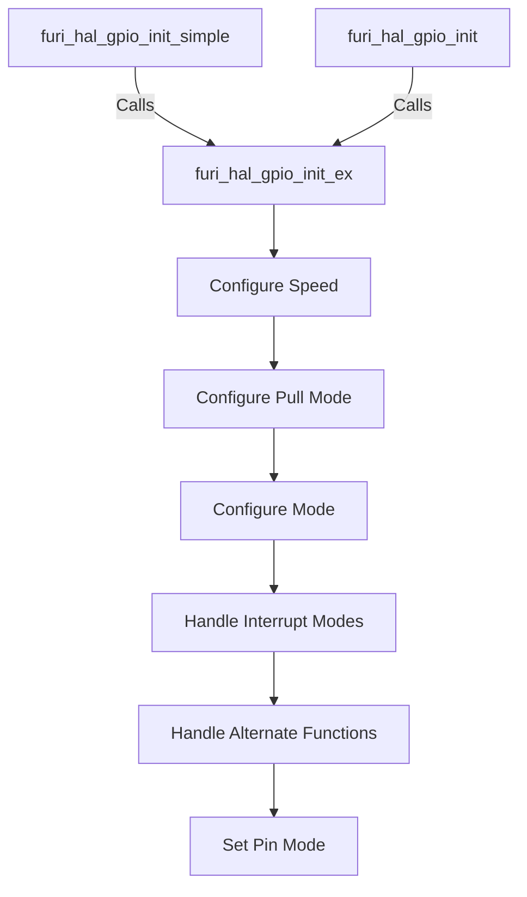
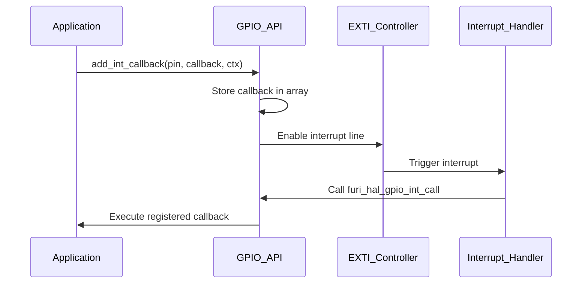
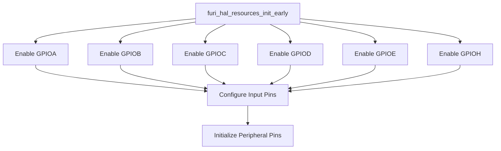
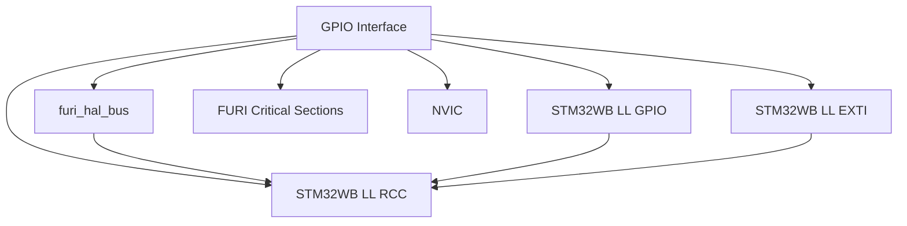

# GPIO Interface

<cite>
**Referenced Files in This Document**   
- [furi_hal_gpio.h](file://targets/f7/furi_hal/furi_hal_gpio.h)
- [furi_hal_gpio.c](file://targets/f7/furi_hal/furi_hal_gpio.c)
- [furi_hal_resources.h](file://targets/f7/furi_hal/furi_hal_resources.h)
- [furi_hal_resources.c](file://targets/f7/furi_hal/furi_hal_resources.c)
- [furi_hal_bus.h](file://targets/f7/furi_hal/furi_hal_bus.h)
- [furi_hal_bus.c](file://targets/f7/furi_hal/furi_hal_bus.c)
</cite>

## Table of Contents
1. [Introduction](#introduction)
2. [Project Structure](#project-structure)
3. [Core Components](#core-components)
4. [Architecture Overview](#architecture-overview)
5. [Detailed Component Analysis](#detailed-component-analysis)
6. [Dependency Analysis](#dependency-analysis)
7. [Performance Considerations](#performance-considerations)
8. [Troubleshooting Guide](#troubleshooting-guide)
9. [Conclusion](#conclusion)

## Introduction
The GPIO Interface module of the Hardware Abstraction Layer (HAL) provides a unified API for configuring and controlling General Purpose Input/Output pins on the Flipper Zero device. This documentation details the implementation of GPIO functionality, including pin configuration, input/output modes, interrupt handling, and pull-up/pull-down resistor control. The interface abstracts the underlying STM32WB microcontroller's GPIO hardware, providing a consistent API across different hardware revisions. The module works in conjunction with other HAL components like bus management and power control to ensure proper initialization and operation of GPIO pins.

## Project Structure
The GPIO interface implementation is organized across multiple files in the targets/f7/furi_hal directory. The core interface is defined in furi_hal_gpio.h with implementation in furi_hal_gpio.c. Hardware-specific pin mappings and configurations are defined in furi_hal_resources.h and furi_hal_resources.c. Bus management functionality, which is critical for GPIO operation, is implemented in furi_hal_bus.h and furi_hal_bus.c. This separation of concerns allows for clean abstraction between the GPIO API, hardware-specific configurations, and low-level peripheral management.

**Diagram sources**
- [furi_hal_gpio.h](file://targets/f7/furi_hal/furi_hal_gpio.h)
- [furi_hal_gpio.c](file://targets/f7/furi_hal/furi_hal_gpio.c)
- [furi_hal_resources.h](file://targets/f7/furi_hal/furi_hal_resources.h)
- [furi_hal_resources.c](file://targets/f7/furi_hal/furi_hal_resources.c)
- [furi_hal_bus.h](file://targets/f7/furi_hal/furi_hal_bus.h)
- [furi_hal_bus.c](file://targets/f7/furi_hal/furi_hal_bus.c)

**Section sources**
- [furi_hal_gpio.h](file://targets/f7/furi_hal/furi_hal_gpio.h)
- [furi_hal_gpio.c](file://targets/f7/furi_hal/furi_hal_gpio.c)
- [furi_hal_resources.h](file://targets/f7/furi_hal/furi_hal_resources.h)
- [furi_hal_resources.c](file://targets/f7/furi_hal/furi_hal_resources.c)
- [furi_hal_bus.h](file://targets/f7/furi_hal/furi_hal_bus.h)
- [furi_hal_bus.c](file://targets/f7/furi_hal/furi_hal_bus.c)

## Core Components
The GPIO interface consists of several core components that work together to provide a complete GPIO management system. The primary components include the GPIO initialization functions, interrupt handling system, pin configuration structures, and hardware resource management. The implementation leverages the STM32WB's LL (Low Layer) drivers for direct hardware access while providing a higher-level abstraction through the HAL interface. The system is designed to be both efficient and safe, with critical sections protected by FURI_CRITICAL_ENTER/EXIT macros to prevent race conditions during configuration changes.

**Section sources**
- [furi_hal_gpio.h](file://targets/f7/furi_hal/furi_hal_gpio.h#L1-L287)
- [furi_hal_gpio.c](file://targets/f7/furi_hal/furi_hal_gpio.c#L1-L343)

## Architecture Overview
The GPIO architecture follows a layered approach with clear separation between the API interface, implementation logic, and hardware abstraction. The top layer consists of the public API functions that applications use to configure and interact with GPIO pins. Below this is the implementation layer that translates API calls into direct hardware register operations using the STM32WB LL drivers. The bottom layer consists of hardware-specific configurations and resource management that handle the actual pin mappings and bus initialization. This architecture allows for portability across different hardware revisions while maintaining high performance and direct hardware access.

**Diagram sources**
- [furi_hal_gpio.h](file://targets/f7/furi_hal/furi_hal_gpio.h)
- [furi_hal_gpio.c](file://targets/f7/furi_hal/furi_hal_gpio.c)
- [furi_hal_bus.h](file://targets/f7/furi_hal/furi_hal_bus.h)
- [furi_hal_resources.h](file://targets/f7/furi_hal/furi_hal_resources.h)

## Detailed Component Analysis

### GPIO Initialization and Configuration
The GPIO initialization system provides three levels of configuration complexity to accommodate different use cases. The simplest function, furi_hal_gpio_init_simple, configures a pin with a basic mode. The standard function, furi_hal_gpio_init, adds pull-up/pull-down and speed configuration. The most comprehensive function, furi_hal_gpio_init_ex, includes alternate function configuration for pins that can serve multiple purposes. All functions ultimately call the extended version with appropriate default values, ensuring consistent behavior across the API.

**Diagram sources**
- [furi_hal_gpio.h](file://targets/f7/furi_hal/furi_hal_gpio.h#L100-L150)
- [furi_hal_gpio.c](file://targets/f7/furi_hal/furi_hal_gpio.c#L100-L250)

**Section sources**
- [furi_hal_gpio.h](file://targets/f7/furi_hal/furi_hal_gpio.h#L100-L150)
- [furi_hal_gpio.c](file://targets/f7/furi_hal/furi_hal_gpio.c#L100-L250)

### Interrupt Handling System
The GPIO interrupt system provides a callback-based mechanism for responding to pin state changes. Each pin can have a single callback registered, which is stored in a global array indexed by pin number. The system supports various interrupt types including rising edge, falling edge, and both edges. Interrupts are managed through dedicated functions for adding, enabling, disabling, and removing callbacks. The implementation uses the STM32WB's EXTI (External Interrupt) controller with individual interrupt handlers for different pin groups.

**Diagram sources**
- [furi_hal_gpio.h](file://targets/f7/furi_hal/furi_hal_gpio.h#L60-L90)
- [furi_hal_gpio.c](file://targets/f7/furi_hal/furi_hal_gpio.c#L250-L343)

**Section sources**
- [furi_hal_gpio.h](file://targets/f7/furi_hal/furi_hal_gpio.h#L60-L90)
- [furi_hal_gpio.c](file://targets/f7/furi_hal/furi_hal_gpio.c#L250-L343)

### Hardware Resource Management
The GPIO system integrates with the bus management module to ensure proper initialization of GPIO ports. Before GPIO pins can be used, their corresponding GPIO ports must be enabled in the RCC (Reset and Clock Control) peripheral. The furi_hal_bus module provides functions to enable, disable, and reset peripheral buses. During early initialization, the system enables all GPIO ports (A, B, C, D, E, H) to make them available for configuration. This layered approach ensures that GPIO operations only occur when the underlying hardware is properly powered and clocked.

**Diagram sources**
- [furi_hal_resources.c](file://targets/f7/furi_hal/furi_hal_resources.c#L200-L250)
- [furi_hal_bus.c](file://targets/f7/furi_hal/furi_hal_bus.c#L150-L200)

**Section sources**
- [furi_hal_resources.c](file://targets/f7/furi_hal/furi_hal_resources.c#L200-L250)
- [furi_hal_bus.c](file://targets/f7/furi_hal/furi_hal_bus.c#L150-L200)

## Dependency Analysis
The GPIO interface has several critical dependencies that enable its full functionality. The most fundamental dependency is on the STM32WB LL drivers, which provide low-level access to GPIO registers. The system also depends on the bus management module to control clocking and power for GPIO ports. Additionally, the implementation relies on the critical section macros (FURI_CRITICAL_ENTER/EXIT) to ensure atomic configuration changes. The interrupt system depends on NVIC (Nested Vectored Interrupt Controller) configuration to set priorities and enable interrupt lines. These dependencies create a tightly integrated system where proper initialization order is essential for reliable operation.

**Diagram sources**
- [furi_hal_gpio.c](file://targets/f7/furi_hal/furi_hal_gpio.c)
- [furi_hal_bus.c](file://targets/f7/furi_hal/furi_hal_bus.c)
- [stm32wbxx_ll_gpio.h](file://lib/stm32wb_hal/Inc/stm32wbxx_ll_gpio.h)
- [stm32wbxx_ll_exti.h](file://lib/stm32wb_hal/Inc/stm32wbxx_ll_exti.h)

**Section sources**
- [furi_hal_gpio.c](file://targets/f7/furi_hal/furi_hal_gpio.c)
- [furi_hal_bus.c](file://targets/f7/furi_hal/furi_hal_bus.c)

## Performance Considerations
The GPIO implementation is optimized for both performance and safety. Direct register access through the LL drivers ensures minimal overhead for pin operations. The read and write functions are implemented as static inline functions, allowing the compiler to optimize them into single assembly instructions when possible. Critical sections are used judiciously to prevent race conditions during configuration changes without impacting runtime performance of read/write operations. The interrupt system is designed to have minimal latency, with interrupt handlers directly calling the registered callbacks after clearing the interrupt flag. For applications requiring maximum performance, direct use of the LL drivers is possible, bypassing the HAL layer entirely.

## Troubleshooting Guide
Common issues with GPIO configuration typically stem from improper initialization order or conflicting pin usage. Ensure that the appropriate GPIO port bus is enabled before attempting to configure pins. Verify that interrupt priorities are set correctly to prevent missed interrupts. When using alternate functions, confirm that the correct alternate function number is specified for the desired peripheral. For pins that are not responding as expected, check for hardware conflicts or incorrect pull resistor configuration. The system provides furi_check assertions that will crash with descriptive messages if invalid parameters are passed to GPIO functions, aiding in early detection of configuration errors.

**Section sources**
- [furi_hal_gpio.c](file://targets/f7/furi_hal/furi_hal_gpio.c#L150-L200)
- [furi_hal_resources.c](file://targets/f7/furi_hal/furi_hal_resources.c#L200-L250)

## Conclusion
The GPIO interface module provides a robust and flexible system for managing General Purpose Input/Output pins on the Flipper Zero device. By abstracting the underlying STM32WB hardware while maintaining direct register access, it offers both ease of use and high performance. The layered architecture separates concerns between API, implementation, and hardware management, making the system maintainable and extensible. The integration with bus management and interrupt systems ensures reliable operation across different use cases and hardware configurations. This comprehensive implementation enables developers to effectively utilize GPIO functionality for a wide range of applications, from simple LED control to complex peripheral interfacing.