# Hardware Abstraction Layer

<cite>
**Referenced Files in This Document**   
- [furi_hal.h](file://targets/furi_hal_include/furi_hal.h)
- [furi_hal_gpio.h](file://targets/f7/furi_hal/furi_hal_gpio.h)
- [furi_hal_i2c.c](file://targets/f7/furi_hal/furi_hal_i2c.c)
- [furi_hal_spi.c](file://targets/f7/furi_hal/furi_hal_spi.c)
- [furi_hal_serial.h](file://targets/f7/furi_hal/furi_hal_serial.h)
- [furi_hal_pwm.h](file://targets/f7/furi_hal/furi_hal_pwm.h)
- [furi_hal_infrared.c](file://targets/f7/furi_hal/furi_hal_infrared.c)
- [furi_hal_nfc.c](file://targets/f7/furi_hal/furi_hal_nfc.c)
- [furi_hal_power.c](file://targets/f7/furi_hal/furi_hal_power.c)
</cite>

## Table of Contents
1. [Introduction](#introduction)
2. [Project Structure](#project-structure)
3. [Core Components](#core-components)
4. [Architecture Overview](#architecture-overview)
5. [Detailed Component Analysis](#detailed-component-analysis)
6. [Dependency Analysis](#dependency-analysis)
7. [Performance Considerations](#performance-considerations)
8. [Troubleshooting Guide](#troubleshooting-guide)
9. [Conclusion](#conclusion)

## Introduction
The Hardware Abstraction Layer (HAL) in the Flipper Zero firmware provides a unified interface between the application layer and the underlying hardware peripherals. This documentation details the design principles, component interactions, and interface contracts that enable consistent hardware access across different hardware revisions. The HAL abstracts low-level register manipulation, providing developers with a simplified API for interacting with GPIO, I2C, SPI, UART, and other peripherals. The layer ensures thread safety, manages resource contention, and integrates with the system's power management framework.

## Project Structure
The HAL implementation is organized within the `targets/f7/furi_hal` directory, with interface headers located in `targets/furi_hal_include`. This separation allows for target-specific implementations while maintaining a consistent API surface. The structure follows a modular pattern where each peripheral has dedicated source files for implementation and headers for public APIs.

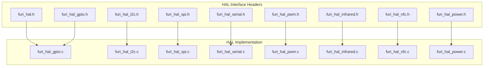

**Diagram sources**
- [furi_hal.h](file://targets/furi_hal_include/furi_hal.h)
- [furi_hal_gpio.h](file://targets/f7/furi_hal/furi_hal_gpio.h)
- [furi_hal_i2c.c](file://targets/f7/furi_hal/furi_hal_i2c.c)
- [furi_hal_spi.c](file://targets/f7/furi_hal/furi_hal_spi.c)
- [furi_hal_serial.h](file://targets/f7/furi_hal/furi_hal_serial.h)
- [furi_hal_pwm.h](file://targets/f7/furi_hal/furi_hal_pwm.h)
- [furi_hal_infrared.c](file://targets/f7/furi_hal/furi_hal_infrared.c)
- [furi_hal_nfc.c](file://targets/f7/furi_hal/furi_hal_nfc.c)
- [furi_hal_power.c](file://targets/f7/furi_hal/furi_hal_power.c)

**Section sources**
- [furi_hal.h](file://targets/furi_hal_include/furi_hal.h)
- [furi_hal_gpio.h](file://targets/f7/furi_hal/furi_hal_gpio.h)

## Core Components
The HAL consists of several core components that manage different hardware peripherals. Each component follows a consistent design pattern with initialization, configuration, data transfer, and deinitialization functions. The components are designed to be thread-safe and handle resource contention through mutexes and semaphores. The HAL also integrates with the system's power management to ensure optimal power consumption during peripheral operation.

**Section sources**
- [furi_hal.h](file://targets/furi_hal_include/furi_hal.h)
- [furi_hal_gpio.h](file://targets/f7/furi_hal/furi_hal_gpio.h)
- [furi_hal_i2c.c](file://targets/f7/furi_hal/furi_hal_i2c.c)

## Architecture Overview
The HAL architecture is built around a bus-based model where each peripheral bus (I2C, SPI) has a dedicated handle system for resource management. The architecture ensures that only one application can access a bus at a time, preventing conflicts. The HAL uses callback mechanisms for asynchronous operations and integrates with the FreeRTOS kernel for task synchronization.

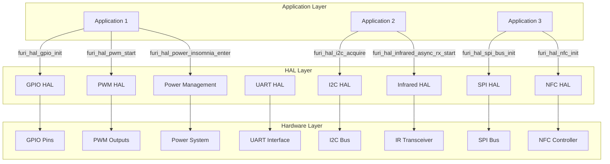

**Diagram sources**
- [furi_hal.h](file://targets/furi_hal_include/furi_hal.h)
- [furi_hal_gpio.h](file://targets/f7/furi_hal/furi_hal_gpio.h)
- [furi_hal_i2c.c](file://targets/f7/furi_hal/furi_hal_i2c.c)
- [furi_hal_spi.c](file://targets/f7/furi_hal/furi_hal_spi.c)
- [furi_hal_serial.h](file://targets/f7/furi_hal/furi_hal_serial.h)
- [furi_hal_pwm.h](file://targets/f7/furi_hal/furi_hal_pwm.h)
- [furi_hal_infrared.c](file://targets/f7/furi_hal/furi_hal_infrared.c)
- [furi_hal_nfc.c](file://targets/f7/furi_hal/furi_hal_nfc.c)
- [furi_hal_power.c](file://targets/f7/furi_hal/furi_hal_power.c)

## Detailed Component Analysis

### GPIO HAL Analysis
The GPIO HAL provides functions for configuring and controlling general-purpose input/output pins. It supports various modes including input, output, alternate functions, and interrupt handling. The implementation uses STM32's LL (Low Layer) drivers for direct register access while providing a simplified API.

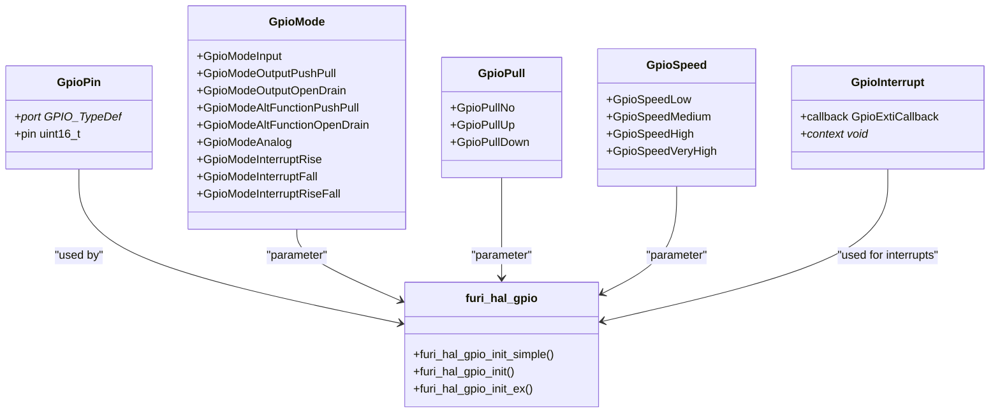

**Diagram sources**
- [furi_hal_gpio.h](file://targets/f7/furi_hal/furi_hal_gpio.h#L50-L150)

**Section sources**
- [furi_hal_gpio.h](file://targets/f7/furi_hal/furi_hal_gpio.h)

### I2C HAL Analysis
The I2C HAL implements a robust interface for I2C communication with proper bus arbitration and error handling. It uses a handle-based system to manage bus access, ensuring that only one application can use the bus at a time. The implementation includes timeout mechanisms and supports both 7-bit and 10-bit addressing.

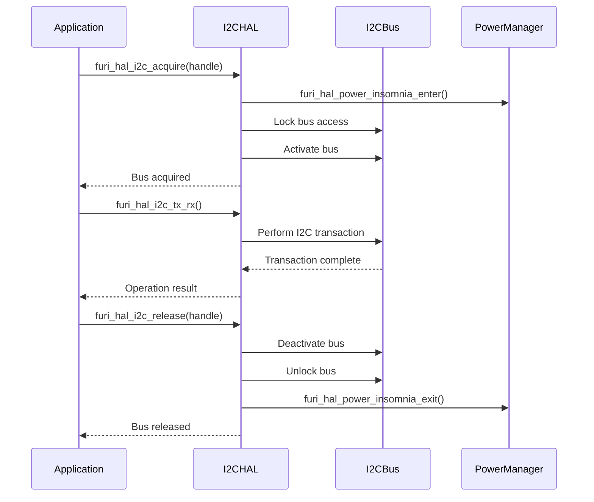

**Diagram sources**
- [furi_hal_i2c.c](file://targets/f7/furi_hal/furi_hal_i2c.c#L50-L200)

**Section sources**
- [furi_hal_i2c.c](file://targets/f7/furi_hal/furi_hal_i2c.c)

### SPI HAL Analysis
The SPI HAL provides both blocking and DMA-based data transfer methods. It implements a handle system similar to I2C for bus arbitration and includes functions for full-duplex and half-duplex communication. The DMA implementation uses semaphores for synchronization between the application and interrupt service routines.

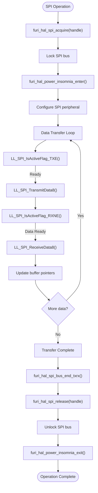

**Diagram sources**
- [furi_hal_spi.c](file://targets/f7/furi_hal/furi_hal_spi.c#L50-L200)

**Section sources**
- [furi_hal_spi.c](file://targets/f7/furi_hal/furi_hal_spi.c)

### UART/Serial HAL Analysis
The serial HAL implements UART functionality with both synchronous and asynchronous operation modes. It supports baud rate configuration, data transmission, and interrupt-driven reception. The asynchronous API uses callback functions that execute in interrupt context, requiring careful thread safety considerations.

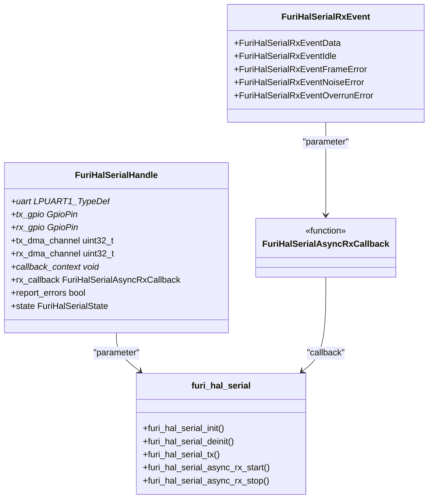

**Diagram sources**
- [furi_hal_serial.h](file://targets/f7/furi_hal/furi_hal_serial.h#L50-L150)

**Section sources**
- [furi_hal_serial.h](file://targets/f7/furi_hal/furi_hal_serial.h)

### PWM HAL Analysis
The PWM HAL provides pulse width modulation functionality for generating signals with specific frequency and duty cycle. It supports multiple output channels and allows dynamic parameter adjustment during operation. The implementation uses STM32's timer peripherals with complementary output configurations.

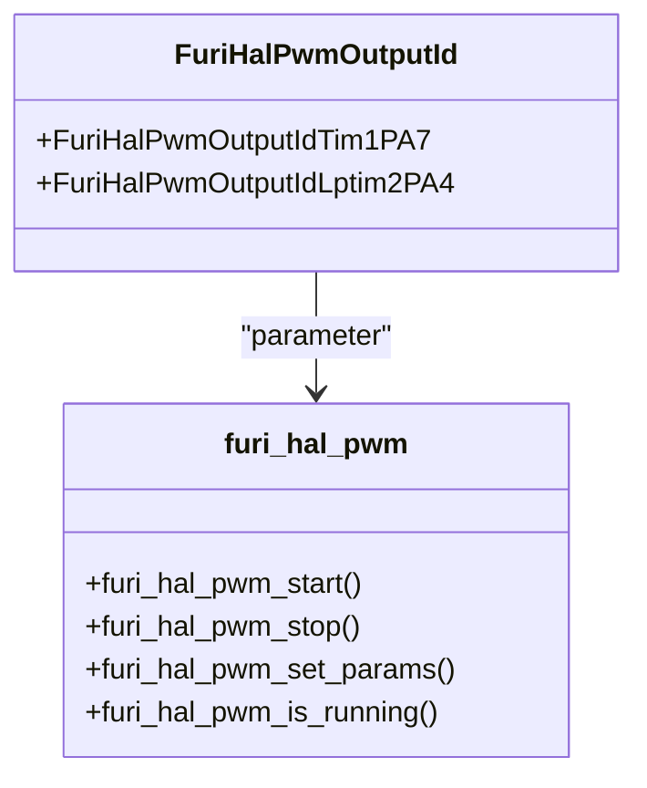

**Diagram sources**
- [furi_hal_pwm.h](file://targets/f7/furi_hal/furi_hal_pwm.h#L10-L50)

**Section sources**
- [furi_hal_pwm.h](file://targets/f7/furi_hal/furi_hal_pwm.h)

### Infrared HAL Analysis
The infrared HAL implements both transmission and reception of infrared signals using timer-based PWM generation and input capture. The transmission system uses DMA for efficient waveform generation, while reception uses timer input capture with interrupt handling for precise timing measurement.

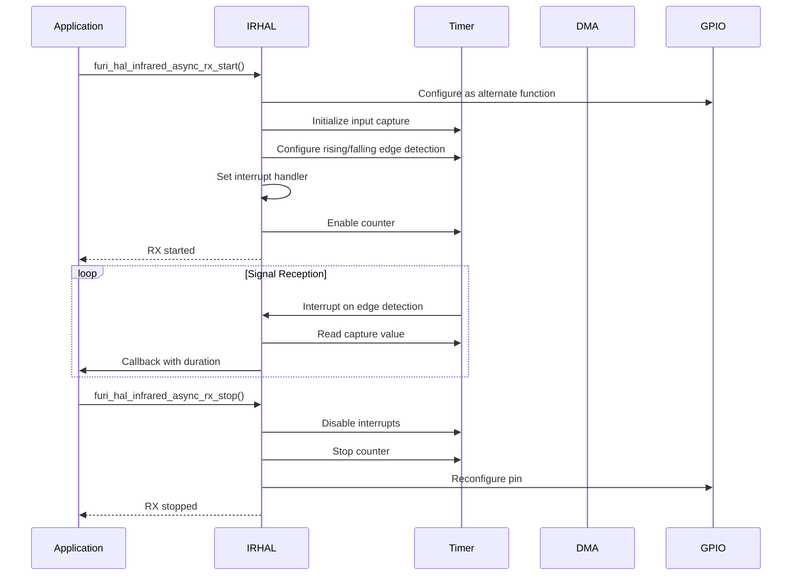

**Diagram sources**
- [furi_hal_infrared.c](file://targets/f7/furi_hal/furi_hal_infrared.c#L200-L400)

**Section sources**
- [furi_hal_infrared.c](file://targets/f7/furi_hal/furi_hal_infrared.c)

### NFC HAL Analysis
The NFC HAL provides an interface to the ST25R3916 NFC controller via SPI. It implements initialization, error checking, and technology-specific protocols for ISO14443A/B, ISO15693, and Felica. The implementation includes oscillator startup verification and voltage measurement for reliable operation.

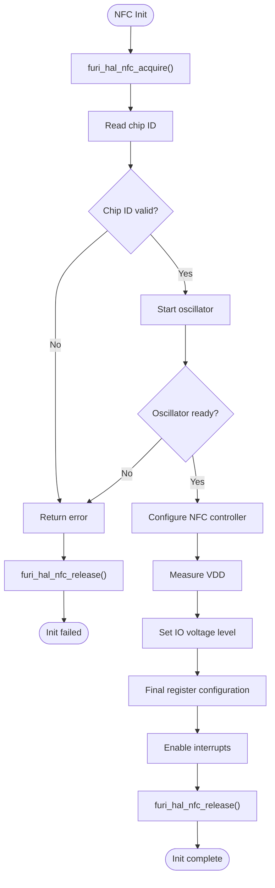

**Diagram sources**
- [furi_hal_nfc.c](file://targets/f7/furi_hal/furi_hal_nfc.c#L50-L200)

**Section sources**
- [furi_hal_nfc.c](file://targets/f7/furi_hal/furi_hal_nfc.c)

### Power Management Integration
The HAL integrates with the system's power management to control power states during peripheral operation. Functions like `furi_hal_power_insomnia_enter()` and `furi_hal_power_insomnia_exit()` prevent the system from entering low-power modes during active communication.

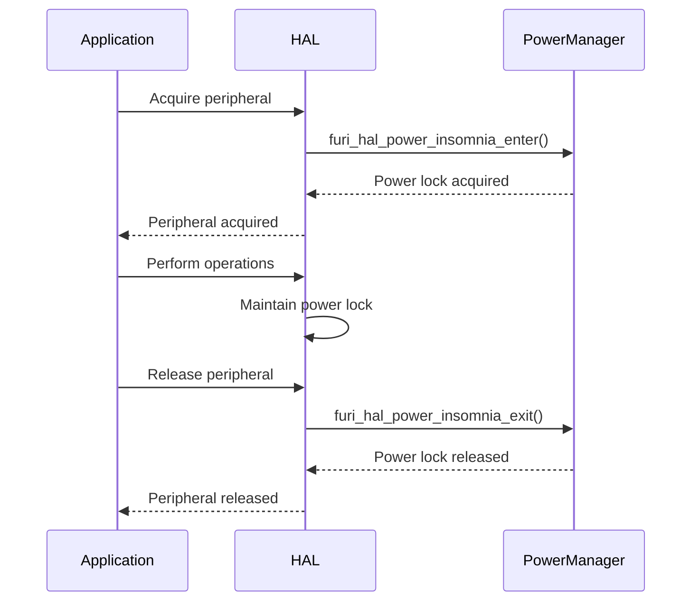

**Diagram sources**
- [furi_hal_i2c.c](file://targets/f7/furi_hal/furi_hal_i2c.c#L80-L100)
- [furi_hal_spi.c](file://targets/f7/furi_hal/furi_hal_spi.c#L120-L140)
- [furi_hal_power.c](file://targets/f7/furi_hal/furi_hal_power.c)

**Section sources**
- [furi_hal_i2c.c](file://targets/f7/furi_hal/furi_hal_i2c.c)
- [furi_hal_spi.c](file://targets/f7/furi_hal/furi_hal_spi.c)
- [furi_hal_power.c](file://targets/f7/furi_hal/furi_hal_power.c)

## Dependency Analysis
The HAL components have a hierarchical dependency structure where lower-level components depend on basic system services. The dependency graph shows how peripherals build upon core functionality while maintaining loose coupling.

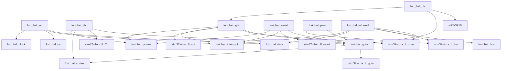

**Diagram sources**
- [furi_hal.h](file://targets/furi_hal_include/furi_hal.h)
- [furi_hal_gpio.h](file://targets/f7/furi_hal/furi_hal_gpio.h)
- [furi_hal_i2c.c](file://targets/f7/furi_hal/furi_hal_i2c.c)
- [furi_hal_spi.c](file://targets/f7/furi_hal/furi_hal_spi.c)
- [furi_hal_serial.h](file://targets/f7/furi_hal/furi_hal_serial.h)
- [furi_hal_pwm.h](file://targets/f7/furi_hal/furi_hal_pwm.h)
- [furi_hal_infrared.c](file://targets/f7/furi_hal/furi_hal_infrared.c)
- [furi_hal_nfc.c](file://targets/f7/furi_hal/furi_hal_nfc.c)
- [furi_hal_power.c](file://targets/f7/furi_hal/furi_hal_power.c)

**Section sources**
- [furi_hal.h](file://targets/furi_hal_include/furi_hal.h)
- [furi_hal_gpio.h](file://targets/f7/furi_hal/furi_hal_gpio.h)
- [furi_hal_i2c.c](file://targets/f7/furi_hal/furi_hal_i2c.c)
- [furi_hal_spi.c](file://targets/f7/furi_hal/furi_hal_spi.c)
- [furi_hal_serial.h](file://targets/f7/furi_hal/furi_hal_serial.h)
- [furi_hal_pwm.h](file://targets/f7/furi_hal/furi_hal_pwm.h)
- [furi_hal_infrared.c](file://targets/f7/furi_hal/furi_hal_infrared.c)
- [furi_hal_nfc.c](file://targets/f7/furi_hal/furi_hal_nfc.c)
- [furi_hal_power.c](file://targets/f7/furi_hal/furi_hal_power.c)

## Performance Considerations
The HAL is designed with performance in mind, using direct register access through STM32's LL drivers to minimize overhead. DMA is utilized for high-throughput peripherals like SPI and infrared to reduce CPU load. The handle-based bus arbitration system ensures efficient resource sharing between applications. Power management integration prevents unnecessary wakeups while maintaining reliable communication. The use of semaphores and mutexes for synchronization adds minimal overhead due to the underlying FreeRTOS implementation.

## Troubleshooting Guide
Common issues with the HAL typically involve resource contention, improper initialization, or timing problems. When debugging, verify that peripherals are properly acquired and released, check for correct pin configuration, and ensure that power management functions are called appropriately. For I2C and SPI issues, verify bus speeds and signal integrity. For timer-based peripherals like PWM and infrared, ensure that the correct timer channels are configured. The HAL includes assertion checks using `furi_check()` that will halt execution if invalid parameters are detected, aiding in early error detection.

**Section sources**
- [furi_hal.h](file://targets/furi_hal_include/furi_hal.h#L50-L70)
- [furi_hal_gpio.h](file://targets/f7/furi_hal/furi_hal_gpio.h#L100-L120)
- [furi_hal_i2c.c](file://targets/f7/furi_hal/furi_hal_i2c.c#L150-L180)
- [furi_hal_spi.c](file://targets/f7/furi_hal/furi_hal_spi.c#L100-L130)

## Conclusion
The Hardware Abstraction Layer in the Flipper Zero firmware provides a robust, efficient, and easy-to-use interface for hardware peripherals. By abstracting low-level register manipulation and providing consistent APIs across different hardware revisions, the HAL enables application developers to focus on functionality rather than hardware specifics. The layer's design emphasizes thread safety, resource management, and power efficiency, making it suitable for embedded applications with real-time requirements. The modular structure allows for easy extension and maintenance, ensuring the firmware can adapt to future hardware changes.