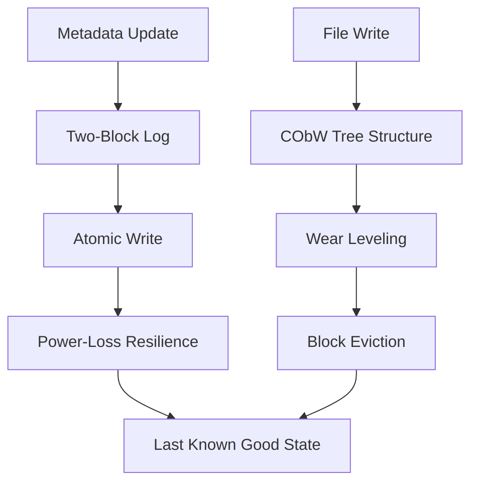
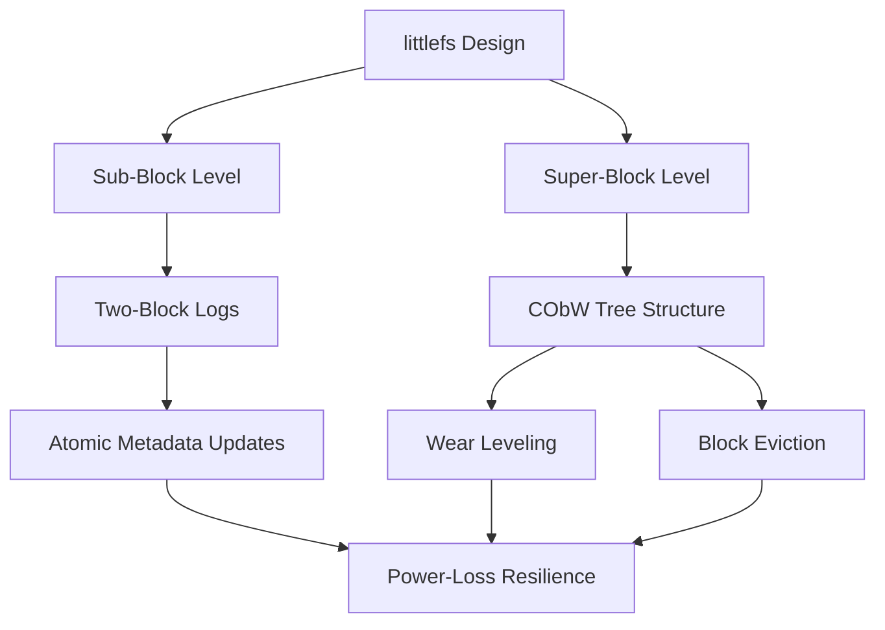

# Memory and Storage

<cite>
**Referenced Files in This Document**   
- [DESIGN.md](file://lib/littlefs/DESIGN.md)
- [README.md](file://lib/littlefs/README.md)
</cite>

## Table of Contents
1. [Introduction](#introduction)
2. [Internal Flash Memory Management](#internal-flash-memory-management)
3. [External SD Card Interface](#external-sd-card-interface)
4. [Memory Allocation and Management](#memory-allocation-and-management)
5. [File System Design and Implementation](#file-system-design-and-implementation)
6. [API Functions and Usage Examples](#api-functions-and-usage-examples)
7. [Relationship with Other HAL Modules](#relationship-with-other-hal-modules)
8. [Common Issues and Mitigation Strategies](#common-issues-and-mitigation-strategies)
9. [Best Practices for Efficient Memory Usage](#best-practices-for-efficient-memory-usage)
10. [Memory Map Architecture](#memory-map-architecture)

## Introduction
The Memory and Storage subsystem of the Hardware Abstraction Layer (HAL) is responsible for managing both internal flash memory and external SD card storage on the Flipper Zero device. This documentation provides a comprehensive overview of the implementation details, API functions, and best practices for working with the memory subsystem. The system is designed to be resilient to power loss, provide wear leveling for flash memory, and operate efficiently within the constrained memory environment of a microcontroller.

**Section sources**
- [README.md](file://lib/littlefs/README.md#L0-L26)

## Internal Flash Memory Management
The internal flash memory management is implemented using the littlefs filesystem, which is specifically designed for microcontrollers. littlefs provides power-loss resilience through strong copy-on-write guarantees, ensuring that file operations are atomic and the filesystem can recover to the last known good state in case of power failure. The system uses a combination of small two-block logs at the sub-block level and a copy-on-bounded-writes (CObW) tree structure at the super-block level to manage metadata updates and wear leveling.

The RAM usage in littlefs is strictly bounded, meaning that memory consumption does not increase as the filesystem grows. This is critical for embedded systems with limited memory resources. The filesystem avoids unbounded recursion and limits dynamic memory allocation to configurable buffers that can be provided statically, making it suitable for real-time systems.

**Diagram sources**
- [DESIGN.md](file://lib/littlefs/DESIGN.md#L226-L296)

**Section sources**
- [README.md](file://lib/littlefs/README.md#L0-L26)
- [DESIGN.md](file://lib/littlefs/DESIGN.md#L226-L296)

## External SD Card Interface
While the provided documentation does not contain specific details about the external SD card interface implementation, the presence of the littlefs filesystem suggests that similar principles of power-loss resilience and wear leveling are applied to external storage. The SD card interface would need to handle the physical communication with the SD card, manage the FAT or other filesystem used on the card, and provide a consistent API for applications to read and write files.

The external storage system must handle potential issues such as card removal during write operations, corrupted filesystems, and varying SD card speeds and capacities. Error handling and recovery mechanisms would be essential to maintain data integrity when working with removable storage media.

## Memory Allocation and Management
The memory allocation system is designed to operate within the constraints of a microcontroller environment with limited RAM. The littlefs implementation ensures that RAM usage is strictly bounded, preventing memory exhaustion as the filesystem grows. This is achieved through the use of configurable buffers that can be allocated statically, avoiding the need for dynamic memory allocation during filesystem operations.

The system likely employs a memory manager that handles allocation and deallocation of memory blocks for applications and system services. This manager would need to minimize fragmentation, provide efficient allocation algorithms, and ensure that critical system functions always have access to necessary memory resources.

## File System Design and Implementation
The littlefs filesystem implementation combines the benefits of logging and copy-on-write (COW) data structures to create a resilient and efficient filesystem for flash memory. At the sub-block level, littlefs uses small two-block logs to provide atomic updates to metadata anywhere on the filesystem. This logging approach ensures that metadata changes are either fully completed or not applied at all, maintaining filesystem consistency.

At the super-block level, littlefs implements a copy-on-bounded-writes (CObW) tree of blocks that can be evicted on demand. This structure provides good performance while preventing the upward propagation of wear that can occur with traditional COW structures. By copying after n writes rather than after each write, the system divides the propagation of wear by n at each level, effectively managing flash wear when n is sufficiently large.

The design acknowledges that small logs can be expensive in terms of storage overhead, potentially requiring up to 4x the size of the original data in the worst case. However, this trade-off is accepted to achieve the desired level of power-loss resilience and wear leveling.

**Diagram sources**
- [DESIGN.md](file://lib/littlefs/DESIGN.md#L226-L296)

**Section sources**
- [DESIGN.md](file://lib/littlefs/DESIGN.md#L0-L21)
- [DESIGN.md](file://lib/littlefs/DESIGN.md#L226-L296)

## API Functions and Usage Examples
Based on the available documentation, specific API function details are not provided. However, a typical memory and storage API would include functions for:

- Mounting and unmounting filesystems
- Creating, opening, reading, writing, and closing files
- Creating and removing directories
- Querying file and filesystem properties
- Synchronizing data to storage

Applications would use these functions to store configuration data, firmware updates, and user files. For example, a configuration management system might use the API to save user preferences to a JSON file on the internal flash, while a firmware updater would use it to store downloaded firmware images before installation.

## Relationship with Other HAL Modules
The memory and storage subsystem interacts closely with several other HAL modules:

- **File Systems**: The littlefs implementation provides the underlying filesystem for both internal flash and potentially external SD cards.
- **Power Management**: The power-loss resilience features require coordination with the power management module to handle unexpected shutdowns gracefully.
- **Security**: Secure storage of sensitive data would require integration with security modules for encryption and access control.
- **Application Management**: The storage system provides persistent storage for application data and settings.

These interactions ensure that data is protected, accessible, and consistent across different system states and power cycles.

## Common Issues and Mitigation Strategies
Several common issues are addressed by the littlefs design:

- **Wear Leveling**: The CObW tree structure and dynamic wear leveling prevent premature flash memory failure by distributing writes evenly across available blocks.
- **Write Endurance**: By limiting the number of write cycles to any single block, the system extends the overall lifespan of the flash memory.
- **Error Correction**: While not explicitly mentioned, the filesystem likely includes mechanisms to detect and correct data corruption.
- **Power Loss**: The copy-on-write guarantees and atomic operations ensure that the filesystem can recover to a consistent state after unexpected power loss.

Additional issues that may need to be addressed include handling bad blocks, managing storage fragmentation, and optimizing write performance.

## Best Practices for Efficient Memory Usage
To use the memory subsystem efficiently, applications should:

- Minimize the number of small, frequent writes by batching operations when possible
- Use appropriate buffer sizes to balance memory usage and I/O performance
- Close files promptly to free up system resources
- Handle errors gracefully, particularly those related to storage full conditions
- Avoid storing temporary data in persistent storage when RAM is sufficient

Applications should also be designed to function correctly when storage operations fail, providing appropriate user feedback and recovery options.

## Memory Map Architecture
The memory map architecture is designed to efficiently utilize the available flash and RAM resources. The littlefs implementation's bounded RAM usage ensures that the memory footprint remains constant regardless of filesystem size. The system likely divides the flash memory into regions for:

- Firmware storage
- Configuration data
- User files
- Temporary storage
- Bad block management

This organization allows for efficient wear leveling and prevents different types of data from interfering with each other's storage patterns. The exact memory map would be defined in the hardware abstraction layer and may vary between different hardware revisions of the device.

**Section sources**
- [README.md](file://lib/littlefs/README.md#L0-L26)
- [DESIGN.md](file://lib/littlefs/DESIGN.md#L226-L296)