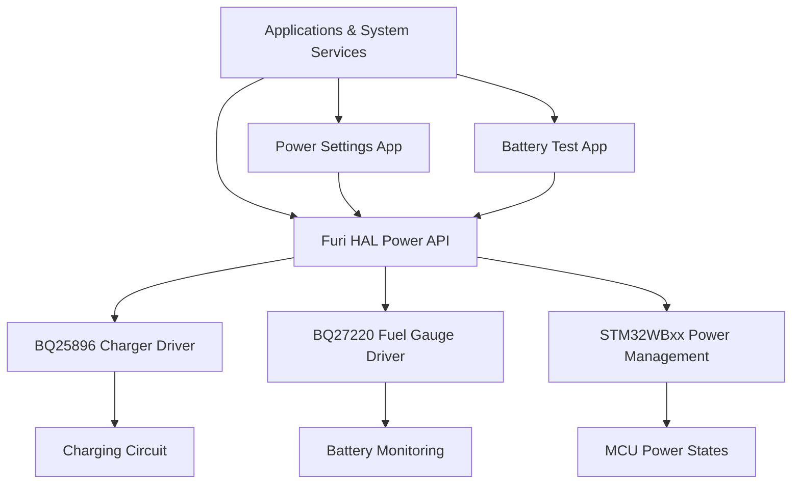
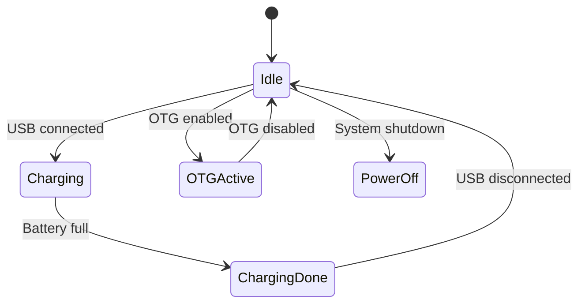
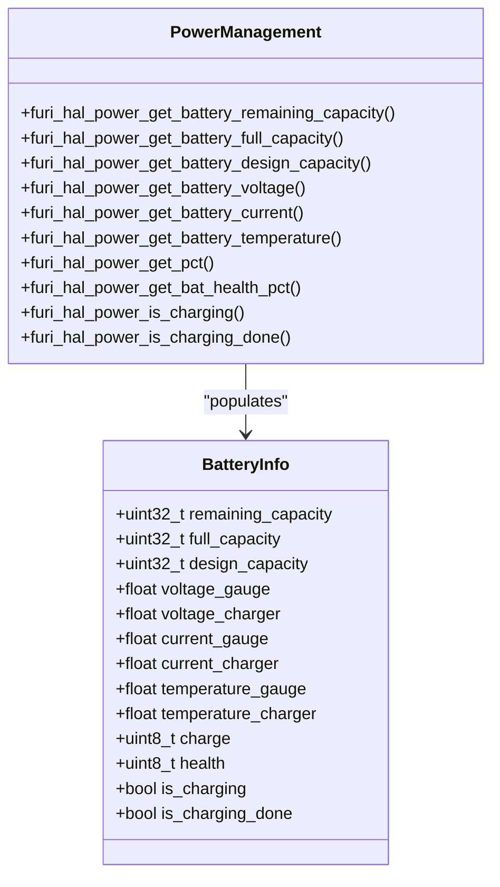
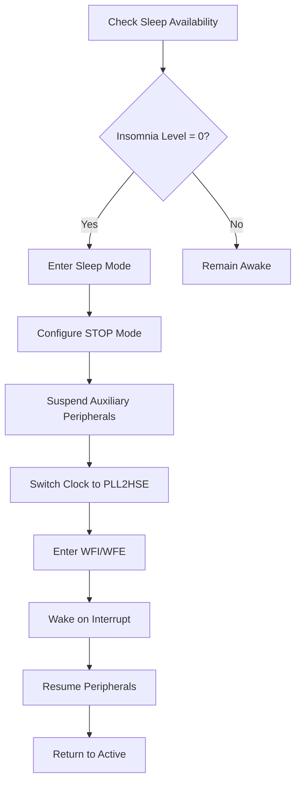
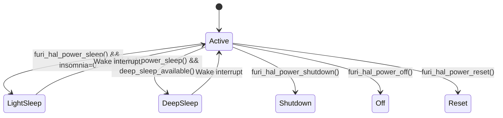
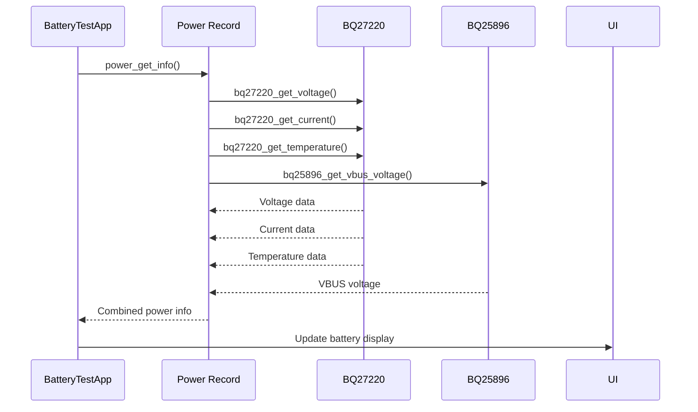
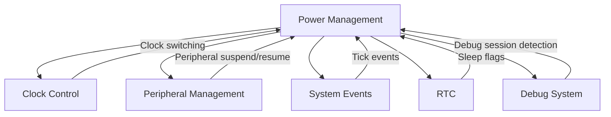

# Power Management

<cite>
**Referenced Files in This Document**   
- [furi_hal_power.h](file://targets/furi_hal_include/furi_hal_power.h)
- [furi_hal_power.c](file://targets/f7/furi_hal/furi_hal_power.c)
- [bq27220.h](file://lib/drivers/bq27220.h)
- [bq27220.c](file://lib/drivers/bq27220.c)
- [bq25896.h](file://lib/drivers/bq25896.h)
- [bq25896.c](file://lib/drivers/bq25896.c)
- [power_settings_app.c](file://applications/settings/power_settings_app/power_settings_app.c)
- [battery_test_app.c](file://applications/debug/battery_test_app/battery_test_app.c)
- [DeepSleep.md](file://documentation/DeepSleep.md)
</cite>

## Table of Contents
1. [Introduction](#introduction)
2. [Power Management Architecture](#power-management-architecture)
3. [Voltage Regulation and Charging](#voltage-regulation-and-charging)
4. [Battery Monitoring and Fuel Gauge](#battery-monitoring-and-fuel-gauge)
5. [Sleep Modes and Power States](#sleep-modes-and-power-states)
6. [Power State Transitions](#power-state-transitions)
7. [API Functions](#api-functions)
8. [Application Integration Examples](#application-integration-examples)
9. [Relationship with Other HAL Modules](#relationship-with-other-hal-modules)
10. [Common Issues and Troubleshooting](#common-issues-and-troubleshooting)
11. [Power Optimization Guidelines](#power-optimization-guidelines)

## Introduction

The power management subsystem of the Hardware Abstraction Layer (HAL) provides comprehensive control over the Flipper Zero device's power system. This subsystem manages battery monitoring, charging operations, voltage regulation, sleep modes, and power state transitions. The implementation is designed to maximize battery life while ensuring reliable operation across various usage scenarios. The power management system integrates tightly with other HAL modules such as clock control, peripheral management, and system events to provide a cohesive power-efficient platform for applications.

**Section sources**
- [furi_hal_power.h](file://targets/furi_hal_include/furi_hal_power.h#L1-L50)
- [furi_hal_power.c](file://targets/f7/furi_hal/furi_hal_power.c#L1-L50)

## Power Management Architecture

The power management architecture consists of multiple layers that abstract the hardware complexity while providing comprehensive control interfaces. At the lowest level, hardware-specific drivers interface with the BQ27220 fuel gauge and BQ25896 charger ICs. Above this, the HAL layer provides a unified API for power management operations, which applications and system services can use without needing to understand the underlying hardware specifics.



**Diagram sources**
- [furi_hal_power.h](file://targets/furi_hal_include/furi_hal_power.h#L1-L227)
- [bq27220.h](file://lib/drivers/bq27220.h#L1-L276)
- [bq25896.h](file://lib/drivers/bq25896.h#L1-L68)

**Section sources**
- [furi_hal_power.h](file://targets/furi_hal_include/furi_hal_power.h#L1-L227)
- [furi_hal_power.c](file://targets/f7/furi_hal/furi_hal_power.c#L1-L100)

## Voltage Regulation and Charging

The voltage regulation and charging system is built around the BQ25896 integrated circuit, which manages the charging process, voltage regulation, and power path control. The implementation provides fine-grained control over charging parameters and supports various charging states.

### Charging Control Implementation

The BQ25896 driver provides functions to control charging operations, including enabling/disabling charging, checking charging status, and managing OTG (On-The-Go) functionality. The driver maintains a register structure that caches the current state of the charger IC, allowing for efficient updates without requiring full register reads.

```c
typedef struct {
    REG00 r00;
    REG01 r01;
    REG02 r02;
    // ... other registers
} bq25896_regs_t;
```

The charging system supports configurable voltage limits for battery charging, with a valid range from 3840mV to 4208mV in 16mV steps. This allows for optimization of charging parameters based on battery health and usage patterns.



**Diagram sources**
- [bq25896.c](file://lib/drivers/bq25896.c#L1-L208)
- [bq25896.h](file://lib/drivers/bq25896.h#L1-L68)

**Section sources**
- [bq25896.c](file://lib/drivers/bq25896.c#L1-L208)
- [bq25896.h](file://lib/drivers/bq25896.h#L1-L68)

## Battery Monitoring and Fuel Gauge

The battery monitoring system is centered around the BQ27220 fuel gauge IC, which provides accurate battery capacity estimation, voltage and current measurement, and temperature monitoring. The implementation includes robust error handling and initialization procedures to ensure reliable operation.

### Fuel Gauge Initialization

The BQ27220 initialization process is comprehensive, ensuring the gauge is properly configured and operational:

1. Verify gauge presence on I2C bus with correct ID (0x0220)
2. Unseal gauge access
3. Check internal statuses and profile
4. Reset gauge if initialization issues detected
5. Update configuration if needed
6. Seal gauge to prevent accidental changes

```c
bool bq27220_init(FuriHalI2cBusHandle* handle, const BQ27220DMData* data_memory) {
    // Implementation details
    size_t retry = 2;
    while(retry > 0) {
        furi_hal_power.gauge_ok =
            bq27220_init(&furi_hal_i2c_handle_power, furi_hal_power_gauge_data_memory);
        if(furi_hal_power.gauge_ok) {
            break;
        } else {
            furi_delay_us(4000000); // Wait for gauge to stabilize
        }
        retry--;
    }
    return furi_hal_power.gauge_ok;
}
```

### Battery Data Retrieval

The system provides multiple functions to retrieve battery parameters:

- **Capacity**: Remaining capacity in mAh and percentage
- **Voltage**: Battery voltage from both charger and fuel gauge
- **Current**: Charging/discharging current
- **Temperature**: Battery temperature
- **Health**: Battery health state as percentage



**Diagram sources**
- [bq27220.c](file://lib/drivers/bq27220.c#L1-L578)
- [bq27220.h](file://lib/drivers/bq27220.h#L1-L276)
- [furi_hal_power.c](file://targets/f7/furi_hal/furi_hal_power.c#L200-L400)

**Section sources**
- [bq27220.c](file://lib/drivers/bq27220.c#L1-L578)
- [bq27220.h](file://lib/drivers/bq27220.h#L1-L276)

## Sleep Modes and Power States

The power management system implements multiple sleep modes to optimize power consumption based on device activity. These modes range from light sleep (retaining full functionality with minimal power reduction) to deep sleep (maximum power savings with limited wake-up capabilities).

### Sleep Mode Configuration

The system supports configurable sleep modes through the `FURI_HAL_POWER_STOP_MODE` define, which can be set to different STM32WBxx power modes:

- **LL_PWR_MODE_STOP2**: Deep sleep mode with lowest power consumption
- **LL_PWR_MODE_STOP0**: Light sleep mode with faster wake-up times

```c
#ifndef FURI_HAL_POWER_STOP_MODE
#define FURI_HAL_POWER_STOP_MODE (LL_PWR_MODE_STOP2)
#endif
```

### Insomnia Management

The system implements an "insomnia" mechanism to prevent the device from entering sleep mode when certain operations are in progress. This uses a reference counting system where each component that needs to prevent sleep can increment the insomnia counter.

```c
typedef struct {
    volatile uint8_t insomnia;
    volatile uint8_t suppress_charge;
    bool gauge_ok;
    bool charger_ok;
} FuriHalPower;

void furi_hal_power_insomnia_enter(void) {
    FURI_CRITICAL_ENTER();
    furi_check(furi_hal_power.insomnia < UINT8_MAX);
    furi_hal_power.insomnia++;
    FURI_CRITICAL_EXIT();
}

void furi_hal_power_insomnia_exit(void) {
    FURI_CRITICAL_ENTER();
    furi_check(furi_hal_power.insomnia > 0);
    furi_hal_power.insomnia--;
    FURI_CRITICAL_EXIT();
}
```



**Diagram sources**
- [furi_hal_power.c](file://targets/f7/furi_hal/furi_hal_power.c#L100-L300)
- [DeepSleep.md](file://documentation/DeepSleep.md#L1-L8)

**Section sources**
- [furi_hal_power.c](file://targets/f7/furi_hal/furi_hal_power.c#L100-L300)
- [DeepSleep.md](file://documentation/DeepSleep.md#L1-L8)

## Power State Transitions

The power state machine manages transitions between different power states, ensuring proper sequencing and resource management during state changes.

### State Transition Logic

The system implements a hierarchical state transition system that considers multiple factors before allowing sleep:

```c
static inline bool furi_hal_power_deep_sleep_available(void) {
    return furi_hal_bt_is_alive() && 
           !furi_hal_rtc_is_flag_set(FuriHalRtcFlagLegacySleep) &&
           !furi_hal_debug_is_gdb_session_active();
}
```

Key factors that prevent deep sleep:
- Bluetooth subsystem activity
- Legacy sleep flag set in RTC
- Active GDB debugging session
- Non-zero insomnia level

### Power State API

The API provides functions for explicit power state control:

- **furi_hal_power_sleep()**: Enter sleep mode
- **furi_hal_power_shutdown()**: Switch MCU to shutdown
- **furi_hal_power_off()**: Power off device
- **furi_hal_power_reset()**: Reset device



**Diagram sources**
- [furi_hal_power.c](file://targets/f7/furi_hal/furi_hal_power.c#L300-L500)
- [furi_hal_power.h](file://targets/furi_hal_include/furi_hal_power.h#L100-L150)

**Section sources**
- [furi_hal_power.c](file://targets/f7/furi_hal/furi_hal_power.c#L300-L500)

## API Functions

The power management API provides a comprehensive set of functions for querying battery status, configuring power modes, and managing power consumption.

### Battery Information Functions

```c
/** Get predicted remaining battery capacity in percents */
uint8_t furi_hal_power_get_pct(void);

/** Get battery health state in percents */
uint8_t furi_hal_power_get_bat_health_pct(void);

/** Get remaining battery capacity in mAh */
uint32_t furi_hal_power_get_battery_remaining_capacity(void);

/** Get full charge battery capacity in mAh */
uint32_t furi_hal_power_get_battery_full_capacity(void);

/** Get battery capacity in mAh from battery profile */
uint32_t furi_hal_power_get_battery_design_capacity(void);

/** Get battery voltage in V */
float furi_hal_power_get_battery_voltage(FuriHalPowerIC ic);

/** Get battery current in A */
float furi_hal_power_get_battery_current(FuriHalPowerIC ic);

/** Get temperature in C */
float furi_hal_power_get_battery_temperature(FuriHalPowerIC ic);
```

### Power Mode Configuration Functions

```c
/** Enter insomnia mode - Prevents device from going to sleep */
void furi_hal_power_insomnia_enter(void);

/** Exit insomnia mode - Allow device to go to sleep */
void furi_hal_power_insomnia_exit(void);

/** Check if sleep available */
bool furi_hal_power_sleep_available(void);

/** Go to sleep */
void furi_hal_power_sleep(void);

/** Set battery charge voltage limit in V */
void furi_hal_power_set_battery_charge_voltage_limit(float voltage);
```

### Charging and OTG Functions

```c
/** Get charging status */
bool furi_hal_power_is_charging(void);

/** Get charge complete status */
bool furi_hal_power_is_charging_done(void);

/** OTG enable */
bool furi_hal_power_enable_otg(void);

/** OTG disable */
void furi_hal_power_disable_otg(void);

/** Check OTG status fault */
bool furi_hal_power_check_otg_fault(void);

/** Get OTG status */
bool furi_hal_power_is_otg_enabled(void);
```

**Section sources**
- [furi_hal_power.h](file://targets/furi_hal_include/furi_hal_power.h#L50-L200)

## Application Integration Examples

Several applications demonstrate how to integrate with the power management system for various use cases.

### Power Settings Application

The power settings application provides a user interface for configuring power-related settings and viewing battery information.

```c
PowerSettingsApp* power_settings_app_alloc(uint32_t first_scene, ViewDispatcherType type) {
    // Open power record
    app->power = furi_record_open(RECORD_POWER);
    
    // Subscribe to power settings events
    app->settings_events = power_get_settings_events_pubsub(app->power);
    
    // Set up tick event for periodic updates
    view_dispatcher_set_tick_event_callback(
        app->view_dispatcher, power_settings_tick_event_callback, 2000);
}
```

Key features:
- Opens the power record for API access
- Subscribes to power settings events
- Uses tick events for periodic battery status updates
- Manages view transitions based on power state

### Battery Test Application

The battery test application demonstrates real-time battery monitoring and display.

```c
static void battery_test_battery_info_update_model(void* context) {
    BatteryTestApp* app = context;
    power_get_info(app->power, &app->info);
    BatteryInfoModel battery_info_data = {
        .vbus_voltage = app->info.voltage_vbus,
        .gauge_voltage = app->info.voltage_gauge,
        .gauge_current = app->info.current_gauge,
        .gauge_temperature = app->info.temperature_gauge,
        .charge = app->info.charge,
        .health = app->info.health,
    };
    battery_info_set_data(app->battery_info, &battery_info_data);
}
```

Implementation details:
- Retrieves comprehensive power information every 500ms
- Disables low battery notifications during testing
- Updates UI with real-time battery parameters
- Provides exit confirmation dialog



**Diagram sources**
- [power_settings_app.c](file://applications/settings/power_settings_app/power_settings_app.c#L1-L148)
- [battery_test_app.c](file://applications/debug/battery_test_app/battery_test_app.c#L1-L103)

**Section sources**
- [power_settings_app.c](file://applications/settings/power_settings_app/power_settings_app.c#L1-L148)
- [battery_test_app.c](file://applications/debug/battery_test_app/battery_test_app.c#L1-L103)

## Relationship with Other HAL Modules

The power management system integrates closely with other HAL modules to provide a cohesive power-efficient platform.

### Clock Control Integration

Power management works with clock control to optimize power consumption:

```c
static inline void furi_hal_power_deep_sleep(void) {
    if(!furi_hal_clock_switch_pll2hse()) {
        return;
    }
    // Enter low power mode
}
```

When entering deep sleep, the system switches to a lower power clock configuration to minimize energy consumption.

### Peripheral Management

The system manages peripheral power states during sleep transitions:

```c
static inline void furi_hal_power_suspend_aux_periphs(void) {
    furi_hal_serial_control_suspend();
}

static inline void furi_hal_power_resume_aux_periphs(void) {
    furi_hal_serial_control_resume();
}
```

Auxiliary peripherals are suspended before deep sleep and resumed upon wake-up.

### System Events

Power management integrates with system events for coordinated power state changes:

```c
// Tick event callback for periodic updates
view_dispatcher_set_tick_event_callback(
    app->view_dispatcher, power_settings_tick_event_callback, 2000);
```

System events trigger periodic battery status updates and allow applications to respond to power state changes.



**Diagram sources**
- [furi_hal_power.c](file://targets/f7/furi_hal/furi_hal_power.c#L1-L744)
- [furi_hal_clock.h](file://targets/furi_hal_include/furi_hal_clock.h)
- [furi_hal_rtc.h](file://targets/furi_hal_include/furi_hal_rtc.h)

**Section sources**
- [furi_hal_power.c](file://targets/f7/furi_hal/furi_hal_power.c#L1-L744)

## Common Issues and Troubleshooting

### Battery Calibration

Battery calibration issues can occur due to gauge initialization problems. The system includes retry logic to handle initialization failures:

```c
size_t retry = 2;
while(retry > 0) {
    furi_hal_power.gauge_ok = bq27220_init(&furi_hal_i2c_handle_power, furi_hal_power_gauge_data_memory);
    if(furi_hal_power.gauge_ok) {
        break;
    } else {
        furi_delay_us(4000000); // Wait for gauge to stabilize
    }
    retry--;
}
```

If calibration fails, ensure the gauge is properly sealed and the correct profile is loaded.

### Power Consumption Optimization

To optimize power consumption:

1. Use insomnia_enter/exit pairs properly to prevent unnecessary wake-ups
2. Minimize tick event frequency in applications
3. Disable unused peripherals
4. Use deep sleep mode when possible
5. Optimize charging voltage limits based on battery health

### Wake-up Sources

Common wake-up sources include:
- User input (buttons)
- Timer interrupts
- External events (USB connection)
- Communication interfaces (Bluetooth, Sub-GHz)

Ensure wake-up sources are properly configured in the RTC and interrupt system.

**Section sources**
- [furi_hal_power.c](file://targets/f7/furi_hal/furi_hal_power.c#L1-L744)
- [bq27220.c](file://lib/drivers/bq27220.c#L1-L578)

## Power Optimization Guidelines

### For Application Developers

1. **Manage Insomnia Properly**: Always pair insomnia_enter with insomnia_exit calls
2. **Optimize Update Frequency**: Use the minimum necessary tick event frequency
3. **Release Resources**: Close records and free memory when not in use
4. **Handle Low Power**: Respond appropriately to low battery conditions
5. **Use Efficient Algorithms**: Minimize CPU usage for better power efficiency

### System-Level Optimization

1. **Configure Sleep Mode**: Select appropriate STOP mode based on wake-up requirements
2. **Optimize Charging Parameters**: Adjust charge voltage limits for battery longevity
3. **Monitor Battery Health**: Track health degradation and adjust usage patterns
4. **Implement Power Profiles**: Create different power profiles for various use cases
5. **Test Thoroughly**: Validate power consumption across different scenarios

By following these guidelines, developers can create power-efficient applications that maximize battery life while maintaining responsive performance.

**Section sources**
- [furi_hal_power.h](file://targets/furi_hal_include/furi_hal_power.h#L1-L227)
- [furi_hal_power.c](file://targets/f7/furi_hal/furi_hal_power.c#L1-L744)