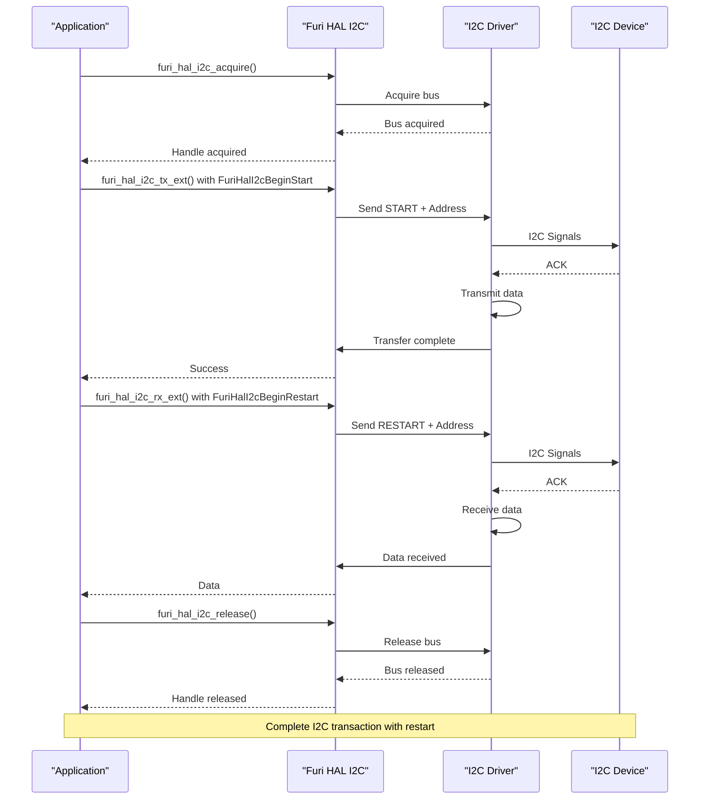
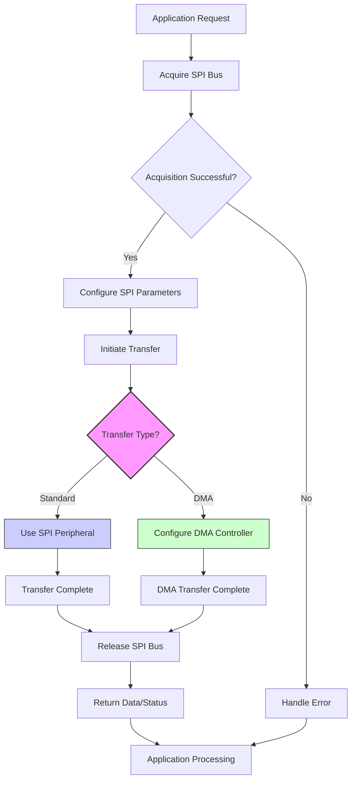
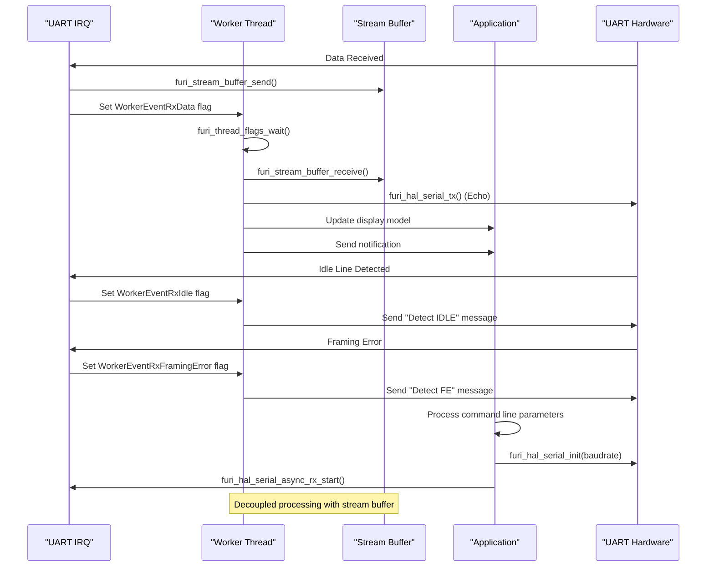
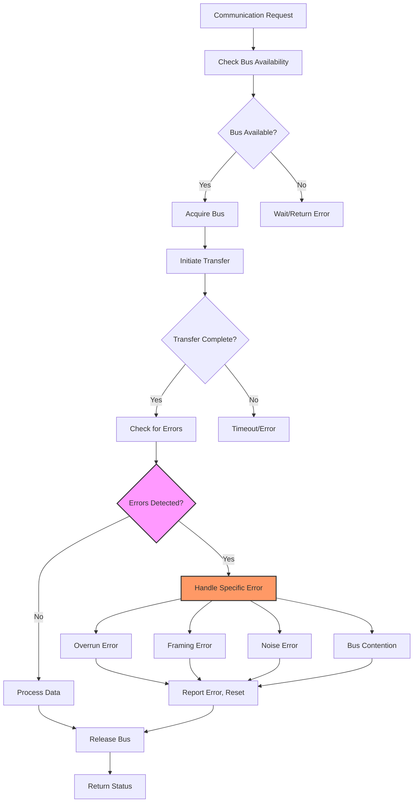
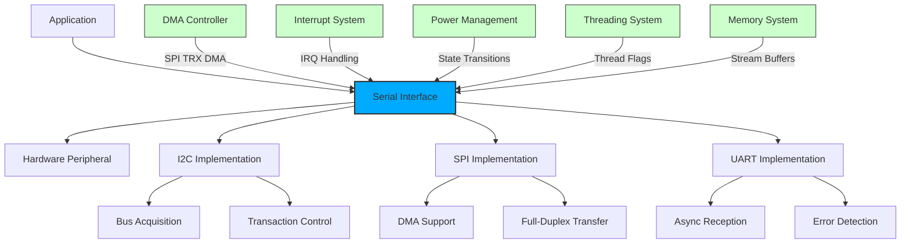

# Serial Communication Interfaces

<cite>
**Referenced Files in This Document**   
- [furi_hal_i2c.h](file://targets/furi_hal_include/furi_hal_i2c.h#L1-L288)
- [furi_hal_spi.h](file://targets/furi_hal_include/furi_hal_spi.h#L1-L129)
- [uart_echo.c](file://applications/debug/uart_echo/uart_echo.c#L1-L340)
</cite>

## Table of Contents
1. [Introduction](#introduction)
2. [I2C Interface Implementation](#i2c-interface-implementation)
3. [SPI Interface Implementation](#spi-interface-implementation)
4. [UART Interface Implementation](#uart-interface-implementation)
5. [API Function Summary](#api-function-summary)
6. [Error Handling Mechanisms](#error-handling-mechanisms)
7. [Integration with System Components](#integration-with-system-components)
8. [Best Practices and Use Case Guidance](#best-practices-and-use-case-guidance)

## Introduction
This document provides a comprehensive analysis of the serial communication interfaces (I2C, SPI, and UART) implemented in the Hardware Abstraction Layer (HAL) of the Flipper Zero firmware. The analysis is based on direct examination of the source code files that define these interfaces. Each protocol is implemented with a focus on reliability, efficiency, and ease of integration with external peripherals. The document details the initialization sequences, data transfer mechanisms, configuration options, and error handling strategies for each interface. Special attention is given to the relationship between these serial interfaces and system components such as DMA, interrupts, and power management, as evidenced by the implementation patterns in the codebase.

**Section sources**
- [furi_hal_i2c.h](file://targets/furi_hal_include/furi_hal_i2c.h#L1-L288)
- [furi_hal_spi.h](file://targets/furi_hal_include/furi_hal_spi.h#L1-L129)
- [uart_echo.c](file://applications/debug/uart_echo/uart_echo.c#L1-L340)

## I2C Interface Implementation
The I2C (Inter-Integrated Circuit) interface in the Flipper Zero firmware is designed to provide reliable communication with I2C slave devices. The implementation is defined in the `furi_hal_i2c.h` header file and provides a comprehensive API for both simple and complex I2C transactions.

### Initialization and Bus Management
The I2C subsystem follows a three-stage initialization process:
1. `furi_hal_i2c_init_early()` - Early initialization for critical system components
2. `furi_hal_i2c_deinit_early()` - Early deinitialization for system shutdown
3. `furi_hal_i2c_init()` - Full initialization of the I2C interface

Bus access is managed through a handle-based system that ensures exclusive access to the I2C bus:
- `furi_hal_i2c_acquire()` - Acquires the I2C bus handle for exclusive use
- `furi_hal_i2c_release()` - Releases the acquired bus handle

This acquisition mechanism prevents bus contention and ensures that only one component can communicate on the I2C bus at a time, which is critical for maintaining signal integrity in a multi-threaded environment.

### Data Transfer Mechanisms
The I2C implementation provides multiple functions for different types of data transfers:

#### Basic Transfer Functions
```c
bool furi_hal_i2c_tx(FuriHalI2cBusHandle* handle, uint8_t address, const uint8_t* data, size_t size, uint32_t timeout);
bool furi_hal_i2c_rx(FuriHalI2cBusHandle* handle, uint8_t address, uint8_t* data, size_t size, uint32_t timeout);
```

These functions handle simple transmit (TX) and receive (RX) operations with standard START and STOP conditions.

#### Advanced Transfer Functions
The extended functions provide greater control over transaction sequencing:
```c
bool furi_hal_i2c_tx_ext(FuriHalI2cBusHandle* handle, uint16_t address, bool ten_bit, const uint8_t* data, size_t size, FuriHalI2cBegin begin, FuriHalI2cEnd end, uint32_t timeout);
bool furi_hal_i2c_rx_ext(FuriHalI2cBusHandle* handle, uint16_t address, bool ten_bit, uint8_t* data, size_t size, FuriHalI2cBegin begin, FuriHalI2cEnd end, uint32_t timeout);
```

These functions support 10-bit addressing and allow precise control over transaction boundaries through the `FuriHalI2cBegin` and `FuriHalI2cEnd` enumeration parameters.

### Transaction Control
The I2C implementation provides fine-grained control over transaction sequencing through two enumeration types:

**Transaction Beginning Signals:**
- `FuriHalI2cBeginStart` - Begin with START condition
- `FuriHalI2cBeginRestart` - Begin with RESTART condition (must follow transaction with `FuriHalI2cEndAwaitRestart`)
- `FuriHalI2cBeginResume` - Continue previous transaction (must follow transaction with `FuriHalI2cEndPause`)

**Transaction Ending Signals:**
- `FuriHalI2cEndStop` - End with STOP condition
- `FuriHalI2cEndAwaitRestart` - End with clock stretching, awaiting restart
- `FuriHalI2cEndPause` - Pause transaction with clock stretching

This sophisticated control mechanism enables complex I2C protocols that require multiple sequential operations without releasing the bus.

### Combined Read-Write Operations
The interface provides a combined transfer function for register read operations:
```c
bool furi_hal_i2c_trx(FuriHalI2cBusHandle* handle, uint8_t address, const uint8_t* tx_data, size_t tx_size, uint8_t* rx_data, size_t rx_size, uint32_t timeout);
```

This function performs a transmit operation followed by a receive operation in a single transaction, which is commonly used for reading from device registers.

### Device Management Functions
The API includes utility functions for device management:
- `furi_hal_i2c_is_device_ready()` - Checks if an I2C device is present and ready
- `furi_hal_i2c_read_reg_8()` - Reads an 8-bit register from a device
- `furi_hal_i2c_read_reg_16()` - Reads a 16-bit register from a device

These functions simplify common I2C operations and reduce the potential for errors in device communication code.



**Diagram sources**
- [furi_hal_i2c.h](file://targets/furi_hal_include/furi_hal_i2c.h#L1-L288)

**Section sources**
- [furi_hal_i2c.h](file://targets/furi_hal_include/furi_hal_i2c.h#L1-L288)

## SPI Interface Implementation
The SPI (Serial Peripheral Interface) implementation in the Flipper Zero firmware provides high-speed communication with SPI slave devices. The interface is defined in the `furi_hal_spi.h` header file and offers both standard and DMA-enhanced transfer capabilities.

### Initialization and Configuration
The SPI subsystem follows a structured initialization process:
- `furi_hal_spi_config_init_early()` - Early configuration initialization
- `furi_hal_spi_config_deinit_early()` - Early configuration deinitialization
- `furi_hal_spi_config_init()` - Full configuration initialization
- `furi_hal_spi_dma_init()` - DMA subsystem initialization

Bus management is handled through dedicated structures:
- `FuriHalSpiBus` - Represents an SPI bus
- `FuriHalSpiBusHandle` - Represents a handle to an SPI bus

Initialization and deinitialization functions:
- `furi_hal_spi_bus_init()` - Initialize an SPI bus
- `furi_hal_spi_bus_deinit()` - Deinitialize an SPI bus
- `furi_hal_spi_bus_handle_init()` - Initialize an SPI bus handle
- `furi_hal_spi_bus_handle_deinit()` - Deinitialize an SPI bus handle

### Bus Access Control
The SPI interface uses an acquisition model similar to I2C:
- `furi_hal_spi_acquire()` - Acquire the SPI bus (blocking call)
- `furi_hal_spi_release()` - Release the acquired SPI bus

The acquisition functions include warnings about programming errors, indicating that improper usage will result in system crashes (`furi_crash`). This strict error handling ensures that SPI bus conflicts are caught during development rather than causing intermittent issues in production.

### Data Transfer Functions
The SPI implementation provides several functions for data transfer:

#### Standard Transfer Functions
```c
bool furi_hal_spi_bus_rx(FuriHalSpiBusHandle* handle, uint8_t* buffer, size_t size, uint32_t timeout);
bool furi_hal_spi_bus_tx(FuriHalSpiBusHandle* handle, const uint8_t* buffer, size_t size, uint32_t timeout);
bool furi_hal_spi_bus_trx(FuriHalSpiBusHandle* handle, const uint8_t* tx_buffer, uint8_t* rx_buffer, size_t size, uint32_t timeout);
```

These functions handle receive-only, transmit-only, and simultaneous transmit-receive operations respectively. The `trx` function is particularly useful for full-duplex communication with devices that respond immediately to transmitted data.

#### DMA-Enhanced Transfer Function
```c
bool furi_hal_spi_bus_trx_dma(FuriHalSpiBusHandle* handle, uint8_t* tx_buffer, uint8_t* rx_buffer, size_t size, uint32_t timeout_ms);
```

This function leverages DMA (Direct Memory Access) for high-performance data transfers, reducing CPU overhead and enabling efficient handling of large data blocks. DMA transfers are essential for applications requiring high data throughput, such as display controllers or high-speed sensors.

### Performance Characteristics
The SPI implementation is optimized for performance with the following characteristics:
- Blocking acquisition model ensures exclusive bus access
- DMA support enables high-speed data transfers with minimal CPU intervention
- Timeout parameters prevent indefinite blocking on failed transfers
- Direct hardware register access for maximum throughput

The use of DMA is particularly important for maintaining system responsiveness during large data transfers, as it allows the CPU to perform other tasks while data is being transferred in the background.



**Diagram sources**
- [furi_hal_spi.h](file://targets/furi_hal_include/furi_hal_spi.h#L1-L129)

**Section sources**
- [furi_hal_spi.h](file://targets/furi_hal_include/furi_hal_spi.h#L1-L129)

## UART Interface Implementation
The UART (Universal Asynchronous Receiver-Transmitter) interface implementation is demonstrated through the `uart_echo.c` application, which serves as both a functional example and a comprehensive reference for UART usage in the Flipper Zero firmware.

### Architecture and Design
The UART implementation follows an event-driven, interrupt-based architecture that efficiently handles asynchronous data reception and transmission. The design separates the UART worker thread from the main application logic, ensuring responsive performance even under heavy data loads.

### Core Components
The UART system consists of several key components:

**Data Structures:**
- `UartEchoApp` - Main application structure containing all UART-related components
- `UartDumpModel` - Model for the display view, managing received data
- `ListElement` - Individual line element in the display buffer

**Event System:**
The implementation uses a flag-based event system to communicate between the interrupt service routine and the worker thread:
```c
typedef enum {
    WorkerEventReserved = (1 << 0),
    WorkerEventStop = (1 << 1),
    WorkerEventRxData = (1 << 2),
    WorkerEventRxIdle = (1 << 3),
    WorkerEventRxOverrunError = (1 << 4),
    WorkerEventRxFramingError = (1 << 5),
    WorkerEventRxNoiseError = (1 << 6),
} WorkerEventFlags;
```

### Initialization Sequence
The UART initialization process follows these steps:
1. Allocate application structure and stream buffer
2. Open GUI and notification records
3. Initialize view dispatcher and allocate view
4. Configure view callbacks and allocate model
5. Start worker thread
6. Acquire serial control handle
7. Initialize UART with specified baud rate
8. Start asynchronous reception with interrupt callback

Key initialization functions:
- `furi_stream_buffer_alloc()` - Creates a stream buffer for received data
- `furi_hal_serial_control_acquire()` - Acquires control of the USART peripheral
- `furi_hal_serial_init()` - Configures UART parameters (baud rate, etc.)
- `furi_hal_serial_async_rx_start()` - Begins asynchronous reception with callback

### Data Reception and Processing
Data reception is handled through an interrupt-driven model:

**Interrupt Callback:**
```c
static void uart_echo_on_irq_cb(FuriHalSerialHandle* handle, FuriHalSerialRxEvent event, void* context)
```

This callback is invoked whenever UART events occur. It processes different event types:
- Data reception: Reads data and sends it to the stream buffer
- Idle detection: Indicates end of transmission
- Error conditions: Overrun, framing, and noise errors

The callback uses `furi_stream_buffer_send()` to transfer received data to a stream buffer, which decouples the high-speed interrupt processing from the slower data processing in the worker thread.

### Worker Thread Processing
The worker thread (`uart_echo_worker`) processes events using `furi_thread_flags_wait()`:
```c
uint32_t events = furi_thread_flags_wait(WORKER_EVENTS_MASK, FuriFlagWaitAny, FuriWaitForever);
```

When data is available, it:
1. Receives data from the stream buffer in chunks
2. Echoes data back through `furi_hal_serial_tx()`
3. Updates the display model with received characters
4. Sends notification pulses for visual feedback

### Error Handling
The implementation includes comprehensive error handling for common UART issues:
- **Overrun Error (ORE)**: Occurs when data is not read fast enough
- **Framing Error (FE)**: Indicates incorrect start/stop bit timing
- **Noise Error (NE)**: Suggests signal integrity issues

When errors occur, the system sends diagnostic messages back through the UART interface, aiding in troubleshooting communication problems.

### Configuration and Flexibility
The UART application supports configurable baud rates:
- Default baud rate: 230400 bps
- Command-line parameter support for custom baud rates
- Input validation with fallback to default on invalid input

This flexibility allows the application to work with various external devices that may use different communication speeds.



**Diagram sources**
- [uart_echo.c](file://applications/debug/uart_echo/uart_echo.c#L1-L340)

**Section sources**
- [uart_echo.c](file://applications/debug/uart_echo/uart_echo.c#L1-L340)

## API Function Summary
This section provides a comprehensive summary of the API functions available for each serial communication interface.

### I2C API Functions
| Function | Purpose | Parameters | Return Value |
|--------|--------|-----------|-------------|
| `furi_hal_i2c_init_early()` | Early initialization of I2C subsystem | None | None |
| `furi_hal_i2c_deinit_early()` | Early deinitialization of I2C subsystem | None | None |
| `furi_hal_i2c_init()` | Initialize I2C interface | None | None |
| `furi_hal_i2c_acquire()` | Acquire I2C bus handle | `FuriHalI2cBusHandle*` | None |
| `furi_hal_i2c_release()` | Release I2C bus handle | `FuriHalI2cBusHandle*` | None |
| `furi_hal_i2c_tx()` | Transmit data to I2C device | Handle, address, data, size, timeout | Success boolean |
| `furi_hal_i2c_rx()` | Receive data from I2C device | Handle, address, buffer, size, timeout | Success boolean |
| `furi_hal_i2c_trx()` | Combined transmit and receive | Handle, address, tx/rx data, sizes, timeout | Success boolean |
| `furi_hal_i2c_is_device_ready()` | Check if device is ready | Handle, address, timeout | Ready boolean |
| `furi_hal_i2c_read_reg_8()` | Read 8-bit register | Handle, address, reg, data, timeout | Success boolean |

### SPI API Functions
| Function | Purpose | Parameters | Return Value |
|--------|--------|-----------|-------------|
| `furi_hal_spi_config_init_early()` | Early SPI configuration init | None | None |
| `furi_hal_spi_config_deinit_early()` | Early SPI configuration deinit | None | None |
| `furi_hal_spi_config_init()` | Initialize SPI configuration | None | None |
| `furi_hal_spi_dma_init()` | Initialize SPI DMA subsystem | None | None |
| `furi_hal_spi_bus_init()` | Initialize SPI bus | `FuriHalSpiBus*` | None |
| `furi_hal_spi_bus_deinit()` | Deinitialize SPI bus | `FuriHalSpiBus*` | None |
| `furi_hal_spi_bus_handle_init()` | Initialize SPI bus handle | `FuriHalSpiBusHandle*` | None |
| `furi_hal_spi_bus_handle_deinit()` | Deinitialize SPI bus handle | `FuriHalSpiBusHandle*` | None |
| `furi_hal_spi_acquire()` | Acquire SPI bus | `FuriHalSpiBusHandle*` | None |
| `furi_hal_spi_release()` | Release SPI bus | `FuriHalSpiBusHandle*` | None |
| `furi_hal_spi_bus_rx()` | Receive data via SPI | Handle, buffer, size, timeout | Success boolean |
| `furi_hal_spi_bus_tx()` | Transmit data via SPI | Handle, buffer, size, timeout | Success boolean |
| `furi_hal_spi_bus_trx()` | Simultaneous SPI transfer | Handle, tx/rx buffers, size, timeout | Success boolean |
| `furi_hal_spi_bus_trx_dma()` | DMA-enhanced SPI transfer | Handle, tx/rx buffers, size, timeout | Success boolean |

### UART Utility Functions
Based on the uart_echo.c implementation:
| Function | Purpose | Parameters | Return Value |
|--------|--------|-----------|-------------|
| `furi_hal_serial_control_acquire()` | Acquire USART control | `FuriHalSerialId` | Serial handle |
| `furi_hal_serial_init()` | Initialize UART | Handle, baud rate | None |
| `furi_hal_serial_async_rx_start()` | Start async reception | Handle, callback, context, enable | None |
| `furi_hal_serial_async_rx_stop()` | Stop async reception | Handle | None |
| `furi_hal_serial_deinit()` | Deinitialize UART | Handle | None |
| `furi_hal_serial_control_release()` | Release USART control | Handle | None |
| `furi_hal_serial_tx()` | Transmit data | Handle, data, size | None |
| `furi_hal_serial_async_rx()` | Read received data | Handle | Data byte |

**Section sources**
- [furi_hal_i2c.h](file://targets/furi_hal_include/furi_hal_i2c.h#L1-L288)
- [furi_hal_spi.h](file://targets/furi_hal_include/furi_hal_spi.h#L1-L129)
- [uart_echo.c](file://applications/debug/uart_echo/uart_echo.c#L1-L340)

## Error Handling Mechanisms
The serial communication interfaces implement comprehensive error handling strategies to ensure reliable operation and facilitate debugging.

### I2C Error Handling
The I2C implementation uses a boolean return value pattern for error reporting:
- All I2C functions return `true` on success and `false` on failure
- Errors can include bus contention, device unresponsiveness, or communication timeouts
- The `furi_hal_i2c_is_device_ready()` function specifically checks for device presence and readiness

The transaction control system with `FuriHalI2cBegin` and `FuriHalI2cEnd` enumerations helps prevent protocol errors by enforcing correct transaction sequencing.

### SPI Error Handling
The SPI implementation employs a more aggressive error handling approach:
- The `furi_crash()` function is called on programming errors in acquisition functions
- This design choice prioritizes system stability by failing fast when incorrect usage is detected
- All transfer functions return a boolean success indicator
- Timeout parameters prevent indefinite blocking on failed transfers

The use of `furi_crash()` for programming errors ensures that interface misuse is immediately apparent during development, preventing subtle bugs from reaching production.

### UART Error Handling
The UART implementation features a sophisticated error detection and reporting system:
- **Event-based error detection**: Different error types are reported through specific event flags
- **Real-time error reporting**: Errors are immediately communicated back to the sender
- **Comprehensive error coverage**: The system detects and reports:
  - Overrun errors (data received faster than processed)
  - Framing errors (incorrect start/stop bit timing)
  - Noise errors (signal integrity issues)

The error handling code in `uart_echo.c` demonstrates best practices:
```c
if(events & WorkerEventRxOverrunError) {
    furi_hal_serial_tx(app->serial_handle, (uint8_t*)"\r\nDetect ORE\r\n", 14);
}
if(events & WorkerEventRxFramingError) {
    furi_hal_serial_tx(app->serial_handle, (uint8_t*)"\r\nDetect FE\r\n", 13);
}
if(events & WorkerEventRxNoiseError) {
    furi_hal_serial_tx(app->serial_handle, (uint8_t*)"\r\nDetect NE\r\n", 13);
}
```

This approach not only detects errors but also provides immediate feedback to the user or connected device, greatly simplifying troubleshooting.

### Common Error Handling Patterns
Across all interfaces, several consistent error handling patterns emerge:
- **Boolean return values**: Most functions return success/failure status
- **Timeout parameters**: All transfer functions include timeout options to prevent indefinite blocking
- **Resource cleanup**: Proper deinitialization functions are provided for all interfaces
- **Acquisition/release patterns**: Bus access is controlled through explicit acquire/release calls

These patterns ensure that errors are handled consistently across the different serial interfaces, making the API easier to learn and use correctly.



**Diagram sources**
- [furi_hal_i2c.h](file://targets/furi_hal_include/furi_hal_i2c.h#L1-L288)
- [furi_hal_spi.h](file://targets/furi_hal_include/furi_hal_spi.h#L1-L129)
- [uart_echo.c](file://applications/debug/uart_echo/uart_echo.c#L1-L340)

**Section sources**
- [furi_hal_i2c.h](file://targets/furi_hal_include/furi_hal_i2c.h#L1-L288)
- [furi_hal_spi.h](file://targets/furi_hal_include/furi_hal_spi.h#L1-L129)
- [uart_echo.c](file://applications/debug/uart_echo/uart_echo.c#L1-L340)

## Integration with System Components
The serial communication interfaces are deeply integrated with various system components to provide a cohesive and efficient platform.

### Integration with DMA
The SPI interface demonstrates integration with DMA through the `furi_hal_spi_bus_trx_dma()` function:
- Enables high-speed data transfers with minimal CPU involvement
- Reduces power consumption by allowing the CPU to enter low-power states during transfers
- Improves system responsiveness by freeing the CPU for other tasks

DMA integration is particularly important for applications requiring sustained high data rates, such as display updates or audio streaming.

### Integration with Interrupts
All serial interfaces leverage interrupt-driven architectures:
- **I2C**: Uses hardware I2C interrupts for transaction completion
- **SPI**: Uses SPI peripheral interrupts for transfer completion
- **UART**: Uses UART interrupts for byte reception (demonstrated in `uart_echo_on_irq_cb`)

The interrupt handling pattern follows a consistent design:
1. Hardware interrupt occurs
2. Minimal processing in interrupt context
3. Event flag set to notify higher-level thread
4. Main processing occurs in thread context

This design minimizes interrupt latency while allowing complex processing to occur in a safer context.

### Integration with Power Management
The serial interfaces include power management considerations:
- Early initialization/deinitialization functions suggest integration with power state transitions
- Acquisition/release patterns allow interfaces to be powered down when not in use
- Timeout parameters prevent devices from being left in active states indefinitely

The UART example shows explicit resource management:
```c
furi_hal_serial_async_rx_stop()
furi_hal_serial_deinit()
furi_hal_serial_control_release()
```

These functions ensure that UART resources are properly released, which is critical for power efficiency in battery-operated devices.

### Integration with Threading Model
The interfaces are designed for use in a multi-threaded environment:
- **I2C and SPI**: Use acquisition patterns to prevent concurrent access
- **UART**: Uses a dedicated worker thread for data processing
- **Stream buffers**: Used to safely transfer data between interrupt and thread contexts

The `furi_thread_flags_wait()` function in the UART example demonstrates coordination between interrupt and thread contexts, ensuring efficient and safe communication.

### Integration with Memory Management
The interfaces use appropriate memory management patterns:
- **Stream buffers**: Used for UART data to handle variable-length asynchronous input
- **Static allocation**: Bus handles and other critical structures appear to be statically allocated
- **Proper cleanup**: All interfaces provide deinitialization functions to release resources

The UART example uses `furi_stream_buffer_alloc(2048, 1)` to create a 2KB buffer for received data, balancing memory usage with the need to handle bursty communication patterns.



**Diagram sources**
- [furi_hal_i2c.h](file://targets/furi_hal_include/furi_hal_i2c.h#L1-L288)
- [furi_hal_spi.h](file://targets/furi_hal_include/furi_hal_spi.h#L1-L129)
- [uart_echo.c](file://applications/debug/uart_echo/uart_echo.c#L1-L340)

**Section sources**
- [furi_hal_i2c.h](file://targets/furi_hal_include/furi_hal_i2c.h#L1-L288)
- [furi_hal_spi.h](file://targets/furi_hal_include/furi_hal_spi.h#L1-L129)
- [uart_echo.c](file://applications/debug/uart_echo/uart_echo.c#L1-L340)

## Best Practices and Use Case Guidance
This section provides practical guidance for selecting and using the appropriate serial interface for different use cases.

### Interface Selection Guidelines
| Use Case | Recommended Interface | Rationale |
|--------|---------------------|---------|
| Connecting to sensors and EEPROMs | I2C | Multiple devices on shared bus, moderate speed requirements |
| High-speed data transfer (displays, audio) | SPI | Highest data rates, full-duplex capability |
| Debugging and PC communication | UART | Simple point-to-point connection, widely supported |
| Connecting to legacy peripherals | UART | Backward compatibility with older devices |
| Multi-device communication with complex addressing | I2C | 7-bit or 10-bit addressing, multiple slaves |
| Time-critical applications | SPI | Deterministic timing, no arbitration overhead |

### Performance Considerations
**I2C:**
- Maximum speed typically 400 kbps (Fast Mode) or 1 Mbps (Fast Mode Plus)
- Bus capacitance limits communication distance and speed
- Pull-up resistor selection critical for signal integrity
- Multi-master arbitration adds complexity

**SPI:**
- Speed limited primarily by clock frequency and device capabilities
- No addressing overhead, enabling higher effective throughput
- DMA support enables sustained high-speed transfers
- Full-duplex capability doubles effective bandwidth

**UART:**
- Speed limited by baud rate and cable quality
- Asynchronous nature requires precise timing
- Susceptible to noise and signal degradation
- Software flow control can impact effective throughput

### Common Issues and Solutions
**Bus Contention:**
- **Issue**: Multiple masters attempting to control the bus simultaneously
- **Solution**: Use acquisition patterns (I2C/SPI) or dedicated communication channels (UART)

**Signal Integrity:**
- **Issue**: Noise, crosstalk, or signal degradation
- **Solution**: 
  - Use appropriate pull-up resistors for I2C
  - Keep traces short and matched for high-speed SPI
  - Use shielded cables for UART connections
  - Implement proper grounding

**Timing Constraints:**
- **Issue**: Missed data or protocol errors
- **Solution**:
  - Use interrupts or DMA for high-speed interfaces
  - Implement adequate buffering
  - Ensure timely processing of received data
  - Use timeouts to handle unresponsive devices

### Implementation Best Practices
1. **Always acquire and release bus handles** to prevent conflicts
2. **Use appropriate timeouts** to handle unresponsive devices
3. **Implement proper error handling** for all communication operations
4. **Minimize time in interrupt context** by deferring processing to threads
5. **Use stream buffers** for asynchronous data reception
6. **Validate return values** from all communication functions
7. **Clean up resources** in all execution paths, including error conditions

### Example: Implementing a Sensor Interface
For a temperature sensor connected via I2C:
```c
// Acquire the I2C bus
FuriHalI2cBusHandle handle;
furi_hal_i2c_acquire(&handle);

// Read temperature register
uint8_t temp;
bool success = furi_hal_i2c_read_reg_8(&handle, SENSOR_ADDR, TEMP_REG, &temp, 100);

// Release the bus
furi_hal_i2c_release(&handle);

if(success) {
    // Process temperature data
    float temperature = convert_temp(temp);
} else {
    // Handle communication error
    FURI_LOG_E("SENSOR", "Failed to read temperature");
}
```

### Example: High-Speed Data Transfer
For transferring image data via SPI with DMA:
```c
// Acquire SPI bus
furi_hal_spi_acquire(&spi_handle);

// Perform DMA transfer
bool success = furi_hal_spi_bus_trx_dma(
    &spi_handle,
    tx_buffer,
    rx_buffer,
    data_size,
    1000
);

// Release SPI bus
furi_hal_spi_release(&spi_handle);

if(!success) {
    // Fallback to standard transfer if DMA fails
    success = furi_hal_spi_bus_trx(&spi_handle, tx_buffer, rx_buffer, data_size, 1000);
}
```

These guidelines and examples demonstrate how to effectively use the serial communication interfaces while avoiding common pitfalls and maximizing performance.

**Section sources**
- [furi_hal_i2c.h](file://targets/furi_hal_include/furi_hal_i2c.h#L1-L288)
- [furi_hal_spi.h](file://targets/furi_hal_include/furi_hal_spi.h#L1-L129)
- [uart_echo.c](file://applications/debug/uart_echo/uart_echo.c#L1-L340)