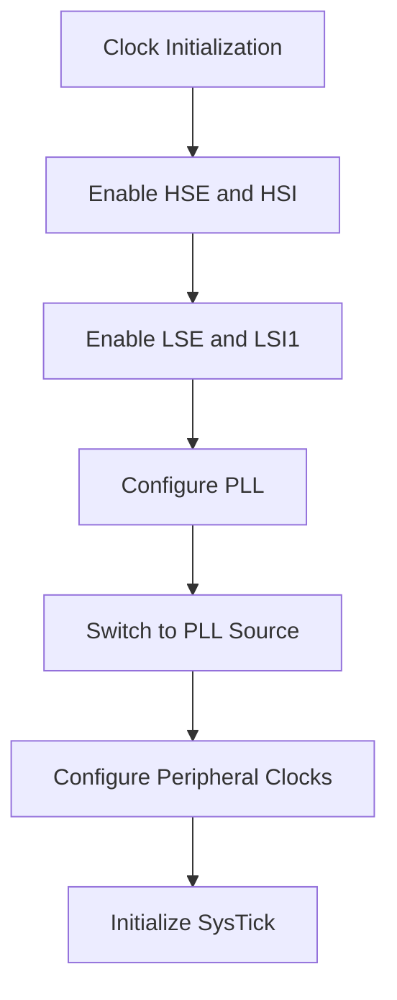
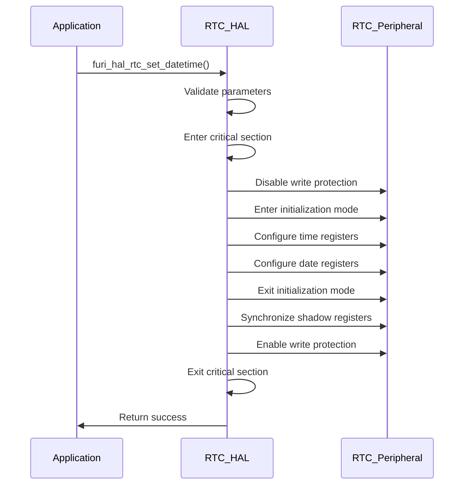
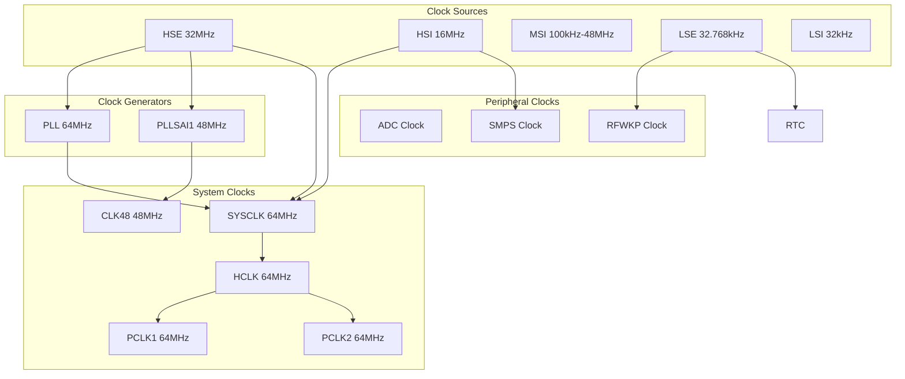

# Timing and Clock System

<cite>
**Referenced Files in This Document**   
- [furi_hal_clock.h](file://targets/f7/furi_hal/furi_hal_clock.h)
- [furi_hal_clock.c](file://targets/f7/furi_hal/furi_hal_clock.c)
- [furi_hal_rtc.h](file://targets/f7/furi_hal/furi_hal_rtc.h)
- [furi_hal_rtc.c](file://targets/f7/furi_hal/furi_hal_rtc.c)
- [stm32wbxx_hal_cortex.c](file://lib/stm32wb_hal/Src/stm32wbxx_hal_cortex.c)
- [stm32wbxx_hal.c](file://lib/stm32wb_hal/Src/stm32wbxx_hal.c)
</cite>

## Table of Contents
1. [Introduction](#introduction)
2. [Clock Configuration System](#clock-configuration-system)
3. [Real-Time Clock (RTC) Subsystem](#real-time-clock-rtc-subsystem)
4. [Timer and Delay Mechanisms](#timer-and-delay-mechanisms)
5. [Clock Tree Architecture](#clock-tree-architecture)
6. [Power Management Integration](#power-management-integration)
7. [Common Timing Issues and Solutions](#common-timing-issues-and-solutions)
8. [Best Practices for Timing Applications](#best-practices-for-timing-applications)

## Introduction
The Timing and Clock System in the Flipper Zero firmware provides comprehensive time management capabilities through a Hardware Abstraction Layer (HAL) that interfaces with the STM32WB microcontroller's clock and timing peripherals. The system consists of three main components: the clock configuration subsystem for managing CPU and peripheral clock frequencies, the real-time clock (RTC) for maintaining calendar time across power cycles, and timer mechanisms for implementing delays and periodic operations. This documentation provides a detailed analysis of these components, their APIs, implementation details, and integration with other system modules.

**Section sources**
- [furi_hal_clock.h](file://targets/f7/furi_hal/furi_hal_clock.h)
- [furi_hal_rtc.h](file://targets/f7/furi_hal/furi_hal_rtc.h)

## Clock Configuration System

The clock configuration system provides APIs for initializing, switching, and managing the microcontroller's clock sources and frequencies. The implementation is based on the STM32WB's Reset and Clock Control (RCC) peripheral, with abstraction provided through the `furi_hal_clock` module.

### Clock Initialization and Configuration
The clock system supports multiple clock sources including High-Speed External (HSE), High-Speed Internal (HSI), Phase-Locked Loop (PLL), and Multi-Speed Internal (MSI) oscillators. The initialization process configures these sources and establishes the clock tree for the system.

```c
void furi_hal_clock_init(void) {
    /* HSE and HSI configuration and activation */
    LL_RCC_HSE_SetCapacitorTuning(0x26);
    LL_RCC_HSE_Enable();
    LL_RCC_HSI_Enable();
    while(!HS_CLOCK_IS_READY())
        ;
    
    /* LSE and LSI1 configuration and activation */
    LL_PWR_EnableBkUpAccess();
    LL_RCC_LSE_SetDriveCapability(LL_RCC_LSEDRIVE_HIGH);
    LL_RCC_LSE_Enable();
    LL_RCC_LSI1_Enable();
    while(!LS_CLOCK_IS_READY())
        ;
    
    /* Main PLL configuration and activation */
    LL_RCC_PLL_ConfigDomain_SYS(LL_RCC_PLLSOURCE_HSE, LL_RCC_PLLM_DIV_2, 8, LL_RCC_PLLR_DIV_2);
    LL_RCC_PLL_Enable();
    LL_RCC_PLL_EnableDomain_SYS();
    while(LL_RCC_PLL_IsReady() != 1)
        ;
    
    /* Sysclk activation on the main PLL */
    LL_RCC_SetSysClkSource(LL_RCC_SYS_CLKSOURCE_PLL);
    while(LL_RCC_GetSysClkSource() != LL_RCC_SYS_CLKSOURCE_STATUS_PLL)
        ;
}
```

The initialization process follows a specific sequence:
1. Configure and enable HSE and HSI oscillators
2. Configure and enable LSE and LSI1 for low-speed peripherals
3. Configure and enable the main PLL for maximum performance
4. Switch the system clock source to PLL
5. Configure peripheral clock prescalers and flash latency

**Section sources**
- [furi_hal_clock.c](file://targets/f7/furi_hal/furi_hal_clock.c#L83-L150)

### Clock Switching Functions
The system provides APIs for dynamic clock switching, allowing the device to transition between different clock sources based on power and performance requirements.



**Diagram sources**
- [furi_hal_clock.c](file://targets/f7/furi_hal/furi_hal_clock.c#L83-L150)

The clock switching API includes:

- `furi_hal_clock_switch_hse2hsi()`: Switch from HSE to HSI
- `furi_hal_clock_switch_hsi2hse()`: Switch from HSI to HSE  
- `furi_hal_clock_switch_hse2pll()`: Switch from HSE to PLL
- `furi_hal_clock_switch_pll2hse()`: Switch from PLL to HSE

These functions handle the complete transition process, including updating the CMSIS system clock variable and reconfiguring the SysTick timer to maintain consistent timing.

```c
bool furi_hal_clock_switch_hse2pll(void) {
    furi_check(LL_RCC_GetSysClkSource() == LL_RCC_SYS_CLKSOURCE_STATUS_HSE);
    
    LL_RCC_PLL_Enable();
    LL_RCC_PLLSAI1_Enable();
    
    while(!LL_RCC_PLL_IsReady())
        ;
    while(!LL_RCC_PLLSAI1_IsReady())
        ;
    
    SHCI_C2_SetSystemClock(SET_SYSTEM_CLOCK_HSE_TO_PLL);
    
    if(LL_RCC_GetSysClkSource() != LL_RCC_SYS_CLKSOURCE_STATUS_PLL) {
        return false;
    }
    
    LL_SetSystemCoreClock(CPU_CLOCK_PLL_HZ);
    SysTick->LOAD = (uint32_t)((SystemCoreClock / 1000) - 1UL);
    
    return true;
}
```

**Section sources**
- [furi_hal_clock.h](file://targets/f7/furi_hal/furi_hal_clock.h#L45-L75)
- [furi_hal_clock.c](file://targets/f7/furi_hal/furi_hal_clock.c#L152-L180)

### Clock Output (MCO) Configuration
The system supports clock output on dedicated pins for external devices or debugging purposes. The MCO (Microcontroller Clock Output) configuration allows selecting different clock sources and divisors.

```c
typedef enum {
    FuriHalClockMcoLse,
    FuriHalClockMcoSysclk,
    FuriHalClockMcoMsi100k,
    FuriHalClockMcoMsi200k,
    // ... additional MSI frequencies
    FuriHalClockMcoMsi48m,
} FuriHalClockMcoSourceId;

typedef enum {
    FuriHalClockMcoDiv1 = LL_RCC_MCO1_DIV_1,
    FuriHalClockMcoDiv2 = LL_RCC_MCO1_DIV_2,
    FuriHalClockMcoDiv4 = LL_RCC_MCO1_DIV_4,
    FuriHalClockMcoDiv8 = LL_RCC_MCO1_DIV_8,
    FuriHalClockMcoDiv16 = LL_RCC_MCO1_DIV_16,
} FuriHalClockMcoDivisorId;
```

The `furi_hal_clock_mco_enable()` function configures the MCO pin with the specified source and divisor:

```c
void furi_hal_clock_mco_enable(FuriHalClockMcoSourceId source, FuriHalClockMcoDivisorId div) {
    if(source == FuriHalClockMcoLse) {
        LL_RCC_ConfigMCO(LL_RCC_MCO1SOURCE_LSE, div);
    } else if(source == FuriHalClockMcoSysclk) {
        LL_RCC_ConfigMCO(LL_RCC_MCO1SOURCE_SYSCLK, div);
    } else {
        LL_RCC_MSI_Enable();
        while(LL_RCC_MSI_IsReady() != 1)
            ;
        switch(source) {
        case FuriHalClockMcoMsi100k:
            LL_RCC_MSI_SetRange(LL_RCC_MSIRANGE_0);
            break;
        // ... additional cases
        }
        LL_RCC_ConfigMCO(LL_RCC_MCO1SOURCE_MSI, div);
    }
}
```

**Section sources**
- [furi_hal_clock.h](file://targets/f7/furi_hal/furi_hal_clock.h#L10-L35)
- [furi_hal_clock.c](file://targets/f7/furi_hal/furi_hal_clock.c#L220-L270)

## Real-Time Clock (RTC) Subsystem

The Real-Time Clock (RTC) subsystem provides calendar and timekeeping functionality that persists across power cycles. It uses the STM32WB's RTC peripheral with battery backup to maintain time even when the main power is disconnected.

### RTC Initialization and Configuration
The RTC initialization process configures the RTC peripheral and verifies the integrity of persistent storage registers.

```c
void furi_hal_rtc_init_early(void) {
    // Enable RTCAPB clock
    LL_APB1_GRP1_EnableClock(LL_APB1_GRP1_PERIPH_RTCAPB);
    
    // Prepare clock
    if(!furi_hal_rtc_start_clock_and_switch()) {
        // Plan B: try to recover
        furi_hal_rtc_recover();
    }
    
    // Verify header register
    uint32_t data_reg = furi_hal_rtc_get_register(FuriHalRtcRegisterHeader);
    FuriHalRtcHeader* data = (FuriHalRtcHeader*)&data_reg;
    if(data->magic != FURI_HAL_RTC_HEADER_MAGIC || data->version != FURI_HAL_RTC_HEADER_VERSION) {
        furi_hal_rtc_reset_registers();
    }
    
    if(furi_hal_rtc_is_flag_set(FuriHalRtcFlagDebug)) {
        furi_hal_debug_enable();
    } else {
        furi_hal_debug_disable();
    }
}
```

The initialization process includes:
1. Enabling the RTCAPB clock
2. Starting and switching to the LSE clock source
3. Verifying the RTC register header integrity
4. Configuring debug mode based on RTC flags

**Section sources**
- [furi_hal_rtc.c](file://targets/f7/furi_hal/furi_hal_rtc.c#L100-L130)

### DateTime Operations
The RTC subsystem provides APIs for setting and retrieving calendar time using the `DateTime` structure from the `datetime` library.

```c
void furi_hal_rtc_set_datetime(DateTime* datetime) {
    furi_check(!FURI_IS_IRQ_MODE());
    furi_check(datetime);
    
    FURI_CRITICAL_ENTER();
    /* Disable write protection */
    LL_RTC_DisableWriteProtection(RTC);
    
    /* Enter Initialization mode and wait for INIT flag to be set */
    LL_RTC_EnableInitMode(RTC);
    while(!LL_RTC_IsActiveFlag_INIT(RTC)) {
    }
    
    /* Set time */
    LL_RTC_TIME_Config(
        RTC,
        LL_RTC_TIME_FORMAT_AM_OR_24,
        __LL_RTC_CONVERT_BIN2BCD(datetime->hour),
        __LL_RTC_CONVERT_BIN2BCD(datetime->minute),
        __LL_RTC_CONVERT_BIN2BCD(datetime->second));
    
    /* Set date */
    LL_RTC_DATE_Config(
        RTC,
        datetime->weekday,
        __LL_RTC_CONVERT_BIN2BCD(datetime->day),
        __LL_RTC_CONVERT_BIN2BCD(datetime->month),
        __LL_RTC_CONVERT_BIN2BCD(datetime->year - 2000));
    
    /* Exit Initialization mode */
    LL_RTC_DisableInitMode(RTC);
    
    furi_hal_rtc_sync_shadow();
    
    /* Enable write protection */
    LL_RTC_EnableWriteProtection(RTC);
    FURI_CRITICAL_EXIT();
}
```

The implementation uses Binary-Coded Decimal (BCD) format for RTC registers and includes critical section protection to prevent race conditions during time updates.



**Diagram sources**
- [furi_hal_rtc.c](file://targets/f7/furi_hal/furi_hal_rtc.c#L300-L340)

### RTC Flags and Configuration Storage
The RTC subsystem uses backup registers to store persistent configuration flags and settings that survive power cycles.

```c
typedef enum {
    FuriHalRtcFlagDebug = (1 << 0),
    FuriHalRtcFlagStorageFormatInternal = (1 << 1),
    FuriHalRtcFlagLock = (1 << 2),
    FuriHalRtcFlagC2Update = (1 << 3),
    FuriHalRtcFlagHandOrient = (1 << 4),
    FuriHalRtcFlagLegacySleep = (1 << 5),
    FuriHalRtcFlagStealthMode = (1 << 6),
    FuriHalRtcFlagRandomFilename = (1 << 7),
} FuriHalRtcFlag;
```

These flags are stored in a packed structure within the RTC backup registers:

```c
typedef struct {
    uint8_t log_level    : 4;
    uint8_t log_reserved : 4;
    uint8_t flags;
    FuriHalRtcBootMode boot_mode                 : 4;
    FuriHalRtcHeapTrackMode heap_track_mode      : 2;
    FuriHalRtcLocaleUnits locale_units           : 1;
    FuriHalRtcLocaleTimeFormat locale_timeformat : 1;
    FuriHalRtcLocaleDateFormat locale_dateformat : 2;
    FuriHalRtcLogDevice log_device               : 2;
    FuriHalRtcLogBaudRate log_baud_rate          : 3;
    uint8_t reserved                             : 1;
} SystemReg;
```

The system provides APIs to manipulate these flags:

```c
void furi_hal_rtc_set_flag(FuriHalRtcFlag flag) {
    uint32_t data_reg = furi_hal_rtc_get_register(FuriHalRtcRegisterSystem);
    SystemReg* data = (SystemReg*)&data_reg;
    data->flags |= flag;
    furi_hal_rtc_set_register(FuriHalRtcRegisterSystem, data_reg);
    
    if(flag & FuriHalRtcFlagDebug) {
        furi_hal_debug_enable();
    }
}

void furi_hal_rtc_reset_flag(FuriHalRtcFlag flag) {
    uint32_t data_reg = furi_hal_rtc_get_register(FuriHalRtcRegisterSystem);
    SystemReg* data = (SystemReg*)&data_reg;
    data->flags &= ~flag;
    furi_hal_rtc_set_register(FuriHalRtcRegisterSystem, data_reg);
    
    if(flag & FuriHalRtcFlagDebug) {
        furi_hal_debug_disable();
    }
}
```

**Section sources**
- [furi_hal_rtc.h](file://targets/f7/furi_hal/furi_hal_rtc.h#L10-L80)
- [furi_hal_rtc.c](file://targets/f7/furi_hal/furi_hal_rtc.c#L200-L250)

## Timer and Delay Mechanisms

The timing system implements several mechanisms for delays and periodic operations, primarily based on the SysTick timer and HAL delay functions.

### SysTick Timer Configuration
The SysTick timer is configured as the system time base, generating interrupts at 1ms intervals to support timing operations.

```c
__weak HAL_StatusTypeDef HAL_InitTick(uint32_t TickPriority)
{
    HAL_StatusTypeDef  status = HAL_OK;
    
    if ((uint32_t)uwTickFreq != 0U)
    {
        /*Configure the SysTick to have interrupt in 1ms time basis*/
        if (HAL_SYSTICK_Config(HAL_RCC_GetHCLKFreq() / (1000U / (uint32_t)uwTickFreq)) == 0U)
        {
            /* Configure the SysTick IRQ priority */
            if (TickPriority < (1UL << __NVIC_PRIO_BITS))
            {
                HAL_NVIC_SetPriority(SysTick_IRQn, TickPriority, 0U);
                uwTickPrio = TickPriority;
            }
            else
            {
                status = HAL_ERROR;
            }
        }
        else
        {
            status = HAL_ERROR;
        }
    }
    else
    {
        status = HAL_ERROR;
    }
    
    return status;
}
```

The SysTick is initialized during system startup with a 1ms tick interval, providing the foundation for all time-based operations.

**Section sources**
- [stm32wbxx_hal.c](file://lib/stm32wb_hal/Src/stm32wbxx_hal.c#L200-L240)

### Delay Functions
The system provides blocking delay functions based on the SysTick timer:

```c
void HAL_Delay(uint32_t Delay)
{
    uint32_t tickstart = HAL_GetTick();
    uint32_t wait = Delay;
    
    /* Add a freq to guarantee minimum wait */
    if (wait < HAL_MAX_DELAY)
    {
        wait += (uint32_t)(uwTickFreq);
    }
    
    while((HAL_GetTick() - tickstart) < wait)
    {
        __NOP();
    }
}
```

The `HAL_Delay()` function uses the tick counter to implement precise delays. It reads the current tick value, calculates the target tick, and busy-waits until the desired time has elapsed.

### Tick Suspension and Resumption
The clock system provides APIs to suspend and resume the SysTick timer, which is useful during low-power modes or clock switching:

```c
void furi_hal_clock_suspend_tick(void) {
    CLEAR_BIT(SysTick->CTRL, SysTick_CTRL_ENABLE_Msk);
}

void furi_hal_clock_resume_tick(void) {
    SET_BIT(SysTick->CTRL, SysTick_CTRL_ENABLE_Msk);
}
```

These functions directly manipulate the SysTick control register to stop and restart the timer without resetting the counter value.

**Section sources**
- [furi_hal_clock.c](file://targets/f7/furi_hal/furi_hal_clock.c#L200-L210)
- [stm32wbxx_hal.c](file://lib/stm32wb_hal/Src/stm32wbxx_hal.c#L300-L320)

## Clock Tree Architecture

The clock tree architecture defines the relationships between different clock sources and their distribution to various system components.



**Diagram sources**
- [furi_hal_clock.c](file://targets/f7/furi_hal/furi_hal_clock.c#L83-L150)

The clock tree shows:
- Primary clock sources (HSE, HSI, MSI, LSE, LSI)
- Clock generators (PLL, PLLSAI1) that multiply input frequencies
- System clocks (SYSCLK, HCLK, PCLK1, PCLK2, CLK48) that distribute clock signals
- Peripheral clocks for specific subsystems

The system typically operates at 64MHz using the PLL with HSE as the input source, providing optimal performance while maintaining timing accuracy.

## Power Management Integration

The timing system is closely integrated with power management to optimize energy consumption while maintaining necessary timing functions.

### Clock Source Selection for Power Efficiency
The system can switch between different clock sources based on power requirements:

- **HSE (32MHz)**: High accuracy, higher power consumption
- **HSI (16MHz)**: Moderate accuracy, lower power than HSE
- **MSI (variable)**: Configurable frequency, optimized for power
- **LSE (32.768kHz)**: Very low power, used for RTC and wake-up

The `furi_hal_clock_switch_hse2hsi()` and `furi_hal_clock_switch_hsi2hse()` functions enable dynamic transitions between high-performance and power-efficient modes.

### Low-Power Mode Considerations
During low-power modes, the timing system maintains essential functions while minimizing power consumption:

- RTC continues to operate from LSE/LSI sources
- Backup registers retain configuration
- Critical timing functions are suspended or adjusted

The system uses the RTC alarm functionality to wake from low-power modes at specific times or intervals.

**Section sources**
- [furi_hal_clock.c](file://targets/f7/furi_hal/furi_hal_clock.c#L152-L180)
- [furi_hal_rtc.c](file://targets/f7/furi_hal/furi_hal_rtc.c#L100-L130)

## Common Timing Issues and Solutions

### Clock Startup Delays
The HSE oscillator requires time to stabilize after startup. The implementation includes appropriate delay loops:

```c
void furi_hal_clock_switch_hsi2hse(void) {
#ifdef FURI_HAL_CLOCK_TRACK_STARTUP
    uint32_t clock_start_time = DWT->CYCCNT;
#endif
    
    LL_RCC_HSE_Enable();
    while(!LL_RCC_HSE_IsReady())
        ;
    
    // Additional checks and configuration
}
```

**Solution**: Always include readiness checks with timeout mechanisms to handle slow oscillator startup.

### Clock Accuracy and Drift
The system uses HSE (32MHz) as the primary clock source for high accuracy, with LSE (32.768kHz) for RTC timekeeping. For applications requiring higher precision, external temperature-compensated oscillators could be considered.

### Interrupt Priority Conflicts
When using `HAL_Delay()` from interrupt service routines, ensure the SysTick priority is higher than the calling interrupt:

```c
// Configure SysTick priority appropriately
NVIC_SetPriority(SysTick_IRQn, TICK_INT_PRIORITY, 0);
```

**Solution**: Set SysTick priority to a low numerical value (high priority) to prevent blocking in ISRs.

**Section sources**
- [furi_hal_clock.c](file://targets/f7/furi_hal/furi_hal_clock.c#L180-L200)

## Best Practices for Timing Applications

### Selecting Appropriate Timing Mechanisms
- **Short delays (< 1ms)**: Use busy-wait loops with `__NOP()` instructions
- **Medium delays (1ms-1s)**: Use `HAL_Delay()` function
- **Long delays (> 1s)**: Use RTC alarms or timer interrupts
- **Periodic tasks**: Use timer interrupts or event loops
- **High-precision timing**: Use dedicated hardware timers

### Power-Efficient Timing
For battery-powered applications:
- Use RTC alarms instead of polling
- Switch to lower-frequency clock sources when possible
- Utilize low-power modes between operations
- Minimize SysTick interrupts during idle periods

### Error Handling
Always check return values from clock switching functions and implement appropriate fallback mechanisms:

```c
if (!furi_hal_clock_switch_hse2pll()) {
    // Handle failure - remain on HSE or use HSI
    FURI_LOG_E("Clock switch failed");
}
```

### Testing and Validation
- Verify clock frequencies with oscilloscope measurements
- Test clock switching under different conditions
- Validate RTC accuracy over extended periods
- Measure power consumption in different clock modes

**Section sources**
- [furi_hal_clock.c](file://targets/f7/furi_hal/furi_hal_clock.c#L152-L180)
- [furi_hal_rtc.c](file://targets/f7/furi_hal/furi_hal_rtc.c#L300-L340)