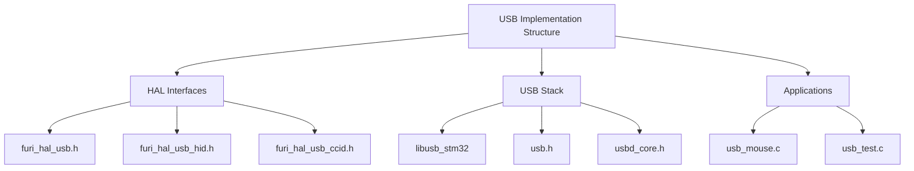
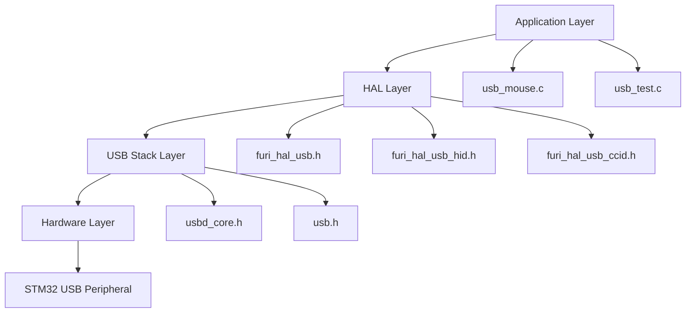
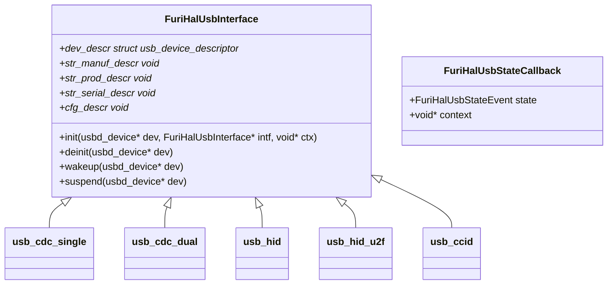
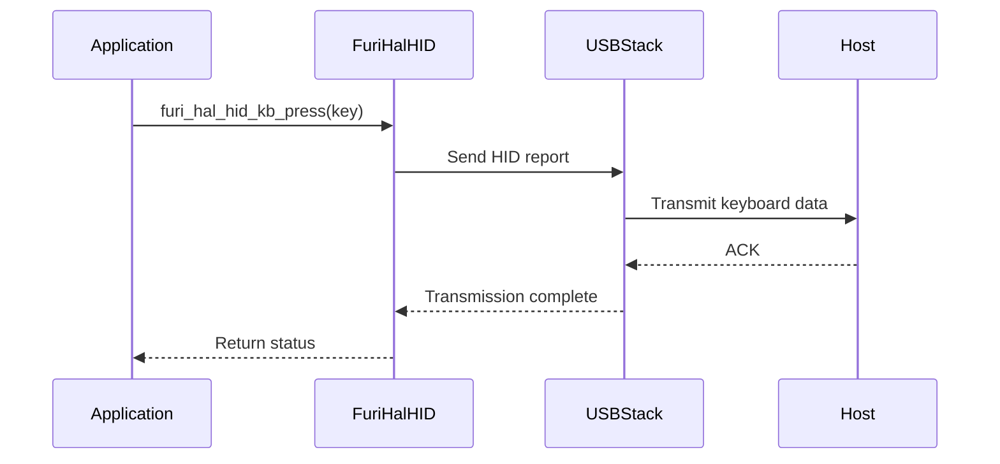
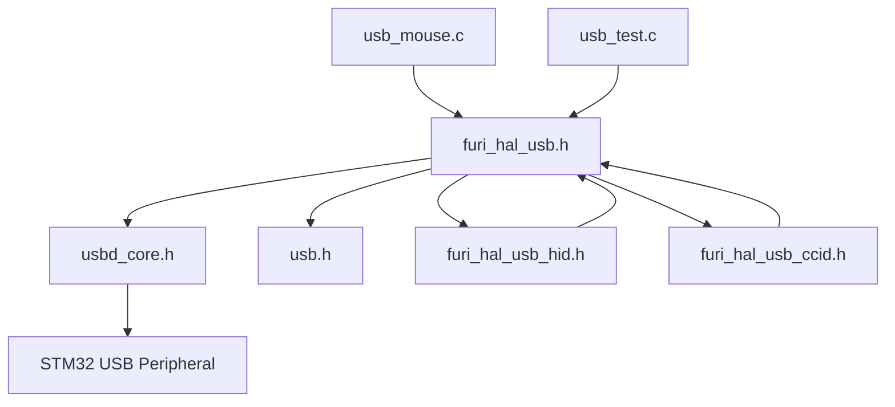

# USB Interface

<cite>
**Referenced Files in This Document**   
- [furi_hal_usb.h](file://targets/furi_hal_include/furi_hal_usb.h)
- [furi_hal_usb_hid.h](file://targets/furi_hal_include/furi_hal_usb_hid.h)
- [furi_hal_usb_ccid.h](file://targets/furi_hal_include/furi_hal_usb_ccid.h)
- [usb_mouse.c](file://applications/debug/usb_mouse/usb_mouse.c)
- [usb_test.c](file://applications/debug/usb_test/usb_test.c)
- [usb.h](file://lib/libusb_stm32/inc/usb.h)
- [usbd_core.h](file://lib/libusb_stm32/inc/usbd_core.h)
</cite>

## Table of Contents
1. [Introduction](#introduction)
2. [Project Structure](#project-structure)
3. [Core Components](#core-components)
4. [Architecture Overview](#architecture-overview)
5. [Detailed Component Analysis](#detailed-component-analysis)
6. [Dependency Analysis](#dependency-analysis)
7. [Performance Considerations](#performance-considerations)
8. [Troubleshooting Guide](#troubleshooting-guide)
9. [Conclusion](#conclusion)

## Introduction
The USB interface in the Flipper Zero firmware provides a Hardware Abstraction Layer (HAL) that enables the device to function as various USB device types, including CDC (serial), HID (keyboard/mouse), CCID (smart card), and U2F (security key). This documentation provides a comprehensive analysis of the USB implementation, covering the architecture, API functions, device modes, and practical examples from the codebase. The system is built on a layered architecture with the libusb_stm32 library providing low-level USB stack functionality, while the Furi HAL layer offers higher-level abstractions for application development.

## Project Structure
The USB implementation in the Flipper Zero firmware is organized across multiple directories, with key components located in specific locations. The core USB HAL interfaces are defined in the targets/furi_hal_include directory, while the underlying USB stack is implemented in the lib/libusb_stm32 library. Application examples and test implementations are located in the applications/debug directory, providing practical demonstrations of USB functionality.



**Diagram sources**
- [furi_hal_usb.h](file://targets/furi_hal_include/furi_hal_usb.h)
- [usb.h](file://lib/libusb_stm32/inc/usb.h)
- [usb_mouse.c](file://applications/debug/usb_mouse/usb_mouse.c)

**Section sources**
- [furi_hal_usb.h](file://targets/furi_hal_include/furi_hal_usb.h)
- [usb.h](file://lib/libusb_stm32/inc/usb.h)
- [usb_mouse.c](file://applications/debug/usb_mouse/usb_mouse.c)

## Core Components
The USB interface consists of several core components that work together to provide USB device functionality. The main components include the USB HAL interface definitions, the USB stack implementation, and the application-level implementations. The FuriHalUsbInterface structure defines the interface for different USB modes, with function pointers for initialization, deinitialization, wakeup, and suspend operations. The system supports multiple USB device modes through predefined interface instances such as usb_cdc_single, usb_cdc_dual, usb_hid, usb_hid_u2f, and usb_ccid.

The USB stack is implemented using the libusb_stm32 library, which provides a lightweight USB device stack for STM32 microcontrollers. This stack handles low-level USB protocol details, including endpoint management, packet transmission, and device enumeration. The Furi HAL layer abstracts these low-level details, providing a simpler API for application developers to work with.

**Section sources**
- [furi_hal_usb.h](file://targets/furi_hal_include/furi_hal_usb.h)
- [usbd_core.h](file://lib/libusb_stm32/inc/usbd_core.h)

## Architecture Overview
The USB architecture in the Flipper Zero firmware follows a layered approach, with clear separation between the hardware abstraction layer, the USB stack, and application code. The architecture enables the device to switch between different USB modes dynamically while maintaining a consistent API for developers.



**Diagram sources**
- [furi_hal_usb.h](file://targets/furi_hal_include/furi_hal_usb.h)
- [usbd_core.h](file://lib/libusb_stm32/inc/usbd_core.h)
- [usb_mouse.c](file://applications/debug/usb_mouse/usb_mouse.c)

## Detailed Component Analysis

### USB HAL Interface Analysis
The USB HAL interface provides a structured way to manage different USB device modes. The FuriHalUsbInterface structure contains function pointers for lifecycle management and pointers to USB descriptors.



**Diagram sources**
- [furi_hal_usb.h](file://targets/furi_hal_include/furi_hal_usb.h)

**Section sources**
- [furi_hal_usb.h](file://targets/furi_hal_include/furi_hal_usb.h)

### HID Implementation Analysis
The HID (Human Interface Device) implementation provides keyboard, mouse, and consumer control functionality. The system includes an ASCII to keycode conversion table and functions for managing HID reports.



**Diagram sources**
- [furi_hal_usb_hid.h](file://targets/furi_hal_include/furi_hal_usb_hid.h)
- [usbd_core.h](file://lib/libusb_stm32/inc/usbd_core.h)

**Section sources**
- [furi_hal_usb_hid.h](file://targets/furi_hal_include/furi_hal_usb_hid.h)

### USB Device Core Analysis
The USB device core provides the fundamental USB stack functionality, handling USB protocol details and device state management.

```mermaid
stateDiagram-v2
[*] --> Disabled
Disabled --> Disconnected : furi_hal_usb_enable()
Disconnected --> Default : USB connection
Default --> Addressed : SET_ADDRESS
Addressed --> Configured : SET_CONFIGURATION
Configured --> Suspended : SUSPEND event
Suspended --> Configured : WAKEUP event
Configured --> Default : BUS reset
```

**Diagram sources**
- [usbd_core.h](file://lib/libusb_stm32/inc/usbd_core.h)

**Section sources**
- [usbd_core.h](file://lib/libusb_stm32/inc/usbd_core.h)

## Dependency Analysis
The USB implementation has dependencies across multiple layers of the system, from hardware drivers to application code. The dependency graph shows how different components interact to provide USB functionality.



**Diagram sources**
- [furi_hal_usb.h](file://targets/furi_hal_include/furi_hal_usb.h)
- [usbd_core.h](file://lib/libusb_stm32/inc/usbd_core.h)
- [usb_mouse.c](file://applications/debug/usb_mouse/usb_mouse.c)
- [usb_test.c](file://applications/debug/usb_test/usb_test.c)

**Section sources**
- [furi_hal_usb.h](file://targets/furi_hal_include/furi_hal_usb.h)
- [usbd_core.h](file://lib/libusb_stm32/inc/usbd_core.h)

## Performance Considerations
The USB implementation is designed with performance in mind, particularly for real-time HID operations. The system uses interrupt-driven USB processing to minimize latency in device responses. Endpoint configuration is optimized for the specific device mode, with appropriate buffer sizes and transfer types. The USB stack is implemented as a lightweight library to minimize memory usage and processing overhead. For HID devices, the system batches multiple key presses into single reports when possible to reduce USB traffic. The implementation also includes power management features, allowing the USB interface to enter low-power states when not in use.

## Troubleshooting Guide
Common issues with USB functionality include enumeration failures, connection instability, and incorrect device identification. Enumeration failures can occur when the USB descriptors are malformed or when the device fails to respond to standard USB requests. Connection instability may be caused by power issues or electromagnetic interference. To troubleshoot enumeration problems, verify that the USB descriptors are correctly formatted and that the device responds appropriately to GET_DESCRIPTOR requests. For connection issues, check the physical connection and ensure adequate power supply. When implementing custom USB device profiles, ensure that the device class, subclass, and protocol values are correctly set in the device descriptor. Use the usb_test application to verify basic USB functionality and mode switching.

**Section sources**
- [furi_hal_usb.h](file://targets/furi_hal_include/furi_hal_usb.h)
- [usb_test.c](file://applications/debug/usb_test/usb_test.c)

## Conclusion
The USB interface in the Flipper Zero firmware provides a robust and flexible framework for implementing various USB device types. The layered architecture separates concerns between hardware abstraction, protocol implementation, and application logic, making it easier to develop and maintain USB functionality. The system supports multiple USB modes, including CDC, HID, CCID, and U2F, with well-defined APIs for initialization, configuration, and data transfer. The implementation leverages the libusb_stm32 library for reliable USB stack functionality while providing a higher-level HAL interface for application development. With proper understanding of the architecture and APIs, developers can create custom USB device profiles and integrate USB functionality into their applications effectively.