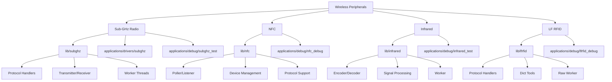
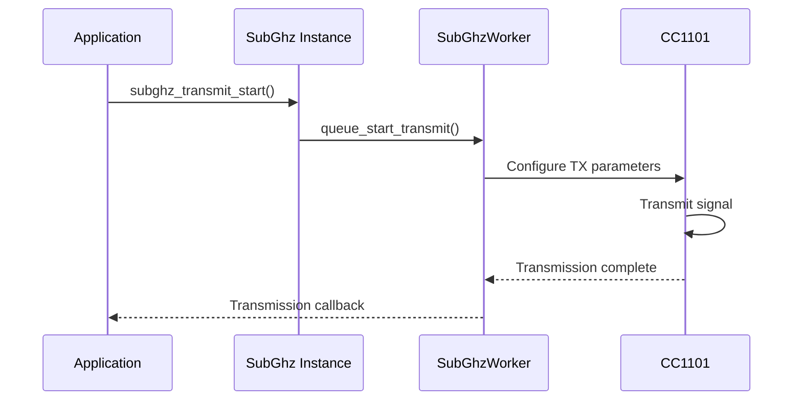
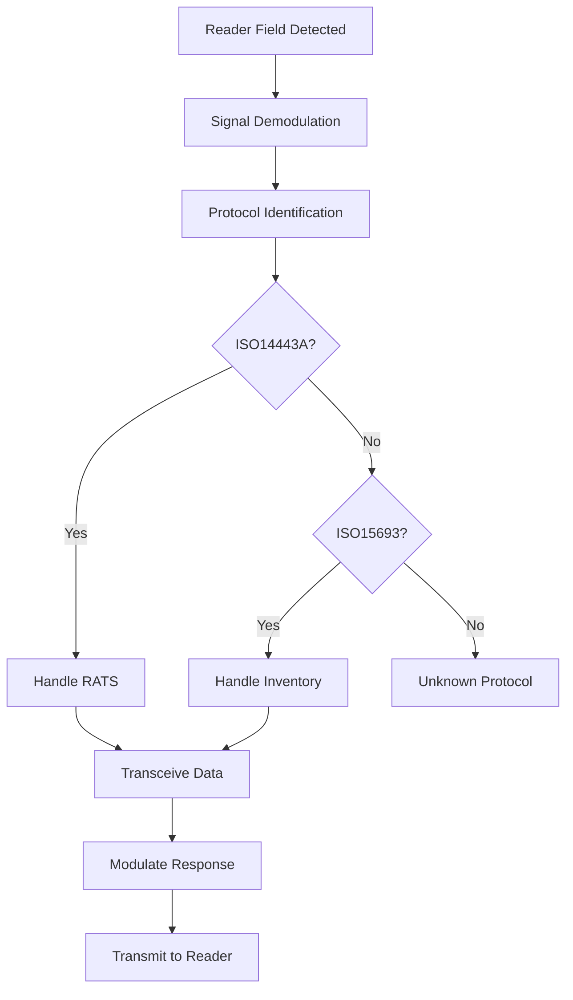
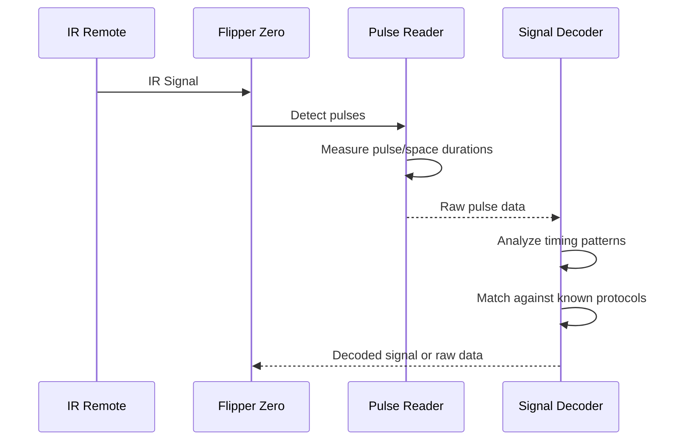
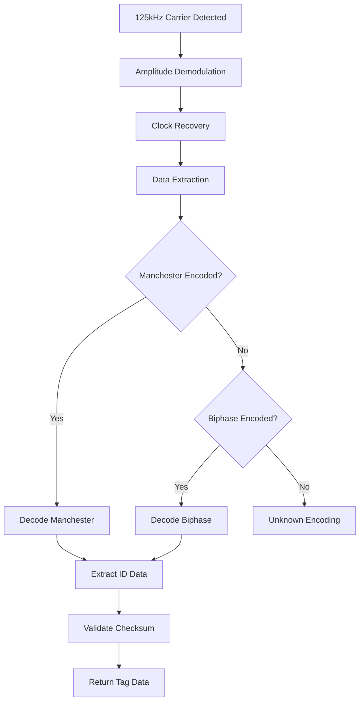
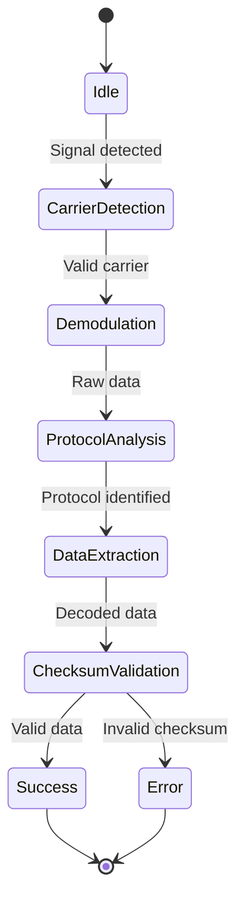

# Wireless Communication Peripherals

<cite>
**Referenced Files in This Document**   
- [subghz_test_app.c](file://applications/debug/subghz_test/subghz_test_app.c)
- [lfrfid_debug.c](file://applications/debug/lfrfid_debug/lfrfid_debug.c)
- [infrared_test.c](file://applications/debug/infrared_test/infrared_test.c)
- [cc1101_ext.c](file://applications/drivers/subghz/cc1101_ext/cc1101_ext.c)
- [furi_hal_subghz.h](file://targets/furi_hal_include/furi_hal_subghz.h)
- [furi_hal_nfc.h](file://targets/furi_hal_include/furi_hal_nfc.h)
- [furi_hal_infrared.h](file://targets/furi_hal_include/furi_hal_infrared.h)
- [furi_hal_lfrfid.h](file://targets/furi_hal_include/furi_hal_lfrfid.h)
- [subghz_worker.c](file://lib/subghz/subghz_worker.c)
- [nfc.c](file://lib/nfc/nfc.c)
- [infrared_worker.c](file://lib/infrared/worker/infrared_worker.c)
- [lfrfid_worker.c](file://lib/lfrfid/lfrfid_worker.c)
</cite>

## Table of Contents
1. [Introduction](#introduction)
2. [Project Structure and Wireless Peripheral Organization](#project-structure-and-wireless-peripheral-organization)
3. **Sub-GHz Radio Implementation**
4. **NFC (Near Field Communication) Implementation**
5. **Infrared Communication Implementation**
6. **LF RFID Implementation**
7. **Hardware Abstraction Layer (HAL) Interfaces**
8. **Integration with Power Management and Timing**
9. **Signal Processing and Protocol Handling**
10. **Common Issues and Regulatory Compliance**
11. **Performance Optimization Guidelines**
12. **Conclusion**

## Introduction
The Flipper Zero firmware provides a comprehensive Hardware Abstraction Layer (HAL) for wireless communication peripherals, enabling versatile functionality across Sub-GHz radio, NFC, infrared, and LF RFID interfaces. This document details the implementation architecture, API design, and integration patterns for these wireless systems. The firmware supports signal analysis, emulation, and bidirectional communication through a modular design that separates hardware control from protocol processing. Each wireless peripheral is accessible via dedicated HAL interfaces that abstract low-level register operations while exposing configuration parameters, transmission/reception controls, and protocol-specific settings to applications.

## Project Structure and Wireless Peripheral Organization

The repository organizes wireless communication components across multiple directories, following a layered architecture that separates drivers, libraries, applications, and HAL interfaces. The core wireless functionality resides in the `lib` directory, with device-specific drivers in `applications/drivers`, test applications in `applications/debug`, and HAL definitions in `targets/furi_hal_include`.



**Diagram sources**
- [lib/subghz](file://lib/subghz)
- [lib/nfc](file://lib/nfc)
- [lib/infrared](file://lib/infrared)
- [lib/lfrfid](file://lib/lfrfid)

**Section sources**
- [applications/debug/subghz_test/subghz_test_app.c](file://applications/debug/subghz_test/subghz_test_app.c)
- [applications/debug/lfrfid_debug/lfrfid_debug.c](file://applications/debug/lfrfid_debug/lfrfid_debug.c)
- [applications/debug/infrared_test/infrared_test.c](file://applications/debug/infrared_test/infrared_test.c)

## **Sub-GHz Radio Implementation**

### Architecture and Components
The Sub-GHz radio system is built around the CC1101 transceiver, with a layered architecture that includes hardware drivers, a worker thread for radio operations, and protocol-specific handlers. The implementation supports multiple modulation schemes including ASK/OOK and FSK across various frequency bands.

The core components include:
- **CC1101 Driver**: Low-level register interface for the radio transceiver
- **Sub-GHz Worker**: Background thread managing transmission and reception
- **Protocol Registry**: Dynamic registration of supported protocols
- **Environment Management**: Configuration storage and frequency settings

### API Functions and Configuration
The Sub-GHz API provides functions for configuring radio parameters, transmitting and receiving signals, and managing protocol-specific settings. Key functions include:

```c
// Initialize Sub-GHz interface
SubGhz* subghz_alloc(void);

// Configure radio frequency
bool subghz_set_frequency(SubGhz* instance, uint32_t frequency);

// Set transmission power
bool subghz_set_tx_power(SubGhz* instance, uint8_t power);

// Start signal reception
bool subghz_start_async_rx(SubGhz* instance, SubGhzCallback callback, void* context);

// Transmit signal
bool subghz_transmit_start(SubGhz* instance, const SubGhzProtocolDecoderBase* decoder);

// Stop transmission/reception
void subghz_transmit_stop(SubGhz* instance);
```

### Signal Transmission and Reception
The transmission process involves loading a protocol decoder, configuring the radio parameters, and initiating transmission through the worker thread. Reception uses an asynchronous callback model where received signals trigger application-defined handlers.



**Diagram sources**
- [subghz_worker.c](file://lib/subghz/subghz_worker.c)
- [cc1101_ext.c](file://applications/drivers/subghz/cc1101_ext/cc1101_ext.c)

**Section sources**
- [subghz_test_app.c](file://applications/debug/subghz_test/subghz_test_app.c)
- [furi_hal_subghz.h](file://targets/furi_hal_include/furi_hal_subghz.h)

### Protocol Support and Customization
The system supports a wide range of Sub-GHz protocols through a modular protocol registry. Each protocol implements a common interface with methods for encoding, decoding, and checking signal compatibility. The protocol registry allows dynamic addition of new protocols without modifying core radio code.

Example protocol implementation:
```c
const SubGhzProtocolDecoderBase subghz_protocol_keeloq = {
    .alloc = subghz_protocol_decoder_keeloq_alloc,
    .free = subghz_protocol_decoder_keeloq_free,
    .reset = subghz_protocol_decoder_keeloq_reset,
    .feed = subghz_protocol_decoder_keeloq_feed,
    .get_hash_data = subghz_protocol_decoder_keeloq_get_hash_data,
    .serialize = subghz_protocol_decoder_keeloq_serialize,
    .deserialize = subghz_protocol_decoder_keeloq_deserialize,
    .get_string = subghz_protocol_decoder_keeloq_get_string,
};
```

## **NFC (Near Field Communication) Implementation**

### Architecture Overview
The NFC subsystem is designed to support multiple NFC standards including ISO14443A/B, ISO15693, and FeliCa. It uses the ST25R3916 NFC controller and provides both polling (active) and listening (passive) modes for communication with NFC tags and devices.

Key components:
- **NFC Poller**: Initiates communication with NFC targets
- **NFC Listener**: Emulates NFC tags for other readers
- **Protocol Handlers**: Implement specific NFC standards
- **Device Management**: Handles tag detection and state transitions

### API Functions and Usage
The NFC API provides a state machine interface for managing NFC operations:

```c
// Allocate NFC instance
Nfc* nfc_alloc(void);

// Start polling mode
bool nfc_poller_start(Nfc* nfc, NfcPollerEventCallback callback, void* context);

// Start listener mode
bool nfc_listener_start(Nfc* nfc, NfcListenerEventCallback callback, void* context);

// Get detected device information
const NfcDevice* nfc_poller_get_device(Nfc* nfc);

// Configure emulation parameters
bool nfc_listener_configure(Nfc* nfc, const NfcListenerConfig* config);
```

### Signal Processing and Emulation
The NFC system handles signal processing at multiple levels, from raw RF signal detection to protocol-level data parsing. In listener mode, the system can emulate various tag types by responding to reader commands with appropriate data sequences.



**Diagram sources**
- [nfc.c](file://lib/nfc/nfc.c)
- [furi_hal_nfc.h](file://targets/furi_hal_include/furi_hal_nfc.h)

**Section sources**
- [nfc.c](file://lib/nfc/nfc.c)
- [furi_hal_nfc.h](file://targets/furi_hal_include/furi_hal_nfc.h)

## **Infrared Communication Implementation**

### System Architecture
The infrared communication system supports both transmission and reception of IR signals using standard protocols like NEC, Sony, RC5, and custom raw signals. The implementation includes hardware pulse counting, signal decoding, and protocol-specific encoders.

Components:
- **Pulse Reader**: Hardware-level pulse detection
- **Signal Decoder**: Protocol identification and data extraction
- **Signal Encoder**: Protocol-specific signal generation
- **Worker Thread**: Background processing for signal operations

### API and Configuration
The infrared API provides functions for learning, sending, and analyzing IR signals:

```c
// Initialize infrared interface
Infrared* infrared_alloc(void);

// Start signal reception
bool infrared_rx_start(Infrared* infrared, InfraredCallback callback, void* context);

// Send learned signal
bool infrared_tx(Infrared* infrared, const InfraredSignal* signal);

// Get signal protocol information
const InfraredProtocol* infrared_signal_get_protocol(const InfraredSignal* signal);

// Encode signal from raw data
InfraredSignal* infrared_signal_alloc_encode(const InfraredSignalRaw* raw);
```

### Signal Analysis and Learning
The infrared system can learn unknown signals by capturing pulse sequences and attempting to identify the underlying protocol. This involves measuring pulse durations and comparing them against known protocol timing patterns.



**Diagram sources**
- [infrared_worker.c](file://lib/infrared/worker/infrared_worker.c)
- [furi_hal_infrared.h](file://targets/furi_hal_include/furi_hal_infrared.h)

**Section sources**
- [infrared_test.c](file://applications/debug/infrared_test/infrared_test.c)
- [infrared_worker.c](file://lib/infrared/worker/infrared_worker.c)

## **LF RFID Implementation**

### Architecture and Components
The LF RFID system operates at 125 kHz and supports various RFID protocols including EM4100, HID, Indala, and others. It uses amplitude shift keying (ASK) modulation and includes both reading and emulation capabilities.

Key components:
- **LF RFID Reader**: Detects and decodes LF RFID signals
- **LF RFID Emulator**: Simulates RFID tags
- **Protocol Handlers**: Implement specific RFID formats
- **Dictionary Tools**: Support for known tag databases

### API Functions and Usage
The LF RFID API provides functions for reading, writing, and emulating RFID tags:

```c
// Allocate LF RFID instance
LFRFID* lfrfid_alloc(void);

// Start reading mode
bool lfrfid_read_start(LFRFID* lfrfid, LFRFIDCallback callback, void* context);

// Start emulation mode
bool lfrfid_emulate_start(LFRFID* lfrfid, const LFRFIDProtocol* protocol, void* context);

// Get read tag data
const LFRFIDDevice* lfrfid_get_device(LFRFID* lfrfid);

// Write to writable tags
bool lfrfid_write(LFRFID* lfrfid, const LFRFIDWriteData* data);
```

### Signal Processing and Emulation
The LF RFID system handles the 125 kHz carrier signal and demodulates the data encoded using Manchester or Biphase coding. In emulation mode, the system generates the appropriate signal pattern to mimic a real RFID tag.



**Diagram sources**
- [lfrfid_worker.c](file://lib/lfrfid/lfrfid_worker.c)
- [furi_hal_lfrfid.h](file://targets/furi_hal_include/furi_hal_lfrfid.h)

**Section sources**
- [lfrfid_debug.c](file://applications/debug/lfrfid_debug/lfrfid_debug.c)
- [lfrfid_worker.c](file://lib/lfrfid/lfrfid_worker.c)

## **Hardware Abstraction Layer (HAL) Interfaces**

### HAL Design Principles
The Hardware Abstraction Layer provides a consistent interface between the hardware drivers and higher-level applications. Each wireless peripheral has a dedicated HAL interface that abstracts register-level operations and provides standardized functions for initialization, configuration, and operation.

### Sub-GHz HAL Interface
The Sub-GHz HAL (`furi_hal_subghz.h`) defines functions for:
- Radio initialization and deinitialization
- Frequency and power configuration
- Transmission and reception control
- RSSI measurement
- Direct register access

### NFC HAL Interface
The NFC HAL (`furi_hal_nfc.h`) provides:
- NFC controller initialization
- Field detection and generation
- Data transmission and reception
- Error handling and status reporting
- Low-level protocol commands

### Infrared HAL Interface
The Infrared HAL (`furi_hal_infrared.h`) includes:
- Pulse counter configuration
- Timer setup for signal timing
- GPIO control for IR LED
- Interrupt handling for pulse detection
- Carrier frequency generation

### LF RFID HAL Interface
The LF RFID HAL (`furi_hal_lfrfid.h`) offers:
- 125 kHz carrier generation
- Signal demodulation
- ADC sampling for signal analysis
- Coil driver control
- Emulation signal generation

**Section sources**
- [furi_hal_subghz.h](file://targets/furi_hal_include/furi_hal_subghz.h)
- [furi_hal_nfc.h](file://targets/furi_hal_include/furi_hal_nfc.h)
- [furi_hal_infrared.h](file://targets/furi_hal_include/furi_hal_infrared.h)
- [furi_hal_lfrfid.h](file://targets/furi_hal_include/furi_hal_lfrfid.h)

## **Integration with Power Management and Timing**

### Power Management Considerations
Wireless peripherals are significant power consumers, requiring careful integration with the power management system. The firmware implements several power-saving strategies:

- **Dynamic Power Scaling**: Adjusting transmission power based on signal requirements
- **Sleep Modes**: Putting radio components into low-power states when idle
- **Duty Cycling**: Periodic activation for signal monitoring
- **Resource Sharing**: Coordinating access to shared hardware resources

### Timing and Synchronization
Precise timing is critical for wireless communication, especially for protocols with strict timing requirements. The system uses hardware timers and interrupts to ensure accurate signal generation and reception:

- **Sub-GHz**: Uses high-precision timers for FSK/ASK modulation
- **NFC**: Synchronizes with 13.56 MHz carrier for ISO14443 protocols
- **Infrared**: Implements microsecond-precision pulse timing
- **LF RFID**: Maintains 125 kHz carrier with minimal drift

### Clock Management
The system manages multiple clock domains for different wireless peripherals:
- **High-Frequency Clock**: For Sub-GHz and NFC operations
- **Medium-Frequency Clock**: For infrared carrier generation
- **Low-Frequency Clock**: For LF RFID carrier and timing

**Section sources**
- [furi_hal_subghz.h](file://targets/furi_hal_include/furi_hal_subghz.h)
- [furi_hal_nfc.h](file://targets/furi_hal_include/furi_hal_nfc.h)
- [furi_hal_infrared.h](file://targets/furi_hal_include/furi_hal_infrared.h)
- [furi_hal_lfrfid.h](file://targets/furi_hal_include/furi_hal_lfrfid.h)

## **Signal Processing and Protocol Handling**

### Digital Signal Processing
The firmware implements various digital signal processing techniques for wireless communication:

- **Pulse Width Analysis**: For infrared and Sub-GHz signal decoding
- **Manchester/Biphase Decoding**: For RFID and NFC data extraction
- **Error Detection**: CRC and checksum validation
- **Signal Filtering**: Noise reduction and interference mitigation

### Protocol State Machines
Each protocol implements a state machine to handle the communication sequence:



**Diagram sources**
- [subghz_worker.c](file://lib/subghz/subghz_worker.c)
- [nfc.c](file://lib/nfc/nfc.c)
- [infrared_worker.c](file://lib/infrared/worker/infrared_worker.c)
- [lfrfid_worker.c](file://lib/lfrfid/lfrfid_worker.c)

**Section sources**
- [subghz_worker.c](file://lib/subghz/subghz_worker.c)
- [nfc.c](file://lib/nfc/nfc.c)
- [infrared_worker.c](file://lib/infrared/worker/infrared_worker.c)
- [lfrfid_worker.c](file://lib/lfrfid/lfrfid_worker.c)

## **Common Issues and Regulatory Compliance**

### Signal Interference
Wireless systems are susceptible to various types of interference:
- **Adjacent Channel Interference**: From nearby frequency bands
- **Co-Channel Interference**: From devices using the same frequency
- **Electromagnetic Interference**: From digital circuits and power supplies
- **Multipath Interference**: Signal reflections causing phase cancellation

### Range Limitations
Range is affected by multiple factors:
- **Transmission Power**: Limited by regulatory requirements
- **Antenna Efficiency**: Design and placement constraints
- **Environmental Factors**: Obstacles, humidity, and temperature
- **Receiver Sensitivity**: Noise floor and signal-to-noise ratio

### Regulatory Compliance
The firmware must comply with radio regulations in different regions:
- **Frequency Bands**: Operating within authorized ISM bands
- **Transmission Power**: Adhering to maximum power limits
- **Duty Cycle**: Complying with transmission time restrictions
- **Spectrum Mask**: Meeting spectral emission requirements

**Section sources**
- [furi_hal_subghz.h](file://targets/furi_hal_include/furi_hal_subghz.h)
- [subghz_setting.c](file://lib/subghz/subghz_setting.c)

## **Performance Optimization Guidelines**

### RF Front-End Architecture
The RF front-end design significantly impacts wireless performance:
- **Impedance Matching**: Ensuring maximum power transfer
- **Filtering**: Reducing out-of-band emissions
- **Amplification**: Boosting signal strength while minimizing noise
- **Antenna Design**: Optimizing radiation pattern and efficiency

### Optimization Techniques
Recommended practices for maximizing wireless performance:
- **Calibration**: Regular calibration of radio parameters
- **Protocol Selection**: Using the most efficient protocol for the application
- **Signal Encoding**: Choosing encoding schemes with good noise immunity
- **Error Correction**: Implementing forward error correction when possible

### Best Practices
- Use the lowest necessary transmission power
- Implement proper signal timing and synchronization
- Validate protocol implementations with known test signals
- Monitor RSSI and adjust parameters dynamically
- Test in real-world environments to identify interference sources

**Section sources**
- [subghz_worker.c](file://lib/subghz/subghz_worker.c)
- [nfc.c](file://lib/nfc/nfc.c)
- [infrared_worker.c](file://lib/infrared/worker/infrared_worker.c)
- [lfrfid_worker.c](file://lib/lfrfid/lfrfid_worker.c)

## Conclusion
The Flipper Zero's wireless communication peripherals provide a comprehensive and flexible platform for RF signal analysis, emulation, and communication. The layered architecture separates hardware control from protocol processing, enabling extensibility and maintainability. Each wireless interface—Sub-GHz, NFC, infrared, and LF RFID—implements a consistent design pattern with dedicated HAL interfaces, worker threads, and protocol handlers. The system integrates closely with power management and timing subsystems to ensure reliable operation while conserving battery life. Developers can leverage the provided APIs to create applications that interact with a wide range of wireless devices and protocols, from garage door openers to access control systems. Understanding the RF front-end architecture and signal processing pipeline is essential for optimizing performance and ensuring regulatory compliance.