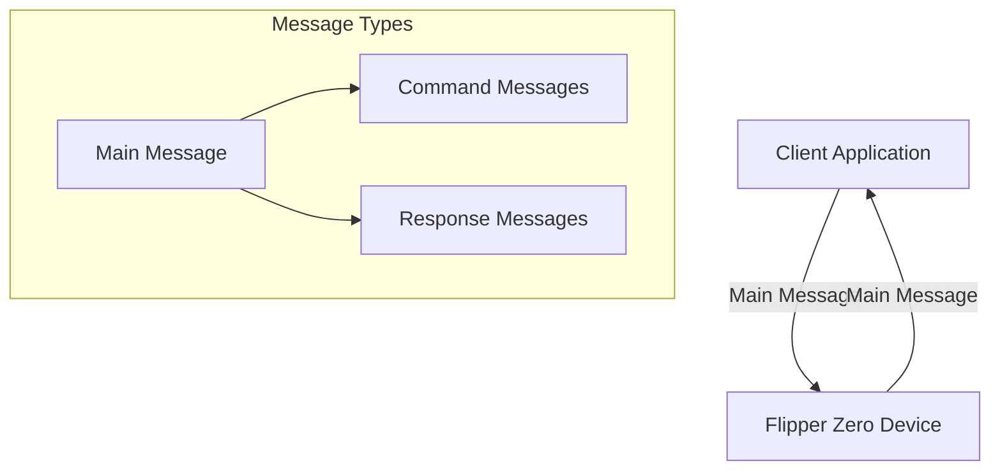
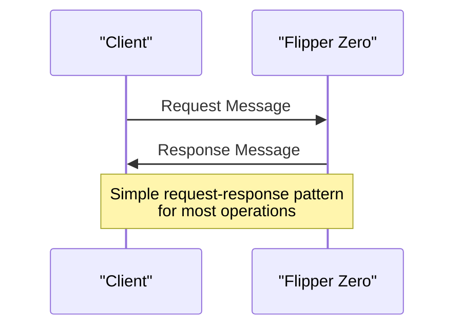
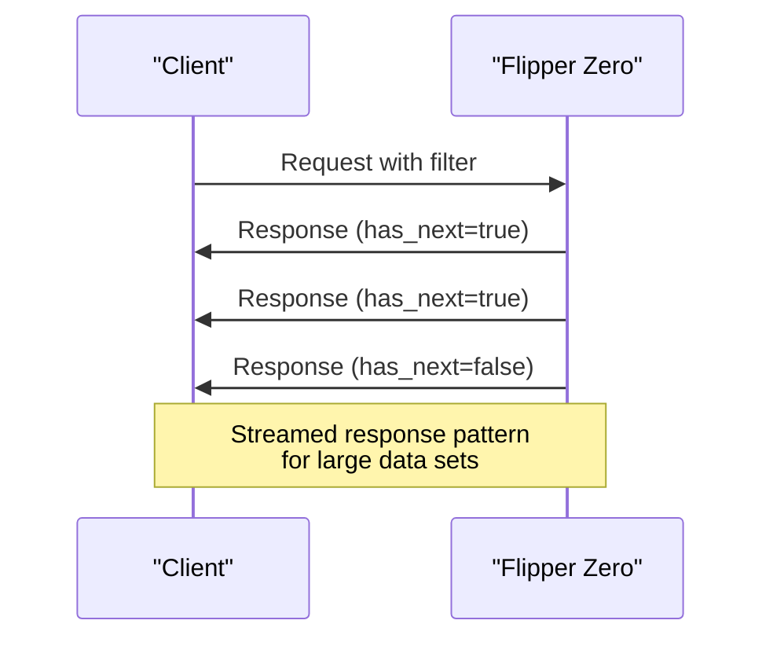
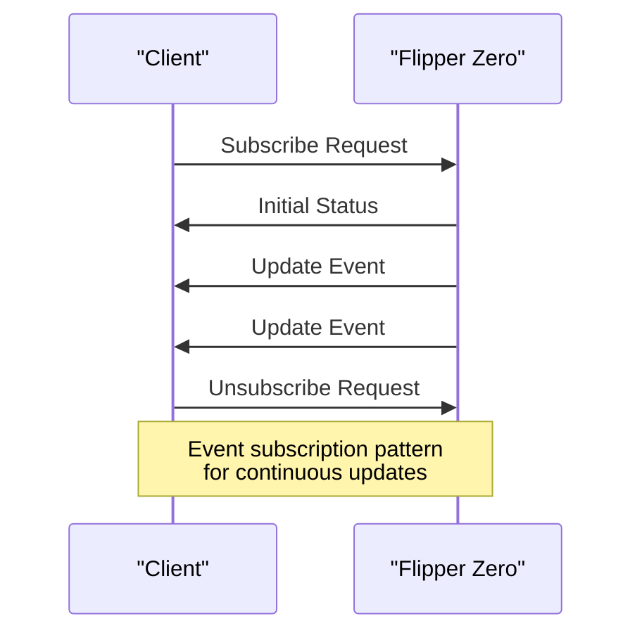
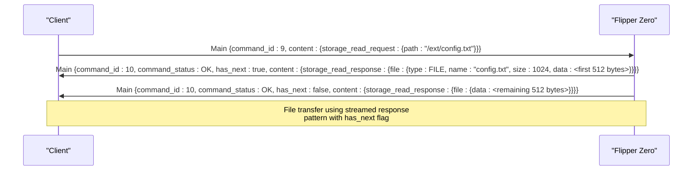
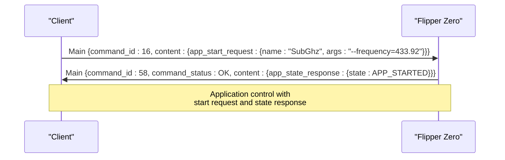
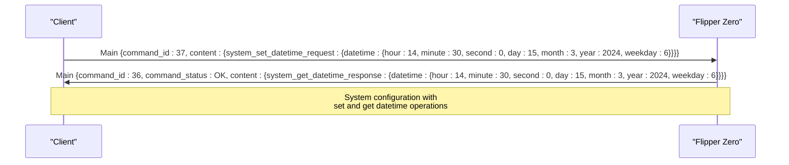

# Hardware Communication Protocols

<cite>
**Referenced Files in This Document**   
- [flipper.proto](file://assets/protobuf/flipper.proto)
- [storage.proto](file://assets/protobuf/storage.proto)
- [system.proto](file://assets/protobuf/system.proto)
- [application.proto](file://assets/protobuf/application.proto)
- [gui.proto](file://assets/protobuf/gui.proto)
- [gpio.proto](file://assets/protobuf/gpio.proto)
- [property.proto](file://assets/protobuf/property.proto)
- [desktop.proto](file://assets/protobuf/desktop.proto)
</cite>

## Table of Contents
1. [Introduction](#introduction)
2. [Protocol Overview](#protocol-overview)
3. [Core Message Structure](#core-message-structure)
4. [Communication Patterns](#communication-patterns)
5. [Message Type Definitions](#message-type-definitions)
6. [Error Handling Mechanisms](#error-handling-mechanisms)
7. [Common Operation Examples](#common-operation-examples)
8. [Protocol Versioning and Compatibility](#protocol-versioning-and-compatibility)
9. [Hardware Operation Mapping](#hardware-operation-mapping)

## Introduction
The Flipper Zero ecosystem utilizes Protocol Buffers (protobuf) as the primary serialization format for hardware communication protocols. These protocols enable inter-process communication, device-to-computer communication, and external API interfaces. The protobuf definitions are located in the `assets/protobuf` directory and define a comprehensive set of messages for controlling and interacting with the Flipper Zero device. This documentation provides a detailed analysis of these protocols, covering message definitions, data types, serialization format, communication patterns, and their mapping to hardware operations.

**Section sources**
- [flipper.proto](file://assets/protobuf/flipper.proto)
- [storage.proto](file://assets/protobuf/storage.proto)

## Protocol Overview
The Flipper Zero communication protocol is built on Protocol Buffers version 3 (proto3) and defines a structured message system for bidirectional communication between the device and external systems. The protocol supports various operations including file system access, application control, system management, GUI interaction, GPIO manipulation, and property queries. The protocol is designed to be extensible, efficient, and platform-independent, enabling consistent communication across different client implementations.

The protocol architecture follows a command-response pattern where each request message has a corresponding response message. The main message container is the `Main` message defined in `flipper.proto`, which uses a `oneof` field to encapsulate different types of command and response messages. This design allows for a single communication channel to handle multiple types of operations without message type conflicts.



**Diagram sources**
- [flipper.proto](file://assets/protobuf/flipper.proto#L50-L150)

## Core Message Structure
The core of the Flipper Zero communication protocol is the `Main` message defined in `flipper.proto`. This message serves as a container for all communication between the device and external systems. It contains essential metadata and the actual command or response payload.

```protobuf
message Main {
    uint32 command_id = 1;
    CommandStatus command_status = 2;
    bool has_next = 3;
    oneof content {
        Empty empty = 4;
        StopSession stop_session = 19;
        // Various command and response messages
        .PB_System.PingRequest system_ping_request = 5;
        .PB_System.PingResponse system_ping_response = 6;
        // ... other message types
    }
}
```

The `Main` message structure includes:
- **command_id**: A unique identifier for the command type (uint32)
- **command_status**: Status of the command execution (CommandStatus enum)
- **has_next**: Boolean flag indicating if more messages are expected in a sequence
- **content**: A `oneof` field containing the specific command or response message

The `oneof` construct ensures that only one message type is present in the content field at any time, providing type safety and efficient serialization. This structure enables the protocol to handle a wide variety of operations while maintaining a consistent message format.

**Section sources**
- [flipper.proto](file://assets/protobuf/flipper.proto#L50-L150)

## Communication Patterns
The Flipper Zero communication protocol implements several distinct patterns for different types of operations. These patterns define the message flow between the client and device for various use cases.

### Request-Response Pattern
The most common communication pattern is the simple request-response model. In this pattern, a client sends a request message and receives a corresponding response message.



**Diagram sources**
- [flipper.proto](file://assets/protobuf/flipper.proto#L50-L150)

### Streamed Response Pattern
For operations that return large amounts of data, such as file transfers or directory listings, the protocol uses a streamed response pattern. The `has_next` field in the `Main` message indicates whether additional messages will follow.



**Diagram sources**
- [storage.proto](file://assets/protobuf/storage.proto#L30-L40)

### Event Subscription Pattern
For operations that require continuous updates, such as screen streaming or status monitoring, the protocol supports an event subscription pattern. The client subscribes to events and receives updates asynchronously.



**Diagram sources**
- [gui.proto](file://assets/protobuf/gui.proto#L30-L40)
- [desktop.proto](file://assets/protobuf/desktop.proto#L10-L15)

## Message Type Definitions
The Flipper Zero communication protocol defines several message types organized into different categories based on their functionality. Each category is defined in a separate protobuf file and imported into the main `flipper.proto` file.

### Storage Messages
The storage messages, defined in `storage.proto`, provide file system access capabilities. These messages enable clients to perform file operations such as reading, writing, listing directories, and managing files.

```protobuf
message File {
    enum FileType {
        FILE = 0;
        DIR = 1;
    }
    FileType type = 1;
    string name = 2;
    uint32 size = 3;
    bytes data = 4;
    string md5sum = 5;
}

message ListRequest {
    string path = 1;
    bool include_md5 = 2;
    uint32 filter_max_size = 3;
}

message ListResponse {
    repeated File file = 1;
}
```

The storage protocol supports operations including:
- **InfoRequest/InfoResponse**: Retrieve storage capacity information
- **StatRequest/StatResponse**: Get file or directory metadata
- **ListRequest/ListResponse**: List directory contents
- **ReadRequest/ReadResponse**: Read file contents
- **WriteRequest**: Write data to a file
- **DeleteRequest**: Delete a file or directory
- **MkdirRequest**: Create a directory
- **RenameRequest**: Rename a file or directory

**Section sources**
- [storage.proto](file://assets/protobuf/storage.proto)

### System Messages
The system messages, defined in `system.proto`, provide access to system-level functions and device information. These messages enable clients to control device behavior and retrieve system status.

```protobuf
message DeviceInfoRequest {
}

message DeviceInfoResponse {
    string key = 1;
    string value = 2;
}

message RebootRequest {
    enum RebootMode {
        OS = 0;
        DFU = 1;
        UPDATE = 2;
    }
    RebootMode mode = 1;
}

message DateTime {
    uint32 hour = 1;
    uint32 minute = 2;
    uint32 second = 3;
    uint32 day = 4;
    uint32 month = 5;
    uint32 year = 6;
    uint32 weekday = 7;
}
```

The system protocol supports operations including:
- **PingRequest/PingResponse**: Test connectivity
- **RebootRequest**: Reboot the device in different modes
- **DeviceInfoRequest/DeviceInfoResponse**: Retrieve device information
- **FactoryResetRequest**: Perform a factory reset
- **GetDateTimeRequest/GetDateTimeResponse**: Get current date and time
- **SetDateTimeRequest**: Set date and time
- **PlayAudiovisualAlertRequest**: Trigger audiovisual alert
- **UpdateRequest/UpdateResponse**: Initiate firmware update

**Section sources**
- [system.proto](file://assets/protobuf/system.proto)

### Application Messages
The application messages, defined in `application.proto`, provide control over running applications on the Flipper Zero device. These messages enable clients to start, stop, and interact with applications.

```protobuf
message StartRequest {
    string name = 1;
    string args = 2;
}

message AppExitRequest {
}

message AppButtonPressRequest {
    string args = 1;
    int32 index = 2;
}

enum AppState {
    APP_CLOSED = 0;
    APP_STARTED = 1;
}
```

The application protocol supports operations including:
- **StartRequest**: Start an application with optional arguments
- **AppExitRequest**: Exit the current application
- **AppButtonPressRequest**: Simulate button press in application
- **AppButtonReleaseRequest**: Simulate button release
- **AppStateResponse**: Report application state
- **GetErrorRequest/GetErrorResponse**: Retrieve application error information
- **DataExchangeRequest**: Exchange data with running application

**Section sources**
- [application.proto](file://assets/protobuf/application.proto)

### GUI Messages
The GUI messages, defined in `gui.proto`, provide interaction with the graphical user interface. These messages enable clients to stream the screen, send input events, and manage virtual displays.

```protobuf
enum InputKey {
    UP = 0;
    DOWN = 1;
    RIGHT = 2;
    LEFT = 3;
    OK = 4;
    BACK = 5;
}

enum InputType {
    PRESS = 0;
    RELEASE = 1;
    SHORT = 2;
    LONG = 3;
    REPEAT = 4;
}

message ScreenFrame {
    bytes data = 1;
    ScreenOrientation orientation = 2;
}
```

The GUI protocol supports operations including:
- **StartScreenStreamRequest/StopScreenStreamRequest**: Control screen streaming
- **ScreenFrame**: Transmit screen frame data
- **SendInputEventRequest**: Send input events to the device
- **StartVirtualDisplayRequest/StopVirtualDisplayRequest**: Manage virtual display sessions

**Section sources**
- [gui.proto](file://assets/protobuf/gui.proto)

### GPIO Messages
The GPIO messages, defined in `gpio.proto`, provide access to the device's general-purpose input/output pins. These messages enable clients to configure and control GPIO pins.

```protobuf
enum GpioPin {
    PC0 = 0;
    PC1 = 1;
    PC3 = 2;
    PB2 = 3;
    PB3 = 4;
    PA4 = 5;
    PA6 = 6;
    PA7 = 7;
}

enum GpioPinMode {
    OUTPUT = 0;
    INPUT = 1;
}

message SetPinMode {
    GpioPin pin = 1;
    GpioPinMode mode = 2;
}
```

The GPIO protocol supports operations including:
- **SetPinMode**: Configure pin as input or output
- **SetInputPull**: Set pull-up or pull-down resistor
- **GetPinMode/GetPinModeResponse**: Query pin mode
- **ReadPin/ReadPinResponse**: Read pin value
- **WritePin**: Write value to pin
- **GetOtgMode/SetOtgMode**: Control OTG mode

**Section sources**
- [gpio.proto](file://assets/protobuf/gpio.proto)

### Property Messages
The property messages, defined in `property.proto`, provide a simple key-value store for configuration and status information.

```protobuf
message GetRequest {
    string key = 1;
}

message GetResponse {
    string key = 1;
    string value = 2;
}
```

The property protocol supports:
- **GetRequest/GetResponse**: Retrieve property value by key

**Section sources**
- [property.proto](file://assets/protobuf/property.proto)

### Desktop Messages
The desktop messages, defined in `desktop.proto`, provide access to the desktop environment status and control.

```protobuf
message IsLockedRequest {
}

message UnlockRequest {
}

message Status {
    bool locked = 1;
}
```

The desktop protocol supports:
- **IsLockedRequest/Status**: Check if desktop is locked
- **UnlockRequest**: Unlock the desktop
- **StatusSubscribeRequest/StatusUnsubscribeRequest**: Subscribe to desktop status changes

**Section sources**
- [desktop.proto](file://assets/protobuf/desktop.proto)

## Error Handling Mechanisms
The Flipper Zero communication protocol includes a comprehensive error handling system defined by the `CommandStatus` enum in `flipper.proto`. This system provides detailed information about the success or failure of command execution.

```protobuf
enum CommandStatus {
    OK = 0;

    /**< Common Errors */
    ERROR = 1;
    ERROR_DECODE = 2;
    ERROR_NOT_IMPLEMENTED = 3;
    ERROR_BUSY = 4;
    ERROR_CONTINUOUS_COMMAND_INTERRUPTED = 14;
    ERROR_INVALID_PARAMETERS = 15;

    /**< Storage Errors */
    ERROR_STORAGE_NOT_READY = 5;
    ERROR_STORAGE_EXIST = 6;
    ERROR_STORAGE_NOT_EXIST = 7;
    ERROR_STORAGE_INVALID_PARAMETER = 8;
    ERROR_STORAGE_DENIED = 9;
    ERROR_STORAGE_INVALID_NAME = 10;
    ERROR_STORAGE_INTERNAL = 11;
    ERROR_STORAGE_NOT_IMPLEMENTED = 12;
    ERROR_STORAGE_ALREADY_OPEN = 13;
    ERROR_STORAGE_DIR_NOT_EMPTY = 18;

    /**< Application Errors */
    ERROR_APP_CANT_START = 16;
    ERROR_APP_SYSTEM_LOCKED = 17;
    ERROR_APP_NOT_RUNNING = 21;
    ERROR_APP_CMD_ERROR = 22;

    /**< Virtual Display Errors */
    ERROR_VIRTUAL_DISPLAY_ALREADY_STARTED = 19;
    ERROR_VIRTUAL_DISPLAY_NOT_STARTED = 20;

    /**< GPIO Errors */
    ERROR_GPIO_MODE_INCORRECT = 58;
    ERROR_GPIO_UNKNOWN_PIN_MODE = 59;
}
```

The error handling system is categorized into several groups:
- **Common Errors**: General errors applicable to all operations
- **Storage Errors**: Errors specific to file system operations
- **Application Errors**: Errors related to application management
- **Virtual Display Errors**: Errors related to screen streaming and virtual displays
- **GPIO Errors**: Errors related to GPIO operations

Each error code provides specific information about the nature of the failure, enabling clients to implement appropriate error recovery strategies. The `command_status` field in the `Main` message is used to communicate the result of command execution, with `OK` indicating success and other values indicating various types of failures.

**Section sources**
- [flipper.proto](file://assets/protobuf/flipper.proto#L5-L45)

## Common Operation Examples
This section provides examples of message exchanges for common operations using the Flipper Zero communication protocol.

### File Transfer Example
The following example demonstrates the message flow for reading a file from the device:



**Diagram sources**
- [storage.proto](file://assets/protobuf/storage.proto#L45-L50)
- [flipper.proto](file://assets/protobuf/flipper.proto#L50-L150)

### Application Control Example
The following example demonstrates starting an application on the device:



**Diagram sources**
- [application.proto](file://assets/protobuf/application.proto#L10-L15)
- [flipper.proto](file://assets/protobuf/flipper.proto#L50-L150)

### System Configuration Example
The following example demonstrates setting the system date and time:



**Diagram sources**
- [system.proto](file://assets/protobuf/system.proto#L45-L50)
- [flipper.proto](file://assets/protobuf/flipper.proto#L50-L150)

## Protocol Versioning and Compatibility
The Flipper Zero communication protocol includes mechanisms for versioning and maintaining backward compatibility. The protocol is designed to evolve over time while ensuring that clients and devices can interoperate across different versions.

### Version Query Mechanism
The protocol includes a specific message type for querying the protobuf version:

```protobuf
message ProtobufVersionRequest {
}

message ProtobufVersionResponse {
    uint32 major = 1;
    uint32 minor = 2;
}
```

Clients can use these messages to determine the version of the protocol supported by the device, enabling them to adapt their behavior accordingly.

### Backward Compatibility
The protocol maintains backward compatibility through several mechanisms:
- **Field Number Preservation**: Once a field number is assigned, it is never reused for a different field
- **Optional Fields**: New fields are added as optional, allowing older clients to ignore them
- **Enum Value Preservation**: Enum values are never reused, even if deprecated
- **Command ID Stability**: Command IDs are stable across versions

### Extension Mechanisms
The protocol supports extension through:
- **New Message Types**: Adding new message types with unique field numbers
- **New Fields**: Adding optional fields to existing messages
- **New Enum Values**: Adding new values to existing enums
- **New Command IDs**: Assigning new command IDs for new operations

These mechanisms ensure that the protocol can evolve to support new features while maintaining compatibility with existing clients and devices.

**Section sources**
- [system.proto](file://assets/protobuf/system.proto#L40-L45)
- [flipper.proto](file://assets/protobuf/flipper.proto)

## Hardware Operation Mapping
The protobuf messages in the Flipper Zero communication protocol map directly to hardware operations and system functions. This section describes the mapping between message types and their corresponding hardware operations.

### Storage Operations
Storage messages map to file system operations on the device's internal and external storage:

| Message Type | Hardware Operation |
|--------------|-------------------|
| InfoRequest | Query storage capacity from SD card or internal flash |
| ListRequest | Read directory entries from file system |
| ReadRequest | Read file data from storage medium |
| WriteRequest | Write data to file on storage medium |
| MkdirRequest | Create directory in file system |
| DeleteRequest | Remove file or directory from storage |

### System Operations
System messages map to low-level system functions and hardware control:

| Message Type | Hardware Operation |
|--------------|-------------------|
| RebootRequest | Reset microcontroller in specified mode |
| FactoryResetRequest | Erase user data and restore defaults |
| SetDateTimeRequest | Update real-time clock (RTC) |
| PlayAudiovisualAlertRequest | Activate buzzer and LED indicators |

### Application Operations
Application messages map to application lifecycle management:

| Message Type | Hardware Operation |
|--------------|-------------------|
| StartRequest | Load and execute application from storage |
| AppExitRequest | Terminate running application |
| AppButtonPressRequest | Simulate hardware button press |

### GUI Operations
GUI messages map to display and input hardware:

| Message Type | Hardware Operation |
|--------------|-------------------|
| StartScreenStreamRequest | Capture framebuffer from display controller |
| SendInputEventRequest | Inject events into input processing system |
| StartVirtualDisplayRequest | Route display output to USB interface |

### GPIO Operations
GPIO messages map directly to microcontroller pin configuration:

| Message Type | Hardware Operation |
|--------------|-------------------|
| SetPinMode | Configure GPIO pin direction (input/output) |
| WritePin | Set GPIO pin output level |
| ReadPin | Read GPIO pin input level |
| SetOtgMode | Control USB OTG functionality |

This direct mapping between protocol messages and hardware operations enables precise control of the Flipper Zero device while maintaining a clean abstraction layer for client applications.

**Section sources**
- [flipper.proto](file://assets/protobuf/flipper.proto)
- [storage.proto](file://assets/protobuf/storage.proto)
- [system.proto](file://assets/protobuf/system.proto)
- [application.proto](file://assets/protobuf/application.proto)
- [gui.proto](file://assets/protobuf/gui.proto)
- [gpio.proto](file://assets/protobuf/gpio.proto)