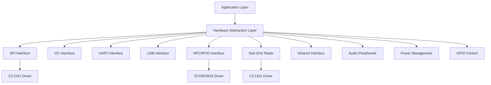
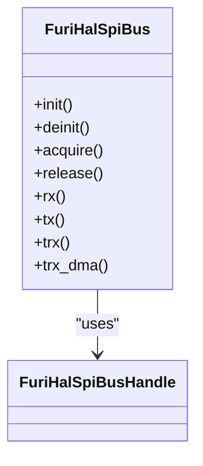
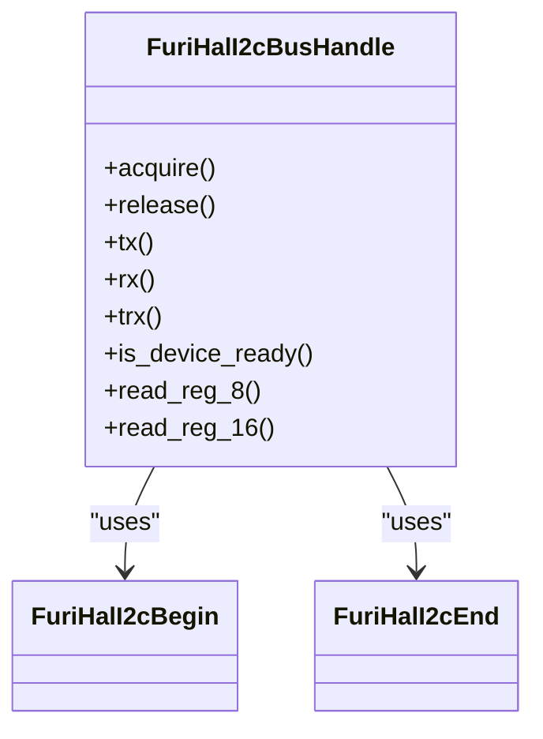
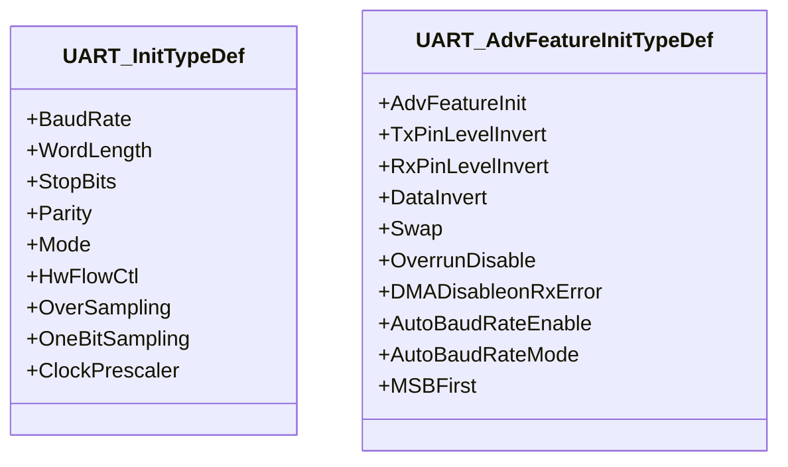
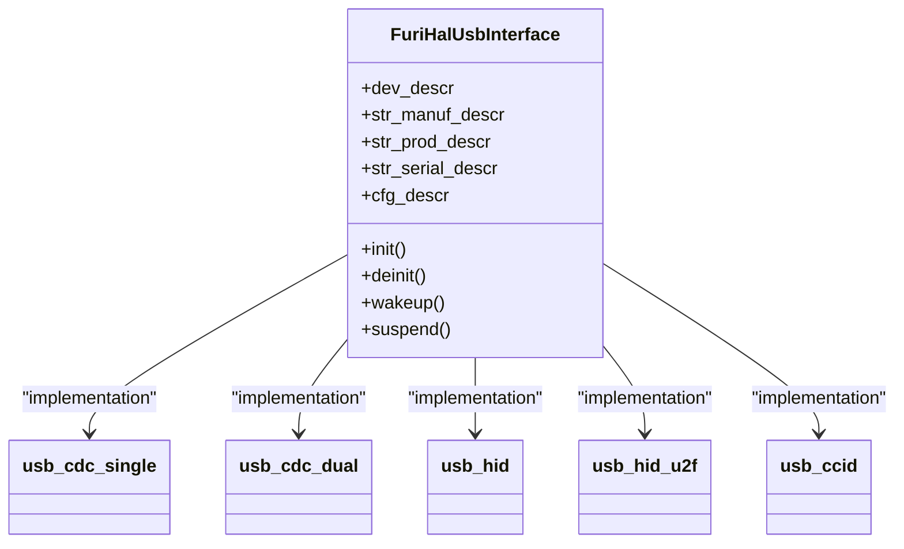
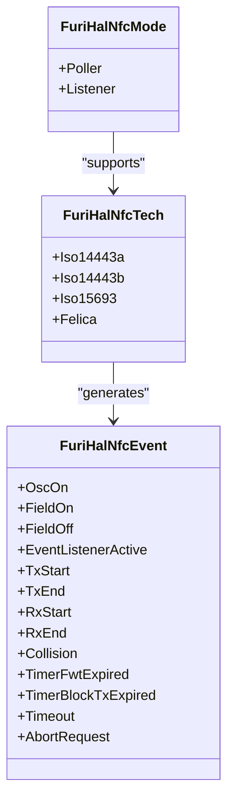
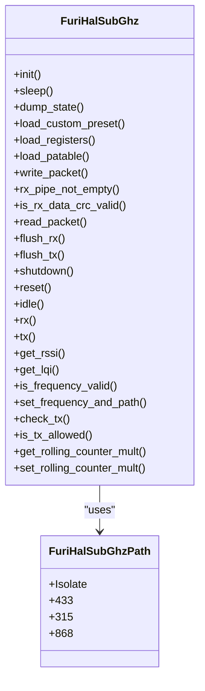
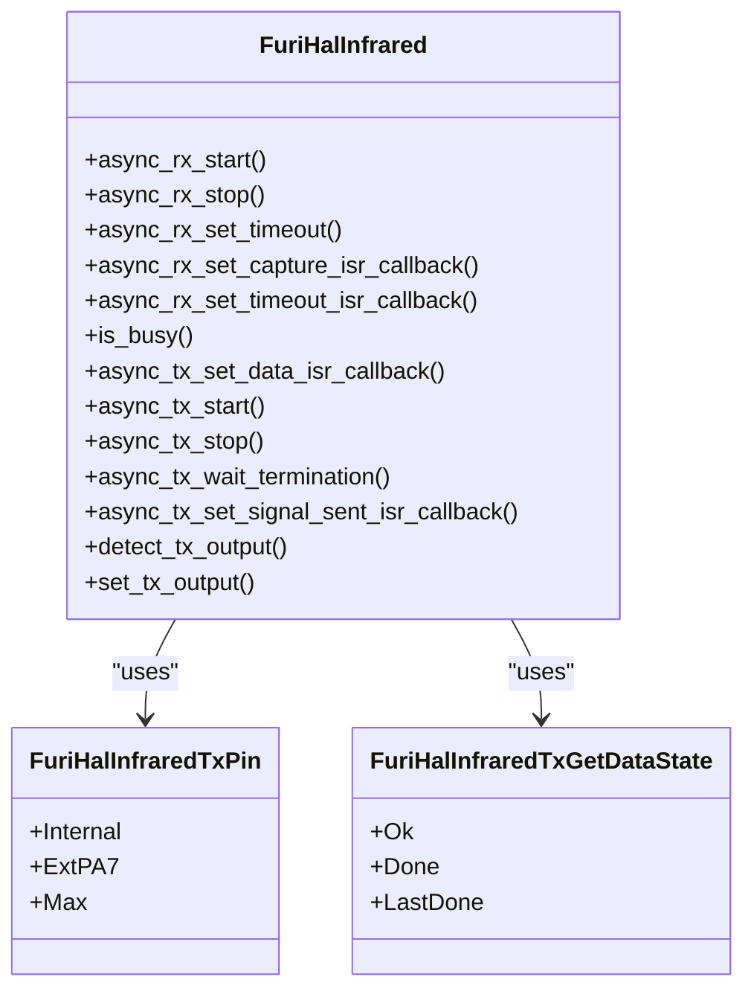
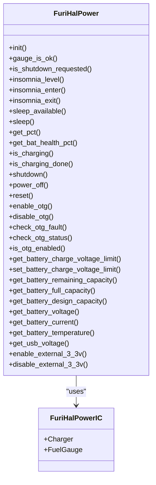

# Hardware Specifications

<cite>
**Referenced Files in This Document**   
- [furi_hal.h](file://targets/furi_hal_include/furi_hal.h)
- [furi_hal_spi.h](file://targets/furi_hal_include/furi_hal_spi.h)
- [furi_hal_i2c.h](file://targets/furi_hal_include/furi_hal_i2c.h)
- [stm32wbxx_hal_uart.h](file://lib/stm32wb_hal/Inc/stm32wbxx_hal_uart.h)
- [furi_hal_usb.h](file://targets/furi_hal_include/furi_hal_usb.h)
- [furi_hal_nfc.h](file://targets/furi_hal_include/furi_hal_nfc.h)
- [furi_hal_infrared.h](file://targets/furi_hal_include/furi_hal_infrared.h)
- [furi_hal_speaker.h](file://targets/furi_hal_include/furi_hal_speaker.h)
- [furi_hal_power.h](file://targets/furi_hal_include/furi_hal_power.h)
- [furi_hal_subghz.h](file://targets/f7/furi_hal/furi_hal_subghz.h)
- [cc1101.h](file://lib/drivers/cc1101.h)
- [st25r3916.h](file://lib/drivers/st25r3916.h)
</cite>

## Table of Contents
1. [Introduction](#introduction)
2. [Hardware Abstraction Layer Architecture](#hardware-abstraction-layer-architecture)
3. [GPIO Interface](#gpio-interface)
4. [SPI Interface](#spi-interface)
5. [I2C Interface](#i2c-interface)
6. [UART Interface](#uart-interface)
7. [USB Interface](#usb-interface)
8. [NFC/RFID Interface](#nfc-rfid-interface)
9. [Sub-GHz Radio Interface](#sub-ghz-radio-interface)
10. [Infrared Interface](#infrared-interface)
11. [Audio Peripherals](#audio-peripherals)
12. [Power Management](#power-management)
13. [Electrical Characteristics](#electrical-characteristics)
14. [Hardware Revision Differences](#hardware-revision-differences)

## Introduction
The Flipper Zero is a multi-functional portable device designed for hardware and software experimentation, security research, and embedded development. This document provides comprehensive hardware specifications for the Flipper Zero device, detailing all hardware interfaces, electrical characteristics, and the hardware abstraction layer (HAL) architecture that enables software to interact with physical hardware components. The device integrates multiple wireless communication protocols including NFC, RFID, Sub-GHz radio, infrared, and Bluetooth, along with various sensors and user interface elements.

**Section sources**
- [furi_hal.h](file://targets/furi_hal_include/furi_hal.h#L1-L79)

## Hardware Abstraction Layer Architecture
The Flipper Zero firmware implements a comprehensive Hardware Abstraction Layer (HAL) that provides a consistent interface between the software applications and the underlying hardware components. This architecture enables application developers to interact with hardware peripherals without needing to understand the low-level details of each component.

The HAL is organized into specialized modules, each responsible for a specific hardware interface or functionality. These modules are exposed through header files in the `targets/furi_hal_include/` directory, which define the API functions, data structures, and constants for each peripheral.

**Diagram sources**
- [furi_hal.h](file://targets/furi_hal_include/furi_hal.h#L1-L79)

**Section sources**
- [furi_hal.h](file://targets/furi_hal_include/furi_hal.h#L1-L79)

## GPIO Interface
The GPIO (General Purpose Input/Output) interface on the Flipper Zero provides programmable digital pins for various input and output functions. While the specific GPIO pin definitions are not directly available in the provided files, the HAL architecture indicates that GPIO functionality is integrated into the system through the `furi_hal_gpio.h` header, which is included in the main HAL header.

The GPIO system supports standard digital input and output operations, with pins configurable as inputs with pull-up or pull-down resistors, or as outputs with push-pull or open-drain configurations. GPIO pins are used for various purposes including button inputs, LED control, and interfacing with external devices through the expansion port.

The infrared subsystem specifically references GPIO functionality through the inclusion of `furi_hal_gpio.h`, indicating that GPIO pins are used for infrared signal transmission and reception.

**Section sources**
- [furi_hal.h](file://targets/furi_hal_include/furi_hal.h#L1-L79)
- [furi_hal_subghz.h](file://targets/f7/furi_hal/furi_hal_subghz.h#L1-L258)
- [furi_hal_infrared.h](file://targets/furi_hal_include/furi_hal_infrared.h#L1-L178)

## SPI Interface
The SPI (Serial Peripheral Interface) is a synchronous serial communication interface used for high-speed communication with peripheral devices. The Flipper Zero implements SPI through the `furi_hal_spi` module, which provides a complete API for SPI bus management and data transfer.

**Diagram sources**
- [furi_hal_spi.h](file://targets/furi_hal_include/furi_hal_spi.h#L1-L129)

**Section sources**
- [furi_hal_spi.h](file://targets/furi_hal_include/furi_hal_spi.h#L1-L129)

The SPI interface supports the following features:
- **Bus Management**: Functions to initialize, deinitialize, acquire, and release the SPI bus
- **Data Transfer**: Full-duplex and half-duplex communication with configurable timeout
- **DMA Support**: Direct Memory Access for efficient data transfer without CPU intervention
- **Synchronous Operations**: Blocking calls with timeout parameters for reliable communication

Key functions include:
- `furi_hal_spi_bus_init()`: Initialize the SPI bus
- `furi_hal_spi_acquire()`: Acquire exclusive access to the SPI bus
- `furi_hal_spi_bus_tx()`: Transmit data over SPI
- `furi_hal_spi_bus_rx()`: Receive data over SPI
- `furi_hal_spi_bus_trx()`: Simultaneously transmit and receive data
- `furi_hal_spi_bus_trx_dma()`: DMA-based transmit and receive operation

The SPI interface operates with standard SPI modes and supports various clock speeds, with timing controlled by the underlying STM32WB microcontroller's SPI peripheral.

## I2C Interface
The I2C (Inter-Integrated Circuit) interface is a multi-master, multi-slave, packet-switched, single-ended, serial communication bus used for connecting low-speed peripherals. The Flipper Zero implements I2C through the `furi_hal_i2c` module.

**Diagram sources**
- [furi_hal_i2c.h](file://targets/furi_hal_include/furi_hal_i2c.h#L1-L288)

**Section sources**
- [furi_hal_i2c.h](file://targets/furi_hal_include/furi_hal_i2c.h#L1-L288)

The I2C interface supports:
- **Standard and Fast Mode**: Operation at 100kHz and 400kHz clock speeds
- **7-bit and 10-bit Addressing**: Support for both standard 7-bit and extended 10-bit slave addresses
- **Combined Transactions**: Support for combined write/read operations in a single transaction
- **Flexible Transaction Control**: Options to control START, RESTART, and STOP conditions

Key functions include:
- `furi_hal_i2c_init()`: Initialize the I2C hardware
- `furi_hal_i2c_acquire()`: Acquire exclusive access to the I2C bus
- `furi_hal_i2c_tx()`: Transmit data to an I2C slave
- `furi_hal_i2c_rx()`: Receive data from an I2C slave
- `furi_hal_i2c_trx()`: Combined transmit and receive operation
- `furi_hal_i2c_is_device_ready()`: Check if an I2C device is present and ready
- `furi_hal_i2c_read_reg_8()`: Read an 8-bit register from an I2C device

The interface also provides extended functions (`furi_hal_i2c_tx_ext`, `furi_hal_i2c_rx_ext`) that allow fine-grained control over transaction sequencing, including the ability to use RESTART conditions and pause transactions for clock stretching.

## UART Interface
The UART (Universal Asynchronous Receiver-Transmitter) interface on the Flipper Zero is implemented using the STM32WB microcontroller's hardware UART peripherals. The implementation is based on the STM32 HAL UART library, which provides a comprehensive API for asynchronous serial communication.

**Diagram sources**
- [stm32wbxx_hal_uart.h](file://lib/stm32wb_hal/Inc/stm32wbxx_hal_uart.h#L1-L199)

**Section sources**
- [stm32wbxx_hal_uart.h](file://lib/stm32wb_hal/Inc/stm32wbxx_hal_uart.h#L1-L199)

The UART interface supports the following specifications:
- **Configurable Baud Rates**: From standard rates (9600, 115200) up to several megabaud
- **Data Formats**: 7, 8, or 9 data bits with various parity options (none, even, odd)
- **Stop Bits**: 1 or 2 stop bits
- **Flow Control**: Hardware flow control (RTS/CTS) support
- **Advanced Features**: 
  - Pin level inversion
  - Data inversion
  - RX/TX pin swapping
  - Overrun detection disable
  - DMA disable on RX error
  - Auto baud rate detection
  - MSB-first transmission

The UART implementation also supports advanced features such as one-bit sampling for improved noise immunity and clock prescaling for flexible baud rate generation. The interface can operate with or without DMA for efficient data transfer.

## USB Interface
The USB (Universal Serial Bus) interface on the Flipper Zero provides connectivity for charging, data transfer, and device emulation. The device supports multiple USB modes through a configurable interface system.

**Diagram sources**
- [furi_hal_usb.h](file://targets/furi_hal_include/furi_hal_usb.h#L1-L93)

**Section sources**
- [furi_hal_usb.h](file://targets/furi_hal_include/furi_hal_usb.h#L1-L93)

The USB system supports the following modes:
- **CDC Single**: USB Communication Device Class with a single virtual COM port
- **CDC Dual**: USB CDC with two virtual COM ports
- **HID**: Human Interface Device mode for emulating keyboards, mice, etc.
- **HID U2F**: HID mode with Universal 2nd Factor authentication support
- **CCID**: Chip/Smart Card Interface Device for smart card emulation

Key functions include:
- `furi_hal_usb_init()`: Initialize the USB hardware
- `furi_hal_usb_set_config()`: Set the USB device configuration and mode
- `furi_hal_usb_get_config()`: Get the current USB configuration
- `furi_hal_usb_lock()`: Lock the USB configuration to prevent changes
- `furi_hal_usb_unlock()`: Unlock the USB configuration
- `furi_hal_usb_is_locked()`: Check if USB configuration is locked
- `furi_hal_usb_disable()`: Disable USB functionality
- `furi_hal_usb_enable()`: Enable USB functionality
- `furi_hal_usb_set_state_callback()`: Set a callback for USB state changes
- `furi_hal_usb_reinit()`: Restart the USB device

The USB interface also supports state callbacks for events such as reset, wakeup, suspend, and descriptor requests, allowing applications to respond to USB state changes.

## NFC/RFID Interface
The NFC/RFID interface on the Flipper Zero is implemented using the ST25R3916 NFC/RFID front-end controller, which supports multiple contactless communication protocols. The interface is managed through the `furi_hal_nfc` module.

**Diagram sources**
- [furi_hal_nfc.h](file://targets/furi_hal_include/furi_hal_nfc.h#L1-L199)
- [st25r3916.h](file://lib/drivers/st25r3916.h)

**Section sources**
- [furi_hal_nfc.h](file://targets/furi_hal_include/furi_hal_nfc.h#L1-L199)

The NFC/RFID interface supports the following technologies:
- **ISO14443 Type A**: Standard for proximity cards (e.g., MIFARE)
- **ISO14443 Type B**: Alternative proximity card standard
- **ISO15693**: Standard for vicinity cards with longer range
- **FeliCa**: Japanese contactless IC card system

The interface operates in two primary modes:
- **Poller Mode**: The Flipper Zero acts as a reader to communicate with contactless cards
- **Listener Mode**: The Flipper Zero acts as a card to be read by external readers

Key specifications:
- **Carrier Frequency**: 13.56 MHz (FURI_HAL_NFC_CARRIER_HZ)
- **Operating Modes**: Poller and Listener
- **Event System**: Comprehensive event notification for state changes
- **Error Handling**: Detailed error codes for troubleshooting

Key functions include:
- `furi_hal_nfc_init()`: Initialize the NFC hardware
- `furi_hal_nfc_acquire()`: Acquire exclusive access to the NFC hardware
- `furi_hal_nfc_release()`: Release NFC hardware access
- `furi_hal_nfc_low_power_mode_start()`: Enter low-power mode
- `furi_hal_nfc_low_power_mode_stop()`: Exit low-power mode
- `furi_hal_nfc_set_mode()`: Configure operating mode and technology
- `furi_hal_nfc_reset_mode()`: Reset to default unconfigured state
- `furi_hal_nfc_field_detect_start()`: Enable field detection
- `furi_hal_nfc_field_detect_stop()`: Disable field detection
- `furi_hal_nfc_field_is_present()`: Check for external field
- `furi_hal_nfc_poller_field_on()`: Enable carrier generation

The interface provides detailed event notifications for various states including oscillator status, field detection, transmission/reception events, collisions, and timeouts.

## Sub-GHz Radio Interface
The Sub-GHz radio interface on the Flipper Zero is implemented using the CC1101 transceiver, which supports multiple frequency bands and modulation schemes. The interface is managed through the `furi_hal_subghz` module and the CC1101 driver.

**Diagram sources**
- [furi_hal_subghz.h](file://targets/f7/furi_hal/furi_hal_subghz.h#L1-L199)
- [cc1101.h](file://lib/drivers/cc1101.h#L1-L196)

**Section sources**
- [furi_hal_subghz.h](file://targets/f7/furi_hal/furi_hal_subghz.h#L1-L199)
- [cc1101.h](file://lib/drivers/cc1101.h#L1-L196)

The Sub-GHz radio supports the following frequency bands:
- **433 MHz**: Common ISM band in Europe and Asia
- **315 MHz**: Common ISM band in North America
- **868 MHz**: European ISM band

Key features:
- **Frequency Range**: Supports frequencies from 300-928 MHz
- **Modulation Schemes**: FSK, GFSK, ASK, OOK
- **Data Rates**: Up to 600 kbps
- **Output Power**: Configurable up to +10 dBm
- **Sensitivity**: Down to -110 dBm
- **RSSI Measurement**: Received Signal Strength Indicator
- **LQI Measurement**: Link Quality Indicator

The interface provides both low-level and high-level functions:
- **Low-level CC1101 Driver**: Direct register access and control
- **High-level Sub-GHz HAL**: Abstracted functions for common operations

Key functions include:
- `furi_hal_subghz_init()`: Initialize the Sub-GHz radio
- `furi_hal_subghz_sleep()`: Put the radio in sleep mode
- `furi_hal_subghz_set_frequency_and_path()`: Set operating frequency and antenna path
- `furi_hal_subghz_tx()`: Switch to transmit mode
- `furi_hal_subghz_rx()`: Switch to receive mode
- `furi_hal_subghz_idle()`: Switch to idle mode
- `furi_hal_subghz_write_packet()`: Write data to the transmit FIFO
- `furi_hal_subghz_read_packet()`: Read data from the receive FIFO
- `furi_hal_subghz_get_rssi()`: Get received signal strength
- `furi_hal_subghz_get_lqi()`: Get link quality indicator
- `furi_hal_subghz_is_frequency_valid()`: Check if frequency is valid
- `furi_hal_subghz_is_tx_allowed()`: Check if transmission is allowed on a frequency

The CC1101 driver provides additional low-level functions for direct hardware control:
- `cc1101_strobe()`: Send strobe commands to the device
- `cc1101_write_reg()`: Write to device registers
- `cc1101_read_reg()`: Read from device registers
- `cc1101_reset()`: Reset the device
- `cc1101_set_frequency()`: Set the operating frequency
- `cc1101_set_pa_table()`: Configure power amplifier levels
- `cc1101_write_fifo()`: Write to the FIFO buffer
- `cc1101_read_fifo()`: Read from the FIFO buffer

## Infrared Interface
The infrared interface on the Flipper Zero supports both transmission and reception of infrared signals for remote control emulation and analysis. The interface is managed through the `furi_hal_infrared` module.

**Diagram sources**
- [furi_hal_infrared.h](file://targets/furi_hal_include/furi_hal_infrared.h#L1-L178)

**Section sources**
- [furi_hal_infrared.h](file://targets/furi_hal_include/furi_hal_infrared.h#L1-L178)

The infrared interface supports:
- **Frequency Range**: 10 kHz to 1 MHz (INFRARED_MIN_FREQUENCY to INFRARED_MAX_FREQUENCY)
- **Dual Transmission Outputs**: Internal IR LED and external PA7 pin
- **Asynchronous Operation**: DMA-based transmission and reception
- **Flexible Data Supply**: Callback-based data provision for transmission
- **Signal Capture**: Edge detection with duration measurement for reception

Key functions include:
- `furi_hal_infrared_async_rx_start()`: Start asynchronous IR reception
- `furi_hal_infrared_async_rx_stop()`: Stop IR reception
- `furi_hal_infrared_async_rx_set_capture_isr_callback()`: Set callback for signal capture
- `furi_hal_infrared_async_rx_set_timeout_isr_callback()`: Set callback for silence timeout
- `furi_hal_infrared_async_tx_set_data_isr_callback()`: Set callback for transmission data
- `furi_hal_infrared_async_tx_start()`: Start asynchronous IR transmission
- `furi_hal_infrared_async_tx_stop()`: Stop IR transmission
- `furi_hal_infrared_async_tx_wait_termination()`: Wait for transmission completion
- `furi_hal_infrared_detect_tx_output()`: Detect connected external IR module
- `furi_hal_infrared_set_tx_output()`: Set transmission output pin

The interface uses a callback-based system for efficient operation:
- **Transmission**: The system calls a user-provided callback function to obtain data for transmission
- **Reception**: The system calls a user-provided callback function when signal edges are detected

The interface supports automatic detection of external IR modules by enabling a weak pull-up on supported pins and testing the input state.

## Audio Peripherals
The audio peripherals on the Flipper Zero include a speaker for sound generation and associated control circuitry. The interface is managed through the `furi_hal_speaker` module.

**Diagram sources**
- [furi_hal_speaker.h](file://targets/furi_hal_include/furi_hal_speaker.h#L1-L69)

**Section sources**
- [furi_hal_speaker.h](file://targets/furi_hal_include/furi_hal_speaker.h#L1-L69)

The audio system supports:
- **Tone Generation**: Play musical notes at specific frequencies
- **Volume Control**: Adjustable volume levels
- **Resource Management**: Ownership-based access control

Key functions include:
- `furi_hal_speaker_init()`: Initialize the speaker hardware
- `furi_hal_speaker_deinit()`: Deinitialize the speaker hardware
- `furi_hal_speaker_acquire()`: Acquire ownership of the speaker
- `furi_hal_speaker_release()`: Release speaker ownership
- `furi_hal_speaker_is_mine()`: Check if current process owns the speaker
- `furi_hal_speaker_start()`: Start playing a tone at a specific frequency and volume
- `furi_hal_speaker_set_volume()`: Set the playback volume
- `furi_hal_speaker_stop()`: Stop audio playback

The speaker system implements a resource ownership model to prevent conflicts when multiple applications attempt to use the speaker simultaneously. Applications must acquire ownership before using the speaker and release it when finished.

## Power Management
The power management system on the Flipper Zero monitors and controls the device's power state, battery status, and charging functions. The interface is managed through the `furi_hal_power` module.

**Diagram sources**
- [furi_hal_power.h](file://targets/furi_hal_include/furi_hal_power.h#L1-L199)

**Section sources**
- [furi_hal_power.h](file://targets/furi_hal_include/furi_hal_power.h#L1-L199)

The power management system provides comprehensive monitoring and control functions:
- **Battery Monitoring**: Voltage, current, temperature, and capacity measurements
- **Charging Control**: Charge voltage limit configuration
- **Power States**: Sleep, shutdown, and reset functions
- **OTG Support**: On-The-Go USB power supply
- **External Power**: Control of 3.3V supply to external GPIO and SD card

Key functions include:
- `furi_hal_power_init()`: Initialize power management hardware
- `furi_hal_power_gauge_is_ok()`: Check if battery gauge is functioning properly
- `furi_hal_power_is_shutdown_requested()`: Check if shutdown is requested
- `furi_hal_power_insomnia_enter()`: Prevent device from sleeping
- `furi_hal_power_insomnia_exit()`: Allow device to sleep
- `furi_hal_power_sleep()`: Enter sleep mode
- `furi_hal_power_get_pct()`: Get battery charge percentage
- `furi_hal_power_get_bat_health_pct()`: Get battery health percentage
- `furi_hal_power_is_charging()`: Check if device is charging
- `furi_hal_power_shutdown()`: Shutdown the device
- `furi_hal_power_off()`: Power off the device
- `furi_hal_power_reset()`: Reset the device
- `furi_hal_power_enable_otg()`: Enable OTG power supply
- `furi_hal_power_get_battery_voltage()`: Get battery voltage
- `furi_hal_power_get_battery_current()`: Get battery current
- `furi_hal_power_get_battery_temperature()`: Get battery temperature
- `furi_hal_power_enable_external_3_3v()`: Enable 3.3V to external components

The system implements an "insomnia" mechanism to prevent the device from entering sleep mode when critical operations are in progress. Each call to `furi_hal_power_insomnia_enter()` must be paired with a corresponding call to `furi_hal_power_insomnia_exit()`.

## Electrical Characteristics
The Flipper Zero operates with the following electrical characteristics:

**Power Supply**
- **Battery**: 3.7V nominal lithium-ion/polymer battery
- **Operating Voltage Range**: 3.0V to 4.2V
- **Charging Voltage**: 4.2V (configurable with `furi_hal_power_set_battery_charge_voltage_limit()`)
- **External 3.3V Supply**: Provided to GPIO and SD card when enabled

**Current Consumption**
- **Sleep Mode**: Minimal current draw (exact value not specified in available documentation)
- **Active Mode**: Varies based on active peripherals
- **Transmitting**: Higher current draw during RF transmission
- **Charging**: Current determined by charger and battery state

**Signal Levels**
- **GPIO**: 3.3V logic levels
- **SPI**: 3.3V signaling
- **I2C**: 3.3V signaling with pull-up resistors
- **UART**: 3.3V signaling

**Interface Specifications**
- **SPI**: Up to 8MHz clock speed (limited by STM32WB SPI peripheral)
- **I2C**: 100kHz standard mode, 400kHz fast mode
- **UART**: Up to 4.5Mbps (limited by STM32WB UART peripheral)
- **USB**: Full-speed (12Mbps) USB 2.0
- **NFC**: 13.56MHz carrier frequency
- **Sub-GHz**: 300-928MHz frequency range, up to +10dBm output power
- **Infrared**: 10kHz to 1MHz modulation frequency

**Thermal Characteristics**
- **Operating Temperature**: Not explicitly specified in available documentation
- **Battery Temperature Monitoring**: Available through `furi_hal_power_get_battery_temperature()`

**Section sources**
- [furi_hal_power.h](file://targets/furi_hal_include/furi_hal_power.h#L1-L199)
- [furi_hal_spi.h](file://targets/furi_hal_include/furi_hal_spi.h#L1-L129)
- [furi_hal_i2c.h](file://targets/furi_hal_include/furi_hal_i2c.h#L1-L288)
- [stm32wbxx_hal_uart.h](file://lib/stm32wb_hal/Inc/stm32wbxx_hal_uart.h#L1-L199)

## Hardware Revision Differences
Based on the available documentation, specific details about hardware revision differences are not explicitly provided. However, the presence of target-specific directories (`f18`, `f7`) in the `targets` directory suggests that the firmware supports multiple hardware revisions or variants of the Flipper Zero device.

The `f7` target likely corresponds to the main Flipper Zero hardware platform based on the STM32WB microcontroller, while the `f18` target may represent an alternative or development platform. The `furi_hal_include` directory contains header files that appear to be common across hardware revisions, while target-specific implementations are located in the respective target directories.

The modular HAL architecture allows for hardware-specific implementations while maintaining a consistent API for application developers. This design enables the same firmware to support multiple hardware revisions with minimal changes to application code.

Future hardware revisions might include changes to:
- **RF Components**: Different Sub-GHz transceivers or NFC front-ends
- **Power Management**: Updated charger or fuel gauge ICs
- **Peripheral Interfaces**: Additional GPIO pins or interface enhancements
- **Sensors**: Additional or upgraded sensors

The HAL abstraction layer would accommodate these changes by providing hardware-specific implementations while maintaining the same interface for applications.

**Section sources**
- [furi_hal.h](file://targets/furi_hal_include/furi_hal.h#L1-L79)
- [targets/f7](file://targets/f7)
- [targets/f18](file://targets/f18)