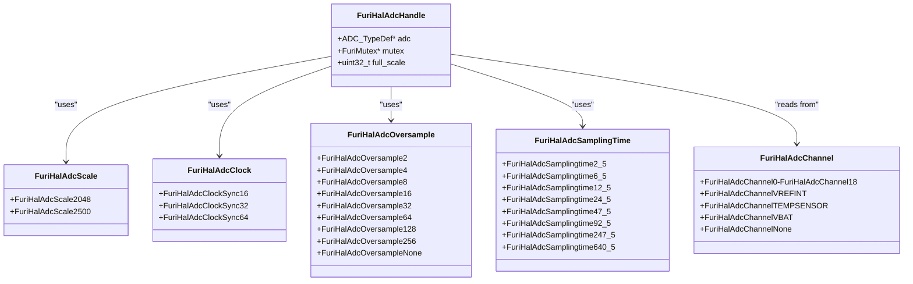
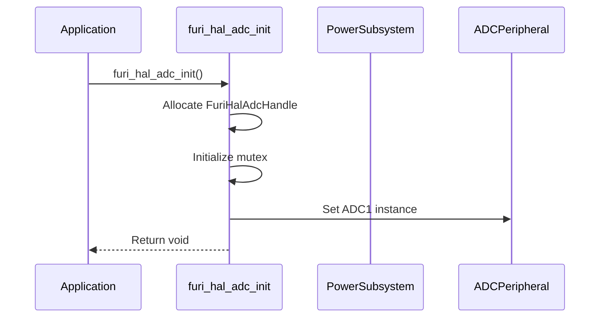
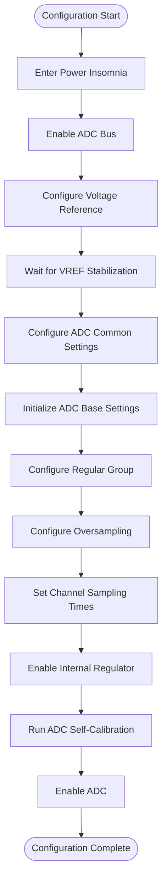
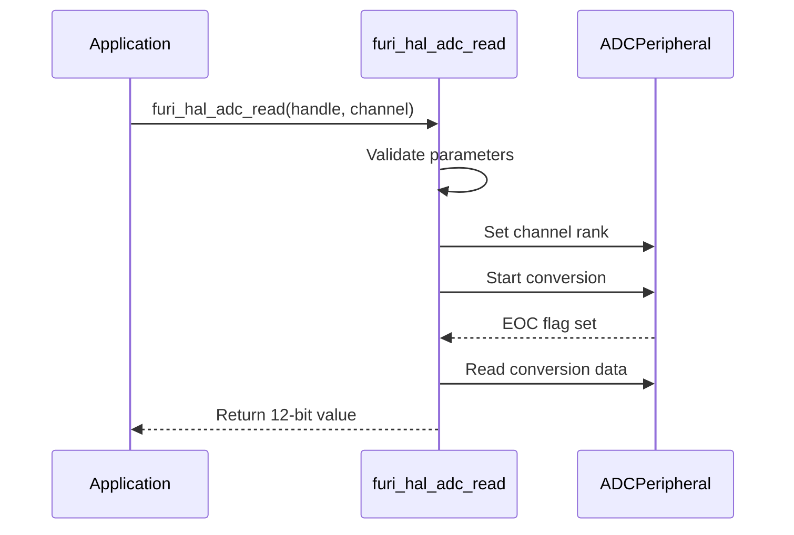
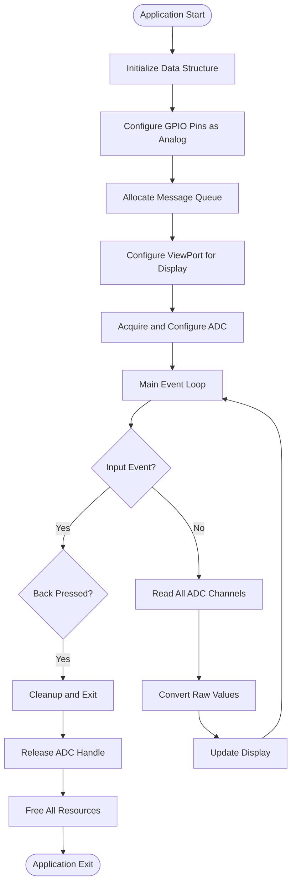

# ADC Specifications

<cite>
**Referenced Files in This Document**   
- [furi_hal_adc.h](file://targets/furi_hal_include/furi_hal_adc.h)
- [furi_hal_adc.c](file://targets/f7/furi_hal/furi_hal_adc.c)
- [example_adc.c](file://applications/examples/example_adc/example_adc.c)
</cite>

## Table of Contents
1. [Introduction](#introduction)
2. [ADC Hardware Specifications](#adc-hardware-specifications)
3. [ADC Driver Architecture](#adc-driver-architecture)
4. [Initialization and Configuration](#initialization-and-configuration)
5. [Channel Configuration and Usage](#channel-configuration-and-usage)
6. [Data Acquisition Process](#data-acquisition-process)
7. [Practical Usage Examples](#practical-usage-examples)
8. [Performance Considerations](#performance-considerations)
9. [Conclusion](#conclusion)

## Introduction

The Analog-to-Digital Converter (ADC) peripheral on the Flipper Zero device provides a comprehensive interface for reading analog signals from various sources. This documentation details the ADC's specifications, implementation, and usage patterns within the Flipper Zero firmware. The ADC subsystem is designed to balance precision, power efficiency, and ease of use while providing access to both external signals and internal sensors.

The ADC implementation follows a hardware abstraction layer (HAL) pattern, providing a simplified interface to the underlying STM32WB series microcontroller's ADC capabilities. The documentation covers the complete ADC workflow from initialization to data conversion, including configuration options, channel management, and practical usage examples.

**Section sources**
- [furi_hal_adc.h](file://targets/furi_hal_include/furi_hal_adc.h#L1-L50)

## ADC Hardware Specifications

### Resolution and Effective Performance
The ADC peripheral on the Flipper Zero features a 12-bit resolution, providing 4096 discrete digital values for analog signal representation. However, the effective number of bits (ENOB) is approximately 10 bits under optimal conditions, with actual performance depending on configuration and usage patterns.

### Voltage Reference and Input Ranges
The ADC uses an internal on-chip voltage reference system that provides two selectable voltage scales:
- **2.048V scale**: Primary operating range for most applications
- **2.5V scale**: Alternative range for higher voltage signals

The analog domain is powered by a Switched-Mode Power Supply (SMPS) which introduces noise into the system. To mitigate this, the internal voltage reference ensures consistent scaling regardless of power supply fluctuations.

### Sampling Characteristics
The ADC supports various sampling configurations that affect both accuracy and conversion time:

**Sampling Time Options:**
- 2.5 ADC clock cycles (fastest)
- 6.5 ADC clock cycles
- 12.5 ADC clock cycles
- 24.5 ADC clock cycles
- 47.5 ADC clock cycles
- 92.5 ADC clock cycles
- 247.5 ADC clock cycles
- 640.5 ADC clock cycles (slowest)

**Oversampling Ratios:**
- 2 samples per value
- 4 samples per value
- 8 samples per value
- 16 samples per value
- 32 samples per value
- 64 samples per value
- 128 samples per value
- 256 samples per value
- Oversampling disabled

**Clock Settings:**
- 16MHz synchronous
- 32MHz synchronous
- 64MHz synchronous

The default configuration uses 64MHz clock with 64x oversampling and 247.5 clock cycles of sampling time, resulting in approximately 260μs per conversion.

**Section sources**
- [furi_hal_adc.h](file://targets/furi_hal_include/furi_hal_adc.h#L50-L150)

## ADC Driver Architecture

### Software Abstraction Layer
The ADC driver implements a hardware abstraction layer that simplifies interaction with the underlying STM32WB ADC peripheral. The architecture follows a handle-based pattern where resources are acquired and released explicitly.



**Diagram sources**
- [furi_hal_adc.h](file://targets/furi_hal_include/furi_hal_adc.h#L50-L190)

### Data Structures
The primary data structure is `FuriHalAdcHandle`, which encapsulates the ADC state:

- **adc**: Pointer to the ADC1 peripheral register structure
- **mutex**: Mutex for thread-safe access to the ADC
- **full_scale**: Stores the current voltage scale in millivolts (2048 or 2500)

This structure enables multiple components to safely share the ADC resource through proper acquisition and release mechanisms.

**Section sources**
- [furi_hal_adc.c](file://targets/f7/furi_hal/furi_hal_adc.c#L10-L30)

## Initialization and Configuration

### Initialization Sequence
The ADC subsystem initialization follows a specific sequence to ensure proper operation:



**Diagram sources**
- [furi_hal_adc.c](file://targets/f7/furi_hal/furi_hal_adc.c#L150-L160)

### Configuration Process
The configuration process involves multiple steps to prepare the ADC for operation:



**Diagram sources**
- [furi_hal_adc.c](file://targets/f7/furi_hal/furi_hal_adc.c#L200-L280)

### Configuration Functions
Two configuration functions are provided:

- **furi_hal_adc_configure**: Applies default parameters optimized for 0-2.048V measurements with ~0.1% precision
- **furi_hal_adc_configure_ex**: Allows custom configuration with specific parameters

The default configuration uses:
- 2.048V voltage scale
- 64MHz synchronous clock
- 64x oversampling
- 247.5 ADC clock cycles sampling time

This configuration is optimized for circuits with slowly changing signals and impedance under 10kΩ.

**Section sources**
- [furi_hal_adc.c](file://targets/f7/furi_hal/furi_hal_adc.c#L200-L280)

## Channel Configuration and Usage

### Channel Types
The ADC supports multiple channel types organized into categories:

**Fast Channels (0-5):**
- FuriHalAdcChannel0: Internal channel (VREFINT)
- FuriHalAdcChannel1: Channel 1p
- FuriHalAdcChannel2: Channel 2p or 1n
- FuriHalAdcChannel3: Channel 3p or 2n
- FuriHalAdcChannel4: Channel 4p or 3n
- FuriHalAdcChannel5: Channel 5p or 4n

**Slow Channels (6-18):**
- FuriHalAdcChannel6: Channel 6p or 5n
- FuriHalAdcChannel7: Channel 7p or 6n
- FuriHalAdcChannel8: Channel 8p or 7n
- FuriHalAdcChannel9: Channel 9p or 8n
- FuriHalAdcChannel10: Channel 10p or 9n
- FuriHalAdcChannel11: Channel 11p or 10n
- FuriHalAdcChannel12: Channel 12p or 11n
- FuriHalAdcChannel13: Channel 13p or 12n
- FuriHalAdcChannel14: Channel 14p or 13n
- FuriHalAdcChannel15: Channel 15p or 14n
- FuriHalAdcChannel16: Channel 16p or 15n

**Internal Channels:**
- FuriHalAdcChannel17: On-die temperature sensor (requires ≥5μs sampling time)
- FuriHalAdcChannel18: VBAT/3 voltage (requires ≥12μs sampling time)

**Special Channels:**
- FuriHalAdcChannelVREFINT: VREFINT for calibration
- FuriHalAdcChannelTEMPSENSOR: Temperature sensor
- FuriHalAdcChannelVBAT: Battery voltage
- FuriHalAdcChannelNone: No channel indicator

### Channel Configuration
All channels are configured during initialization with the specified sampling time and single-ended mode. The channel mapping is handled through a lookup table that translates the FuriHalAdcChannel enum to the corresponding LL_ADC_CHANNEL constant.

**Section sources**
- [furi_hal_adc.h](file://targets/furi_hal_include/furi_hal_adc.h#L100-L150)
- [furi_hal_adc.c](file://targets/f7/furi_hal/furi_hal_adc.c#L50-L80)

## Data Acquisition Process

### Reading Sequence
The data acquisition process follows a strict sequence to ensure accurate readings:



**Diagram sources**
- [furi_hal_adc.c](file://targets/f7/furi_hal/furi_hal_adc.c#L250-L270)

### Conversion Functions
The driver provides several conversion functions to translate raw ADC values to meaningful units:

- **furi_hal_adc_convert_to_voltage**: Converts raw value to millivolts based on current scale
- **furi_hal_adc_convert_vref**: Converts VREFINT reading to millivolts
- **furi_hal_adc_convert_temp**: Converts temperature sensor reading to Celsius
- **furi_hal_adc_convert_vbat**: Converts VBAT reading to millivolts (multiplies by 3)

These functions use the STM32WB LL ADC calculation macros to ensure accuracy and consistency.

**Section sources**
- [furi_hal_adc.c](file://targets/f7/furi_hal/furi_hal_adc.c#L270-L280)

## Practical Usage Examples

### Complete Usage Pattern
The recommended usage pattern for ADC operations:

```c
// Initialize GPIO pin for analog input
furi_hal_gpio_init(pin, GpioModeAnalog, GpioPullNo, GpioSpeedLow);

// Acquire ADC handle
FuriHalAdcHandle* adc_handle = furi_hal_adc_acquire();

// Configure ADC (default or extended)
furi_hal_adc_configure(adc_handle);

// Read value from specific channel
uint16_t raw_value = furi_hal_adc_read(adc_handle, channel);

// Convert to meaningful units
float voltage = furi_hal_adc_convert_to_voltage(adc_handle, raw_value);

// Release ADC handle
furi_hal_adc_release(adc_handle);
```

### Example Application Analysis
The example_adc.c application demonstrates practical usage:



**Diagram sources**
- [example_adc.c](file://applications/examples/example_adc/example_adc.c#L100-L170)

The example application reads from all available ADC channels, including special internal channels for VREF, temperature, and battery voltage, and displays the results on the screen.

**Section sources**
- [example_adc.c](file://applications/examples/example_adc/example_adc.c#L1-L177)

## Performance Considerations

### Noise Mitigation
Due to the noisy SMPS power supply, the ADC implementation employs several noise mitigation techniques:

- Internal voltage reference for stable scaling
- Oversampling to improve effective resolution
- Appropriate sampling times for different circuit impedances
- Dedicated power sequencing and stabilization delays

For optimal results, external circuits should have impedance under 10kΩ, and signals should remain stable during the entire conversion period (260μs for default configuration).

### Power Management
The ADC subsystem includes power management features:

- Power insomnia mode during ADC operation to prevent sleep
- Explicit bus enable/disable through furi_hal_bus interface
- Deep power down mode disabled after reset
- Internal voltage regulator enabled only when needed

The furi_hal_power_insomnia_enter() and furi_hal_power_insomnia_exit() functions prevent the system from entering low-power states during ADC operations.

### Timing Constraints
Key timing considerations include:

- VREF stabilization: 500ms maximum wait time
- Internal regulator stabilization: ~30μs
- Calibration time: Varies by conditions
- Conversion time: Depends on configuration (260μs for default)

Applications should account for these timing requirements when designing their ADC usage patterns.

**Section sources**
- [furi_hal_adc.c](file://targets/f7/furi_hal/furi_hal_adc.c#L200-L280)

## Conclusion

The ADC subsystem on the Flipper Zero provides a robust interface for analog signal acquisition with careful attention to noise mitigation and power management. The hardware abstraction layer simplifies usage while exposing critical configuration options for optimization. The 12-bit resolution with effective 10-bit performance, combined with oversampling and internal voltage reference, enables accurate measurements despite the noisy power environment.

Key takeaways for developers:
- Always follow the acquire-configure-read-release pattern
- Use the default configuration for general-purpose measurements
- Consider circuit impedance when selecting sampling parameters
- Account for timing requirements in application design
- Utilize the provided conversion functions for accurate results

The ADC implementation balances simplicity and flexibility, making it accessible for basic usage while allowing advanced configuration for specialized applications.