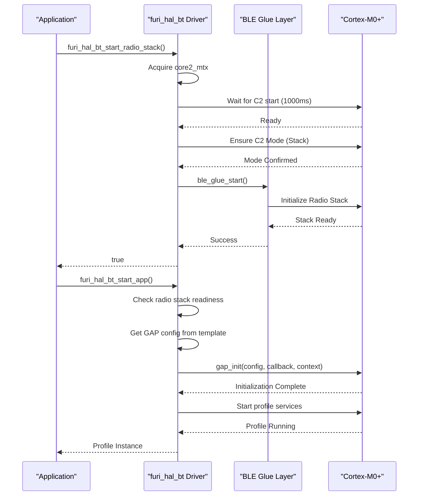
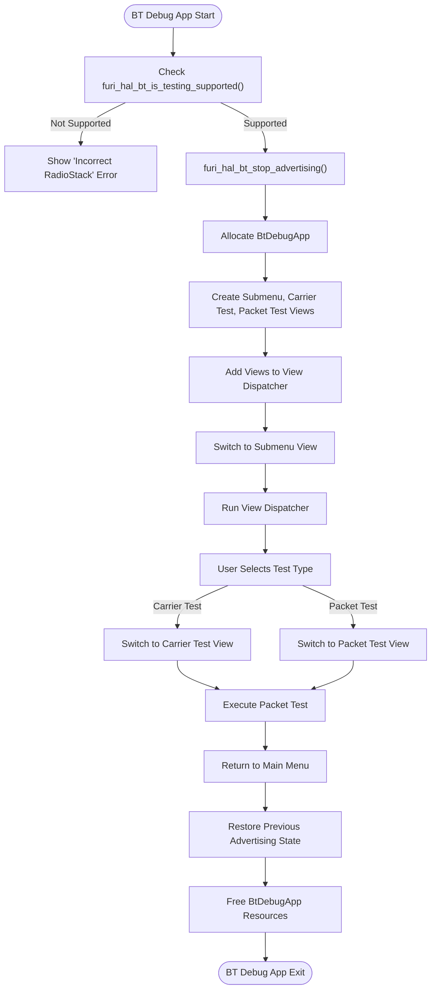

# Bluetooth Specifications

<cite>
**Referenced Files in This Document**   
- [furi_hal_bt.h](file://targets/furi_hal_include/furi_hal_bt.h#L0-L298)
- [furi_hal_bt.c](file://targets/f7/furi_hal/furi_hal_bt.c#L0-L439)
- [bt_debug_app.c](file://applications/debug/bt_debug_app/bt_debug_app.c#L0-L119)
</cite>

## Table of Contents
1. [Introduction](#introduction)
2. [Bluetooth Low Energy Architecture](#bluetooth-low-energy-architecture)
3. [furi_hal_bt Driver Implementation](#furi_hal_bt-driver-implementation)
4. [BLE Stack and Core Interaction](#ble-stack-and-core-interaction)
5. [Advertising and Connection Management](#advertising-and-connection-management)
6. [BLE Testing and Debugging](#ble-testing-and-debugging)
7. [Power Management and Battery Integration](#power-management-and-battery-integration)
8. [Practical Implementation Examples](#practical-implementation-examples)
9. [Performance and Operational Characteristics](#performance-and-operational-characteristics)

## Introduction
The Flipper Zero device implements Bluetooth Low Energy (BLE) functionality through a dual-core architecture utilizing the STM32WB55 microcontroller. This document provides comprehensive technical documentation for the BLE peripheral, covering the Bluetooth version, supported profiles, driver implementation, and practical usage examples. The system employs a sophisticated driver layer (furi_hal_bt) that manages communication between the application processor (Cortex-M4) and the radio core (Cortex-M0+), enabling various BLE operations including advertising, connection management, and data transmission.

**Section sources**
- [furi_hal_bt.h](file://targets/furi_hal_include/furi_hal_bt.h#L0-L298)
- [furi_hal_bt.c](file://targets/f7/furi_hal/furi_hal_bt.c#L0-L439)

## Bluetooth Low Energy Architecture

```mermaid
graph TB
subgraph "Flipper Zero BLE Architecture"
subgraph "Application Processor"
AP[Cortex-M4]
FuriHalBt[furi_hal_bt Driver]
Application[BLE Applications]
end
subgraph "Radio Core"
RP[Cortex-M0+]
BleGlue[BLE Glue Layer]
RadioStack[BLE Radio Stack]
Gap[GAP/GATT Stack]
end
AP < --> |IPCC Communication| RP
FuriHalBt --> |Control Commands| BleGlue
Application --> FuriHalBt
BleGlue --> RadioStack
RadioStack --> Gap
Gap --> |Profile Services| Application
end
```

**Diagram sources**
- [furi_hal_bt.h](file://targets/furi_hal_include/furi_hal_bt.h#L0-L298)
- [furi_hal_bt.c](file://targets/f7/furi_hal/furi_hal_bt.c#L0-L439)

**Section sources**
- [furi_hal_bt.h](file://targets/furi_hal_include/furi_hal_bt.h#L0-L298)
- [furi_hal_bt.c](file://targets/f7/furi_hal/furi_hal_bt.c#L0-L439)

## furi_hal_bt Driver Implementation

The furi_hal_bt driver serves as the hardware abstraction layer for Bluetooth functionality on the Flipper Zero device. Implemented across furi_hal_bt.h and furi_hal_bt.c, this driver provides a comprehensive API for managing BLE operations.

### Initialization and Core Management
The driver initialization sequence begins with `furi_hal_bt_init()`, which enables necessary hardware buses (HSEM, IPCC, AES2, PKA, CRC) and initializes the Core 2 (Cortex-M0+) responsible for radio operations. The driver uses a mutex (`core2_mtx`) to ensure thread-safe access to the radio core, preventing race conditions during mode transitions.

```c
void furi_hal_bt_init(void) {
    furi_hal_bus_enable(FuriHalBusHSEM);
    furi_hal_bus_enable(FuriHalBusIPCC);
    furi_hal_bus_enable(FuriHalBusAES2);
    furi_hal_bus_enable(FuriHalBusPKA);
    furi_hal_bus_enable(FuriHalBusCRC);
    
    furi_hal_bt.core2_mtx = furi_mutex_alloc(FuriMutexTypeNormal);
    ble_glue_init(); // Start Core2
}
```

### Stack Version and Capabilities
The Flipper Zero BLE implementation supports version 1.12 of the Bluetooth stack, as defined by the constants:
- **FURI_HAL_BT_STACK_VERSION_MAJOR**: 1
- **FURI_HAL_BT_STACK_VERSION_MINOR**: 12

The system supports two stack types:
- **FuriHalBtStackLight**: Basic BLE functionality
- **FuriHalBtStackFull**: Full BLE functionality including testing features

The driver provides capability checking functions:
- `furi_hal_bt_is_gatt_gap_supported()`: Returns true if GATT/GAP profiles are supported
- `furi_hal_bt_is_testing_supported()`: Returns true if testing features are available (only in Full stack)

**Section sources**
- [furi_hal_bt.h](file://targets/furi_hal_include/furi_hal_bt.h#L0-L298)
- [furi_hal_bt.c](file://targets/f7/furi_hal/furi_hal_bt.c#L0-L439)

## BLE Stack and Core Interaction



**Diagram sources**
- [furi_hal_bt.c](file://targets/f7/furi_hal/furi_hal_bt.c#L0-L439)
- [furi_hal_bt.h](file://targets/furi_hal_include/furi_hal_bt.h#L0-L298)

**Section sources**
- [furi_hal_bt.c](file://targets/f7/furi_hal/furi_hal_bt.c#L0-L439)

### Radio Stack Initialization
The `furi_hal_bt_start_radio_stack()` function orchestrates the initialization of the BLE radio stack through a well-defined sequence:

1. Acquire the core2 mutex to ensure exclusive access
2. Verify the CLK48 domain ownership using hardware semaphores
3. Wait for Core 2 to start (with 1000ms timeout)
4. Ensure Core 2 is in the correct mode (BleGlueC2ModeStack)
5. Validate radio stack compatibility (version 1.12 or higher)
6. Start the radio stack via `ble_glue_start()`
7. Initialize the extra beacon functionality

The function implements robust error handling with a do-while(false) loop structure, ensuring cleanup operations are performed even when initialization fails.

### Application Management
The driver supports dynamic application management through two key functions:
- `furi_hal_bt_start_app()`: Starts a new BLE application with a specified profile template
- `furi_hal_bt_change_app()`: Changes the current application by restarting Core 2

These functions accept a `FuriHalBleProfileTemplate` parameter that defines the application's configuration, including GAP settings and event callbacks. The driver maintains a reference to the current profile in the `current_profile` static variable.

**Section sources**
- [furi_hal_bt.c](file://targets/f7/furi_hal/furi_hal_bt.c#L0-L439)

## Advertising and Connection Management

### Advertising Control
The furi_hal_bt driver provides explicit control over BLE advertising operations:

- `furi_hal_bt_start_advertising()`: Initiates advertising based on the current profile configuration
- `furi_hal_bt_stop_advertising()`: Stops ongoing advertising

The `furi_hal_bt_is_active()` function returns true when the device is either connected to a peer or actively advertising, providing a simple way to check the BLE operational state.

### Profile Management
The driver implements a profile-based architecture that allows different BLE applications to run on the device. Key functions include:

- `furi_hal_bt_check_profile_type()`: Verifies if a profile instance matches a specific template
- `furi_hal_bt_start_app()`: Initializes and starts a BLE application with the specified profile

Profile templates define the application's behavior, including GAP configuration and service initialization. When starting an application, the driver:
1. Validates that the radio stack is ready
2. Retrieves the GAP configuration from the profile template
3. Initializes the GAP layer with the configuration and event callback
4. Starts the profile-specific services

**Section sources**
- [furi_hal_bt.h](file://targets/furi_hal_include/furi_hal_bt.h#L0-L298)

## BLE Testing and Debugging



**Diagram sources**
- [bt_debug_app.c](file://applications/debug/bt_debug_app/bt_debug_app.c#L0-L119)

**Section sources**
- [bt_debug_app.c](file://applications/debug/bt_debug_app/bt_debug_app.c#L0-L119)

### Debug Application Architecture
The bt_debug_app provides a user interface for testing BLE functionality, specifically carrier and packet testing. The application follows the Flipper Zero's standard application structure with view dispatcher and submenu navigation.

Key aspects of the debug application:
- **Initialization**: The `bt_debug_app_alloc()` function creates the application instance, GUI components, and view dispatcher
- **View Management**: Three views are implemented: submenu, carrier test, and packet test
- **State Preservation**: The application saves the previous BLE state and restores advertising after testing
- **Safety Check**: The application verifies testing support with `furi_hal_bt_is_testing_supported()` before proceeding

### Testing Functions
The debug application exposes two primary testing modes:
- **Carrier Test**: Uses `furi_hal_bt_start_tone_tx()` and `furi_hal_bt_stop_tone_tx()` to generate continuous wave transmission on a specific channel
- **Packet Test**: Uses `furi_hal_bt_start_packet_tx()` and `furi_hal_bt_stop_packet_tx()` to transmit BLE packets with specified pattern and data rate

These functions allow for RF signal analysis and interference testing, essential for development and troubleshooting.

**Section sources**
- [bt_debug_app.c](file://applications/debug/bt_debug_app/bt_debug_app.c#L0-L119)

## Power Management and Battery Integration

### Battery Level Reporting
The furi_hal_bt driver integrates with the device's power management system to provide accurate battery status to connected devices:

- `furi_hal_bt_update_battery_level(uint8_t battery_level)`: Updates the battery service with the current battery percentage (0-100)
- `furi_hal_bt_update_power_state(bool charging)`: Updates the charging status in the battery service

These functions enable the Flipper Zero to report its battery status to connected devices through the standard BLE Battery Service (BAS).

### Power State Monitoring
The driver includes functions to monitor the BLE subsystem's operational state:
- `furi_hal_bt_is_alive()`: Checks if Core 2 is responsive, indicating the BLE subsystem is functional
- `furi_hal_bt_is_active()`: Determines if BLE is actively advertising or connected

These functions help optimize power consumption by allowing the application to determine when BLE operations are necessary.

**Section sources**
- [furi_hal_bt.h](file://targets/furi_hal_include/furi_hal_bt.h#L0-L298)

## Practical Implementation Examples

### Starting a BLE Application
To implement a custom BLE application on the Flipper Zero, follow this pattern:

```c
// Define event callback
void gap_event_callback(GapEvent event, void* context) {
    switch(event) {
        case GapEventConnected:
            FURI_LOG_I("BLE", "Device connected");
            break;
        case GapEventDisconnected:
            FURI_LOG_I("BLE", "Device disconnected");
            break;
        default:
            break;
    }
}

// Start BLE application
FuriHalBleProfileBase* profile = furi_hal_bt_start_app(
    &my_profile_template,  // Profile template
    my_params,             // Profile parameters
    gap_event_callback,    // Event callback
    my_context             // Context pointer
);

if(profile) {
    FURI_LOG_I("BLE", "Application started successfully");
} else {
    FURI_LOG_E("BLE", "Failed to start application");
}
```

### Managing Advertising
Control advertising based on application needs:

```c
// Save current state
bool was_active = furi_hal_bt_is_active();

// Stop advertising for configuration
if(was_active) {
    furi_hal_bt_stop_advertising();
}

// Perform configuration tasks
configure_ble_services();

// Restart advertising if it was previously active
if(was_active) {
    furi_hal_bt_start_advertising();
}
```

### Battery Status Integration
Integrate battery monitoring with BLE:

```c
// Update battery level periodically
uint8_t battery_level = furi_hal_power_get_battery_level();
furi_hal_bt_update_battery_level(battery_level);

// Update charging status
bool is_charging = furi_hal_power_is_charging();
furi_hal_bt_update_power_state(is_charging);
```

**Section sources**
- [furi_hal_bt.h](file://targets/furi_hal_include/furi_hal_bt.h#L0-L298)
- [furi_hal_bt.c](file://targets/f7/furi_hal/furi_hal_bt.c#L0-L439)

## Performance and Operational Characteristics

### Transmission Power and Range
The Flipper Zero's BLE implementation supports configurable transmission power levels through the `furi_hal_bt_start_tone_tx()` and `furi_hal_bt_start_packet_tx()` functions. The actual power levels and range characteristics depend on the specific radio stack version and hardware configuration.

### Signal Interference Considerations
The device includes testing functions specifically designed to analyze signal interference:
- Carrier testing allows for continuous wave transmission to identify interference sources
- Packet testing enables analysis of packet error rates under various conditions
- Channel selection (0-39) allows testing across the entire BLE spectrum

### Compatibility
The Flipper Zero's BLE implementation is designed to be compatible with standard BLE devices through adherence to:
- GAP (Generic Access Profile) for device discovery and connection
- GATT (Generic Attribute Profile) for data exchange
- Standard BLE protocols and packet formats

The system supports both central and peripheral roles, enabling communication with a wide range of BLE devices.

**Section sources**
- [furi_hal_bt.h](file://targets/furi_hal_include/furi_hal_bt.h#L0-L298)
- [furi_hal_bt.c](file://targets/f7/furi_hal/furi_hal_bt.c#L0-L439)