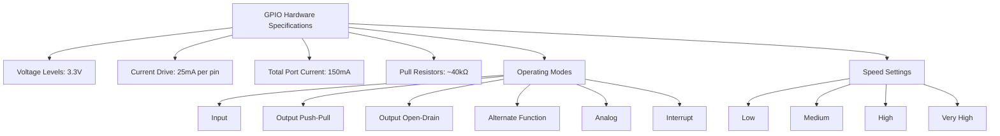
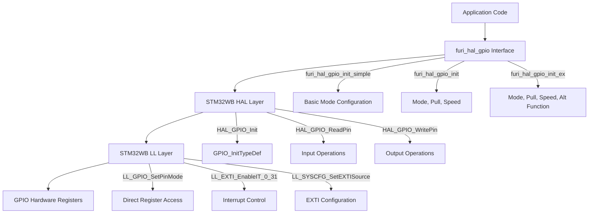
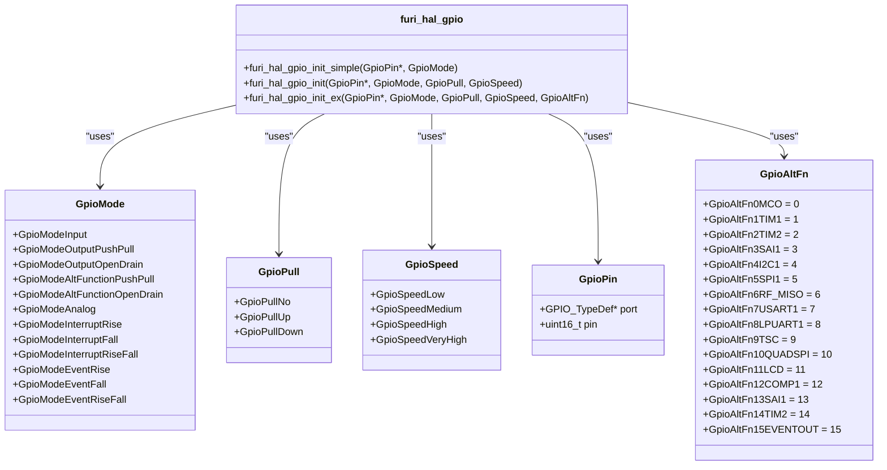
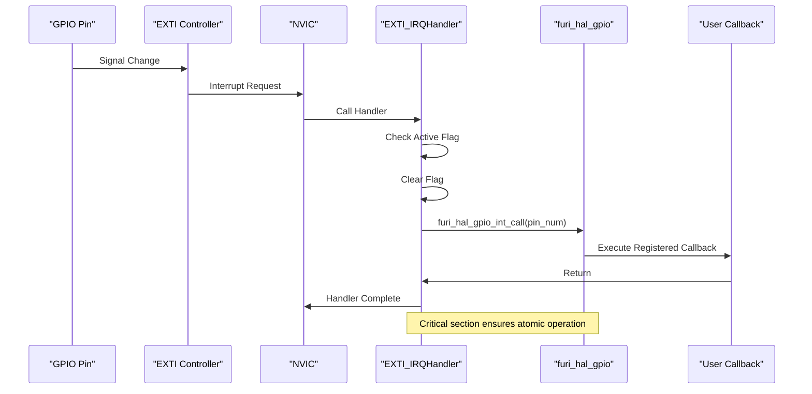
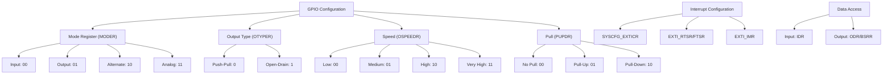
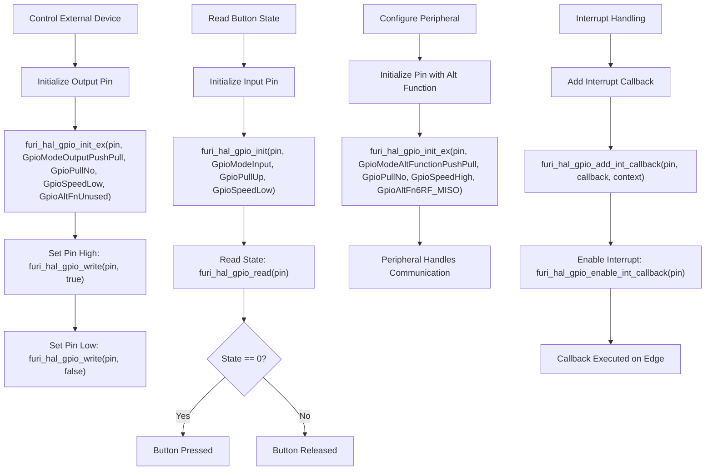

# GPIO Specifications

<cite>
**Referenced Files in This Document**   
- [furi_hal_gpio.h](file://targets/f7/furi_hal/furi_hal_gpio.h#L0-L287)
- [furi_hal_gpio.c](file://targets/f7/furi_hal/furi_hal_gpio.c#L0-L343)
- [furi_hal_resources.h](file://targets/f7/furi_hal/furi_hal_resources.h#L0-L233)
- [stm32wbxx_hal_gpio.h](file://lib/stm32wb_hal/Inc/stm32wbxx_hal_gpio.h#L0-L330)
- [stm32wbxx_hal_gpio.c](file://lib/stm32wb_hal/Src/stm32wbxx_hal_gpio.c#L0-L552)
- [example_adc.c](file://applications/examples/example_adc/example_adc.c#L1-L100)
</cite>

## Table of Contents
1. [Introduction](#introduction)
2. [GPIO Hardware Specifications](#gpio-hardware-specifications)
3. [GPIO Driver Architecture](#gpio-driver-architecture)
4. [Pin Configuration and Modes](#pin-configuration-and-modes)
5. [Interrupt Handling](#interrupt-handling)
6. [Register-Level Operation](#register-level-operation)
7. [Practical Usage Examples](#practical-usage-examples)
8. [External Connector Pinout](#external-connector-pinout)
9. [Best Practices and Recommendations](#best-practices-and-recommendations)

## Introduction
The General Purpose Input/Output (GPIO) peripheral on the Flipper Zero device provides flexible digital interface capabilities for connecting external components and peripherals. This documentation details the GPIO specifications, driver implementation, and usage patterns for the Flipper Zero platform. The GPIO system is built on top of the STM32WB55 microcontroller's hardware capabilities, with an abstraction layer provided by the furi_hal_gpio driver. This document covers voltage levels, current capabilities, pin configurations, driver implementation details, and practical usage examples for controlling external devices, reading inputs, and configuring peripheral functions.

**Section sources**
- [furi_hal_gpio.h](file://targets/f7/furi_hal/furi_hal_gpio.h#L0-L287)
- [furi_hal_gpio.c](file://targets/f7/furi_hal/furi_hal_gpio.c#L0-L343)

## GPIO Hardware Specifications
The Flipper Zero's GPIO system is based on the STM32WB55RG microcontroller, which features multiple GPIO ports with various capabilities. The GPIO pins operate at 3.3V logic levels, which is the standard operating voltage for the device. Each GPIO pin can source or sink up to 25mA of current, with a maximum total current of 150mA across all pins in a port. The GPIO pins support configurable pull-up and pull-down resistors, typically in the range of 40kΩ, which can be enabled or disabled through software configuration.

The GPIO system supports multiple operating modes including input, output (push-pull and open-drain), alternate function, analog, and interrupt modes. The output drivers support four speed settings: low, medium, high, and very high, which correspond to different slew rates to balance signal integrity and electromagnetic compatibility. The input pins have configurable Schmitt triggers for noise immunity and support external interrupt generation on rising edge, falling edge, or both edges.

**Diagram sources**
- [furi_hal_gpio.h](file://targets/f7/furi_hal/furi_hal_gpio.h#L50-L150)
- [stm32wbxx_hal_gpio.h](file://lib/stm32wb_hal/Inc/stm32wbxx_hal_gpio.h#L100-L200)

**Section sources**
- [furi_hal_gpio.h](file://targets/f7/furi_hal/furi_hal_gpio.h#L50-L150)
- [stm32wbxx_hal_gpio.h](file://lib/stm32wb_hal/Inc/stm32wbxx_hal_gpio.h#L100-L200)

## GPIO Driver Architecture
The furi_hal_gpio driver provides a hardware abstraction layer for GPIO operations on the Flipper Zero device. The driver is built on top of the STM32WB HAL (Hardware Abstraction Layer) and LL (Low-Layer) libraries, providing a simplified interface for common GPIO operations. The architecture consists of three main components: the high-level furi_hal_gpio interface, the mid-level STM32WB HAL, and the low-level STM32WB LL.

The driver exposes three initialization functions with increasing levels of configuration detail: furi_hal_gpio_init_simple() for basic configuration, furi_hal_gpio_init() for standard configuration with pull and speed settings, and furi_hal_gpio_init_ex() for extended configuration including alternate functions. The driver handles critical section protection using FURI_CRITICAL_ENTER() and FURI_CRITICAL_EXIT() macros to prevent race conditions during configuration changes.

**Diagram sources**
- [furi_hal_gpio.h](file://targets/f7/furi_hal/furi_hal_gpio.h#L150-L200)
- [furi_hal_gpio.c](file://targets/f7/furi_hal/furi_hal_gpio.c#L50-L100)

**Section sources**
- [furi_hal_gpio.h](file://targets/f7/furi_hal/furi_hal_gpio.h#L150-L200)
- [furi_hal_gpio.c](file://targets/f7/furi_hal/furi_hal_gpio.c#L50-L100)

## Pin Configuration and Modes
The furi_hal_gpio driver supports multiple pin configuration modes through the GpioMode enumeration. These modes include GpioModeInput for digital input, GpioModeOutputPushPull and GpioModeOutputOpenDrain for output configurations, GpioModeAltFunctionPushPull and GpioModeAltFunctionOpenDrain for peripheral functions, GpioModeAnalog for ADC inputs, and various interrupt modes.

The driver provides three initialization functions to configure pins:
- furi_hal_gpio_init_simple(): Configures a pin with a basic mode (input, output, or analog)
- furi_hal_gpio_init(): Configures a pin with mode, pull, and speed settings
- furi_hal_gpio_init_ex(): Configures a pin with mode, pull, speed, and alternate function settings

Each GPIO pin is represented by a GpioPin structure containing a port pointer and pin mask. The driver validates parameters using furi_check() macros and handles invalid arguments by calling furi_crash(). Pull-up and pull-down resistors are configured using the GpioPull enumeration, while output speed is controlled by the GpioSpeed enumeration with four levels: Low, Medium, High, and Very High.

**Diagram sources**
- [furi_hal_gpio.h](file://targets/f7/furi_hal/furi_hal_gpio.h#L50-L200)
- [furi_hal_gpio.c](file://targets/f7/furi_hal/furi_hal_gpio.c#L100-L150)

**Section sources**
- [furi_hal_gpio.h](file://targets/f7/furi_hal/furi_hal_gpio.h#L50-L200)
- [furi_hal_gpio.c](file://targets/f7/furi_hal/furi_hal_gpio.c#L100-L150)

## Interrupt Handling
The furi_hal_gpio driver provides comprehensive interrupt handling capabilities through the EXTI (External Interrupt) controller. The driver supports interrupt configuration for all 16 pins on each GPIO port, with individual control over trigger conditions (rising edge, falling edge, or both) and interrupt/event mode. Interrupt callbacks are registered using the furi_hal_gpio_add_int_callback() function, which associates a callback function and context with a specific GPIO pin.

The interrupt system uses a static array of GpioInterrupt structures to store callback information for each pin. When an interrupt occurs, the corresponding EXTI_IRQHandler() function is called by the NVIC (Nested Vectored Interrupt Controller), which then dispatches to the registered callback through the furi_hal_gpio_int_call() function. The driver provides functions to enable, disable, and remove interrupt callbacks, as well as to add new callbacks.

The EXTI lines are multiplexed, with EXTI0-EXTI4 having dedicated handlers, EXTI5-EXTI9 sharing the EXTI9_5_IRQHandler, and EXTI10-EXTI15 sharing the EXTI15_10_IRQHandler. This requires the interrupt handler to check which specific line triggered the interrupt and clear the corresponding flag to prevent re-triggering.

**Diagram sources**
- [furi_hal_gpio.c](file://targets/f7/furi_hal/furi_hal_gpio.c#L200-L300)
- [stm32wbxx_hal_gpio.c](file://lib/stm32wb_hal/Src/stm32wbxx_hal_gpio.c#L200-L300)

**Section sources**
- [furi_hal_gpio.c](file://targets/f7/furi_hal/furi_hal_gpio.c#L200-L300)

## Register-Level Operation
The furi_hal_gpio driver interacts with the STM32WB55's GPIO hardware registers through the LL (Low-Layer) API for maximum efficiency. The key registers involved in GPIO operation include:

- **GPIOx_MODER**: Mode register that configures each pin as input, output, alternate function, or analog
- **GPIOx_OTYPER**: Output type register that sets push-pull or open-drain configuration
- **GPIOx_OSPEEDR**: Output speed register that controls the slew rate
- **GPIOx_PUPDR**: Pull-up/pull-down register that enables internal resistors
- **GPIOx_IDR**: Input data register for reading pin states
- **GPIOx_ODR**: Output data register for setting pin states
- **GPIOx_BSRR**: Bit set/reset register for atomic output changes
- **EXTI_PR1**: Pending register for clearing interrupt flags
- **SYSCFG_EXTICR**: External interrupt configuration registers

The driver uses LL_GPIO_SetPinMode(), LL_GPIO_SetPinOutputType(), LL_GPIO_SetPinSpeed(), and LL_GPIO_SetPinPull() functions to configure the corresponding registers. For interrupt configuration, it uses LL_SYSCFG_SetEXTISource() to map GPIO pins to EXTI lines, and LL_EXTI_EnableRisingTrig_0_31() and LL_EXTI_EnableFallingTrig_0_31() to configure trigger conditions. The critical section protection ensures that register modifications are atomic and not interrupted by other threads or interrupts.

**Diagram sources**
- [furi_hal_gpio.c](file://targets/f7/furi_hal/furi_hal_gpio.c#L100-L200)
- [stm32wbxx_hal_gpio.c](file://lib/stm32wb_hal/Src/stm32wbxx_hal_gpio.c#L100-L200)

**Section sources**
- [furi_hal_gpio.c](file://targets/f7/furi_hal/furi_hal_gpio.c#L100-L200)
- [stm32wbxx_hal_gpio.c](file://lib/stm32wb_hal/Src/stm32wbxx_hal_gpio.c#L100-L200)

## Practical Usage Examples
The furi_hal_gpio driver provides several practical examples of GPIO usage patterns. For controlling external devices, the typical pattern involves initializing an output pin and then using furi_hal_gpio_write() to set the pin state. For reading button states, an input pin is configured with an appropriate pull resistor, and the state is read using furi_hal_gpio_read(). For peripheral functions, pins are configured with the appropriate alternate function.

The example_adc.c file demonstrates reading analog values from a GPIO pin configured in analog mode. The code initializes the ADC channel and reads the voltage level, which can be used for sensor interfacing or voltage measurement. For digital output control, such as driving an LED or relay, the pin is configured as GpioModeOutputPushPull with appropriate speed settings.

Interrupt-driven input handling is demonstrated through the button interface, where GPIO interrupts are used to detect button presses without polling. This approach is more power-efficient and responsive than periodic polling. The interrupt callback can then trigger application-level actions or set flags for processing in the main loop.

**Diagram sources**
- [example_adc.c](file://applications/examples/example_adc/example_adc.c#L1-L50)
- [furi_hal_gpio.c](file://targets/f7/furi_hal/furi_hal_gpio.c#L250-L300)

**Section sources**
- [example_adc.c](file://applications/examples/example_adc/example_adc.c#L1-L50)
- [furi_hal_gpio.c](file://targets/f7/furi_hal/furi_hal_gpio.c#L250-L300)

## External Connector Pinout
The Flipper Zero device provides access to GPIO pins through an external connector, allowing users to interface with external circuits and components. The connector exposes multiple GPIO pins from different ports, along with power and ground connections. The available pins include GPIOA, GPIOB, GPIOC, and GPIOD pins, each with specific capabilities and alternate functions.

The external connector pins are defined in the furi_hal_resources.h file through specific GpioPin structures such as gpio_ext_pc0, gpio_ext_pc1, gpio_ext_pc3, gpio_ext_pb2, gpio_ext_pb3, gpio_ext_pa4, gpio_ext_pa6, and gpio_ext_pa7. These pins can be configured for various purposes including digital I/O, UART communication, SPI communication, I2C communication, and PWM output through their alternate functions.

The pinout also includes dedicated pins for specific peripherals such as the sub-GHz radio (gpio_subghz_cs), display interface (gpio_display_cs, gpio_display_rst_n, gpio_display_di), SD card interface (gpio_sdcard_cs, gpio_sdcard_cd), and NFC interface (gpio_nfc_cs). These pins are typically used by the system and may not be available for general-purpose use without disabling the corresponding peripheral.

```mermaid
graph TB
subgraph "External Connector"
PC0["PC0 - GPIO"]
PC1["PC1 - GPIO"]
PC3["PC3 - GPIO"]
PB2["PB2 - GPIO"]
PB3["PB3 - GPIO"]
PA4["PA4 - GPIO"]
PA6["PA6 - GPIO"]
PA7["PA7 - GPIO"]
end
subgraph "Power Connections"
VCC["3.3V Power"]
GND["Ground"]
end
subgraph "Peripheral Pins"
SUBGHZ_CS["Sub-GHz CS"]
DISPLAY_CS["Display CS"]
DISPLAY_RST["Display RST"]
DISPLAY_DI["Display DI"]
SDCARD_CS["SD Card CS"]
SDCARD_CD["SD Card CD"]
NFC_CS["NFC CS"]
end
VCC --> ExternalConnector
GND --> ExternalConnector
PC0 --> ExternalConnector
PC1 --> ExternalConnector
PC3 --> ExternalConnector
PB2 --> ExternalConnector
PB3 --> ExternalConnector
PA4 --> ExternalConnector
PA6 --> ExternalConnector
PA7 --> ExternalConnector
SUBGHZ_CS --> PeripheralPins
DISPLAY_CS --> PeripheralPins
DISPLAY_RST --> PeripheralPins
DISPLAY_DI --> PeripheralPins
SDCARD_CS --> PeripheralPins
SDCARD_CD --> PeripheralPins
NFC_CS --> PeripheralPins
```

**Diagram sources**
- [furi_hal_resources.h](file://targets/f7/furi_hal/furi_hal_resources.h#L50-L100)
- [furi_hal_gpio.h](file://targets/f7/furi_hal/furi_hal_gpio.h#L200-L250)

**Section sources**
- [furi_hal_resources.h](file://targets/f7/furi_hal/furi_hal_resources.h#L50-L100)

## Best Practices and Recommendations
When working with the GPIO system on the Flipper Zero, several best practices should be followed to ensure reliable operation and prevent damage to the device. First, always configure the pin mode, pull resistors, and speed settings appropriately for the intended application. For input pins, use pull-up or pull-down resistors to prevent floating inputs, which can cause excessive current draw and unpredictable behavior.

For output pins driving external loads, ensure that the current requirements do not exceed the 25mA per pin limit or the 150mA port limit. When interfacing with 5V systems, use level shifters or voltage dividers to prevent damage to the 3.3V tolerant inputs. For high-speed signals, use appropriate PCB layout techniques including short traces, proper grounding, and impedance control to maintain signal integrity.

When using interrupts, keep the interrupt service routine (ISR) as short as possible, typically just setting a flag or sending an event to the main thread. Avoid complex processing or blocking operations in the ISR to prevent missing subsequent interrupts. Use critical sections when accessing shared data between the ISR and main thread to prevent race conditions.

For power-sensitive applications, consider using interrupt-driven input handling instead of polling to reduce CPU usage and power consumption. When a peripheral is not in use, reconfigure its pins as inputs with pull resistors to minimize power consumption and prevent floating inputs.

**Section sources**
- [furi_hal_gpio.c](file://targets/f7/furi_hal/furi_hal_gpio.c#L1-L50)
- [stm32wbxx_hal_gpio.c](file://lib/stm32wb_hal/Src/stm32wbxx_hal_gpio.c#L1-L50)