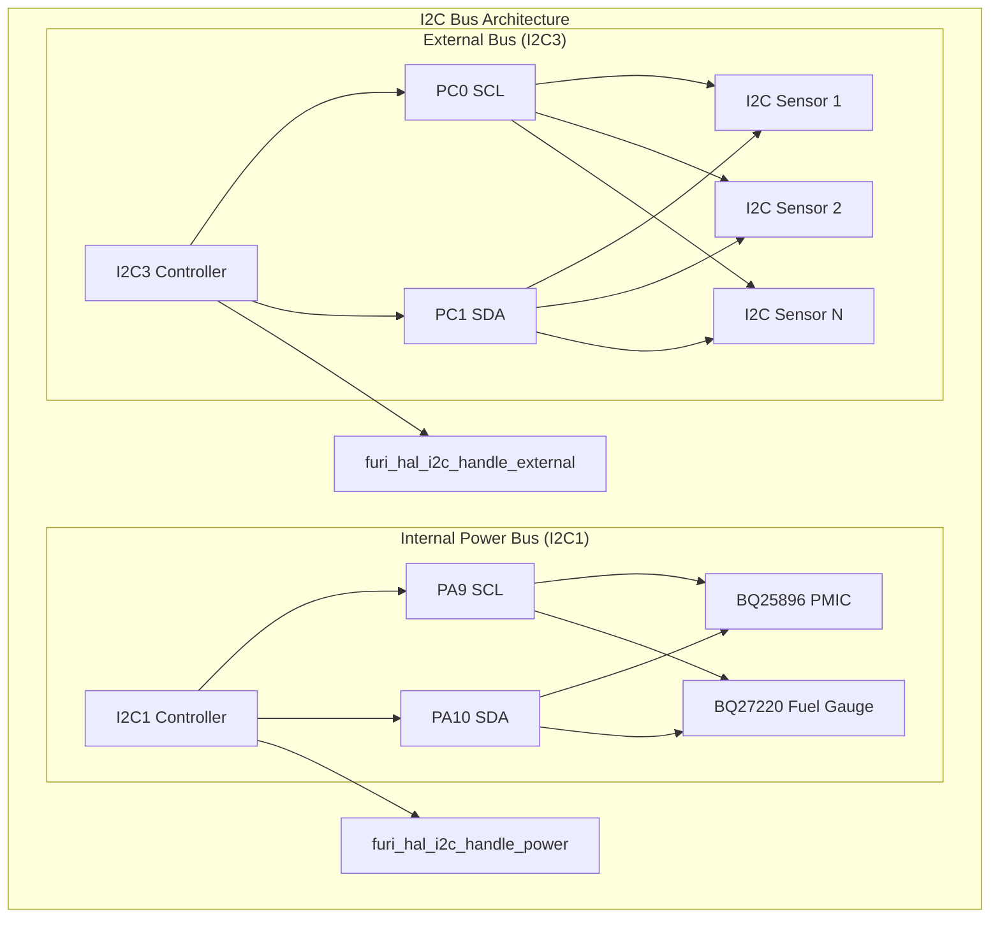
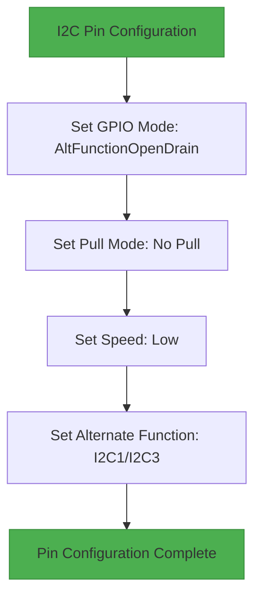
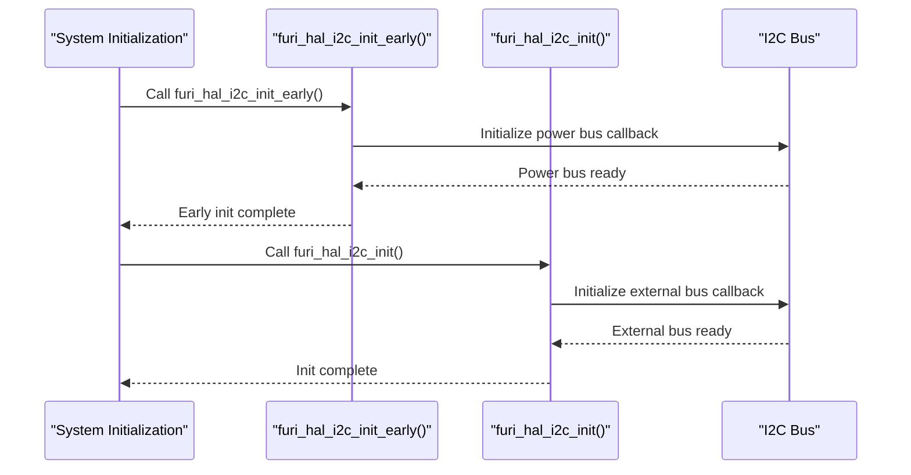
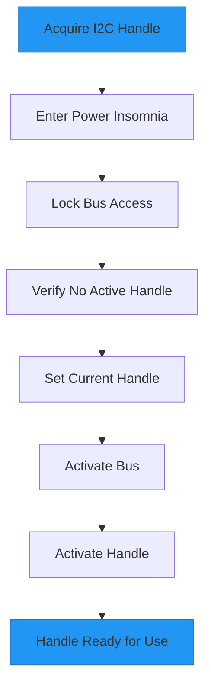
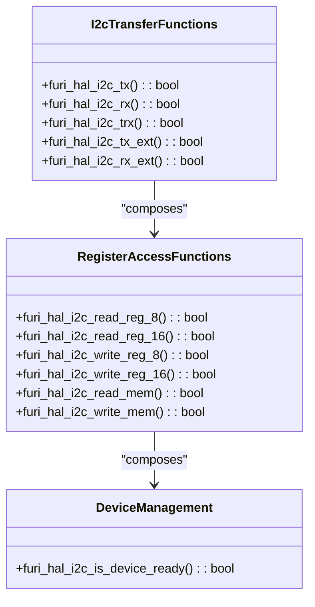
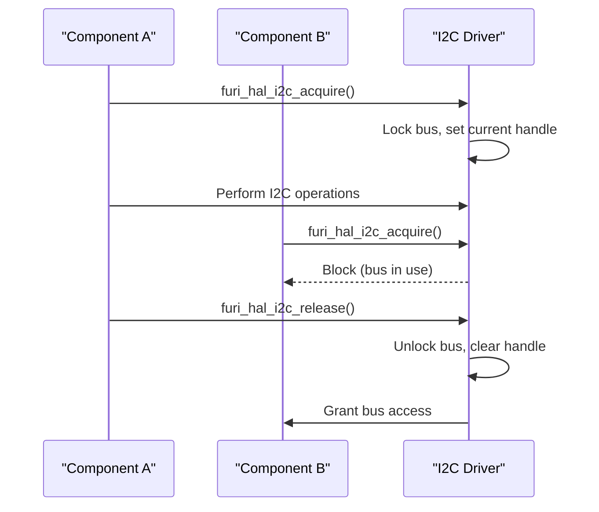

# I2C Specifications

<cite>
**Referenced Files in This Document**   
- [furi_hal_i2c.h](file://targets/furi_hal_include/furi_hal_i2c.h)
- [furi_hal_i2c.c](file://targets/f7/furi_hal/furi_hal_i2c.c)
- [furi_hal_i2c_config.h](file://targets/f7/furi_hal/furi_hal_i2c_config.h)
- [furi_hal_i2c_config.c](file://targets/f7/furi_hal/furi_hal_i2c_config.c)
- [furi_hal_gpio.h](file://targets/f7/furi_hal/furi_hal_gpio.h)
- [furi_hal_resources.h](file://targets/f7/furi_hal/furi_hal_resources.h)
- [FuriHalBus.md](file://documentation/FuriHalBus.md)
</cite>

## Table of Contents
1. [Introduction](#introduction)
2. [I2C Bus Architecture](#i2c-bus-architecture)
3. [Electrical Characteristics and Signal Integrity](#electrical-characteristics-and-signal-integrity)
4. [Driver Implementation and Initialization](#driver-implementation-and-initialization)
5. [Data Transfer Protocols and Register Access](#data-transfer-protocols-and-register-access)
6. [Practical Usage Examples](#practical-usage-examples)
7. [Error Handling and Device Detection](#error-handling-and-device-detection)
8. [Performance Considerations](#performance-considerations)

## Introduction
The Inter-Integrated Circuit (I2C) protocol on the Flipper Zero device provides a robust two-wire interface for connecting various sensors and peripherals. This document details the implementation of the I2C peripheral in the Flipper Zero firmware, covering bus speed modes, electrical characteristics, driver architecture, and practical usage patterns. The furi_hal_i2c driver implements a comprehensive interface for both internal power management components and external peripherals, with support for standard and fast mode operation.

**Section sources**
- [furi_hal_i2c.h](file://targets/furi_hal_include/furi_hal_i2c.h#L1-L288)

## I2C Bus Architecture
The Flipper Zero implements two separate I2C buses to serve different purposes: an internal power bus (I2C1) and an external bus (I2C3). This dual-bus architecture allows for independent operation and optimized performance for different types of connected devices.



**Diagram sources**
- [furi_hal_i2c_config.h](file://targets/f7/furi_hal/furi_hal_i2c_config.h#L5-L31)
- [furi_hal_i2c_config.c](file://targets/f7/furi_hal/furi_hal_i2c_config.c#L1-L167)

**Section sources**
- [furi_hal_i2c_config.h](file://targets/f7/furi_hal/furi_hal_i2c_config.h#L5-L31)
- [furi_hal_i2c_config.c](file://targets/f7/furi_hal/furi_hal_i2c_config.c#L1-L167)

### Internal Power Bus (I2C1)
The internal power bus connects to critical power management components including the BQ25896 PMIC (Power Management Integrated Circuit) and BQ27220 fuel gauge. This bus operates at 400kHz on hardware versions greater than 10, and 100kHz on earlier versions. The bus uses GPIO pins PA9 (SCL) and PA10 (SDA) with open-drain configuration and no internal pull-up resistors.

### External Bus (I2C3)
The external bus provides connectivity for user-connected I2C peripherals and sensors. It operates at a fixed 100kHz speed to ensure compatibility with a wide range of devices. The bus uses GPIO pins PC0 (SCL) and PC1 (SDA) configured in open-drain mode. This bus is specifically designed for external expansion and debugging purposes.

## Electrical Characteristics and Signal Integrity
The I2C implementation on the Flipper Zero adheres to standard I2C electrical specifications with specific configurations for reliable operation in various conditions.

### Voltage Levels and Pin Configuration
The I2C buses operate at the same voltage level as the microcontroller's I/O pins, which is 3.3V. Both SCL and SDA lines are configured with open-drain output drivers, requiring external pull-up resistors for proper operation.



**Diagram sources**
- [furi_hal_gpio.h](file://targets/f7/furi_hal/furi_hal_gpio.h#L1-L287)
- [furi_hal_i2c_config.c](file://targets/f7/furi_hal/furi_hal_i2c_config.c#L1-L167)

**Section sources**
- [furi_hal_gpio.h](file://targets/f7/furi_hal/furi_hal_gpio.h#L1-L287)
- [furi_hal_i2c_config.c](file://targets/f7/furi_hal/furi_hal_i2c_config.c#L1-L167)

### Pull-Up Resistor Requirements
External pull-up resistors are required on both SCL and SDA lines for proper I2C operation. The recommended pull-up resistance values depend on the bus capacitance and operating speed:

- For 100kHz operation: 4.7kΩ pull-up resistors
- For 400kHz operation: 2.2kΩ pull-up resistors

The absence of internal pull-up resistors provides flexibility for users to select optimal resistor values based on their specific application requirements and cable lengths.

### Bus Speed Modes
The Flipper Zero supports multiple I2C speed modes:

- **Standard Mode**: 100kHz - Used for the external I2C3 bus
- **Fast Mode**: 400kHz - Used for the internal I2C1 bus on hardware versions > 10
- **Clock Stretching**: Supported on both buses to accommodate slower slave devices

The timing parameters for these modes are pre-calculated and stored in the firmware:

```c
// Timing register value for Standard Mode @100kHz
#define FURI_HAL_I2C_CONFIG_POWER_I2C_TIMINGS_100 0x10707DBC

// Timing register value for Fast Mode @400kHz  
#define FURI_HAL_I2C_CONFIG_POWER_I2C_TIMINGS_400 0x00602173
```

**Section sources**
- [furi_hal_i2c_config.c](file://targets/f7/furi_hal/furi_hal_i2c_config.c#L1-L167)

## Driver Implementation and Initialization
The furi_hal_i2c driver implements a layered architecture with clear separation between bus management, handle management, and transaction execution.

### Initialization Sequence
The I2C subsystem undergoes a multi-stage initialization process:



**Diagram sources**
- [furi_hal_i2c.c](file://targets/f7/furi_hal/furi_hal_i2c.c#L1-L417)

**Section sources**
- [furi_hal_i2c.c](file://targets/f7/furi_hal/furi_hal_i2c.c#L1-L417)

### Bus and Handle Management
The driver uses a handle-based system to manage access to I2C buses, ensuring exclusive access and proper resource management:

```c
// Bus structure definition
struct FuriHalI2cBus {
    I2C_TypeDef* i2c;
    FuriHalI2cBusHandle* current_handle;
    FuriHalI2cBusEventCallback callback;
};

// Handle structure definition  
struct FuriHalI2cBusHandle {
    FuriHalI2cBus* bus;
    FuriHalI2cBusHandleEventCallback callback;
};
```

When a component needs to use the I2C bus, it must first acquire a handle:



**Diagram sources**
- [furi_hal_i2c.c](file://targets/f7/furi_hal/furi_hal_i2c.c#L1-L417)

**Section sources**
- [furi_hal_i2c.c](file://targets/f7/furi_hal/furi_hal_i2c.c#L1-L417)

### Clock Configuration
The I2C clock source is configured to use the PCLK1 clock, with timing parameters calculated for the target bus speeds:

```c
// In furi_hal_i2c_bus_power_event()
FURI_CRITICAL_ENTER();
furi_hal_bus_enable(FuriHalBusI2C1);
LL_RCC_SetI2CClockSource(LL_RCC_I2C1_CLKSOURCE_PCLK1);
FURI_CRITICAL_EXIT();
```

This configuration ensures stable clocking for I2C operations while maintaining compatibility with the overall system clock architecture.

## Data Transfer Protocols and Register Access
The furi_hal_i2c driver provides multiple functions for different types of I2C transactions, from simple byte transfers to complex register operations.

### Transaction Control
The driver supports three transaction beginning signals and three transaction ending signals, enabling flexible communication patterns:

```c
// Transaction beginning signals
typedef enum {
    FuriHalI2cBeginStart,      // Begin with START condition
    FuriHalI2cBeginRestart,    // Begin with RESTART condition  
    FuriHalI2cBeginResume,     // Continue previous transaction
} FuriHalI2cBegin;

// Transaction ending signals
typedef enum {
    FuriHalI2cEndStop,         // End with STOP condition
    FuriHalI2cEndAwaitRestart, // End with clock stretching for restart
    FuriHalI2cEndPause,        // Pause with clock stretching
} FuriHalI2cEnd;
```

### Data Transfer Functions
The driver provides a comprehensive set of functions for I2C communication:



**Diagram sources**
- [furi_hal_i2c.h](file://targets/furi_hal_include/furi_hal_i2c.h#L1-L288)

**Section sources**
- [furi_hal_i2c.h](file://targets/furi_hal_include/furi_hal_i2c.h#L1-L288)

## Practical Usage Examples
The following examples demonstrate common usage patterns for the I2C driver.

### Reading a Device Register
```c
bool read_sensor_register(FuriHalI2cBusHandle* handle, uint8_t reg_addr, uint8_t* value) {
    return furi_hal_i2c_read_reg_8(handle, SENSOR_I2C_ADDR, reg_addr, value, 100);
}
```

### Writing to Multiple Registers
```c
bool configure_sensor(FuriHalI2cBusHandle* handle) {
    const uint8_t config_data[] = {
        0x00, 0x10,  // Register 0x00 = 0x10
        0x01, 0x05,  // Register 0x01 = 0x05
        0x02, 0x01   // Register 0x02 = 0x01
    };
    
    return furi_hal_i2c_tx(handle, SENSOR_I2C_ADDR, config_data, 6, 100);
}
```

### Combined Read-Write Transaction
```c
bool read_sensor_data(FuriHalI2cBusHandle* handle, uint8_t* data, size_t len) {
    uint8_t cmd = SENSOR_DATA_REG;
    return furi_hal_i2c_trx(handle, SENSOR_I2C_ADDR, &cmd, 1, data, len, 100);
}
```

**Section sources**
- [furi_hal_i2c.c](file://targets/f7/furi_hal/furi_hal_i2c.c#L1-L417)

## Error Handling and Device Detection
The driver implements robust error handling mechanisms to ensure reliable communication.

### ACK/NACK Handling
The driver automatically detects ACK/NACK conditions during transactions and returns appropriate status codes:

```c
bool furi_hal_i2c_is_device_ready(FuriHalI2cBusHandle* handle, uint8_t i2c_addr, uint32_t timeout) {
    // ...
    ret = !LL_I2C_IsActiveFlag_NACK(handle->bus->i2c);
    LL_I2C_ClearFlag_NACK(handle->bus->i2c);
    // ...
    return ret;
}
```

### Timeout Management
All I2C operations include timeout parameters to prevent indefinite blocking:

```c
FuriHalCortexTimer timer = furi_hal_cortex_timer_get(timeout * 1000);
while(size > 0) {
    bool should_stop = furi_hal_cortex_timer_is_expired(timer) ||
                       furi_hal_i2c_transfer_is_aborted(i2c);
    // ...
}
```

### Bus Arbitration
The handle-based system ensures that only one component can access the bus at a time, preventing bus contention:



**Diagram sources**
- [furi_hal_i2c.c](file://targets/f7/furi_hal/furi_hal_i2c.c#L1-L417)

**Section sources**
- [furi_hal_i2c.c](file://targets/f7/furi_hal/furi_hal_i2c.c#L1-L417)

## Performance Considerations
The I2C implementation is optimized for both power efficiency and performance.

### Power Management
The driver integrates with the system power management to minimize power consumption:

- Bus peripherals are kept in reset when not in use
- Power insomnia is entered during I2C operations to prevent sleep
- GPIO pins are configured as analog inputs when released to minimize leakage

### Transfer Efficiency
The driver handles large transfers by breaking them into 255-byte chunks:

```c
if(size > 255) {
    transfer_size = 255;
    transfer_end = FuriHalI2cEndPause;
}
```

This approach ensures compatibility with the hardware's transfer length limitations while maintaining efficient communication.

### Clock Stretching
Clock stretching is enabled by default to accommodate slower slave devices:

```c
LL_I2C_EnableClockStretching(handle->bus->i2c);
```

This feature allows slave devices to temporarily hold the SCL line low when they need additional time to process data.

**Section sources**
- [furi_hal_i2c_config.c](file://targets/f7/furi_hal/furi_hal_i2c_config.c#L1-L167)
- [furi_hal_i2c.c](file://targets/f7/furi_hal/furi_hal_i2c.c#L1-L417)