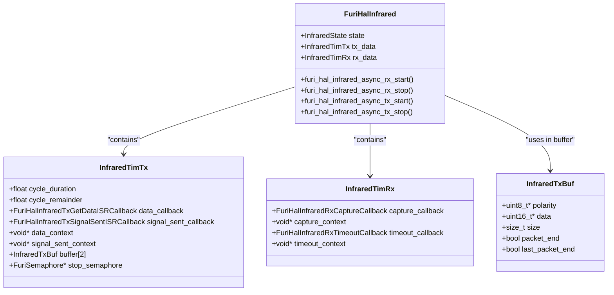
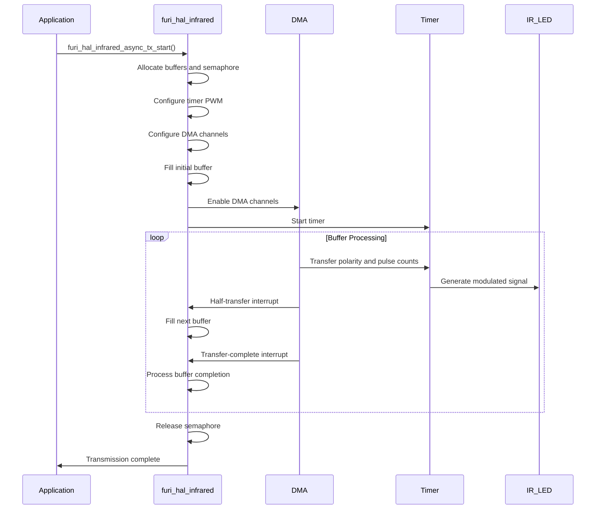
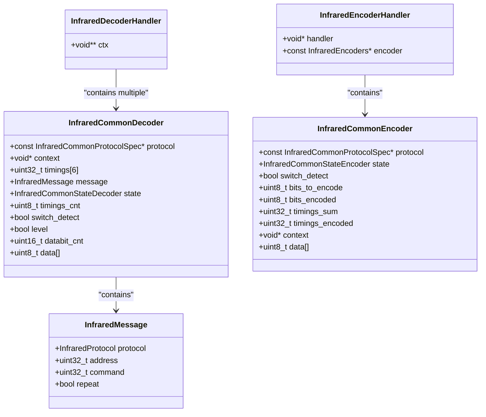

# Infrared Specifications

<cite>
**Referenced Files in This Document**   
- [furi_hal_infrared.h](file://targets\furi_hal_include\furi_hal_infrared.h#L0-L177)
- [furi_hal_infrared.c](file://targets\f7\furi_hal\furi_hal_infrared.c#L0-L728)
- [infrared.h](file://lib\infrared\encoder_decoder\infrared.h#L0-L219)
- [infrared.c](file://lib\infrared\encoder_decoder\infrared.c#L0-L355)
- [infrared_common_i.h](file://lib\infrared\encoder_decoder\common\infrared_common_i.h#L0-L88)
- [infrared_common_decoder.c](file://lib\infrared\encoder_decoder\common\infrared_common_decoder.c#L0-L316)
- [infrared_common_encoder.c](file://lib\infrared\encoder_decoder\common\infrared_common_encoder.c#L0-L181)
- [infrared_protocol_nec.h](file://lib\infrared\encoder_decoder\nec\infrared_protocol_nec.h#L0-L30)
- [infrared_protocol_nec.c](file://lib\infrared\encoder_decoder\nec\infrared_protocol_nec.c#L0-L73)
</cite>

## Table of Contents
1. [Introduction](#introduction)
2. [IR Hardware Specifications](#ir-hardware-specifications)
3. [furi_hal_infrared Driver Architecture](#furi_hal_infrared-driver-architecture)
4. [Signal Reception and Pulse Width Measurement](#signal-reception-and-pulse-width-measurement)
5. [Carrier Generation and Transmission](#carrier-generation-and-transmission)
6. [Protocol Implementation and Data Structures](#protocol-implementation-and-data-structures)
7. [Practical Examples and Usage](#practical-examples-and-usage)
8. [Performance and Interference Considerations](#performance-and-interference-considerations)

## Introduction
The Infrared (IR) peripheral on the Flipper Zero device provides comprehensive functionality for capturing, analyzing, and transmitting infrared signals. This documentation details the technical specifications, driver implementation, and practical usage of the IR subsystem. The system is designed to support a wide range of IR protocols with high timing accuracy, enabling users to interact with various consumer electronics and home automation devices. The architecture separates hardware abstraction from protocol-specific logic, providing a flexible and extensible framework for IR communication.

## IR Hardware Specifications

### Carrier Frequencies and Modulation Schemes
The Flipper Zero IR subsystem supports a wide range of carrier frequencies from 10 kHz to 1 MHz, with a default common carrier frequency of 38 kHz as defined by `INFRARED_COMMON_CARRIER_FREQUENCY`. The system implements pulse distance-width modulation (PDWM) for most protocols, where data is encoded in the timing between pulses rather than the pulse width itself. The duty cycle for carrier generation is typically set to 33% as specified by `INFRARED_COMMON_DUTY_CYCLE`.

The hardware supports multiple modulation schemes:
- **Pulse Distance Modulation (PDM)**: Used by NEC, Samsung, and other protocols
- **Manchester Encoding**: Used by RC5 and RC6 protocols
- **Pulse Width Modulation (PWM)**: For carrier generation during transmission

### Receiver Sensitivity and Transmission Power
The receiver sensitivity is optimized for standard IR remote control signals, with the system capable of detecting signals with pulse widths ranging from a few microseconds to several milliseconds. The transmission power is controlled through the duty cycle of the PWM signal, with the ability to drive both the internal IR LED and external IR modules connected via the expansion port.

The system supports two transmission output options:
- **Internal IR LED**: Connected to the internal GPIO pin
- **External IR Module**: Connected to PA7 expansion pin, automatically detected

### Transmission Pin Detection
The system automatically detects which transmission pin to use by enabling a weak pull-up on supported pins and testing whether the input remains low. External IR modules that employ a FET with a strong pull-down or a BJT for driving IR LEDs can be detected using this method. The module must pull the input voltage down to at least 0.9V or lower to be detected. If no external module is detected, the system defaults to the internal IR LED.

**Section sources**
- [furi_hal_infrared.h](file://targets\furi_hal_include\furi_hal_infrared.h#L0-L177)
- [furi_hal_infrared.c](file://targets\f7\furi_hal\furi_hal_infrared.c#L0-L728)

## furi_hal_infrared Driver Architecture

### State Management and Control Flow
The furi_hal_infrared driver implements a state machine to manage the different operational modes of the IR peripheral. The states are defined in the `InfraredState` enum:

```c
typedef enum {
    InfraredStateIdle, 
    InfraredStateAsyncRx, 
    InfraredStateAsyncTx, 
    InfraredStateAsyncTxStopReq, 
    InfraredStateAsyncTxStopInProgress, 
    InfraredStateAsyncTxStopped, 
    InfraredStateMAX,
} InfraredState;
```

The state machine ensures proper sequencing of operations and prevents conflicts between transmission and reception. The current state is stored in the volatile `furi_hal_infrared_state` variable, which is updated atomically during state transitions.

### Hardware Abstraction Layer
The driver provides a hardware abstraction layer that interfaces with the STM32WB microcontroller's peripherals. It utilizes:
- **TIM2**: For IR signal reception with input capture functionality
- **TIM1**: For IR signal transmission with PWM and DMA support
- **DMA2**: For efficient data transfer to the timer during transmission

The driver abstracts the low-level register manipulation through the STM32 LL (Low Layer) libraries, providing a clean interface while maintaining performance.



**Diagram sources **
- [furi_hal_infrared.h](file://targets\furi_hal_include\furi_hal_infrared.h#L0-L177)
- [furi_hal_infrared.c](file://targets\f7\furi_hal\furi_hal_infrared.c#L0-L728)

**Section sources**
- [furi_hal_infrared.h](file://targets\furi_hal_include\furi_hal_infrared.h#L0-L177)
- [furi_hal_infrared.c](file://targets\f7\furi_hal\furi_hal_infrared.c#L0-L728)

## Signal Reception and Pulse Width Measurement

### Input Capture Configuration
The IR reception system uses TIM2 configured in input capture mode to measure the duration of IR signal pulses with high precision. The timer is configured with a prescaler of 63 (64-1), resulting in a timer clock of 1 MHz when the system clock is 64 MHz. This provides a timing resolution of 1 microsecond for pulse width measurement.

The input capture channels are configured as follows:
- **Channel 1**: Rising edge detection (mark state)
- **Channel 2**: Falling edge detection (space state)
- **Channel 3**: Timeout detection for silence periods

```c
LL_TIM_InitTypeDef TIM_InitStruct = {0};
TIM_InitStruct.Prescaler = 64 - 1;
TIM_InitStruct.CounterMode = LL_TIM_COUNTERMODE_UP;
TIM_InitStruct.Autoreload = 0x7FFFFFFE;
LL_TIM_Init(INFRARED_RX_TIMER, &TIM_InitStruct);
```

### Interrupt Service Routine
The reception ISR (`furi_hal_infrared_tim_rx_isr`) processes timer interrupts for edge detection and timeout events. It calculates the duration between consecutive edges by subtracting the captured values from the timer's capture registers.

```c
static void furi_hal_infrared_tim_rx_isr(void* context) {
    static uint32_t previous_captured_ch2 = 0;

    /* Timeout */
    if(LL_TIM_IsActiveFlag_CC3(INFRARED_RX_TIMER)) {
        LL_TIM_ClearFlag_CC3(INFRARED_RX_TIMER);
        if(LL_GPIO_IsInputPinSet(gpio_infrared_rx.port, gpio_infrared_rx.pin) != 0) {
            if(infrared_tim_rx.timeout_callback)
                infrared_tim_rx.timeout_callback(infrared_tim_rx.timeout_context);
        }
    }

    /* Rising Edge */
    if(LL_TIM_IsActiveFlag_CC1(INFRARED_RX_TIMER)) {
        LL_TIM_ClearFlag_CC1(INFRARED_RX_TIMER);
        uint32_t duration = LL_TIM_IC_GetCaptureCH1(INFRARED_RX_TIMER) - previous_captured_ch2;
        if(infrared_tim_rx.capture_callback)
            infrared_tim_rx.capture_callback(infrared_tim_rx.capture_context, 1, duration);
    }

    /* Falling Edge */
    if(LL_TIM_IsActiveFlag_CC2(INFRARED_RX_TIMER)) {
        LL_TIM_ClearFlag_CC2(INFRARED_RX_TIMER);
        uint32_t duration = LL_TIM_IC_GetCaptureCH2(INFRARED_RX_TIMER);
        previous_captured_ch2 = duration;
        if(infrared_tim_rx.capture_callback)
            infrared_tim_rx.capture_callback(infrared_tim_rx.capture_context, 0, duration);
    }
}
```

### Silence Detection
The system implements silence detection to identify the end of an IR transmission. The `furi_hal_infrared_async_rx_set_timeout` function configures a timeout value in microseconds, after which a timeout interrupt is generated if no signal edges are detected. This is particularly useful for protocols that use variable-length messages or have specific silence requirements between transmissions.

**Section sources**
- [furi_hal_infrared.c](file://targets\f7\furi_hal\furi_hal_infrared.c#L0-L728)

## Carrier Generation and Transmission

### DMA-Based Transmission Architecture
The IR transmission system uses a sophisticated DMA-based architecture to generate precise carrier signals without CPU intervention. The system employs double-buffering with two DMA channels:

- **DMA Channel 1**: Transfers polarity configuration to the timer's CCMR register
- **DMA Channel 2**: Transfers pulse count values to the timer's RCR (Repetition Counter) register

This dual-channel approach allows for efficient generation of the carrier signal by pre-loading the timer with the number of carrier cycles for each pulse, rather than generating each cycle individually.

### Pulse to Carrier Cycle Conversion
The driver converts pulse durations into carrier cycles using the following formula:

```
num_of_impulses = round(duration / cycle_duration + cycle_remainder)
```

Where `cycle_duration` is the period of the carrier frequency (1,000,000 / frequency). The remainder is preserved across pulses to maintain timing accuracy and prevent cumulative errors.

```c
const float num_of_impulses_f = duration / infrared_tim_tx.cycle_duration + infrared_tim_tx.cycle_remainder;
const uint32_t num_of_impulses = roundf(num_of_impulses_f);
infrared_tim_tx.cycle_remainder = num_of_impulses_f - num_of_impulses;
```

### Transmission State Machine
The transmission process follows a state machine with the following sequence:



**Diagram sources **
- [furi_hal_infrared.c](file://targets\f7\furi_hal\furi_hal_infrared.c#L0-L728)

**Section sources**
- [furi_hal_infrared.c](file://targets\f7\furi_hal\furi_hal_infrared.c#L0-L728)

## Protocol Implementation and Data Structures

### Protocol Framework
The IR system implements a modular protocol framework that separates common functionality from protocol-specific logic. The core of this framework is the `InfraredCommonProtocolSpec` structure, which defines the timing parameters and function pointers for each protocol:

```c
typedef struct {
    InfraredTimings timings;
    bool manchester_start_from_space;
    uint8_t databit_len[4];
    InfraredCommonDecode decode;
    InfraredCommonDecodeRepeat decode_repeat;
    InfraredCommonInterpret interpret;
    InfraredCommonEncode encode;
    InfraredCommonEncode repeat;
} InfraredCommonProtocolSpec;
```

### Supported Protocols
The system supports multiple IR protocols, each with specific timing parameters:

| Protocol | Preamble Mark | Preamble Space | Bit 1 Mark | Bit 1 Space | Bit 0 Mark | Bit 0 Space | Frequency |
|---------|---------------|----------------|------------|-------------|------------|-------------|-----------|
| NEC | 9000 μs | 4500 μs | 560 μs | 1690 μs | 560 μs | 560 μs | 38 kHz |
| Samsung32 | 4500 μs | 4500 μs | 560 μs | 1690 μs | 560 μs | 560 μs | 38 kHz |
| RC5 | 889 μs | 889 μs | N/A | 1778 μs | N/A | 889 μs | 36 kHz |
| RC6 | 2666 μs | 889 μs | N/A | 889 μs | N/A | 444 μs | 36 kHz |

### Message Structure
The `InfraredMessage` structure represents a decoded or encoded IR command:

```c
typedef struct {
    InfraredProtocol protocol;
    uint32_t address;
    uint32_t command;
    bool repeat;
} InfraredMessage;
```

This structure contains the protocol identifier, device address, command code, and a flag indicating whether this is a repeat transmission.



**Diagram sources **
- [infrared.h](file://lib\infrared\encoder_decoder\infrared.h#L0-L219)
- [infrared_common_i.h](file://lib\infrared\encoder_decoder\common\infrared_common_i.h#L0-L88)

**Section sources**
- [infrared.h](file://lib\infrared\encoder_decoder\infrared.h#L0-L219)
- [infrared_common_i.h](file://lib\infrared\encoder_decoder\common\infrared_common_i.h#L0-L88)
- [infrared_protocol_nec.c](file://lib\infrared\encoder_decoder\nec\infrared_protocol_nec.c#L0-L73)

## Practical Examples and Usage

### Capturing IR Signals
To capture IR signals from a remote control, the following sequence is used:

```c
// Initialize the IR receiver
furi_hal_infrared_async_rx_start();

// Set up callbacks for signal capture
furi_hal_infrared_async_rx_set_capture_isr_callback(capture_callback, context);
furi_hal_infrared_async_rx_set_timeout_isr_callback(timeout_callback, context);

// Set silence timeout (e.g., 100ms)
furi_hal_infrared_async_rx_set_timeout(100000);

// Process captured signals in the callback
void capture_callback(void* ctx, bool level, uint32_t duration) {
    // Store the level and duration for analysis
    store_pulse(level, duration);
}

void timeout_callback(void* ctx) {
    // End of transmission detected
    process_captured_signal();
}
```

### Analyzing Protocols
The system automatically analyzes captured signals against all supported protocols:

```c
// Allocate a decoder handler
InfraredDecoderHandler* decoder = infrared_alloc_decoder();

// Provide captured pulses to the decoder
for(int i = 0; i < pulse_count; i++) {
    const InfraredMessage* message = infrared_decode(decoder, pulse_level[i], pulse_duration[i]);
    if(message) {
        // Protocol recognized
        printf("Protocol: %s\n", infrared_get_protocol_name(message->protocol));
        printf("Address: 0x%08lX\n", message->address);
        printf("Command: 0x%08lX\n", message->command);
        break;
    }
}

// Clean up
infrared_free_decoder(decoder);
```

### Transmitting Custom IR Commands
To transmit a custom IR command:

```c
// Allocate an encoder
InfraredEncoderHandler* encoder = infrared_alloc_encoder();

// Create the message to transmit
InfraredMessage message = {
    .protocol = InfraredProtocolNEC,
    .address = 0x00FF,
    .command = 0x45,
    .repeat = false
};

// Reset the encoder with the message
infrared_reset_encoder(encoder, &message);

// Start transmission
furi_hal_infrared_async_tx_set_data_isr_callback(tx_data_callback, encoder);
furi_hal_infrared_async_tx_start(
    infrared_get_protocol_frequency(message.protocol),
    infrared_get_protocol_duty_cycle(message.protocol)
);

// Data callback provides timing data
FuriHalInfraredTxGetDataState tx_data_callback(
    void* context, uint32_t* duration, bool* level) {
    InfraredEncoderHandler* encoder = (InfraredEncoderHandler*)context;
    InfraredStatus status = infrared_encode(encoder, duration, level);
    if(status == InfraredStatusDone) {
        return FuriHalInfraredTxGetDataStateLastDone;
    }
    return FuriHalInfraredTxGetDataStateOk;
}

// Wait for transmission to complete
furi_hal_infrared_async_tx_wait_termination();

// Clean up
infrared_free_encoder(encoder);
```

**Section sources**
- [infrared.h](file://lib\infrared\encoder_decoder\infrared.h#L0-L219)
- [infrared.c](file://lib\infrared\encoder_decoder\infrared.c#L0-L355)
- [furi_hal_infrared.h](file://targets\furi_hal_include\furi_hal_infrared.h#L0-L177)

## Performance and Interference Considerations

### Timing Accuracy
The system achieves high timing accuracy through the use of hardware timers and DMA. The timer prescaler of 63 provides a 1μs resolution for pulse width measurement. The DMA-based transmission system ensures consistent carrier generation without CPU jitter. The remainder-based pulse conversion algorithm prevents cumulative timing errors across multiple pulses.

### Ambient Light Interference
Ambient light can interfere with IR reception, particularly sunlight which contains IR components. The system mitigates this through:
- **Modulated carrier signals**: Only signals with the correct carrier frequency are processed
- **Pulse timing validation**: Received signals are validated against protocol-specific timing tolerances
- **Signal filtering**: Short noise pulses are filtered out through timing analysis

### Signal Distortion
Signal distortion can occur due to various factors:
- **Distance**: Signal strength decreases with distance
- **Angle**: IR signals are directional and sensitive to alignment
- **Obstructions**: Physical objects can block or reflect signals

The system handles signal distortion through:
- **Timing tolerance**: Protocol definitions include timing tolerances (±20% typical)
- **Error detection**: Invalid timing sequences reset the decoder state
- **Repeat detection**: Repeat codes are handled separately from initial transmissions

### Resource Management
The IR system efficiently manages resources through:
- **Double buffering**: Ensures continuous transmission without gaps
- **Semaphore synchronization**: Coordinates between ISR and application threads
- **Memory pooling**: Reuses buffer memory to minimize allocation overhead

The system also provides functions to check if the IR peripheral is busy (`furi_hal_infrared_is_busy()`) and to detect external IR modules (`furi_hal_infrared_detect_tx_output()`), allowing applications to adapt their behavior based on system state.

**Section sources**
- [furi_hal_infrared.h](file://targets\furi_hal_include\furi_hal_infrared.h#L0-L177)
- [furi_hal_infrared.c](file://targets\f7\furi_hal\furi_hal_infrared.c#L0-L728)
- [infrared_common_decoder.c](file://lib\infrared\encoder_decoder\common\infrared_common_decoder.c#L0-L316)
- [infrared_common_encoder.c](file://lib\infrared\encoder_decoder\common\infrared_common_encoder.c#L0-L181)