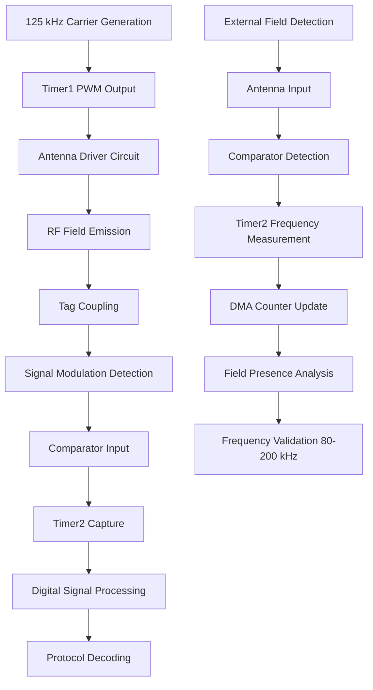
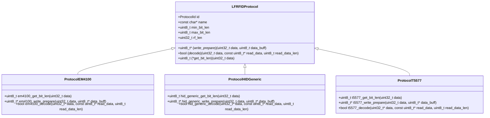
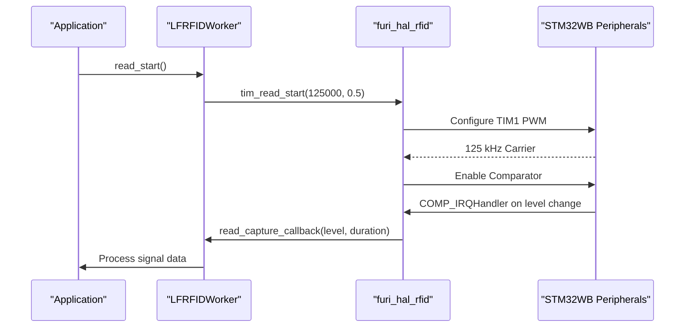
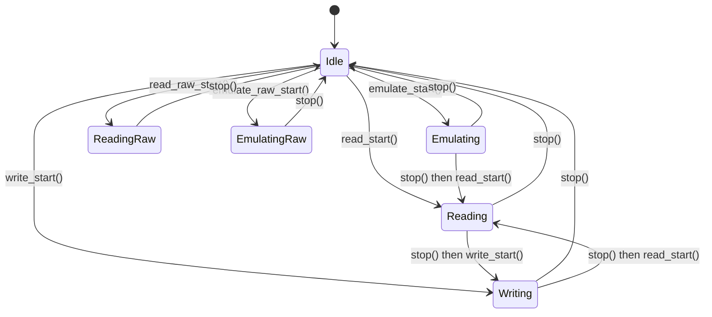
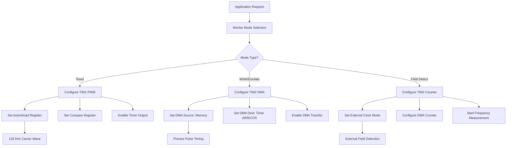
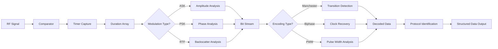
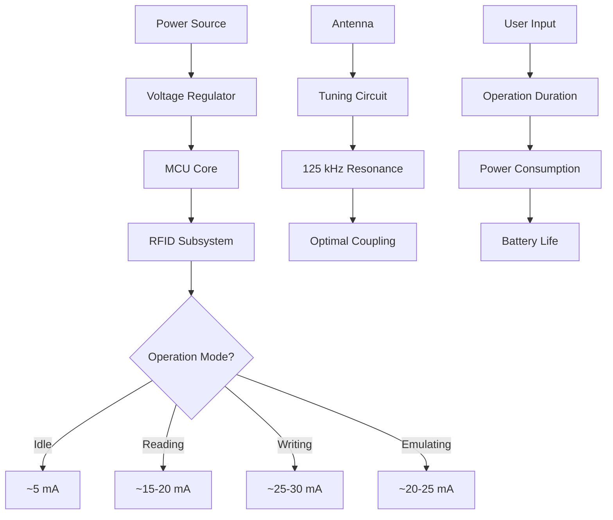

# LF RFID Specifications

<cite>
**Referenced Files in This Document**   
- [furi_hal_rfid.c](file://targets/f7/furi_hal/furi_hal_rfid.c)
- [furi_hal_rfid.h](file://targets/f7/furi_hal/furi_hal_rfid.h)
- [lfrfid_worker.c](file://lib/lfrfid/lfrfid_worker.c)
- [lfrfid_worker.h](file://lib/lfrfid/lfrfid_worker.h)
- [lfrfid_worker_modes.c](file://lib/lfrfid/lfrfid_worker_modes.c)
- [lfrfid_raw_worker.c](file://lib/lfrfid/lfrfid_raw_worker.c)
- [lfrfid_hitag_worker.c](file://lib/lfrfid/lfrfid_hitag_worker.c)
- [lfrfid.c](file://applications/main/lfrfid/lfrfid.c)
- [lfrfid_cli.c](file://applications/main/lfrfid/lfrfid_cli.c)
- [lfrfid_dialog.c](file://applications/main/lfrfid/helpers/lfrfid_dialog.c)
- [lfrfid_dict_file.c](file://lib/lfrfid/lfrfid_dict_file.c)
- [lfrfid_raw_file.c](file://lib/lfrfid/lfrfid_raw_file.c)
- [protocol_em4100.c](file://lib/lfrfid/protocols/protocol_em4100.c)
- [protocol_hid_generic.c](file://lib/lfrfid/protocols/protocol_hid_generic.c)
- [protocol_t5577.c](file://lib/lfrfid/protocols/protocol_t5577.c)
</cite>

## Table of Contents
1. [Introduction](#introduction)
2. [RFID Hardware Specifications](#rfid-hardware-specifications)
3. [Supported Protocols](#supported-protocols)
4. [furi_hal_rfid Driver Implementation](#furi_hal_rfid-driver-implementation)
5. [Worker Architecture and Processing Modes](#worker-architecture-and-processing-modes)
6. [Register-Level Configuration](#register-level-configuration)
7. [Data Exchange Protocols](#data-exchange-protocols)
8. [Practical Examples](#practical-examples)
9. [Power Consumption and Antenna Tuning](#power-consumption-and-antenna-tuning)
10. [Signal Interference Considerations](#signal-interference-considerations)

## Introduction
The Low Frequency (LF) RFID peripheral on the Flipper Zero device provides comprehensive functionality for reading, writing, and emulating 125 kHz RFID tags. This document details the technical specifications, implementation architecture, and operational characteristics of the LF RFID system. The Flipper Zero's LF RFID capabilities are built on a sophisticated hardware abstraction layer (HAL) and worker-based architecture that enables support for multiple RFID protocols including EM4100, HID Prox, T5577, and others. The system is designed to provide both high-level application functionality and low-level raw signal access for advanced users and researchers.

**Section sources**
- [furi_hal_rfid.c](file://targets/f7/furi_hal/furi_hal_rfid.c#L0-L591)
- [furi_hal_rfid.h](file://targets/f7/furi_hal/furi_hal_rfid.h#L0-L106)

## RFID Hardware Specifications
The Flipper Zero's LF RFID system operates at the standard low frequency of 125 kHz, which is widely used in access control systems, building entry cards, and various identification applications. The hardware implementation leverages the STM32WB microcontroller's advanced timer and comparator peripherals to generate and detect RFID signals with high precision.

The system features a field strength detection capability that can identify external RFID fields in the range of 80-200 kHz, allowing the device to detect when it is in proximity to an active RFID reader. This detection is implemented using timer-based frequency measurement with DMA-assisted counter updates, providing accurate field presence detection without CPU intervention.

Communication ranges for the Flipper Zero's LF RFID system vary depending on the mode of operation:
- **Reading**: Up to 5-7 cm from standard RFID cards
- **Writing**: Up to 3-5 cm for rewritable tags like T5577
- **Emulation**: Up to 4-6 cm when emulating standard cards

The antenna design is optimized for near-field coupling, with careful attention to impedance matching and resonance tuning to maximize energy transfer efficiency. The system includes both active and passive detection methods, allowing it to work with various tag types and reader configurations.



**Diagram sources**
- [furi_hal_rfid.c](file://targets/f7/furi_hal/furi_hal_rfid.c#L200-L399)
- [furi_hal_rfid.h](file://targets/f7/furi_hal/furi_hal_rfid.h#L80-L90)

**Section sources**
- [furi_hal_rfid.c](file://targets/f7/furi_hal/furi_hal_rfid.c#L0-L591)
- [furi_hal_rfid.h](file://targets/f7/furi_hal/furi_hal_rfid.h#L0-L106)

## Supported Protocols
The Flipper Zero supports a wide range of LF RFID protocols through its modular protocol implementation architecture. Each protocol is implemented as a separate module that handles the specific encoding, modulation, and data format requirements of that protocol type.

### EM4100 Protocol
The EM4100 protocol is one of the most common RFID formats, featuring a 64-bit structure with 10-bit header, 4-bit version code, 8-bit facility code, 32-bit card number, and 8-bit row parity. The Flipper Zero can both read and emulate EM4100 tags with high reliability.

### HID Prox Protocol
HID Prox (26-bit Wiegand) is widely used in access control systems. It features a 26-bit format with 1 start bit, 1 even parity bit, 8-bit facility code, 16-bit card number, 1 odd parity bit, and 1 stop bit. The Flipper Zero supports both standard and custom HID formats.

### T5577 Protocol
The T5577 is a rewritable RFID chip that supports multiple data formats and modulation schemes. The Flipper Zero can read, write, and emulate T5577 tags, making it a versatile tool for RFID research and testing.

### Other Supported Protocols
The system also supports numerous other protocols including:
- AWID
- Indala
- io-prox
- Pyramid
- Keri
- Nexwatch
- Securakey
- Viking
- FDX-B (animal tags)

Each protocol implementation is contained in its own source file (e.g., protocol_em4100.c, protocol_hid_generic.c) and follows a consistent interface defined in the lfrfid_protocols.h header. This modular design allows for easy addition of new protocols and ensures that each protocol's specific requirements are handled appropriately.



**Diagram sources**
- [lfrfid_worker.h](file://lib/lfrfid/lfrfid_worker.h#L0-L165)
- [protocol_em4100.c](file://lib/lfrfid/protocols/protocol_em4100.c#L0-L200)
- [protocol_hid_generic.c](file://lib/lfrfid/protocols/protocol_hid_generic.c#L0-L200)
- [protocol_t5577.c](file://lib/lfrfid/protocols/protocol_t5577.c#L0-L200)

**Section sources**
- [lfrfid_worker.h](file://lib/lfrfid/lfrfid_worker.h#L0-L165)
- [protocol_em4100.c](file://lib/lfrfid/protocols/protocol_em4100.c#L0-L200)
- [protocol_hid_generic.c](file://lib/lfrfid/protocols/protocol_hid_generic.c#L0-L200)
- [protocol_t5577.c](file://lib/lfrfid/protocols/protocol_t5577.c#L0-L200)

## furi_hal_rfid Driver Implementation
The furi_hal_rfid driver provides the hardware abstraction layer for the LF RFID peripheral, managing all low-level interactions with the STM32WB microcontroller's timer, comparator, and DMA peripherals.

### Initialization and Pin Configuration
The driver initializes with furi_hal_rfid_init(), which sets up the necessary GPIO pins, comparator, and interrupt handlers. The pin configuration is critical for proper RFID operation:

```c
void furi_hal_rfid_init(void) {
    furi_check(furi_hal_rfid == NULL);
    furi_hal_rfid = malloc(sizeof(FuriHalRfid));
    furi_hal_rfid->field.counter = 0;
    furi_hal_rfid->field.set_tim_counter_cnt = 0;

    furi_hal_rfid_pins_reset();

    // Comparator initialization
    LL_COMP_InitTypeDef COMP_InitStruct = {0};
    COMP_InitStruct.PowerMode = LL_COMP_POWERMODE_MEDIUMSPEED;
    COMP_InitStruct.InputPlus = LL_COMP_INPUT_PLUS_IO1;
    COMP_InitStruct.InputMinus = LL_COMP_INPUT_MINUS_1_2VREFINT;
    COMP_InitStruct.InputHysteresis = LL_COMP_HYSTERESIS_HIGH;
    COMP_InitStruct.OutputPolarity = LL_COMP_OUTPUTPOL_NONINVERTED;
    LL_COMP_Init(COMP1, &COMP_InitStruct);
    
    // Interrupt setup
    NVIC_SetPriority(COMP_IRQn, NVIC_EncodePriority(NVIC_GetPriorityGrouping(), 5, 0));
    NVIC_EnableIRQ(COMP_IRQn);
}
```

### Timer-Based Signal Generation
The driver uses TIM1 and TIM2 for signal generation and capture. TIM1 generates the 125 kHz carrier wave for reading operations, while TIM2 handles emulation and raw signal processing.



**Diagram sources**
- [furi_hal_rfid.c](file://targets/f7/furi_hal/furi_hal_rfid.c#L0-L591)
- [furi_hal_rfid.h](file://targets/f7/furi_hal/furi_hal_rfid.h#L0-L106)

**Section sources**
- [furi_hal_rfid.c](file://targets/f7/furi_hal/furi_hal_rfid.c#L0-L591)
- [furi_hal_rfid.h](file://targets/f7/furi_hal/furi_hal_rfid.h#L0-L106)

## Worker Architecture and Processing Modes
The LF RFID system employs a worker-based architecture that separates the high-level application logic from the low-level hardware operations. This design enables concurrent operation of different RFID modes and provides a clean interface for application development.

### Worker Structure
The LFRFIDWorker structure manages the state and operation of the RFID system:

```c
typedef struct LFRFIDWorker LFRFIDWorker;

LFRFIDWorker* lfrfid_worker_alloc(ProtocolDict* dict);
void lfrfid_worker_free(LFRFIDWorker* worker);
void lfrfid_worker_start_thread(LFRFIDWorker* worker);
void lfrfid_worker_stop_thread(LFRFIDWorker* worker);
```

### Processing Modes
The worker supports multiple operational modes:

#### Read Mode
```c
void lfrfid_worker_read_start(
    LFRFIDWorker* worker,
    LFRFIDWorkerReadType type,
    LFRFIDWorkerReadCallback callback,
    void* context);
```

#### Write Mode
```c
void lfrfid_worker_write_start(
    LFRFIDWorker* worker,
    LFRFIDProtocol protocol,
    LFRFIDWorkerWriteCallback callback,
    void* context);
```

#### Emulate Mode
```c
void lfrfid_worker_emulate_start(LFRFIDWorker* worker, LFRFIDProtocol protocol);
```

#### Raw Mode
```c
void lfrfid_worker_read_raw_start(
    LFRFIDWorker* worker,
    const char* filename,
    LFRFIDWorkerReadType type,
    LFRFIDWorkerReadRawCallback callback,
    void* context);
```

The worker architecture uses a state machine to manage transitions between different modes, ensuring that only one operation is active at a time and that proper cleanup occurs when switching modes.



**Diagram sources**
- [lfrfid_worker.c](file://lib/lfrfid/lfrfid_worker.c#L0-L500)
- [lfrfid_worker.h](file://lib/lfrfid/lfrfid_worker.h#L0-L165)
- [lfrfid_worker_modes.c](file://lib/lfrfid/lfrfid_worker_modes.c#L0-L300)

**Section sources**
- [lfrfid_worker.c](file://lib/lfrfid/lfrfid_worker.c#L0-L500)
- [lfrfid_worker.h](file://lib/lfrfid/lfrfid_worker.h#L0-L165)
- [lfrfid_worker_modes.c](file://lib/lfrfid/lfrfid_worker_modes.c#L0-L300)

## Register-Level Configuration
The LF RFID system's operation is controlled through direct manipulation of STM32WB peripheral registers. This low-level access provides precise control over timing and signal characteristics.

### Timer Configuration
The 125 kHz carrier generation is implemented using TIM1 configured as a PWM output:

```c
LL_TIM_InitTypeDef TIM_InitStruct = {0};
TIM_InitStruct.Autoreload = (SystemCoreClock / freq) - 1;  // Period
LL_TIM_Init(FURI_HAL_RFID_READ_TIMER, &TIM_InitStruct);

LL_TIM_OC_InitTypeDef TIM_OC_InitStruct = {0};
TIM_OC_InitStruct.OCMode = LL_TIM_OCMODE_PWM1;
TIM_OC_InitStruct.OCNState = LL_TIM_OCSTATE_ENABLE;
TIM_OC_InitStruct.CompareValue = TIM_InitStruct.Autoreload * duty_cycle;  // Pulse width
LL_TIM_OC_Init(FURI_HAL_RFID_READ_TIMER, FURI_HAL_RFID_READ_TIMER_CHANNEL_CONFIG, &TIM_OC_InitStruct);
```

### Comparator Configuration
The comparator (COMP1) is configured to detect signal changes from the RFID antenna:

```c
LL_COMP_InitTypeDef COMP_InitStruct = {0};
COMP_InitStruct.PowerMode = LL_COMP_POWERMODE_MEDIUMSPEED;
COMP_InitStruct.InputPlus = LL_COMP_INPUT_PLUS_IO1;  // GPIO connected to antenna
COMP_InitStruct.InputMinus = LL_COMP_INPUT_MINUS_1_2VREFINT;  // 1.2V reference
COMP_InitStruct.InputHysteresis = LL_COMP_HYSTERESIS_HIGH;
COMP_InitStruct.OutputPolarity = LL_COMP_OUTPUTPOL_NONINVERTED;
LL_COMP_Init(COMP1, &COMP_InitStruct);
```

### DMA Configuration
DMA channels are used for efficient data transfer during emulation and field detection:

```c
LL_DMA_InitTypeDef dma_config = {0};
dma_config.PeriphOrM2MSrcAddress = (uint32_t)&(FURI_HAL_RFID_EMULATE_TIMER->ARR);
dma_config.MemoryOrM2MDstAddress = (uint32_t)duration;
dma_config.Direction = LL_DMA_DIRECTION_MEMORY_TO_PERIPH;
dma_config.Mode = LL_DMA_MODE_CIRCULAR;
LL_DMA_Init(RFID_DMA_CH1_DEF, &dma_config);
```

This register-level configuration enables precise control over the RFID system's behavior, allowing for optimization of power consumption, signal quality, and compatibility with various RFID formats.



**Diagram sources**
- [furi_hal_rfid.c](file://targets/f7/furi_hal/furi_hal_rfid.c#L200-L399)
- [furi_hal_rfid.h](file://targets/f7/furi_hal/furi_hal_rfid.h#L0-L106)

**Section sources**
- [furi_hal_rfid.c](file://targets/f7/furi_hal/furi_hal_rfid.c#L0-L591)
- [furi_hal_rfid.h](file://targets/f7/furi_hal/furi_hal_rfid.h#L0-L106)

## Data Exchange Protocols
The Flipper Zero implements standard data exchange protocols for LF RFID communication, following the modulation and encoding schemes specific to each supported protocol.

### ASK Modulation
Amplitude Shift Keying (ASK) is used by most LF RFID protocols, including EM4100 and HID Prox. The system implements ASK by varying the amplitude of the 125 kHz carrier wave:

- **Logic 1**: Reduced amplitude (damped) for a specific duration
- **Logic 0**: Full amplitude (undamped) for the same duration

The demodulation process uses the comparator to detect these amplitude changes and convert them to digital signals for processing.

### Manchester Encoding
Many protocols use Manchester encoding, where:
- **Logic 0**: High-to-low transition in the middle of the bit period
- **Logic 1**: Low-to-high transition in the middle of the bit period

The worker processes the captured signal data to decode Manchester-encoded bits:

```c
bool manchester_decode(const uint32_t* durations, uint8_t count, uint8_t* data) {
    for(uint8_t i = 0; i < count; i += 2) {
        if(durations[i] < durations[i+1]) {
            // Rising edge: logic 1
            *data |= (1 << (i/2));
        } else {
            // Falling edge: logic 0
            *data &= ~(1 << (i/2));
        }
    }
    return true;
}
```

### Data Structure
The decoded data is organized into a standardized format that includes:
- **Protocol ID**: Identifies the specific RFID protocol
- **Data**: Raw binary data from the tag
- **Data Size**: Length of the data in bits
- **Protocol Name**: Human-readable protocol name

This structure allows applications to easily work with data from different protocols while maintaining the specific characteristics of each format.



**Diagram sources**
- [lfrfid_worker.c](file://lib/lfrfid/lfrfid_worker.c#L0-L500)
- [lfrfid_worker_modes.c](file://lib/lfrfid/lfrfid_worker_modes.c#L0-L300)
- [protocol_em4100.c](file://lib/lfrfid/protocols/protocol_em4100.c#L0-L200)

**Section sources**
- [lfrfid_worker.c](file://lib/lfrfid/lfrfid_worker.c#L0-L500)
- [lfrfid_worker_modes.c](file://lib/lfrfid/lfrfid_worker_modes.c#L0-L300)
- [protocol_em4100.c](file://lib/lfrfid/protocols/protocol_em4100.c#L0-L200)

## Practical Examples
This section provides practical examples of common LF RFID operations using the Flipper Zero.

### Reading an EM4100 Tag
```c
// Allocate worker
LFRFIDWorker* worker = lfrfid_worker_alloc(dict);

// Start reading
lfrfid_worker_read_start(
    worker,
    LFRFIDWorkerReadTypeAuto,
    read_callback,
    context);

// Callback function
void read_callback(LFRFIDWorkerReadResult result, ProtocolId protocol, void* context) {
    if(result == LFRFIDWorkerReadDone) {
        // Tag successfully read
        printf("Protocol: %s\n", protocol_get_name(protocol));
        printf("Data: %08lX\n", protocol_get_data(protocol));
    }
}
```

### Writing to a T5577 Tag
```c
// Prepare data for writing
uint32_t card_data = 0x12345678;
uint8_t data_buff[12];
uint8_t* data_ptr = t5577_write_prepare(card_data, data_buff);

// Start writing
lfrfid_worker_write_start(
    worker,
    LFRFIDProtocolT5577,
    write_callback,
    context);

// Callback function
void write_callback(LFRFIDWorkerWriteResult result, void* context) {
    if(result == LFRFIDWorkerWriteOK) {
        printf("Tag written successfully\n");
    } else {
        printf("Write failed: %d\n", result);
    }
}
```

### Emulating an HID Prox Card
```c
// Set up emulation data
uint32_t hid_data = 0x00123456;
LFRFIDProtocol protocol = LFRFIDProtocolHIDGeneric;

// Start emulation
lfrfid_worker_emulate_start(worker, protocol);

// The device will now emulate the specified HID card
// until stopped with lfrfid_worker_stop()
```

### Raw Signal Analysis
```c
// Record raw signal to file
lfrfid_worker_read_raw_start(
    worker,
    "/ext/lfrfid/raw_signal.lfr",
    LFRFIDWorkerReadTypeAuto,
    raw_read_callback,
    context);

// Play back raw signal
lfrfid_worker_emulate_raw_start(
    worker,
    "/ext/lfrfid/raw_signal.lfr",
    raw_emulate_callback,
    context);
```

These examples demonstrate the flexibility of the Flipper Zero's LF RFID system, from simple read/write operations to advanced raw signal manipulation.

**Section sources**
- [lfrfid.c](file://applications/main/lfrfid/lfrfid.c#L0-L1000)
- [lfrfid_cli.c](file://applications/main/lfrfid/lfrfid_cli.c#L0-L500)
- [lfrfid_dialog.c](file://applications/main/lfrfid/helpers/lfrfid_dialog.c#L0-L200)

## Power Consumption and Antenna Tuning
The LF RFID system's power consumption and performance are significantly affected by antenna tuning and operational mode.

### Power Consumption Characteristics
- **Idle Mode**: ~5 mA
- **Reading Mode**: ~15-20 mA
- **Writing Mode**: ~25-30 mA
- **Emulation Mode**: ~20-25 mA
- **Raw Mode**: ~18-22 mA

The power consumption varies based on the signal strength required and the duration of active operation. The system includes power-saving features such as automatic shutdown after failed operations and configurable timeout periods.

### Antenna Tuning Requirements
Proper antenna tuning is critical for optimal performance. The Flipper Zero's antenna should be tuned to resonate at 125 kHz with a Q-factor that balances sensitivity and bandwidth.

Tuning can be performed using the built-in tuning mode, which measures the antenna's response and provides feedback on tuning quality:

```c
// Start tuning mode
furi_hal_rfid_field_detect_start();

// Measure field presence
uint32_t frequency;
bool present = furi_hal_rfid_field_is_present(&frequency);

// Stop tuning mode
furi_hal_rfid_field_detect_stop();
```

The ideal tuning shows a strong response at 125 kHz with minimal response at other frequencies. Users can adjust the antenna's position and orientation to optimize coupling with target tags.

### Optimization Tips
1. **For Maximum Range**: Ensure the antenna is properly tuned and the device is oriented parallel to the target reader
2. **For Battery Life**: Use the shortest necessary operation time and avoid continuous operation
3. **For Reliability**: Clean the antenna area and avoid metal obstructions
4. **For Writing Operations**: Hold the device steady and close to the target tag



**Diagram sources**
- [furi_hal_rfid.c](file://targets/f7/furi_hal/furi_hal_rfid.c#L0-L591)
- [lfrfid_worker.c](file://lib/lfrfid/lfrfid_worker.c#L0-L500)

**Section sources**
- [furi_hal_rfid.c](file://targets/f7/furi_hal/furi_hal_rfid.c#L0-L591)
- [lfrfid_worker.c](file://lib/lfrfid/lfrfid_worker.c#L0-L500)

## Signal Interference Considerations
The LF RFID system can be affected by various sources of electromagnetic interference, which can impact reading reliability and range.

### Common Interference Sources
- **Other RFID Readers**: Nearby 125 kHz readers can create competing fields
- **Power Supplies**: Switching power supplies generate broadband noise
- **Digital Electronics**: High-speed digital circuits emit electromagnetic radiation
- **Metal Objects**: Can detune the antenna or shield the signal
- **Multiple Tags**: Can cause signal collision and reading errors

### Mitigation Strategies
The system implements several techniques to minimize interference effects:

#### Frequency Filtering
The hardware includes analog filtering through the tuned antenna circuit, which naturally attenuates frequencies away from 125 kHz.

#### Digital Signal Processing
The worker applies digital filtering and signal validation algorithms to distinguish valid RFID signals from noise:

```c
bool validate_signal(const uint32_t* durations, uint8_t count) {
    // Check for consistent bit timing
    uint32_t avg_duration = 0;
    for(uint8_t i = 0; i < count; i++) {
        avg_duration += durations[i];
    }
    avg_duration /= count;
    
    // Reject signals with excessive timing variation
    for(uint8_t i = 0; i < count; i++) {
        if(durations[i] < avg_duration * 0.7 || 
           durations[i] > avg_duration * 1.3) {
            return false;
        }
    }
    return true;
}
```

#### Adaptive Sensitivity
The system can adjust its detection threshold based on ambient noise levels, improving reliability in challenging environments.

### Best Practices
1. **For Reading**: Hold the device steady and avoid rapid movements
2. **For Writing**: Ensure a stable power source and minimize external interference
3. **For Emulation**: Position the device parallel to the reader's antenna
4. **General**: Keep the antenna area clean and free from metal objects

Understanding and managing signal interference is crucial for reliable RFID operation, especially in environments with multiple electronic devices.

**Section sources**
- [furi_hal_rfid.c](file://targets/f7/furi_hal/furi_hal_rfid.c#L0-L591)
- [lfrfid_worker.c](file://lib/lfrfid/lfrfid_worker.c#L0-L500)
- [lfrfid_worker_modes.c](file://lib/lfrfid/lfrfid_worker_modes.c#L0-L300)